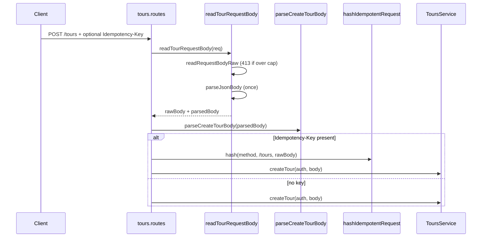

# Tour request parse pipeline — single ingress (DEC-100 / Phase 3 EL-P1)

```yaml
status: implemented
phase: 3 scalability audit — event-loop P1 #4
closes: phase3 event-loop row tours.routes.ts (POST/PATCH duplicate parse)
related: http-request-body-limit.md, http-idempotency.md, http-malformed-json.md
```

## Problem

`POST /tours` and `PATCH /tours/:id` previously duplicated ingress work:

1. Route: `readRequestBodyRaw` → inline `JSON.parse` (later `parseJsonBody`) → `hashIdempotentRequest(rawBody)` on create.
2. Service: `parseCreateTourBody` / `parseUpdateTourBody` (Zod) on the same object tree.

That is **one** `JSON.parse` but **two** full-tree traversals on the event loop before business logic — flagged as Medium in [phase3-scalability-stress-audit.md](../../../apps/api/docs/phase3-scalability-stress-audit.md) (recommended priority **#4**). Create and patch handlers also duplicated the read/parse block.

Idempotency must keep hashing the **untrimmed raw UTF-8 string** from `readRequestBodyRaw` (`SHA-256(method + "\n" + path + "\n" + rawBody)` — see [http-idempotency.md](http-idempotency.md)).

## Decision

| Layer                      | Responsibility                                                                                |
| -------------------------- | --------------------------------------------------------------------------------------------- |
| `readTourRequestBody(req)` | One stream read + one `parseJsonBody` call; returns `{ rawBody, parsedBody }`                 |
| `tours.routes.ts`          | Zod boundary (`parseCreateTourBody` / `parseUpdateTourBody`); idempotency hash from `rawBody` |
| `ToursService`             | Typed `CreateTourBody` / `UpdateTourBody` only — no second schema pass                        |

Syntax errors remain **400 `INVALID_JSON`** via `parseJsonBody` (DEC-092). Size cap remains in `readRequestBodyRaw` (DEC-052).

## Flow (after)



`PATCH /tours/:id` uses the same `readTourRequestBody` helper and `parseUpdateTourBody` at the route; no idempotency hash.

## Implementation map

| File                                           | Role                                                      |
| ---------------------------------------------- | --------------------------------------------------------- |
| `apps/api/src/tours/read-tour-request-body.ts` | Shared `{ rawBody, parsedBody }` ingress                  |
| `apps/api/src/tours/tours.routes.ts`           | Zod + idempotency hash; delegates typed body to service   |
| `apps/api/src/tours/tours.service.ts`          | Accepts validated DTO types; tenant claim check on create |
| `apps/api/src/tours/create-tour.schema.ts`     | Zod schema + `parseCreateTourBody` (route boundary)       |
| `apps/api/src/tours/update-tour.schema.ts`     | Zod schema + `parseUpdateTourBody` (route boundary)       |

## Invariants

| Invariant                                                                          | Why                                                             |
| ---------------------------------------------------------------------------------- | --------------------------------------------------------------- |
| Hash input is `rawBody` from `readRequestBodyRaw`, not re-stringified JSON         | Preserves idempotency fingerprint across whitespace / key order |
| Exactly one `JSON.parse` per request                                               | Event-loop P1 closure                                           |
| Zod runs once at HTTP boundary                                                     | Service tests may still construct valid DTOs directly           |
| Internal / integration callers of `ToursService` must pass shapes that satisfy Zod | Same as pre-refactor objects; only the parse **site** moved     |

## Verification

```bash
cd apps/api
pnpm exec tsc -p tsconfig.json
node --import tsx --test src/tours/read-tour-request-body.spec.ts
node --import tsx --test src/tours/tours.service.spec.ts
node --import tsx --test src/http/http-idempotency.spec.ts
node --import tsx --test test/4-integration/malformed-json-body.spec.ts
pnpm run guard:http-malformed-json
```

| Assertion                                                            | Proves                                 |
| -------------------------------------------------------------------- | -------------------------------------- |
| `readTourRequestBody` returns same `rawBody` as `readRequestBodyRaw` | Hash stability                         |
| `hashIdempotentRequest(..., rawBody)` unchanged vs pre-refactor      | Idempotency contract                   |
| Malformed JSON → 400; valid create → 201                             | DEC-092 + happy path                   |
| Service create with valid DTO                                        | No regression on auth / canonical path |

## Out of scope

- Streaming JSON parser / incremental SHA-256 while reading (future if body cap rises).
- Response `JSON.stringify` cap (event-loop P2).
- Moving Zod into a global middleware — tour-only helper keeps diff minimal.
