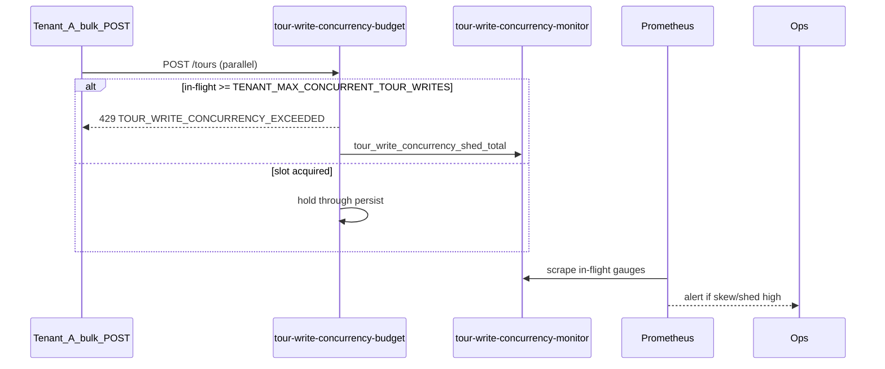

# Tour write concurrency monitor (NN-05 / B3)

```yaml
status: implemented
phase: 3 scalability audit — noisy-neighbor NN-05 residual closure
closes: B3 checklist — alert on bulk POST /tours shed and in-flight skew
mitigated_by: DEC-064, DEC-069
related: tour-write-concurrency.md, victim-slo-bulk-import.md, validation-queue-monitor.md
```

## Problem

DEC-064 caps concurrent in-flight `POST /tours` per tenant (`TENANT_MAX_CONCURRENT_TOUR_WRITES`, default **8**) with **429** `TOUR_WRITE_CONCURRENCY_EXCEEDED`. DEC-069 proves victim SLO under parallel bulk import in trunk specs.

**Residual (NN-05):** No dedicated `/bulk-import` API — sustained concurrent `POST /tours` at RPS cap can still monopolize validation/DB before shed. Operators need **in-flight gauges** and **shed burst alerts** beyond per-request 429.

## Decision

| Knob                                        | Default     | Behavior                                                          |
| ------------------------------------------- | ----------- | ----------------------------------------------------------------- |
| `TOUR_WRITE_IN_FLIGHT_ALERT_TOTAL`          | **20**      | Alert when sum in-flight creates across tenants exceeds threshold |
| `TOUR_WRITE_IN_FLIGHT_ALERT_MAX_PER_TENANT` | **6**       | Alert when any tenant holds ≥75% of default cap (8)               |
| Shed burst alert                            | `> 15` / 5m | `sum(increase(tour_write_concurrency_shed_total[5m]))`            |

### Metrics (Prometheus text via DEC-108)

| Metric                                | Type    | Labels      | Meaning                               |
| ------------------------------------- | ------- | ----------- | ------------------------------------- |
| `tour_write_in_flight_total`          | gauge   | —           | Sum concurrent `POST /tours` handlers |
| `tour_write_in_flight_max_per_tenant` | gauge   | —           | Deepest single-tenant in-flight count |
| `tour_write_tenants_active`           | gauge   | —           | Tenants with ≥1 in-flight create      |
| `tour_write_concurrency_shed_total`   | counter | `tenant_id` | 429 at cap (DEC-064, existing)        |

### Alert rules (DEC-123 extension)

| Alert                                   | Expr                                                        | `for` | Severity |
| --------------------------------------- | ----------------------------------------------------------- | ----- | -------- |
| `AppTourTourWriteInFlightHigh`          | `tour_write_in_flight_total > 20`                           | 5m    | warning  |
| `AppTourTourWriteInFlightSkew`          | `tour_write_in_flight_max_per_tenant > 6`                   | 5m    | warning  |
| `AppTourTourWriteConcurrencyShedBursts` | `sum(increase(tour_write_concurrency_shed_total[5m])) > 15` | 2m    | warning  |

Label `slo: bulk_write_nn05` — pair with `validation_queue_depth_max_per_tenant` and victim SLO nightly artifact.



## Residual (explicit)

| Scenario                                 | Outcome                                          |
| ---------------------------------------- | ------------------------------------------------ |
| Direct `persistNewTourAtomically` bypass | Out of HTTP cap scope — job API deferred Phase 7 |
| Multi-replica                            | In-process semaphore — per-replica cap           |
| Shed → **429**                           | Graceful — not 503                               |

## Verification

```bash
cd apps/api
node --import tsx --test src/http/tour-write-concurrency-monitor.spec.ts
node --import tsx --test test/3-performance/tour-write-concurrency.spec.ts
pnpm run guard:tour-write-concurrency-monitor
pnpm run guard:deploy-phase5-slo-alerts
```
