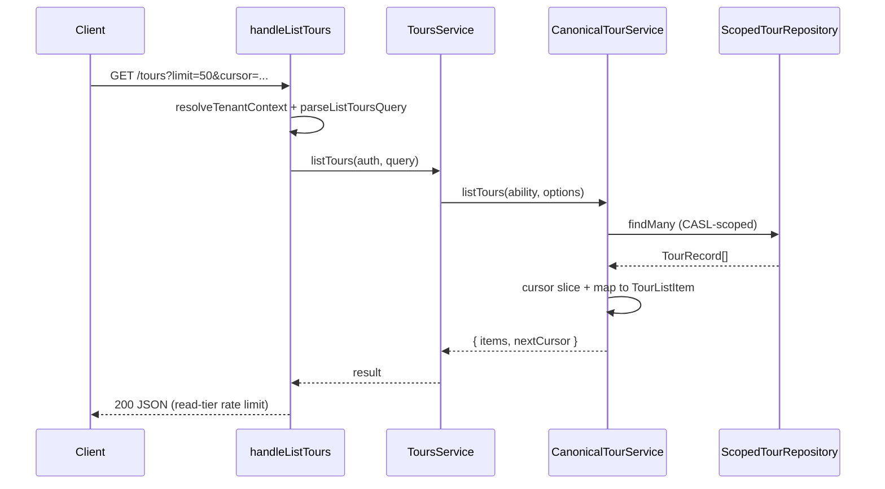

# Tours list endpoint (`GET /tours`)

```yaml
status: implemented
phase: 3 scalability audit — residual probe gap closure
closes: phase3-scalability-stress-audit.md «Next audit triggers: GET /tours list endpoint»
related: http-response-size-budget.md (DEC-129), rate-limiting.md, openapi-dispatch-contract.md (DEC-099)
```

## Problem

Bulk-import victim SLO and noisy-neighbor probes exercised `GET /tours/:id` (full canonical hydrate) but not a **tenant-scoped list** route. Ops dashboards and list UIs need a read-tier index without pulling every canonical document in one response.

Returning full `canonical` per row would violate [DEC-129](http-response-size-budget.md) egress discipline (`JSON.stringify` on N large documents blocks the event loop).

## Decision

| Item           | Choice                                                                                                                  |
| -------------- | ----------------------------------------------------------------------------------------------------------------------- |
| Route          | `GET /tours` — wired in `app.ts` **before** `/tours/:id` regex                                                          |
| Auth           | Same tenant kernel + CASL `read` as `GET /tours/:id`                                                                    |
| Rate limit     | **Read tier** (`rateLimit: "read"`) — independent bucket from write                                                     |
| Response shape | `{ items: TourListItem[], nextCursor: string \| null }` — **no** `canonical` in list rows                               |
| `TourListItem` | `id`, `tenantId`, `createdAt`, `rowVersion`                                                                             |
| Pagination     | Cursor = last seen `id`; storage returns `createdAt` ascending                                                          |
| `limit` query  | Default **50**; max **100** (`HTTP_TOUR_LIST_MAX_LIMIT`)                                                                |
| Storage        | `ScopedTourRepository.listPage()` → `listByTenantPage` with Prisma keyset (`createdAt`, `id`) or in-memory sorted slice |

### Query parameters

| Param    | Required | Default | Max                              | Behavior                                                       |
| -------- | -------- | ------- | -------------------------------- | -------------------------------------------------------------- |
| `limit`  | no       | 50      | `HTTP_TOUR_LIST_MAX_LIMIT` (100) | Invalid / ≤0 → default; above max → clamped                    |
| `cursor` | no       | —       | —                                | Opaque tour `id`; returns rows **after** that id in sort order |

### Request flow



## Implementation map

| File                                               | Role                                           |
| -------------------------------------------------- | ---------------------------------------------- |
| `apps/api/src/tours/list-tours-query.ts`           | Parse `limit` / `cursor`; resolve max from env |
| `apps/api/src/tours/tours.routes.ts`               | `handleListTours`                              |
| `apps/api/src/tours/tours.service.ts`              | `listTours` delegate                           |
| `apps/api/src/canonical/canonical-tour.service.ts` | CASL-scoped list + pagination                  |
| `apps/api/src/app.ts`                              | `GET /tours` dispatch                          |
| `apps/api/src/openapi/dispatch-routes.ts`          | Inventory entry `listTours`                    |
| `apps/api/test/1-functional/tours-list.spec.ts`    | Memory-driver HTTP probes                      |

## Storage pagination (keyset)

`listByTenantPage` fetches **`limit + 1`** rows ordered by `(createdAt asc, id asc)` with keyset cursor on the last seen `id`:

| Layer     | Method                                                                       |
| --------- | ---------------------------------------------------------------------------- |
| Prisma    | `tx.tour.findMany({ where: keysetAfter(cursor), orderBy, take: limit + 1 })` |
| In-memory | Sort tenant rows, slice after cursor index                                   |
| Adapter   | `TourStorageDbAdapter.listPage` → `TourRecord[]`                             |

Invalid or unknown `cursor` → first page (fail-open, same as offset-less APIs).

## Residual / future

| Gap                    | Note                                                                                 |
| ---------------------- | ------------------------------------------------------------------------------------ |
| Filter / status        | Legacy `listTours` had status filters — not ported; add when projection index exists |
| Full canonical in list | Intentionally omitted — use `GET /tours/:id` per row                                 |

## Verification

```bash
cd apps/api
NODE_ENV=test STORAGE_DRIVER=memory node --import tsx --test test/1-functional/tours-list.spec.ts
pnpm run openapi:generate
pnpm run guard:openapi-dispatch-parity
```
