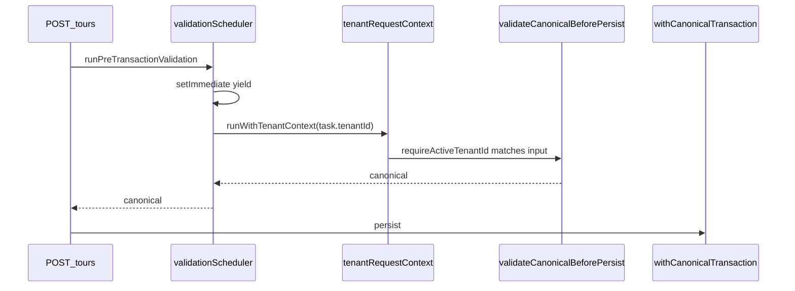
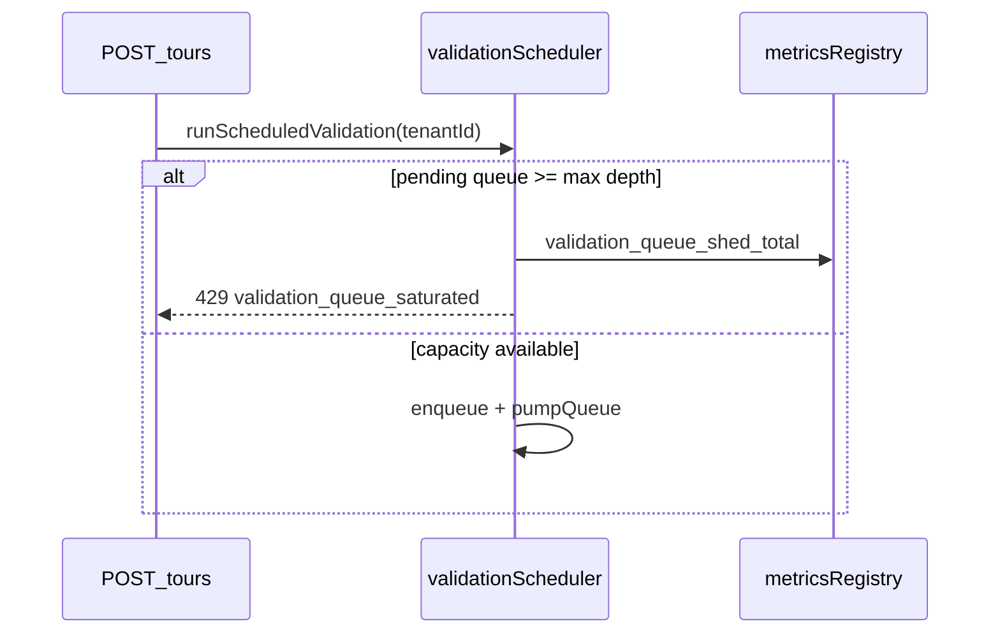

# Validation fairness (DEC-016)

## Problem

RuleEngine validation is CPU-heavy. Before DEC-056, the scheduler yielded between tasks but each task still ran sync validation on the main thread — a tenant burst could monopolize the event loop (`noisy-neighbor-latency.spec.ts`, `service-starvation.spec.ts`).

## Mechanisms

| Layer            | Module                                           | Behavior                                                                                                                                                                                                                                                                                        |
| ---------------- | ------------------------------------------------ | ----------------------------------------------------------------------------------------------------------------------------------------------------------------------------------------------------------------------------------------------------------------------------------------------- |
| **Scheduler**    | `apps/api/src/canonical/validation-scheduler.ts` | Global cap `P5_VALIDATION_MAX_CONCURRENT` (default 4); per-tenant FIFO; **shortest-queue-first** dequeue; `setImmediate` yield between tasks; each `task.run()` executes inside `runWithTenantContext(task.tenantId, …)` so ALS survives async hops (Phase 1 **DM-CT-05** / **BULK-UNSAFE-01**) |
| **Worker pool**  | `validation-worker-pool.ts` (DEC-056)            | `validateCanonicalBeforePersist()` posts to `worker_threads`; pool size `P5_VALIDATION_WORKER_POOL_SIZE`; per-job time budget `P5_VALIDATION_TIME_BUDGET_MS` → **408** + `validation_time_budget_exceeded_total`; disable via `P5_VALIDATION_WORKERS_ENABLED=false`                             |
| **Pre-TX gate**  | `pre-transaction-validation.ts`                  | `runPreTransactionValidation` runs validation **inside** scheduler, then opens per-tenant TX gate (`Map<tenantId>` — HT-03; not process-global scalar); asserts `requireActiveTenantId() === input.tenantId` at validation body entry                                                           |
| **Engine cache** | `canonical-validation.ts`                        | LRU of `PlatformWizardEngine` per `(tenantId, workspaceType, validationVariant)` — sync path `validateCanonicalBeforePersistSync` used inside workers (DEC-030)                                                                                                                                 |

## Tenant ALS invariant (DM-CT-05)

After `setImmediate` yields in the scheduler pump, the active tenant in AsyncLocalStorage must match the queued task's `tenantId`. Without an explicit bind, concurrent validations for Tenant A and B can interleave on the event loop while ALS still reflects whichever HTTP request last resumed — misaligning the pre-TX gate key, downstream `withTenantRls` GUC, and observability enrichment.

| Check      | Where                                 | Rule                                                                                                      |
| ---------- | ------------------------------------- | --------------------------------------------------------------------------------------------------------- |
| ALS bind   | `validation-scheduler.ts` `pumpQueue` | `runWithTenantContext(task.tenantId, () => task.run())` before validation body                            |
| ALS assert | `pre-transaction-validation.ts`       | `requireActiveTenantId()` must equal `input.tenantId.trim()`; else `CANONICAL_VALIDATION_TENANT_MISMATCH` |

Nested bind is safe: HTTP handlers already call `runWithTenantContext(requestTenantId, …)` before `runPreTransactionValidation`; the scheduler re-binds the same tenant id inside the worker callback so ALS is correct even when the outer continuation is not the active store after yield.



## Environment

| Variable                                   | Default | Role                                                                                   |
| ------------------------------------------ | ------- | -------------------------------------------------------------------------------------- |
| `P5_VALIDATION_MAX_CONCURRENT`             | `4`     | Max validations executing at once process-wide                                         |
| `P5_VALIDATION_ENGINE_CACHE_SIZE`          | `8`     | LRU entries for `(workspaceType, variant)` engines                                     |
| `P5_VALIDATION_MAX_IN_FLIGHT_PER_TENANT`   | `2`     | Cap concurrent validations per tenant                                                  |
| `P5_VALIDATION_QUEUE_YIELD_DEPTH`          | `32`    | Extra `setImmediate` yield when tenant queue depth ≥ this                              |
| `P5_VALIDATION_MAX_QUEUE_DEPTH_PER_TENANT` | `64`    | Max **pending** tasks per tenant; shed with **429** when full (DEC-054 / SCAL-DEBT-06) |
| `P5_VALIDATION_WORKER_POOL_SIZE`           | `2`     | Worker threads for RuleEngine CPU offload (DEC-056)                                    |
| `P5_VALIDATION_TIME_BUDGET_MS`             | `10000` | Max wall time per validation job before **408** shed                                   |
| `P5_VALIDATION_WORKERS_ENABLED`            | _(on)_  | Set `false` to run sync on main thread (tests / fallback)                              |

When a tenant's pending queue reaches the cap, `runScheduledValidation` rejects immediately with `VALIDATION_QUEUE_SATURATED` — no new task closures are allocated (closes **NN-04**, **SCAL-HF-04**, **RACE-04**).

When a validation job exceeds the time budget, the worker pool rejects with `VALIDATION_TIME_BUDGET_EXCEEDED` — metric `validation_time_budget_exceeded_total{tenant_id}` (closes **NN-01**, **SCAL-HF-10**).

**Worker script resolution (DEC-056 / gate):** `validation-worker-pool.ts` prefers compiled `dist/canonical/validation-worker-entry.js` when present so worker threads resolve the same module graph as production. Cross-phase verify gate runs `pnpm run build` before `validation-worker-pool.spec.ts`.



## Monitoring (B2 / NN-04)

DEC-054 shed metric (`validation_queue_shed_total`) is extended by [`validation-queue-monitor.md`](validation-queue-monitor.md): `validation_queue_depth_max_per_tenant`, `validation_queue_tenants_pending`, and Prometheus alerts `AppTourValidationQueue*`.

## Probes

```bash
# CPU fairness (memory)
cd apps/api && NODE_ENV=test STORAGE_DRIVER=memory \
  node --import tsx --test test/3-performance/noisy-neighbor-latency.spec.ts

# Scheduler ALS + per-tenant gate isolation (HT-03 / DM-CT-05)
cd apps/api && NODE_ENV=test STORAGE_DRIVER=memory \
  node --import tsx --test test/1-functional/validation-gate-concurrency.spec.ts

# Queue depth cap + shed (DEC-054 / SCAL-DEBT-06)
cd apps/api && NODE_ENV=test STORAGE_DRIVER=memory \
  node --import tsx --test test/3-performance/validation-queue-depth.spec.ts

# Queue depth/skew gauges (B2 / NN-04)
cd apps/api && pnpm run guard:validation-queue-monitor

# Worker pool + time budget (DEC-056 / SCAL-DEBT-02)
cd apps/api && NODE_ENV=test STORAGE_DRIVER=memory \
  node --import tsx --test test/3-performance/validation-worker-pool.spec.ts

# Architectural debt signal (direct sync burst — uses validateCanonicalBeforePersistSync)
cd apps/api && NODE_ENV=test STORAGE_DRIVER=memory \
  node --import tsx --test test/1-reliability/service-starvation.spec.ts
```

**Note:** `service-starvation` calls `validateCanonicalBeforePersistSync` for intentional sync-burst measurement; production `createTour` uses scheduler + worker pool. Default `STARVATION_SYNC_STALL_MIN_GAP_MS=90` (was 100) — avoids trunk flake when compiled validation finishes ~95–99 ms under concurrent gate load while still proving sync monolith debt.

## NN-01 — event-loop CPU / `/health` residual (closure matrix)

| Layer              | Status            | Evidence                                                                                                                                                                                                                                                                                                                                                                                  |
| ------------------ | ----------------- | ----------------------------------------------------------------------------------------------------------------------------------------------------------------------------------------------------------------------------------------------------------------------------------------------------------------------------------------------------------------------------------------- |
| Validation offload | **Done** DEC-056  | `POST /tours` → worker pool when `P5_VALIDATION_WORKERS_ENABLED` (default on)                                                                                                                                                                                                                                                                                                             |
| Queue shed         | **Done** DEC-054  | `VALIDATION_QUEUE_SATURATED` → 429 before enqueue storm                                                                                                                                                                                                                                                                                                                                   |
| Time budget        | **Done** DEC-056  | `VALIDATION_TIME_BUDGET_EXCEEDED` → 408 + metric                                                                                                                                                                                                                                                                                                                                          |
| CPU fairness SLO   | **Nightly**       | `noisy-neighbor-latency.spec.ts` — victim write ≤10% over baseline @ 1000 validation burst (`BASELINE_RATIO_MAX=1.10` default); `phase-5:gate` tier **1.25** in [`baseline-ratio-tiering.md`](baseline-ratio-tiering.md) (CON-06); **not** in blocking `phase-4:resilience-regression-gate`; nightly in [`.github/workflows/api-nightly.yml`](../../../.github/workflows/api-nightly.yml) |
| Victim HTTP SLO    | **Trunk** DEC-069 | `bulk-import-victim-slo.spec.ts` — B login/read under A bulk-import                                                                                                                                                                                                                                                                                                                       |
| Health fast path   | **Trunk** NN-08   | `health-priority-ingress.spec.ts` — `/health` bypasses log/trace/lazy import; **200** during sync validation storm                                                                                                                                                                                                                                                                        |

**Residual (accepted):** `validateCanonicalBeforePersistSync` or a **fully wedged** event loop (no yield) can still inflate `/health` latency. **Monitor (A1):** [`health-probe-latency-monitor.md`](health-probe-latency-monitor.md) — `health_probe_p99_ms`, `health_probe_slow_total`, PrometheusRule `AppTourHealthProbe*`; trunk spec ceiling `HEALTH_PROBE_STORM_P99_CEILING_MS` (default 3000 ms) under sync storm. Sidecar health port remains deferred.

```bash
# NN-01 + NN-08 trunk probes (also in phase-3:regression-gate)
cd apps/api && NODE_ENV=test STORAGE_DRIVER=memory \
  node --import tsx --test --test-force-exit src/boot/health-priority-ingress.spec.ts
```

## Warm engine (P1-5)

Production writes call `getOrCreateValidationEngine(tenantId, workspaceType, variant)` — LRU key `${tenantId}:${workspaceType}:${variant}` (DEC-030). **Not** `PlatformWizardEngine.create` per request. The cold-start probe (`test/3-performance/cold-start-latency.spec.ts`) still measures **fresh** `create` + `tryInit` for serverless worst-case; API hot path uses the LRU cache above.

| Path                  | Engine lifecycle                                                  |
| --------------------- | ----------------------------------------------------------------- |
| `POST /tours` (trunk) | Cached engine per workspace + variant                             |
| Cold-start spec       | Fresh large plugin compile (budget `COLD_START_ENGINE_BUDGET_MS`) |

## Related

- [`IMPLEMENTATION-DECISIONS.md`](IMPLEMENTATION-DECISIONS.md) — DEC-016, DEC-013
- [`rate-limiting.md`](rate-limiting.md) — HTTP-layer throttling (DEC-015)
