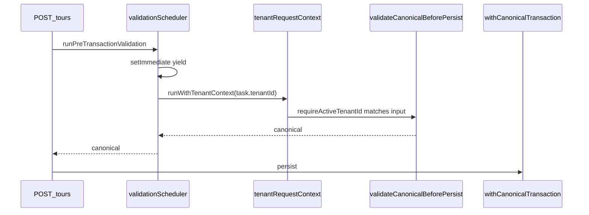

# Validation fairness (DEC-016)

## Problem

`validateCanonicalBeforePersist` runs **synchronously** on the Node event loop. A tenant running thousands of validations can block other tenants' `createTour` writes (`noisy-neighbor-latency.spec.ts`, `service-starvation.spec.ts`).

## Mechanisms

| Layer            | Module                                           | Behavior                                                                                                                                                                                                                                                                                        |
| ---------------- | ------------------------------------------------ | ----------------------------------------------------------------------------------------------------------------------------------------------------------------------------------------------------------------------------------------------------------------------------------------------- |
| **Scheduler**    | `apps/api/src/canonical/validation-scheduler.ts` | Global cap `P5_VALIDATION_MAX_CONCURRENT` (default 4); per-tenant FIFO; **shortest-queue-first** dequeue; `setImmediate` yield between tasks; each `task.run()` executes inside `runWithTenantContext(task.tenantId, …)` so ALS survives async hops (Phase 1 **DM-CT-05** / **BULK-UNSAFE-01**) |
| **Pre-TX gate**  | `pre-transaction-validation.ts`                  | `runPreTransactionValidation` runs validation **inside** scheduler, then opens per-tenant TX gate (`Map<tenantId>` — HT-03; not process-global scalar); asserts `requireActiveTenantId() === input.tenantId` at validation body entry                                                           |
| **Engine cache** | `canonical-validation.ts`                        | LRU of `PlatformWizardEngine` per `(workspaceType, validationVariant)` — immutable rule sets per type (CRIT-STATE-01 waiver)                                                                                                                                                                    |

## Tenant ALS invariant (DM-CT-05)

After `setImmediate` yields in the scheduler pump, the active tenant in AsyncLocalStorage must match the queued task's `tenantId`. Without an explicit bind, concurrent validations for Tenant A and B can interleave on the event loop while ALS still reflects whichever HTTP request last resumed — misaligning the pre-TX gate key, downstream `withTenantRls` GUC, and observability enrichment.

| Check      | Where                                 | Rule                                                                                                      |
| ---------- | ------------------------------------- | --------------------------------------------------------------------------------------------------------- |
| ALS bind   | `validation-scheduler.ts` `pumpQueue` | `runWithTenantContext(task.tenantId, () => task.run())` before validation body                            |
| ALS assert | `pre-transaction-validation.ts`       | `requireActiveTenantId()` must equal `input.tenantId.trim()`; else `CANONICAL_VALIDATION_TENANT_MISMATCH` |

Nested bind is safe: HTTP handlers already call `runWithTenantContext(requestTenantId, …)` before `runPreTransactionValidation`; the scheduler re-binds the same tenant id inside the worker callback so ALS is correct even when the outer continuation is not the active store after yield.



## Environment

| Variable                                 | Default | Role                                                      |
| ---------------------------------------- | ------- | --------------------------------------------------------- |
| `P5_VALIDATION_MAX_CONCURRENT`           | `4`     | Max validations executing at once process-wide            |
| `P5_VALIDATION_ENGINE_CACHE_SIZE`        | `8`     | LRU entries for `(workspaceType, variant)` engines        |
| `P5_VALIDATION_MAX_IN_FLIGHT_PER_TENANT` | `2`     | Cap concurrent validations per tenant                     |
| `P5_VALIDATION_QUEUE_YIELD_DEPTH`        | `32`    | Extra `setImmediate` yield when tenant queue depth ≥ this |

Probe `noisy-neighbor-latency` batches storm enqueue (`VALIDATION_STORM_BATCH_SIZE=8`) to model interleaved HTTP handlers, not a single synchronous monolith.

## Probes

```bash
# CPU fairness (memory)
cd apps/api && NODE_ENV=test STORAGE_DRIVER=memory \
  node --import tsx --test test/3-performance/noisy-neighbor-latency.spec.ts

# Scheduler ALS + per-tenant gate isolation (HT-03 / DM-CT-05)
cd apps/api && NODE_ENV=test STORAGE_DRIVER=memory \
  node --import tsx --test test/1-functional/validation-gate-concurrency.spec.ts

# Architectural debt signal (direct sync burst — not production path)
cd apps/api && NODE_ENV=test STORAGE_DRIVER=memory \
  node --import tsx --test test/1-reliability/service-starvation.spec.ts
```

**Note:** `service-starvation` may still document sync monolith when calling `validateCanonicalBeforePersist` directly; production `createTour` uses the scheduler.

## Warm engine (P1-5)

Production writes call `getOrCreateValidationEngine(tenantId, workspaceType, variant)` — LRU key `${tenantId}:${workspaceType}:${variant}` (DEC-030). **Not** `PlatformWizardEngine.create` per request. The cold-start probe (`test/3-performance/cold-start-latency.spec.ts`) still measures **fresh** `create` + `tryInit` for serverless worst-case; API hot path uses the LRU cache above.

| Path                  | Engine lifecycle                                           |
| --------------------- | ---------------------------------------------------------- |
| `POST /tours` (trunk) | Cached engine per workspace + variant                      |
| Cold-start spec       | Fresh large plugin compile (budget `COLD_START_BUDGET_MS`) |

## Related

- [`IMPLEMENTATION-DECISIONS.md`](IMPLEMENTATION-DECISIONS.md) — DEC-016, DEC-013
- [`rate-limiting.md`](rate-limiting.md) — HTTP-layer throttling (DEC-015)
