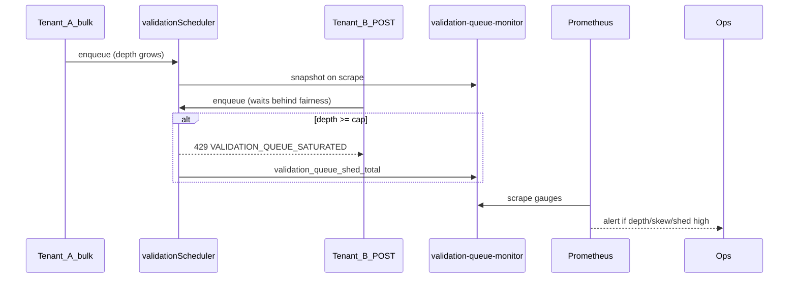

# Validation queue monitor (NN-04 / B2)

```yaml
status: implemented
phase: 3 scalability audit — noisy-neighbor NN-04 residual closure
closes: B2 checklist — alert on deep tenantQueues and shed bursts
mitigated_by: DEC-054, DEC-056
related: validation-fairness.md, admin-pool-read-monitor.md
```

## Problem

DEC-054 caps **pending** tasks per tenant (`P5_VALIDATION_MAX_QUEUE_DEPTH_PER_TENANT`, default **64**) and sheds with **429** `VALIDATION_QUEUE_SATURATED`. Shortest-queue dequeue (DEC-016) limits cross-tenant starvation vs strict FIFO.

**Residual (NN-04):** Tenant A can still hold a **deep pending queue** (up to cap) while global concurrency is low — Tenant B `POST /tours` waits behind scheduler fairness under mixed bulk + write load. Without depth/skew metrics, operators cannot distinguish shed storms from normal 429 rate limits.

## Decision

| Knob                                          | Default     | Behavior                                                            |
| --------------------------------------------- | ----------- | ------------------------------------------------------------------- |
| `VALIDATION_QUEUE_DEPTH_ALERT_TOTAL`          | **200**     | Alert when sum pending across tenants exceeds threshold             |
| `VALIDATION_QUEUE_DEPTH_ALERT_MAX_PER_TENANT` | **50**      | Alert when any single tenant pending depth exceeds (~78% of cap 64) |
| Shed burst alert                              | `> 20` / 5m | `sum(increase(validation_queue_shed_total[5m]))`                    |

### Metrics (Prometheus text via DEC-108)

| Metric                                   | Type    | Meaning                                                      |
| ---------------------------------------- | ------- | ------------------------------------------------------------ |
| `validation_queue_depth_total`           | gauge   | Sum pending validation tasks (existing DEC-108)              |
| `validation_queue_depth_max_per_tenant`  | gauge   | Deepest single-tenant pending queue                          |
| `validation_queue_tenants_pending`       | gauge   | Tenants with pending > 0                                     |
| `validation_queue_in_flight_total`       | gauge   | Validations executing now (≤ `P5_VALIDATION_MAX_CONCURRENT`) |
| `validation_queue_shed_total{tenant_id}` | counter | Shed at cap (DEC-054, existing)                              |

### Alert rules (DEC-123 extension)

| Alert                              | Expr                                                  | `for` | Severity |
| ---------------------------------- | ----------------------------------------------------- | ----- | -------- |
| `AppTourValidationQueueDepthHigh`  | `validation_queue_depth_total > 200`                  | 5m    | warning  |
| `AppTourValidationQueueDepthSkew`  | `validation_queue_depth_max_per_tenant > 50`          | 5m    | warning  |
| `AppTourValidationQueueShedBursts` | `sum(increase(validation_queue_shed_total[5m])) > 20` | 2m    | warning  |

Label `slo: validation_queue_nn04` — pair with `validation_time_budget_exceeded_total` and noisy-neighbor nightly probe.



## Residual (explicit)

| Scenario                 | Outcome                                  |
| ------------------------ | ---------------------------------------- |
| Shed → **429** (not 503) | Graceful — data isolated; user retries   |
| Worker pool disabled     | Sync path — pair with A1 health probe    |
| Single-tenant bulk only  | Depth skew expected — not neighbor issue |

## Verification

```bash
cd apps/api
node --import tsx --test src/canonical/validation-queue-monitor.spec.ts
node --import tsx --test test/3-performance/validation-queue-depth.spec.ts
pnpm run guard:validation-queue-monitor
pnpm run guard:deploy-phase5-slo-alerts
```
