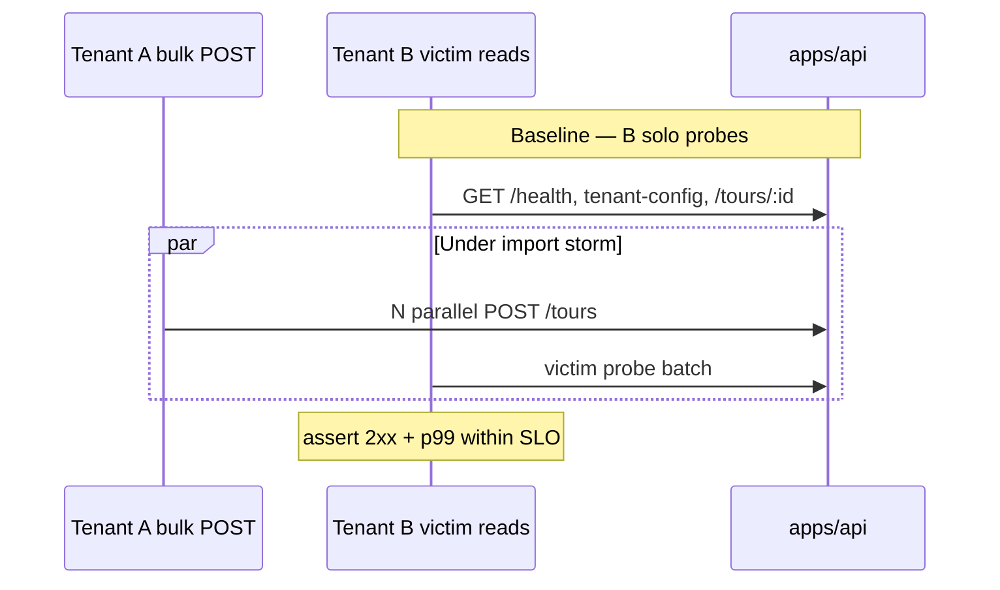

# Victim SLO — bulk import ∥ B login/read (DEC-069 / SCAL-DEBT-13)

```yaml
status: implemented
phase: 3 scalability audit — closure step 18
closes: SCAL-DEBT-13, NN-05 (partial), BULK-01 victim gap
related: noise-neighbor.spec.ts, tenant-rate-limiting.spec.ts
```

## Problem

Existing probes covered read-noise (`noise-neighbor.spec.ts`) and write-burst rate limiting (`tenant-rate-limiting.spec.ts`), but not **Tenant A bulk `POST /tours` ∥ Tenant B login-adjacent reads** (`GET /health`, `GET /api/v2/tenant-config`, `GET /tours/:id`) — the trunk “login/config” path under import storm ([NN-05](../../../apps/api/docs/phase3-scalability-stress-audit.md)).

## Decision

| Item       | Choice                                                                                                                                                                        |
| ---------- | ----------------------------------------------------------------------------------------------------------------------------------------------------------------------------- |
| Spec       | `test/3-performance/bulk-import-victim-slo.spec.ts`                                                                                                                           |
| Attacker A | `BULK_IMPORT_PARALLEL` concurrent `POST /tours` (default **12**)                                                                                                              |
| Victim B   | Parallel probe: health + tenant-config + tour GET                                                                                                                             |
| SLO        | Each victim path p99 ≤ `baseline_p50 × VICTIM_SLO_RATIO` (default **4**), floor `VICTIM_SLO_MIN_BUDGET_MS` (default **500**)                                                  |
| Tier       | Memory driver (`DATABASE_URL` unset — avoids subdomain negative-cache on static fallback); `tenant-a`/`tenant-b` slugs for writes; DEV registry UUID + host for tenant-config |

## Flow



## Environment

| Variable                   | Default | Role                              |
| -------------------------- | ------- | --------------------------------- |
| `BULK_IMPORT_PARALLEL`     | `12`    | Concurrent A creates during probe |
| `VICTIM_BASELINE_SAMPLES`  | `5`     | Solo B rounds before storm        |
| `VICTIM_SLO_RATIO`         | `4`     | p99 ceiling vs baseline p50       |
| `VICTIM_SLO_MIN_BUDGET_MS` | `500`   | Minimum allowed p99 under noise   |

## Verification

```bash
cd apps/api && pnpm run guard:bulk-import-victim-slo
NODE_ENV=test STORAGE_DRIVER=memory node --import tsx --test test/3-performance/bulk-import-victim-slo.spec.ts
```
