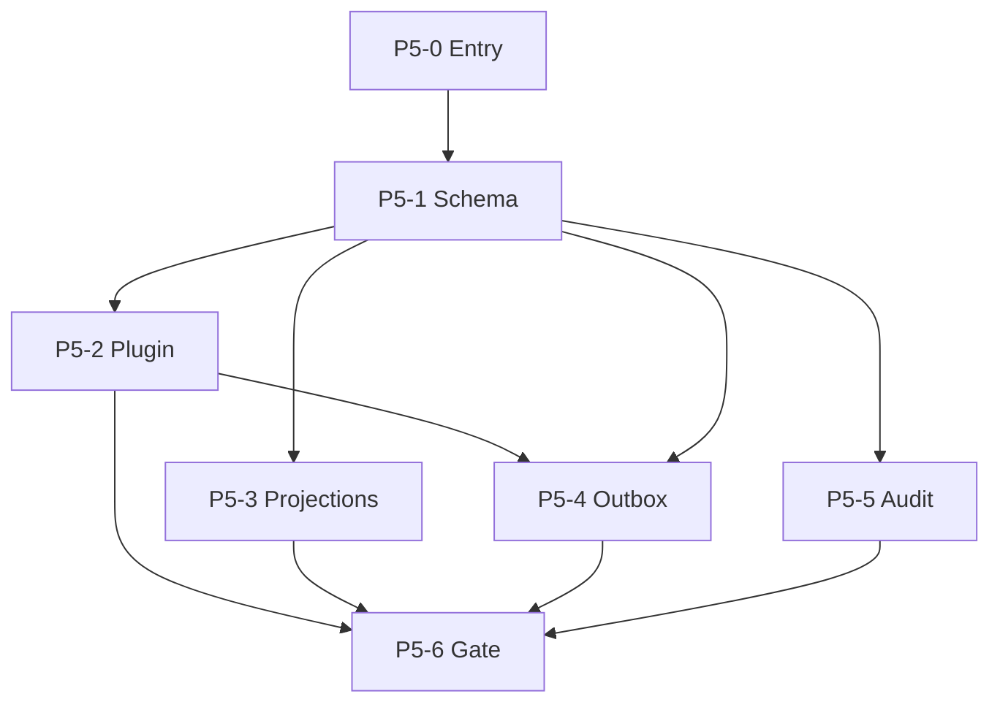

# AI-EXECUTION DOCUMENT — Phase 5 (Layer 1 — Initiator)

> **SOLE EXECUTION ENTRY (agents):** [`phase-5-agent-router.md`](phase-5-agent-router.md) — **do not boot from this file**  
> **Layer:** 1 (initiator skeleton — reference only)  
> **Execution:** [`phase-5-agent-router.md`](phase-5-agent-router.md) only · **layer4:** ARCHIVE stub (T2 lookup — not SoT)  
> **Human research:** [`../research/phase-5-data-architecture-research.md`](../research/phase-5-data-architecture-research.md)  
> **Phase 4 prerequisite:** [`../phase-4/phase-4-enforcement.md`](../phase-4/phase-4-enforcement.md) `phase_5_entry_requires`

```yaml
document_meta:
  layer: 1
  initiator_version: "2026-06-04"
  phase_id: "5"
  phase_name: "Canonical Data Architecture — Data Layer Standard"
  phase_slug: phase-5-data-layer
  adr_id: ADR-005
  adr_status: Proposed
  phase_detection_blocker: null
  fail_token: FAIL
  population_status:
    layer_2_transformer: POPULATED — see modular subphases/
    layer_3_structurer: POPULATED — docs/phase-5/
    layer_4_finalizer: ARCHIVE_STUB — phase-5-ai-exec.layer4.md (T2 only)
  next_agent_action: "Boot phase-5-agent-router.md + BOOT-MANIFEST.yaml; do not initiate from this file"
```

---

## 1. PHASE DETECTION & INITIALIZATION

```yaml
phase_detection:
  phase_id: "5"
  phase_name: "Canonical Data Architecture — Data Layer Standard"
  detected_from:
    - docs/MIGRATION-MAP.md §11 Phase 5 items 5.1–5.5
    - docs/phase-4/phase-4-enforcement.md phase_5_entry_requires
    - docs/research/phase-5-data-architecture-research.md
    - docs/phase-5/phase-5-overview.md
  prerequisite_phase_id: "4"
  prerequisite_gate_command: pnpm run phase-4:gate
  prerequisite_gate_exit_code: 0
  closure_gate_command: pnpm run phase-5:gate
  closure_gate_chain: "pnpm build && pnpm test && pnpm run phase-4:gate && pnpm run phase-5:guard"
  phase_detection_blocker: null
```

| Field                  | Value                                             | Status           |
| ---------------------- | ------------------------------------------------- | ---------------- |
| phase_id               | 5                                                 | PASS             |
| phase_name             | Canonical Data Architecture — Data Layer Standard | PASS             |
| subphase count         | 7 (5.0–5.6)                                       | PASS             |
| ADR                    | ADR-005 Proposed                                  | PASS             |
| Phase 4 entry contract | phase_5_entry_requires                            | PASS — inherited |

**FAIL if:** `phase_id` ≠ 5 or `phase_detection_blocker` non-null.

---

## 2. NORTH STAR & SCOPE (brief — no implementation steps)

```yaml
north_star: >
  Document-centric canonical JSONB SoT per tour + sync relational projections +
  transactional outbox + minimal audit_events + idempotency on pool Postgres with RLS.
explicit_non_goals:
  - platform-wide event sourcing as SoT
  - Denali port, finance tables, MinIO (Phase 6+)
  - TenantConnectionRouter silo, full OTel (Phase 7+)
  - outbox_events at Phase 4 exit (deferred to 5.4)
map_alignment:
  - MAP 5.1 canonical_data JSONB
  - MAP 5.2 plugin validate-before-persist
  - MAP 5.3 sync projections
  - MAP 5.4 transactional outbox
  - MAP 5.5 audit_events minimal
  - MAP §6 TourCreated exit via outbox
  - MAP §12 Phase 5 gate checklist
```

---

## 3. SUBPHASE SKELETON

> **Per-subphase L1 placeholders:** `subphases/*.skeleton.md` (7 files)  
> **Layer 2+ population:** `subphases/5.*.md` (populated) · registry: [`subphases/INITIATOR-PLACEHOLDERS.md`](subphases/INITIATOR-PLACEHOLDERS.md)

| ID  | Name                             | DAG  | Prerequisites                        | Parallel | Goal (brief)                                              | Artifact type          | Exit (initial)              |
| --- | -------------------------------- | ---- | ------------------------------------ | -------- | --------------------------------------------------------- | ---------------------- | --------------------------- |
| 5.0 | Phase 5 Entry Gate               | P5-0 | phase-4:gate, phase_5_entry_requires | no       | Verify Phase 4 closure + Postgres SoT + RLS + event hooks | checklist yaml         | phase_5_entry_verified.yaml |
| 5.1 | Schema canonical_data JSONB      | P5-1 | 5.0, DEL-P5-001                      | no       | JSONB SoT column + migrations + RLS extend                | migration + schema doc | MAP 5.1 migration PASS      |
| 5.2 | Plugin validate before persist   | P5-2 | 5.1                                  | yes†     | Registry resolve plugin; validate before TX               | API test               | MAP 5.2 PASS                |
| 5.3 | Sync projection columns          | P5-3 | 5.1                                  | yes†     | Derived columns same TX; indexed lists                    | query test + script    | MAP 5.3 PASS                |
| 5.4 | Transactional outbox + relay     | P5-4 | 5.1, **5.2**                         | yes‡     | Atomic tour+outbox; SKIP LOCKED relay; TourCreated        | integration test       | MAP 5.4 §6 PASS             |
| 5.5 | Minimal audit_events             | P5-5 | 5.1                                  | yes†     | who/tenant/action/entity audit trail                      | migration + write test | MAP 5.5 PASS                |
| 5.6 | Phase gate + forensic + contract | P5-6 | 5.2–5.5                              | no       | contract spec, adversarial, forensic ≥8, closure gate     | report + spec          | phase_dod PASS              |

† Parallel with 5.2/5.3/5.5 after 5.1 complete  
‡ 5.4 must not start before 5.2

```yaml
subphase_skeleton:
  - id: "5.0"
    dag_node: P5-0
    action_ids_placeholder: ["P5-0-A01".."P5-0-A07"]
    deliverables: []
    blockers: []
  - id: "5.1"
    dag_node: P5-1
    action_ids_placeholder: ["P5-1-A01".."P5-1-A08"]
    deliverables: [DEL-P5-001, DEL-P5-002]
    blockers: [BLOCKER-P5-001]
  - id: "5.2"
    dag_node: P5-2
    action_ids_placeholder: ["P5-2-A01".."P5-2-A05"]
    deliverables: [DEL-P5-003]
    blockers: [BLOCKER-P5-011]
  - id: "5.3"
    dag_node: P5-3
    action_ids_placeholder: ["P5-3-A01".."P5-3-A06"]
    deliverables: [DEL-P5-004, DEL-P5-009]
    blockers: [BLOCKER-P5-004]
  - id: "5.4"
    dag_node: P5-4
    action_ids_placeholder: ["P5-4-A01".."P5-4-A13"]
    deliverables: [DEL-P5-005, DEL-P5-007, DEL-P5-010]
    blockers: []
  - id: "5.5"
    dag_node: P5-5
    action_ids_placeholder: ["P5-5-A01".."P5-5-A03"]
    deliverables: [DEL-P5-006]
    blockers: []
  - id: "5.6"
    dag_node: P5-6
    action_ids_placeholder: ["P5-6-A01".."P5-6-A07"]
    deliverables: [DEL-P5-011, DEL-P5-012, DEL-P5-013]
    blockers: [BLOCKER-P5-002, BLOCKER-P5-003, BLOCKER-P5-005]
```

---

## 4. STATE MODEL (skeleton)

```yaml
state_model:
  current_phase:
    type: enum
    allowed: ["5"]
    initial: "5"
  current_subphase:
    type: enum
    allowed: ["5.0", "5.1", "5.2", "5.3", "5.4", "5.5", "5.6", "DONE"]
    initial: "5.0"
    closed_value: DONE
  subphase_status:
    type: enum
    allowed: [READY, IN_PROGRESS, VALIDATING, COMPLETED, BLOCKED]
  fail_token: FAIL
```

**Populated:** [`phase-5-state-machine.md`](phase-5-state-machine.md)

---

## 5. SUBPHASE DAG (nodes + edges)

```yaml
execution_dag:
  nodes: [P5-0, P5-1, P5-2, P5-3, P5-4, P5-5, P5-6]
  edges:
    - { from: P5-0, to: P5-1, type: hard }
    - { from: P5-1, to: P5-2, type: hard }
    - { from: P5-1, to: P5-3, type: hard }
    - { from: P5-1, to: P5-4, type: hard }
    - { from: P5-1, to: P5-5, type: hard }
    - { from: P5-2, to: P5-4, type: hard, reason: validate-before-persist }
    - { from: P5-2, to: P5-6, type: hard }
    - { from: P5-3, to: P5-6, type: hard }
    - { from: P5-4, to: P5-6, type: hard }
    - { from: P5-5, to: P5-6, type: hard }
  external_prerequisites:
    - DEP-P5-EXT-04: pnpm run phase-4:gate exit 0
    - DEP-P5-EXT-05: phase_5_entry_requires ALL PASS
```



**Populated:** [`appendices/dependency-graph.md`](appendices/dependency-graph.md)

---

## 6. REFERENCE INHERITANCE (Phase 4 → Phase 5)

### 6.1 Phase 4 entry checklist (inherited — not redefined)

```yaml
phase_5_entry_requires:
  source: docs/phase-4/phase-4-enforcement.md
  items:
    - docs/phase-4-tenant-kernel.md sections 8-16 complete
    - pnpm run phase-4:gate exit 0
    - Forensic Phase 4 archived docs/audits/phase-4-zero-debt-forensic-audit.mdoc
    - Postgres SoT tours NOT in-memory default production
    - RLS migration applied all tenant tables
    - Event bus hook points exist outbox table NOT required at Phase 4 exit
  subphase_owner: "5.0"
  req_placeholder: REQ-P5-001 through REQ-P5-006
```

### 6.2 Enforcement ID scheme (aligned with Phase 0–4)

| Layer               | Phase 4 convention          | Phase 5 convention                       | Status                                                                       |
| ------------------- | --------------------------- | ---------------------------------------- | ---------------------------------------------------------------------------- |
| Verification claims | `P4-E-*`                    | `P5-E-*` (initiator placeholders below)  | SKELETON                                                                     |
| Populated rules     | —                           | `RULE-001`–`040`                         | Layer 2+ in [`phase-5-enforcement.md`](phase-5-enforcement.md)               |
| Requirements        | —                           | `REQ-P5-001`–`040`                       | Layer 2+ in [`audits/verification-matrix.md`](audits/verification-matrix.md) |
| Actions             | `P4-*-*-A*` pattern         | `P5-{n}-A{nn}`, `P5-X-A{nn}`             | Layer 2+ subphases                                                           |
| Guards              | `p4_*` in phase-4-guard.mjs | `p5_*` — **BLOCKER** until script exists | BLOCKER-P5-005                                                               |

### 6.3 P5-E-\* placeholders (inherit Phase 4 patterns — populate in Layer 2)

```yaml
enforcement_placeholders:
  - id: P5-E-ENTRY-01
    inherits: phase_5_entry_requires
    phase_4_analog: P4-E-GATE
    subphase: "5.0"
    claim: Phase 4 gate green before Phase 5 work
  - id: P5-E-DATA-01
    inherits: P4-E-DATA-01
    subphase: "5.0"
    claim: Postgres SoT not in-memory production default
  - id: P5-E-RLS-01
    inherits: P4-E-RLS-01
    subphase: "5.0", "5.1"
    claim: Cross-tenant read blocked on tenant tables
  - id: P5-E-EVT-01
    inherits: P4-E-EVT-01
    subphase: "5.4"
    claim: Domain events carry tenantId; outbox row has tenant_id
  - id: P5-E-SCHEMA-01
    subphase: "5.1"
    claim: canonical_data JSONB NOT NULL per tour
  - id: P5-E-VALID-01
    subphase: "5.2"
    claim: validateCanonical before transaction commit
  - id: P5-E-PROJ-01
    subphase: "5.3"
    claim: projections updated in same TX as canonical write
  - id: P5-E-OUTBOX-01
    subphase: "5.4"
    claim: tour write + outbox insert atomic; no publish before commit
  - id: P5-E-AUDIT-01
    subphase: "5.5"
    claim: audit_events minimal write path
  - id: P5-E-GATE
    subphase: "5.6"
    claim: phase-5.contract.spec.ts + phase-5:gate exit 0
    blocker: BLOCKER-P5-002
```

### 6.4 CI / guard template (inherited structure from Phase 4)

```yaml
ci_skeleton:
  prerequisite_gate: pnpm run phase-4:gate
  closure_gate: pnpm run phase-5:gate
  closure_status: BLOCKER
  guard_entrypoint_placeholder: node scripts/guards/phase-5-guard.mjs
  guard_alias_placeholder: pnpm run phase-5:guard
  report_placeholder: reports/phase-5-gate-YYYY-MM-DD.json
  contract_spec_placeholder: packages/<data-layer>/test/phase-5.contract.spec.ts
  pipeline_order_placeholder:
    - phase-4:gate
    - pnpm build
    - pnpm test
    - migration up
    - api integration tests
    - phase-5.contract.spec.ts
    - phase-5:gate
    - guard:architecture
  populated_module: ci.md
```

### 6.5 Verification table format (inherited)

| Column      | Phase 4                | Phase 5                          |
| ----------- | ---------------------- | -------------------------------- |
| ID          | P4-E-\* in enforcement | REQ-P5-\* in verification-matrix |
| Requirement | claim text             | requirement statement            |
| Validation  | mechanism              | validation method + action ref   |
| Pass        | FAIL_if inverted       | pass condition                   |

**Populated:** [`audits/verification-matrix.md`](audits/verification-matrix.md)

### 6.6 Forbidden actions (initial categories — populate in Layer 2)

```yaml
forbidden_categories_skeleton:
  - category: rejected_architecture
    examples: [event_sourcing_sot, dual_write_legacy, publish_before_commit]
    populated: FORBIDDEN-001 through FORBIDDEN-006
  - category: phase_boundary_6
    examples: [denali_port, finance_tables, minio]
    populated: FORBIDDEN-008 through FORBIDDEN-011
  - category: phase_boundary_7
    examples: [silo_router, full_otel]
    populated: FORBIDDEN-012, FORBIDDEN-028, FORBIDDEN-029
  - category: closure_integrity
    examples: [grep_only_closure, done_without_contract]
    populated: FORBIDDEN-017, FORBIDDEN-026
  - category: dag_violations
    examples: [5_6_before_5_2, 5_4_before_5_2]
    populated: FORBIDDEN-018, state_machine guards
```

**Populated:** [`phase-5-enforcement.md`](phase-5-enforcement.md)

---

## 7. DELIVERABLE & ARTIFACT PLACEHOLDERS

```yaml
deliverables_skeleton:
  - id: DEL-P5-001
    name: phase-5-canonical-schema.md
    artifact_type: human_spec + DDL
    blocker: BLOCKER-P5-001
  - id: DEL-P5-002
    name: canonical_data JSONB + migrations
    artifact_type: prisma_migration
  - id: DEL-P5-003
    name: plugin validate-before-persist
    artifact_type: api_test
  - id: DEL-P5-004
    name: sync projections
    artifact_type: migration + query_test
  - id: DEL-P5-005
    name: transactional outbox + relay
    artifact_type: integration_test
  - id: DEL-P5-006
    name: audit_events minimal
    artifact_type: migration + write_test
  - id: DEL-P5-007
    name: idempotency keys
    artifact_type: api_constraint
  - id: DEL-P5-009
    name: projection rebuild script
    artifact_type: ops_script
  - id: DEL-P5-010
    name: operational replay hook
    artifact_type: design_doc_only
  - id: DEL-P5-011
    name: phase-5.contract.spec.ts
    artifact_type: contract_spec
    blocker: BLOCKER-P5-003
  - id: DEL-P5-012
    name: phase-5-forensic-audit report
    artifact_type: forensic_report
  - id: DEL-P5-013
    name: Big-O repository documentation
    artifact_type: doc_audit
```

---

## 8. INITIAL EXIT CRITERIA (per subphase — no step detail)

```yaml
exit_criteria_skeleton:
  "5.0": [phase_5_entry_verified.yaml, phase-4:gate exit 0]
  "5.1": [MAP 5.1 migration PASS, DEL-P5-001 or Architect waiver]
  "5.2": [MAP 5.2 API test PASS]
  "5.3": [MAP 5.3 query test PASS, no JSONB hot-path @>]
  "5.4": [MAP 5.4 + MAP §6 TourCreated outbox test PASS]
  "5.5": [MAP 5.5 audit table + write test PASS]
  "5.6": [contract spec PASS, forensic purity >= 8, phase-5:gate exit 0]
  DONE: [phase_dod hard ALL PASS]
```

---

## 9. BLOCKERS & MANUAL REVIEW FLAGS

| ID             | Field                                      | Impact                                 | Token                          |
| -------------- | ------------------------------------------ | -------------------------------------- | ------------------------------ |
| BLOCKER-P5-001 | `docs/phase-5-canonical-schema.md` missing | 5.1 DDL non-deterministic              | FAIL at 5.1 without waiver     |
| BLOCKER-P5-002 | `pnpm run phase-5:gate` undefined          | 5.6 closure                            | FAIL at 5.6 without waiver     |
| BLOCKER-P5-003 | contract path                              | apps/api/test/phase-5.contract.spec.ts | RESOLVED scaffold              |
| BLOCKER-P5-004 | projection field paths                     | 5.3 derivation                         | BLOCKED until DEL-P5-001       |
| BLOCKER-P5-005 | `p5_*` guard script                        | CI guard binding                       | BLOCKER                        |
| BLOCKER-P5-006 | phase-5-canonical-schema.mdoc              | doc-gate sync                          | BLOCKER                        |
| BLOCKER-P5-007 | dev/CI STORAGE_DRIVER=prisma               | 5.0 postgres_sot                       | PARTIAL — production prisma OK |
| BLOCKER-P5-011 | multi-plugin test waiver                   | RULE-005 full test                     | forensic waiver Phase 5        |

**Full list:** [`appendices/blockers.md`](appendices/blockers.md)

---

## 10. SANITY CHECK (initiator)

```yaml
initiator_sanity:
  every_subphase_has_id_name_dag_goal: PASS
  dag_nodes_complete_P5-0_to_P5-6: PASS
  phase_4_entry_inherited: PASS
  enforcement_scheme_documented: PASS
  no_detailed_implementation_in_this_file: PASS
  modular_subphases_populated: PASS — see subphases/ + phase-5-agent-router.md
  gaps_requiring_manual_review:
    - BLOCKER-P5-001 schema human spec
    - BLOCKER-P5-002 closure gate script
    - BLOCKER-P5-003 package name for contract spec
  result: PASS_WITH_BLOCKERS
```

---

## 11. LAYER PROGRESSION (agent routing)

| Layer | Artifact                                                 | Use when                                         |
| ----- | -------------------------------------------------------- | ------------------------------------------------ |
| 1     | **this file**                                            | Initiate phase; confirm DAG, subphases, blockers |
| 2     | research `.ai-exec` → transformer output                 | Fill actions, REQ rows                           |
| 3     | `docs/phase-5/` modular tree                             | Structure subphases, audits, CI                  |
| 4     | [`phase-5-ai-exec.layer4.md`](phase-5-ai-exec.layer4.md) | ARCHIVE stub — T2 lookup only                    |

```yaml
agent_boot_layer_1:
  step_1: READ phase-5-agent-router.md — confirm phase_id 5
  step_2: FOLLOW appendices/BOOT-MANIFEST.yaml boot_sequence_T0
  step_3: LOAD subphases/{current_subphase}.md from router detection
  fail_token: FAIL
```

---

## 12. MODULAR HUB (populated — do not duplicate here)

| Module      | Path                                                   |
| ----------- | ------------------------------------------------------ |
| Index       | [`phase-5.ai-exec.index.md`](phase-5.ai-exec.index.md) |
| Overview    | [`phase-5-overview.md`](phase-5-overview.md)           |
| State / DAG | [`phase-5-state-machine.md`](phase-5-state-machine.md) |
| Enforcement | [`phase-5-enforcement.md`](phase-5-enforcement.md)     |
| CI          | [`ci.md`](ci.md)                                       |
| Subphases   | [`subphases/`](subphases/)                             |
| Audits      | [`audits/`](audits/)                                   |
| Appendices  | [`appendices/`](appendices/)                           |

---

_End of Layer 1 Initiator — Phase 5_
