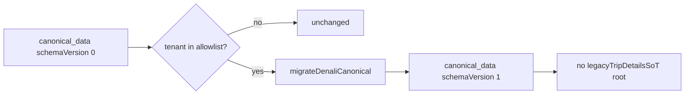

# SUBPHASE 6.8 — migrateCanonical execution

> **DEC-P6-007** · **REQ:** REQ-P6-017

```yaml
subphase: "6.8"
dag_node: P6-8
prerequisites: ["6.5", "6.6"]
enforcement_req_ids: ["REQ-P6-017"]
action_ids: ["P6-8-A01", "P6-8-A02", "P6-8-A03"]
repo_status: VERIFIED_BEHAVIORAL
pr_label: "Phase: 6.8"
dod_ref: phase-6-enforcement.md subphase_dod "6.8"
enforcement_rule_ids: ["RULE-P6-010"]
completion_proof:
  prove_with:
    - pnpm --filter @apps/api exec node --import tsx --test test/migrate-canonical-denali.spec.ts
  prerequisite_status: "6.5 VERIFIED_BEHAVIORAL; 6.6 recommended"
```

## Scope

Execute migration `trip_details` jsonb → `canonical_data` for **controlled** tenants first. Phase 5 left hook throwing `MIGRATE_CANONICAL_NOT_IMPLEMENTED` — Phase 6 implements **plugin + service** path without dual-write.

## Exit criteria

- `migrateCanonical` succeeds on fixture tenants
- Post-migrate: single SoT `canonical_data`
- Rollback runbook documented (one-way migration per tenant flag)

## Forbidden (legacy F7)

- Dual-write SoT (`trip_details` + canonical simultaneously)
- Migration logic spread outside `acl/` + dedicated migrate module

---

## Implementation (2026-06-06)

| Layer    | Path                                                           | Role                                                                                                          |
| -------- | -------------------------------------------------------------- | ------------------------------------------------------------------------------------------------------------- |
| ACL      | `packages/workspaces/denali/src/acl/migrateDenaliCanonical.ts` | `migrateDenaliCanonical(schemaVersion, legacyBlob)` — registry-driven `zodPath` → `canonicalPath`             |
| Hook     | `apps/api/src/canonical/migrate-canonical-hook.ts`             | `resolveMigrateCanonicalHook(workspaceType)` delegates to denali ACL; **not** wired on POST/PATCH write paths |
| Executor | `apps/api/src/canonical/migrate-canonical-denali.service.ts`   | Batch migration for `MIGRATE_CANONICAL_TENANT_IDS` allowlist only                                             |
| Envelope | `legacyTripDetailsSoT` root in `canonical_data`                | Pre-migrate staging only — removed after successful migrate (single SoT)                                      |



**Rollback:** one-way per tenant — restore from backup snapshot; do not re-insert `legacyTripDetailsSoT` alongside migrated rows (RULE-P6-010).

---

## Primary spec: `migrate-canonical-denali.spec.ts`

| Case                                                      | Proves           | REQ                |
| --------------------------------------------------------- | ---------------- | ------------------ |
| Allowlisted tenant migrates trip_details → canonical_data | single SoT after | REQ-P6-017         |
| Non-allowlisted tenant unchanged                          | safety           | REQ-P6-017         |
| No dual-write row state mid-migration                     | RULE-P6-010      | integration assert |

```bash
export MIGRATE_CANONICAL_TENANT_IDS="<test-tenant-uuid>"
pnpm --filter @apps/api exec node --import tsx --test test/migrate-canonical-denali.spec.ts
```

---

## Actions

```yaml
P6-8-A01:
  description: Implement Denali migrateCanonical in plugin exporting hook used by CanonicalTourService
  inputs:
    - apps/api/src/canonical/migrate-canonical-hook.ts
  validation:
    - throws removed for denali workspace_type controlled list

P6-8-A02:
  description: Controlled tenant allowlist env MIGRATE_CANONICAL_TENANT_IDS
  validation:
    - other tenants unchanged

P6-8-A03:
  description: Integration test migrate-canonical-denali.spec.ts — before/after canonical equality
  validation:
    - REQ-P6-017 — no trip_details SoT after migrate
```
