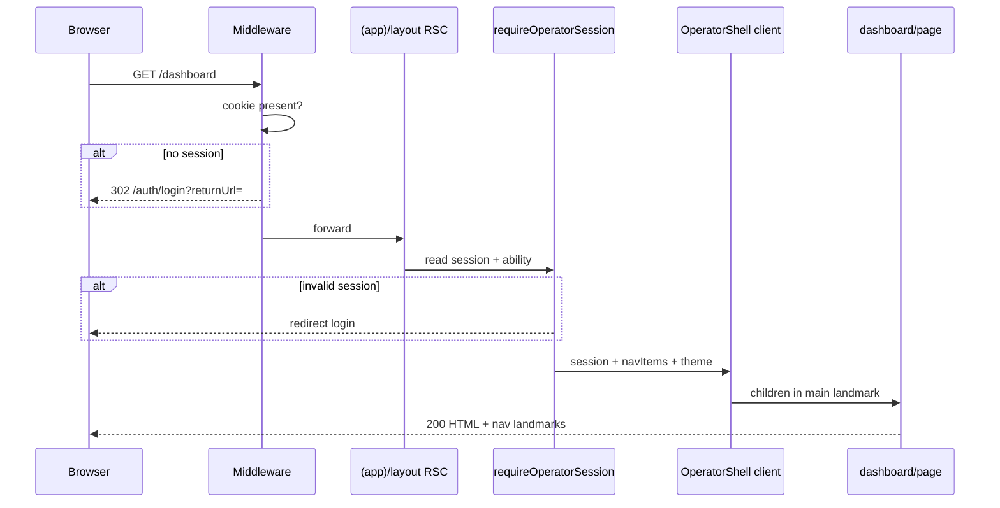

# Phase 9.2 — Operator Admin Shell (UX + implementation architecture)

```yaml
ux_spec_id: ADMIN-SHELL-UX
version: "2026-06-08-v1"
status: LOCKED
decisions: [DEC-P9-001, DEC-P9-007, DEC-P9-008, DEC-P9-013]
subphase: "9.2"
authority: subphases/9.2-admin-shell.md · IMPLEMENTATION-DECISIONS.md
pattern: BOOKINGS-OPS-UX.md (manifest + mobile sheet)
legacy_reference:
  - legacy/apps/web/app/(app)/layout.tsx
  - legacy/apps/web/src/layouts/AppLayout/AppLayout.tsx
  - legacy/apps/web/src/layouts/AppLayout/resolve-workspace-navigation.ts
research:
  - https://ui.shadcn.com/blocks/sidebar-07
  - https://ui.shadcn.com/blocks/dashboard-01
  - https://web.dev/patterns/navigation-menu/
stack:
  styling: CSS Modules + @app-tour/design-tokens (Phase 2 covenant)
  components: "@app-tour/ui-primitives/* subpath-only"
  forbidden: [tailwind, shadcn/ui copy-paste, @tour/ui runtime import]
```

> **Problem:** Phase 9 needs a **production-grade** operator chrome — not an MVP placeholder — with **mobile-first** navigation, RTL support, tenant branding, and CASL-filtered nav. Trunk has no `(app)/` tree; legacy uses `@tour/ui` + CSS Modules. A blind shadcn/Tailwind pivot would break Phase 2 guards and the three-level theme cascade.

---

## 1. Design north star

| Principle                 | Implementation                                                                     |
| ------------------------- | ---------------------------------------------------------------------------------- |
| **Mobile-first**          | Layout authored for `<768px` first; sidebar is progressive enhancement             |
| **Production chrome**     | Full shell with header, nav, account menu, theme toggle — not a stub `<header>`    |
| **Token-driven**          | All colors/spacing from `@app-tour/design-tokens` — no hex in shell CSS            |
| **Subpath primitives**    | `@app-tour/ui-primitives/button`, `/input`, `/badge`, `/alert` — TQ-P9-001         |
| **CASL nav**              | Items filtered by `ability-context` — finance hidden on Urban (ASM-9.2-009)        |
| **Lazy workspace**        | No static `@app-tour/workspace-denali` in layout — dynamic plugin load (CP-9.2-04) |
| **Wizard bridge**         | “New tour” links to `/tours/new` (DEC-P9-007) — same session cookie                |
| **Reference-only shadcn** | Block layouts (sidebar-07, dashboard-01) inform IA — **no** shadcn install         |

---

## 2. Stack analysis — why not shadcn + Tailwind?

### 2.1 Current trunk reality

| Layer            | On trunk today                                                                      |
| ---------------- | ----------------------------------------------------------------------------------- |
| `apps/web`       | `@app-tour/ui-primitives`, `@app-tour/theme-react`, `@app-tour/design-tokens`       |
| Styling          | CSS Modules + semantic CSS variables                                                |
| Guards           | `guard:import-boundary`, `audit-ui-primitives-boundary`, no raw `<input>`           |
| Phase 2 decision | **Tailwind ❌** — [`phase-2-design-system.md`](../../phase-2-design-system.md) §3.1 |

### 2.2 shadcn/Tailwind pivot cost

| Risk                 | Impact                                                                        |
| -------------------- | ----------------------------------------------------------------------------- |
| Dual styling systems | Tailwind utilities + token CSS Modules → drift, larger bundles                |
| Theme cascade break  | Tenant/workspace `--color-primary*` override must reach all surfaces          |
| Guard rewrite        | Barrel ban, primitive boundary, wizard guards all assume Phase 2 stack        |
| RTL                  | shadcn defaults LTR; legacy already uses logical properties — re-prove fa/RTL |
| Timeline             | Shell alone ~1 subphase; full admin (9.2–9.7) migration ~multi-sprint         |

### 2.3 Locked decision (DEC-P9-013)

**Modern mobile-first operator chrome on Phase 2 stack.** shadcn blocks = **layout reference only**. Promote shared primitives (`Card`, `Sheet`, `Avatar`) to `@app-tour/ui-primitives` when **≥3 consumers** exist (9.3+), not before 9.2 closure.

---

## 3. Responsive architecture

### 3.1 Breakpoints

```css
/* Shell module — mobile-first; match legacy 48rem gate */
--shell-breakpoint-md: 48rem; /* 768px */
--shell-sidebar-width: 17.5rem; /* 280px — slightly wider than legacy 260px */
--shell-header-height: 3.5rem; /* 56px — meets --layout-min-tap-target */
--shell-content-max: 90rem; /* 1440px dashboard grid cap */
```

| Viewport               | Chrome pattern                                                                                                |
| ---------------------- | ------------------------------------------------------------------------------------------------------------- |
| **`<768px` (default)** | Fixed top bar · hamburger opens **drawer** (overlay + slide-in nav) · content full-width · safe-area padding  |
| **`≥768px`**           | Persistent **sidebar** · collapsible optional (9.2-R3) · main column scroll · sticky sub-header on long pages |
| **`≥1024px`**          | Dashboard 2-column widget grid · sidebar always visible                                                       |

### 3.2 Mobile wireframe

```text
┌──────────────────────────────────────┐
│ [≡]  Denali Workspace        [👤]   │  ← OperatorHeader (fixed)
├──────────────────────────────────────┤
│                                      │
│   Dashboard / page content           │
│   (scroll, padding --space-4)        │
│                                      │
└──────────────────────────────────────┘

Drawer open (overlay):
┌──────────────┬───────────────────────┐
│ ✕  Nav       │ ░░░ scrim ░░░░░░░░░░░ │
│ Dashboard    │                       │
│ Tours        │                       │
│ Bookings     │                       │
│ Users        │                       │
│ Settings     │                       │
│ Finance *    │                       │
│ ─────────    │                       │
│ Logout       │                       │
└──────────────┴───────────────────────┘
* Finance hidden when ASM-9.2-009 (Urban)
```

### 3.3 Desktop wireframe

```text
┌────────────┬──────────────────────────────────────────────┐
│ Brand      │  Breadcrumb · page title          [theme][👤]│
│────────────│──────────────────────────────────────────────│
│ Dashboard  │                                              │
│ Tours      │   {children}                                 │
│ Bookings   │                                              │
│ Users      │                                              │
│ Settings   │                                              │
│ Finance    │                                              │
│────────────│                                              │
│ + New tour │  → /tours/new (DEC-P9-007)                   │
└────────────┴──────────────────────────────────────────────┘
```

---

## 4. Component tree & file layout

```text
apps/web/
├── app/(app)/
│   ├── layout.tsx                 # RSC · export const dynamic = 'force-dynamic'
│   └── dashboard/
│       ├── page.tsx               # RSC · delegates to client grid
│       └── dashboard-page-client.tsx
├── src/admin/
│   ├── session/
│   │   └── require-operator-session.ts   # server · cookie JWT decode
│   └── shell/
│       ├── operator-shell.tsx            # client chrome wrapper
│       ├── operator-shell.module.css
│       ├── operator-header.tsx           # mobile top bar + desktop strip
│       ├── operator-nav.tsx              # nav list + active state
│       ├── operator-nav.module.css
│       ├── operator-drawer.tsx           # mobile overlay (native <dialog> or div+focus trap)
│       ├── operator-drawer.module.css
│       ├── resolve-operator-nav.ts       # CASL + tenant nav manifest
│       ├── operator-nav.types.ts
│       └── operator-account-menu.tsx     # logout · profile stub
└── lib/auth/
    └── operator-session.ts               # shared types · re-export contract constants
```

### 4.1 Render flow



### 4.2 Landmarks (accessibility — CP-9.2-02)

| Landmark    | Element                        | `data-testid`          |
| ----------- | ------------------------------ | ---------------------- |
| Navigation  | `<nav aria-label="Operator">`  | `operator-nav`         |
| Main        | `<main id="operator-main">`    | `operator-main`        |
| Skip link   | first focusable in shell       | `operator-skip-link`   |
| Mobile menu | `aria-expanded` on menu button | `operator-menu-toggle` |

---

## 5. Navigation resolution

Port semantics from `legacy/.../resolve-workspace-navigation.ts` without runtime legacy import.

### 5.1 Default Denali operator nav (admin/owner)

| pathKey   | href         | Label key       | Visible when                          |
| --------- | ------------ | --------------- | ------------------------------------- |
| dashboard | `/dashboard` | `nav.dashboard` | always                                |
| tours     | `/tours`     | `nav.tours`     | `can('read', 'Tour')`                 |
| bookings  | `/bookings`  | `nav.bookings`  | operator surface                      |
| users     | `/users`     | `nav.users`     | `isAdminOrOwner`                      |
| settings  | `/settings`  | `nav.settings`  | admin settings CASL                   |
| finance   | `/finance`   | `nav.finance`   | Denali + finance module (ASM-9.2-008) |

**Stub routes (9.2-R1):** links render; destination pages return **coming soon** card until 9.3–9.7 land — nav must not 404.

### 5.2 Primary CTA (outside nav list)

| CTA      | href         | Rule                                        |
| -------- | ------------ | ------------------------------------------- |
| New tour | `/tours/new` | DEC-P9-007 — always visible for admin/owner |

### 5.3 Urban workspace

Finance nav item **omitted** (ASM-9.2-009). Settings nav may route to Urban owner surface per INV-P8-007 — detail in 9.6 manifest.

---

## 6. Dashboard (9.2 scope — production skeleton)

Not an empty `<h1>Dashboard</h1>`. Ship a **widget grid** with loading/empty states; data wires in 9.3–9.7.

### 6.1 Layout

```text
┌─────────────────────────────────────────────────────────┐
│ سلام، {firstName} · {workspaceName}                     │
│ Quick actions: [+ تور جدید]  [رزروها (—)]  [کاربران (—)] │
├──────────────────────────┬──────────────────────────────┤
│ Tours snapshot           │ Pending registrations        │
│ (skeleton → 9.3)         │ (skeleton → 9.5)             │
├──────────────────────────┼──────────────────────────────┤
│ Users directory          │ Finance / reconciliation     │
│ (skeleton → 9.4)         │ (hidden Urban · 9.7)         │
└──────────────────────────┴──────────────────────────────┘

Mobile: single column stack — same widgets, full width
```

### 6.2 Widget registry pattern

```typescript
// apps/web/src/admin/dashboard/dashboard-widget-registry.tsx
export type DashboardWidgetId =
  | "tours-snapshot"
  | "registrations-pending"
  | "users-count"
  | "finance-alert";

export function resolveDashboardWidgets(ctx: OperatorDashboardContext): DashboardWidgetDef[];
```

Filters by workspace plugin + CASL — finance widget excluded for Urban.

---

## 7. Session guard & layout contract

### 7.1 `(app)/layout.tsx`

```typescript
export const dynamic = "force-dynamic";

export default async function OperatorAppLayout({ children }: { children: ReactNode }) {
  const session = await requireOperatorSession();
  if (!session) redirect(`/auth/login?returnUrl=${encodeURIComponent("/dashboard")}`);
  return (
    <OperatorShell session={session} navItems={resolveOperatorNav(session)}>
      {children}
    </OperatorShell>
  );
}
```

### 7.2 Completion proofs (extended)

| ID        | Check                                        | Pass                         |
| --------- | -------------------------------------------- | ---------------------------- |
| CP-9.2-05 | Mobile viewport nav toggle opens drawer      | `admin-shell-access.spec.ts` |
| CP-9.2-06 | `≥768px` sidebar visible without toggle      | same spec                    |
| CP-9.2-07 | Dashboard widget grid landmarks              | `dashboard-smoke.spec.ts`    |
| CP-9.2-08 | Finance nav absent on urban fixture          | ASM-9.2-009 test             |
| CP-9.2-09 | New tour CTA href=`/tours/new`               | DEC-P9-007                   |
| CP-9.2-10 | Zero `@app-tour/ui-primitives` barrel import | `guard:import-boundary`      |

---

## 8. Visual language (modern, token-only)

| Element         | Token / rule                                                                                                   |
| --------------- | -------------------------------------------------------------------------------------------------------------- |
| Page background | `--color-bg-page`                                                                                              |
| Sidebar surface | gradient: `color-mix(in srgb, var(--color-bg-surface) 94%, var(--color-primary) 6%)`                           |
| Active nav item | `--color-primary` bg 12% mix + `--color-primary` text                                                          |
| Cards           | `--color-bg-surface`, `--radius-lg`, `--color-border-subtle`                                                   |
| Focus rings     | `--color-focus-ring`, `--focus-outline-width`                                                                  |
| Typography      | `--text-h4-size` brand · `--text-body-size` content                                                            |
| RTL             | logical properties (`margin-inline-start`, `inset-inline-start`) — **no** physical `left`/`right` in shell CSS |
| Dark mode       | `ThemeProviderChain` — header theme toggle when tenant allows                                                  |

**Anti-patterns (FAIL review):**

- Raw hex colors in shell CSS
- `@tour/ui` or `legacy/` imports
- Static `workspace-denali` in layout
- Tailwind class strings in new admin files

---

## 9. Implementation rounds

| Round       | Deliverables                                                    | Proof                          |
| ----------- | --------------------------------------------------------------- | ------------------------------ |
| **S9.2-R0** | This doc · DEC-P9-013 · traceability                            | `phase-9:guard`                |
| **S9.2-R1** | `(app)/layout` · `OperatorShell` · nav · drawer · session guard | WEB-9.2-01..03 · CP-9.2-01..04 |
| **S9.2-R2** | Dashboard client · widget registry · stub pages for nav targets | CP-9.2-05..07 · REQ-P9-020     |
| **S9.2-R3** | Theme branding hydrate · account menu · workspace switcher stub | ASM-9.2-012 · CP-9.2-08..10    |

**Prerequisite:** 9.1 session cookie + BFF login (DEC-P9-012) must be green before S9.2-R1 merge.

---

## 10. ui-primitives promotion backlog (post-9.2)

| Primitive           | First use         | Promote when         |
| ------------------- | ----------------- | -------------------- |
| `Card` / `CardBody` | dashboard widgets | 9.3 tours list       |
| `Sheet` / `Drawer`  | mobile nav        | 9.5 inspection panel |
| `Avatar`            | account menu      | 9.4 users directory  |
| `Skeleton`          | widget loading    | 9.3 data fetch       |

Implement in `apps/web/src/admin/` with CSS Modules until promotion criteria met.

---

## 11. Verification bundle

```bash
pnpm --filter @apps/web exec node --import tsx --test test/admin-shell-access.spec.ts
pnpm --filter @apps/web exec node --import tsx --test test/dashboard-smoke.spec.ts
pnpm run guard:import-boundary
pnpm run phase-9:guard
```

---

## 12. Cross-references

| Artifact                                                                       | Role                      |
| ------------------------------------------------------------------------------ | ------------------------- |
| [`DEC-P9-013`](IMPLEMENTATION-DECISIONS.md)                                    | Stack + mobile-first lock |
| [`TRACEABILITY-MATRIX-9.2.md`](TRACEABILITY-MATRIX-9.2.md)                     | REQ ↔ spec ↔ test         |
| [`CASL-OPERATOR-SPEC.md`](CASL-OPERATOR-SPEC.md)                               | Nav ability rules         |
| [`CANLOAD-OPERATOR-SESSION.contract.ts`](CANLOAD-OPERATOR-SESSION.contract.ts) | Session constants         |
| [`erip/9.2-cop-admin-shell.md`](erip/9.2-cop-admin-shell.md)                   | COP failure modes         |
