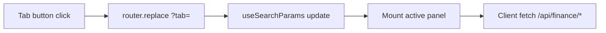
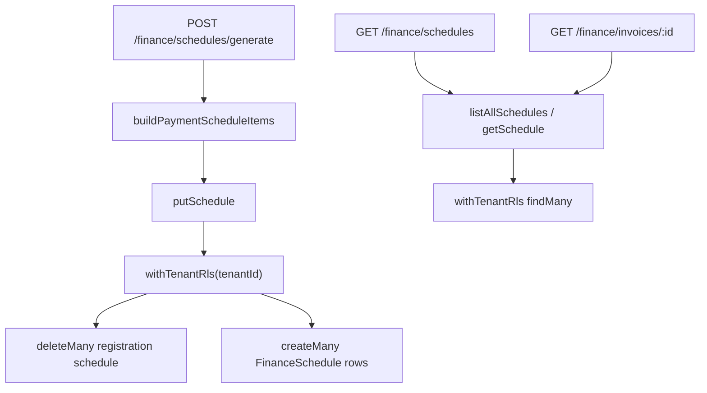

# Phase 9.7 — Finance Command Center (Operator UX + ledger architecture)

```yaml
ux_spec_id: FINANCE-OPS-UX
version: "2026-06-08-v1"
status: LOCKED
decisions: [DEC-P9-002, DEC-P9-008, DEC-P9-013, DEC-P9-016, DEC-P9-017]
subphase: "9.7"
scope: "Denali finance operator surfaces — payments, prepayment, installments, ledger, reconciliation"
authority: subphases/9.7-finance-denali.md · finance-api-dispatch-addendum.md · phase-6/subphases/6.4-finance-slice.md
pattern: BOOKINGS-OPS-UX.md · USERS-DIRECTORY-UX.md · ADMIN-SHELL-UX.md
legacy_reference:
  - legacy/apps/web/app/(app)/finance/
  - legacy/apps/web/app/(app)/settings/reconciliation-triage/
  - legacy/apps/web/app/(app)/dashboard/finance-workspace-summary-card.tsx
  - legacy/apps/api/src/modules/finance/
  - legacy/apps/api/src/modules/payments/
  - legacy/packages/shared-contracts/src/finance/finance.schemas.ts
  - legacy/apps/api/docs/AUTHORITATIVE-FINANCIAL-CUTOVER.md
trunk_baseline:
  - packages/workspaces/denali/src/finance/
  - packages/workspaces/denali/src/finance/finance-ops-manifest.ts
  - apps/api/src/denali-finance/
  - apps/web/app/finance/
  - apps/web/src/finance/finance-nav-access.ts
  - infra/sql/008_finance_payments_delta.sql
  - docs/phase-6/subphases/6.4-finance-slice.md
forbidden:
  - apps/api/src/modules/finance/** # P9-F-008
  - packages/workspaces/urban/** finance hooks # INV-P9-006
```

> **Problem:** Finance must become one of the **most capable** operator surfaces — prepayment, manual/online payments, installment schedules, receipt review, ledger audit, reconciliation triage — not a two-panel MVP. Legacy already runs pricing, booking wallet, double-entry ledger outbox, and reconciliation; trunk has **Phase 6 outbox slice + R1 partial** (API + placeholder UI). Phase 9.7 documents **progressive delivery** with **mobile-first** UX and architectural headroom so installments land without rewriting the payment spine.

---

## 1. Product north star

| Principle                  | Implementation                                                                                                     |
| -------------------------- | ------------------------------------------------------------------------------------------------------------------ |
| **Command center**         | Tabbed finance hub — **R1 interim:** `app/finance` (DEC-P9-017) · **target:** `(app)/finance` when 9.2 shell lands |
| **Money spine integrity**  | All journals via `finance.ledger.double_entry_applied` outbox (Phase 5/6) — no shadow ledger                       |
| **Prepayment first-class** | Booking wallet credits (`registration_prepayment_*`) visible in UI and registration detail                         |
| **Installments planned**   | Schedule contract + API stubs in 9.7-R2; full UX in 9.7-R3 — schema locked now                                     |
| **Manifest-driven panels** | `FinanceOpsManifest` in Denali plugin — workspace toggles panels without core edits                                |
| **Minor units only**       | Amounts as integer minor strings end-to-end (IRR rials / USD cents)                                                |
| **Denali-only**            | Urban tenants: nav hidden · routes 404 (INV-P9-006)                                                                |
| **Admin/owner + module**   | `enabled_modules` includes `finance` + `isAdminOrOwner` (DEC-P9-015)                                               |
| **Mobile-first**           | KPI strip + card queues on `<768px`; tables progressive enhancement (DEC-P9-013)                                   |

---

## 2. Gap analysis (audit 2026-06-08)

### 2.1 Documentation (resolved S9.7-R0)

| Artifact                           | Status                            |
| ---------------------------------- | --------------------------------- |
| `9.7-finance-denali.md`            | **expanded** — rounds · CP matrix |
| `FINANCE-OPS-UX.md`                | **LOCKED** — master spec          |
| `finance-api-dispatch-addendum.md` | **v2** — full route catalog       |
| `TRACEABILITY-MATRIX-9.7.md`       | **LOCKED**                        |
| `FINANCE-RISK-REGISTER-P9.md`      | **LOCKED**                        |
| `DEC-P9-016`                       | progressive finance architecture  |
| JSON schemas                       | summary · payment-schedule item   |

### 2.2 Runtime (trunk) — `PARTIAL_R1` (sync 2026-06-08)

| Layer                                  | R1 trunk                                                                                           | Gap                                                |
| -------------------------------------- | -------------------------------------------------------------------------------------------------- | -------------------------------------------------- |
| Finance hub (interim)                  | ✅ placeholder [`apps/web/app/finance/`](../../../../apps/web/app/finance/) · nav gate · tab shell | Live API wiring · migrate to `(app)/finance` (9.2) |
| Finance reports API                    | ✅ [`apps/api/src/denali-finance/`](../../../../apps/api/src/denali-finance/)                      | Redis summary cache                                |
| Manual payment + receipts              | ✅ + [`finance-ops.spec.ts`](../../../../apps/api/test/finance-ops.spec.ts)                        | MinIO file upload (R1 uses `fileKey` body)         |
| `(app)/settings/reconciliation-triage` | ✅ R1 findings board (summary + schedules)                                                         | Ledger adjust + legacy findings adapter (R4)       |
| Booking wallet / prepayment UI         | ❌                                                                                                 | registration financial panel (R2)                  |
| Installment schedules                  | ✅ Prisma `FinanceSchedule` + RLS (`finance_schedules`) · generate/list/invoice read              | waive / mutate item APIs (R3 stretch)              |
| Phase 6 outbox consumer                | ✅                                                                                                 | TourCreated → ledger hook                          |
| Dashboard finance widget               | ✅ [`finance-dashboard-widget.tsx`](../../../../apps/web/src/finance/finance-dashboard-widget.tsx) | —                                                  |
| `finance.schemas.ts` (legacy)          | reference                                                                                          | Port to trunk contracts when wiring                |

### 2.3 Legacy parity inventory

| Feature                   | Legacy                                     | 9.7 target                                        |
| ------------------------- | ------------------------------------------ | ------------------------------------------------- |
| Finance page              | receipt review + upload panels             | **Command center** superset                       |
| Dashboard widget          | summary KPIs + ledger count                | same + link to hub                                |
| GET reports/summary       | pending manual · receipts · paid/failed    | same                                              |
| GET reports/open-payments | manual pending list                        | same + filters                                    |
| GET reports/ledger-events | outbox-derived lines                       | same + registration link                          |
| POST manual payment       | operator creates debt row                  | same + booking context                            |
| POST receipt upload       | member/operator proof                      | same                                              |
| PATCH receipt review      | approve/reject → ledger                    | same                                              |
| Reconciliation triage     | settings explorer                          | same + finance hub link                           |
| Invoice read model        | paid vs balance due                        | expose on registration + installments             |
| Pricing engine            | registration quote                         | **read-only** in finance — mutate in booking flow |
| Prepayment ledger events  | `registration_prepayment_received/cleared` | surface in ledger tab                             |

---

## 3. Domain architecture

### 3.1 Payment spine (authoritative)

```text
Registration quote (pricing engine)
        │
        ▼
BookingPriceSnapshot (immutable at booking time)
        │
        ├──► InvoiceReadModel ──► invoiceTotalMinor · paidAmountMinor · balanceDueMinor
        │
        ├──► PaymentIntent[] (Online | Manual) ──► PSP or manual debt
        │         │
        │         └──► PaymentReceipt[] (Manual proof) ──► review ──► Paid
        │
        ├──► BookingWallet (ledger projection: booking:{registrationId})
        │         │
        │         └──► prepayment credits / clears (leader/operator PATCH)
        │
        └──► PaymentSchedule (9.7-R2+) ──► InstallmentItem[] due dates + amounts
                    │
                    └──► each installment links to PaymentIntent or wallet credit

All money mutations ──► BookingLedgerAuthority / PaymentCaptureAuthority
        │
        └──► finance.ledger.double_entry_applied (Phase 5 outbox)
```

**Forbidden:** duplicate ledger tables · in-memory shadow balances · Nest `modules/finance` tree on trunk.

### 3.2 Prepayment semantics

| Concept             | Definition                                                                               |
| ------------------- | ---------------------------------------------------------------------------------------- |
| **Prepayment**      | Credit to `booking:{registrationId}` wallet before invoice fully settled                 |
| **Ledger kind**     | `registration_prepayment_received` · `registration_prepayment_cleared`                   |
| **UI visibility**   | Registration financial strip + finance hub «Prepayments» queue                           |
| **Operator action** | Record prepayment (amount minor + method + note) → ledger outbox                         |
| **Balance math**    | `paidAmountMinor = min(walletNet, invoiceTotalMinor)` · `balanceDueMinor = total − paid` |

Port: `compile-invoice-balances.ts` · `booking-ledger-authority.service.ts` (legacy reference).

### 3.3 Installment schedule (forward design — DEC-P9-016)

Legacy has **no** first-class installment UI; product requires it in Phase 9 stretch goals.

```typescript
/** Locked contract — rows persist as Prisma FinanceSchedule (finance_schedules) under withTenantRls */
export type InstallmentItemStatus =
  | "scheduled" // future due date
  | "due" // due date reached · unpaid
  | "partial" // wallet credit < installment amount
  | "paid" // settled
  | "overdue" // past grace period
  | "waived"; // operator waiver + audit

export type PaymentScheduleItem = {
  id: string;
  registrationId: string;
  sequence: number; // 1..n (0 = deposit/prepayment slot optional)
  label: string; // e.g. "پیش‌پرداخت" · "قسط ۲"
  dueAt: string; // ISO date
  amountMinor: string;
  paidMinor: string;
  status: InstallmentItemStatus;
  linkedPaymentId?: string;
  graceDays?: number;
};
```

**Schedule sources (manifest):**

| Source                     | Use                                                         |
| -------------------------- | ----------------------------------------------------------- |
| Tour `paymentPlanTemplate` | Default deposit % + N installments (settings 9.6 extension) |
| Operator override          | Custom schedule on manual booking create (9.5)              |
| Auto-deposit               | First row = prepayment due at registration approve          |

**Rules:**

- Sum(installments) + discounts = `invoiceTotalMinor` (tolerance 0 — integer minor).
- Prepayment row may be paid before approval completes.
- Overdue triggers dashboard badge + optional notification hook (outbox — not email in 9.7 MVP).

Schema: [`schemas/PAYMENT-SCHEDULE-ITEM.schema.json`](schemas/PAYMENT-SCHEDULE-ITEM.schema.json).

---

## 4. Progressive delivery (9.7 rounds)

| Round       | Scope                                                                                                        | 9.8 gate required?                   |
| ----------- | ------------------------------------------------------------------------------------------------------------ | ------------------------------------ |
| **S9.7-R0** | Doc pack · DEC-P9-016 · traceability                                                                         | yes (doc)                            |
| **S9.7-R1** | Legacy parity: finance page · reports API · manual pay · receipts · dashboard widget · reconciliation triage | **yes**                              |
| **S9.7-R2** | Prepayment recording API · booking wallet panel · `PaymentSchedule` persistence · schedule generator | **in progress** — trunk API + web tabs |
| **S9.7-R3** | Installments tab · overdue queue · bulk remind · tour payment plan template (settings)                       | stretch                              |
| **S9.7-R4** | Ledger explorer · export CSV · advanced reconciliation KPIs                                                  | stretch                              |

**Maneuver rule:** R1 must not block on installment tables — schedule tables migrate independently (`008_finance_schedule_delta.sql`).

---

## 5. Finance Command Center — information architecture

> **Route (DEC-P9-017):** Trunk R1 ships at `/finance` (`apps/web/app/finance/`). Target after 9.2 admin shell: `(app)/finance` — same tab model, new route group.

```text
/finance  (interim — apps/web/app/finance/)
  ?tab=overview      ← default · KPI + alerts
  ?tab=payments      ← open + historical payments
  ?tab=receipts      ← review queue (admin)
  ?tab=prepayments   ← booking wallet credits (R2)
  ?tab=installments  ← schedule board (R3)
  ?tab=ledger        ← outbox journal browser

(app)/finance        ← target path when 9.2 (app)/ layout lands

(app)/settings/reconciliation-triage   ← linked from overview · manage Reconciliation

(app)/bookings/[id]                    ← financial strip embed (9.5 integration)
```

### 5.0 Tab shell — client URL sync (no full reload)

Finance hub tabs must **not** remount the RSC page on every tab click.

| Concern | Rule |
| ------- | ---- |
| **Server `page.tsx`** | Session + workspace gate only. No `searchParams`-driven prefetch; panels load via BFF on the client. |
| **Active tab** | `useSearchParams().get("tab")` → `parseFinanceTab` inside `finance-command-center.tsx`. |
| **Tab control** | `<button type="button">` + `router.replace(pathname + ?tab=, { scroll: false })` — never raw `<a href="/finance?tab=…">` (that forces a full App Router navigation + `force-dynamic` re-render). |
| **Default** | Omit `tab` (or unknown value) → `overview`; `replace` deletes `tab` when selecting overview. |
| **Deep links** | Overview / reports / triage may still use `Link`/`href` to `?tab=…`; soft nav is fine because the server page no longer blocks on tab-scoped fetches. |
| **Panel data** | Each panel self-fetches when mounted (`initial*` optional). Tab switch = client remount of that panel only, not a document refresh. |
| **Manifest panels (Phase A/D)** | Visible tabs = `FinanceOpsManifest.panels` (`DEFAULT_FINANCE_OPS_MANIFEST` until theme merge lands). Phase D Denali default **shows** `installments` (board + generate only; no waive/record stubs). Deep-link to a disabled tab falls back to `overview`. |
| **Client import boundary** | Operator web must import `@app-tour/workspace-denali/host/finance/manifest` only. The full `host/finance` barrel includes `postDoubleEntryJournal` (`node:crypto`) and must stay server/outbox-side — otherwise Next webpack fails with `UnhandledSchemeError: node:crypto`. |
| **Booking deep link (Phase A)** | `registrationId` === booking id → `financeBookingHref` → `/bookings?bookingId=` (DEC-P9-011 alias). |
| **Admin receipt fileKey (Phase A)** | Operator submit-by-`fileKey` is **advanced/hidden**; members upload in portal; admin reviews on Receipts tab. |



### 5.0b Registration context projection (Phase B)

Operator list rows must show **human identity** without embedding Denali tour schema into `Payment`.

| Concern | Rule |
| ------- | ---- |
| **Shape** | Optional `registrationContext` on list items: `{ registrationId, tourId, tourTitle, memberDisplayName }` |
| **Source** | Batch load from bookings/`operator_registration` via `getByIds(tenantId, ids)` — fields already on booking (`tourTitle`, `guestLabel`) |
| **Tenant** | Lookup **only** inside bookings RLS (`withTenantRls`). Missing/cross-tenant id → omit context (never leak other tenant titles) |
| **Canonical service** | Enrich in `apps/api/src/workspace-finance` only (not dual-write `denali-finance`) |
| **HTTP** | Denali handlers stay thin; optional query `registrationId` (UUID) filters list to that booking after tenant-scoped read |
| **Backward compatible** | Clients must accept items **without** `registrationContext` |
| **UI** | Show `tourTitle` + `memberDisplayName` primary; UUID + booking deep-link secondary |

```typescript
export type FinanceRegistrationContext = {
  readonly registrationId: string;
  readonly tourId: string;
  readonly tourTitle: string;
  readonly memberDisplayName: string; // booking.guestLabel
};
```

### 5.0c Operator workflow without raw UUID (Phase C)

| Concern | Rule |
| ------- | ---- |
| **Registration picker** | Forms use search against existing `GET /api/bookings` (ops view, same session). **No** new search endpoint. |
| **Invoice card** | Balance from `GET /api/finance/invoices/{registrationId}` only — UI must not recompute paid/due. |
| **Payments list scope** | Hub list remains **manual payments** (API `method: Manual`); UI label + optional client status filter. Expanding to all methods needs separate API/doc change. |
| **Decision guide** | Short copy on hub: when to use manual payment vs prepayment vs installments. |

### 5.1 Tab: Overview

| Zone          | Content                                                                         |
| ------------- | ------------------------------------------------------------------------------- |
| KPI strip     | pending manual · pending receipts · overdue installments (R3) · paid payments   |
| Attention samples (Phase E) | Up to **3** enriched rows (tour/member via `registrationContext`) drawn from overdue installments → pending receipts → pending manual — deep-link to the matching tab |
| Recent ledger | last 5 `finance.ledger.*` events                                                |
| Quick actions | create manual payment · **link** to `/settings/reconciliation-triage` (Phase E1 — triage stays in Settings; do **not** relocate without Architect + outbox-backed adjust) |

### 5.2 Tab: Payments

| Feature | Detail                                                                                     |
| ------- | ------------------------------------------------------------------------------------------ |
| Filters | status · method · date range · registrationId                                              |
| Row     | amount · currency · method badge · status · registration link                              |
| Actions | view detail · upload receipt (manual pending) · refund stub (read-only until gateway port) |

### 5.3 Tab: Receipts (review queue)

Port `AdminReceiptReviewPanel` — approve/reject with note · **image/PDF proof preview** · submitted-at timestamp · ledger confirmation toast.

**Operator review row (2026-07-17):**

| Element | Source |
| ------- | ------ |
| Amount · registrationId | `payment` on pending receipt |
| **زمان ارسال فیش** | `receipt.createdAt` (labeled; when member posted the proof) |
| **پیش‌نمایش فیش** | `GET /api/finance/receipts/{id}/url` → image `` when URL is browser-reachable + image `fileKey`; else filename + unavailable hint |
| Open proof | Same-origin `/api/finance/receipts/{id}/file` (proxies MinIO presigned bytes) |
| Approve / Reject | existing `PATCH …/review` |
| **Booking payment projection (locked)** | On **approve**, **one** tenant RLS Prisma transaction (`withTenantRls` → `prisma.$transaction`) must atomically: (1) mark finance payment `Paid`, (2) raise booking `paymentStatus` → `paid` on `operator_registrations`, (3) set receipt `Approved`, (4) **last** enqueue `finance.ledger.double_entry_applied` via `enqueueOutboxEvent(tx, …)` (**transactional outbox**). If step 2 misses/fails, the TX **rolls back** — payment stays `Pending`, receipt stays `Pending`, no outbox row. Map miss → `409` `FINANCE_BOOKING_PAYMENT_SYNC_MISS`; other booking errors → `409` `FINANCE_BOOKING_PAYMENT_SYNC_FAILED`. Soft-fail/`console.warn`-only sync and multi-step compensate-after-commit are **forbidden** on the Prisma approve path. Memory-driver tests may simulate the same fail-closed order without a real SQL TX. Reject does not change booking payment. Prepayment soft-sync uses injected `IBookingPaymentPort.syncStatus` (never `getBookingsRepository()` inside `FinanceService`). |
| **Review response contract** | Successful approve JSON includes `bookingPaymentStatus: "paid"` (plus existing receipt fields). BFF `PATCH /api/finance/receipts/{id}/review` passes this through; operator receipts UI calls `router.refresh()` after success so Bookings Command Center / linked surfaces re-read `paid`. |

**Registration link labels (locked):** Finance rows must not present a raw UUID as the primary affordance. Prefer `registrationContext` (tour title + member). Link text = localized “Open booking” (or member · tour); UUID may appear only as `title`/tooltip for ops.
**Upload (member):** Portal BFF forwards **file bytes** to `POST /bookings/{id}/receipts` → MinIO `receipts/{tenantId}/{registrationId}/…`. Receipts created before this change (JSON `fileKey` only) have no object — member must **re-upload** to see a preview.

BFF: `apps/web/app/api/finance/receipts/[id]/url/route.ts` · `…/[id]/file/route.ts`.

### 5.4 Tab: Prepayments (R2)

| Feature         | Detail                                                           |
| --------------- | ---------------------------------------------------------------- |
| List            | registrations with wallet credit > 0 or recent prepayment events |
| Record form     | registration picker · amount · method · note → POST prepayment   |
| Balance display | paid / total / due from InvoiceReadModel                         |

### 5.5 Tab: Installments (R3)

| Feature | Detail                                                                |
| ------- | --------------------------------------------------------------------- |
| Board   | columns: overdue · due this week · upcoming · paid                    |
| Row     | tour · member · installment label · due date · amount · paid/total · progress bar |
| Generate | admin/owner · registration picker · `POST /finance/schedules/generate` (server BigInt split) |
| Actions (trunk) | **Deferred** — no waive / record-payment / reschedule UI until dedicated mutate + outbox APIs exist (R-ARCH-10 · R-P9-F01). Do **not** ship stub buttons. |
| Semantics | `partial` = installment row underpaid vs its `amountMinor` — **not** the same as wallet **prepayment** (see hub decision guide) |
| Mobile  | column board scrolls; card queue progressive |

**Manifest:** `FinanceOpsManifest.panels.installments` gates the tab (Phase A5). Phase D sets Denali default `panels.installments: true` so the board is reachable; mutate actions remain out of scope. Generate form additionally requires `installmentDefaults.enabled === true` (admin/owner).

#### Durable schedule persistence (locked)

Installment rows are **not** allowed to live in an in-process `Map`. Every schedule read/write goes through PostgreSQL under tenant RLS.

| Concern | Rule |
| ------- | ---- |
| **Model** | Prisma `FinanceSchedule` → table `finance_schedules` (one row per installment / deposit slot) |
| **Keys** | `tenantId` + `registrationId` (UUID, same soft-FK style as `payments`); unique `(tenantId, registrationId, sequence)` |
| **API surface** | `finance-schedule-store.ts`: `getSchedule` / `listAllSchedules` / `putSchedule` are **async** and use `withTenantRls` for **every** query (findMany / deleteMany / createMany) |
| **Replace semantics** | `putSchedule` replaces the full schedule for a registration inside **one** RLS transaction: `deleteMany` then `createMany` |
| **Invoice compile** | `getRegistrationInvoice` loads schedule items from the same store (DB), never a process-local cache |
| **Forbidden** | Module-level `Map` / singleton memory buckets for schedules; queries that omit `withTenantRls` |



### 5.6 Tab: Ledger

Read-only outbox-derived journal lines — registration filter · **export CSV (R4)**.

| Feature | Detail |
| ------- | ------ |
| List | `GET /api/finance/reports/ledger-events` BFF → `FinanceLedgerPanel` |
| Export CSV | Client download of currently loaded rows (no server export route) — columns: `outboxEventId`, `eventType`, `journalId`, `registrationId`, `domainEventId`, `lineCount`, `createdAt` |
| Logic | `buildFinanceLedgerCsvContent` · `buildFinanceLedgerCsvFilename` in `finance-reports-logic.ts` |
| Landmark | `data-testid=finance-ledger-export-csv` on Ledger tab toolbar |
| Proof | `finance-reports-logic.spec.ts` **WEB-9.7-R4-01..02** |

### 5.7 Reconciliation triage (`/settings/reconciliation-triage`)

R1 ships a **findings board** composed from existing finance read APIs — no dedicated reconciliation DB table yet.

| Source API | Finding category |
| ---------- | ---------------- |
| `GET /finance/reports/summary` | pending manual payments · pending receipt reviews · failed payments |
| `GET /finance/schedules` | overdue installment rows (board classifier) |
| `GET /finance/reports/ledger-events` | **R4 KPI** — ledger journal gap when `paidPayments > 0` and zero journal rows loaded |

| Artifact | Path |
| -------- | ---- |
| Finding builder | `apps/web/src/finance/reconciliation-triage-logic.ts` |
| Triage UI | `apps/web/app/(app)/settings/reconciliation-triage/reconciliation-triage-client.tsx` |
| Proof | `apps/web/test/reconciliation-triage.spec.ts` WEB-9.7-TRI-01..03 · E2E **SMK-P9-11** |

**R4 stretch (read-only):** `ledger-journal-gap` surfaces outbox/ledger drift without a server-side adjust route. Manual ledger adjust + `reconciliation.ledger.adjustment_applied` outbox remains deferred (R-P9-F05).

Admin/owner only (`isAdminOrOwnerRole`). Each finding deep-links to the matching Finance tab. Empty state when all counts are zero.

**Phase E1 (locked):** Reconciliation triage remains under Settings. Finance overview only **links** to it. Relocating the surface into the Finance hub requires Architect approval and must preserve any future adjust → outbox path (R-P9-F05 · R-ARCH-11).

---

## 6. API catalog (summary)

Full dispatch: [`finance-api-dispatch-addendum.md`](finance-api-dispatch-addendum.md) v2.

| Domain         | Key routes                                                          |
| -------------- | ------------------------------------------------------------------- |
| Reports        | `GET /finance/reports/summary` · `open-payments` · `ledger-events`  |
| Payments       | `POST /finance/payments/manual` · `GET /finance/payments`           |
| Receipts       | `POST /finance/receipts` · `PATCH /finance/receipts/{id}/review`    |
| Prepayment     | `POST /finance/prepayments` · `GET /finance/prepayments` (R2)       |
| Schedule       | `GET /finance/schedules` · `POST /finance/schedules/generate` (R2)  |
| Installments   | `PATCH /finance/schedules/{id}/items/{itemId}` (R3)                 |
| Reconciliation | workspace reconciliation-findings (existing legacy paths → adapter) |
| Invoice        | `GET /finance/invoices/{registrationId}` — derived read model       |

All routes: **denali workspace gate** · tenant RLS · fail-closed CASL.

---

## 7. `FinanceOpsManifest` (Denali plugin)

```typescript
/** packages/workspaces/denali/src/finance/finance-ops-manifest.ts */
export type FinanceOpsManifest = {
  version: "1";
  panels: {
    overview: boolean;
    payments: boolean;
    receipts: boolean;
    prepayments: boolean; // default true when finance module on
    installments: boolean; // Phase D Denali default true (board + generate; mutate actions deferred)
    ledger: boolean;
  };
  installmentDefaults?: {
    enabled: boolean;
    depositPercent?: number; // 0-100
    installmentCount?: number; // 1-24
    graceDays?: number;
  };
  currencies: readonly string[]; // e.g. ["IRR", "USD"]
};
```

Loaded via `WorkspacePlugin.financeOps` — validated at plugin boot (mirror `registrationOps` pattern DEC-P9-011).

---

## 8. RBAC matrix

| Surface                           | Owner | Admin | Member |
| --------------------------------- | :---: | :---: | :----: |
| Finance hub read                  | ✅\*  | ✅\*  |   ❌   |
| Receipt review                    | ✅\*  | ✅\*  |   ❌   |
| Manual payment create             | ✅\*  | ✅\*  |   ❌   |
| Receipt upload (own registration) |  ✅   |  ✅   | ✅\*\* |
| Prepayment record                 | ✅\*  | ✅\*  |   ❌   |
| Installment waive/reschedule      | ✅\*  | ✅\*  |   ❌   |
| Reconciliation triage manage      | ✅\*  | ✅\*  |   ❌   |

\* Requires tenant `finance` module.  
\*\* Member upload only for own registration manual payment (legacy `assertActorMayUploadReceiptForRegistration`).

CASL subjects: `FinanceManualPayment` · `FinanceReceipt` · `FinanceReceiptReview` · `Reconciliation` · `operator.finance.read`.

---

## 9. Web file tree (target + R1 interim)

### 9.1 R1 interim (on trunk — DEC-P9-017)

```text
apps/web/app/(app)/finance/
  page.tsx                         # server gate · session → client (no tab SSR prefetch)
  finance-command-center.tsx       # tab shell · client URL sync (router.replace)

apps/web/src/finance/
  finance-nav-access.ts            # shouldShowFinanceNav · parseFinanceTab
  finance-reports-logic.ts           # R1 — summary · ledger parse · KPI helpers
  finance-payments-logic.ts        # R1 — manual payment list/create validation
  finance-receipts-logic.ts        # R1 — pending receipt queue · review validation
  finance-overview-panel.tsx       # R1 — KPI strip · recent ledger · quick links
  finance-payments-panel.tsx       # R1 — payment list + manual create form
  finance-receipts-panel.tsx        # R1 — review queue approve/reject
  finance-ledger-panel.tsx           # R1 — full ledger event browser
  finance-dashboard-widget.tsx       # R1 — dashboard KPI card → /finance
  proxy-finance-api.server.ts      # shared BFF proxy helper
  finance-prepayments-logic.ts     # R2 — list/record types · validation · formatters
  finance-prepayments-panel.tsx    # R2 — list + record form (BFF /api/finance/prepayments)
  finance-installments-logic.ts    # R3 — board column classifier · schedule types
  finance-installments-panel.tsx   # R3 — column board + generate schedule form

apps/web/app/api/finance/
  reports/summary/route.ts         # GET BFF (R1)
  reports/ledger-events/route.ts   # GET BFF (R1)
  payments/route.ts                # GET BFF (R1)
  payments/manual/route.ts         # POST BFF (R1)
  receipts/pending/route.ts        # GET BFF (R1)
  receipts/route.ts                # POST BFF submit (R1)
  receipts/[id]/review/route.ts    # PATCH BFF (R1)
  invoices/[registrationId]/route.ts # GET BFF (R2)
  prepayments/route.ts             # GET/POST BFF
  schedules/route.ts               # GET BFF (R3)
  schedules/generate/route.ts      # POST BFF (R3)
```

### 9.2 Target (post-9.2 admin shell)

```text
apps/web/app/(app)/finance/
  page.tsx
  finance-command-center.tsx      # tab shell + URL sync
  tabs/
    finance-overview-tab.tsx
    finance-payments-tab.tsx
    finance-receipts-tab.tsx
    finance-prepayments-tab.tsx   # R2
    finance-installments-tab.tsx  # R3
    finance-ledger-tab.tsx
  components/
    finance-kpi-strip.tsx
    manual-payment-form.tsx
    receipt-review-panel.tsx
    receipt-upload-panel.tsx
    installment-board.tsx         # R3
    prepayment-record-form.tsx      # R2
  finance-page.module.css

apps/web/app/(app)/settings/reconciliation-triage/   # port legacy explorer

apps/api/src/denali-finance/
  finance.routes.ts               # R1; may split into reports/ · payments/ · receipts/ in R2+
  prepayments/                    # R2
  schedules/                      # R2-R3
  reconciliation/                 # adapters

packages/workspaces/denali/src/finance/
  finance-ops-manifest.ts
  finance-outbox-consumer.ts      # existing Phase 6
  handlers/
  extract-invoice-projection.ts
```

---

## 10. Integration points

| Subphase         | Integration                                                         |
| ---------------- | ------------------------------------------------------------------- |
| **9.5 Bookings** | Registration detail financial strip · manual booking seeds schedule |
| **9.6 Settings** | `paymentPlanTemplate` resource module (R3)                          |
| **9.2 Shell**    | Nav finance item · dashboard `FinanceWidget`                        |
| **Phase 6**      | Extend outbox consumer — do not fork                                |
| **Phase 5**      | Outbox enqueue for all ledger writes                                |

---

## 11. Completion proof matrix

| ID        | Check                                     | Round | Pass         |
| --------- | ----------------------------------------- | ----- | ------------ |
| CP-9.7-01 | Finance hub loads denali + finance module | R1    | 200          |
| CP-9.7-02 | Urban tenant `/finance`                   | R1    | 404 / hidden |
| CP-9.7-03 | No `apps/api/modules/finance` tree        | R1    | audit        |
| CP-9.7-04 | Phase 6 outbox regression                 | R1    | green        |
| CP-9.7-05 | Reconciliation triage loads               | R1    | web spec     |
| CP-9.7-06 | Reports summary matches legacy counts     | R1    | API spec + overview panel |
| CP-9.7-07 | Manual payment + receipt E2E              | R1    | integration + web panels  |
| CP-9.7-08 | Receipt approve posts ledger outbox       | R1    | integration + receipts panel |
| CP-9.7-09 | Dashboard finance widget KPIs             | R1    | web spec + dashboard widget |
| CP-9.7-10 | Record prepayment updates wallet          | R2    | `finance-prepayments.spec.ts` (Postgres) + web panel · E2E **SMK-P9-12** (shell) |
| CP-9.7-11 | Invoice balance due correct               | R2    | unit + API spec + prepayments lookup |
| CP-9.7-12 | Generate schedule from template           | R2    | API spec + web panel |
| CP-9.7-13 | Installments board overdue column         | R3    | web spec     |
| CP-9.7-14 | Schedule sum equals invoice total         | R3    | unit         |
| CP-9.7-15 | Mobile finance tabs `<768px`              | R1    | web spec     |

---

## 12. Anti-hollow assertions

| ID        | Assertion                              | Detection                      |
| --------- | -------------------------------------- | ------------------------------ |
| AH-9.7-01 | Finance on urban                       | **FAIL** INV-P9-006            |
| AH-9.7-02 | Nest finance module tree               | **FAIL** P9-F-008              |
| AH-9.7-03 | Ledger write bypassing outbox          | **FAIL** TQ-P9-006             |
| AH-9.7-04 | Float money amounts                    | **FAIL** — minor string only   |
| AH-9.7-05 | Installment sum ≠ invoice              | **FAIL** CP-9.7-14             |
| AH-9.7-06 | Finance hub = single upload panel only | **FAIL** — command center tabs |

---

## 13. Verification bundle

```bash
pnpm --filter @app-tour/workspace-denali exec node --import tsx --test test/finance-admin.spec.ts
pnpm --filter @app-tour/workspace-denali exec node --import tsx --test test/finance-outbox-consumer.spec.ts
pnpm --filter @apps/api exec node --import tsx --test test/denali-finance-outbox.integration.spec.ts
pnpm --filter @apps/api exec node --import tsx --test test/finance-ops.spec.ts
pnpm --filter @apps/api exec node --import tsx --test test/finance-prepayments.spec.ts
pnpm --filter @apps/web exec node --import tsx --test test/dashboard-smoke.spec.ts
pnpm --filter @apps/web exec node --import tsx --test test/finance-dashboard-widget.spec.ts
pnpm --filter @apps/web exec node --import tsx --test test/finance-reports-logic.spec.ts
pnpm --filter @apps/web exec node --import tsx --test test/finance-payments-logic.spec.ts
pnpm --filter @apps/api exec node --import tsx --test test/compile-invoice-balances.spec.ts
pnpm --filter @apps/api exec node --import tsx --test test/finance-invoice.spec.ts
pnpm --filter @apps/web exec node --import tsx --test test/finance-invoice-logic.spec.ts
pnpm --filter @apps/web exec node --import tsx --test test/finance-prepayments-logic.spec.ts
pnpm --filter @apps/web exec node --import tsx --test test/finance-installments-logic.spec.ts
pnpm --filter @apps/web exec node --import tsx --test test/reconciliation-triage.spec.ts
pnpm run phase-9:guard
```

### R1 reports & payments BFF (web)

| Method | Web BFF                              | Backend proxy                         |
| ------ | ------------------------------------ | ------------------------------------- |
| GET    | `/api/finance/reports/summary`       | `GET /finance/reports/summary`        |
| GET    | `/api/finance/reports/ledger-events` | `GET /finance/reports/ledger-events`  |
| GET    | `/api/finance/payments`              | `GET /finance/payments`               |
| POST   | `/api/finance/payments/manual`       | `POST /finance/payments/manual`       |
| GET    | `/api/finance/receipts/pending`      | `GET /finance/receipts/pending`       |
| POST   | `/api/finance/receipts`              | `POST /finance/receipts`              |
| PATCH  | `/api/finance/receipts/{id}/review`  | `PATCH /finance/receipts/{id}/review` |

### R2 prepayment BFF (web)

| Method | Web BFF                         | Backend proxy              |
| ------ | ------------------------------- | -------------------------- |
| GET    | `/api/finance/prepayments`      | `GET /finance/prepayments` |
| POST   | `/api/finance/prepayments`      | `POST /finance/prepayments` |

### R3 schedule BFF (web)

| Method | Web BFF                              | Backend proxy                       |
| ------ | ------------------------------------ | ----------------------------------- |
| GET    | `/api/finance/schedules`             | `GET /finance/schedules`            |
| POST   | `/api/finance/schedules/generate`    | `POST /finance/schedules/generate`  |

Session bearer forwarded via `readSessionTokenFromRequest` — same pattern as `/api/bookings`.

---

## 14. Risk reference

See [`FINANCE-RISK-REGISTER-P9.md`](FINANCE-RISK-REGISTER-P9.md) — ledger drift, installment rounding, reconciliation adjust authority, urban bleed.

---

## 15. Admin UX remediation rounds (closed 2026-07-18)

Promoted from temporary scratch pad (deleted after merge). Constraints remain: Denali-only finance, `workspace-finance` canonical, no Nest `modules/finance/**`, no money math in UI, no stub mutate buttons, RLS enrich only.

| Round | Outcome |
| ----- | ------- |
| **A** | Tab shell soft-nav; registration booking deep-link; receipt fileKey advanced; ledger audit framing; manifest-driven tabs |
| **B** | `FinanceRegistrationContext` enrich under RLS; optional `?registrationId=` list filter; identity UI |
| **C** | Bookings-backed picker; invoice balance card; manual-only payments hint + status filter; hub decision guide |
| **D** | Installments panel visible by default; paid/total + progress; `partial` ≠ prepayment copy; generate schedule only — no waive/record stubs |
| **E** | Triage stays linked under Settings (E1); overview attention samples ≤3 enriched rows (E2); this section replaces TMP (E3) |

**Explicit out-of-scope (unchanged):** Redis summary staleness (R-P9-F12), outbox relay workspace gate (R-P9-F13), relocating reconciliation triage into the Finance hub without Architect + adjust→outbox (R-ARCH-11 · R-P9-F05).
