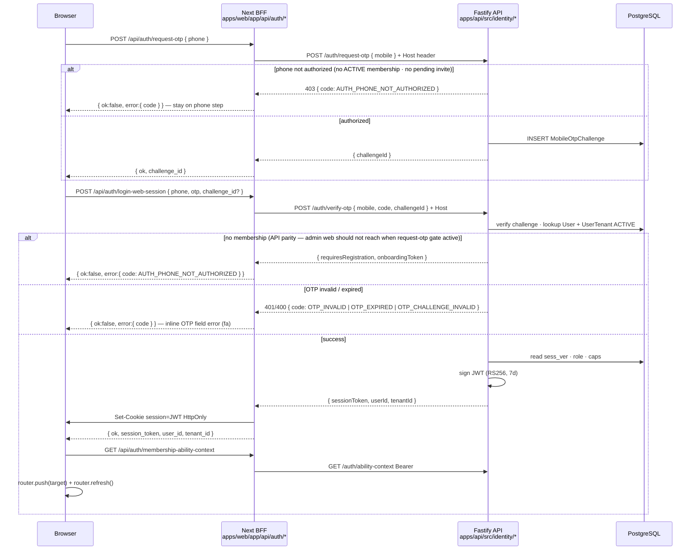

# Phase 9.1 — Operator login flow (legacy parity)

```yaml
flow_spec_id: OPERATOR-LOGIN-FLOW
version: "2026-06-10-v3"
status: LOCKED
decisions: [DEC-P9-003, DEC-P9-012, DEC-P9-018]
subphase: "9.1"
authority: IDENTITY-PORT-SCOPE.md · identity-api-dispatch-addendum.md · identity-web-bff-addendum.md
legacy_reference:
  - legacy/apps/web/app/auth/login/login-form.tsx
  - legacy/apps/web/middleware.ts
  - legacy/apps/api/src/modules/auth/
  - legacy/apps/api/src/modules/identity/entities/user-tenant.entity.ts
research:
  - https://cheatsheetseries.owasp.org/cheatsheets/Session_Management_Cheat_Sheet.html
  - https://pages.nist.gov/800-63-4/sp800-63b.html
```

> End-to-end specification for **operator admin panel login** — phone OTP → session cookie → membership hydrate → `(app)/dashboard`. Trunk must reproduce **legacy UX and security semantics** (DEC-P9-012), implemented with Fastify/Prisma/BFF — not Nest lift-and-shift.

### Admin access model (locked)

| Rule | Trunk behavior |
| ---- | -------------- |
| **No public registration** | `(app)/**` is **invite-only**. There is **no** self-signup form on the admin panel. |
| **Login only** | Canonical entry: `/auth/login` (alias `/login`). Two-step phone + OTP. |
| **New operators** | Owner/admin sends invite (`POST /users/invite`) → invitee opens `/auth/invite/[token]` → signs in with invited phone. |
| **Unknown phone before OTP** | `POST /auth/phone-preflight` + gated `request-otp` → `403 AUTH_PHONE_NOT_AUTHORIZED`. **Web:** stay on phone step — **never** advance to OTP. |
| **Unknown phone after OTP** | Legacy `requires_registration` preserved on `verify-otp` for API parity; **admin web must not reach this** when preflight gate is active. |
| **`/auth/register`** | **Redirect only** → `/auth/login?access=invite-only` (no registration UI). |
| **Owner-only panel (DEC-P9-018)** | `(app)/` + `/tours/new` require **`role=owner`** after OTP. Admin/member/viewer → BFF **403** `AUTH_OWNER_PANEL_ONLY` (no cookie) · redirect `?access=owner-only`. Future admin panel is a separate surface. |

Public tour registration (`(public)/catalog/**`) is a **separate Marketing funnel** — out of Phase 9 admin scope.

---

## 1. User journey (operator)

```text
1. User opens /auth/login (or /login alias) on workspace host (e.g. denali.localhost)
2. Step A — phone: optional `POST /api/auth/phone-preflight` · then `POST /api/auth/request-otp { phone }` (API rejects unauthorized before challenge)
3. Step B — OTP: 4-digit segmented input · `POST /api/auth/login-web-session { phone, otp, challenge_id }`
4. API verifies OTP + ACTIVE UserTenant for Host tenant
5. BFF sets HttpOnly cookie `session` (JWT, 7d) + short-lived `operator-welcome-armed=1` (non-HttpOnly) + returns session_token for localStorage mirror
6. Web AuthContext: setSession → GET /api/auth/session + GET /api/auth/membership-ability-context
7. client navigation: `router.push(returnUrl ?? /dashboard)` + `router.refresh()` — soft RSC rehydrate (no full document reload)
7b. **Welcome-back modal (Denali owner):** `OperatorWelcomeGate` on `/dashboard` — armed via BFF `operator-welcome-armed` cookie sync · copy `dashboard.welcome.*` · once per login until dismiss · see [`OPERATOR-WELCOME-UX.md`](OPERATOR-WELCOME-UX.md)
8. middleware on (app)/ routes: decode cookie JWT (exp/sub/tenant_id) — redirect /login if invalid
9. Logout: POST /api/auth/logout — clear `session` + `operator-welcome-armed` + client `sessionStorage` welcome keys — `router.push(/auth/login)` + `router.refresh()` (no API revoke)
```

### No-membership branch (invite-only — not self-registration)

When API returns `requires_registration` + `onboarding_token` (legacy API code preserved):

```text
login-web-session → requires_registration
  → Web shows invite-only error (no navigation to registration form)
  → Operator must receive POST /users/invite from owner/admin, then sign in again
```

**Trunk admin panel:** `/auth/register` **redirects** to `/auth/login?access=invite-only`. Full onboarding persist remains API-side (`POST /auth/register/complete`) for future Marketing/public flows — **not** exposed in `(app)` admin chrome.

---

## 2. Sequence diagram



---

## 3. Legacy → trunk route mapping

### API (Nest `/api/v2/auth/*` → Fastify `/auth/*`)

| Legacy (Nest)                        | Trunk (Fastify)                | Notes                                                |
| ------------------------------------ | ------------------------------ | ---------------------------------------------------- |
| `POST .../web/otp/request`           | `POST /auth/request-otp`       | BFF maps `phone` → `mobile`                          |
| `POST .../web/session/otp`           | `POST /auth/verify-otp`        | **Combined verify + issue JWT** (legacy single call) |
| `GET .../membership-ability-context` | `GET /auth/ability-context`    | Labels · capabilities · modules                      |
| `POST .../web/phone/preflight`       | `POST /auth/phone-preflight`   | Optional P1 — classify existing user                 |
| `POST .../web/registration/complete` | `POST /auth/register/complete` | Stub 9.1 · full 9.4                                  |
| _(none)_                             | `GET /auth/session`            | Hydrate for AuthContext refresh                      |
| _(none — client logout)_             | _(no API logout required)_     | DEC-P9-012 — cookie clear only                       |

### Web BFF (unchanged paths — browser contract)

| BFF path                                   | Proxies to                    | Sets cookie   |
| ------------------------------------------ | ----------------------------- | ------------- |
| `POST /api/auth/phone-preflight`           | `POST /auth/phone-preflight`  | no            |
| `POST /api/auth/request-otp`               | `POST /auth/request-otp`      | no            |
| `POST /api/auth/login-web-session`         | `POST /auth/verify-otp`       | **yes**       |
| `GET/POST/DELETE /api/auth/session`        | local JWT parse + consolidate | optional      |
| `POST /api/auth/logout`                    | _(none)_                      | clears cookie |
| `GET /api/auth/membership-ability-context` | `GET /auth/ability-context`   | no            |

See [`identity-web-bff-addendum.md`](identity-web-bff-addendum.md).

### Web pages

| Legacy path            | Trunk path                              | Notes                           |
| ---------------------- | --------------------------------------- | ------------------------------- |
| `/login`               | `/login` → render same as `/auth/login` | Middleware redirect target      |
| `/auth/login`          | `/auth/login`                           | Canonical OTP form (DEC-P9-012) |
| `/auth/register`       | `/auth/register` → redirect `/auth/login?access=invite-only` | **No registration UI** — admin invite-only |
| `/auth/invite/[token]` | same                                    | 9.4 extends accept              |

---

## 4. Session & cookie contract (locked)

| Field             | Value                                                                            |
| ----------------- | -------------------------------------------------------------------------------- |
| Cookie name       | **`session`** (`SESSION_TOKEN_COOKIE`)                                           |
| Max-Age           | **604800s (7 days)** — must match JWT TTL                                        |
| Flags             | HttpOnly · Secure (prod) · SameSite=Lax (dev) / None (prod cross-site)           |
| Domain            | prod: `NEXT_PUBLIC_SESSION_COOKIE_DOMAIN` or tenant root; dev: host-only default |
| JWT alg           | RS256 (API verifies signature; Edge middleware **decode only**)                  |
| JWT claims        | `sub`, `tenant_id`, `role`, `sess_ver`, optional `email`, `caps`                 |
| Revocation        | **`UserTenant.sessionVersion`** — mismatch → **401** `AUTH_TOKEN_REVOKED`        |
| DB session store  | **Forbidden** as primary — stateless JWT (DEC-P9-012)                            |
| Cross-port Bearer | localStorage mirror `tour_ops_session_token:{tenantSlug}` for API :3001 calls    |

**DELTA-NP-04:** API authorization uses **DB-hydrated role** on every request — JWT `role` is a hint only.

---

## 5. Login UI (two-step — trunk)

| Step      | UI | Validation / behavior |
| --------- | -- | --------------------- |
| **phone** | `LocalizedNumericInput` (`mode=phone`) · **ارسال رمز** | BFF `POST /api/auth/request-otp` — API **gates** unauthorized phones **before** challenge (`403 AUTH_PHONE_NOT_AUTHORIZED`). Web **never** advances to OTP on failure. |
| **otp**   | `OtpSegmentInput` — **4 boxes** · paste · auto-submit on 4th digit | BFF `POST /api/auth/login-web-session`. Resend cooldown **45s**. **تغییر شماره موبایل** clears challenge. **Input:** ASCII state · Persian/Arabic-Indic keyboard normalized via `toAsciiDigits` · container `dir=ltr` · SMS autofill via **clipped native** `autocomplete=one-time-code` sink (`aria-hidden` + `tabIndex=-1`, not `Input.control`). Cell names: `auth.otpDigitLabel` `{index}`. Group name: `auth.otpLabel`. No `htmlFor="otp"` on a hidden sink. Dev hint `devOtpHint` may stay in development. |

Optional classify-only path: `POST /api/auth/phone-preflight` → `{ ok, authorized }` (web may skip — gated `request-otp` is sufficient).

### 5.1 Error catalog (API code → BFF → UI)

Stable codes flow: API `{ code }` → BFF `{ ok:false, error:{ code } }` → `resolveLoginErrorMessage` → `messages/{locale}/auth.json` → **field-level** alert under phone or OTP (not toast).

| Code | HTTP | Step | FA copy (key `auth.errors.*`) |
| ---- | ---- | ---- | ------------------------------ |
| `MOBILE_REQUIRED` | 400 | phone | شماره موبایل را وارد کنید. |
| `MOBILE_INVALID` | 400 | phone | فرمت شماره موبایل درست نیست. |
| `AUTH_PHONE_NOT_AUTHORIZED` | 403 | phone | امکان ورود با این شماره وجود ندارد. |
| `OTP_RATE_LIMITED` | 429 | phone | تعداد درخواست زیاد است. چند دقیقه بعد دوباره تلاش کنید. |
| `OTP_REQUEST_FAILED` | 4xx/5xx | phone | ارسال رمز ناموفق بود. |
| `OTP_PAYLOAD_INVALID` | 400 | otp | اطلاعات ورود ناقص است. |
| `OTP_CHALLENGE_INVALID` | 400 | otp | نشست ورود منقضی شده. دوباره درخواست رمز کنید. (clears OTP boxes) |
| `OTP_INVALID` | 401 | otp | رمز واردشده درست نیست. |
| `OTP_EXPIRED` | 401 | otp | رمز منقضی شده. رمز جدید بگیرید. (clears OTP boxes) |
| `BACKEND_UNREACHABLE` | 502 | either | ارتباط با سرور برقرار نشد. |
| `AUTH_PREFLIGHT_FAILED` | 5xx | phone | بررسی شماره موبایل ناموفق بود. |
| `SESSION_TOKEN_MISSING` | 502 | otp | ورود ناموفق بود. دوباره تلاش کنید. |

**Legacy (do not emit from login BFF):** `INVALID_INPUT` — superseded by `MOBILE_REQUIRED` / `OTP_PAYLOAD_INVALID`; strings remain in i18n for old clients only.

**Test ids:** `operator-login-phone-error` · `operator-login-otp-error` (`operator-login-copy.ts` · `login-form.tsx`).

**Dev hint:** `devOtpHint` (`رمز توسعه: 1234`) rendered only when `NODE_ENV=development`.

**Production initial state:** `login-form.tsx` initializes `phone` and `otp` to **empty strings** when `NODE_ENV !== "development"` — dev fixtures (`+15550001001` / `1234`) exist only in development bundles.

### 5.3 Post-auth client navigation (soft — locked)

After BFF sets or clears the HttpOnly `session` cookie, the browser must **not** use `window.location.href` (full document reload). Trunk uses Next App Router soft navigation so RSC layouts re-fetch with the updated cookie:

| Event | Helper | Behavior |
| ----- | ------ | -------- |
| Login success | `navigateAfterLogin(router, searchParams)` | `router.push(returnUrl \|\| /dashboard)` then `router.refresh()` |
| Logout | `navigateAfterLogout(router)` | `router.push(/auth/login)` then `router.refresh()` |

Implementation: `apps/web/src/auth/navigate-after-auth-session-change.ts` · wired from `login-form.tsx` and `operator-shell.tsx`.

`returnUrl` open-redirect guard: must start with `/` and must not start with `//` (`resolveAuthReturnPath`).

**Why `refresh()` is required:** `(app)/layout.tsx` reads the session from cookies on the server. `push()` alone can serve a stale RSC payload; `refresh()` invalidates the cache and re-runs middleware + layout with the new cookie — same security guarantees as hard navigation, softer UX.

### 5.2 Authorization gate (request-otp)

`isPhoneAuthorizedForTenantLogin(tenantId, mobile)` returns true when:

1. User exists with **ACTIVE** `user_tenants` row for Host tenant, **or**
2. A **pending invite** exists for that mobile on the tenant.

Otherwise `handleRequestOtp` throws `AuthPhoneNotAuthorizedError` → **403** — no `MobileOtpChallenge` row is created.

Specs: `apps/api/test/identity-login-preflight.spec.ts` (AUTH-PF-01..06) · `apps/api/test/identity-login-integration.spec.ts` (AUTH-E2E-01..03) · `apps/api/test/identity-login-performance.spec.ts` (PERF-LOGIN-01..03) · `apps/api/test/phone-login-authorization.spec.ts` (AUTHZ-01..05) · `apps/web/test/auth-bff-login-codes.spec.ts` (BFF-LOGIN-01..05).

Dev fixture (Phase 9, `NODE_ENV=development`):

| Host | Tenant UUID | Notes |
| ---- | ----------- | ----- |
| `denali.admin.localhost:3000` | `…000003` | **Canonical Denali operator admin** (WRS-001 · WRS-ADMIN-LEGACY-308) |
| `denali.localhost:3000` | `…000003` | **Legacy apex on web** — 308 → `denali.admin.localhost:3000` (do not bookmark) |
| `operator.localhost:3000` | `…000014` | Phase 9 operator smoke |
| `localhost:3000` | env fallback | `TOUR_OPS_DEV_TENANT_ID` in `apps/web/.env.local` (Denali smoke uses `…000003`) |

Phone `+15550001001` · OTP `1234` · owner membership on **Denali** (`…000003` / `denali.localhost`). When API runs with `OPERATOR_SMOKE_E2E_SEED=1` (Playwright smoke), in-memory identity also seeds owner on **operator smoke** tenant (`…000014`) so bare `127.0.0.1:3000` + `TOUR_OPS_DEV_TENANT_ID=…000014` can complete login. **This dual-tenant seed is dev/smoke-only** — never enabled in production Prisma deployments. Other dev hosts (`urban.localhost`, `tenant-a.localhost`) **must not** accept a Denali-only session.

### Dev bootstrap checklist (root-cause guard)

Login fails after every restart when **any** row below is missing — not because Denali workspace logic is broken.

| # | Requirement | Why |
| - | ----------- | --- |
| 1 | API dev loads **both** `apps/api/.env` and `apps/api/.env.local` | JWT keys (`AUTH_JWT_*`) live in `.env.local`; boot without them → `verify-otp` **500** `internal_error` after OTP |
| 2 | `AUTH_JWT_PUBLIC_KEY` + `AUTH_JWT_PRIVATE_KEY` present | Generate once: `cd apps/api && pnpm run bootstrap:dev-jwt >> .env.local` |
| 3 | `STORAGE_DRIVER` consistent | `.env` may say `prisma` while `.env.local` says `memory` — pick **one** driver per machine; mixed files cause non-deterministic identity source |
| 4 | **`STORAGE_DRIVER=prisma`** → run `pnpm --filter ./apps/api run db:seed` after migrate/reset | `db:seed` upserts Denali tenant **and** operator identity (`users` + `user_tenants`); in-memory auto-seed does **not** run under prisma |
| 5 | **`STORAGE_DRIVER=memory`** → no DB identity required | `InMemoryIdentityRepository.createWithDevSeed()` seeds owner on each API process start |
| 6 | Web host `denali.admin.localhost:3000` | Session `tenant_id` must match host map — bare `localhost` only works when `TOUR_OPS_DEV_TENANT_ID=…000003` |
| 7 | Denali green theme (`#0f766e`) | `tenants.theme` + `body[data-workspace-plugin=denali]` skin; run `db:seed` or rely on runtime merge (4.4) |

**Symptom map:**

| Symptom | Likely cause |
| ------- | ------------ |
| `requires_registration` / invite-only banner | No `user_tenants` row for `…000003` (prisma path, seed not run) |
| `internal_error` after OTP | Missing or malformed `AUTH_JWT_PRIVATE_KEY` (`.env.local` not loaded) |
| Redirect `?access=tenant-mismatch` | Logged in on one host, browsing another (e.g. session from `localhost`, opened `denali.localhost`) |
| OTP `1234` rejected | Use code from API log `[otp-dev] mobile=… code=…` or re-request OTP (challenge single-use) |

### Host ↔ session binding (WEB-9.1-10+)

| Check | Behavior |
| ----- | -------- |
| Middleware | JWT `tenant_id` must match `{label}.localhost` tenant map (or `TOUR_OPS_DEV_TENANT_ID` on bare `localhost`) |
| Mismatch | Redirect `/auth/login?access=tenant-mismatch` + clear `session` cookie |
| Cross-host cookie | Denali session on `operator.localhost` → **blocked** (pages **and** `/api/*` BFF) |
| BFF `/api/*` | Middleware enforces host bind — mismatch → **403** `AUTH_TENANT_HOST_MISMATCH` + cookie clear |
| API data path | Bearer JWT tenant wins over forged `x-tenant-id` on authenticated routes |

**Live probe:** `node scripts/workspace-isolation-probe.mjs` (39 checks — run with API + Web dev servers up).

---

## 6. Middleware & guards (two layers)

| Layer          | File (target)                   | Checks                                                                                                                                            |
| -------------- | ------------------------------- | ------------------------------------------------------------------------------------------------------------------------------------------------- |
| **Edge**       | `apps/web/middleware.ts`        | Public: `/login`, `/auth/login`, `/auth/register` (redirect), `/auth/invite/*`; else valid JWT in `session` cookie (exp, sub, tenant_id) — **no sig verify** |
| **RSC/layout** | `apps/web/app/(app)/layout.tsx` | `requireOperatorSessionWeb` → redirect login + returnUrl                                                                                          |
| **API**        | `requireOperatorSession`        | Parse cookie/Bearer · verify RS256 · hydrate DB · CASL                                                                                            |

### Bearer ingress (R6 fix)

`hasOperatorAuthIngress` and `withSessionCookieBearer` read `req.headers.authorization` through a local `readAuthorizationHeader` helper. That helper **must** return the scalar string when Node provides a single header value (the normal case). A regression that returned `""` for non-array values made **Bearer-only** requests look anonymous: `IDENTITY_REQUIRED` on `/auth/session`, `/users`, and `/users/invite` even though `TenantKernel.resolveTenantContextFromRequest` would have verified the JWT.

**Symptom:** BFF routes that forward only `Authorization: Bearer <sessionToken>` (no `x-user-id` shim) returned `401 IDENTITY_REQUIRED` from the API.

**Contract:** Bearer-only and cookie-only ingress are first-class for operator session routes; explicit `x-*` headers remain a dev/test fallback behind JWT verify.

Invalid Edge token → redirect **`/login`** + clear stale cookies (legacy behavior).

---

## 7. Post-login navigation

| Condition                                  | Redirect                         |
| ------------------------------------------ | -------------------------------- |
| Default success                            | **`/dashboard`**                 |
| `?returnUrl=` present (safe relative path) | decoded returnUrl                |
| `requires_registration`                    | stay on login — invite-only error |
| Invite flow `?invite=` on login            | preserved through OTP → accept invite |

Wizard access post-login uses **`/tours/new`** (DEC-P9-007) — same session cookie.

---

## 8. Role-aware routes (post-login — 9.2+)

Legacy route policies preserved:

| Route                                            | Role gate                                  | Denied →                                              |
| ------------------------------------------------ | ------------------------------------------ | ----------------------------------------------------- |
| `(app)/bookings`                                 | **member** only (participant queue / mine) | admin/owner → `/dashboard`                            |
| `(app)/leader/review`                            | admin/owner                                | member → `/dashboard` (legacy URL alias · DEC-P9-011) |
| `(app)/users`, `(app)/settings`, `(app)/finance` | admin/owner                                | member → 403 or nav hidden                            |

Nav filtering: `resolve-workspace-navigation.ts` (9.2) — admin/owner see finance/users; members see bookings. Legacy DB `leader` hydrates to `admin` (DEC-P9-015).

---

## 9. Allowable write surface (9.1)

| Path                                             | Purpose                         |
| ------------------------------------------------ | ------------------------------- |
| `apps/api/src/identity/**`                       | Fastify auth handlers           |
| `apps/web/app/auth/**`                           | Login · register stub pages     |
| `apps/web/app/login/**`                          | Alias page → auth/login         |
| `apps/web/app/api/auth/**`                       | BFF routes                      |
| `apps/web/middleware.ts`                         | Edge session gate               |
| `apps/web/src/auth/**` (`@/auth/*`)              | session · cookie · BFF helpers  |
| `apps/web/src/admin/require-operator-session.ts` | RSC guard                       |
| `packages/workspace-sdk/src/auth/**`             | CASL · session types            |

---

## 10. Completion proof

| ID        | Check                                             | Spec                        |
| --------- | ------------------------------------------------- | --------------------------- |
| CP-9.1-06 | Full BFF request-otp → login-web-session → cookie | `auth-login-flow.spec.ts`   |
| CP-9.1-07 | membership-ability-context after login            | same                        |
| CP-9.1-08 | Logout clears cookie — no API call                | BFF spec                    |
| CP-9.1-09 | middleware redirects anon `(app)/` → login        | `auth-login-access.spec.ts` |
| CP-9.1-10 | sess_ver mismatch → 401 revoked                   | `identity-session.spec.ts`  |
| CP-9.1-11 | phone-preflight + gated request-otp (403 unauthorized) | `identity-login-preflight.spec.ts` |
| CP-9.1-12 | coded login errors map to FA `auth.errors.*`        | `resolve-login-error.spec.ts` |
| CP-9.1-13 | login UI contract (OtpSegmentInput · BFF codes)     | `operator-login-ui-contract.spec.ts` |
| CP-9.1-14 | phone-preflight BFF anonymous (middleware allowlist) | `auth-login-flow.spec.ts` BFF-9.1-07 |
| CP-9.1-15 | Playwright login gate + OTP segment (SMK-P9-LOGIN-01..07) | `operator-smoke.spec.ts` |
| CP-9.1-16 | Login integration chain + perf/memory probes | `identity-login-integration.spec.ts` · `identity-login-performance.spec.ts` |
| CP-9.1-17 | Prisma login gate authorization | `phase-9-persistence.integration.spec.ts` P9-PERSIST-06..07 |
| CP-9.1-18 | BFF login rate limit (OTP_RATE_LIMITED) | `bff-login-rate-limit.spec.ts` · `auth-bff-login-codes.spec.ts` BFF-LOGIN-06 |

---

## 11. Anti-patterns (FAIL)

| Pattern                                         | Detection                  |
| ----------------------------------------------- | -------------------------- |
| Server-side session table as SoT                | DEC-P9-012 · schema review |
| API logout required for logout UX               | legacy has none — BFF only |
| Skip BFF — browser calls API directly for login | cookie domain break        |
| Trust JWT role without DB hydrate               | DELTA-NP-04                |
| OTP in URL query string                         | OWASP WSTG · AH-9.1-06     |

---

## 12. Cross-references

| Doc                                                                            | Role                 |
| ------------------------------------------------------------------------------ | -------------------- |
| [`IDENTITY-PORT-SCOPE.md`](IDENTITY-PORT-SCOPE.md)                             | Models · API surface |
| [`identity-api-dispatch-addendum.md`](identity-api-dispatch-addendum.md)       | Fastify dispatch     |
| [`identity-web-bff-addendum.md`](identity-web-bff-addendum.md)                 | Next BFF routes      |
| [`CASL-OPERATOR-SPEC.md`](CASL-OPERATOR-SPEC.md)                               | API middleware       |
| [`CANLOAD-OPERATOR-SESSION.contract.ts`](CANLOAD-OPERATOR-SESSION.contract.ts) | Web constants        |
