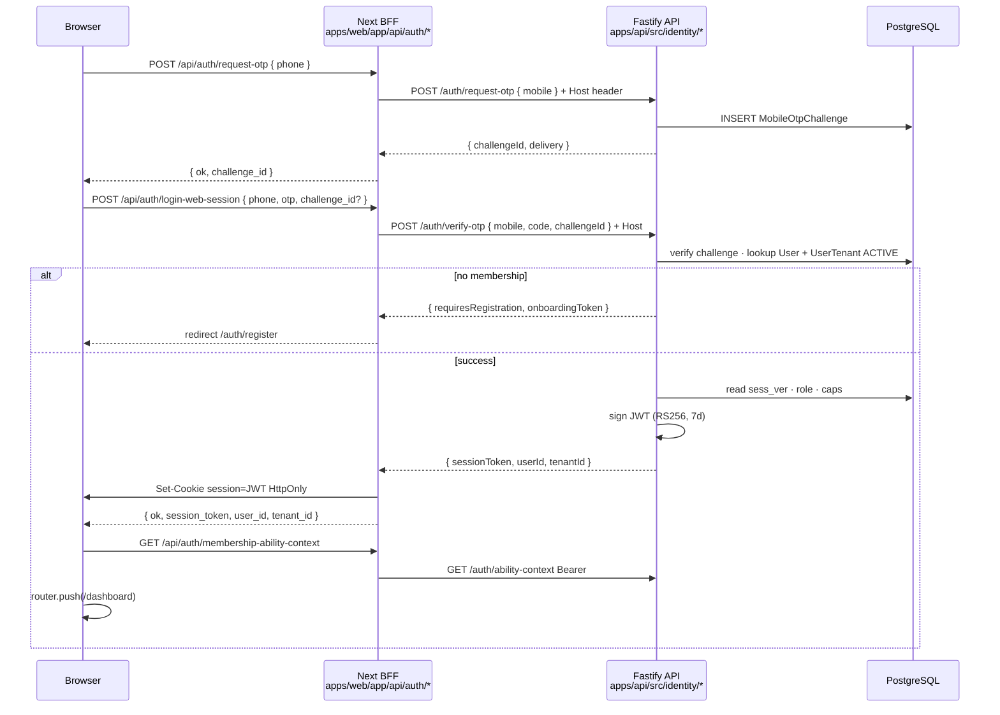

# Phase 9.1 — Operator login flow (legacy parity)

```yaml
flow_spec_id: OPERATOR-LOGIN-FLOW
version: "2026-06-08-v1"
status: LOCKED
decisions: [DEC-P9-003, DEC-P9-012]
subphase: "9.1"
authority: IDENTITY-PORT-SCOPE.md · identity-api-dispatch-addendum.md · identity-web-bff-addendum.md
legacy_reference:
  - legacy/apps/web/app/auth/login/login-form.tsx
  - legacy/apps/web/middleware.ts
  - legacy/apps/api/src/modules/auth/
  - legacy/apps/api/src/modules/identity/entities/user-tenant.entity.ts
research:
  - https://cheatsheetseries.owasp.org/cheatsheets/Session_Management_Cheat_Sheet.html
  - https://pages.nist.gov/800-63-4/sp800-63b.html
```

> End-to-end specification for **admin panel login** — phone OTP → session cookie → membership hydrate → `(app)/dashboard`. Trunk must reproduce **legacy UX and security semantics** (DEC-P9-012), implemented with Fastify/Prisma/BFF — not Nest lift-and-shift.

---

## 1. User journey (operator)

```text
1. User opens /auth/login (or /login alias) on workspace host (e.g. denali.localhost)
2. Step A — phone: POST BFF /api/auth/request-otp { phone }
3. Step B — OTP: POST BFF /api/auth/login-web-session { phone, otp, challenge_id? }
4. API verifies OTP + ACTIVE UserTenant for Host tenant
5. BFF sets HttpOnly cookie `session` (JWT, 7d) + returns session_token for localStorage mirror
6. Web AuthContext: setSession → GET /api/auth/session + GET /api/auth/membership-ability-context
7. redirect → /dashboard (or returnUrl query param)
8. middleware on (app)/ routes: decode cookie JWT (exp/sub/tenant_id) — redirect /login if invalid
9. Logout: POST /api/auth/logout — clear cookie + localStorage — redirect /login (no API revoke)
```

### Onboarding branch (no membership)

When API returns `requires_registration` + `onboarding_token` (legacy parity):

```text
login-web-session → requires_registration
  → redirect /auth/register?onboarding=<token>[&invite=<token>]
```

Registration complete is **9.1 stub route** + full persist in **9.4** invites — login flow must not block on register UI for 9.1 closure, but **redirect contract** must match legacy.

---

## 2. Sequence diagram



---

## 3. Legacy → trunk route mapping

### API (Nest `/api/v2/auth/*` → Fastify `/auth/*`)

| Legacy (Nest)                        | Trunk (Fastify)                | Notes                                                |
| ------------------------------------ | ------------------------------ | ---------------------------------------------------- |
| `POST .../web/otp/request`           | `POST /auth/request-otp`       | BFF maps `phone` → `mobile`                          |
| `POST .../web/session/otp`           | `POST /auth/verify-otp`        | **Combined verify + issue JWT** (legacy single call) |
| `GET .../membership-ability-context` | `GET /auth/ability-context`    | Labels · capabilities · modules                      |
| `POST .../web/phone/preflight`       | `POST /auth/phone-preflight`   | Optional P1 — classify existing user                 |
| `POST .../web/registration/complete` | `POST /auth/register/complete` | Stub 9.1 · full 9.4                                  |
| _(none)_                             | `GET /auth/session`            | Hydrate for AuthContext refresh                      |
| _(none — client logout)_             | _(no API logout required)_     | DEC-P9-012 — cookie clear only                       |

### Web BFF (unchanged paths — browser contract)

| BFF path                                   | Proxies to                    | Sets cookie   |
| ------------------------------------------ | ----------------------------- | ------------- |
| `POST /api/auth/request-otp`               | `POST /auth/request-otp`      | no            |
| `POST /api/auth/login-web-session`         | `POST /auth/verify-otp`       | **yes**       |
| `GET/POST/DELETE /api/auth/session`        | local JWT parse + consolidate | optional      |
| `POST /api/auth/logout`                    | _(none)_                      | clears cookie |
| `GET /api/auth/membership-ability-context` | `GET /auth/ability-context`   | no            |

See [`identity-web-bff-addendum.md`](identity-web-bff-addendum.md).

### Web pages

| Legacy path            | Trunk path                              | Notes                           |
| ---------------------- | --------------------------------------- | ------------------------------- |
| `/login`               | `/login` → render same as `/auth/login` | Middleware redirect target      |
| `/auth/login`          | `/auth/login`                           | Canonical OTP form (DEC-P9-012) |
| `/auth/register`       | `/auth/register`                        | Onboarding after OTP            |
| `/auth/invite/[token]` | same                                    | 9.4 extends accept              |

---

## 4. Session & cookie contract (locked)

| Field             | Value                                                                            |
| ----------------- | -------------------------------------------------------------------------------- |
| Cookie name       | **`session`** (`SESSION_TOKEN_COOKIE`)                                           |
| Max-Age           | **604800s (7 days)** — must match JWT TTL                                        |
| Flags             | HttpOnly · Secure (prod) · SameSite=Lax (dev) / None (prod cross-site)           |
| Domain            | prod: `NEXT_PUBLIC_SESSION_COOKIE_DOMAIN` or tenant root; dev: host-only default |
| JWT alg           | RS256 (API verifies signature; Edge middleware **decode only**)                  |
| JWT claims        | `sub`, `tenant_id`, `role`, `sess_ver`, optional `email`, `caps`                 |
| Revocation        | **`UserTenant.sessionVersion`** — mismatch → **401** `AUTH_TOKEN_REVOKED`        |
| DB session store  | **Forbidden** as primary — stateless JWT (DEC-P9-012)                            |
| Cross-port Bearer | localStorage mirror `tour_ops_session_token:{tenantSlug}` for API :3001 calls    |

**DELTA-NP-04:** API authorization uses **DB-hydrated role** on every request — JWT `role` is a hint only.

---

## 5. Login UI (two-step — legacy parity)

| Step      | UI                     | Validation                                                      |
| --------- | ---------------------- | --------------------------------------------------------------- |
| **phone** | E.164 input · Continue | `normalizeOtpPhoneInput` · min 8 digits                         |
| **otp**   | OTP input · Sign in    | 4–8 digits · dev static `1234` when `AUTH_ALLOW_DEV_STATIC_OTP` |

Post-submit errors (legacy codes preserved):

| Code                    | UX                                     |
| ----------------------- | -------------------------------------- |
| `AUTH_OTP_INVALID`      | toast invalid phone/OTP                |
| `AUTH_OTP_EXPIRED`      | toast generic · re-request OTP         |
| `AUTH_PHONE_INVALID`    | toast invalid phone                    |
| `requires_registration` | redirect register — not an error toast |

Dev fixture (legacy AGENTS): host `denali.localhost:3000`, phone `+989121000001`, OTP `1234`.

---

## 6. Middleware & guards (two layers)

| Layer          | File (target)                   | Checks                                                                                                                                            |
| -------------- | ------------------------------- | ------------------------------------------------------------------------------------------------------------------------------------------------- |
| **Edge**       | `apps/web/middleware.ts`        | Public: `/login`, `/auth/login`, `/auth/register`, `/auth/invite/*`; else valid JWT in `session` cookie (exp, sub, tenant_id) — **no sig verify** |
| **RSC/layout** | `apps/web/app/(app)/layout.tsx` | `requireOperatorSessionWeb` → redirect login + returnUrl                                                                                          |
| **API**        | `requireOperatorSession`        | Parse cookie/Bearer · verify RS256 · hydrate DB · CASL                                                                                            |

Invalid Edge token → redirect **`/login`** + clear stale cookies (legacy behavior).

---

## 7. Post-login navigation

| Condition                                  | Redirect                         |
| ------------------------------------------ | -------------------------------- |
| Default success                            | **`/dashboard`**                 |
| `?returnUrl=` present (safe relative path) | decoded returnUrl                |
| `requires_registration`                    | `/auth/register?onboarding=...`  |
| Invite flow `?invite=` on login            | preserved through OTP + register |

Wizard access post-login uses **`/tours/new`** (DEC-P9-007) — same session cookie.

---

## 8. Role-aware routes (post-login — 9.2+)

Legacy route policies preserved:

| Route                                            | Role gate                                  | Denied →                                              |
| ------------------------------------------------ | ------------------------------------------ | ----------------------------------------------------- |
| `(app)/bookings`                                 | **member** only (participant queue / mine) | admin/owner → `/dashboard`                            |
| `(app)/leader/review`                            | admin/owner                                | member → `/dashboard` (legacy URL alias · DEC-P9-011) |
| `(app)/users`, `(app)/settings`, `(app)/finance` | admin/owner                                | member → 403 or nav hidden                            |

Nav filtering: `resolve-workspace-navigation.ts` (9.2) — admin/owner see finance/users; members see bookings. Legacy DB `leader` hydrates to `admin` (DEC-P9-015).

---

## 9. Allowable write surface (9.1)

| Path                                             | Purpose                         |
| ------------------------------------------------ | ------------------------------- |
| `apps/api/src/identity/**`                       | Fastify auth handlers           |
| `apps/web/app/auth/**`                           | Login · register stub pages     |
| `apps/web/app/login/**`                          | Alias page → auth/login         |
| `apps/web/app/api/auth/**`                       | BFF routes                      |
| `apps/web/middleware.ts`                         | Edge session gate               |
| `apps/web/lib/auth/**`                           | session · cookie · auth-context |
| `apps/web/src/admin/require-operator-session.ts` | RSC guard                       |
| `packages/workspace-sdk/src/auth/**`             | CASL · session types            |

---

## 10. Completion proof

| ID        | Check                                             | Spec                        |
| --------- | ------------------------------------------------- | --------------------------- |
| CP-9.1-06 | Full BFF request-otp → login-web-session → cookie | `auth-login-flow.spec.ts`   |
| CP-9.1-07 | membership-ability-context after login            | same                        |
| CP-9.1-08 | Logout clears cookie — no API call                | BFF spec                    |
| CP-9.1-09 | middleware redirects anon `(app)/` → login        | `auth-login-access.spec.ts` |
| CP-9.1-10 | sess_ver mismatch → 401 revoked                   | `identity-session.spec.ts`  |

---

## 11. Anti-patterns (FAIL)

| Pattern                                         | Detection                  |
| ----------------------------------------------- | -------------------------- |
| Server-side session table as SoT                | DEC-P9-012 · schema review |
| API logout required for logout UX               | legacy has none — BFF only |
| Skip BFF — browser calls API directly for login | cookie domain break        |
| Trust JWT role without DB hydrate               | DELTA-NP-04                |
| OTP in URL query string                         | OWASP WSTG · AH-9.1-06     |

---

## 12. Cross-references

| Doc                                                                            | Role                 |
| ------------------------------------------------------------------------------ | -------------------- |
| [`IDENTITY-PORT-SCOPE.md`](IDENTITY-PORT-SCOPE.md)                             | Models · API surface |
| [`identity-api-dispatch-addendum.md`](identity-api-dispatch-addendum.md)       | Fastify dispatch     |
| [`identity-web-bff-addendum.md`](identity-web-bff-addendum.md)                 | Next BFF routes      |
| [`CASL-OPERATOR-SPEC.md`](CASL-OPERATOR-SPEC.md)                               | API middleware       |
| [`CANLOAD-OPERATOR-SESSION.contract.ts`](CANLOAD-OPERATOR-SESSION.contract.ts) | Web constants        |
