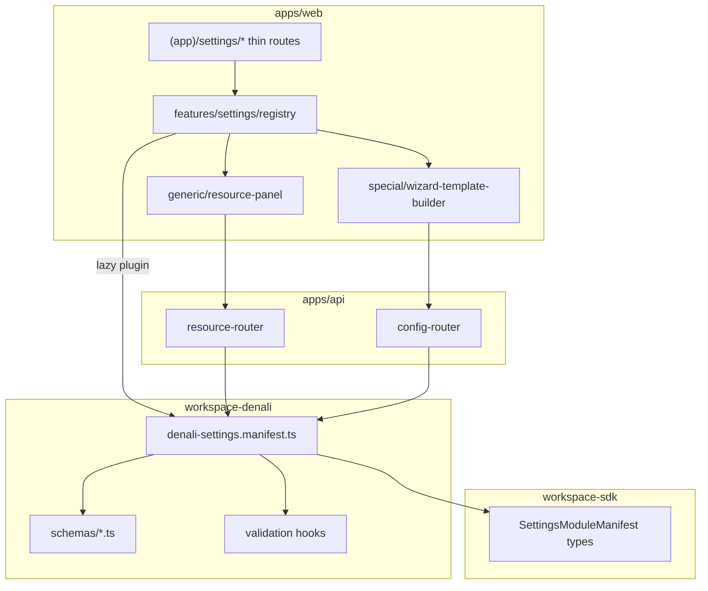

# Phase 9.6 — Settings Module Registry (architecture spec)

```yaml
spec_id: SETTINGS-MODULE-REGISTRY
version: "2026-06-08-v1"
decisions: [DEC-P9-009, DEC-P9-010, DEC-P9-005, DEC-P9-008]
invariants: [INV-P9-001, INV-P9-003, INV-P9-007, INV-P8-007]
risk_register: SETTINGS-RISK-REGISTER-P9.md
subphase: "9.6"
implementation_home:
  sdk_types: packages/workspace-sdk/src/operator/settings/
  denali_manifest: packages/workspaces/denali/src/settings/
  api_routers: apps/api/src/settings/
  web_features: apps/web/src/features/settings/
```

---

## 1. Problem statement

Legacy Denali settings (`legacy/apps/web/app/(app)/settings/`) mixes account prefs, workspace catalog CRUD, tenant JSON config, and observability in one flat tree with hardcoded navigation and duplicated panels. Phase 9.6 replaces this with a **manifest-driven registry** aligned to MAP §4 `WorkspacePlugin` — same pattern as Denali `field-registry`, not a second plugin system.

---

## 2. Architecture overview

```text
Request (denali.localhost)
  → tenant-kernel → tenant_id
  → identity session + hydrate (9.1)
  → resolve WorkspacePlugin (denali)
  → operatorSettings.manifest (DEC-P9-009)
  → CASL: operator.settings.{moduleId}
  → Router branch by module.kind
       reference_data → Prisma entity repo (DEC-P9-010)
       tenant_config  → tenant_config table + version + Zod
       readonly_explorer → read API only
  → Response + audit emit on mutation
```



---

## 3. Manifest contract (DEC-P9-009)

### 3.1 Discriminated union

| `kind`               | Purpose                                 | API surface                      | UI `uiVariant`            |
| -------------------- | --------------------------------------- | -------------------------------- | ------------------------- |
| `reference_data`     | Catalog rows (equipment, themes, …)     | `/settings/resources/{moduleId}` | `generic_crud` (default)  |
| `tenant_config`      | Versioned JSON config (wizard template) | `/settings/config/{configKey}`   | `schema_form` or `custom` |
| `readonly_explorer`  | Audit / triage read surfaces            | `/settings/explore/{moduleId}`   | `custom`                  |
| `account_preference` | User profile — **not** workspace        | `/identity/me/*` (9.1)           | routed to `/settings/me`  |

### 3.2 Required manifest fields

| Field           | Type          | Rule                                                     |
| --------------- | ------------- | -------------------------------------------------------- |
| `id`            | string        | `[a-z][a-z0-9_]*` · unique within plugin                 |
| `kind`          | enum          | see §3.1                                                 |
| `route`         | string        | under `(app)/settings/` without leading slash            |
| `ability`       | string        | must exist in CASL-OPERATOR-SPEC `operator.settings.*`   |
| `nav.group`     | enum          | `account` \| `workspace` \| `templates` \| `finance_ops` |
| `nav.labelKey`  | string        | i18n key                                                 |
| `schema`        | ZodObject ref | validated at register time                               |
| `configKey`     | string        | required when `kind=tenant_config`                       |
| `configVersion` | number        | ≥ 1 when `kind=tenant_config`                            |
| `entity`        | string        | Prisma model name when `kind=reference_data`             |

### 3.3 WorkspacePlugin extension (non-breaking)

```typescript
/** packages/workspace-sdk — optional on WorkspacePlugin */
interface OperatorSettingsSurface {
  readonly manifestVersion: 1;
  readonly modules: readonly SettingsModuleManifest[];
  resolveDefaults?(configKey: string): unknown;
}

interface WorkspacePlugin {
  // …existing fields…
  readonly operatorSettings?: OperatorSettingsSurface;
}
```

- **Starter / Urban:** omit `operatorSettings` or export empty modules array.
- **Denali:** full manifest in `packages/workspaces/denali/src/settings/denali-settings.manifest.ts`.

### 3.5 Trunk implementation (S9.6-R0)

| Artifact                               | Path                                                                       | Proof                       |
| -------------------------------------- | -------------------------------------------------------------------------- | --------------------------- |
| SDK types + `validateSettingsManifest` | `packages/workspace-sdk/src/operator/settings/settings-module-manifest.ts` | SDK-9.6-01                  |
| Denali module inventory (§7)           | `packages/workspaces/denali/src/settings/denali-settings.manifest.ts`      | DN-9.6-01                   |
| Plugin wiring                          | `WorkspacePlugin.operatorSettings` on `createDenaliWorkspacePlugin()`      | `settings-manifest.spec.ts` |

`validateSettingsManifest` fails closed on unknown `kind` values before API boot builds the frozen registry `Map`.

### 3.6 Trunk implementation (S9.6-R1 — modules API + equipment pilot)

| Artifact | Path | Proof |
| -------- | ---- | ----- |
| Settings registry resolver | `apps/api/src/settings/settings-registry.ts` | API-9.6-01 |
| In-memory resource store | `apps/api/src/settings/in-memory-settings-resources.repository.ts` | API-9.6-RES-02 |
| Service + routes | `apps/api/src/settings/settings.service.ts` · `settings.routes.ts` | RES-01 · RES-03 |
| App dispatch | `apps/api/src/app.ts` | dispatch addendum v2 |
| Settings hub | `apps/web/app/(app)/settings/page.tsx` | WEB-9.6-CRUD-02 |
| Equipment pilot panel | `apps/web/app/(app)/settings/equipment/` | WEB-9.6-CRUD-01 · SMK-P9-08 |
| BFF | `apps/web/app/api/settings/modules/route.ts` · `resources/[moduleId]/route.ts` | BFF parity |

**R1 scope:** `GET /settings/modules` · `reference_data` CRUD for **`equipment`** module only (in-memory). Unknown `moduleId` → **404** `SETTINGS_MODULE_UNKNOWN`. Cross-tenant item access → **404**.

**Equipment row shape (R1):**

```typescript
type EquipmentResource = {
  id: string;
  tenantId: string;
  name: string;
  category: string | null;
  sortOrder: number;
  createdAt: string;
  updatedAt: string;
};
```

Config router (`tenant_config`) · wizard template · audit explorer deferred to **S9.6-R2+**.

### 3.7 Trunk implementation (S9.6-R2 — tenant config router + wizard template)

| Artifact | Path | Proof |
| -------- | ---- | ----- |
| In-memory `tenant_config` store | `apps/api/src/settings/in-memory-settings-config.repository.ts` | API-9.6-CFG-02 |
| Config service (get/put/migrate) | `apps/api/src/settings/settings-config.service.ts` | API-9.6-CFG-01 |
| Config routes + legacy alias | `apps/api/src/settings/settings.routes.ts` | CP-9.6-01 |
| Wizard template UI | `apps/web/app/(app)/settings/tour-wizard-template/` | WEB-9.6-01 · SMK-P9-05 |
| BFF config + alias | `apps/web/app/api/settings/config/[configKey]/route.ts` · `tour-wizard-template/route.ts` | BFF parity |

**R2 scope:** `GET/PUT /settings/config/{configKey}` for **`wizard_template`** only (in-memory). Legacy alias `GET/PUT /settings/tour-wizard-template` maps to same key.

**Wizard template payload (v1):**

```typescript
type WizardTemplatePayloadV1 = {
  seedLabel: string;
  sections: Array<{ id: string; label: string; enabled: boolean }>;
};
```

**Version rules:** PUT `configVersion` must match manifest `configVersion` (currently **1**) — else **400** `SETTINGS_CONFIG_VERSION_UNSUPPORTED`. Read migrates stored v0 rows (missing `seedLabel`) to v1 defaults before response (CFG-02).

Audit explorer · additional reference modules · Prisma 007 deferred to **S9.6-R3+**.

### 3.8 Trunk implementation (S9.6-R3 — audit trail explorer)

| Artifact | Path | Proof |
| -------- | ---- | ----- |
| Audit event store | `apps/api/src/settings/in-memory-settings-audit.repository.ts` | API-9.6-AUD-01 |
| Explore service | `apps/api/src/settings/settings-explore.service.ts` | API-9.6-AUD-02 |
| Explore routes | `apps/api/src/settings/settings.routes.ts` | CP-9.6-06 · R-P9-S13 |
| Audit explorer UI | `apps/web/app/(app)/settings/audit-trail/` | WEB-9.6-AUD-01 |
| BFF explore | `apps/web/app/api/settings/explore/[moduleId]/route.ts` | BFF parity |

**R3 scope:** `GET /settings/explore/audit_trail` returns tenant-scoped read-only events. Any **PUT/POST/PATCH/DELETE** on explore paths → **405** `SETTINGS_EXPLORE_READ_ONLY`.

**Audit event shape (R3):**

```typescript
type AuditTrailEvent = {
  id: string;
  tenantId: string;
  occurredAt: string;
  actorUserId: string;
  action: string;
  resourceType: string;
  resourceId: string;
  summary: string;
};
```

### 3.9 Trunk implementation (S9.6-R4 — tour themes · locations)

| Artifact | Path | Proof |
| -------- | ---- | ----- |
| Theme + location stores | `apps/api/src/settings/in-memory-settings-resources.repository.ts` | API-9.6-RES-04 · RES-05 |
| Resource dispatch | `apps/api/src/settings/settings.service.ts` | `tour_themes` · `locations` moduleId |
| Tour themes UI | `apps/web/app/(app)/settings/tour-themes/` | WEB-9.6-THM-01 |
| Locations tabbed UI | `apps/web/app/(app)/settings/locations/` | WEB-9.6-LOC-01 |
| Hub pilot filter | `apps/web/src/features/settings/settings-hub-logic.ts` | SMK-P9-08 extension |

**R4 scope:**

- `GET/POST/PATCH/DELETE /settings/resources/tour_themes` — tenant-scoped catalog (`name`, `slug`, `isActive`, `sortOrder`).
- `GET /settings/resources/locations` — composite `{ regions, destinations, total }`.
- `POST /settings/resources/locations` — body **`entity`**: `"region"` \| `"destination"` (destination requires `regionId` FK).
- `PATCH/DELETE` by `itemId` resolves region or destination row (tenant RLS).
- Prisma **007** migration — see [`SETTINGS-PORT-SCOPE.md`](SETTINGS-PORT-SCOPE.md) · `20260609120000_operator_settings_delta`.

### 3.10 Trunk implementation (S9.6-R5 — guide languages)

| Artifact | Path | Proof |
| -------- | ---- | ----- |
| Guide language store | `apps/api/src/settings/in-memory-settings-resources.repository.ts` | API-9.6-RES-06 |
| Resource dispatch | `apps/api/src/settings/settings.service.ts` | `guide_languages` moduleId |
| Guide languages UI | `apps/web/app/(app)/settings/guide-languages/` | WEB-9.6-GLG-01 |
| Hub pilot filter | `apps/web/src/features/settings/settings-hub-logic.ts` | workspace group |

**R5 scope:** `GET/POST/PATCH/DELETE /settings/resources/guide_languages` — tenant-scoped slug catalog (`name`, `slug`, `isActive`, `sortOrder`). Reorder endpoint deferred.

**Guide language shape (R5):**

```typescript
type GuideLanguageResource = {
  id: string;
  tenantId: string;
  name: string;
  slug: string;
  isActive: boolean;
  sortOrder: number;
  createdAt: string;
  updatedAt: string;
};
```

**Tour theme shape (R4):**

```typescript
type TourThemeResource = {
  id: string;
  tenantId: string;
  name: string;
  slug: string;
  isActive: boolean;
  sortOrder: number;
  createdAt: string;
  updatedAt: string;
};
```

**Locations shape (R4):**

```typescript
type RegionResource = {
  id: string;
  tenantId: string;
  name: string;
  country: string | null;
  isActive: boolean;
  sortOrder: number;
  createdAt: string;
  updatedAt: string;
};

type DestinationResource = {
  id: string;
  tenantId: string;
  regionId: string;
  name: string;
  locationType: string | null;
  altitudeM: number | null;
  typicalTrailDistanceKm: number | null;
  isActive: boolean;
  sortOrder: number;
  createdAt: string;
  updatedAt: string;
};
```

**Destination metadata (Denali semantics):** optional `locationType` + type-specific fields (`altitudeM`, `typicalTrailDistanceKm`). Wizard prefill rules: [`docs/workspaces/denali/destination-catalog.md`](../../workspaces/denali/destination-catalog.md).

### 3.4 Registration flow

1. **Build time:** SDK exports types + `validateSettingsManifest(modules)`.
2. **API boot:** `getDenaliWorkspacePlugin().operatorSettings` → frozen registry Map.
3. **Web runtime:** `loadDenaliWorkspacePlugin()` → `useOperatorSettingsModules()` filters by CASL + host workspace.
4. **Reject unknown:** API returns **404** `SETTINGS_MODULE_UNKNOWN` if `moduleId` ∉ registry for resolved plugin.

---

## 4. Data model (DEC-P9-010 — LOCKED hybrid)

| Data class        | Storage                                                                                      | Rule                                                |
| ----------------- | -------------------------------------------------------------------------------------------- | --------------------------------------------------- |
| Reference catalog | **Normalized Prisma tables** per entity (`workspace_equipment`, `workspace_destinations`, …) | `tenant_id` + RLS · FK where tours reference ids    |
| Tenant config     | **`tenant_config`** row: `(tenant_id, config_key, config_version, payload jsonb)`            | Fetch by key; Zod validate; version migrate on read |
| User prefs        | **User / Membership** columns or identity API                                                | Never in workspace resource router                  |

**Forbidden for Phase 9.6:**

- Single `tenant_reference_items` JSON table for destinations/equipment (loses FK — R-P9-S03).
- Unversioned JSONB blobs for wizard template (R-P9-S02).

**Migration:** `infra/sql/007_operator_settings_delta.sql` · Prisma `20260609120000_operator_settings_delta` · scope doc [`SETTINGS-PORT-SCOPE.md`](SETTINGS-PORT-SCOPE.md).

---

## 5. API routes

Authority: [`settings-api-dispatch-addendum.md`](settings-api-dispatch-addendum.md) v2.

### 5.1 Resource router (`reference_data`)

| Method | Path                                      | Auth                             |
| ------ | ----------------------------------------- | -------------------------------- |
| GET    | `/settings/resources/{moduleId}`          | session + module ability         |
| POST   | `/settings/resources/{moduleId}`          | `isAdminOrOwner` + ability       |
| PATCH  | `/settings/resources/{moduleId}/{itemId}` | same                             |
| DELETE | `/settings/resources/{moduleId}/{itemId}` | same                             |
| POST   | `/settings/resources/{moduleId}/reorder`  | when manifest `features.reorder` |

### 5.2 Config router (`tenant_config`)

| Method | Path                           | Auth                                  |
| ------ | ------------------------------ | ------------------------------------- |
| GET    | `/settings/config/{configKey}` | session + ability                     |
| PUT    | `/settings/config/{configKey}` | `isAdminOrOwner` + Zod + version bump |

**PUT side effects (DEC-P9-005):** `invalidateTenantConfig(tenantId, configKey)` → emit audit → **200**.

### 5.3 Manifest introspection (web shell)

| Method | Path                | Auth                                                      |
| ------ | ------------------- | --------------------------------------------------------- |
| GET    | `/settings/modules` | session — returns filtered manifest metadata (no secrets) |

---

## 6. Web structure

| Path                                              | Role                           |
| ------------------------------------------------- | ------------------------------ |
| `apps/web/app/(app)/settings/layout.tsx`          | thin — imports `SettingsShell` |
| `apps/web/app/(app)/settings/page.tsx`            | hub cards from manifest        |
| `apps/web/app/(app)/settings/me/page.tsx`         | account prefs (9.1 identity)   |
| `apps/web/app/(app)/settings/[moduleId]/page.tsx` | dispatches by `uiVariant`      |
| `apps/web/src/features/settings/`                 | all UI logic                   |

**Nav groups:**

| Group         | Modules                                    |
| ------------- | ------------------------------------------ |
| `account`     | `/settings/me` only                        |
| `workspace`   | branding · equipment · locations · themes · languages |
| `templates`   | wizard template · presets                  |
| `finance_ops` | audit (9.6 read) · reconciliation (9.7)    |

---

## 7. Denali manifest inventory (Phase 9.6)

| id                      | kind              | entity / configKey                         | route                            |
| ----------------------- | ----------------- | ------------------------------------------ | -------------------------------- |
| `workspace_branding`    | readonly_explorer | — (custom UI · tenant logo + displayName)    | `settings/branding`              |
| `equipment`             | reference_data    | `WorkspaceEquipment`                       | `settings/equipment`             |

**Equipment `iconKey` (Denali):** optional `workspace_equipment.icon_key` — closed registry in `@app-tour/workspace-denali/settings/equipment-icon-registry`. API rejects unknown keys; wizard resolves icon from catalog by `equipmentId` (not stored on tour draft). UI: `EquipmentIconPicker` in settings + `EquipmentCatalogAvatar` in wizard/review.
| `guide_languages`       | reference_data    | `WorkspaceGuideLanguage`                   | `settings/guide-languages`       |
| `tour_themes`           | reference_data    | `WorkspaceTourTheme`                       | `settings/tour-themes`           |
| `locations`             | reference_data    | `WorkspaceRegion` + `WorkspaceDestination` | `settings/locations`             |
| `tour_presets`          | reference_data    | `WorkspaceTourPreset`                      | `settings/tour-presets`          |
| `tour_wizard_template`  | tenant_config     | `wizard_template`                          | `settings/tour-wizard-template`  |
| `tour_presets_advanced` | tenant_config     | `presets_advanced`                         | `settings/tour-presets/advanced` |
| `audit_trail`           | readonly_explorer | —                                          | `settings/audit-trail`           |

---

## 8. Effective config resolver

```text
resolveEffectiveConfig(configKey, tenantId, plugin):
  1. row = tenant_config WHERE tenant_id AND config_key
  2. if row: migrate(payload, row.config_version) → validate Zod
  3. else: plugin.resolveDefaults(configKey) → validate Zod
  4. return { value, source: "tenant" | "workspace" }
```

### 3.11 Trunk implementation (SMK-P9-05 — wizard template prefill)

| Artifact | Path | Proof |
| -------- | ---- | ----- |
| Prefill resolver | `apps/web/src/tours/wizard-template-prefill-logic.ts` | WEB-9.6-SMK-P9-05 |
| Wizard client wire | `apps/web/app/tours/new/new-tour-wizard-client.tsx` | CP-9.6-02 |
| Seed field test id | `apps/web/src/wizard/wizard-field.tsx` · `basics.title` path | Playwright SMK-P9-05 |

**SMK-P9-05 scope (updated W-track — seed prefill only when published):**

1. On `/tours/new` mount, `GET /api/settings/tour-wizard-template` (`cache: no-store` per DEC-P9-005).
2. When `payload.published === true` and `payload.seedLabel` is non-empty → prefill title (`basics.title` starter · `title` denali).
3. When `payload.published !== true` → **empty wizard shell** (no `WorkspaceWizardHost` fields) + CTA to Settings.
4. Settings PUT still invalidates tenant config before **200** (DEC-P9-005).

### 3.14 Wizard template builder (W-track — tenant overlay on plugin registry)

**Problem:** `/tours/new` rendered the full workspace `fieldRegistry` (~60 Denali fields) regardless of Settings. Legacy intent: admin composes the create-tour form in Settings; trunk had only v1 seed + unused section toggles.

**Enterprise pattern (metadata overlay):** Global **catalog** = `WorkspacePlugin.fieldRegistry` (code). Tenant **overlay** = `tenant_config.wizard_template` (versioned JSON). Admin picks subset/order/required — cannot invent new field types (Salesforce FieldSet / Adobe tenant-container model).

**Plugin capability (all workspaces):**

| Workspace | Catalog source | Default when unpublished |
| --------- | -------------- | ------------------------ |
| `denali` | `denaliFieldRegistryData.ts` | empty until `published` |
| `starter` | SDK reference registry | same |
| `urban` | urban registry | same (replaces static-only `inactiveFieldGroups` over time) |
| `starter` | SDK reference registry | `operatorSettings` manifest — `tour_wizard_template` only (W8) |

```text
WorkspacePlugin.fieldRegistry (frozen catalog)
  ∩ tenant_config.wizard_template.steps[].fields (admin picks)
  ∩ PlatformWizardEngine rule matrix (category × duration)
  → WorkspaceWizardHost render plan
```

**Payload v1.1 (configVersion still `1` on wire — optional fields):**

```typescript
type WizardTemplateFieldRef = {
  canonicalPath: string; // MUST exist in plugin.fieldRegistry
  required?: boolean;
  hidden?: boolean;
  defaultValue?: string;
};

type WizardTemplateStepRef = {
  stepId: string;
  label: string;
  enabled: boolean;
  fields: readonly WizardTemplateFieldRef[];
};

type WizardTemplatePayloadV1_1 = WizardTemplatePayloadV1 & {
  published?: boolean; // default false — empty wizard until admin publishes
  steps?: readonly WizardTemplateStepRef[];
  /** Denali matrix overlay — see `parseFieldRulesOverlay` (11.8-T6) */
  fieldRulesOverlay?: Readonly<Record<string, FieldRuleOverlayPatch>>;
  baseProfile?: string;
};
```

**Step 2 (Denali `denali_photos`) — long description toggle**

The program-content composite (`program.themeIds`) always renders **short description** and **themes**. **Full description** (`program.longDescription` / FA «توضیح کامل») is optional per tenant:

| Settings UI | `fieldRulesOverlay` | Wizard step 2 |
| ----------- | ------------------- | ------------- |
| Show full description (default) | key absent or `visibility: "active"` | Textarea below short description |
| Hide full description | `{ "program.longDescription": { "visibility": "hidden" } }` | Field omitted; invariant engine may clear stored value on save |

Helper: `denali-wizard-template-long-description.ts` · UI checkbox on `denali_photos` step in `wizard-template-client.tsx` (Denali only). API `normalizeWizardTemplatePayload` must persist `fieldRulesOverlay` on PUT (not strip).

**Field picker metadata (Denali — parent + create-time required hints)**

Each catalog row may show:

| UI line | Source |
| ------- | ------ |
| **والد / Parent** | Composite dependent → anchor path; sibling fields under same composite prefix (e.g. `participants.nationalIdRequired` → `participants.minimumAge` section); contextual `watchCanonical` for gated fields |
| **شامل / Includes** | Composite anchor → `DENALI_COMPOSITE_DEPENDENTS_BY_ANCHOR` child paths (labels) |
| **الزام در ساخت تور** | `DENALI_MATRIX_REQUIRED_TEMPLATE_FIELDS` inject (e.g. `program.shortDescription`) or registry `ruleDefaults.required` |

Logic: `denali-wizard-template-catalog-meta.ts` · labels via `resolveDenaliFieldLabel` / composite `sectionTitle` i18n.

**Roadmap palette rows (INV-WIZ-009 — visible, not activatable)**

Aligned with common trekking / adventure-travel medical questionnaires (medications, allergies, dietary needs, health declaration, emergency contact, evacuation insurance). Operators see upcoming guest-registration requirements in the template picker; wizard create-tour does **not** render them until registration slice ships.

| Canonical path | Wizard step | Purpose |
| -------------- | ----------- | ------- |
| `participants.medicationsRequired` | `denali_pricing` | Collect current medications at guest registration |
| `participants.allergiesRequired` | `denali_pricing` | Collect allergies (food, medicine, environment) |
| `participants.dietaryRequirementsRequired` | `denali_pricing` | Collect dietary restrictions |
| `participants.medicalDeclarationRequired` | `denali_pricing` | Health / pre-existing conditions declaration |
| `participants.emergencyContactRequired` | `denali_pricing` | Emergency contact at registration |
| `participants.physicalLimitationsRequired` | `denali_pricing` | Physical or mental limitations disclosure |
| `participants.evacuationInsuranceRequired` | `denali_pricing` | Medical / evacuation insurance attestation |
| `policies.medicalFitnessDeclarationRequired` | `denali_legal` | Require medical-fitness acknowledgement in policies flow |

Parent hint in picker: pricing rows group under composite anchor `participants.minimumAge` (same section as national ID / fitness).

**Governance:**

| Rule | Enforcement |
| ---- | ----------- |
| INV-WIZ-001 | Unknown `canonicalPath` on PUT → **400** `SETTINGS_WIZARD_UNKNOWN_FIELD` (W4) · starter accepts denali `title` bridge |
| INV-WIZ-002 | Layer C registry rows excluded from builder palette — `settingsSurface` in `review` · `deprecated` · `implicit` · `json_only` → tag `wizard_overlay_exclude`; web catalog + API PUT omit tagged paths. **`review` step + `publishStatus` are host-injected** when `wizardHost.usesReviewStep` (`buildVisibleWizardSteps` → `appendWorkspaceReviewStepToRenderPlan`; tenant payload must not include them — see [`denali-review-step.md`](../../phase-11/denali-review-step.md)) |
| INV-WIZ-009 | **Roadmap palette (Denali)** — `settingsSurface: "palette_roadmap"` rows appear in Settings field picker **disabled** (checkbox off, not toggleable); **no wizard renderer** · `inRuleModel: false` · PUT rejects if present in `steps[]` (`SETTINGS_WIZARD_ROADMAP_FIELD`). Industry parity: guest registration health/safety flags (medications, allergies, dietary, medical declaration, emergency contact, physical limitations, evacuation insurance) under **`denali_pricing`**; legal medical-fitness gate under **`denali_legal`**. Tag: `wizard_palette_roadmap` · helper: `denali-wizard-template-roadmap.ts` |
| INV-WIZ-003 | `published: false` → `/tours/new` shows empty state · link `(app)/settings/tour-wizard-template` |
| INV-WIZ-004 | Visibility overlay is UX only; `validateCanonical` + CASL remain server SoT |
| INV-WIZ-005 | `configVersion: 2` migration deferred — v1.1 optional keys migrate-on-read |
| INV-WIZ-006 | Render step/field order follows `payload.steps[]` then `step.fields[]` (enabled steps only) |
| INV-WIZ-007 | `field.required` in template overlay overrides `RenderFieldPlan.required` in host (UX only — INV-WIZ-004) |
| INV-WIZ-008 | `field.defaultValue` prefills draft when canonical path empty; `seedLabel` wins on title path when both set |

**Trunk artifacts (W-track):**

| Phase | Artifact | Path | Status |
| ----- | -------- | ---- | ------ |
| W1 | Empty wizard gate | `wizard-template-gate-logic.ts` | **on trunk** |
| W2 | Field picker + publish UI | `tour-wizard-template/wizard-template-client.tsx` | **on trunk** |
| W3 | Render plan filter | `workspace-wizard-host.tsx` | **on trunk** |
| W4 | PUT catalog validation | `wizard-template-catalog.ts` | **on trunk** |
| W5 | Plugin catalog loader | `wizard-template-catalog-logic.ts` · all workspaces via `pluginId` | **on trunk** |
| W6 | Smoke helper + E2E | `test/fixtures/operator-wizard-template-fixture.ts` · `operator-smoke.spec.ts` | **verified** — **13/13** (`pnpm --filter @apps/web run test:e2e:operator`) |
| W7 | Layer C palette filter | `denali-plugin-adapter.ts` tag · `wizard-template-catalog-logic.ts` · `wizard-template-catalog.ts` | **on trunk** |
| W8 | Workspace-aware settings registry | `starter-settings.manifest.ts` · `settings-registry.ts` tenant plugin resolution | **on trunk** |
| W9 | Template render overlay | `applyWizardTemplateToRenderPlan` · required/default UI · defaults prefill | **on trunk** |

**Minimal publish (W2):** When admin checks **Publish wizard** with no `steps` yet, client sends a single-step default: denali `title` @ `denali_basic` · starter `basics.title` @ `basics`. Field picker (checkboxes per `canonicalPath`) is on trunk.

### 3.12 Trunk implementation (S9.6-R6 — tour presets)

| Artifact | Path | Proof |
| -------- | ---- | ----- |
| Preset store | `apps/api/src/settings/in-memory-settings-resources.repository.ts` | API-9.6-RES-07 |
| Resource dispatch | `apps/api/src/settings/settings.service.ts` | `tour_presets` moduleId |
| Presets UI | `apps/web/app/(app)/settings/tour-presets/` | WEB-9.6-PRS-01 |
| Hub pilot filter | `apps/web/src/features/settings/settings-hub-logic.ts` | templates group |

**R6 scope:** `GET/POST/PATCH/DELETE /settings/resources/tour_presets` — tenant-scoped presets with optional `themeId` FK to `tour_themes`. Invalid `themeId` → **404** `SETTINGS_RESOURCE_NOT_FOUND`. Prisma **007** remain deferred.

### 3.13 Trunk implementation (S9.6-R7 — tour presets advanced)

| Artifact | Path | Proof |
| -------- | ---- | ----- |
| Config service | `apps/api/src/settings/settings-config.service.ts` | `presets_advanced` branch |
| Config alias routes | `GET/PUT /settings/tour-presets/advanced` | API-9.6-CFG-04..05 |
| Advanced UI | `apps/web/app/(app)/settings/tour-presets/advanced/` | WEB-9.6-PRA-01 |
| Hub pilot filter | `apps/web/src/features/settings/settings-hub-logic.ts` | templates group |

**R7 scope:** tenant config `presets_advanced` v1 — `autoMatchEnabled` · optional `defaultPresetId` · `matchRules[]` for operator-tuned preset matching. Generic `GET/PUT /settings/config/presets_advanced` also supported.

**Tour preset shape (R6):**

```typescript
type TourPresetResource = {
  id: string;
  tenantId: string;
  name: string;
  description: string | null;
  themeId: string | null;
  isActive: boolean;
  sortOrder: number;
  createdAt: string;
  updatedAt: string;
};
```

Wizard `/tours/new` reads via this resolver after 9.6 (SMK-P9-05).

### 3.14 Trunk implementation (S9-R4 — audit on mutation · R-P9-S13)

| Artifact | Path | Behavior |
| -------- | ---- | -------- |
| Audit emitter | `apps/api/src/settings/settings-audit-emitter.ts` | `emitSettingsAuditEvent(auth, { action, resourceType, resourceId, summary })` → `operator_settings_audit_events` (Prisma) or in-memory store |
| Resource wire | `apps/api/src/settings/settings.service.ts` | After successful **create** / **patch** / **delete** on reference_data modules |
| Config wire | `apps/api/src/settings/settings-config.service.ts` | After successful **PUT** on `wizard_template` · `presets_advanced` (`action: settings.config.put`) |
| Read path | `settings-explore.service.ts` | Unchanged — **read-only**; no direct POST to audit explorer |

**Action naming:**

```text
settings.{moduleId}.create | .patch | .delete
settings.config.put   — resourceId = config_key (wizard_template | presets_advanced)
```

**Proof:** `settings-audit-trail.spec.ts` API-9.6-AUD-03 (mutation → GET explore lists event).

**Hub nav (web):** `(app)/settings` lists **all** modules from `GET /settings/modules` — no client-side pilot filter.

### 3.15 Trunk implementation (S9-R7 — account profile `/settings/me`)

| Artifact | Path | Behavior |
| -------- | ---- | -------- |
| Profile API | `apps/api/src/identity/me.service.ts` | `GET/PATCH /identity/me` — self-scoped; `displayName` in `membership_metadata` |
| Settings modules inject | `apps/api/src/settings/settings.service.ts` | Appends synthetic `account_profile` module (`kind: account_preference`) to `GET /settings/modules` |
| Profile UI | `apps/web/app/(app)/settings/me/` | Read-only phone/role + editable display name + avatar upload (MinIO · self) |
| BFF | `apps/web/app/api/identity/me/route.ts` | Bearer forward to API |
| Account menu | `operator-account-menu.tsx` | Links to `/settings/me` · shows avatar or User-icon placeholder |
| Avatar API | `identity/me.avatar.routes.ts` | `POST/DELETE /identity/me/avatar` · `GET /identity/me/avatar/url` |
| Avatar storage | `identity/operator-avatar-storage.ts` | Reuses wizard/branding MinIO binding · key `{tenantId}/operators/{userId}/avatar` |

**Proof:** `identity-me.spec.ts` API-9.6-ME-01..07 · `settings-profile.spec.ts` WEB-9.6-ME-01..02.

### 3.16 Trunk implementation (S9-R8 — urban filter · reconciliation hub)

| Artifact | Path | Behavior |
| -------- | ---- | -------- |
| Workspace guard | `apps/api/src/settings/settings-workspace-guard.ts` | `workspaceType === urban` → Denali modules **403** / hidden from `GET /settings/modules` |
| Modules filter | `apps/api/src/settings/settings.service.ts` | Urban: `[account_profile]` only · Denali: manifest + account + `reconciliation_triage` |
| Reconciliation card | `settings/reconciliation-triage` R1 findings board (9.7) | `finance_ops` nav group · Denali-only |
| Urban regression | `settings-urban-regression.spec.ts` | API-9.6-URB-01..02 |

**RULE-P9-002:** Urban owner uses `/settings/urban` + `/urban/settings` — not Denali equipment/config routers.

**Proof:** `settings-urban-regression.spec.ts` · `reconciliation-triage.spec.ts` WEB-9.7-TRI-01..02 · `operator-smoke.spec.ts` SMK-P9-10 (profile) · SMK-P9-11 (triage).

---

## 9. Implementation phases (doc execution order)

| Phase     | Deliverable                          | Spec                                    |
| --------- | ------------------------------------ | --------------------------------------- |
| **S9-R1** | SDK types + validateSettingsManifest | `settings-manifest.spec.ts` (sdk)       |
| **S9-R2** | Denali manifest + Zod schemas        | `denali/test/settings-manifest.spec.ts` |
| **S9-R3** | API routers + migration 007          | `settings-resources.spec.ts`            |
| **S9-R4** | Cache invalidate + audit             | `settings-template.spec.ts`             |
| **S9-R5** | Web shell + dynamic nav              | `settings-generic-crud.spec.ts`         |
| **S9-R6** | Pilot `equipment` vertical slice     | SMK-P9-08                               |
| **S9-R7** | `/settings/me` split                 | identity specs                          |
| **S9-R8** | Wizard builder + audit explorer      | SMK-P9-05                               |

Detailed checklist: [`TEMP/phase9-settings-registry-roadmap.md`](../../../TEMP/phase9-settings-registry-roadmap.md).

---

## 10. Verification bundle

```bash
pnpm --filter @app-tour/workspace-sdk test
pnpm --filter @app-tour/workspace-denali test
pnpm --filter @apps/api exec node --import tsx --test test/settings-resources.spec.ts
pnpm --filter @apps/api exec node --import tsx --test test/settings-modules.spec.ts
pnpm --filter @apps/web exec node --import tsx --test test/settings-generic-crud.spec.ts
pnpm run phase-9:guard
```

---

## 11. References

- Internal: [`SETTINGS-RISK-REGISTER-P9.md`](SETTINGS-RISK-REGISTER-P9.md) · [`CASL-OPERATOR-SPEC.md`](CASL-OPERATOR-SPEC.md) · [`subphases/9.6-settings-templates.md`](../subphases/9.6-settings-templates.md)
- External: [Manifest Pattern](https://andrewhathaway.net/blog/manifest-pattern) · [Capell Settings Registry](https://docs.capell.app/packages/admin/settings-schema-registry/) · [JSONB SaaS guidance](https://voxire.com/blog/postgresql-jsonb-vs-relational-saas-go/)
