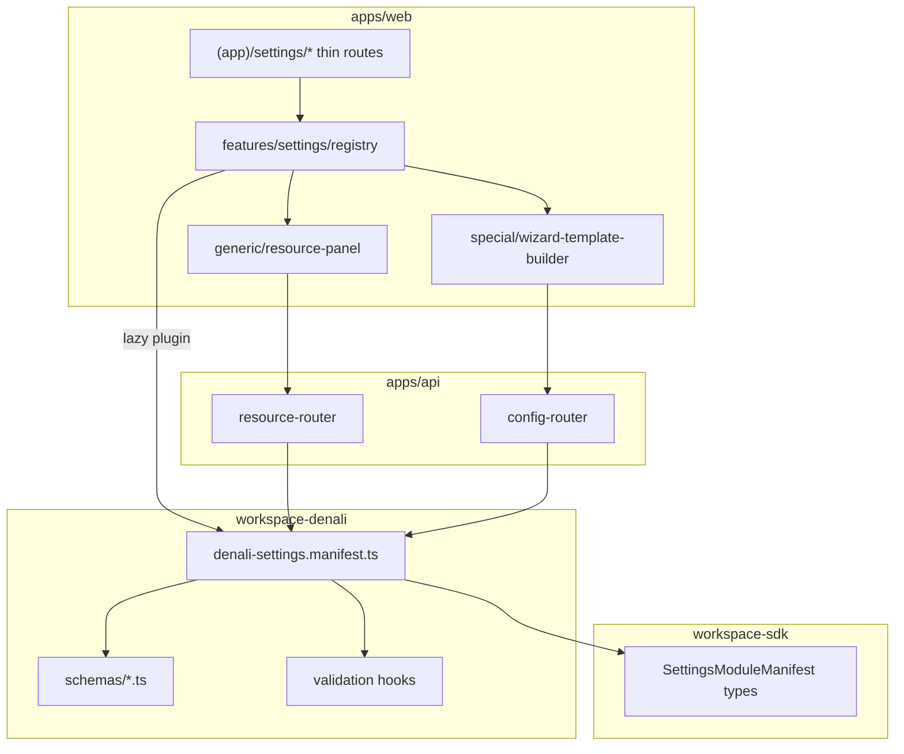

# Phase 9.6 — Settings Module Registry (architecture spec)

```yaml
spec_id: SETTINGS-MODULE-REGISTRY
version: "2026-06-08-v1"
decisions: [DEC-P9-009, DEC-P9-010, DEC-P9-005, DEC-P9-008]
invariants: [INV-P9-001, INV-P9-003, INV-P9-007, INV-P8-007]
risk_register: SETTINGS-RISK-REGISTER-P9.md
subphase: "9.6"
implementation_home:
  sdk_types: packages/workspace-sdk/src/operator/settings/
  denali_manifest: packages/workspaces/denali/src/settings/
  api_routers: apps/api/src/settings/
  web_features: apps/web/src/features/settings/
```

---

## 1. Problem statement

Legacy Denali settings (`legacy/apps/web/app/(app)/settings/`) mixes account prefs, workspace catalog CRUD, tenant JSON config, and observability in one flat tree with hardcoded navigation and duplicated panels. Phase 9.6 replaces this with a **manifest-driven registry** aligned to MAP §4 `WorkspacePlugin` — same pattern as Denali `field-registry`, not a second plugin system.

---

## 2. Architecture overview

```text
Request (denali.localhost)
  → tenant-kernel → tenant_id
  → identity session + hydrate (9.1)
  → resolve WorkspacePlugin (denali)
  → operatorSettings.manifest (DEC-P9-009)
  → CASL: operator.settings.{moduleId}
  → Router branch by module.kind
       reference_data → Prisma entity repo (DEC-P9-010)
       tenant_config  → tenant_config table + version + Zod
       readonly_explorer → read API only
  → Response + audit emit on mutation
```



---

## 3. Manifest contract (DEC-P9-009)

### 3.1 Discriminated union

| `kind`               | Purpose                                 | API surface                      | UI `uiVariant`            |
| -------------------- | --------------------------------------- | -------------------------------- | ------------------------- |
| `reference_data`     | Catalog rows (equipment, themes, …)     | `/settings/resources/{moduleId}` | `generic_crud` (default)  |
| `tenant_config`      | Versioned JSON config (wizard template) | `/settings/config/{configKey}`   | `schema_form` or `custom` |
| `readonly_explorer`  | Audit / triage read surfaces            | `/settings/explore/{moduleId}`   | `custom`                  |
| `account_preference` | User profile — **not** workspace        | `/identity/me/*` (9.1)           | routed to `/settings/me`  |

### 3.2 Required manifest fields

| Field           | Type          | Rule                                                     |
| --------------- | ------------- | -------------------------------------------------------- |
| `id`            | string        | `[a-z][a-z0-9_]*` · unique within plugin                 |
| `kind`          | enum          | see §3.1                                                 |
| `route`         | string        | under `(app)/settings/` without leading slash            |
| `ability`       | string        | must exist in CASL-OPERATOR-SPEC `operator.settings.*`   |
| `nav.group`     | enum          | `account` \| `workspace` \| `templates` \| `finance_ops` |
| `nav.labelKey`  | string        | i18n key                                                 |
| `schema`        | ZodObject ref | validated at register time                               |
| `configKey`     | string        | required when `kind=tenant_config`                       |
| `configVersion` | number        | ≥ 1 when `kind=tenant_config`                            |
| `entity`        | string        | Prisma model name when `kind=reference_data`             |

### 3.3 WorkspacePlugin extension (non-breaking)

```typescript
/** packages/workspace-sdk — optional on WorkspacePlugin */
interface OperatorSettingsSurface {
  readonly manifestVersion: 1;
  readonly modules: readonly SettingsModuleManifest[];
  resolveDefaults?(configKey: string): unknown;
}

interface WorkspacePlugin {
  // …existing fields…
  readonly operatorSettings?: OperatorSettingsSurface;
}
```

- **Starter / Urban:** omit `operatorSettings` or export empty modules array.
- **Denali:** full manifest in `packages/workspaces/denali/src/settings/denali-settings.manifest.ts`.

### 3.5 Trunk implementation (S9.6-R0)

| Artifact                               | Path                                                                       | Proof                       |
| -------------------------------------- | -------------------------------------------------------------------------- | --------------------------- |
| SDK types + `validateSettingsManifest` | `packages/workspace-sdk/src/operator/settings/settings-module-manifest.ts` | SDK-9.6-01                  |
| Denali module inventory (§7)           | `packages/workspaces/denali/src/settings/denali-settings.manifest.ts`      | DN-9.6-01                   |
| Plugin wiring                          | `WorkspacePlugin.operatorSettings` on `createDenaliWorkspacePlugin()`      | `settings-manifest.spec.ts` |

`validateSettingsManifest` fails closed on unknown `kind` values before API boot builds the frozen registry `Map`.

### 3.4 Registration flow

1. **Build time:** SDK exports types + `validateSettingsManifest(modules)`.
2. **API boot:** `getDenaliWorkspacePlugin().operatorSettings` → frozen registry Map.
3. **Web runtime:** `loadDenaliWorkspacePlugin()` → `useOperatorSettingsModules()` filters by CASL + host workspace.
4. **Reject unknown:** API returns **404** `SETTINGS_MODULE_UNKNOWN` if `moduleId` ∉ registry for resolved plugin.

---

## 4. Data model (DEC-P9-010 — LOCKED hybrid)

| Data class        | Storage                                                                                      | Rule                                                |
| ----------------- | -------------------------------------------------------------------------------------------- | --------------------------------------------------- |
| Reference catalog | **Normalized Prisma tables** per entity (`workspace_equipment`, `workspace_destinations`, …) | `tenant_id` + RLS · FK where tours reference ids    |
| Tenant config     | **`tenant_config`** row: `(tenant_id, config_key, config_version, payload jsonb)`            | Fetch by key; Zod validate; version migrate on read |
| User prefs        | **User / Membership** columns or identity API                                                | Never in workspace resource router                  |

**Forbidden for Phase 9.6:**

- Single `tenant_reference_items` JSON table for destinations/equipment (loses FK — R-P9-S03).
- Unversioned JSONB blobs for wizard template (R-P9-S02).

**Migration:** `infra/sql/007_operator_settings_delta.sql` (name TBD at implementation).

---

## 5. API routes

Authority: [`settings-api-dispatch-addendum.md`](settings-api-dispatch-addendum.md) v2.

### 5.1 Resource router (`reference_data`)

| Method | Path                                      | Auth                             |
| ------ | ----------------------------------------- | -------------------------------- |
| GET    | `/settings/resources/{moduleId}`          | session + module ability         |
| POST   | `/settings/resources/{moduleId}`          | `isAdminOrOwner` + ability       |
| PATCH  | `/settings/resources/{moduleId}/{itemId}` | same                             |
| DELETE | `/settings/resources/{moduleId}/{itemId}` | same                             |
| POST   | `/settings/resources/{moduleId}/reorder`  | when manifest `features.reorder` |

### 5.2 Config router (`tenant_config`)

| Method | Path                           | Auth                                  |
| ------ | ------------------------------ | ------------------------------------- |
| GET    | `/settings/config/{configKey}` | session + ability                     |
| PUT    | `/settings/config/{configKey}` | `isAdminOrOwner` + Zod + version bump |

**PUT side effects (DEC-P9-005):** `invalidateTenantConfig(tenantId, configKey)` → emit audit → **200**.

### 5.3 Manifest introspection (web shell)

| Method | Path                | Auth                                                      |
| ------ | ------------------- | --------------------------------------------------------- |
| GET    | `/settings/modules` | session — returns filtered manifest metadata (no secrets) |

---

## 6. Web structure

| Path                                              | Role                           |
| ------------------------------------------------- | ------------------------------ |
| `apps/web/app/(app)/settings/layout.tsx`          | thin — imports `SettingsShell` |
| `apps/web/app/(app)/settings/page.tsx`            | hub cards from manifest        |
| `apps/web/app/(app)/settings/me/page.tsx`         | account prefs (9.1 identity)   |
| `apps/web/app/(app)/settings/[moduleId]/page.tsx` | dispatches by `uiVariant`      |
| `apps/web/src/features/settings/`                 | all UI logic                   |

**Nav groups:**

| Group         | Modules                                    |
| ------------- | ------------------------------------------ |
| `account`     | `/settings/me` only                        |
| `workspace`   | equipment · locations · themes · languages |
| `templates`   | wizard template · presets                  |
| `finance_ops` | audit (9.6 read) · reconciliation (9.7)    |

---

## 7. Denali manifest inventory (Phase 9.6)

| id                      | kind              | entity / configKey                         | route                            |
| ----------------------- | ----------------- | ------------------------------------------ | -------------------------------- |
| `equipment`             | reference_data    | `WorkspaceEquipment`                       | `settings/equipment`             |
| `guide_languages`       | reference_data    | `WorkspaceGuideLanguage`                   | `settings/guide-languages`       |
| `tour_themes`           | reference_data    | `WorkspaceTourTheme`                       | `settings/tour-themes`           |
| `locations`             | reference_data    | `WorkspaceRegion` + `WorkspaceDestination` | `settings/locations`             |
| `tour_presets`          | reference_data    | `WorkspaceTourPreset`                      | `settings/tour-presets`          |
| `tour_wizard_template`  | tenant_config     | `wizard_template`                          | `settings/tour-wizard-template`  |
| `tour_presets_advanced` | tenant_config     | `presets_advanced`                         | `settings/tour-presets/advanced` |
| `audit_trail`           | readonly_explorer | —                                          | `settings/audit-trail`           |

---

## 8. Effective config resolver

```text
resolveEffectiveConfig(configKey, tenantId, plugin):
  1. row = tenant_config WHERE tenant_id AND config_key
  2. if row: migrate(payload, row.config_version) → validate Zod
  3. else: plugin.resolveDefaults(configKey) → validate Zod
  4. return { value, source: "tenant" | "workspace" }
```

Wizard `/tours/new` reads via this resolver after 9.6 (SMK-P9-05).

---

## 9. Implementation phases (doc execution order)

| Phase     | Deliverable                          | Spec                                    |
| --------- | ------------------------------------ | --------------------------------------- |
| **S9-R1** | SDK types + validateSettingsManifest | `settings-manifest.spec.ts` (sdk)       |
| **S9-R2** | Denali manifest + Zod schemas        | `denali/test/settings-manifest.spec.ts` |
| **S9-R3** | API routers + migration 007          | `settings-resources.spec.ts`            |
| **S9-R4** | Cache invalidate + audit             | `settings-template.spec.ts`             |
| **S9-R5** | Web shell + dynamic nav              | `settings-generic-crud.spec.ts`         |
| **S9-R6** | Pilot `equipment` vertical slice     | SMK-P9-08                               |
| **S9-R7** | `/settings/me` split                 | identity specs                          |
| **S9-R8** | Wizard builder + audit explorer      | SMK-P9-05                               |

Detailed checklist: [`TEMP/phase9-settings-registry-roadmap.md`](../../../TEMP/phase9-settings-registry-roadmap.md).

---

## 10. Verification bundle

```bash
pnpm --filter @app-tour/workspace-sdk test
pnpm --filter @app-tour/workspace-denali test
pnpm --filter @apps/api exec node --import tsx --test test/settings-resources.spec.ts
pnpm --filter @apps/api exec node --import tsx --test test/settings-modules.spec.ts
pnpm --filter @apps/web exec node --import tsx --test test/settings-generic-crud.spec.ts
pnpm run phase-9:guard
```

---

## 11. References

- Internal: [`SETTINGS-RISK-REGISTER-P9.md`](SETTINGS-RISK-REGISTER-P9.md) · [`CASL-OPERATOR-SPEC.md`](CASL-OPERATOR-SPEC.md) · [`subphases/9.6-settings-templates.md`](../subphases/9.6-settings-templates.md)
- External: [Manifest Pattern](https://andrewhathaway.net/blog/manifest-pattern) · [Capell Settings Registry](https://docs.capell.app/packages/admin/settings-schema-registry/) · [JSONB SaaS guidance](https://voxire.com/blog/postgresql-jsonb-vs-relational-saas-go/)
