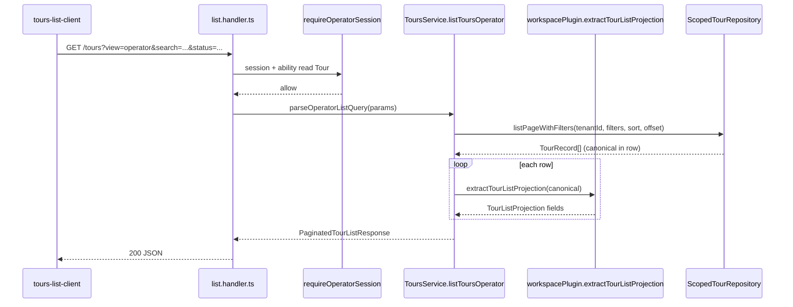

# Phase 9.3 — Tours List (Operator UX + implementation architecture)

```yaml
ux_spec_id: TOURS-LIST-UX
version: "2026-06-08-v1"
status: LOCKED
decisions: [DEC-P9-007, DEC-P9-008, DEC-P9-013, DEC-P9-014]
subphase: "9.3"
scope: "(app)/tours list surface only — edit/workspace/register are separate 9.3 rounds"
authority: subphases/9.3-tours-operator.md · tours-operator-api-dispatch-addendum.md
pattern: ADMIN-SHELL-UX.md · BOOKINGS-OPS-UX.md
legacy_reference:
  - legacy/apps/web/app/(app)/tours/
  - legacy/apps/web/app/(app)/tours/tours-list-view.tsx
  - legacy/apps/web/app/(app)/tours/_hooks/query-model.ts
  - legacy/apps/web/src/components/tours/TourCard.tsx
  - legacy/apps/api/src/modules/tours/dto/list-tours-query.dto.ts
trunk_baseline:
  - apps/api/src/tours/list-tours-query.ts
  - docs/phase-5/appendices/tours-list-endpoint.md
  - apps/api/test/1-functional/tours-list.spec.ts
```

> **Problem:** Operator admin needs a **production-grade tours index** — search, status tabs, sort, pagination, card grid, duplicate/create CTAs — not the Phase 5 **slim cursor index** (`id`, `createdAt` only). Legacy has full parity; trunk `(app)/tours` is **ABSENT**; API list lacks projection fields and operator filters.

---

## 1. Gap analysis (audit 2026-06-08)

### 1.1 Documentation (resolved S9.3-L-R0)

| Artifact                                  | Status                                | Notes                             |
| ----------------------------------------- | ------------------------------------- | --------------------------------- |
| `9.3-tours-operator.md`                   | **expanded**                          | List rounds · links TOURS-LIST-UX |
| `tours-operator-api-dispatch-addendum.md` | **v2**                                | `view=operator` · query params    |
| `TOURS-LIST-UX.md`                        | **LOCKED**                            | Master list spec                  |
| `TRACEABILITY-MATRIX-9.3.md`              | **LOCKED**                            | REQ-P9-030..032                   |
| OpenAPI / JSON schema                     | **TOURS-LIST-PROJECTION.schema.json** | List row contract                 |
| `AGENT-STATE-MAP-9.3.yaml`                | **18 states**                         | filter · URL · slim regression    |

### 1.2 Runtime (trunk — 2026-06-08)

| Layer                          | Status        | Notes                                                                 |
| ------------------------------ | ------------- | --------------------------------------------------------------------- |
| `GET /tours?view=operator`     | ✅ R1         | Projection + search/status/sort/offset — `list-tours-operator.ts`     |
| `GET /tours?view=slim`         | ✅ Phase 5    | Cursor regression preserved (CP-9.3-L13)                              |
| Denali list card extractor     | ✅ R1         | `packages/workspaces/denali/src/list/tour-list-projection.ts`         |
| `(app)/tours` page + BFF       | ✅ R2         | `tours-page-client.tsx` · `/api/tours` proxy                          |
| Card grid + toolbar (R3)       | ✅ R3         | `tour-card.tsx` · status/sort/pagination · shadcn (DEC-P9-013 R1)     |
| Empty/duplicate states (R4)    | ✅ R4         | Catalog vs filter empty · clone CTA · member role gates (CP-9.3-L14)  |
| Legacy lifecycle FSM           | ❌            | Status buckets use canonical projection (DEC-P9-014)                    |
| `(app)/tours/[id]/edit`        | ❌            | Post-list round — stub navigation target only                         |
| `tours-list.spec.ts` (web)     | ✅ PARTIAL    | Query model + landmarks; R3/R4 filter/pagination proofs in flight       |

### 1.3 Legacy parity inventory (list-only)

| Feature            | Legacy                                                  | 9.3 target                                             |
| ------------------ | ------------------------------------------------------- | ------------------------------------------------------ |
| Route              | `(app)/tours`                                           | same                                                   |
| URL-synced filters | `?search=&status=&category=&sort=&page=&limit=`           | same model · `category` Denali-only chip UI (2026-06-10) |
| Status filter UI   | all · draft · active · archived                         | same labels (fa/en)                                    |
| Search debounce    | 300ms                                                   | same                                                   |
| Sort columns       | title · price (+ API: created_at, difficulty, category) | **title · price · createdAt** (MVP); category **filter** shipped (sort by category deferred) |
| Pagination         | offset page/limit                                       | offset (operator UI)                                   |
| Card grid          | responsive CSS grid                                     | mobile-first 1-col → 2-col → 3-col                     |
| Row click          | → `/tours/{id}` (detail)                                | → `/tours/{id}/edit` (operator default)                |
| Duplicate          | admin → `/tours/new?clone={id}`                         | same (DEC-P9-007)                                      |
| Create CTA         | header + empty state                                    | admin/owner only                                       |
| Member read        | list visible, no duplicate/create                       | CASL                                                   |
| Loading            | skeleton toolbar + 6 cards                              | same                                                   |
| Empty states       | no tours · no match · sign-in                           | same semantics                                         |
| RTL                | logical CSS                                             | required                                               |

---

## 2. Design north star

| Principle                  | Implementation                                                                   |
| -------------------------- | -------------------------------------------------------------------------------- |
| **Mobile-first**           | Single-column cards; toolbar stacks; sticky pagination footer                    |
| **URL as SoT**             | `TourListQueryModel` ↔ `useSearchParams` — shareable/bookmarkable                |
| **Projection not hydrate** | List API returns `TourListProjection` — never full `canonical` per row (DEC-129) |
| **Plugin extraction**      | Denali `extractTourListProjection(canonical)` — workspace-specific paths         |
| **Operator stack**         | Tailwind v4 + shadcn in `(app)/tours/**` only (DEC-P9-013 R1)                  |
| **No wizard duplicate**    | Create/clone → `/tours/new` only (DEC-P9-007)                                    |
| **Tenant scope**           | RLS + CASL on every list row (TQ-P9-004)                                         |

---

## 3. Information architecture

```text
(app)/tours                          ← Tours list (this spec)
(app)/tours/[id]/edit                ← 9.3-R2 (out of list scope)
(app)/tours/[id]/workspace           ← 9.3-R3
/tours/new                           ← Phase 6 wizard (create + ?clone=)
/tours/new?clone={tourId}            ← Duplicate flow
```

### Navigation entry

From **9.2 OperatorShell** nav item `Tours` → `(app)/tours`. Breadcrumb: Dashboard → Tours.

---

## 4. API — operator list projection (DEC-P9-014)

Extends Phase 5 `GET /tours` for **operator mode** without breaking slim cursor consumers.

### 4.1 Query parameters

| Param           | Type               | Default                             | Max       | Notes                                                    |
| --------------- | ------------------ | ----------------------------------- | --------- | -------------------------------------------------------- |
| `view`          | `slim \| operator` | `operator` when session is operator | —         | `slim` preserves Phase 5 cursor shape                    |
| `search`        | string             | —                                   | 200 chars | Case-insensitive match on `title` + `shortDescription`   |
| `status`        | enum               | —                                   | —         | `active` · `completed` · `archived` (legacy API buckets) |
| `page`          | int                | 1                                   | —         | 1-based; ignored when `view=slim` + cursor               |
| `limit`         | int                | 10                                  | 100       | Operator default **10** (legacy); slim default **50**    |
| `sort_by`       | enum               | `created_at`                        | —         | `created_at` · `title` · `price`                         |
| `sort_dir`      | enum               | `desc`                              | —         | `asc` · `desc`                                           |
| `cursor`        | string             | —                                   | —         | **slim view only** — unchanged Phase 5                   |
| `include_total` | bool               | true                                | —         | Set false for keyset-only clients                        |

**Status bucket mapping (legacy parity → canonical projection):**

| API `status` | UI label (fa)      | Projection `listStatus` values    |
| ------------ | ------------------ | --------------------------------- |
| `active`     | پیش‌نویس / draft   | `draft`                           |
| `completed`  | فعال / active      | `open`, `published`               |
| `archived`   | بایگانی / archived | `closed`, `cancelled`, `archived` |

Until lifecycle FSM lands (gap analysis P0), **`listStatus`** is derived from Denali canonical `details.status` + plugin normalizer.

### 4.2 Response shape — operator view

```typescript
/** @see schemas/TOURS-LIST-PROJECTION.schema.json */
export type TourListProjection = {
  readonly id: string;
  readonly tenantId: string;
  readonly createdAt: string; // ISO-8601
  readonly updatedAt: string;
  readonly rowVersion: number;
  readonly title: string;
  readonly shortDescription: string | null;
  readonly listStatus: "draft" | "open" | "published" | "closed" | "cancelled" | "archived";
  readonly uiStatus: "draft" | "active" | "archived"; // card badge bucket
  readonly priceAmount: number | null; // normalized USD or tenant currency minor units
  readonly priceCurrency: string | null; // ISO 4217
  readonly totalCapacity: number | null;
  readonly acceptedCount: number; // 0 until 9.5 registration index; stub 0 in 9.3-L-R1
  readonly category: string | null;
  readonly coverImageUrl: string | null;
  readonly departureAt: string | null; // ISO-8601 from startDateTime
};

export type PaginatedTourListResponse = {
  readonly items: readonly TourListProjection[];
  readonly total: number;
  readonly page: number;
  readonly limit: number;
};
```

**Forbidden in list response:** full `canonical` blob (DEC-129 egress budget).

### 4.3 Handler pipeline



### 4.4 File targets (API)

| File                                                               | Role                                     |
| ------------------------------------------------------------------ | ---------------------------------------- |
| `apps/api/src/tours/list-tours-query.ts`                           | Extend parser — `parseOperatorListQuery` |
| `apps/api/src/tours/list-operator.types.ts`                        | `TourListProjection`, response types     |
| `apps/api/src/tours/list.handler.ts`                               | Branch `view=slim` vs `operator`         |
| `apps/api/src/canonical/canonical-tour.service.ts`                 | `listToursOperator`                      |
| `packages/workspaces/denali/src/list/tour-list-projection.ts`      | Denali extractor                         |
| `packages/workspace-sdk/src/tour/tour-list-projection.contract.ts` | Plugin interface (doc-first)             |

### 4.5 Denali projection paths

| Projection field   | Canonical path (Denali)                            |
| ------------------ | -------------------------------------------------- |
| `title`            | `title`                                            |
| `shortDescription` | `program.shortDescription`                         |
| `listStatus`       | `details.status` → normalizer                      |
| `priceAmount`      | `costContext.totalAmount` or plugin price resolver |
| `totalCapacity`    | `capacityMax`                                      |
| `category`         | `category`                                         |
| `coverImageUrl`    | `photos[0].url`                                    |
| `departureAt`      | `startDateTime`                                    |

> **Trunk note (2026-06-08):** Denali canonical persists `publishStatus` (`draft` \| `active`) at the top-level `data` root — not legacy `details.status`. `extractTourListProjection` maps `publishStatus` → `listStatus` / `uiStatus` per §4.1 bucket table until lifecycle FSM lands.

Starter workspace uses `basics.title` — plugin hook keeps API workspace-agnostic.

### 4.6 Trunk implementation (S9.3-L-R0)

| Artifact           | Path                                                                                    | Proof                                   |
| ------------------ | --------------------------------------------------------------------------------------- | --------------------------------------- |
| SDK contract types | `packages/workspace-sdk/src/tour/tour-list-projection.contract.ts`                      | exported from `@app-tour/workspace-sdk` |
| Denali extractor   | `packages/workspaces/denali/src/list/tour-list-projection.ts`                           | DN-9.3-01                               |
| Plugin wiring      | `WorkspacePlugin.tourList.extractTourListProjection` on `createDenaliWorkspacePlugin()` | `tour-list-projection.spec.ts`          |

Row metadata (`id`, `tenantId`, `createdAt`, `updatedAt`, `rowVersion`) is merged in `apps/api/src/tours/list-tours-operator.ts` via `buildTourListProjection` — the plugin hook returns **canonical-derived fields only** (`TourListProjectionFields`). `GET /tours` branches on `view=slim` (Phase 5 cursor) vs `view=operator` (session required).

---

## 5. Web — page structure

### 5.1 File layout

```text
apps/web/app/(app)/tours/
├── page.tsx                          # RSC metadata + OperatorToursPageClient
├── tours-page-client.tsx             # page chrome + actions
├── tours-list-view.tsx               # list body (port of legacy view)
├── tours-list-view.module.css
├── tours-list-logic.ts               # sort/filter helpers (client-side fallback none — server filters)
├── tour-status-badge.tsx
├── _hooks/
│   ├── query-model.ts                # URL ↔ TourListQueryModel
│   ├── use-tours-query-params.ts
│   └── use-tours-data.ts             # fetch GET /tours?view=operator
└── components/
    ├── tour-list.tsx                 # ul grid wrapper
    ├── tour-list-grid.module.css
    ├── tour-card.tsx                 # card (promote ui-primitives Card in 9.3-L-R3)
    ├── tour-card.module.css
    └── tours-list-skeleton.tsx

apps/web/src/features/tours/
├── operator-tours-client.ts          # typed fetch + error mapping
└── map-tour-list-projection.ts       # API → view model
```

### 5.2 URL query model

Port legacy `query-model.ts` verbatim semantics:

```typescript
export type TourListQueryModel = {
  search: string;
  page: number; // default 1
  limit: number; // default 10
  status: "all" | "active" | "completed" | "archived"; // API buckets; "all" omits param
  sort: { column: string; dir: "asc" | "desc" }; // default createdAt.desc
};
```

**UI ↔ API status mapping** (legacy `tours-list-view.tsx`):

| UI select value | Query model `status` | API `status` param |
| --------------- | -------------------- | ------------------ |
| all             | all                  | _(omit)_           |
| draft           | active               | `active`           |
| active          | completed            | `completed`        |
| archived        | archived             | `archived`         |

Serialize omits defaults (stable alphabetical param order per legacy).

### 5.3 Mobile-first wireframes

**Mobile (<768px):**

```text
┌─────────────────────────────────────┐
│ Tours                    [+ تور جدید]│
│ مدیریت تورهای workspace            │
├─────────────────────────────────────┤
│ [🔍 جستجو...                    ]   │
│ [ وضعیت ▼ پیش‌نویس ]                │
│ مرتب‌سازی: [عنوان] [قیمت]           │
├─────────────────────────────────────┤
│ ┌─────────────────────────────────┐ │
│ │ [badge: فعال]                   │ │
│ │ کویر مرکزی · ۲ شب              │ │
│ │ از ۱,۲۰۰ USD · ۸/۱۲ صندلی       │ │
│ │ [مشاهده] [کپی]                  │ │
│ └─────────────────────────────────┘ │
│ ... cards ...                       │
├─────────────────────────────────────┤
│ صفحه ۱ از ۳ · ۲۴ تور  [قبل][بعد]   │
└─────────────────────────────────────┘
```

**Desktop (≥1024px):** 3-column card grid; toolbar inline (search flex-grow + status select fixed width).

### 5.4 Tour card content

| Zone   | Content                                | Source                          |
| ------ | -------------------------------------- | ------------------------------- |
| Header | Title (truncate 2 lines)               | `title`                         |
| Badge  | `TourStatusBadge`                      | `uiStatus`                      |
| Meta   | Departure date (Jalali when locale fa) | `departureAt`                   |
| Meta   | Price formatted                        | `priceAmount` + `priceCurrency` |
| Meta   | Seats `acceptedCount/totalCapacity`    | projection                      |
| Body   | Short description (2 lines)            | `shortDescription`              |
| Footer | Primary: View · Ghost: Duplicate       | CASL admin/owner for duplicate  |
| Cover  | Optional thumbnail left/top            | `coverImageUrl`                 |

**Tap target:** entire card navigates to `/tours/{id}/edit` except action buttons (stopPropagation).

### 5.5 Page states

| State           | UI                                                                          |
| --------------- | --------------------------------------------------------------------------- |
| Session loading | `LoadingState` in card shell                                                |
| Unauthenticated | `EmptyState` + redirect login (layout should prevent — belt-and-suspenders) |
| Fetch loading   | toolbar skeleton + `ToursListSkeleton` ×6                                   |
| Fetch error     | `ErrorState` with retry                                                     |
| Empty catalog   | `EmptyState` + create CTA (admin/owner)                                     |
| Empty filter    | `EmptyState` contextual message (search + status)                           |
| Refetching      | `aria-busy` on list shell; keep prior rows visible                          |

### 5.6 Role gates

| Action             | admin/owner | member                                             |
| ------------------ | ----------- | -------------------------------------------------- |
| View list          | ✅          | ✅                                                 |
| Search/filter/sort | ✅          | ✅                                                 |
| Create tour CTA    | ✅          | ❌ hidden                                          |
| Duplicate          | ✅          | ❌ hidden                                          |
| Card navigate edit | ✅          | ✅ read-only edit or detail stub until ACL refined |

---

## 6. Data fetching

```typescript
// use-tours-data.ts — React Query or fetch + useEffect (match apps/web conventions)
export function useToursData(query: TourListQueryModel, options?: { enabled?: boolean }) {
  // GET /tours?view=operator&search&status&page&limit&sort_by&sort_dir
  // Headers: session cookie (9.1) + tenant host
  // Returns { tours, total, page, limit, isLoading, isFetching, error }
}
```

**Debounce:** search input 300ms before URL update (legacy `useToursQueryParams`).

**Cache key:** `['operator-tours', tenantId, serializedQuery]`.

**No BFF required for 9.3-L** — direct API with HttpOnly session mirror (DEC-P9-012) unless CORS blocks; if blocked, add `apps/web/app/api/tours/route.ts` proxy (document in dispatch addendum).

---

## 7. Completion proof matrix (list)

| ID         | Check                                          | Pass                             |
| ---------- | ---------------------------------------------- | -------------------------------- |
| CP-9.3-L01 | GET `/tours?view=operator` returns projections | API spec                         |
| CP-9.3-L02 | `search` filters title                         | API spec                         |
| CP-9.3-L03 | `status=active` returns draft bucket only      | API spec                         |
| CP-9.3-L04 | `sort_by=title&sort_dir=asc` ordering          | API spec                         |
| CP-9.3-L05 | Cross-tenant row leak                          | empty / 403 ASM-9.3-009          |
| CP-9.3-L06 | `(app)/tours` renders post-login               | WEB-9.3-01                       |
| CP-9.3-L07 | URL updates on filter change                   | WEB-9.3-03                       |
| CP-9.3-L08 | Mobile 375px — card single column              | visual / spec                    |
| CP-9.3-L09 | Duplicate → `/tours/new?clone=`                | DEC-P9-007                       |
| CP-9.3-L10 | No `(app)/tours/new` route                     | P9-F-004                         |
| CP-9.3-L11 | List response excludes full canonical          | DEC-129                          |
| CP-9.3-L12 | Denali extractor unit tests                    | plugin spec                      |
| CP-9.3-L13 | `view=slim` regression                         | Phase 5 tours-list.spec.ts green |
| CP-9.3-L14 | Member sees list, no create CTA                | CASL                             |
| CP-9.3-L15 | RTL toolbar layout mirrors                     | fa locale spec                   |

---

## 8. Implementation rounds (list-only)

| Round         | Deliverables                                   | Proof                      |
| ------------- | ---------------------------------------------- | -------------------------- |
| **S9.3-L-R0** | This doc · DEC-P9-014 · schema · traceability  | `phase-9:guard`            |
| **S9.3-L-R1** | API operator list + Denali extractor           | CP-9.3-L01..05 · L11 · L13 |
| **S9.3-L-R2** | `(app)/tours` page + query hooks + fetch       | CP-9.3-L06..07             |
| **S9.3-L-R3** | Card grid + filters + mobile layout + skeleton | CP-9.3-L08 · L14 · L15     |
| **S9.3-L-R4** | Duplicate/create CTAs + empty states           | CP-9.3-L09 · L10           |

**Prerequisites:** 9.1 session · 9.2 shell nav link to `/tours`.

**Out of scope (same subphase, later rounds):** edit page, workspace tabs, register, leader alias.

---

## 9. Test contract

| Case ID     | Layer | Scenario                  | Expected                        |
| ----------- | ----- | ------------------------- | ------------------------------- |
| API-9.3-L01 | API   | GET operator list anon    | 401                             |
| API-9.3-L02 | API   | search=کویر               | matching titles only            |
| API-9.3-L03 | API   | status=completed          | open/published rows             |
| API-9.3-L04 | API   | member list               | 200 read                        |
| WEB-9.3-01  | Web   | authenticated list        | 200 + `[data-testid=tour-list]` |
| WEB-9.3-02  | Web   | create link href          | `/tours/new`                    |
| WEB-9.3-03  | Web   | status select updates URL | `?status=active`                |
| WEB-9.3-04  | Web   | duplicate button          | navigates clone URL             |
| WEB-9.3-05  | Web   | empty catalog             | empty state + CTA               |

Target files: `apps/api/test/tours-operator.spec.ts` · `apps/web/test/tours-list.spec.ts`.

---

## 10. Anti-patterns (FAIL)

| ID         | Pattern                                                      |
| ---------- | ------------------------------------------------------------ |
| AH-9.3-L01 | N+1 `GET /tours/:id` per card to hydrate list                |
| AH-9.3-L02 | Full canonical in list JSON                                  |
| AH-9.3-L03 | Client-only filter of 500 rows (no API filter)               |
| AH-9.3-L04 | `(app)/tours/new` wizard duplicate                           |
| AH-9.3-L05 | `@tour/ui` or legacy runtime import                          |
| AH-9.3-L06 | Hardcoded Denali paths in `apps/web` (use plugin projection) |

---

## 11. Verification bundle

```bash
pnpm --filter @apps/api exec node --import tsx --test test/tours-operator.spec.ts
pnpm --filter @apps/api exec node --import tsx --test test/1-functional/tours-list.spec.ts
pnpm --filter @apps/web exec node --import tsx --test test/tours-list.spec.ts
pnpm --filter @app-tour/workspace-denali exec node --import tsx --test test/tour-list-projection.spec.ts
pnpm run phase-9:guard
```

---

## 12. Cross-references

| Artifact                                                                                      | Role                     |
| --------------------------------------------------------------------------------------------- | ------------------------ |
| [`DEC-P9-014`](IMPLEMENTATION-DECISIONS.md)                                                   | Operator list projection |
| [`TRACEABILITY-MATRIX-9.3.md`](TRACEABILITY-MATRIX-9.3.md)                                    | REQ ↔ tests              |
| [`tours-operator-api-dispatch-addendum.md`](tours-operator-api-dispatch-addendum.md)          | Handler + query dispatch |
| [`schemas/TOURS-LIST-PROJECTION.schema.json`](schemas/TOURS-LIST-PROJECTION.schema.json)      | Response contract        |
| [`legacy-vs-denali-gap-analysis.md`](../../../apps/api/docs/legacy-vs-denali-gap-analysis.md) | Tours HTTP gap           |
