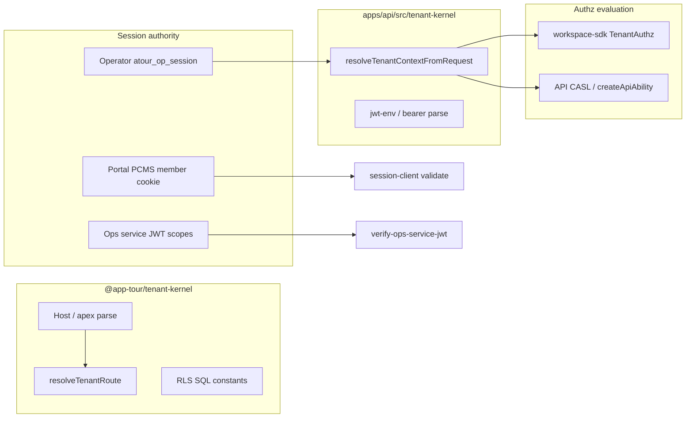

# SK1 — Tenant + Authz Contract Hardening

```yaml
doc_id: SK1_TENANT_AUTHZ_CONTRACTS
tranche: SK1
status: CLOSED
as_of_tip: 612fdfcb
date: 2026-07-20
code_changes_this_doc: none
prerequisite: SK0 maturity inventory filed
```

**Principle:** Harden **contracts and ownership**, do not invent a second Tenant Kernel beside Phase 4, and do not move JWT/request ingress into `@app-tour/tenant-kernel` without an explicit extraction ADR.

---

## 1. Goal

Make tenant boundary and authorization **consumable and unambiguous** across surfaces:

- One package SoT for **host/RLS/route** (`@app-tour/tenant-kernel`)
- One host SoT for **API request identity ingress** (`apps/api/src/tenant-kernel/`)
- One member-session SoT (**PCMS** / portal)
- Operator and ops-service auth remain separate actors

---

## 2. Critical finding — dual “tenant-kernel” surfaces

| Surface | Path | Owns | Must not own |
| ------- | ---- | ---- | ------------ |
| **Package** | `packages/tenant-kernel` | Host parse, custom apex, cookie domain helpers, RLS session SQL constants, `resolveTenantRoute`, `TenantConnectionRouter` | Nest, Prisma, JWT verify, `resolveTenantContextFromRequest` |
| **API host module** | `apps/api/src/tenant-kernel/` | Request ingress: JWT bearer, gated dev bearer, test-only headers → `TenantAuthContext` | Portal member cookie write; Denali business rules |

Phase 4.1 already states JWT / `resolveTenantContextFromRequest` are **not** in the package until a dedicated extraction. SK1 **preserves** that split.



---

## 3. Frozen public contract — `@app-tour/tenant-kernel`

**Allowed exports (current `src/index.ts` — treat as freeze baseline):**

| Category | Symbols |
| -------- | ------- |
| Host constants | `DEFAULT_TENANT_HOST_RESERVED_LABELS`, `parseReservedLabelsCsv`, `TENANT_MAX_HOST_LENGTH`, `TENANT_SUBDOMAIN_REGEX` |
| Host parse | `normalizeRootDomain`, `parseWorkspaceTenantLabelFromHost`, `resolveWorkspaceSlugFromNormalizedHost`, `parseMultiLevelTenantHost`, `isClubAdminHost`, `isPlatformAdminHost`, custom-apex helpers, `buildDev*PublicBaseUrl`, `resolveMemberSessionCookieDomain` |
| RLS | `RLS_TENANT_SETTING`, `SET_LOCAL_RLS_TENANT_SQL`, `RESET_RLS_TENANT_SQL` |
| Route | `TenantRoute`, `TenantTier`, `TenantRouteRow`, `resolveTenantRoute`, `TENANT_ROUTE_MISCONFIGURED`, `TenantConnectionRouter`, `TenantRouteLookup` |

**Forbidden to add without ADR + Phase 4 alignment:**

- Prisma / DB clients  
- `resolveTenantContextFromRequest`  
- JWT parsers / key loaders  
- Workspace plugin types  
- Denali/Urban product imports  

**Consumers today:** primarily `apps/api/src/tenant/tenant-route-lookup.ts` (types). Portal/marketing use package host helpers via PCMS code_sot list — keep that direction.

---

## 4. Authz ownership matrix (do not collapse)

| Actor | Cookie / credential | Authority doc / code | Kernel rule |
| ----- | ------------------- | -------------------- | ----------- |
| **Member** | `atour_mb_session` | PCMS-001 · `apps/portal` write · `session-client` verify | Kernel must **not** become second member-session writer |
| **Operator** | `atour_op_session` | `apps/web` + API `require-operator-session` | Separate from member; header ingress test-only |
| **Ops service** | Service JWT + scopes (e.g. `finance:recon`) | `verify-ops-service-jwt` | Scope ≠ operator cookie; Stabilization P0 lessons stand |
| **Theme / workspace gate** | N/A (authz object) | `workspace-sdk` `buildTenantAuthz` / CASL bridge | Authz before theme ingress (existing handoff order) |

---

## 5. SK1 work items (ordered, careful)

### SK1.A — Documentation freeze (this doc) — **DONE when filed**

- [x] Dual-surface naming called out  
- [x] Package export freeze table  
- [x] Authz ownership matrix  

### SK1.B — Naming clarity (docs + optional code comment only)

| Action | Risk | Decision |
| ------ | ---- | -------- |
| Rename `apps/api/src/tenant-kernel/` → e.g. `tenant-ingress/` | High churn | **Defer** — document alias first; rename only with dedicated PR + import-boundary update |
| Add README in `apps/api/src/tenant-kernel/README.md` pointing to package vs host | Low | **Done** — `apps/api/src/tenant-kernel/README.md` |

### SK1.C — Contract tests (package only)

| Action | Verify |
| ------ | ------ |
| Assert package public API allowlist matches freeze table | **Done** — `packages/tenant-kernel/test/sk1-public-api-freeze.spec.ts` |
| Guard: package src has zero Prisma / Nest / `apps/` imports | **Done** — same spec (static src walk) |

### SK1.D — PCMS / operator boundary smoke (no product UI)

| Action | Verify |
| ------ | ------ |
| Keep `pnpm run guard:pcms-authority` as Kernel-adjacent gate for SK1 close | Fast-track only |
| Do not reclaim portal login modal WIP under SK1 | Explicit non-goal |

### SK1.E — Out of scope for SK1

- Moving JWT ingress into `@app-tour/tenant-kernel`  
- Entitlement productization (SK3)  
- Notification providers (SK2)  
- Blind merge `origin/DEV`  
- Full `phase-4:gate` without Architect YES  

---

## 6. Definition of Done — SK1

SK1 is **CLOSED** when (all met):

1. Design accepted (Architect continue) — **yes**  
2. Package export freeze spec — **done** (`packages/tenant-kernel/test/sk1-public-api-freeze.spec.ts`)  
3. API host README for dual-surface — **done** (`apps/api/src/tenant-kernel/README.md`)  
4. `guard:pcms-authority` + `guard:import-boundary` — **both PASS**  
5. No member-session write path added outside portal — **held**

**SK1 CLOSED.** Next tranche: SK2 (Notification on outbox) — design-first before code.

---

## 7. Suggested next PR sequence (after design accept)

```text
PR-SK1-docs   (this file + README/CHARTER links)     ← landed
PR-SK1-readme (apps/api/src/tenant-kernel/README.md) ← landed
PR-SK1-freeze (tenant-kernel export allowlist spec)  ← landed (this tip)
PR-SK1-close  (guard:pcms-authority + mark SK1 CLOSED)
```

No Shared Kernel package scaffolding in SK1.

---

## 8. Cross-links

- [MATURITY_INVENTORY.md](./MATURITY_INVENTORY.md) (SK0)  
- [CHARTER.md](../CHARTER.md)  
- Phase 4.1: `docs/phase-4/subphases/4.1-tenant-kernel.md`  
- PCMS: `docs/standards/member-session-portal-authority.mdoc`  
- WRS: `docs/standards/workspace-routing-standard.mdoc`  

---

*SK1 design. Code only after this design is accepted and only per §7 sequence.*
