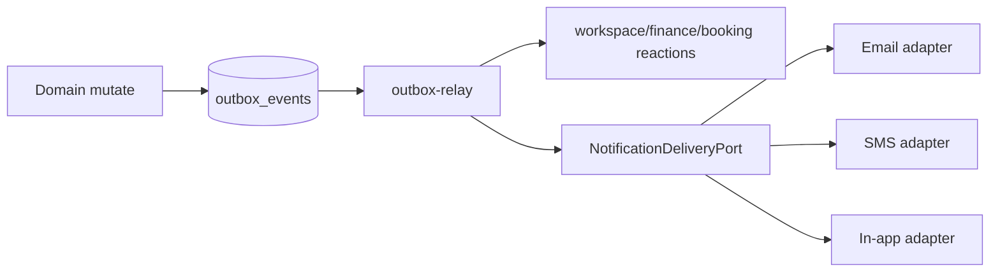

# SK2 — Notification on Outbox

```yaml
doc_id: SK2_NOTIFICATION_OUTBOX
tranche: SK2
status: DESIGN_CLOSED
code_scaffold: apps/api/src/notifications (SK2.C LANDED)
```

**Principle:** Notifications are **effects of durable outbox events**, not a parallel fire-and-forget bus. Reuse Stabilization P0 relay posture. Do not invent a Denali-shaped mailer inside the kernel.

---

## 1. Goal

Define a provider-agnostic **Notification delivery contract** driven by the existing outbox + relay, so Email / SMS / in-app adapters can plug in without workspaces forking delivery.

---

## 2. Current reality (inventory)

| Piece | Location | Role |
| ----- | -------- | ---- |
| Enqueue | `apps/api/src/outbox/enqueue-domain-event.ts` | Persist domain event rows |
| Relay | `apps/api/src/outbox/outbox-relay.ts` | Claim / publish / mark done under tenant session |
| Production posture | `assert-production-outbox-relay-posture.ts` | In-process **or** external worker + `APPS_API_WORKER_ROLE=outbox-relay` |
| Workspace side-effects | `workspace-outbox-side-effects.generated.ts` + finance/booking reactions | Domain reactions — **not** a unified notifier |
| Product notification platform | **Absent** | No Email/SMS/in-app kernel package yet |

There is **no** `NotificationPort` package today. SK2 must not create an empty `packages/notification-kernel` until a first real adapter ships in the same PR.

---

## 3. Target contract (design freeze)

```ts
// Target shape — implement in code PR, not in this doc alone
export type NotificationChannel = "email" | "sms" | "in_app";

export type NotificationCommand = {
  readonly tenantId: string;
  readonly channel: NotificationChannel;
  readonly templateId: string;
  readonly recipient: { readonly userId?: string; readonly address?: string };
  readonly payload: Readonly<Record<string, unknown>>;
  readonly correlationId: string; // domainEventId or explicit
};

export interface NotificationDeliveryPort {
  deliver(command: NotificationCommand): Promise<{ readonly ok: true } | { readonly ok: false; readonly retryable: boolean }>;
}
```

### Rules

1. **Enqueue first** — user-visible notify paths must leave an outbox (or outbox-backed) record before calling providers.  
2. **Tenant required** — every command carries `tenantId`; providers must not cross tenants.  
3. **Idempotent delivery** — relay / provider adapters key on `correlationId` + channel.  
4. **Fail-closed production** — existing `assertProductionOutboxRelayPosture` remains mandatory; notification workers inherit the same worker-role discipline when external.  
5. **No business templates in kernel** — template IDs are opaque; Denali copy lives in workspace/adapters.  
6. **PCMS / operator unchanged** — notification ≠ session authority.



---

## 4. Work items

### SK2.A — Design freeze (this doc) — **DONE when filed**

- [x] Inventory outbox as transport SoT  
- [x] Port shape + rules  
- [x] Explicit non-goals  

### SK2.B — Host README pointer

| Action | Status |
| ------ | ------ |
| `apps/api/src/outbox/README.md` — outbox = notification transport backbone; link SK2 | **Done** |

### SK2.C — First adapter PR — **LANDED**

| Field | Value |
| ----- | ----- |
| Unlock | Architect `YES — IMPL-SK2.C` (2026-07-21) |
| `first_event` | `registration.approved` |
| `channel` | `in_app` |
| `owner` | Architect (chat unlock) |
| Implementation notes | [SK2_C_IMPLEMENTATION.md](./SK2_C_IMPLEMENTATION.md) |
| Evidence | `apps/api/src/notifications/*` + relay wire; `notification-delivery.port.spec.ts` 5/5 PASS |

| Action | Status |
| ------ | ------ |
| `NotificationDeliveryPort` + in_app adapter (no hollow package) | **Done** |
| Specs: idempotent deliver + tenant on command | **Done** |
| Relay posture tests unchanged | **Done** (posture 5/5 PASS) |
| Wire from outbox relay for `registration.approved` | **Done** |

### SK2.D — Explicit non-goals

- Marketing campaign product / inbox UI  
- Replacing finance/booking side-effects with a mega-notifier  
- Moving JWT / tenant ingress into notification code  
- Full `phase-*:gate` without YES  

---

## 5. Definition of Done — SK2 (tranche)

| Tier | Criteria |
| ---- | -------- |
| **SK2 design closed** | This doc + outbox README filed; CHARTER points here |
| **SK2 implementation closed** | SK2.C landed — [SK2_C_IMPLEMENTATION.md](./SK2_C_IMPLEMENTATION.md) |

This close of the Stabilization→Kernel train treats **SK2 design** as the required deliverable; implementation waits for an explicit consumer (avoid empty kernel).

---

## 6. Cross-links

- [CHARTER.md](../CHARTER.md)  
- [MATURITY_INVENTORY.md](./MATURITY_INVENTORY.md)  
- Stabilization outbox P0: `docs/phase-20/p7/appendices/HOSTILE_AUDIT_REMEDIATION.md`  
- SK1 dual-surface: [SK1_TENANT_AUTHZ_CONTRACTS.md](./SK1_TENANT_AUTHZ_CONTRACTS.md)  

---

*SK2 design. Implementation only with first consumer adapter PR.*
