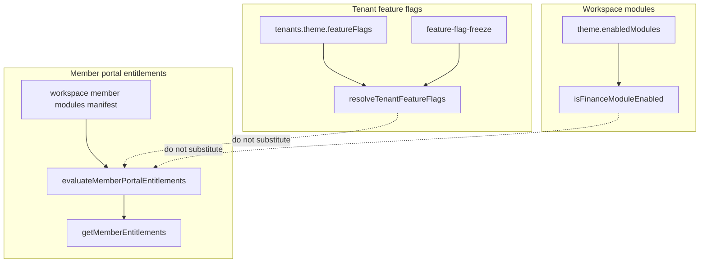

# SK3 — Entitlement + Feature Flags Contracts

```yaml
doc_id: SK3_ENTITLEMENT_FLAGS
tranche: SK3
status: DESIGN_CLOSED
as_of_tip: 7d23d38e
date: 2026-07-20
code_scaffold: none_hollow_package
```

**Principle:** Three **different** controls already exist. SK3 freezes their ownership and forbids collapsing them into one “EntitlementKernel” mega-package or a subscription UI.

---

## 1. Goal

Make “what a tenant/workspace/member may use” **explicit and non-overlapping**:

| Control | Question it answers |
| ------- | ------------------- |
| **Tenant feature flags** | Runtime product knobs on `tenants.theme.featureFlags` (e.g. advanced rule engine) |
| **Theme enabled modules** | Which **workspace capability modules** are on (e.g. `finance`) |
| **Member portal entitlements** | Which **member portal module keys** a member may see/use |

Workspaces declare keys via manifests; they do not evaluate authority.

---

## 2. Inventory (do not reinvent)

### A — Tenant feature flags

| Piece | Path |
| ----- | ---- |
| Resolve | `apps/api/src/tenant/resolve-tenant-feature-flags.ts` |
| Type | `TenantFeatureFlags` — `{ advancedRuleEngine: boolean; inAppRegistrationApprovedNotify: boolean }` |
| Storage | `tenants.theme.featureFlags` (DEC-014) |
| Freeze window | `feature-flag-freeze.ts` (RB-GAP-11 / DEC-120 rollback) |
| Specs | `feature-flag-freeze.spec.ts`, theme cache specs, `tenant-feature-flags-sk3.spec.ts` |

**Consumers:** wizard validation variant (`validationVariantForFeatureFlags`); SK2.C registration-approved in_app notify gate (`inAppRegistrationApprovedNotify`).

### B — Theme `enabledModules` (workspace modules)

| Piece | Path |
| ----- | ---- |
| Parse / finance gate | `apps/api/src/workspace-finance/finance-module-enabled.ts` |
| Defaults | Generated `workspace-finance-bindings` / manifest `defaultModuleEnabledWhenUnset` |

**Not** the same as member entitlement keys. Operator/finance surfaces use module enablement.

### C — Member portal entitlements

| Piece | Path |
| ----- | ---- |
| Pure evaluation | `packages/workspace-sdk/src/portal/evaluate-member-portal-entitlements.ts` |
| Contract doc | `docs/phase-19/platform-portal-member-entitlements.mdoc` (MPS-ENT-001) |
| API composition | `apps/api/src/identity/me.entitlements.service.ts` |
| HTTP | `me.entitlements.routes.ts` (session via host auth — see §4) |
| Portal BFF | `apps/portal` (cookie → upstream; DL-09/17/21) |

**Status:** PS-6 partial — tier defaults + membership grants; **plan tables / webhooks deferred** (BP-7 in phase-19 doc).



---

## 3. Ownership freeze (SK3 hard rules)

1. **Do not** merge flags + entitlements + enabledModules into one package API.  
2. **Do not** evaluate portal entitlements inside workspace packages — only declare.  
3. **Do not** use `advancedRuleEngine` as a stand-in for member module access.  
4. **Do not** ship subscription/plan commerce UI in SK3 — phase-19 already defers plan tables.  
5. **PCMS** remains member session SoT; entitlements evaluation must not write cookies.  
6. Expanding `TenantFeatureFlags` fields requires doc + targeted specs (same PR).  
7. New workspace modules use manifest + `enabledModules` patterns (codegen), not ad-hoc env flags.

---

## 4. Auth note (careful)

`handleGetIdentityMeEntitlements` currently goes through `requireOperatorSession`. Portal member path is specified in MPS-ENT-001 via BFF + upstream headers. SK3 **does not** change that wiring in this design close — any member-vs-operator route split is a **dedicated auth PR** after PCMS/SK1 rules, not a drive-by.

---

## 5. Work items

### SK3.A — Design freeze — **DONE** (this doc)

### SK3.B — Pointer READMEs — **DONE** in same PR

- `apps/api/src/tenant/README-feature-flags.md` (or short README section file)
- Cross-link from Kernel CHARTER / maturity

### SK3.C — Implementation (demand-driven)

| Action | Status |
| ------ | ------ |
| Grow `TenantFeatureFlags` — `inAppRegistrationApprovedNotify` | **DONE** — [SK3_FLAGS_IMPLEMENTATION.md](./SK3_FLAGS_IMPLEMENTATION.md) |
| Plan tables / webhooks (BP-7) | **DONE** — `YES — IMPL-SK3-BP7` — [SK3_BP7_IMPLEMENTATION.md](./SK3_BP7_IMPLEMENTATION.md) |
| Export freeze test for entitlement evaluate API | If public surface churns; sdk already has unit specs |

### SK3.D — Non-goals

- Billing / Stripe / plan checkout UI  
- Replacing finance `enabledModules` with portal entitlement keys  
- Hollow `packages/entitlement-kernel`  
- SK2.C notification adapter (still demand-driven)

---

## 6. Definition of Done — SK3 design

- [x] Three-layer matrix filed  
- [x] Ownership rules locked  
- [x] Pointer README for feature flags  
- [x] CHARTER / maturity / train checklist updated  

**SK3 implementation** remains open for BP-7 / flag field growth — same pattern as SK2.C.

---

## 7. Cross-links

- [MATURITY_INVENTORY.md](./MATURITY_INVENTORY.md)  
- [SK1_TENANT_AUTHZ_CONTRACTS.md](./SK1_TENANT_AUTHZ_CONTRACTS.md)  
- [SK2_NOTIFICATION_OUTBOX.md](./SK2_NOTIFICATION_OUTBOX.md)  
- `docs/phase-19/platform-portal-member-entitlements.mdoc`  

---

*SK3 design closed. No mega-entitlement package.*
