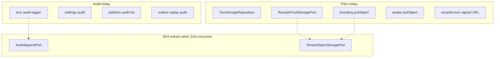

# SK4 — Audit Platform + File Service

```yaml
doc_id: SK4_AUDIT_FILE
tranche: SK4
status: DESIGN_CLOSED
as_of_tip: f99431c2
date: 2026-07-20
code_scaffold: none_until_second_consumer
```

**Principle:** Audit and files already exist as **domain-scoped** capabilities. SK4 freezes ownership and forbids a premature universal package that re-implements tour/finance/settings stores.

---

## 1. Goal

Define when (and when **not**) to introduce:

1. A **universal audit event contract** across security/compliance actions  
2. A **tenant-isolated file service** (ACL + metadata + lifecycle)

Default posture: **extract only when a second consumer needs the shared contract** (Charter SK4 demand-driven).

---

## 2. Inventory — Audit (scattered, intentional for now)

| Stream | Location | Scope |
| ------ | -------- | ----- |
| Tour forensic audit | `apps/api/src/audit/audit-logger.ts` (+ pseudonym) | Tour create/update/publish; TX-bound |
| Settings audit | `apps/api/src/settings/*settings-audit*` | Settings mutations / list projection |
| Platform ops audit | `routes/platform/audit-list.ts`, `audit-export-get.ts` | Platform operator listing/export |
| Outbox replay audit | `outbox/outbox-replay-audit.ts` | Replay run persistence |
| Finance recon repair | recon repair engine / migrations | Money repair trail |

**There is no single `AuditPort` package.** Collapsing these into one table/API without a compliance requirement risks losing domain semantics (tour TX coupling, settings projection, platform authz).

### Target universal contract (future — SK4.C)

```ts
export type AuditEvent = {
  readonly tenantId: string | null; // null only for true platform-global
  readonly actorIdPseudonym: string | null;
  readonly action: string;
  readonly entityType: string;
  readonly entityId: string;
  readonly occurredAt: Date;
  readonly metadata: Readonly<Record<string, unknown>>;
  readonly correlationId?: string;
};

export interface AuditAppendPort {
  append(event: AuditEvent): Promise<void>;
}
```

Rules when introduced:

1. Tenant required for tenant entities; platform routes keep platform auth.  
2. Actor IDs pseudonymized at write (reuse `audit-pseudonym`).  
3. Metadata allowlists per action family (tour already allowlists).  
4. Prefer **adapters** over rewriting tour TX audit in place.

---

## 3. Inventory — Files / object storage (domain-scoped)

| Capability | Location | Notes |
| ---------- | -------- | ----- |
| Tour aggregate persistence | `storage/tour-storage.interface.ts` + prisma/memory | Not blob store — canonical tour SoT |
| Production driver assert | `production-storage-driver-assert.ts` | Prodlike forbids memory |
| Receipt proof signed URL | `finance-core` `ReceiptProofStoragePort` + host `receipt-proof-storage.ts` | Tenant + storageKey |
| Branding blobs | `tenant/tenant-branding-storage.ts` | putObject to bucket |
| Operator avatar | `identity/operator-avatar-storage.ts` | putObject |
| Wizard / tour media | `tours/tour-wizard-photos.routes.ts`, cover enrich | Signed read URLs |
| Shared MinIO client (already) | `tenant/workspace-branding-photo-storage` | Used by branding, avatar, receipt-proof — **do not invent a second client** |

**“File Service” in roadmap §5 ≠ TourStorageRepository.** Tour storage is domain aggregate persistence. Blob/object media is the candidate for a shared file kernel.

### Target file contract (future — SK4.D)

```ts
export type TenantObjectRef = {
  readonly tenantId: string;
  readonly storageKey: string;
};

export interface TenantObjectStoragePort {
  put(input: TenantObjectRef & { readonly body: Buffer; readonly contentType: string }): Promise<void>;
  getSignedReadUrl(input: TenantObjectRef & { readonly ttlSeconds?: number }): Promise<string>;
  // delete/lifecycle later
}
```

Rules:

1. Every key is tenant-scoped; no cross-tenant signed URL.  
2. First extraction should **wrap** `workspace-branding-photo-storage` (already shared) — not a second bucket client.  
3. Keep `assertProductionStorageDriver` for aggregate driver; blob config stays env-driven and fail-closed in prodlike.  
4. No ACL UI product in SK4 design close.



---

## 4. Hard rules

1. Do **not** create `packages/audit-kernel` or `packages/file-service` empty.  
2. Do **not** replace tour TX audit with async-only fire-and-forget.  
3. Do **not** confuse tour Prisma/memory driver with object blob storage.  
4. Second consumer = concrete second call site needing the same port (e.g. two blob put paths sharing one ACL policy).  
5. RLS / tenant session still apply to DB-backed audit rows.  
6. SK1–SK3 session/flag/entitlement rules unchanged.

---

## 5. Work items

### SK4.A — Design freeze — **DONE**

### SK4.B — Pointer READMEs — **DONE** same PR

- `apps/api/src/audit/README.md`  
- `apps/api/src/storage/README.md`  

### SK4.C / SK4.D — Implementation (demand-driven)

| Action | Gate | Status |
| ------ | ---- | ------ |
| Introduce `AuditAppendPort` + one adapter backing tour **or** settings | Same PR as second writer migration | Waiting — `YES — IMPL-SK4-AUDIT` |
| Introduce `TenantObjectStoragePort` wrapping existing S3 helpers | Same PR migrating ≥2 put/sign call sites | **DONE** — `YES — IMPL-SK4-OBJ` — [SK4_OBJ_IMPLEMENTATION.md](./SK4_OBJ_IMPLEMENTATION.md) (`tenant-path-isolation`) |

### Non-goals

- Compliance product UI / SIEM export product  
- Moving all audits to outbox-only  
- Hollow packages  

---

## 6. Definition of Done — SK4 design

- [x] Audit streams inventoried  
- [x] File vs tour-storage distinction locked  
- [x] Future port shapes documented  
- [x] READMEs + CHARTER/maturity/checklist updated  

**Kernel design tranches SK0–SK4 design track complete.** Implementation remains demand-driven (SK2.C, SK3 BP-7, SK4.C/D).

---

## 7. Cross-links

- [CHARTER.md](../CHARTER.md)  
- [MATURITY_INVENTORY.md](./MATURITY_INVENTORY.md)  
- [SK2_NOTIFICATION_OUTBOX.md](./SK2_NOTIFICATION_OUTBOX.md)  
- [SK3_ENTITLEMENT_FLAGS.md](./SK3_ENTITLEMENT_FLAGS.md)  
- Storage default: `docs/phase-20/p7/appendices/BOOKING_REMEDIATION_TODO_009_STORAGE_DEFAULT.md`  

---

*SK4 design closed. Extract ports only with real second consumers.*
