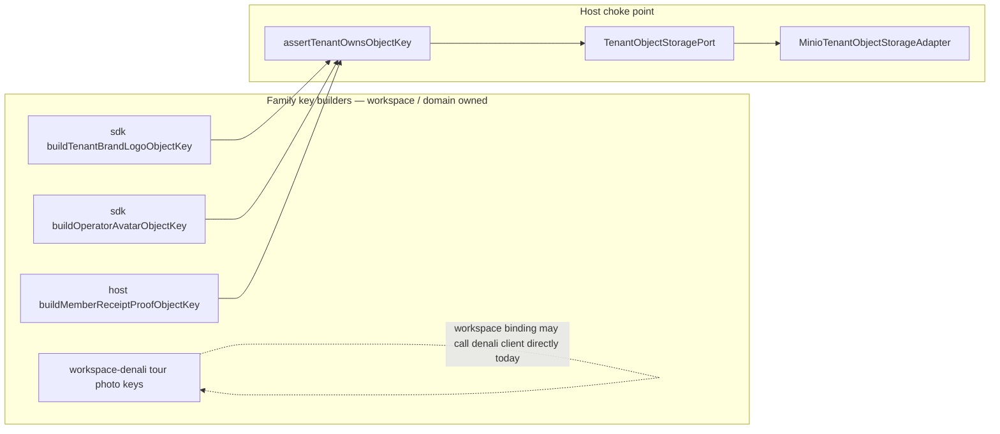

# SK4.D — TenantObjectStoragePort (IMPL-SK4-OBJ)

```yaml
doc_id: SK4_OBJ_IMPLEMENTATION
status: DONE
unlock: YES — IMPL-SK4-OBJ
shared_policy: tenant-path-isolation
date: "2026-07-21"
tip_at_start: e4e58665
canonical_branch: booking/capacity-concurrency-cert
```

## Architect shared ACL / lifecycle rule

**Name:** `tenant-path-isolation`

| Rule | Enforcement |
| ---- | ----------- |
| **R1** Every blob op requires `tenantId` | `TenantObjectStoragePort.put` / `getSignedReadUrl` / `remove` |
| **R2** Key must prove tenant ownership before MinIO I/O | `assertTenantOwnsObjectKey` — fail closed |
| **R3** No cross-tenant signed URL | Reject foreign keys; never presign |
| **R4** One shared MinIO client | Wrap `workspace-branding-photo-storage` — **no second stack** |
| **R5** Tour aggregate ≠ blob store | `TourStorageRepository` unchanged |
| **R6** No ACL product UI | Host choke-point only |

**Accepted key shapes (owning segment = tenant UUID):**

```text
${tenantId}/branding/logo
${tenantId}/operators/${userId}/avatar
${tenantId}/tours/.../photos/...          // workspace (denali) media
receipts/${tenantId}/${registrationId}/...
```

Any other shape → `TENANT_OBJECT_KEY_SCOPE_INVALID`.



## Isolation model — “best service” per workspace

**Not** a separate MinIO / file microservice per workspace. Isolation is:

1. **Tenant path ACL** (this port) — hard boundary for all host blob families  
2. **Workspace-owned key builders** — each workspace package (e.g. Denali) defines tour/media key conventions under `${tenantId}/…`  
3. **Domain ports stay domain** — receipt proof stays finance-facing; branding stays tenant theme; avatar stays identity  

So each workspace “sees” the best isolation surface as: **its own key builders + shared host `TenantObjectStoragePort`**, not a second object store.

## Migrated call sites (≥2 required)

| Family | Module | Ops via port |
| ------ | ------ | ------------ |
| Brand logo | `tenant/tenant-branding-storage.ts` | put / remove / signed read |
| Operator avatar | `identity/operator-avatar-storage.ts` | put / remove / signed read |
| Receipt proof | `workspace-finance/receipt-proof-storage.ts` | put / signed read |

## Code map

| Surface | Path |
| ------- | ---- |
| Port | `apps/api/src/storage/tenant-object-storage.port.ts` |
| ACL | `apps/api/src/storage/assert-tenant-object-key-scope.ts` |
| Adapter | `apps/api/src/storage/minio-tenant-object-storage.adapter.ts` |
| Factory | `apps/api/src/storage/create-tenant-object-storage.ts` |
| Spec | `apps/api/test/tenant-object-storage-sk4.spec.ts` |

## Verify (fast-track)

```bash
pnpm --filter @apps/api exec node --import tsx --test \
  test/tenant-object-storage-sk4.spec.ts
pnpm run guard:import-boundary
```

## Non-goals

- Hollow `packages/file-service`
- Second MinIO client / bucket stack
- Touching tour aggregate `TourStorageRepository`
- Migrating Denali wizard photo routes in this unlock (already tenant-prefix scoped in workspace package)

## Companion

- Design: [SK4_AUDIT_FILE.md](./SK4_AUDIT_FILE.md) §3 / SK4.D  
- Storage README: `apps/api/src/storage/README.md`
