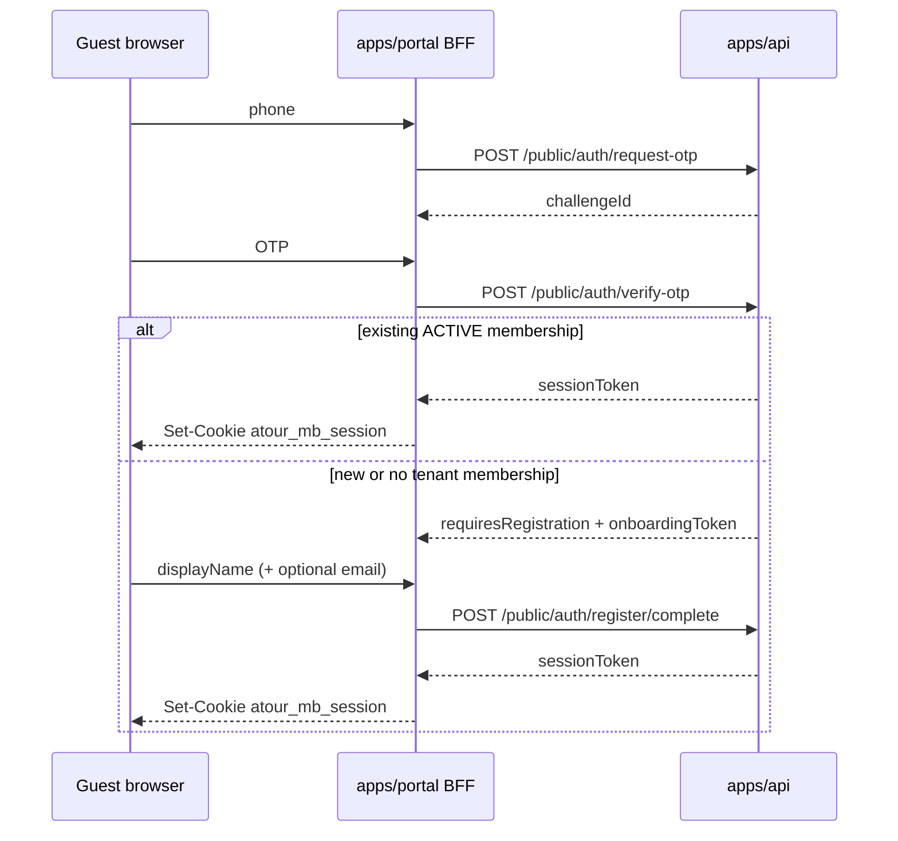
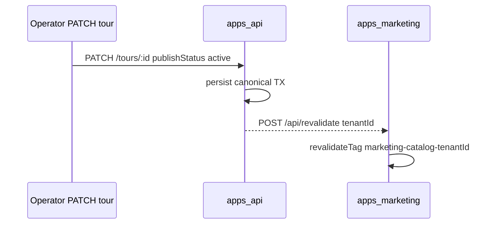
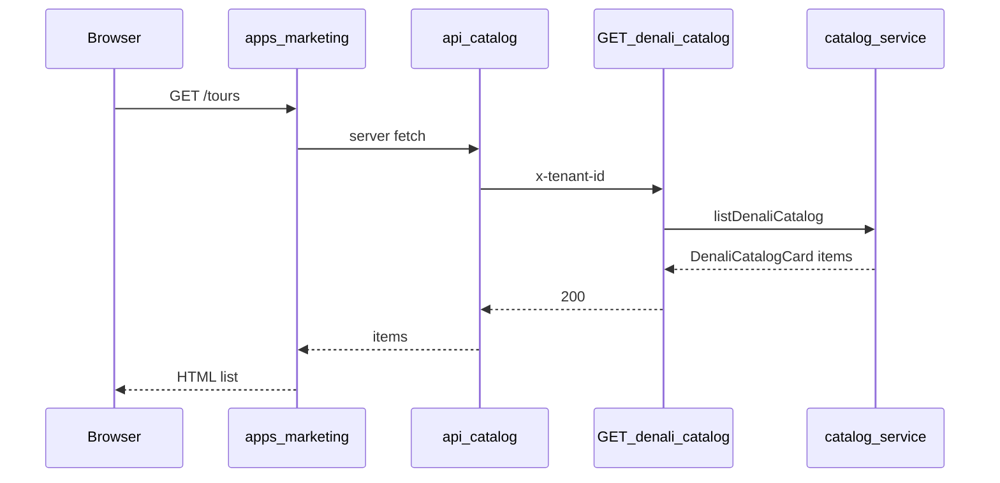

# Denali public catalog (Marketing app)

```yaml
doc_id: DENALI-PUBLIC-CATALOG
version: "2026-06-11-v24"
workspace: denali
stack: workspace-sdk · workspace-denali/http · apps/marketing
authority: MIGRATION-MAP.md §3.5 · TEMP/denali-public-marketing-app-roadmap.md
p4_phase_doc: docs/phase-17/platform-club-catalog-publish.mdoc
decisions: [ADR-MKT-001, ADR-MKT-002, ADR-MKT-003, ADR-MKT-004]
```

## Scope

Read-only **public tour listing** for Denali tenants — consumed by **`apps/marketing`** (Marketing shell per MAP §3.5). Not operator admin (`GET /tours?view=operator`) and not Urban (`GET /urban/catalog`).

| Surface | App | Auth |
|---------|-----|------|
| Marketing browse | `apps/marketing` | None (guest) |
| Catalog API | `apps/api` | `x-tenant-id` + guest actor (`role: none`) |
| Operator list | `apps/web` `(app)/` | Owner session |

Public **catalog registration** (M17) is **portal-only** (`apps/portal` `/catalog/{tourId}/register`, dev port **3003**) — legacy-style phone OTP for Denali + Urban. `apps/web` keeps **307 redirect shims** only (`/catalog/*` → marketing/portal); **no** `apps/web` public-auth BFF (removed P9-1-N-001). Operator invite-only login (`/auth/*` on web) stays separate.

## Publish gate

A tour appears in the public catalog only when canonical `data.publishStatus === "active"`.

| `publishStatus` | Public catalog | Operator list |
|-----------------|----------------|---------------|
| `draft` | Hidden | Visible (draft bucket) |
| `active` | Visible | Visible (open/active bucket) |

Wizard review step (Phase 11) persists `publishStatus`; admin must set `active` before marketing lists the tour.

## API

### `GET /denali/catalog`

| Item | Value |
|------|-------|
| Auth | `x-tenant-id` required; no session |
| Rate limit | Read tier |
| Filter | Published tours only (`publishStatus: active`) |
| Pagination | `cursor` (tour id), `limit` (default 20, max 50) |

Response:

```json
{
  "success": true,
  "data": { "items": [/* DenaliCatalogCard */] },
  "metadata": { "nextCursor": "uuid | null" }
}
```

### `GET /denali/catalog/:tourId`

Single published card or `404 NOT_FOUND` for draft/missing.

## DenaliCatalogCard (egress DTO)

Distinct from **operator** `TourListProjection` — no draft rows, no ops-only fields, no full canonical (DEC-129).

| Field | Canonical source |
|-------|------------------|
| `id` | row id |
| `title` | `title` |
| `shortDescription` | `program.shortDescription` |
| `category` | `category` |
| `departureAt` | `startDateTime` |
| `endAt` | `endDateTime` |
| `priceAmount` | `pricing.basePricePerPerson` |
| `priceCurrency` | `IRR` (default) |
| `difficultyLevel` | `program.difficultyLevel` |
| `fitnessLevel` | `participants.fitnessLevel` |
| `coverImageUrl` | first `photos` entry |
| `totalCapacity` | `capacityMax` |
| `spotsRemaining` | `max(0, capacityMax − Σ approved.partySize)` — see DEC-P11-013 |
| `policiesText` | `policies.policiesText` — egress-safe cancellation / terms copy (P7-1-N-008) |
| `cancellationDeadlineHours` | `policies.cancellationDeadlineHours` |
| `cancellationPenaltyPercentage` | `policies.cancellationPenaltyPercentage` |

### `spotsRemaining` (DEC-P11-013)

Public catalog may expose remaining seats without booking PII:

1. **Occupied seats** — sum `partySize` where `status === "approved"` for the tour (tenant-scoped, RLS).
2. **Formula** — `spotsRemaining = max(0, totalCapacity − occupied)`; `null` when `totalCapacity` is unknown.
3. **Excluded statuses** — `pending`, `waitlisted`, `rejected`, `cancelled` do not reduce public spots (ops may still see them in inbox).

Host adapter: `DenaliPublicBookingPort.sumApprovedPartySizeByTourIds`. Enrichment runs in `listDenaliCatalog` / `getDenaliCatalogTour` after `toDenaliCatalogCard`.

## SDK contract

`WorkspacePlugin.publicCatalog` (`PublicCatalogSurface`):

- `isPublished(canonical)` — Denali: `publishStatus === "active"`
- `toCatalogCard(tour)` — maps to `DenaliCatalogCard`

Shell resolves catalog HTTP path via `resolveCatalogListApiPath(pluginId)`:

| `pluginId` | List path |
|------------|-----------|
| `denali` | `/denali/catalog` |
| `urban` | `/urban/catalog` |

## Marketing BFF

`apps/marketing/app/api/catalog/route.ts`:

1. Resolve `tenantId` + `pluginId` from Host (`tenant-kernel` dev map).
2. `GET {TOUR_OPS_API_URL}{resolveCatalogListApiPath(pluginId)}` with `x-tenant-id`.
3. Return shaped JSON to RSC pages — browser does not call API directly.

Dev hosts (P6 canonical — authority [p6-host-addressing-architecture.mdoc](../../phase-19/p6-host-addressing-architecture.mdoc)):

| Surface | Dev canonical | Legacy alias |
| ------- | ------------- | ------------ |
| Marketing | `{club}.localhost:3002` | `shop.{club}.localhost:3002` |
| Portal | `{club}.portal.localhost:3003` | `{club}.localhost:3003` |
| Admin | `{club}.admin.localhost:3000` | `{club}.localhost:3000` |

Smoke club `operator`: `operator.localhost:3002` · `operator.portal.localhost:3003` · `operator.admin.localhost:3000`.

### Tour detail (M3)

| Route | Behavior |
|-------|----------|
| `GET /tours/[tourId]` | RSC detail — `fetchCatalogTour` → `GET /denali/catalog/:tourId`; `notFound()` on 404 |
| `GET /api/catalog/[tourId]` | BFF proxy — same upstream path, passthrough JSON |

List cards link to `/tours/{id}`.

### Registration bridge (M6 + M16)

Public registration intake lives on **`apps/portal`** (`/catalog/{tourId}/register`, dev port **3003**). Denali (M16) and Urban (M6) share the same path shape; marketing detail links via `resolveWebRegistrationUrl` → portal base. `apps/web` register route redirects to portal for backward compatibility (DEC-P11-014).

| Surface | Route |
|---------|-------|
| Marketing detail CTA | `urban` + `denali` → `{PORTAL_PUBLIC_BASE_URL}/catalog/{tourId}/register` (dev: port **3003**) |
| Web register back-link | → `{MARKETING_PUBLIC_BASE_URL}/tours/{tourId}` |

Dev host map: marketing `{club}.localhost:3002` → portal `{club}.portal.localhost:3003` via `buildDevPortalPublicBaseUrl` (`@app-tour/tenant-kernel`). Legacy: `shop.{club}` strip · apex portal `{club}.localhost:3003` still accepted during P6-0 migration.

### Public catalog registration — phone OTP (M17 · portal-only post-P9)

Legacy parity on **`apps/portal`**: guest enters **mobile** → OTP → existing user **logs in**; new user completes **profile** (`displayName` required, `email` optional) → **tour intake** → member session (`atour_mb_session`) + pending registration/booking.

| Step | API (`apps/api`) | Portal BFF (`apps/portal`) |
|------|------------------|----------------------------|
| 1 · phone hint | `POST /public/auth/phone-preflight` → `{ exists }` | `POST /api/public-auth/phone-preflight` |
| 2 · OTP issue | `POST /public/auth/request-otp` (no invite gate) | `POST /api/public-auth/request-otp` |
| 3 · OTP verify | `POST /public/auth/verify-otp` → `sessionToken` **or** `requiresRegistration` + signed `onboardingToken` (15m) | `POST /api/public-auth/verify-otp` (sets member session cookie on success) |
| 4 · profile | `POST /public/auth/register/complete` | `POST /api/public-auth/register-complete` |
| 5 · tour intake | `POST /urban/registrations` or `POST /denali/registrations` | `POST /api/catalog/registrations` — `buildCatalogRegistrationHeaders` + **`Idempotency-Key`** (Urban only) |

Production tenant on portal register + public-auth BFF: `resolvePortalBootstrapForHost` / `resolveGuestSurfaceBootstrapForHost` call `GET /public/tenant-context` when dev host map is unavailable (same as marketing M7). **No silent Urban smoke fallback** — unresolved tenant → `PORTAL_TENANT_UNRESOLVED` (503 on BFF, error on register page).

**Portal layout bootstrap:** `apps/portal/app/layout.tsx` uses `resolvePortalBootstrapForHost` (guest `member` + resolved `tenantId`/`pluginId` from API in prod). Web root layout is **operator-only** (`resolveBootstrapAppSessionForHostAsync`) — no catalog guest bootstrap (P9-1-N-003).

**Operator auth BFF tenant (M17.2):** `apps/web` `/api/auth/*` routes use `buildIdentityBffHeadersAsync` / `resolveOperatorBffTenantId` — dev host map → `GET /public/tenant-context` → dev env fallback (when allowed). Unresolved production host → `OPERATOR_BFF_TENANT_UNRESOLVED` (503).

Membership created with `role: member`, `status: ACTIVE`. Distinct from operator `/auth/*` (`authorized` preflight, invite gate on OTP, owner-only web BFF).



Web shell: `apps/web/app/(public)/catalog/[tourId]/register` — **redirect-only shim** to `apps/portal` (`resolvePortalRegistrationRedirectUrl` · DEC-P11-014). Registration UX lives in `apps/portal` only; marketing CTA unchanged (M6 bridge).

> **P4-B (Phase 17):** Do not mount `PublicCatalogRegistrationFlow` on web — see [`platform-portal-registration.mdoc`](../../phase-17/platform-portal-registration.mdoc) PR-06.

### Denali tour intake (M16 + M17 step 5)

| Item | Value |
|------|-------|
| API | `POST /denali/registrations` — guest `x-tenant-id`, published tour gate |
| Persistence | `BookingsRepository` — `status: pending` |
| Portal | `apps/portal` intake via `POST /api/catalog/registrations` BFF |
| Web | redirect shim only — no intake on `apps/web` |
| E2E anchor | `[data-public-registration-intake]` → `[data-public-registration-success]` (portal host) |

Duplicate email per tour → `409 DENALI_REGISTRATION_DUPLICATE`.

**Session attribution (P2):** After M17 verify/profile, portal `POST /api/catalog/registrations` reads the member session cookie and forwards `x-user-id` + `x-actor-role: member` to `POST /denali/registrations` (or urban). Anonymous catalog guest id (`…000001`) is used only when no valid session.

**Intake pre-fill (P2b):** `GET /api/public-auth/session-profile` (portal member-safe BFF) hydrates `displayName` / optional `email` from `GET /identity/me` for returning users. Profile-step email pre-fills intake via `resolveIntakeDefaults` (profile wins over session).

### Known limitations (M17 P3)

| Risk | Detail | Mitigation |
|------|--------|------------|
| Operator vs member cookies | Web operator uses `atour_op_session`; portal member OTP uses `atour_mb_session` (`@app-tour/session-client` P8/P9). | Surfaces isolated by host + cookie name. |
| `identity/me` naming | BFF uses `requireOperatorSession` middleware naming though public members are valid. | Behavior is member-safe; rename deferred to identity refactor. |
| Denali booking `userId` in E2E | Playwright smokes assert UI success only; Postgres `userId` on booking row covered by **DREG-17-01** API spec. | Run `denali-registration.spec.ts` in CI when `DATABASE_URL` set. |

### Static guard

`pnpm run guard:public-catalog-m17` — fast file/dispatch/OpenAPI/layout attestation (wired in `marketing-guard.yml` smoke job).

### Client bootstrap (M17 P3 — E2E unblock)

`AppProviders` hydrates session via `hydrate-bootstrap-session.client.ts` + `resolve-bootstrap-workspace-plugin.client.ts` — Denali uses a **theme-only client shell** (no `node:crypto` clone graph). Full `getDenaliWorkspacePlugin()` remains server-only in `tenant-kernel.ts` (`server-only`).

### OpenAPI — public auth schemas (P2)

`openapi:generate` merges `src/openapi/public-auth-openapi.ts` overrides for `publicPhonePreflight`, `publicRequestOtp`, `publicVerifyOtp`, `publicRegisterComplete` — request `mobile` / `challengeId` / `code` / `onboardingToken` / `displayName` and response `exists` | `challengeId` | `sessionToken` | `requiresRegistration`.

### Production tenant bootstrap (M7)

When `ALLOW_DEV_WEB_SESSION !== true`, marketing resolves tenant from host via **`GET /public/tenant-context`** (guest-safe, no session):

| Response field | Use |
|----------------|-----|
| `tenantId` | `x-tenant-id` on catalog fetches |
| `pluginId` | `resolveCatalogListApiPath(pluginId)` |
| `workspaceType` | diagnostics only |

Ingress uses `x-forwarded-host` with `shop.` prefix stripped (same as branding). Dev host map (M2) takes precedence when allowed.

Playwright smoke: **SMK-MKT-01** (`operator.localhost:3002/tours` · legacy `shop.operator.localhost:3002`); **SMK-MKT-03** marketing CTA → **portal** (`operator.portal.localhost:3003`) OTP → Denali intake → `[data-public-registration-success]`; Urban **SMK-P8-02** on `urban.portal.localhost:3003`; Denali **SMK-PTL-01** on `operator.portal.localhost:3003`.

### SEO metadata (M8)

| Page | `generateMetadata` |
|------|-------------------|
| Layout | `metadataBase`, tenant `displayName`, default title |
| `/tours` | `{displayName} — Tours` + catalog description |
| `/tours/[tourId]` | tour title, description (`shortDescription` / `catalogSummary`), Open Graph image (`coverImageUrl`) |

Canonical URLs derive from `MARKETING_PUBLIC_BASE_URL` or request host. `app/not-found.tsx` for missing tours.

### i18n + RTL (M9)

`next-intl` with locales **`fa`** (default) and **`en`**, `localePrefix: never` — same B2B host pattern as `apps/web`.

| Item | Value |
|------|-------|
| Cookie | `NEXT_LOCALE` override |
| RTL | `<html dir="rtl">` when `fa` |
| Copy | `apps/marketing/messages/{fa,en}/catalog.json` |
| Switcher | Header locale toggle (`MarketingLocaleSwitcher`) |

Date/price formatters accept active locale (`fa-IR` / `en-US`).

### Public branding + cache (M4)

Marketing shell loads **guest-safe** tenant chrome from `GET /public/tenant-branding`:

| Item | Value |
|------|-------|
| Ingress | `x-forwarded-host` — platform parse: `{club}.{root}` (`club_apex`); legacy `shop.{club}` strip before lookup |
| Theme | `PlatformThemeProvider` + `TenantThemeProvider` (`primaryColor`, `displayName`) — no workspace plugin CSS import |
| Header | Logo + display name + link to `/tours` |

Catalog upstream fetches use Next.js **time-based revalidation** (default **60s** via `MARKETING_CATALOG_REVALIDATE_SECONDS`). Host-based tenant resolution stays dynamic; only API responses are cached.

Urban `apps/web/(public)/catalog` list/detail **redirect** to marketing (`M2b`); registration lives on **`apps/portal`** (`DEC-P11-014`) — web `/catalog/.../register` is a redirect shim only.

### Urban on marketing shell (M2b)

| `pluginId` | Upstream | Card extensions (egress) |
|------------|----------|---------------------------|
| `denali` | `/denali/catalog` | `difficultyLevel`, `fitnessLevel`, `priceAmount` |
| `urban` | `/urban/catalog` | `city`, `venueName`, `catalogSummary`, `startDate`/`endDate` |

Urban `publicCatalog.isPublished` reads `data.tour.publishStatus` (or legacy `status`) === `published` — see `packages/workspaces/urban/src/catalog/urban-public-catalog-surface.ts`.

Marketing renders workspace fields without static-importing workspace packages — API JSON drives display helpers in `format-catalog-display.ts`.

`apps/web/app/(public)/catalog/page.tsx` and `[tourId]/page.tsx` **307-redirect** to `{MARKETING_PUBLIC_BASE_URL}/tours` (dev default: `{club}.localhost:3002` · legacy `shop.{club}.localhost:3002`).

### Pagination (M5)

List fetch accepts `cursor` + `limit` query params (passthrough to workspace catalog API). `/tours?cursor={uuid}` renders next page; UI shows **Load more** when `metadata.nextCursor` is set.

### Cache tags + Urban city filter (M10)

Catalog fetches tag `marketing-catalog-{tenantId}` for on-demand invalidation via `POST /api/revalidate` (header `x-marketing-revalidate-secret`).

Urban list supports `?city=` filter (passthrough to `GET /urban/catalog?city=`). Cover images use `next/image` on list cards and tour detail.

### Cover image CDN (M14)

`CatalogCoverImage` uses Next.js `Image` optimization when the cover URL host matches `MARKETING_IMAGE_REMOTE_HOSTS` (comma-separated `hostname` or `hostname:port`, build-time `remotePatterns`). Otherwise `unoptimized` — safe default for unknown MinIO/CDN origins in dev.

| Env | Example |
|-----|---------|
| `MARKETING_IMAGE_REMOTE_HOSTS` | `127.0.0.1:9002,cdn.example.com` |
| `MARKETING_IMAGES_FORCE_UNOPTIMIZED` | `true` — always bypass optimizer (debug) |

List cards render thumbnail covers when `coverImageUrl` is set (`data-marketing-catalog-card-cover`).

### Publish → cache invalidation (M11)

When a canonical tour write affects public catalog visibility or content, `@apps/api` schedules a **best-effort** `POST` to marketing `/api/revalidate` with body `{ "tenantId": "<uuid>" }`.

| Trigger | Condition |
|---------|-----------|
| Create tour | Workspace plugin exposes `publicCatalog.isPublished` and new canonical is published |
| Update tour | Plugin has `publicCatalog` and tour **was or is** published after merge (covers publish, unpublish, and in-catalog edits) |

| Env (`@apps/api`) | Purpose |
|-------------------|---------|
| `MARKETING_REVALIDATE_URL` | Marketing origin, e.g. `https://operator.example.com` (no trailing path) |
| `MARKETING_REVALIDATE_SECRET` | Shared secret; sent as header `x-marketing-revalidate-secret` |

Both must be set; otherwise the notifier is a no-op (local dev without marketing revalidate is unaffected). Failures are logged at `warn` and **do not** roll back the tour transaction.

Marketing tag invalidated: `marketing-catalog-{tenantId}` (see `buildMarketingCatalogCacheTag`).

**Phase doc:** [P4-A catalog publish sync](../../phase-17/platform-club-catalog-publish.mdoc) — RV/CP/RR assertion IDs · `p4:gate` chain.

### Error boundary (M12)

Catalog routes use Next.js `error.tsx` (`app/error.tsx`, `app/tours/error.tsx`) — client boundaries with `next-intl` copy and a **Retry** button (`reset()`). Upstream catalog fetch failures (`MARKETING_CATALOG_FETCH_FAILED`) surface here instead of an unstyled stack trace.

### Tenant default locale (M13)

Locale resolution order:

1. `marketing-locale` cookie (user switcher)
2. `TenantThemeConfig.defaultLocale` (`fa` | `en`) from `GET /public/tenant-branding`
3. App default (`fa`)

Operators set `defaultLocale` via tenant theme patch (validated in `@app-tour/workspace-sdk`). Marketing does not read operator settings modules for locale.

### Production env checklist (M15)

| Variable | App | Required prod |
|----------|-----|---------------|
| `TOUR_OPS_API_URL` | marketing | HTTPS API origin |
| `ALLOW_DEV_WEB_SESSION` | marketing | `false` (use `/public/tenant-context`) |
| `MARKETING_REVALIDATE_SECRET` | marketing + api | shared on-demand cache purge |
| `MARKETING_REVALIDATE_URL` | api | marketing public origin |
| `MARKETING_IMAGE_REMOTE_HOSTS` | marketing | CDN/MinIO host allowlist |
| `MARKETING_PUBLIC_BASE_URL` | web | `https://{club}.{root}` for catalog redirects |
| `PORTAL_PUBLIC_BASE_URL` | marketing | `{club}.portal.{root}` registration bridge |
| `PORTAL_DEV_PORT` | marketing | dev portal port (default `3003`) |

Ingress: public marketing on `{club}.{root}` (platform default); legacy `shop.{club}` alias supported in dev.



## Implementation map

| Layer | Path |
|-------|------|
| Contract | `packages/workspace-sdk/src/tour/public-catalog.contract.ts` |
| Path resolver | `packages/workspace-sdk/src/catalog/resolve-catalog-api-path.ts` |
| Denali card | `packages/workspaces/denali/src/catalog/denali-catalog-card.ts` |
| Catalog service | `packages/workspaces/denali/src/http/catalog.service.ts` |
| HTTP handlers | `packages/workspaces/denali/src/http/product.routes.ts` |
| Host adapter | `apps/api/src/http/configure-denali-catalog-http-host.ts` |
| Registrar | `apps/api/src/http/denali-workspace-routes.ts` |
| Marketing list | `apps/marketing/app/tours/page.tsx` |
| Marketing detail | `apps/marketing/app/tours/[tourId]/page.tsx` |
| Marketing BFF detail | `apps/marketing/app/api/catalog/[tourId]/route.ts` |
| Public branding fetch | `apps/marketing/src/tenant/fetch-public-tenant-branding.ts` |
| Marketing shell | `apps/marketing/src/shell/marketing-shell.tsx` |
| Catalog cache policy | `apps/marketing/src/catalog/catalog-fetch-options.ts` |
| Catalog display helpers | `apps/marketing/src/catalog/format-catalog-display.ts` |
| Web catalog redirect | `apps/web/src/marketing/resolve-marketing-public-url.ts` |
| Registration bridge | `apps/marketing/src/portal/resolve-web-registration-url.ts` |
| Public tenant context API | `apps/api/src/tenant/tenant-branding.routes.ts` (`GET /public/tenant-context`) |
| Production bootstrap | `apps/marketing/src/tenant/fetch-public-tenant-context.ts` |
| SEO metadata builders | `apps/marketing/src/seo/build-marketing-metadata.ts` |
| CI guard | `.github/workflows/marketing-guard.yml` |
| i18n | `apps/marketing/src/i18n/` · `messages/{fa,en}/catalog.json` |
| Cache revalidate BFF | `apps/marketing/app/api/revalidate/route.ts` |
| Cover image | `apps/marketing/src/catalog/catalog-cover-image.tsx` |
| Image host allowlist | `apps/marketing/src/catalog/resolve-marketing-image-hosts.ts` |
| Catalog cache invalidation | `apps/api/src/marketing/schedule-marketing-catalog-revalidate.ts` |
| Publish gate helper | `apps/api/src/marketing/should-invalidate-marketing-catalog.ts` |
| Error boundaries | `apps/marketing/app/error.tsx` · `app/tours/error.tsx` |
| Locale resolution | `apps/marketing/src/i18n/resolve-app-locale.ts` |
| Tenant default locale | `packages/workspace-sdk/src/theme/tenant-theme.contract.ts` (`defaultLocale`) |
| Denali registration API | `packages/workspaces/denali/src/http/registration.service.ts` |
| Public OTP portal flow | `apps/portal/app/catalog/[tourId]/register/public-catalog-registration-flow.tsx` |
| i18n (fa/en) | `apps/portal/messages/*/catalogRegistration.json` |
| Public-auth BFF tests | `apps/portal/test/portal-public-auth-bff.spec.ts` · PR-09 |
| Urban intake idempotency | `apps/portal` registration BFF (Urban idempotency header) |
| M17 static guard | `scripts/guards/guard-public-catalog-m17.mjs` · `pnpm run guard:public-catalog-m17` |
| Marketing register smoke | `apps/marketing/tests/e2e/marketing-catalog-smoke.spec.ts` · SMK-MKT-03 (full OTP + intake) |
| Portal registration smoke | `apps/portal/tests/e2e/portal-registration-smoke.spec.ts` · SMK-PTL-01 · `pnpm --filter @apps/portal run test:smoke` |
| Portal member smoke | `apps/portal/tests/e2e/portal-member-smoke.spec.ts` · SMK-PTL-02/04/05 |
| Denali OTP smoke | `apps/portal/tests/e2e/portal-registration-smoke.spec.ts` · SMK-PTL-01 (supersedes SMK-DREG-01) |
| Public auth Prisma integration | `apps/api/test/public-auth-prisma.integration.spec.ts` · PUB-AUTH-PRISMA-01 (skip without `DATABASE_URL`) |
| Urban public auth resolver | `packages/workspaces/urban/src/http/resolve-urban-public-auth.ts` · `resolveUrbanPublicAuthFromHeaders` (apps/api thin wrapper) |
| Public auth API | `apps/api/src/identity/public-auth.routes.ts` |
| Public auth OpenAPI | `apps/api/src/openapi/public-auth-openapi.ts` |
| Session intake headers | `apps/portal/src/catalog/build-catalog-registration-headers.server.ts` |
| Public auth BFF | `apps/portal/app/api/public-auth/*` (portal-only post-P9) |
| Web catalog redirect shim | `apps/web/app/(public)/catalog/**` — 307 only; **no** `apps/web` public-auth |

## Sequence


