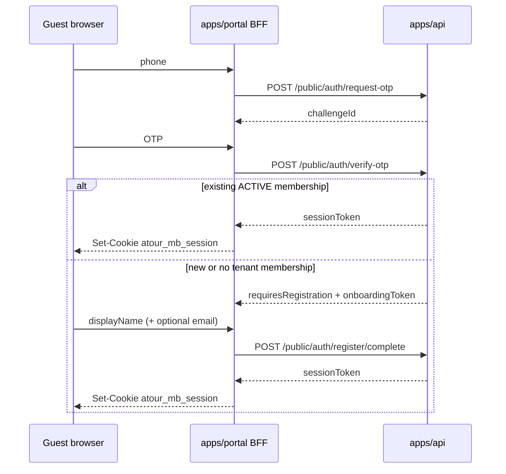
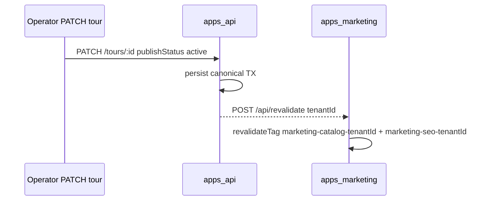
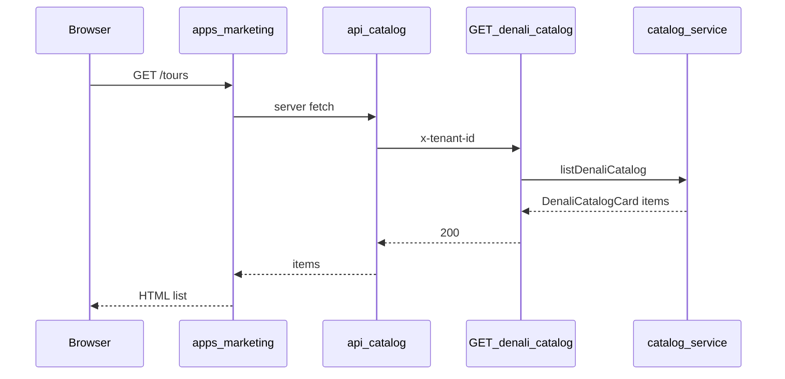

# Denali public catalog (Marketing app)

```yaml
doc_id: DENALI-PUBLIC-CATALOG
version: "2026-08-16-v27"
workspace: denali
stack: workspace-sdk · workspace-denali/http · apps/marketing
authority: MIGRATION-MAP.md §3.5 · docs/workspaces/denali/marketing-landing.mdoc
p4_phase_doc: docs/phase-17/platform-club-catalog-publish.mdoc
decisions: [ADR-MKT-001, ADR-MKT-002, ADR-MKT-003, ADR-MKT-004]
```

## Scope

Read-only **public tour listing** for Denali tenants — consumed by **`apps/marketing`** (Marketing shell per MAP §3.5). Not operator admin (`GET /tours?view=operator`) and not Urban (`GET /urban/catalog`).

| Surface | App | Auth |
|---------|-----|------|
| Marketing browse | `apps/marketing` | None (guest) |
| Catalog API | `apps/api` | `x-tenant-id` + guest actor (`role: none`) |
| Operator list | `apps/web` `(app)/` | Owner session |

Public **catalog registration** (M17) is **portal-only** (`apps/portal` `/catalog/{tourId}/register`, dev port **3003**) — legacy-style phone OTP for Denali + Urban. `apps/web` keeps **307 redirect shims** only (`/catalog/*` → marketing/portal); **no** `apps/web` public-auth BFF (removed P9-1-N-001). Operator invite-only login (`/auth/*` on web) stays separate.

## Publish gate

A tour appears in the public catalog only when canonical `data.publishStatus === "active"`.

| `publishStatus` | Public catalog | Operator list |
|-----------------|----------------|---------------|
| `draft` | Hidden | Visible (draft bucket) |
| `active` | Visible | Visible (open/active bucket) |

Wizard review step (Phase 11) persists `publishStatus`; admin must set `active` before marketing lists the tour.

Operator chrome labels that transition **Publish** (`DRAFT → OPEN`). A DRAFT Asklim (or any Denali) tour is **correctly absent** from marketing until that click. Do not treat a missing card as a catalog-filter or guest-app regression.

## API

### `GET /denali/catalog`

| Item | Value |
|------|-------|
| Auth | `x-tenant-id` required; no session |
| Rate limit | Read tier |
| Filter | Published tours only (`publishStatus: active`) |
| Query (PR-22) | `q`, `category`, `difficulty`, `fitness`, `availability=open`, `sort` — applied **before** cursor pagination on full published set |
| Pagination | `cursor` (tour id), `limit` (default 20, max 50) |

| Query | Match rule |
|-------|------------|
| `q` | Case-insensitive substring on `title`, `category`, `program.shortDescription` |
| `category` | Exact slug **or** marketing family `mountain` / `nature` (matches `mountain_*` / `nature_*` from admin wizard) |
| `difficulty` | Exact `program.difficultyLevel` integer |
| `fitness` | Exact `participants.fitnessLevel` string |
| `availability=open` | `capacityMax − Σ approved.partySize > 0` (unknown capacity passes) |
| `sort` | `newest` (default), `departure_asc`, `departure_desc`, `price_asc`, `price_desc`, `difficulty_asc` |

Marketing passes supported params when `resolveCatalogListFeatures(pluginId).serverListFilters` includes the key (manifest `catalogPresentation.listFeatures.serverListFilters`).

**API verify (memory driver):** `DCAT-08..10` in `apps/api/test/denali-catalog.spec.ts` — category filter, `q` title search, `sort=departure_asc`. Run: `pnpm --filter @apps/api exec node --import tsx --test test/denali-catalog.spec.ts`.

**Marketing verify:** `SMK-MKT-16` (category filter + active pill) in `marketing-catalog-smoke.spec.ts`; `SMK-MKT-17` (filtered list noindex) in `marketing-seo-pagination.spec.ts`.

Response:

```json
{
  "success": true,
  "data": { "items": [/* DenaliCatalogCard */] },
  "metadata": { "nextCursor": "uuid | null" }
}
```

### `GET /denali/catalog/:tourId`

Single published card or `404 NOT_FOUND` for draft/missing.

## DenaliCatalogCard (egress DTO)

Distinct from **operator** `TourListProjection` — no draft rows, no ops-only fields, no full canonical (DEC-129).

| Field | Canonical source |
|-------|------------------|
| `id` | row id |
| `title` | `title` |
| `shortDescription` | `program.shortDescription` |
| `category` | `category` |
| `departureAt` | `startDateTime` |
| `endAt` | `endDateTime` |
| `priceAmount` | `pricing.basePricePerPerson` |
| `priceCurrency` | `IRR` (default) |
| `difficultyLevel` | `program.difficultyLevel` |
| `fitnessLevel` | `participants.fitnessLevel` |
| `coverImageUrl` | first canonical photo row — prefer egress-safe `https` `url`; when the row has only `storageKey` (MinIO wizard/tour object), `catalog.service` signs a presigned read URL before JSON egress (same tenant key scope as operator list cover signing; TTL 3600s) |
| `totalCapacity` | `capacityMax` |
| `spotsRemaining` | `max(0, capacityMax − Σ approved.partySize)` — see DEC-P11-013 |
| `policiesText` | `policies.policiesText` — egress-safe cancellation / terms copy (P7-1-N-008) |
| `cancellationDeadlineHours` | `policies.cancellationDeadlineHours` |
| `cancellationPenaltyPercentage` | `policies.cancellationPenaltyPercentage` |
| `listSubtitle` | normalized egress — Denali: `category` |
| `listDescription` | normalized egress — Denali: `program.shortDescription` |
| `showListPrice` | normalized egress — Denali: `true`; Urban: `false` |

### PR-D detail egress (2026-07-04)

Outdoor PDP fields on `PublicCatalogCard` — Denali mapper only; Urban omits. Marketing renders when present (fail-soft). Exposure redaction in `denali-catalog-exposure-bindings.ts`.

| Field | Canonical source | Exposure field id |
|-------|------------------|-------------------|
| `destinationLabel` | `destinationId` → destination catalog name | `denali.destination` (label only; `category` slug redaction unchanged for list) |
| `longDescription` | `program.longDescription` | — (always when set) |
| `hikingHoursApprox` | `program.hikingHoursApprox` | — |
| `hikingGoHours` / `hikingReturnHours` | `program.hikingGoHours` / `program.hikingReturnHours` | — |
| `peakHeightMeters` | `tripDetails.overview.peakHeight` | — |
| `trailDistanceKm` | `tripDetails.overview.trailDistanceKm` | — |
| `elevationGainMeters` | `tripDetails.metrics.elevationGain` | — |
| `minimumAge` / `maximumAge` | `participants.minimumAge` / `maximumAge` | — |
| `fitnessPrerequisiteText` | `participants.fitnessPrerequisiteText` | — |
| `approximateReturnTime` | `approximateReturnTime` | — (egress when set; wizard exposure `denali.approximate-return-time` is delivery-only — not in catalog bindings) |
| `gatheringPoint` | primary `tripDetails.logistics.gatheringPoints[]` or `startPoint` coords | `meetingPoint` |
| `meetingPointText` | legacy `meetingPoint` / `startPointLocationText` | `meetingPoint` / `startPointLocationText` |
| `gearItems` | `participants.gearItems[]` → `{ name, isRequired }` | — |
| `includedServices` / `excludedServices` | `tripDetails.logistics.includedServices` / `excludedServices` | — |
| `includesTourInsurance` | `pricing.includesTourInsurance` | — |
| `paymentMode` | `pricing.paymentMode` | `denali.pricing-payment` |
| `photoUrls` | all canonical `photos[]` https or signed keys (ordered) | `denali.photos` (clears gallery + cover) |

**Binding fix (R-D11):** `meetingPoint` / `startPointLocationText` no longer redact `itineraryDays`.

Mapper: `read-denali-catalog-detail-egress.ts` · tests: `denali-catalog-detail-egress.spec.ts` · exposure PR-D: `denali-catalog-exposure-prd.spec.ts`.

**Deferred PR-D7 (leader/guide):** no public egress for guide credentials until product policy defines redaction — see [marketing-catalog-ui.md](./marketing-catalog-ui.md) R-D23.

Wizard uploads persist canonical photo rows with **`storageKey`** (tenant-scoped MinIO object key) rather than a public `https` `url`. Operator list signing (`enrichTourListProjectionCoverImageUrl`) already presigns cover keys before JSON egress; **public catalog** mirrors that in `catalog.service` → `resolveDenaliCatalogPhotoEnrichment`:

1. **Cover** — `readDenaliFirstPhotoHttpsUrl` when present; else presign first row `storageKey` (TTL 3600s; key scope = `isDenaliOperatorTourPhotoReadKeyAllowed`).
2. **Itinerary segment photos** — `buildDenaliCatalogPhotoUrlById` presigns each referenced photo id; `projectDenaliCatalogItinerary` merges into segment `photoUrls`.
3. **Exposure** — when `denali.photos` is hidden, `coverImageUrl` is redacted after enrichment (unchanged).
4. **Dev** — presign requires MinIO env (`readMinioPhotoConfigFromEnv`); without config, `coverImageUrl` stays `null` and marketing falls back to placeholder.
5. **Smoke placeholder URLs** — operator/denali dev seeds may emit `https://cdn.example/...` (IANA `.example` reserved host). Marketing `resolveHomeTourCoverUrl` treats these as unreachable and serves `/home/fallback-tour-cover.webp` on list cards, home blocks, and detail hero when no real CDN/MinIO URL is configured.

Marketing `CatalogCoverImage` uses `unoptimized` for hosts outside `MARKETING_IMAGE_REMOTE_HOSTS` (typical for presigned MinIO URLs).

### Presentation fields (Track A)

Workspace mappers set normalized fields on `PublicCatalogCard` so marketing never branches on `pluginId`:

| Field | Denali | Urban |
|-------|--------|-------|
| `listSubtitle` | `category` | `city · venueName` |
| `listDescription` | `shortDescription` | `catalogSummary` |
| `showListPrice` | `true` | `false` |

List capabilities (city filter) resolve via SDK `resolveCatalogListFeatures(pluginId)` — registry in `packages/workspace-sdk/src/catalog/resolve-catalog-list-features.ts`.

### `spotsRemaining` (DEC-P11-013)

Public catalog may expose remaining seats without booking PII:

1. **Occupied seats** — sum `partySize` where `status === "approved"` for the tour (tenant-scoped, RLS).
2. **Formula** — `spotsRemaining = max(0, totalCapacity − occupied)`; `null` when `totalCapacity` is unknown.
3. **Excluded statuses** — `pending`, `waitlisted`, `rejected`, `cancelled` do not reduce public spots (ops may still see them in inbox).

Host adapter: `DenaliPublicBookingPort.sumApprovedPartySizeByTourIds`. Enrichment runs in `listDenaliCatalog` / `getDenaliCatalogTour` after `toDenaliCatalogCard`.

## SDK contract

`WorkspacePlugin.publicCatalog` (`PublicCatalogSurface`):

- `isPublished(canonical)` — Denali: `publishStatus === "active"`
- `toCatalogCard(tour)` — maps to `DenaliCatalogCard`

Shell resolves catalog HTTP path via `resolveCatalogListApiPath(pluginId)`:

| `pluginId` | List path |
|------------|-----------|
| `denali` | `/denali/catalog` |
| `urban` | `/urban/catalog` |

## Marketing BFF

`apps/marketing/app/api/catalog/route.ts`:

1. Resolve `tenantId` + `pluginId` from Host (`tenant-kernel` dev map).
2. Parse list query params (`cursor`, `limit`, `city`, and PR-22 filters when manifest `serverListFilters` allows).
3. Build upstream query via shared `buildCatalogListFetchQuery()` (same module as RSC `fetchCatalogList`).
4. `GET {TOUR_OPS_API_URL}{resolveCatalogListApiPath(pluginId)}?…` with `x-tenant-id`.
5. Return shaped JSON to RSC pages — browser does not call API directly.

Dev hosts (P6 canonical — authority [p6-host-addressing-architecture.mdoc](../../phase-19/p6-host-addressing-architecture.mdoc)):

| Surface | Dev canonical | Legacy alias |
| ------- | ------------- | ------------ |
| Marketing | `{club}.localhost:3002` | `shop.{club}.localhost:3002` |
| Portal | `{club}.portal.localhost:3003` | `{club}.localhost:3003` |
| Admin | `{club}.admin.localhost:3000` | `{club}.localhost:3000` |

Smoke club `operator`: `operator.localhost:3002` · `operator.portal.localhost:3003` · `operator.admin.localhost:3000`.

### Tour detail (M3)

| Route | Behavior |
|-------|----------|
| `GET /tours/[tourId]` | RSC detail — `fetchCatalogTour` → `GET /denali/catalog/:tourId`; `notFound()` on 404 |
| `GET /api/catalog/[tourId]` | BFF proxy — same upstream path, passthrough JSON |

List cards link to `/tours/{id}`.

### Registration bridge (M6 + M16)

Public registration intake lives on **`apps/portal`** (`/catalog/{tourId}/register`, dev port **3003**). Denali (M16) and Urban (M6) share the same path shape; marketing detail links via `resolveWebRegistrationUrl` → portal base. `apps/web` register route redirects to portal for backward compatibility (DEC-P11-014).

| Surface | Route |
|---------|-------|
| Marketing detail CTA | `urban` + `denali` → `{PORTAL_PUBLIC_BASE_URL}/catalog/{tourId}/register` (dev: port **3003**) |
| Web register back-link | → `{MARKETING_PUBLIC_BASE_URL}/tours/{tourId}` |

Dev host map: marketing `{club}.localhost:3002` → portal `{club}.portal.localhost:3003` via `buildDevPortalPublicBaseUrl` (`@app-tour/tenant-kernel`). Legacy: `shop.{club}` strip · apex portal `{club}.localhost:3003` still accepted during P6-0 migration.

### Public catalog registration — phone OTP (M17 · portal-only post-P9)

Legacy parity on **`apps/portal`**: guest enters **mobile** → OTP → existing user **logs in**; new user completes **profile** (`displayName` required, `email` optional) → **tour intake** → member session (`atour_mb_session`) + pending registration/booking.

| Step | API (`apps/api`) | Portal BFF (`apps/portal`) |
|------|------------------|----------------------------|
| 1 · phone hint | `POST /public/auth/phone-preflight` → `{ exists }` | `POST /api/public-auth/phone-preflight` |
| 2 · OTP issue | `POST /public/auth/request-otp` (no invite gate) | `POST /api/public-auth/request-otp` |
| 3 · OTP verify | `POST /public/auth/verify-otp` → `sessionToken` **or** `requiresRegistration` + signed `onboardingToken` (15m) | `POST /api/public-auth/verify-otp` (sets member session cookie on success) |
| 4 · profile | `POST /public/auth/register/complete` | `POST /api/public-auth/register-complete` |
| 5 · tour intake | `POST /urban/registrations` or `POST /denali/registrations` | `POST /api/catalog/registrations` — `buildCatalogRegistrationHeaders` + **`Idempotency-Key`** (Urban only) |

Production tenant on portal register + public-auth BFF: `resolvePortalBootstrapForHost` / `resolveGuestSurfaceBootstrapForHost` call `GET /public/tenant-context` when dev host map is unavailable (same as marketing M7). **No silent Urban smoke fallback** — unresolved tenant → `PORTAL_TENANT_UNRESOLVED` (503 on BFF, error on register page).

**Portal layout bootstrap:** `apps/portal/app/layout.tsx` uses `resolvePortalBootstrapForHost` (guest `member` + resolved `tenantId`/`pluginId` from API in prod). Web root layout is **operator-only** (`resolveBootstrapAppSessionForHostAsync`) — no catalog guest bootstrap (P9-1-N-003).

**Operator auth BFF tenant (M17.2):** `apps/web` `/api/auth/*` routes use `buildIdentityBffHeadersAsync` / `resolveOperatorBffTenantId` — dev host map → `GET /public/tenant-context` → dev env fallback (when allowed). Unresolved production host → `OPERATOR_BFF_TENANT_UNRESOLVED` (503).

Membership created with `role: member`, `status: ACTIVE`. Distinct from operator `/auth/*` (`authorized` preflight, invite gate on OTP, owner-only web BFF).



Web shell: `apps/web/app/(public)/catalog/[tourId]/register` — **redirect-only shim** to `apps/portal` (`resolvePortalRegistrationRedirectUrl` · DEC-P11-014). Registration UX lives in `apps/portal` only; marketing CTA unchanged (M6 bridge).

> **P4-B (Phase 17):** Do not mount `PublicCatalogRegistrationFlow` on web — see [`platform-portal-registration.mdoc`](../../phase-17/platform-portal-registration.mdoc) PR-06.

### Denali tour intake (M16 + M17 step 5)

| Item | Value |
|------|-------|
| API | `POST /denali/registrations` — guest `x-tenant-id`, published tour gate |
| Persistence | `BookingsRepository` — `status: pending` |
| Portal | `apps/portal` intake via `POST /api/catalog/registrations` BFF |
| Web | redirect shim only — no intake on `apps/web` |
| E2E anchor | `[data-public-registration-intake]` → `[data-public-registration-success]` (portal host) |

Duplicate registration guard:

| `registrantTarget` | Rule |
|--------------------|------|
| `self` (default) | Same **member user id + tour id** on an active **self** row → `409` (`DENALI_REGISTRATION_DUPLICATE`). DB: `uq_operator_reg_active_self` |
| `other` | Same **tour id + guest full name** (normalized) → `409` when no national ID supplied; when guest **national ID** is provided → same **tour id + national ID** → `409`; **same booker may register multiple different guests** (no longer blocked by submitter unique) |

Authority: [registration-self-other-uniqueness.mdoc](./registration-self-other-uniqueness.mdoc) · [BOOKING_GUEST_DUPLICATE_UNIQUENESS.md](../../phase-20/p7/appendices/BOOKING_GUEST_DUPLICATE_UNIQUENESS.md).

Persisted intake metadata: `registrationIntake` JSON on booking (`registrantTarget`, `transport`, optional `nationalId` when collected at intake). Operator list/detail surfaces `registrationIntake` for ops inspection (transport kind, registrant target).

**Session attribution (P2 + 2026-08-10):** After M17 verify/profile, portal `POST /api/catalog/registrations` reads the member session cookie and forwards `x-user-id` + `x-actor-role: member` + `Authorization` to `POST /denali/registrations`. Denali intake sets `features.requiresMemberSession: true` — portal BFF **fail-closes** with `401` when Bearer is missing (no silent anonymous guest id on Denali writes).

**Member gate / amend:** `GET /denali/registrations/for-tour/:tourId` feeds register-page self tab lock; `PATCH /denali/registrations/:id` amends allowlisted intake (`transport`) while `pending`/`waitlisted`.

**Intake pre-fill (P2b):** `GET /api/me/profile` hydrates `displayName` / optional `email` for returning users. Profile-step email pre-fills intake via `resolveIntakeDefaults` (profile wins over session).

### Known limitations (M17 P3)

| Risk | Detail | Mitigation |
|------|--------|------------|
| Operator vs member cookies | Web operator uses `atour_op_session`; portal member OTP uses `atour_mb_session` (`@app-tour/session-client` P8/P9). | Surfaces isolated by host + cookie name. |
| `identity/me` naming | BFF uses `requireOperatorSession` middleware naming though public members are valid. | Behavior is member-safe; rename deferred to identity refactor. |
| Denali booking `userId` in E2E | Playwright smokes assert UI success only; Postgres `userId` on booking row covered by **DREG-17-01** API spec. | `denali-registration.spec.ts` (in-memory · no Postgres required). |
| `registrationIntake` persistence | **DREG-19-01** asserts JSON on booking after `POST /denali/registrations` (transport + registrant + nationalId). | `apps/api/test/denali-registration.spec.ts` · `p4:gate` + `p6:gate` |

### Static guard

`pnpm run guard:public-catalog-m17` — fast file/dispatch/OpenAPI/layout attestation (**dynamic check count** via `checksPassed` · also in `pnpm run p6:gate` · `pnpm run p4:gate` · `marketing-guard.yml` smoke job).

### Client bootstrap (M17 P3 — E2E unblock)

`AppProviders` hydrates session via `hydrate-bootstrap-session.client.ts` + `resolve-bootstrap-workspace-plugin.client.ts` — Denali uses a **theme-only client shell** (no `node:crypto` clone graph). Full `getDenaliWorkspacePlugin()` remains server-only in `tenant-kernel.ts` (`server-only`).

### OpenAPI — public auth schemas (P2)

`openapi:generate` merges `src/openapi/public-auth-openapi.ts` overrides for `publicPhonePreflight`, `publicRequestOtp`, `publicVerifyOtp`, `publicRegisterComplete` — request `mobile` / `challengeId` / `code` / `onboardingToken` / `displayName` and response `exists` | `challengeId` | `sessionToken` | `requiresRegistration`.

### Production tenant bootstrap (M7)

When `ALLOW_DEV_WEB_SESSION !== true`, marketing resolves tenant from host via **`GET /public/tenant-context`** (guest-safe, no session):

| Response field | Use |
|----------------|-----|
| `tenantId` | `x-tenant-id` on catalog fetches |
| `pluginId` | `resolveCatalogListApiPath(pluginId)` |
| `workspaceType` | diagnostics only |

Ingress uses `x-forwarded-host` with `shop.` prefix stripped (same as branding). Dev host map (M2) takes precedence when allowed.

**Bootstrap + branding fetch cache (M7.1):** Marketing and portal share guest-surface-host helpers so TTL policy stays aligned.

| Fetch | Env (preferred) | Legacy alias | Default | Cap |
|-------|-----------------|--------------|---------|-----|
| `GET /public/tenant-context` | `GUEST_BOOTSTRAP_REVALIDATE_SECONDS` | — | **60** | — |
| `GET /public/tenant-branding` | `GUEST_BRANDING_REVALIDATE_SECONDS` | `MARKETING_BRANDING_REVALIDATE_SECONDS` | **60** | half presign TTL (1800 when API TTL = 3600) |

Implementation: `packages/guest-surface-host/src/resolve-guest-fetch-revalidate.ts` · `fetch-public-tenant-branding.ts`. Apps pass `resolveTourOpsApiBaseUrl()` — no duplicate branding fetch in M+P.

Playwright smoke: **SMK-MKT-01** (`operator.localhost:3002/tours` · legacy `shop.operator.localhost:3002`); **SMK-MKT-05** (`urban.localhost:3002/tours` · urban skin + city filter); **SMK-MKT-03** marketing CTA → **portal** (`operator.portal.localhost:3003`) OTP → Denali intake → `[data-public-registration-success]`; Urban **SMK-P8-02** on `urban.portal.localhost:3003`; Denali **SMK-PTL-01** on `operator.portal.localhost:3003`.

List catalog HTTP applies exposure redaction **sequentially** per page (not `Promise.all`) so Postgres dev hosts (`denali.localhost:3002`, `urban.localhost:3002`) stay under per-tenant DB budget (`TENANT_DB_BUDGET_EXCEEDED` / 503).

Denali and Urban exposure resolvers (`resolve-denali-surface-exposure.ts`, `resolve-urban-surface-exposure.ts`) catch Prisma failures when `DATABASE_URL` is unset and fall back to registry-seeded field defaults — required for DB-less Playwright smokes (SMK-MKT-03 portal register, SMK-MKT-05 urban catalog).

### SEO metadata (M8)

| Page | `generateMetadata` |
|------|-------------------|
| Layout | `metadataBase`, tenant `displayName`, default title |
| `/tours` | `{displayName} — Tours` + catalog description |
| `/tours/[tourId]` | tour title, description (`shortDescription` / `catalogSummary`), Open Graph image (`coverImageUrl`) |

Canonical URLs derive from `MARKETING_PUBLIC_BASE_URL` or request host. `app/not-found.tsx` for missing tours.

#### SEO shell (M8a — marketing `apps/marketing`)

| Route | Role |
|-------|------|
| `app/sitemap.ts` | Host-aware dynamic sitemap — `/`, `/tours`, `/tours/{id}` only (no query strings) |
| `app/robots.ts` | `disallow: /api/` · absolute `Sitemap:` · `noindex` in non-prod unless `MARKETING_ROBOTS_ALLOW_INDEX=true` |
| Metadata builders | Twitter Card mirrors Open Graph on list + detail (`build-marketing-metadata.ts`); policy from `resolveGuestSeoForPlugin()` (ADR-GP-004) |

#### SEO manifest (`guestSeo`)

L2+ workspaces declare `guestSeo.marketing` in `workspace.manifest.json`. Marketing reads SEO policy via `resolveGuestSeoForPlugin(pluginId)` — no plugin-id branches in the marketing app.

#### SEO cache tags

Publish revalidate purges **two** Next.js tags per tenant:

| Tag | Scope |
|-----|-------|
| `marketing-catalog-{tenantId}` | Catalog upstream fetches |
| `marketing-seo-{tenantId}` | `app/sitemap.ts` · `app/robots.ts` |

`POST /api/revalidate` invalidates both. See [`guest-seo-conformance.md`](../../dev/guest-seo-conformance.md).

#### E2E smokes (SEO-3)

| ID | Spec |
|----|------|
| SMK-MKT-06 | `marketing-seo-jsonld.spec.ts` |
| SMK-MKT-07 | `marketing-seo-head.spec.ts` |
| SMK-MKT-08 | `marketing-seo-sitemap.spec.ts` |
| SMK-MKT-09 | `marketing-seo-hreflang.spec.ts` |
| SMK-MKT-10 | `marketing-seo-pagination.spec.ts` — `?cursor` noindex |
| SMK-MKT-17 | same — PR-22 filter params (`?category=…`) noindex |

Run: `pnpm --filter @apps/marketing run test:smoke:seo`

Mother host and maintenance surfaces emit **empty sitemap** and `robots: disallow /`.

#### Catalog card freshness (`catalogUpdatedAt`)

`PublicCatalogCard` exposes optional **`catalogUpdatedAt`** (ISO-8601) at workspace egress:

| Workspace | Source |
|-----------|--------|
| `denali` | tour row `createdAt` until store exposes `updatedAt` |
| `urban` | `publishedAt` when set, else tour row `createdAt` |

Used for sitemap `lastmod` and JSON-LD `dateModified` when present.

#### Structured data (JSON-LD)

Workspaces attach egress-safe `structuredData` on catalog cards; marketing renders in `catalog-tour-detail.tsx` (plus BreadcrumbList script).

| `pluginId` | `@type` | Rich fields |
|------------|---------|-------------|
| `denali` | `TouristTrip` | `offers` (when `priceAmount`), `image`, `dateModified`, itinerary |
| `urban` | `Event` | `location` (city/venue), `startDate`/`endDate`, `eventStatus: EventScheduled` |
| `guest-club` | `Event` | stub builder (catalog HTTP still 501) |

Marketing enriches workspace JSON-LD with absolute `url` at render (`enrich-marketing-structured-data.ts`). Exposure redaction rebuilds `structuredData` from the redacted card (no stale `offers` when price hidden).

### i18n + RTL (M9)

`next-intl` with locales **`fa`** (default) and **`en`**, `localePrefix: as-needed`.
Default Persian routes stay unprefixed (`/tours`); English routes use `/en/...` (`/en/tours`, `/en/tours/{id}`).

| Item | Value |
|------|-------|
| Locale URL | `/...` = `fa`; `/en/...` = `en`; cookie remains a non-URL fallback |
| RTL | `<html dir="rtl">` when `fa` |
| Copy | `apps/marketing/messages/{fa,en}/catalog.json` |
| Switcher | Header locale toggle (`MarketingLocaleSwitcher`) |
| Nav hrefs | Shell nav, brand, CTA, footer, catalog cards, **home** (hero, categories, destinations, featured/latest cards, view-all, final CTA, minimal landing), and catalog detail back/clear/error links use `resolveMarketingLocalePath` (or `resolveMarketingToursListPath` / `resolveMarketingTourDetailPath`) so `/en/*` survives navigation. **GX-1 (2026-07-12):** absolute portal egress URLs (`http://…portal…`) pass through unchanged — no `/http://…` prefix. |
| Guard | `guard-marketing-locale-home-hrefs.mjs` — no raw `href="/tours"` or `action="/tours"` under `src/home` or locale-sensitive catalog surfaces |
| SEO | metadata emits reciprocal `alternates.languages` (`fa-IR`, `en-US`, `x-default`) |

Date/price formatters accept active locale (`fa-IR` / `en-US`).

### Public branding + cache (M4)

Marketing shell loads **guest-safe** tenant chrome from `GET /public/tenant-branding`:

| Item | Value |
|------|-------|
| Ingress | `x-forwarded-host` — platform parse: `{club}.{root}` (`club_apex`); legacy `shop.{club}` strip before lookup |
| Theme | `PlatformThemeProvider` + `TenantThemeProvider` (`primaryColor`, `displayName`) — no workspace plugin CSS import |
| Header | Logo + display name + link to `/tours` |

Catalog upstream fetches use Next.js **time-based revalidation** (default **60s** via `MARKETING_CATALOG_REVALIDATE_SECONDS`). Host-based tenant resolution stays dynamic; only API responses are cached.

Urban `apps/web/(public)/catalog` list/detail **redirect** to marketing (`M2b`); registration lives on **`apps/portal`** (`DEC-P11-014`) — web `/catalog/.../register` is a redirect shim only.

### Urban on marketing shell (M2b)

| `pluginId` | Upstream | Card extensions (egress) |
|------------|----------|---------------------------|
| `denali` | `/denali/catalog` | `difficultyLevel`, `fitnessLevel`, `priceAmount` |
| `urban` | `/urban/catalog` | `city`, `venueName`, `catalogSummary`, `startDate`/`endDate` |

Urban `publicCatalog.isPublished` reads `data.tour.publishStatus` (or legacy `status`) === `published` — see `packages/workspaces/urban/src/catalog/urban-public-catalog-surface.ts`.

Marketing renders workspace fields without static-importing workspace packages — API JSON drives display helpers in `format-catalog-display.ts`.

**UI component tree + E2E hooks:** [marketing-catalog-ui.md](./marketing-catalog-ui.md) · registration: [portal-registration-ui.md](./portal-registration-ui.md).

`apps/web/app/(public)/catalog/page.tsx` and `[tourId]/page.tsx` **`permanentRedirect` (HTTP 308)** to `{MARKETING_PUBLIC_BASE_URL}/tours` (dev default: `{club}.localhost:3002` · legacy `shop.{club}.localhost:3002`). Temporary 307 redirects are not used for catalog SEO consolidation (SEO-5++ · SMK-WEB-SEO-01).

### Marketing catalog UI (P6 skeleton)

Thin RSC pages compose components under `apps/marketing/src/catalog/`:

| Component | Role |
|-----------|------|
| `CatalogTourList` | grid wrapper — maps items to cards |
| `CatalogTourCard` | list card (cover, title, meta, stats, CTA) |
| `CatalogTourDetail` | detail body (cover, meta, stats, itinerary, policies, register CTA) |
| `CatalogTourStats` | shared capacity / price / difficulty / fitness stats |
| `CatalogItinerarySection` | multi-day itinerary (Denali egress) |
| `CatalogTourDetailPolicies` | policies + cancellation lines |
| `CatalogCoverImage` | `next/image` with host allowlist |

Workspace guest skin: `packages/workspaces/denali/theme/denali-marketing.css` (scoped via `data-workspace-plugin="denali"`).

### Extensibility — presentation without marketing forks (ADR)

| ADR | Decision |
|-----|----------|
| **ADR-MKT-001** | `apps/marketing` stays workspace-agnostic — tenant/plugin from bootstrap; no static `@app-tour/workspace-*` imports |
| **ADR-MKT-002** | Denali public catalog HTTP (`GET /denali/catalog*`) owned by workspace-denali/http |
| **ADR-MKT-003** | `PublicCatalogCard` contract + plugin `publicCatalog` publish gate / card mapper |
| **ADR-MKT-004** | SDK resolver registry: API paths, list/detail features, **guest landing variant** (`resolveGuestLandingFeatures`), registration support, intake capabilities + upstream dispatch — product literals allowed in `resolve-catalog-*.ts` · `resolve-guest-landing-features.ts` · `build-catalog-registration-upstream-request.ts` (see `product-neutral-core.contract.spec.ts` allowlist) |

**Status (2026-06-30):** Track A implemented — workspace mappers set `listSubtitle`, `listDescription`, `showListPrice` on egress. Marketing catalog helpers consume JSON only (legacy `city`/`venueName` fallback retained for old payloads).

**UI specs (component tree + E2E hooks):** [marketing-catalog-ui.md](./marketing-catalog-ui.md) · [portal-registration-ui.md](./portal-registration-ui.md).

**Urban wire path:** `GET /urban/catalog` maps tours via `toUrbanPublicCatalogCard` in `apps/api/src/urban/urban.routes.ts` → workspace `catalog.service.ts` with `UrbanExposureResolverPort`.

**Urban exposure:** `applyUrbanCatalogCardExposure` redacts hidden registry fields (`tour.city`, `tour.coverImageUrl`, …). Surfaces declared on `urban.plugin.ts` → `exposureSurface`.

**Registration gate:** `supportsCatalogRegistration(pluginId)` in SDK (`resolve-catalog-registration-support.ts`) — reads manifest-derived guest conformance (**L2+** = `catalogRegistrationFlow` declared); marketing shell does not bootstrap the intake plugin registry.

**Detail section gates:** `resolveCatalogDetailSections(pluginId)` in SDK (`resolve-catalog-detail-sections.ts`) — Denali enables difficulty, fitness, itinerary, policies; Urban hides them even when API sends fields.

**Track B (fallback, not implemented):** `catalogUi` block in `workspace.manifest.json`, emitted by `generate:workspace-registry`.

**Home content neutrality (ADR-MKT-001 · Phase 3):** Workspace-specific home copy and destination cards come from manifest + i18n keys — not hardcoded IDs in `apps/marketing`.

| Manifest field | Role |
|----------------|------|
| `guestLanding.whySectionAnchor` | Fragment id for why section + hero secondary CTA (default `why-us`) |
| `guestLanding.destinationSlugs` | Slugs driving destination cards when `sections.destinations` is true |
| `guestLanding.destinationImageStems` | Optional slug → static asset stem map for `/home/destinations/{stem}.webp` (hero carousel + theme parity) |
| `sections.whySection` | Boolean gate for why/brand-story band; anchor text is tenant-driven via i18n |

Denali declares `destinationSlugs: ["alborz", "damavand", "zardkuh"]` with `destinationImageStems.zardkuh: "zardkooh"`; urban/guest-club minimal variants omit slugs.

Hero carousel frames derive from `destinationSlugs` + stems via `resolveHomeHeroCarouselSlides` — no hardcoded Denali paths in marketing src.

### Adding a workspace to public catalog

Checklist for workspace `{id}` (e.g. third plugin after Denali/Urban):

| Step | Action | Path |
|------|--------|------|
| 1 | Expose `publicCatalog.isPublished` + `toCatalogCard` on plugin | `packages/workspaces/{id}/src/{id}.plugin.ts` |
| 2 | HTTP list + detail routes | `workspace.manifest.json` → `httpRoutes` |
| 3 | Catalog service + card mapper | `packages/workspaces/{id}/src/http/` · `src/catalog/` |
| 4 | Register catalog + registration API paths | `resolve-catalog-api-path.ts` · `resolve-catalog-registration-api-path.ts` |
| 4b | Register list features, detail sections, registration gate | `resolve-catalog-list-features.ts` · `resolve-catalog-detail-sections.ts` · `resolve-catalog-registration-support.ts` |
| 4c | Register intake capabilities + upstream dispatch | `resolve-catalog-intake-capabilities.ts` · `build-catalog-registration-upstream-request.ts` · [platform-portal-registration-intake.mdoc](../../phase-19/platform-portal-registration-intake.mdoc) |
| 4d | Dev host label → tenant UUID + pluginId | `packages/guest-surface-host/src/phase-43-host-tenant-ids.ts` · `resolve-dev-plugin-id.ts` (`SMOKE_TENANT_PLUGIN_IDS`) |
| 4e | Register guest landing variant | `guestLanding` in manifest · `resolve-guest-landing-features.ts` — see [marketing-landing.mdoc](./marketing-landing.mdoc) §18 · [ADR-GP-005](../../dev/adr-guest-plugin/ADR-GP-005-guest-landing-manifest.md) |
| 4f | Register home SEO keys | `guestSeo.marketing.homeTitleKey` · `homeDescriptionKey` |
| 5 | Exposure surfaces (`public_list`, `public_details`) | workspace exposure bindings + `catalog.service.ts` |
| 6 | Guest marketing skin (when product-ready) | `theme/{id}-marketing.css` + `guestThemeStylesheets.marketing` |
| 7 | Regenerate bootstrap | `pnpm run generate:workspace-registry` |
| 8 | Dev seed + smoke tenant (optional) | `devBootstrap` in manifest |
| 9 | Extend SDK contract if new egress fields | `public-catalog.contract.ts` |
| 10 | Document card extensions + hooks | this file § M2b + [marketing-catalog-ui.md](./marketing-catalog-ui.md) |
| 11 | Marketing smoke (when product-ready) | `SMK-MKT-*` — see [marketing-catalog-ui.md](./marketing-catalog-ui.md) § Smoke |

**Do not:** import `@app-tour/workspace-{id}` from `apps/marketing`. **Do not:** add `if (pluginId === "{id}")` in marketing — use Track A/B above.

### Pagination (M5)

List fetch accepts `cursor` + `limit` query params (passthrough to workspace catalog API). `/tours?cursor={uuid}` renders next page; UI shows **Load more** when `metadata.nextCursor` is set.

### Cache tags + Urban city filter (M10)

Catalog fetches tag `marketing-catalog-{tenantId}` for on-demand invalidation via `POST /api/revalidate` (header `x-marketing-revalidate-secret`). SEO routes (`sitemap.ts`, `robots.ts`) tag `marketing-seo-{tenantId}` — both tags are purged on publish.

Urban list supports `?city=` filter (passthrough to `GET /urban/catalog?city=`). Cover images use `next/image` on list cards and tour detail.

### Cover image CDN (M14)

`CatalogCoverImage` uses Next.js `Image` optimization when the cover URL host matches `MARKETING_IMAGE_REMOTE_HOSTS` (comma-separated `hostname` or `hostname:port`, build-time `remotePatterns`). Otherwise `unoptimized` — safe default for unknown MinIO/CDN origins in dev.

| Env | Example |
|-----|---------|
| `MARKETING_IMAGE_REMOTE_HOSTS` | `127.0.0.1:9002,cdn.example.com` |
| `MARKETING_IMAGES_FORCE_UNOPTIMIZED` | `true` — always bypass optimizer (debug) |

List cards render thumbnail covers when `coverImageUrl` is set (`data-marketing-catalog-card-cover`).

### Public tenant branding logo (M14.1)

`GET /public/tenant-branding` returns `logoUrl` as a **presigned MinIO read URL** when the tenant theme stores a logo `storageKey`. Marketing renders it in the shell header and trust band via plain `` (not `next/image`).

| Layer | Rule |
|-------|------|
| API presign TTL | `PUBLIC_TENANT_BRAND_LOGO_SIGNED_URL_TTL_SECONDS` = **3600** (same order of magnitude as catalog cover presign) |
| Guest branding fetch cache | `GUEST_BRANDING_REVALIDATE_SECONDS` default **60** (alias: `MARKETING_BRANDING_REVALIDATE_SECONDS`), capped at **half** the presign TTL so HTML never embeds an expired signature. **Dev:** marketing/portal use `cache: no-store` for branding fetch so admin `/settings/branding` changes appear on next page load without waiting for revalidate. |
| Marketing-only catalog cache | `MARKETING_CATALOG_REVALIDATE_SECONDS` default **60** — independent of branding/bootstrap |
| Dev MinIO host | Set `MARKETING_IMAGE_REMOTE_HOSTS=127.0.0.1:9002` when catalog covers also use MinIO presigns and should run through the Next optimizer |

Operator settings logo refresh (`GET /settings/branding/logo/url`) keeps the shorter 300s TTL — authenticated, on-demand.

### Publish → cache invalidation (M11)

When a canonical tour write affects public catalog visibility or content, `@apps/api` schedules a **best-effort** `POST` to marketing `/api/revalidate` with body `{ "tenantId": "<uuid>" }`.

| Trigger | Condition |
|---------|-----------|
| Create tour | Workspace plugin exposes `publicCatalog.isPublished` and new canonical is published |
| Update tour | Plugin has `publicCatalog` and tour **was or is** published after merge (covers publish, unpublish, and in-catalog edits) |

| Env (`@apps/api`) | Purpose |
|-------------------|---------|
| `MARKETING_REVALIDATE_URL` | Marketing origin, e.g. `https://operator.example.com` (no trailing path) |
| `MARKETING_REVALIDATE_SECRET` | Shared secret; sent as header `x-marketing-revalidate-secret` |

Both must be set; otherwise the notifier is a no-op (local dev without marketing revalidate is unaffected). Failures are logged at `warn` and **do not** roll back the tour transaction.

Marketing tag invalidated: `marketing-catalog-{tenantId}` (see `buildMarketingCatalogCacheTag`).

**Phase doc:** [P4-A catalog publish sync](../../phase-17/platform-club-catalog-publish.mdoc) — RV/CP/RR assertion IDs · `p4:gate` chain.

### Denali club dev catalog seed (M12.1)

`denali.localhost:3002` resolves tenant `00000000-0000-4000-8000-000000000003`. Operator smoke tenant `…000014` owns tour id `…0210` globally in Prisma — the club dev tenant uses a **separate** published tour id `00000000-0000-4000-8000-000000000220` (`seedDenaliClubDevPublishedTour`). In-memory dev storage seeds the same canonical tour under id `…0220` for tenant `…000003` (not `…0210`) so marketing smokes and `denali.localhost` agree on tour PK.

| Command | When |
|---------|------|
| `pnpm --filter @apps/api run seed:wrs-denali-club-domains` | WRS host rows |
| `NODE_ENV=development pnpm exec tsx scripts/seed-denali-dev-catalog-staging.ts` | Settings + published tour for …000003 |
| API boot | `bootstrapDenaliDevSmokeFixturesIfNeeded` (idempotent) |

Without this seed, `/tours` on `denali.localhost` shows `list.empty` — not a marketing fetch bug.

### Error boundary (M12)

Catalog routes use Next.js `error.tsx` (`app/error.tsx`, `app/tours/error.tsx`) — client boundaries with `next-intl` copy and a **Retry** button (`reset()`). Upstream catalog fetch failures (`MARKETING_CATALOG_FETCH_FAILED`) surface here instead of an unstyled stack trace.

### Tenant default locale (M13)

Locale resolution order:

1. `marketing-locale` cookie (user switcher)
2. `TenantThemeConfig.defaultLocale` (`fa` | `en`) from `GET /public/tenant-branding`
3. App default (`fa`)

Operators set `defaultLocale` via tenant theme patch (validated in `@app-tour/workspace-sdk`). Marketing does not read operator settings modules for locale.

### Production env checklist (M15)

| Variable | App | Required prod |
|----------|-----|---------------|
| `TOUR_OPS_API_URL` | marketing | HTTPS API origin |
| `ALLOW_DEV_WEB_SESSION` | marketing | `false` (use `/public/tenant-context`) |
| `MARKETING_REVALIDATE_SECRET` | marketing + api | shared on-demand cache purge |
| `MARKETING_REVALIDATE_URL` | api | marketing public origin |
| `MARKETING_IMAGE_REMOTE_HOSTS` | marketing | CDN/MinIO host allowlist |
| `MARKETING_PUBLIC_BASE_URL` | web | `https://{club}.{root}` for catalog redirects |
| `PORTAL_PUBLIC_BASE_URL` | marketing | `{club}.portal.{root}` registration bridge |
| `PORTAL_DEV_PORT` | marketing | dev portal port (default `3003`) |

Ingress: public marketing on `{club}.{root}` (platform default); legacy `shop.{club}` alias supported in dev.



## Implementation map

| Layer | Path |
|-------|------|
| **UI spec (marketing)** | `docs/workspaces/denali/marketing-catalog-ui.md` |
| **UI spec (portal register)** | `docs/workspaces/denali/portal-registration-ui.md` |
| Contract | `packages/workspace-sdk/src/tour/public-catalog.contract.ts` |
| Path resolver | `packages/workspace-sdk/src/catalog/resolve-catalog-api-path.ts` |
| List features resolver | `packages/workspace-sdk/src/catalog/resolve-catalog-list-features.ts` |
| List features tests | `packages/workspace-sdk/test/resolve-catalog-list-features.spec.ts` (SDK-CAT-01..03) |
| Detail sections resolver | `packages/workspace-sdk/src/catalog/resolve-catalog-detail-sections.ts` |
| Detail sections tests | `packages/workspace-sdk/test/resolve-catalog-detail-sections.spec.ts` |
| Registration support resolver | `packages/workspace-sdk/src/catalog/resolve-catalog-registration-support.ts` |
| Registration support tests | `packages/workspace-sdk/test/resolve-catalog-registration-support.spec.ts` |
| Urban public catalog mapper | `packages/workspaces/urban/src/catalog/urban-public-catalog-surface.ts` |
| Urban catalog HTTP (API) | `apps/api/src/urban/urban.routes.ts` → `@app-tour/workspace-urban/http` `catalog.service.ts` |
| Urban catalog exposure bindings | `packages/workspaces/urban/src/catalog/urban-catalog-exposure-bindings.ts` |
| Urban exposure surfaces | `packages/workspaces/urban/src/exposure/urban-exposure-surfaces.ts` |
| Urban exposure resolver (API) | `apps/api/src/exposure/resolve-urban-surface-exposure.ts` (`buildUrbanExposureResolverPort`) |
| Denali card | `packages/workspaces/denali/src/catalog/denali-catalog-card.ts` |
| Catalog service | `packages/workspaces/denali/src/http/catalog.service.ts` |
| HTTP handlers | `packages/workspaces/denali/src/http/product.routes.ts` |
| Host adapter | `apps/api/src/http/configure-denali-catalog-http-host.ts` |
| Registrar | `apps/api/src/http/denali-workspace-routes.ts` |
| Marketing home | `apps/marketing/app/page.tsx` |
| Marketing list page | `apps/marketing/app/tours/page.tsx` |
| Marketing detail page | `apps/marketing/app/tours/[tourId]/page.tsx` |
| Marketing list grid | `apps/marketing/src/catalog/catalog-tour-list.tsx` |
| Marketing list card | `apps/marketing/src/catalog/catalog-tour-card.tsx` |
| Marketing detail body | `apps/marketing/src/catalog/catalog-tour-detail.tsx` |
| Marketing stats (list + detail) | `apps/marketing/src/catalog/catalog-tour-stats.tsx` |
| Marketing itinerary | `apps/marketing/src/catalog/catalog-itinerary-section.tsx` |
| Itinerary pure logic | `apps/marketing/src/catalog/catalog-itinerary-display-logic.ts` |
| Marketing policies block | `apps/marketing/src/catalog/catalog-tour-detail-policies.tsx` |
| Cancellation formatters | `apps/marketing/src/catalog/format-catalog-cancellation.ts` |
| Denali marketing skin | `packages/workspaces/denali/theme/denali-marketing.css` (tokens: `design-system/denali-club/MASTER.md`) |
| Design-system SoT | `design-system/denali-club/MASTER.md` |
| Marketing env template | `apps/marketing/.env.local.example` |
| Urban marketing skin | `packages/workspaces/urban/theme/urban-marketing.css` |
| Urban city filter UI | `apps/marketing/src/catalog/catalog-city-filter-form.tsx` |
| Marketing BFF list | `apps/marketing/app/api/catalog/route.ts` |
| Marketing BFF detail | `apps/marketing/app/api/catalog/[tourId]/route.ts` |
| Catalog list fetch | `apps/marketing/src/catalog/fetch-catalog-list.ts` |
| Catalog detail fetch | `apps/marketing/src/catalog/fetch-catalog-tour.ts` |
| Marketing types | `apps/marketing/src/catalog/catalog-types.ts` — extends SDK `PublicCatalogCard` |
| Meta line helper | `apps/marketing/src/catalog/build-catalog-tour-meta-line.ts` |
| Public branding fetch | `apps/marketing/src/tenant/fetch-public-tenant-branding.ts` |
| Marketing shell | `apps/marketing/src/shell/marketing-shell.tsx` |
| Guest theme bootstrap | `apps/marketing/src/bootstrap/workspace-guest-theme-stylesheets.generated.ts` |
| Catalog cache policy | `apps/marketing/src/catalog/catalog-fetch-options.ts` |
| Catalog display helpers | `apps/marketing/src/catalog/format-catalog-display.ts` |
| Web catalog redirect | `apps/web/src/marketing/resolve-marketing-public-url.ts` |
| Registration bridge | `apps/marketing/src/portal/resolve-web-registration-url.ts` |
| Guest BFF API base | `packages/guest-surface-host/src/resolve-tour-ops-api-base-url.ts` (`resolveTourOpsApiBaseUrl`) |
| Guest BFF env tests | `packages/guest-surface-host/test/resolve-tour-ops-api-base-url.spec.ts` (G-ENV-01..03) |
| Public tenant context API | `apps/api/src/tenant/tenant-branding.routes.ts` (`GET /public/tenant-context`) |
| Production bootstrap | `packages/guest-surface-host/src/fetch-public-tenant-context.ts` |
| Guest branding fetch | `packages/guest-surface-host/src/fetch-public-tenant-branding.ts` |
| Guest fetch revalidate | `packages/guest-surface-host/src/resolve-guest-fetch-revalidate.ts` |
| Guest revalidate guard | `scripts/guards/guard-guest-fetch-revalidate-parity.mjs` |
| Home manifest content guard | `scripts/guards/guard-marketing-home-manifest-content.mjs` |
| Dead Damavand ascent guard | `scripts/guards/guard-marketing-dead-damavand-ascent.mjs` |
| SEO metadata builders | `apps/marketing/src/seo/build-marketing-metadata.ts` |
| Playwright smoke config | `apps/marketing/playwright.marketing.config.ts` |
| CI guard | `.github/workflows/marketing-guard.yml` |
| i18n | `apps/marketing/src/i18n/` · `messages/{fa,en}/catalog.json` |
| Cache revalidate BFF | `apps/marketing/app/api/revalidate/route.ts` |
| Cover image | `apps/marketing/src/catalog/catalog-cover-image.tsx` |
| Image host allowlist | `apps/marketing/src/catalog/resolve-marketing-image-hosts.ts` |
| Catalog cache invalidation | `apps/api/src/marketing/schedule-marketing-catalog-revalidate.ts` |
| Publish gate helper | `apps/api/src/marketing/should-invalidate-marketing-catalog.ts` |
| Error boundaries | `apps/marketing/app/error.tsx` · `app/tours/error.tsx` |
| Locale resolution | `apps/marketing/src/i18n/resolve-app-locale.ts` |
| Locale path helpers | `apps/marketing/src/i18n/routing.ts` (`resolveMarketingLocalePath`, `resolveMarketingToursListPath`, `resolveMarketingTourDetailPath`) |
| Destination image path | `apps/marketing/src/home/resolve-marketing-destination-image-path.ts` |
| Hero carousel slides | `apps/marketing/src/home/resolve-home-hero-carousel-slides.ts` |
| Locale home href guard | `scripts/guards/guard-marketing-locale-home-hrefs.mjs` |
| Tenant default locale | `packages/workspace-sdk/src/theme/tenant-theme.contract.ts` (`defaultLocale`) |
| Denali registration API | `packages/workspaces/denali/src/http/registration.service.ts` |
| Public OTP portal flow | `apps/portal/src/catalog/public-catalog-registration-flow.tsx` |
| Denali portal skin | `packages/workspaces/denali/theme/denali-portal.css` (tokens: `design-system/denali-club/MASTER.md`) |
| Portal guest theme bootstrap | `apps/portal/src/bootstrap/workspace-guest-theme-stylesheets.generated.ts` |
| Portal dev origins | `apps/portal/next.config.ts` (`allowedDevOrigins: *.portal.localhost`) |
| Portal env template | `apps/portal/.env.local.example` |
| Portal theme unit tests | `apps/portal/test/guest-theme-stack.spec.ts` (G-P6-UI-06/07/08) |
| i18n (fa/en) | `apps/portal/messages/*/catalogRegistration.json` |
| Public-auth BFF tests | `apps/portal/test/portal-public-auth-bff.spec.ts` · PR-09 |
| Urban intake idempotency | `apps/portal` registration BFF (Urban idempotency header) |
| M17 static guard | `scripts/guards/guard-public-catalog-m17.mjs` · `pnpm run guard:public-catalog-m17` |
| Marketing register smoke | `apps/marketing/tests/e2e/marketing-catalog-smoke.spec.ts` · SMK-MKT-03 (full OTP + intake) · **GX-2 (2026-07-12):** `fixtures/smoke-published-tour.ts` resolves `…220` on `denali.localhost` / `…210` on operator; override via `SMOKE_PUBLISHED_TOUR_ID` |
| Portal registration smoke | `apps/portal/tests/e2e/portal-registration-smoke.spec.ts` · SMK-PTL-01 · `pnpm --filter @apps/portal run test:smoke` (14 tests) |
| Portal member smoke | `apps/portal/tests/e2e/portal-member-smoke.spec.ts` · SMK-PTL-02/04/05/06 |
| Portal transport intake smoke | `apps/portal/tests/e2e/portal-registration-transport-smoke.spec.ts` · DEN-TRANS-01/02/03 |
| Denali OTP smoke | `apps/portal/tests/e2e/portal-registration-smoke.spec.ts` · SMK-PTL-01 (supersedes SMK-DREG-01) |
| Public auth Prisma integration | `apps/api/test/public-auth-prisma.integration.spec.ts` · PUB-AUTH-PRISMA-01 (skip without `DATABASE_URL`) |
| Urban public auth resolver | `packages/workspaces/urban/src/http/resolve-urban-public-auth.ts` · `resolveUrbanPublicAuthFromHeaders` (apps/api thin wrapper) |
| Public auth API | `apps/api/src/identity/public-auth.routes.ts` |
| Public auth OpenAPI | `apps/api/src/openapi/public-auth-openapi.ts` |
| Denali registration OpenAPI | `apps/api/src/openapi/denali-catalog-openapi.ts` · `postDenaliRegistration` body (transport · profile fields) |
| Identity profile API | `apps/api/test/identity-me.spec.ts` · `API-9.6-ME-04d` (`fatherName` / `birthDate` PATCH) |
| Session intake headers | `apps/portal/src/catalog/build-catalog-registration-headers.server.ts` |
| Public auth BFF | `apps/portal/app/api/public-auth/*` (portal-only post-P9) |
| Web catalog redirect shim | `apps/web/app/(public)/catalog/**` — 307 only; **no** `apps/web` public-auth |
| Marketing landing spec | [`marketing-landing.mdoc`](./marketing-landing.mdoc) |
| Landing task checklist (TEMP) | `TEMP/denali-marketing-ui-roadmap.md` |
| Landing design overrides | `design-system/denali-club/pages/home.md` |

## Sequence


