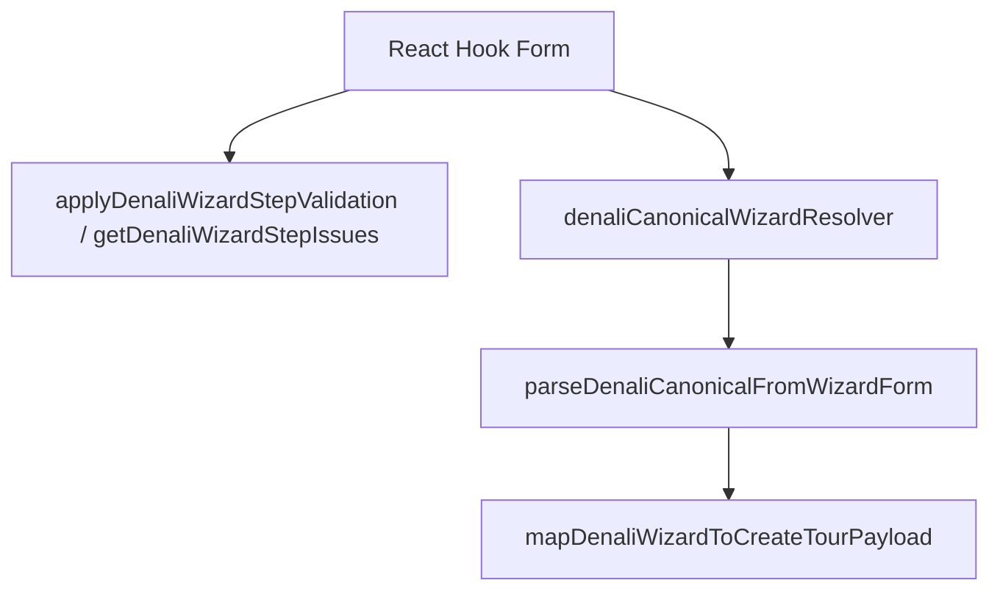

# Gemini CLI Audit — Rule Engine Design vs Hardcoded Patchwork

Generated: 2026-05-25  
Mode: **Diagnostic only** (no fixes applied).  
Scope: Denali tour-create wizard rule/validation stack under `apps/web/src/features/tours/wizard/`.

---

## Executive summary

| Aspect | Original / documented design | Current runtime |
|--------|------------------------------|-----------------|
| Single source of truth | `denaliFieldRegistryData.ts` + `denaliRuleMatrixRecipes.ts` → codegen | **Registry + codegen active** (`audit:denali-registry` clean) |
| UI visibility/required | Rule model from `denaliRuleSet.generated.ts` via `useDenaliStepFieldRules` / `denaliUIAdapter` | **Active** in step components |
| Phase-1 rule files (`denaliRules.ts`, `useDenaliWizardRules`) | Documented in `docs/TEST-REPORT.md` (2026-05-19) | **Removed from disk** — superseded by registry pipeline |
| Generic `evaluateFormRules` | Described as evaluating all step fields from rule model | **Exists** but **not imported** by create-wizard product path (specs + edit spec only) |
| Submit authority | `denaliCanonicalTourSchema` only (`docs/architecture/denali-wizard-validation.md`) | **Canonical schema** + parallel **rule required** scan + **invariant engine** + **hand path map** |
| Transport/pricing conditionals | Intended in rules table or shared `@repo/types/denali` helpers | **Split**: registry flags + **`isDenaliFieldContextuallyVisible`** + **`isDenaliFieldRequired`** + **`denaliInvariantEngine`** |

**Verdict:** The registry/codegen **Rule Engine** is real and is the backbone for static `hidden`/`required` matrices. A substantial **Hardcoded Patchwork** layer still sits on top for transport, pricing, mountain invariants, canonical↔form path mapping, profile-specific publish checks, and dev rail overrides.

---

## Diagnostic Step 1 — Documented “Rule Engine” design (original intent)

### 1.1 Registry-first pipeline (current docs)

From `apps/web/src/features/tours/wizard/denali/registry/README.md`:

```text
Authoring:
  denaliFieldRegistryData.ts   — field rows (canonical path, step, RHF/Zod, matrix tags)
  denaliRuleMatrixRecipes.ts   — category × duration → matrix tags

Codegen (pnpm --filter web generate:denali-wizard):
  ../rules/generated/denaliRuleSet.generated.ts
  ../rules/generated/denaliCanonicalPathMap.generated.ts
  ../../schemas/denaliTourCreateBaseSchema.generated.ts

Thin wrappers:
  DenaliFieldRegistry.ts, denaliRuleModel.ts, denaliTourCreateBaseSchema.ts
```

### 1.2 Validation topology (product docs)

From `docs/architecture/denali-wizard-validation.md`:

```text
Submit authority:
  form (RHF) → denaliFormToCanonical → denaliCanonicalTourSchema → mapDenaliWizardToCreateTourPayload

Step Next (denali_basic … denali_pricing):
  applyDenaliWizardStepValidation — rule compiler per step
  (does NOT use denaliTourCreateBaseSchema)

denaliTourCreateBaseSchema — @deprecated, tests/shadow only
```

### 1.3 Phase 1–2 rule layer (historical — TEST-REPORT 2026-05-19)

From `docs/TEST-REPORT.md` — **original** integrated design:

| File (as documented) | Role |
|----------------------|------|
| `denali/rules/denaliRules.ts` | Rule definitions per category |
| `denali/rules/denaliRuleEngine.ts` | `resolveDenaliRules()` + duration adapters |
| `denali/rules/useDenaliWizardRules.ts` | RHF hook from `basicInfo.tourType` |
| `denali/validation/ruleAwareValidation.ts` | `withDenaliRuleEngine` wrapping Zod |
| `denali/validation/denaliRuleValidation.ts` | Rule-driven refine, strip hidden |

Documented UI replacements:

- `denaliCategoryRequiresEventVariant` → `rules.showEventVariant()`
- `deriveDenaliIsOutdoorTour` → `rules.showOutdoorProgramFields()`
- Hard-coded duration list → `isFormDurationAllowedForCategory`

### 1.4 Intended runtime flow (mermaid from validation doc)



**Design principle:** One compiled rule model per `(category, duration)` drives UI gates and step-level requiredness; canonical Zod owns submit shape; registry owns field inventory.

---

## Diagnostic Step 2 — Current rule authority inventory (raw counts)

### Commands run

```bash
# Registry rows
rg 'canonicalPath:' apps/web/src/features/tours/wizard/denali/registry/denaliFieldRegistryData.ts | wc -l
# → 53 (52 field definitions + file structure; audit reports registryCount: 52)

# Generated artifacts
wc -l apps/web/src/features/tours/wizard/denali/rules/generated/denaliRuleSet.generated.ts
# → 401 lines
wc -l apps/web/src/features/tours/wizard/denali/rules/generated/denaliCanonicalPathMap.generated.ts
# → 61 lines

# denaliRuleSet reference sites under wizard/
rg "denaliRuleSet" apps/web/src/features/tours/wizard -l --glob '*.ts' --glob '*.tsx' | sort -u | wc -l
# → 34 files
```

### Registry integrity audit (raw output)

```bash
pnpm --filter web audit:denali-registry
```

```json
{
  "registryCount": 52,
  "rulePathCount": 49,
  "issues": [],
  "ruleNotInRegistryCount": 0,
  "ruleNotInRegistry": [],
  "matrixCellsOk": true
}
```

**Note:** `registryCount` (52) vs `rulePathCount` (49) — three registry rows do not surface as rule-model paths in the generated matrix (expected for derived/wire-only rows; no audit failures).

### Current production rule stack (files)

| Layer | File | Generated? | Role |
|-------|------|------------|------|
| Matrix SSOT | `denali/registry/denaliFieldRegistryData.ts` | No (author) | Field rows |
| Matrix recipes | `denali/registry/denaliRuleMatrixRecipes.ts` | No (author) | Tag activation per cell |
| Codegen | `denali/registry/denaliRegistryCodegen.ts` | No (build) | `buildDenaliRuleSetFromRegistry()` |
| Rule set | `denali/rules/generated/denaliRuleSet.generated.ts` | **Yes** | `denaliRuleSet[category][duration].fields[]` |
| Path map | `denali/rules/generated/denaliCanonicalPathMap.generated.ts` | **Yes** | Canonical → RHF |
| Model API | `denali/rules/denaliRuleModel.ts` | Wrapper | Re-exports generated set + `findDenaliRuleField` |
| UI adapter | `denali/rules/denaliUIAdapter.ts` (342 lines) | No | `isDenaliFieldVisibleOnStep`, contextual visibility |
| Required | `denali/rules/denaliRuleRequired.ts` | No | `collectDenaliRuleRequiredIssues`, contextual required |
| Access | `denali/validation/denaliRuleAccess.ts` | No | Visible steps, normalize, overlay merge |
| Invariants | `denali/validation/denaliInvariantEngine.ts` | No | Ghost clearing, transport/pricing clears |
| Step Zod orchestration | `denali/validation/denaliWizardFormZod.ts` | No | `getDenaliWizardStepIssues`, `validateDenaliWizardForm` |
| Submit Zod | `schemas/denaliCanonicalTourSchema.ts` | No | Submit authority |
| Path bridge | `schemas/denaliCanonicalIssuePaths.ts` | No | Manual `switch` canonical → `basicInfo.*` |
| React hook | `denali/hooks/useDenaliStepFieldRules.ts` | No | Wraps `denaliUIAdapter` + canonical context |

---

## Diagnostic Step 3 — Design vs disk: removed / renamed modules

### Files documented in TEST-REPORT but **missing** on disk

```bash
ls denaliRules.ts denaliRuleEngine.ts useDenaliWizardRules.ts ruleAwareValidation.ts
# → No such file or directory (all MISSING)
```

| Documented path | Status |
|-----------------|--------|
| `denali/rules/denaliRules.ts` | **MISSING** |
| `denali/rules/denaliRuleEngine.ts` | **MISSING** |
| `denali/rules/useDenaliWizardRules.ts` | **MISSING** |
| `denali/validation/ruleAwareValidation.ts` | **MISSING** |

### Successor wiring (what replaced them)

| Old concept | Current implementation |
|-------------|----------------------|
| `useDenaliWizardRules` | `useDenaliStepFieldRules` → `isDenaliFieldVisibleOnStep` / `isDenaliFieldRequiredOnStep` |
| `denaliRules` / category tables | `denaliRuleSet.generated.ts` from registry |
| `ruleAwareValidation` / Zod refine wrapper | `denaliWizardFormZod.ts` → `collectDenaliRuleRequiredIssues` + `validateDenaliWizardForm` (still uses **legacy** `denaliTourCreateBaseSchema` for structural parse) |
| `denaliRuleValidation.ts` | **Deprecated re-export shim only** — no product importers outside specs |

```typescript
// denali/validation/denaliRuleValidation.ts (entire public surface)
/** @deprecated Import from denaliRuleAccess.ts and denaliWizardFormZod.ts */
export { getDenaliStepPickShape, normalizeDenaliFormPatch, ... } from "./denaliRuleAccess";
export { getDenaliWizardStepIssues, validateDenaliWizardForm } from "./denaliWizardFormZod";
```

### `evaluateFormRules` — orphan relative to create wizard

```bash
rg 'from "./evaluateFormRules"|evaluateFormRules(' apps/web --glob '*.{ts,tsx}'
```

| Importer | Purpose |
|----------|---------|
| `evaluateFormRules.ts` | Definition |
| `evaluateFormRules.*.spec.ts` | Unit tests |
| `DenaliTourEditForm.spec.ts` | Edit form spec |

**No** import from `DenaliCreateTourWizard.tsx`, step components, or `denaliWizardFormZod.ts`.

`evaluateFormRules` internally calls the **same** `denaliUIAdapter` + `denaliRuleRequired` stack — it is a diagnostic/secondary API, not a separate engine.

---

## Diagnostic Step 4 — Hardcoded patchwork map (non-registry logic)

### 4.1 `denaliUIAdapter.ts` — contextual visibility (bypasses static `field.hidden`)

```typescript
// apps/web/src/features/tours/wizard/denali/rules/denaliUIAdapter.ts
function isDenaliFieldContextuallyVisible(path, form, ...) {
  if (path === "transport.transportCost") return isDenaliTransportCostVisible(...);
  if (path === "transport.allowPersonalCar") return isDenaliAllowPersonalCarVisible(...);
  if (path === "transport.dongAmount") return isDenaliTransportDongAmountVisible(...);
  if (path === "transport.adminCapacityApproval") return isDenaliAdminCapacityApprovalVisible(...);
  if (path === "pricing.basePricePerPerson") return form.pricingPayment.requiresPayment === true;
  if (path === "program.altitudeMeasurement") return isDenaliAltitudeVisibleForCategory(basics?.category);
  if (path === "localGuideName") return form.basicInfo.requiresLocalGuide === true;
  return true;
}
```

`rg -c "transportMode|allowPersonalCar|shared_cars" denaliUIAdapter.ts` → **7**  
These rules are **not** expressed as registry matrix tags alone; they depend on `@repo/types/denali` transport helpers + form toggles.

### 4.2 `denaliRuleRequired.ts` — contextual required (bypasses static `field.required`)

```typescript
// apps/web/src/features/tours/wizard/denali/rules/denaliRuleRequired.ts
if (formPath === "transport.dongAmount") return isDenaliTransportDongAmountRequired(...);
if (formPath === "transport.seatPreference") return isDenaliSeatPreferenceRequired(...);
if (formPath === "pricingPayment.basePricePerPerson") return form.pricingPayment.requiresPayment === true;
if (formPath === "basicInfo.endDateTime") return denaliTourKindToIsMultiDay(form.basicInfo.tourType);
```

### 4.3 `denaliInvariantEngine.ts` — structural clears (parallel to normalize)

```bash
rg -c "transportMode|category ===" denaliInvariantEngine.ts
# → 9
```

Sample hardcoded branches (non-spec):

```text
denaliInvariantEngine.ts:48  if (!isDenaliAltitudeVisibleForCategory(basics?.category))
denaliInvariantEngine.ts:52  if (basics?.category === "mountain") sportsInsuranceRequired = true
denaliInvariantEngine.ts:56+ transportMode === "none" | "shared_cars" → clear transportCost
denaliInvariantEngine.ts:60+ dongVisible computed from mode + allowPersonalCar
denaliInvariantEngine.ts:69+ isDenaliAllowPersonalCarVisible
```

Invoked from: `prepareDenaliWizardFormForSubmit`, `applyDenaliInvariantState`, hydration paths — **same tier as rule engine**, not generated from registry.

### 4.4 `denaliCanonicalIssuePaths.ts` — hand-maintained path switch (105+ lines)

Second path map **in addition to** `denaliCanonicalPathMap.generated.ts`:

```typescript
switch (head) {
  case "title": return "basicInfo.title";
  case "category":
  case "duration": return "basicInfo.tourType";
  // ... 20+ cases for program, transport, pricing, participants, photos
}
```

Used by: `denaliWizardFormZod.ts` (`canonicalIssuesToFormIssues`), `apply-api-validation-errors.ts`.

**Drift risk:** `gatheringPoint` mapped to `basicInfo.gatheringPoint` in issue paths but not in `denaliCanonicalToForm` / `denaliBasicInfoSchema` (documented in architecture fragmentation audit).

### 4.5 Profile / workspace hardcoded branches (non-registry)

```text
denali/validation/denaliWizardPublishReadiness.ts:94
  if (profile === "denali_pilot") { checkDenaliPilotPublishGeolocationZones(...) }

denali/validation/denaliRuleAccess.ts:216
  if (basics?.category === "event") { patch eventVariant default "reading" }

denali/denaliAltitudeVisibility.ts:7
  return category === "mountain";

denali/denaliCanonicalBasicsControl.ts:43
  return next ?? "mountain_day";  // default tour kind slug
```

### 4.6 Dev / QA rail override (not rule model)

```typescript
// denali/validation/denaliRuleAccess.ts
export function withDenaliWizardRailTestingOverrides(steps, options?) {
  const enabled = options?.enabled ?? process.env.NODE_ENV === "development";
  // Forces denali_logistics, denali_photos back onto rail when hidden
}
```

Used in `DenaliCreateTourWizard.tsx` line ~261.

### 4.7 Standalone helpers with **zero** product importers (orphan patchwork)

```text
denali/denaliThemeFilter.ts       — 49 lines, only denaliThemeFilter.spec.ts
denali/denaliWizardDerived.ts     — 44 lines, only denaliWizardDerived.spec.ts
denali/denaliDefaultGatheringPoints.ts — only spec
```

### 4.8 `DENALI_FORM_RULE_CONFIG` (`@repo/shared` form-rule-engine)

```typescript
// apps/web/lib/form-rule-engine/denaliFormRuleConfig.ts
// "Visibility/required for Denali still come from denaliRuleSet + evaluateFormRules;
//  this config is for autocomplete wiring only."
```

Used by `domain/ruleModelConverter.ts` for template→rule-model mapping — **lookup/autocomplete**, not the Denali step UI rule engine.

---

## Diagnostic Step 5 — Layer collision matrix (Rule Engine vs Patchwork vs Schema)

Legend from `PROJECT_DIAGNOSTIC_REPORT.md` §6 (still accurate pattern):

| Concern | Registry / `denaliRuleSet` | Patchwork (`UIAdapter` + `RuleRequired` + `InvariantEngine`) | `denaliCanonicalTourSchema` | Legacy `denaliTourCreateBaseSchema` |
|---------|---------------------------|--------------------------------------------------------------|----------------------------|-------------------------------------|
| `title` min length | required flag | — | min 10 chars | max only in legacy |
| `destinationId` | required when in model | — | UUID regex | optional string |
| `transport.dongAmount` | row `required: false` | **contextual required** | conditional superRefine | structural reject 0 |
| `pricing.basePricePerPerson` | row `required: false` | **requiresPayment === true** | min 1 when paid | structural |
| `program.altitudeMeasurement` | outdoor/mountain matrix | **category === mountain** in invariant | optional + refine | optional |
| `participants.sportsInsurance` | mountain matrix | **forced true** in invariant for mountain | — | — |
| `publishStatus` | required in model | — | optional | optional |
| Step field visibility | `field.hidden` | **+ contextual visibility** | — | — |

### Submit vs step validation (actual call graph)

| User action | Functions invoked | Engine? |
|-------------|-------------------|---------|
| Render field | `useDenaliStepFieldRules` → `isDenaliFieldVisibleOnStep` | Registry + **patchwork** |
| Click Next | `applyDenaliWizardStepValidation` → `getDenaliWizardStepIssues` → `validateDenaliWizardForm` + `collectDenaliRuleRequiredIssues` | Registry + **patchwork** + legacy structural Zod |
| Click Submit | `denaliCanonicalWizardResolver` → `parseDenaliCanonicalFromWizardForm` | **Canonical Zod** + path map |
| After kind switch / hydrate | `applyDenaliInvariantState` → `normalizeDenaliWizardForm` | **Invariant engine** + registry hidden paths |
| Publish readiness | `getDenaliWizardPublishReadinessIssues` | `collectDenaliRuleRequiredIssues` + **`profile === denali_pilot"`** geo |

### Dual path maps (raw comparison)

| Map | Source | Consumers |
|-----|--------|-----------|
| `DENALI_CANONICAL_TO_FORM_PATH_MAP` | **Generated** from registry | `denaliRuleRequired`, rule model |
| `canonicalZodPathToFormFieldPath()` | **Hand-written** switch | Zod error display, API validation mapping |

---

## Side-by-side: Original Rule Engine vs Current Patchwork

### Original (circa TEST-REPORT Phase 1–2, May 2025)

```text
basicInfo.tourType
    → denaliRuleEngine.resolveDenaliRules()
        → denaliRules (per-category tables)
            → showEventVariant(), showEndDateTime(), showOutdoorProgramFields()
    → ruleAwareValidation.refineDenaliRuleEngine (Zod)
    → useDenaliWizardRules() in JSX (read-only, no useEffect)
```

### Current (May 2026)

```text
basicInfo.tourType + DenaliCanonicalContext (category/duration/eventVariant)
    → resolveDenaliRuleModelFromForm()
        → denaliRuleSet.generated[category][duration]  ← registry codegen
    → useDenaliStepFieldRules → denaliUIAdapter
        → static field.hidden
        → isDenaliFieldContextuallyVisible()  ← HARD CODED transport/pricing/altitude
    → denaliRuleRequired.collectDenaliRuleRequiredIssues()
        → static field.required
        → isDenaliFieldRequired()  ← HARD CODED dong/seat/paid/multi-day
    → denaliInvariantEngine.applyDenaliInvariantState()  ← HARD CODED clears
    → normalizeDenaliWizardForm() clears hidden canonical paths from registry loop
Submit:
    → denaliCanonicalTourSchema (NOT rule-aware Zod wrapper)
    → canonicalZodPathToFormFieldPath (HAND switch, not generated map)
```

---

## Smoke / test mock data vs registry (cross-reference)

Hardcoded fixtures that **do not** come from `denaliFieldRegistryData.ts`:

| ID | Location | Conflict |
|----|----------|----------|
| S-1 | `schemas/denaliTourCreateBaseSchema.ts` | `DENALI_WIZARD_TEST_DESTINATION_ID`, `DENALI_WIZARD_TEST_THEME_ID` exported in product path |
| S-2 | `legacy/schemas/tourCreateSchema.spec.ts` | `a0eebc99-9c0b-4ef8-bb6d-6bb9bd380a11` classic `location.mainDestinationId` |
| S-3 | `tests/smoke/tour-wizard-smoke-helpers.ts` | `buildSmokeWizardTemplateEnvelope`, profiles not in `TOUR_WORKSPACE_DEFINITIONS` |
| S-4 | `tests/smoke/12-denali-verification-matrix.spec.ts` | `denali-tour-category-event` test id (production: `denali-basics-category`) |
| S-5 | `tests/smoke/10-denali-wizard-shell.spec.ts` | `data-wizard-step-count="5"` vs 6 entries in `denaliWizardSteps` |

(Full list: `divergence-trace.md` M-01–M-15.)

---

## Raw file index — Rule Engine core

```text
apps/web/src/features/tours/wizard/denali/registry/denaliFieldRegistryData.ts
apps/web/src/features/tours/wizard/denali/registry/denaliRuleMatrixRecipes.ts
apps/web/src/features/tours/wizard/denali/registry/DenaliFieldRegistry.ts
apps/web/src/features/tours/wizard/denali/registry/denaliRegistryCodegen.ts
apps/web/src/features/tours/wizard/denali/rules/generated/denaliRuleSet.generated.ts
apps/web/src/features/tours/wizard/denali/rules/generated/denaliCanonicalPathMap.generated.ts
apps/web/src/features/tours/wizard/denali/rules/denaliRuleModel.ts
apps/web/src/features/tours/wizard/denali/rules/denaliUIAdapter.ts
apps/web/src/features/tours/wizard/denali/rules/denaliRuleRequired.ts
apps/web/src/features/tours/wizard/denali/hooks/useDenaliStepFieldRules.ts
apps/web/src/features/tours/wizard/denali/validation/denaliRuleAccess.ts
```

## Raw file index — Hardcoded patchwork layer

```text
apps/web/src/features/tours/wizard/denali/validation/denaliInvariantEngine.ts
apps/web/src/features/tours/wizard/denali/rules/denaliUIAdapter.ts          (contextual block)
apps/web/src/features/tours/wizard/denali/rules/denaliRuleRequired.ts       (contextual block)
apps/web/src/features/tours/wizard/schemas/denaliCanonicalIssuePaths.ts
apps/web/src/features/tours/wizard/denali/validation/denaliWizardPublishReadiness.ts
apps/web/src/features/tours/wizard/denali/denaliAltitudeVisibility.ts
apps/web/src/features/tours/wizard/denali/denaliCanonicalBasicsControl.ts
apps/web/src/features/tours/wizard/denali/validation/denaliRuleAccess.ts   (eventVariant, dev rail)
apps/web/src/features/tours/wizard/schemas/denaliCanonicalTourSchema.ts    (superRefine rules)
apps/web/src/features/tours/wizard/denali/validation/denaliWizardFormZod.ts (legacy base + rules)
```

## Raw file index — Documented but removed

```text
apps/web/src/features/tours/wizard/denali/rules/denaliRules.ts              (MISSING)
apps/web/src/features/tours/wizard/denali/rules/denaliRuleEngine.ts         (MISSING)
apps/web/src/features/tours/wizard/denali/rules/useDenaliWizardRules.ts     (MISSING)
apps/web/src/features/tours/wizard/denali/validation/ruleAwareValidation.ts (MISSING)
```

---

## Related repo artifacts (not modified)

- `architecture-map.md` — orchestrator + registry map  
- `divergence-trace.md` — profile forks + smoke mock conflicts  
- `PROJECT_DIAGNOSTIC_REPORT.md` — §5–§6 rule engine vs schema cross-reference  
- `docs/TEST-REPORT.md` — historical Phase 1–2 design (partially stale)  
- `docs/architecture/denali-wizard-validation.md` — current submit authority  

---

*End of audit. No code changes were made.*
