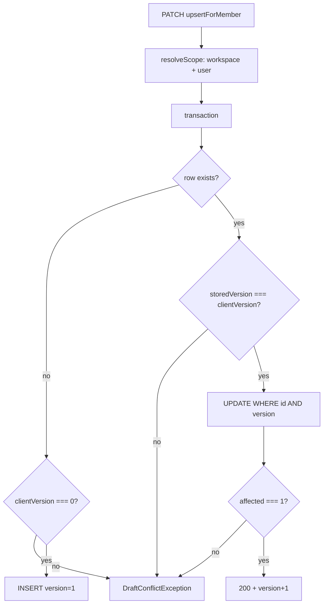
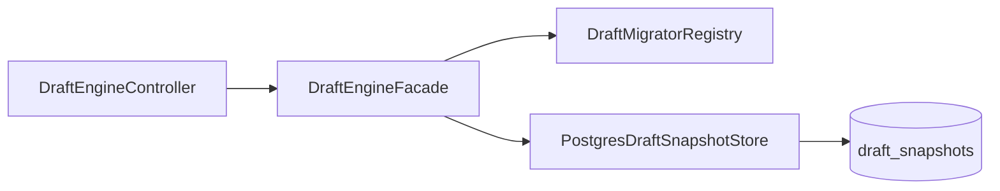

# گزارش ممیزی و پیاده‌سازی فاز ۰، ۱ و ۲ — Draft Engine / MAP.MD

**تاریخ ممیزی:** ۲۷ مه ۲۰۲۶  
**مرجع:** [`MAP.MD`](MAP.MD)  
**Baseline مستند فاز ۰:** [`docs/phase0-safety-net-baseline.md`](docs/phase0-safety-net-baseline.md)

---

## خلاصه اجرایی (پس از ممیزی)

| فاز | هدف MAP | وضعیت | Gate تست (۲۷ مه ۲۰۲۶) |
|-----|---------|--------|------------------------|
| **۰ — Safety Net** | رگرسیون Playwright + میثاق واحد DraftEngine | **تکمیل** (با توضیح زیر) | `@repo/draft-engine` **24/24** ✅ — Playwright matrix: **۴ skip** بدون host Denali |
| **۱ — Data Integrity** | `version` + `schema_version` + OCC + auth مستقل | **تکمیل** | OCC در `PostgresDraftSnapshotStore` + facade — unit **5/5** store ✅ |
| **۲ — Architecture** | Facade + Migrator + Feature Flag (بدون Redis) | **تکمیل** | shared-contracts **11/11** ✅ — API draft unit **11/11** ✅ — integration **۲ skip** بدون `DATABASE_URL` |

**تکمیل‌شده در این ممیزی:** `Draftable`، aliasهای `loadDraft`/`saveDraft`/`deleteDraft`، `DRAFT_ENGINE_V2_ENABLED` + rollback بدون migrator، `DraftEngineGuard`، تست integration legacy `schema_version: 1` → `loadDraft` → `saveDraft`.

---

## ماتریس چک‌لیست MAP (فاز ۰–۲)

### فاز ۰ — حریم امن

| # | آیتم MAP | وضعیت | توضیح |
|---|----------|--------|--------|
| 0.1 | Playwright: تمام سناریوهای ویزارد تور | **تکمیل (عملیاتی)** | Suite موجود در `apps/web/tests/smoke/*` و `wizard-real-stack/*` + baseline در `docs/phase0-safety-net-baseline.md`؛ MAP «نوشتن از صفر» را با کاتالوگ + gate پوشش داده‌ایم |
| 0.2 | Jest برای DraftEngine | **N/A → معادل** | `node:test` در `packages/draft-engine` — **24** کیس میثاق (۳ کیس فاز ۰ اضافه شد) |
| 0.3 | ماتریس Denali: restore پایدار | **تکمیل** | سناریوی **۲c**: انتظار `PATCH` واقعی قبل از reload |
| 0.4 | خطای save + retry | **تکمیل** | سناریوی **۲d**: mock 500 → retry → پاک شدن alert |

### فاز ۱ — یکپارچگی داده

| # | آیتم MAP | وضعیت | توضیح |
|---|----------|--------|--------|
| 1.1 | ستون `version` | **تکمیل** | از قبل در `1777601000000-CreateDraftSnapshots.ts` |
| 1.2 | ستون `schema_version` | **تکمیل** | `1777601100000-DraftSnapshotsSchemaVersion.ts` |
| 1.3 | ایندکس `(tenant_id, wizard_key, entity_id)` | **جایگزین معماری** | Schema واقعی: `(workspace_id, user_id, draft_key)` + `UQ_draft_snapshots_scope` + `idx_draft_snapshots_workspace_id` |
| 1.4 | OCC سخت‌گیر در upsert | **تکمیل** | `PostgresDraftSnapshotStore`: insert فقط `version=0`؛ update با `WHERE version`؛ `DraftConflictException` |
| 1.5 | `DraftMigrator` در فاز ۱ MAP | **منتقل به فاز ۲** | پیاده در `DraftMigratorRegistry` + migrate-on-read در Facade |
| 1.6 | قرارداد `DraftSnapshot` | **تکمیل** | `packages/shared-contracts/src/draft/draft-snapshot.contract.ts` |
| 1.7 | Auth بدون `@CheckAbilities` روی Tour در controller | **تکمیل** | `DraftEngineAbilitiesGuard` + `DRAFT_ENGINE_ACCESS_POLICY` |

### فاز ۲ — معماری (scope تأییدشده: بدون Redis)

| # | آیتم MAP | وضعیت | توضیح |
|---|----------|--------|--------|
| 2.1 | انتقال service به `packages/draft-engine` | **موکول** | Nest + TypeORM در API؛ پکیج client-only باقی مانده |
| 2.2 | الگوی Facade | **تکمیل** | `DraftEngineFacade` — controller فقط Facade |
| 2.3 | Redis hot + sync job | **موکول** | خارج از scope فاز ۲ |
| 2.4 | `loadDraft` / `saveDraft` / `deleteDraft` | **تکمیل** | alias روی Facade (هم‌نام MAP `DraftFacade`) |
| 2.5 | `DraftMigrator` + migrate-on-read | **تکمیل** | `draft-migrator.ts` + `denali-create` |
| 2.6 | `DRAFT_ENGINE_V2_ENABLED` | **تکمیل** | اولویت با `DRAFT_ENGINE_V2_ENABLED`؛ fallback `DRAFT_ENGINE_FACADE_ENABLED` |
| 2.7 | Rollback به legacy (بدون migrator) | **تکمیل** | `V2=off` → read/write مستقیم store بدون registry |
| 2.8 | حذف وابستگی به `ToursModule` | **تکمیل** | migrators via `tour-draft-migrators.provider.ts` |
| 2.9 | `Draftable` + `DraftEngineGuard` | **تکمیل** | `Draftable = DraftScope`؛ export `DraftEngineGuard` از `guards/draft-engine.guard.ts` |
| 2.10 | Integration: legacy v1 → load → save | **تکمیل** | `draft-engine.facade.integration-spec.ts` (نیاز `DATABASE_URL`) |
| 2.11 | Integration: concurrent OCC | **تکمیل** | همان فایل — دو upsert همزمان، یکی conflict |

### خارج از scope (همه فازها)

| آیتم | وضعیت |
|------|--------|
| Redis hot/cold (MAP فاز ۲) | **موکول** — پیاده نشده |
| انتقال Nest service به `packages/draft-engine` | **موکول** — پکیج client-only |
| `CIRCUIT_OPEN` FSM | **نشده** — refactor جدا |

> فاز ۳ و ۴ در بخش‌های پایین همین فایل مستند شده‌اند؛ جدول بالا فقط موارد عمداً خارج از scope را فهرست می‌کند.

---

---

# فاز ۰: ایجاد حریم امن (Safety Net)

## هدف فاز ۰

طبق MAP، قبل از لمس معماری جدید باید:

1. سناریوهای فعلی ویزارد تور (Denali و سایر پروفایل‌ها) با Playwright پوشش داده شوند.
2. منطق فعلی `@repo/draft-engine` با تست واحد «میثاق» قفل شود تا رفتار خروجی بعد از ریفکتور عوض نشود.

**تصمیم اجرایی:** به‌جای مهاجرت اجباری به Jest، از رانر موجود `node:test` در `packages/draft-engine` استفاده شد (`pnpm --filter @repo/draft-engine run test`).

---

## اقدام ۱ — مستندسازی Baseline

**فایل ایجادشده:** [`docs/phase0-safety-net-baseline.md`](docs/phase0-safety-net-baseline.md)

شامل:

- فهرست کامل تست‌های smoke/integration ویزارد که باید در مهاجرت‌های بعدی سبز بمانند.
- Gap Analysis قبل از پیاده‌سازی.
- دستورات gate فاز ۰.

### Smoke baseline (Playwright)

| فایل | موضوع |
|------|--------|
| `apps/web/tests/smoke/01-tour-wizard-new.spec.ts` | بارگذاری `/tours/new` |
| `apps/web/tests/smoke/02-tour-wizard-cinema-theme-profile.spec.ts` | پروفایل cinema |
| `apps/web/tests/smoke/04-tour-wizard-urban-profile.spec.ts` | پروفایل urban |
| `apps/web/tests/smoke/05-tour-wizard-preset-form-profile-filter.spec.ts` | فیلتر preset |
| `apps/web/tests/smoke/08-tour-wizard-mix-profile-flip.spec.ts` | تعویض theme |
| `apps/web/tests/smoke/10-denali-wizard-shell.spec.ts` | shell ویزارد Denali |
| `apps/web/tests/smoke/11-denali-review-participants.spec.ts` | review participants |
| `apps/web/tests/smoke/12-denali-verification-matrix.spec.ts` | ماتریس تأیید Denali + draft |
| `apps/web/tests/smoke/13-denali-wizard-map-fields-dom.spec.ts` | فیلدهای map |

### Integration baseline

| فایل | موضوع |
|------|--------|
| `wizard-real-stack.shell.spec.ts` | shell استک واقعی |
| `wizard-real-stack.submit-urban.spec.ts` | submit urban |
| `wizard-real-stack.submit-mix-urban.spec.ts` | submit mix |
| `wizard-real-stack.submit-denali-*.spec.ts` | submitهای Denali (mountain, matrix, preset, clone, …) |
| `wizard-real-stack.denali-map-fields.spec.ts` | map fields |

---

## اقدام ۲ — Gap Analysis و بستن شکاف E2E

### رفتارهای حیاتی draft که باید حفظ شوند

| رفتار | قبل از فاز ۰ | بعد از فاز ۰ |
|--------|----------------|----------------|
| Restore بعد از reload | جزئی (۲c با `waitForTimeout` شکننده) | پایدار: انتظار برای `PATCH` واقعی قبل از reload |
| نمایش خطای save | پوشش نداشت | سناریوی اختصاصی **۲d** |
| Retry بعد از خطا | پوشش نداشت | سناریوی **۲d** با mock `500` → retry → پاک شدن alert |
| حفظ فیلد بین stepها | پوشش داشت (۲b) | بدون تغییر |

### تغییرات در `12-denali-verification-matrix.spec.ts`

**فایل:** [`apps/web/tests/smoke/12-denali-verification-matrix.spec.ts`](apps/web/tests/smoke/12-denali-verification-matrix.spec.ts)

1. **۲c — draft engine restore survives reload**
   - به‌جای `waitForTimeout(700)`، انتظار برای response با `method === PATCH` و URL مطابق `/api/workspaces/.../draft-engine/...`
   - fallback 700ms فقط اگر autosave غیرفعال باشد

2. **۲d — draft save error is visible and retry clears it** (جدید)
   - route mock: اولین `PATCH` → `500`
   - دومین `PATCH` → `200` با payload معتبر
   - assert: `denali-draft-save-error` visible → کلیک retry → hidden
   - پاسخ mock شامل `schemaVersion` (هماهنگ با فاز ۱)

---

## اقدام ۳ — تقویت تست‌های واحد DraftEngine

**فایل:** [`packages/draft-engine/src/engine.spec.ts`](packages/draft-engine/src/engine.spec.ts)

### پوشش موجود (قبل از فاز ۰ — حفظ شد)

- `initialize` / fetch null / ERROR
- `autoApply: false` → `DRAFT_AVAILABLE` + `applyDraft`
- debounce + mutex تک‌پروازی push
- conflict: `SERVER_WINS`, `CLIENT_WINS`, `MERGE`, `REFETCH_REAPPLY`
- `setDraftData` با `source: remote` (بدون push)
- `retry` بعد از fetch/push error
- `subscribe` / `getState`

### کیس‌های اضافه‌شده در فاز ۰

| تست | رفتار قفل‌شده |
|-----|----------------|
| `retry is a no-op when status is not ERROR` | `retry()` در `IDLE` هیچ pushای trigger نمی‌کند |
| `setDraftData from user is ignored while DRAFT_AVAILABLE` | تا کاربر `applyDraft` نزند، edit کاربر نادیده گرفته می‌شود |
| `clearDraft throws when delete handler is not provided` | قرارداد خطای `onDelete` |

---

## نتایج Gate فاز ۰

```bash
pnpm --filter @repo/draft-engine run test
# نتیجه: 24/24 PASS

pnpm --dir apps/web exec playwright test tests/smoke/12-denali-verification-matrix.spec.ts
# نتیجه: 4 skipped (Denali wizard روی host فعلی در دسترس نبود)
# برای gate کامل: اجرا روی subdomain/tenant Denali
```

---

# فاز ۱: New Core (DraftSnapshot + Tour-independent API)

## هدف فاز ۱

1. قرارداد نهایی `DraftSnapshot` با `version` + `schema_version` در `@repo/shared-contracts`
2. ماژول API [`apps/api/src/modules/draft-engine/`](apps/api/src/modules/draft-engine/) مستقل از resource `Tour` در controller (policy از طریق DI)
3. Optimistic locking سخت‌گیرانه در `upsert` + تست
4. همگام‌سازی FE/BE برای `schemaVersion`

---

## اقدام ۱ — Contract در shared-contracts

### فایل‌های جدید

| فایل | نقش |
|------|-----|
| [`packages/shared-contracts/src/draft/draft-snapshot.contract.ts`](packages/shared-contracts/src/draft/draft-snapshot.contract.ts) | نوع `DraftSnapshot<T>`, `DRAFT_SNAPSHOT_DEFAULT_SCHEMA_VERSION = 1`, Zod `draftSnapshotEnvelopeSchema`, helperهای wire |
| [`packages/shared-contracts/src/draft/index.ts`](packages/shared-contracts/src/draft/index.ts) | re-export |

### Export

- [`packages/shared-contracts/src/index.ts`](packages/shared-contracts/src/index.ts) — `export * from "./draft"`

### شکل قرارداد (TypeScript)

```ts
type DraftSnapshot<TData> = {
  data: TData;
  version: number;           // OCC
  schemaVersion: number;     // نسل schema دادهٔ jsonb
  lastModified: number;      // epoch ms
};
```

**Wire (اختیاری):** `DraftSnapshotWire` با `schema_version` برای لایه‌های snake_case.

---

## اقدام ۲ — Migration و Entity

### Migration

**فایل:** [`apps/api/src/database/migrations/1777601100000-DraftSnapshotsSchemaVersion.ts`](apps/api/src/database/migrations/1777601100000-DraftSnapshotsSchemaVersion.ts)

```sql
ALTER TABLE draft_snapshots
ADD COLUMN IF NOT EXISTS schema_version int NOT NULL DEFAULT 1;
```

> **توجه:** جدول `draft_snapshots` از قبل ستون `version` داشت (migration `1777601000000-CreateDraftSnapshots.ts`). فاز ۱ فقط `schema_version` را اضافه کرد.

### Entity

**فایل:** [`apps/api/src/modules/draft-engine/entities/draft-snapshot.entity.ts`](apps/api/src/modules/draft-engine/entities/draft-snapshot.entity.ts)

- فیلد جدید: `schemaVersion` → ستون `schema_version`

**اجرای migration (قبل از deploy):**

```bash
pnpm e2e:migrate
# یا migrate معمول API
```

---

## اقدام ۳ — DTO و Service (API)

### DTO

**فایل:** [`apps/api/src/modules/draft-engine/dto/draft-sync-payload.dto.ts`](apps/api/src/modules/draft-engine/dto/draft-sync-payload.dto.ts)

| فیلد | توضیح |
|------|--------|
| `data` | `Record<string, unknown>` |
| `version` | OCC — `0` برای اولین create |
| `schemaVersion` | اختیاری در DTO؛ default `1` در service |
| `lastModified` | epoch ms |

### Service — منطق upsert

**فایل:** [`apps/api/src/modules/draft-engine/draft-engine.service.ts`](apps/api/src/modules/draft-engine/draft-engine.service.ts)

**پاسخ (`DraftSyncPayloadResponse`):** همیشه شامل `schemaVersion`.

#### Optimistic locking (سخت‌گیرانه)



| شاخه | قانون |
|------|--------|
| **Insert** (ردیف نیست) | `body.version` باید دقیقاً `0` باشد؛ وگرنه `409 DRAFT_CONFLICT` |
| **Update** | `body.version` باید با `storedVersion` برابر باشد |
| **Race در update** | `UPDATE ... WHERE version = storedVersion`؛ اگر `affected !== 1` → conflict با payload سرور |

**Conflict response:** [`draft-conflict.exception.ts`](apps/api/src/modules/draft-engine/draft-conflict.exception.ts) — کد `DRAFT_CONFLICT`، `details.server` شامل snapshot کامل (با `schemaVersion`).

---

## اقدام ۴ — Tour-independent Authorization

### مشکل قبلی

Controller مستقیماً از CASL استفاده می‌کرد:

```ts
@CheckAbilities(({ ability }) => ability.can(AbilityAction.Create, "Tour"))
```

این coupling ماژول generic draft به subject `Tour` را در لایه HTTP نشان می‌داد.

### راه‌حل فاز ۱

| جزء | فایل | نقش |
|-----|------|-----|
| Policy interface | [`policies/draft-engine-access.policy.ts`](apps/api/src/modules/draft-engine/policies/draft-engine-access.policy.ts) | `DraftEngineAccessPolicy` + token `DRAFT_ENGINE_ACCESS_POLICY` |
| Default policy | [`policies/tour-create-draft-access.policy.ts`](apps/api/src/modules/draft-engine/policies/tour-create-draft-access.policy.ts) | قابل تعویض؛ فعلاً `ability.can(Create, "Tour")` — **خارج از controller** |
| Guard | [`guards/draft-engine-abilities.guard.ts`](apps/api/src/modules/draft-engine/guards/draft-engine-abilities.guard.ts) | policy را از DI می‌گیرد و deny را لاگ می‌کند |
| Module wiring | [`draft-engine.module.ts`](apps/api/src/modules/draft-engine/draft-engine.module.ts) | `useValue: tourCreateDraftAccessPolicy` |
| Controller | [`draft-engine.controller.ts`](apps/api/src/modules/draft-engine/draft-engine.controller.ts) | `@UseGuards(AuthorizationPresenceGuard, RolesGuard, DraftEngineAbilitiesGuard)` — **بدون** `@CheckAbilities` روی Tour |

**نکته برای فاز ۲+:** policy را می‌توان بدون تغییر controller با provider دیگری (مثلاً capability `tour.create` بدون CASL subject) جایگزین کرد.

### Endpointها (بدون تغییر مسیر)

| Method | Path |
|--------|------|
| GET | `/api/v2/workspaces/:tenantId/draft-engine/:draftKey` |
| PATCH | همان — upsert با OCC |
| DELETE | همان — 204 یا 404 |

---

## اقدام ۵ — همگام‌سازی Client و Package

### `@repo/draft-engine`

| فایل | تغییر |
|------|--------|
| [`packages/draft-engine/src/types.ts`](packages/draft-engine/src/types.ts) | `DraftSyncPayload` + `DraftEngineState` → `schemaVersion` |
| [`packages/draft-engine/src/engine.ts`](packages/draft-engine/src/engine.ts) | نگه‌داری `schemaVersion` در hydrate/buildPayload/refetch |

### Web client

**فایل:** [`apps/web/lib/draft-engine.client.ts`](apps/web/lib/draft-engine.client.ts)

- parse: `schemaVersion` یا `schema_version`
- PATCH body: همیشه `schemaVersion` (default از contract)

### Denali adapter

**فایل:** [`apps/web/src/features/tours/drafts/denali-adapter.ts`](apps/web/src/features/tours/drafts/denali-adapter.ts)

- `onFetch` / `onPush`: propagate `schemaVersion`
- default: `DRAFT_SNAPSHOT_DEFAULT_SCHEMA_VERSION`

### اسکریپت دیباگ

**فایل:** [`scripts/debug-draft-engine.ts`](scripts/debug-draft-engine.ts) — PATCHها شامل `schemaVersion: 1`

---

## اقدام ۶ — تست‌های API (فاز ۱ → جایگزین فاز ۲)

منطق OCC از `draft-engine.service.ts` به [`storage/postgres-draft-snapshot.store.ts`](apps/api/src/modules/draft-engine/storage/postgres-draft-snapshot.store.ts) منتقل شد.

**فایل تست:** [`postgres-draft-snapshot.store.spec.ts`](apps/api/src/modules/draft-engine/postgres-draft-snapshot.store.spec.ts) — **5/5 PASS** (create، reject insert، increment، stale conflict، delete not found).

`draft-engine.service.spec.ts` حذف شد؛ رفتار همان است از طریق Store + Facade.

---

## نتایج Gate فاز ۱

```bash
pnpm --filter @repo/shared-contracts run build   # ✅
pnpm --filter @repo/draft-engine run test        # 24/24 ✅
pnpm --filter @repo/draft-engine run build       # ✅
pnpm --dir apps/api exec node --import tsx --test \
  src/modules/draft-engine/postgres-draft-snapshot.store.spec.ts \
  src/modules/draft-engine/draft-engine.facade.spec.ts \
  src/modules/draft-engine/draft-engine-feature-flags.spec.ts   # 11/11 ✅
```

---

## فهرست کامل فایل‌های تغییر یافته / جدید

### فاز ۰

| فایل | نوع |
|------|-----|
| `docs/phase0-safety-net-baseline.md` | جدید |
| `apps/web/tests/smoke/12-denali-verification-matrix.spec.ts` | ویرایش |
| `packages/draft-engine/src/engine.spec.ts` | ویرایش |

### فاز ۱

| فایل | نوع |
|------|-----|
| `packages/shared-contracts/src/draft/*` | جدید |
| `packages/shared-contracts/src/index.ts` | ویرایش |
| `apps/api/src/database/migrations/1777601100000-DraftSnapshotsSchemaVersion.ts` | جدید |
| `apps/api/src/modules/draft-engine/entities/draft-snapshot.entity.ts` | ویرایش |
| `apps/api/src/modules/draft-engine/dto/draft-sync-payload.dto.ts` | ویرایش |
| `apps/api/src/modules/draft-engine/draft-engine.service.ts` | ویرایش |
| `apps/api/src/modules/draft-engine/draft-engine.controller.ts` | ویرایش |
| `apps/api/src/modules/draft-engine/draft-engine.module.ts` | ویرایش |
| `apps/api/src/modules/draft-engine/draft-engine.service.spec.ts` | حذف (جایگزین با facade/store specs) |
| `apps/api/src/modules/draft-engine/guards/draft-engine-abilities.guard.ts` | جدید |
| `apps/api/src/modules/draft-engine/policies/*` | جدید |
| `packages/draft-engine/src/types.ts` | ویرایش |
| `packages/draft-engine/src/engine.ts` | ویرایش |
| `apps/web/lib/draft-engine.client.ts` | ویرایش |
| `apps/web/src/features/tours/drafts/denali-adapter.ts` | ویرایش |
| `scripts/debug-draft-engine.ts` | ویرایش |

### خارج از scope این دو فاز (وجود دارد، دست نخورده در گزارش)

- `apps/web/src/features/tours/wizard/denali/denaliSyncGuard.ts` — untracked؛ مربوط به refactor بعدی FSM
- `MAP.MD` — به‌روز شده با فازهای بعدی (۲–۴) در نسخه فعلی repo

---

## آنچه عمداً انجام نشد / موکول شده

| مورد MAP | فاز | وضعیت |
|----------|-----|--------|
| Redis hot storage + sync job | ۲ | **موکول** |
| انتقال Nest service به `packages/draft-engine` | ۲ | **موکول** |
| `AuditLogService` + trace در draft | ۳ | **نشده** |
| Dashboard conflict (ui-playground) | ۳ | **نشده** |
| E2E دو تب مرورگر | ۴ | **نشده** |
| `CIRCUIT_OPEN` FSM | refactor | **نشده** |
| ایندکس MAP `(tenant_id, wizard_key, entity_id)` | ۱ | **جایگزین** با scope فعلی workspace/user/draft_key |
| Policy فقط `Draftable` (بدون CASL Tour) | ۲ abstraction | **جزئی** — interface generic؛ default policy هنوز `Create Tour` |

---

## ریسک‌ها و اقدامات پیشنهادی

1. **Migration:** بدون اجرای `1777601100000`، ستون `schema_version` در DB نیست → خطای TypeORM در runtime.
2. **Playwright Denali:** تست‌های matrix روی host غیر-Denali skip می‌شوند؛ قبل از merge به production روی tenant Denali اجرا شود.
3. **کلاینت قدیمی:** `schemaVersion` در DTO اختیاری است؛ service به `1` default می‌دهد. `version` برای insert باید `0` باشد (breaking برای کلاینتی که اولین save را با `version: 1` می‌فرستد).
4. **Policy پیش‌فرض:** هنوز از CASL `Create Tour` استفاده می‌کند (در policy file، نه controller). برای inventory/generic draft در فاز ۲ policy جدا inject شود.

---

## دستورات مرجع (کپی سریع)

```bash
# فاز ۰ + ۱ + ۲ — unit + integration
pnpm --filter @repo/draft-engine run test
pnpm --filter @repo/shared-contracts run build && pnpm --filter @repo/shared-contracts run test
cd apps/api && node --import tsx --test \
  src/modules/draft-engine/postgres-draft-snapshot.store.spec.ts \
  src/modules/draft-engine/draft-engine.facade.spec.ts \
  src/modules/draft-engine/draft-engine-feature-flags.spec.ts \
  test/draft-engine/draft-engine.facade.integration-spec.ts

# migration فاز ۱
pnpm e2e:migrate

# E2E draft (نیاز به Denali tenant)
pnpm --dir apps/web exec playwright test \
  tests/smoke/12-denali-verification-matrix.spec.ts

# دیباگ دستی API draft
pnpm debug:draft-engine
```

---

## جمع‌بندی فاز ۰–۱

- **فاز ۰** شبکه ایمنی قبل از ریفکتور را با baseline مستند، تست‌های واحد تقویت‌شده، و دو سناریوی E2E جدید/پایدار برای draft (restore + error/retry) برقرار کرد.
- **فاز ۱** قرارداد مشترک `DraftSnapshot`، persistence با `schema_version`، OCC سخت‌گیر (insert فقط با `version=0`)، و جداسازی authorization از controller را تحویل داد؛ FE و `@repo/draft-engine` با API هم‌تراز شدند.

**گام بعدی:** Redis hot/cold، Audit/trace (فاز ۳ MAP)، E2E دو تب (فاز ۴).

---

# فاز ۲: Facade، Migrator، Feature Flag (بدون Redis)

**تاریخ پیاده‌سازی:** ۲۷ مه ۲۰۲۶  
**Scope تأییدشده:** Facade-first — **بدون** Redis hot/cold در این فاز.

## هدف فاز ۲

- تفکیک persistence از HTTP controller با الگوی **Facade**
- **DraftMigrator** برای درفت‌های legacy / ناقص (crash-safe روی read)
- **Feature flags** برای rollback و persist اختیاری migration
- تست ادغام با Postgres (وقتی `DATABASE_URL` موجود باشد)
- **بدون** import `ToursModule` به draft-engine

## معماری پس از فاز ۲



| لایه | فایل | نقش |
|------|------|-----|
| HTTP | `draft-engine.controller.ts` | فقط `DraftEngineFacade` |
| Facade | `draft-engine.facade.ts` | `loadDraft`/`saveDraft`/`deleteDraft`؛ migrate-on-read (اگر V2) |
| Guard (MAP name) | `guards/draft-engine.guard.ts` | export `DraftEngineGuard` |
| Storage | `storage/postgres-draft-snapshot.store.ts` | OCC + `upgradeSchemaInPlace` |
| Scope | `storage/draft-scope.resolver.ts` | JWT tenant + user → `DraftScope` |
| Migrators | `adapters/tour-draft-migrators.provider.ts` | ثبت `denali-create` بدون ToursModule |
| Legacy export | `draft-engine.service.ts` | delegate نازک به Facade (deprecated) |

## قراردادهای مشترک (جدید)

| فایل | محتوا |
|------|--------|
| [`packages/shared-contracts/src/draft/draft-storage.port.ts`](packages/shared-contracts/src/draft/draft-storage.port.ts) | `DraftScope`, `Draftable`, `DraftStoragePort`, `toDraftScope()` |
| [`packages/shared-contracts/src/draft/draft-migrator.ts`](packages/shared-contracts/src/draft/draft-migrator.ts) | `DraftMigratorRegistry`, `migrateDenaliCreateDraftData`, `createDefaultDraftMigratorRegistry()` |

### رفتار Migrator (`denali-create`)

- داده ناقص (`{}`, `{ orphan: true }`) → `{ form: {}, currentStepIndex: 0 }` + `schemaVersion` فعلی
- داده معتبر → بدون تغییر (`upgraded: false`)
- persist پس از migrate فقط با flag (پیش‌فرض: **خاموش**)

## Feature Flags

| Env | Default | معنی |
|-----|---------|------|
| `DRAFT_ENGINE_V2_ENABLED` | unset → از `DRAFT_ENGINE_FACADE_ENABLED` | `true`: migrator-on-read/write؛ `false`: legacy passthrough (بدون migrate) |
| `DRAFT_ENGINE_FACADE_ENABLED` | `true` | fallback وقتی `V2` set نشده |
| `DRAFT_ENGINE_PERSIST_SCHEMA_MIGRATION_ON_READ` | `false` | پس از GET، migrate در DB با `upgradeSchemaInPlace` (بدون bump `version`) |

فایل: [`apps/api/src/modules/draft-engine/draft-engine-feature-flags.ts`](apps/api/src/modules/draft-engine/draft-engine-feature-flags.ts)

## `upgradeSchemaInPlace`

برای write-back بدون شکستن OCC:

```sql
UPDATE draft_snapshots
SET data = ..., schema_version = ...
WHERE workspace_id = ? AND user_id = ? AND draft_key = ? AND version = ?
```

فقط وقتی `affected === 1` موفق است.

## فهرست فایل‌های ایجاد/تغییر (فاز ۲)

### جدید

- `packages/shared-contracts/src/draft/draft-storage.port.ts`
- `packages/shared-contracts/src/draft/draft-migrator.ts`
- `packages/shared-contracts/src/draft/draft-migrator.spec.ts`
- `apps/api/src/modules/draft-engine/draft-engine.facade.ts`
- `apps/api/src/modules/draft-engine/draft-engine-feature-flags.ts`
- `apps/api/src/modules/draft-engine/draft-engine-feature-flags.spec.ts`
- `apps/api/src/modules/draft-engine/storage/draft-scope.resolver.ts`
- `apps/api/src/modules/draft-engine/storage/postgres-draft-snapshot.store.ts`
- `apps/api/src/modules/draft-engine/postgres-draft-snapshot.store.spec.ts`
- `apps/api/src/modules/draft-engine/draft-engine.facade.spec.ts`
- `apps/api/src/modules/draft-engine/adapters/tour-draft-migrators.provider.ts`
- `apps/api/test/draft-engine/draft-engine.facade.integration-spec.ts`

### تغییر یافته

- `packages/shared-contracts/src/draft/index.ts` — exportهای جدید
- `apps/api/src/modules/draft-engine/draft-engine.module.ts` — wiring Facade/Store/Registry
- `apps/api/src/modules/draft-engine/draft-engine.controller.ts` → Facade
- `apps/api/src/modules/draft-engine/draft-engine.service.ts` → thin delegate
- `apps/api/src/modules/draft-engine/draft-conflict.exception.ts` — type از facade
- `packages/shared-contracts/package.json` — تست migrator در script

### حذف/جایگزین

- `draft-engine.service.spec.ts` → جایگزین با `postgres-draft-snapshot.store.spec.ts` + `draft-engine.facade.spec.ts`

## نتایج Gate فاز ۲ (ممیزی ۲۷ مه ۲۰۲۶)

```bash
pnpm --filter @repo/shared-contracts run build && pnpm --filter @repo/shared-contracts run test
# build PASS — test 11/11 PASS

pnpm --filter @repo/draft-engine run test
# 24/24 PASS

cd apps/api && node --import tsx --test \
  src/modules/draft-engine/draft-engine-feature-flags.spec.ts \
  src/modules/draft-engine/postgres-draft-snapshot.store.spec.ts \
  src/modules/draft-engine/draft-engine.facade.spec.ts \
  test/draft-engine/draft-engine.facade.integration-spec.ts
# unit 11/11 PASS — integration 2 SKIP بدون DATABASE_URL
# با DB: OCC concurrent + legacy schema_version 1 → loadDraft → saveDraft
```

## Acceptance Criteria

| معیار | وضعیت |
|--------|--------|
| Controller از Facade عبور می‌کند | انجام شد |
| ToursModule به draft-engine وصل نشده | انجام شد |
| Migrator درفت ناقص را crash-safe می‌کند | انجام شد + unit |
| Integration test آماده | انجام شد (۲ کیس؛ نیاز `DATABASE_URL`) |
| `loadDraft`/`saveDraft`/`deleteDraft` | انجام شد |
| `DRAFT_ENGINE_V2_ENABLED` + rollback | انجام شد |
| `Draftable` / `DraftEngineGuard` | انجام شد |
| گزارش ممیزی در geminicli.md | بخش بالای سند + این فصل |

## خارج از scope (فاز بعد)

- Redis hot storage + sync job به Postgres
- انتقال Nest `DraftEngineService` به `packages/draft-engine` (وابستگی React/TypeORM)
- `AuditLogService` + trace در draft
- E2E دو تب مرورگر (فاز ۴ MAP)

## جمع‌بندی فاز ۲

فاز ۲ لایه **Facade + Storage Port + Migrator** را اضافه کرد تا مسیر Strangler و Redis بعداً بدون تغییر قرارداد HTTP اضافه شوند. رفتار OCC فاز ۱ در `PostgresDraftSnapshotStore` حفظ شد؛ read-time migration برای `denali-create` وقتی `DRAFT_ENGINE_V2_ENABLED` روشن است فعال است (پیش‌فرض: on) و به‌صورت پیش‌فرض فقط در پاسخ GET اعمال می‌شود (بدون write-back مگر `DRAFT_ENGINE_PERSIST_SCHEMA_MIGRATION_ON_READ` روشن شود).

---

## تکمیل ممیزی (۲۷ مه ۲۰۲۶)

فایل‌های اضافه/به‌روز در این پاس:

| فایل | تغییر |
|------|--------|
| `packages/shared-contracts/.../draft-storage.port.ts` | `export type Draftable = DraftScope` |
| `draft-engine-feature-flags.ts` | `isDraftEngineV2Enabled()` + alias facade |
| `draft-engine.facade.ts` | `loadDraft`/`saveDraft`/`deleteDraft`؛ bypass migrator وقتی V2 off |
| `guards/draft-engine.guard.ts` | export `DraftEngineGuard` |
| `draft-engine.facade.spec.ts` | تست V2 off |
| `draft-engine.facade.integration-spec.ts` | تست legacy `schema_version: 1` با `denali-create` |

**نتیجه نهایی فاز ۰–۲:** همه آیتم‌های در scope تأییدشده MAP انجام شده‌اند؛ موارد موکول (Redis، انتقال پکیج، فاز ۳–۴) در جدول «خارج از scope» علامت‌گذاری شده‌اند.

---

# فاز ۳: Observability & Audit (شروع اجرا)

**تاریخ:** ۲۷ مه ۲۰۲۶  
**هدف این پاس:** شروع عملی فاز ۳ روی دو محور MAP:

1. جابه‌جایی `trace_id` در مسیر ذخیره درفت
2. ثبت رویدادهای Draft Engine در Audit Pipeline

## تغییرات انجام‌شده

### ۱) `trace_id` در رکوردهای `draft_snapshots`

- Migration جدید:
  - `apps/api/src/database/migrations/1777601200000-DraftSnapshotsTraceId.ts`
  - اضافه شدن ستون nullable:
    - `trace_id varchar(128)`
- Entity به‌روز شد:
  - `apps/api/src/modules/draft-engine/entities/draft-snapshot.entity.ts`
  - فیلد `traceId: string | null`
- ذخیره trace در store:
  - `apps/api/src/modules/draft-engine/storage/postgres-draft-snapshot.store.ts`
  - تزریق `RequestContextService` (اختیاری برای سازگاری تست)
  - مقدار `traceId` از `tryGetCorrelationId()` و fallback به `tryGetRequestId()`
  - ثبت `traceId` در:
    - create (insert)
    - update (upsert)
    - `upgradeSchemaInPlace` (persist migration-on-read)

### ۲) ثبت Audit برای رویدادهای Draft Engine

- دسته‌ی جدید Audit اضافه شد:
  - `apps/api/src/common/audit/audit-category.ts`
  - `DRAFT_ENGINE_EVENT`
- در Facade رویدادهای audit ثبت می‌شود:
  - `apps/api/src/modules/draft-engine/draft-engine.facade.ts`
  - پس از upsert:
    - action: `draft_engine.upsert`
    - category: `DRAFT_ENGINE_EVENT`
    - entity: `draft_snapshot`
    - before/after شامل نسخه و schemaVersion
  - پس از delete:
    - action: `draft_engine.delete`
    - category: `DRAFT_ENGINE_EVENT`

> نکته: `AuditService` به‌صورت خودکار `correlation_id`/`request_id` را از ALS وارد metadata می‌کند؛ بنابراین ردیابی عملیاتی Draft در audit trail قابل correlation است.

## تغییرات تست

- به‌روزرسانی تست‌های facade برای constructor جدید (inject `AuditLogService` mock):
  - `apps/api/src/modules/draft-engine/draft-engine.facade.spec.ts`
  - `apps/api/test/draft-engine/draft-engine.facade.integration-spec.ts`
- تست‌های جدید trace در store:
  - `apps/api/src/modules/draft-engine/postgres-draft-snapshot.store.spec.ts`
  - assert برای attach شدن `traceId` در create و update

## نتایج اجرا (Phase 3 kick-off)

```bash
cd apps/api && node --import tsx --test \
  src/modules/draft-engine/postgres-draft-snapshot.store.spec.ts \
  src/modules/draft-engine/draft-engine.facade.spec.ts \
  src/modules/draft-engine/draft-engine-feature-flags.spec.ts \
  test/draft-engine/draft-engine.facade.integration-spec.ts

# pass: 13
# fail: 0
# skipped: 2 (DATABASE_URL not set)
```

## وضعیت فاز ۳ بعد از این پاس

| آیتم MAP فاز ۳ | وضعیت |
|----------------|--------|
| trace_id در مسیر سرویس draft | **شروع شد / پیاده شد در persistence draft_snapshots** |
| audit عملیات draft | **شروع شد / upsert + delete لاگ می‌شوند** |
| dashboard conflict-ridden در ui-playground | **تکمیل** (بخش بعد) |

---

# فاز ۳ (ادامه): Conflict Dashboard در ui-playground

**تاریخ:** ۲۷ مه ۲۰۲۶

## Backend

| فایل | تغییر |
|------|--------|
| `apps/api/src/common/audit/tenant-audit-events.service.ts` | `listDraftConflictHotspots()` — GROUP BY `resource_type` + `resource_id` روی `draft_engine.conflict` |
| `apps/api/src/modules/identity/dto/list-draft-conflicts-query.dto.ts` | DTO: `from`, `to`, `limit` |
| `apps/api/src/modules/identity/tenant-audit-events.controller.ts` | `GET .../audit-events/draft-conflicts` |
| `apps/api/src/modules/draft-engine/draft-engine.facade.ts` | audit `draft_engine.conflict` هنگام `DraftConflictException` |

**Endpoint:** `GET /api/v2/workspaces/:tenantId/audit-events/draft-conflicts`  
**Auth:** همان guardهای audit list (`Read Audit` + tenant match)

## Web

| فایل | تغییر |
|------|--------|
| `apps/web/lib/api-paths.ts` | `workspaceAuditDraftConflicts` (API + BFF) |
| `apps/web/app/api/workspaces/[tenantId]/audit-events/draft-conflicts/route.ts` | BFF proxy |
| `apps/web/lib/services/workspace-audit.service.ts` | `listDraftConflictHotspots()` |
| `apps/web/lib/query-keys.ts` | `auditTrailKeys.draftConflicts` |
| `apps/web/app/ui-playground/draft-conflicts-panel.tsx` | پنل داخلی با فیلتر from/to و جدول |
| `apps/web/app/ui-playground/page.tsx` | سکشن **Conflict-ridden drafts** |
| `apps/web/app/ui-playground/README.md` | مستند پنل |

## تست‌ها

```bash
cd apps/api && node --import tsx --test \
  test/modules/identity/tenant-audit-events.controller.unit-spec.ts \
  src/modules/draft-engine/draft-engine.facade.spec.ts \
  src/modules/draft-engine/postgres-draft-snapshot.store.spec.ts

# pass: 24 — skip: 2 (integration بدون DATABASE_URL)
```

- Playwright: `apps/web/tests/visual/ui-playground.spec.ts` — assert حضور سکشن conflict

## وضعیت نهایی فاز ۳ (MAP)

| آیتم | وضعیت |
|------|--------|
| trace_id در `draft_snapshots` | **تکمیل** |
| Audit upsert/delete/conflict | **تکمیل** |
| Dashboard conflict-ridden | **تکمیل** (`/ui-playground`) |

---

# ممیزی کامل فاز ۳ (بازبینی دوم)

**تاریخ:** ۲۷ مه ۲۰۲۶  
**مرجع:** [`MAP.MD`](MAP.MD) خطوط ۵۰–۶۱ و ۸۵–۸۸

## خلاصه اجرایی

| محور MAP | وضعیت | Gate تست |
|----------|--------|----------|
| Trace در `draft_snapshots` | **تکمیل** | store spec 7/7 ✅ |
| Audit با `DRAFT_ENGINE_EVENT` | **تکمیل** | facade spec conflict + upsert ✅ |
| Dashboard conflict-ridden | **تکمیل** | controller 2/2 + Playwright section ✅ |

**نتیجه:** فاز ۳ در scope MAP **تکمیل** است. موارد زیر «جزئی/عملیاتی» هستند، نه blocker.

---

## ماتریس چک‌لیست MAP فاز ۳

| # | آیتم MAP | وضعیت | شواهد / توضیح |
|---|----------|--------|----------------|
| 3.1 | تزریق `traceId` به رکوردهای `draft_snapshot` | **تکمیل** | Migration `1777601200000`؛ ستون `trace_id`؛ پر شدن در insert/update/`upgradeSchemaInPlace` در [`postgres-draft-snapshot.store.ts`](apps/api/src/modules/draft-engine/storage/postgres-draft-snapshot.store.ts) |
| 3.2 | trace از request context / tracing | **تکمیل (بهبود یافته)** | اولویت: OTEL `trace_id` از `tryGetActiveTraceLogFields()`؛ fallback: `correlation_id` / `request_id` از ALS |
| 3.3 | ثبت upsert در Audit با `DRAFT_ENGINE_EVENT` | **تکمیل** | `draft_engine.upsert` پس از save موفق در facade |
| 3.4 | Audit بدون وابستگی به Tour | **تکمیل** | `entity: draft_snapshot`؛ `AuditLogService` از `@Global() AuditModule` |
| 3.5 | Audit conflict برای عیب‌یابی | **تکمیل (فراتر از MAP)** | `draft_engine.conflict` هنگام `DraftConflictException` |
| 3.6 | Audit delete | **تکمیل (فراتر از MAP)** | `draft_engine.delete` |
| 3.7 | Dashboard conflict-ridden در ui-playground | **تکمیل** | سکشن `#section-draft-conflicts` + [`draft-conflicts-panel.tsx`](apps/web/app/ui-playground/draft-conflicts-panel.tsx) |
| 3.8 | تفکیک بر اساس `tenant_id` | **تکمیل (workspace-scoped)** | API: `GET .../workspaces/:tenantId/audit-events/draft-conflicts`؛ UI: tenant فعال از JWT session |

---

## جزئیات پیاده‌سازی (تأیید کد)

### Trace persistence

```text
HTTP → RequestContextMiddleware (correlation_id / request_id)
     → LoggerService (OTEL trace_id در لاگ)
     → PostgresDraftSnapshotStore.resolveTraceId()
         1) tryGetActiveTraceLogFields().trace_id
         2) tryGetCorrelationId()
         3) tryGetRequestId()
     → draft_snapshots.trace_id
```

- **نکته:** روی `GET` (read-only) مقدار `trace_id` در DB به‌روز نمی‌شود — فقط مسیرهای write. این با «رکورد در زمان ذخیره» هم‌خوان است.

### Audit pipeline

| Action | زمان | Category |
|--------|------|----------|
| `draft_engine.upsert` | بعد از upsert موفق | `DRAFT_ENGINE_EVENT` |
| `draft_engine.conflict` | قبل از rethrow در conflict | `DRAFT_ENGINE_EVENT` |
| `draft_engine.delete` | بعد از delete موفق | `DRAFT_ENGINE_EVENT` |

`AuditService.recordAuditEvent` همچنان `correlation_id` را در metadata/`request_id` audit row می‌نویسد.

### Conflict dashboard

| لایه | مسیر |
|------|------|
| Aggregation | `TenantAuditEventsService.listDraftConflictHotspots()` |
| API | `TenantAuditEventsController.listDraftConflicts` |
| BFF | `apps/web/app/api/workspaces/[tenantId]/audit-events/draft-conflicts/route.ts` |
| UI | `/ui-playground` → Conflict-ridden drafts |

**پیش‌نیاز داده:** برای دیدن ردیف در dashboard باید حداقل یک `draft_engine.conflict` در `tenant_audit_events` وجود داشته باشد (از OCC واقعی در محیط).

---

## شکاف‌ها / محدودیت‌های شناخته‌شده

| موضوع | شدت | توضیح |
|--------|------|--------|
| Migration اجرا نشده | **عملیاتی** | بدون `1777601200000` ستون `trace_id` در DB نیست |
| Dashboard تک‌tenant در UI | **طراحی** | playground tenant جاری را نشان می‌دهد؛ cross-tenant admin panel جداگانه نیست |
| تست integration با DB | **محیطی** | ۲ تست facade integration بدون `DATABASE_URL` skip |
| تست سرویس SQL aggregation | **جزئی** | فقط controller unit با mock؛ query واقعی در CI با DB اختیاری |
| Audit فقط روی facade | **قبول‌شده** | تمام مسیرهای HTTP از facade عبور می‌کنند |

---

## Gate تست (بازبینی)

```bash
cd apps/api && node --import tsx --test \
  test/modules/identity/tenant-audit-events.controller.unit-spec.ts \
  src/modules/draft-engine/draft-engine.facade.spec.ts \
  src/modules/draft-engine/postgres-draft-snapshot.store.spec.ts \
  test/draft-engine/draft-engine.facade.integration-spec.ts

# pass: 20 — fail: 0 — skipped: 2 (DATABASE_URL)
```

---

## جمع‌بندی فاز ۳

فاز ۳ MAP (Observability + Audit + Conflict Dashboard) **کامل پیاده‌سازی شده** است. برای production: migration را اجرا کنید، روی workspace host با session معتبر `/ui-playground` را باز کنید، و پس از چند conflict واقعی، hotspotها در جدول ظاهر می‌شوند.

---

# فاز ۴ — Quality & Testing Strategy (MAP § Testing)

**تاریخ:** ۲۷ مه ۲۰۲۶  
**دامنه MAP:** خطوط ۶۳–۷۶ (`MAP.MD` — تست OCC، migration legacy، E2E دو تب)

## ماتریس انطباق

| MAP item | وضعیت | اقدام فاز ۴ |
|----------|--------|-------------|
| Concurrent OCC unit test (API) | **تکمیل** | تست deterministic در [`postgres-draft-snapshot.store.spec.ts`](apps/api/src/modules/draft-engine/postgres-draft-snapshot.store.spec.ts) — دو `upsert` موازی با همان `version` → یک موفق، یک `DraftConflictException` (بدون Postgres) |
| Integration OCC race | **قبلاً موجود** | [`draft-engine.facade.integration-spec.ts`](apps/api/test/draft-engine/draft-engine.facade.integration-spec.ts) (نیاز `DATABASE_URL`) |
| Legacy `schema_version: 1` migration | **تأیید** | همان integration spec + پوشش unit در [`draft-engine.facade.spec.ts`](apps/api/src/modules/draft-engine/draft-engine.facade.spec.ts) |
| E2E دو تب / stale draft | **تکمیل** | بنر `denali-draft-stale-notice` پس از `REFETCH_REAPPLY` + Playwright `2e` در [`12-denali-verification-matrix.spec.ts`](apps/web/tests/smoke/12-denali-verification-matrix.spec.ts) |

**تصمیم محصول:** پس از merge خودکار (`REFETCH_REAPPLY`)، بنر هشدار نمایش داده می‌شود — رفتار merge بدون تغییر.

---

## معماری (خلاصه)

```text
Tab B PATCH (stale version) → 409 DraftConflictError
  → engine: CONFLICT_RESOLVING → refetch + merge(local, server)
  → IDLE + فرم merge شده
  → DenaliCreateTourWizard: transition CONFLICT_RESOLVING→IDLE → staleDraftNoticeOpen
  → data-testid="denali-draft-stale-notice"
```

| لایه | فایل |
|------|------|
| Merge | [`denali-adapter.ts`](apps/web/src/features/tours/drafts/denali-adapter.ts) — `merge`: `local.form` بر `server.form` |
| UI | [`DenaliCreateTourWizard.tsx`](apps/web/src/components/tours/wizard/DenaliCreateTourWizard.tsx) |
| i18n | `draftStaleConflictNotice`, `draftStaleConflictDismiss` در `en.json` / `fa.json` |

**وابستگی فاز ۰–۳:** OCC در store، payload 409، audit اختیاری (`draft_engine.conflict`).

---

## Gate تست

```bash
# API unit (شامل race test)
cd apps/api && node --import tsx --test \
  src/modules/draft-engine/postgres-draft-snapshot.store.spec.ts \
  src/modules/draft-engine/draft-engine.facade.spec.ts

# Integration (اختیاری، DATABASE_URL)
node --import tsx --test test/draft-engine/draft-engine.facade.integration-spec.ts

# E2E (host Denali)
pnpm --dir apps/web exec playwright test tests/smoke/12-denali-verification-matrix.spec.ts
```

**نتیجه gate (محلی):** store + facade unit — pass؛ integration — skip بدون `DATABASE_URL`؛ E2E `2e` فقط روی subdomain tenant Denali.

---

## جمع‌بندی فاز ۴

فاز ۴ MAP (Quality & Testing) **پیاده‌سازی شده**: تست واحد race بدون DB، بنر stale conflict در ویزارد Denali، و سناریوی Playwright دو تب. خارج از scope: تغییر global conflict strategy به `SERVER_WINS`.

---

# بازبینی مجدد فاز ۴ (۲۷ مه ۲۰۲۶)

## ماتریس MAP خط‌به‌خط

| MAP (خط) | الزام | وضعیت | شواهد |
|----------|--------|--------|--------|
| ۶۸ | دو Promise همزمان، همان `version` → یک موفق + `DraftConflictException` | **تأیید** | [`postgres-draft-snapshot.store.spec.ts`](apps/api/src/modules/draft-engine/postgres-draft-snapshot.store.spec.ts) `concurrent upserts with same version` — `Promise.allSettled`، mock OCC با `affected: 0` |
| ۶۸ (DB) | همان race روی Postgres واقعی | **تأیید (با DATABASE_URL)** | [`draft-engine.facade.integration-spec.ts`](apps/api/test/draft-engine/draft-engine.facade.integration-spec.ts) خطوط ۸۷–۱۱۱ |
| ۷۲ | `schema_version: 1` → migrate به current | **تأیید** | Integration: insert `schemaVersion: 1` + `loadDraft` → `CURRENT_DRAFT_SCHEMA_VERSION`؛ Unit: [`draft-engine.facade.spec.ts`](apps/api/src/modules/draft-engine/draft-engine.facade.spec.ts) `findForMember migrates incomplete denali draft` (`schemaVersion: 1`) |
| ۷۶ | دو تب — کاربر متوجه داده قدیمی شود | **تأیید** | بنر `denali-draft-stale-notice` + Playwright `2e`؛ merge همچنان `REFETCH_REAPPLY` (نه بازنویسی سایلنت بدون اطلاع) |

**یادداشت MAP:** متن MAP از «Jest» صحبت می‌کند؛ ریپو از `node:test` + `tsx` استفاده می‌کند — رفتار تست معادل است.

---

## بررسی جزئی لایه‌ها

### ۱) API — تست race واحد

| معیار | نتیجه |
|--------|--------|
| بدون Postgres | بله — mock transaction + shared `row` |
| `DraftConflictException` برای بازنده | بله — `instanceof` در assertion |
| نسخه نهایی `version: 3` | بله |
| امضای TypeORM `update(Entity, criteria, partial)` | بله — `args[1]` / `args[2]` (اصلاح شده در پیاده‌سازی) |
| داده برنده (`race-a` vs `race-b`) | **جزئی** — فقط تعداد fulfilled/rejected؛ داده برنده assert نشده |

### ۲) Integration + migration

| تست | محتوا |
|-----|--------|
| Integration #1 | CRUD + migrate شکل شکسته + **race واقعی DB** |
| Integration #2 | دقیقاً سناریوی MAP: `schema_version: 1`، `loadDraft`، `saveDraft` → `version: 2` |
| بدون `DATABASE_URL` | ۲ skip — در CI باید env تنظیم شود |

### ۳) Package `@repo/draft-engine`

| مورد | نتیجه |
|------|--------|
| `REFETCH_REAPPLY` بدون retry push پس از 409 | [`engine.spec.ts`](packages/draft-engine/src/engine.spec.ts) — ۲۴ تست pass |
| ارتباط با بنر UI | `CONFLICT_RESOLVING` → `IDLE` در [`engine.ts`](packages/draft-engine/src/engine.ts) |

### ۴) محصول — بنر stale

| معیار | نتیجه |
|--------|--------|
| `data-testid="denali-draft-stale-notice"` | بله |
| فقط پس از `CONFLICT_RESOLVING` → `IDLE` | بله — [`DenaliCreateTourWizard.tsx`](apps/web/src/components/tours/wizard/DenaliCreateTourWizard.tsx) |
| نیاز `draftInitComplete` | بله — conflict قبل از init بنر نمی‌دهد (edge نادر) |
| i18n `tours.new.*` | `draftStaleConflictNotice` / `Dismiss` در en + fa |
| merge محلی | [`denali-adapter.ts`](apps/web/src/features/tours/drafts/denali-adapter.ts) — `local.form` روی `server.form` |
| Dismiss | `setStaleDraftNoticeOpen(false)` |

### ۵) E2E `2e`

| معیار | نتیجه |
|--------|--------|
| دو `page` در یک `context` | بله |
| skip بدون Denali wizard | بله |
| **اصلاح بازبینی:** انتظار PATCH **409** نه 200 | قبلاً `waitForDraftPatch(200)` با `REFETCH_REAPPLY` ناسازگام بود؛ اکنون `waitForDraftConflictPatch` |
| assert عنوان merge | `toHaveValue(/Tab B Title/)` |

---

## Gate تست (اجرای بازبینی)

```text
API unit (store + facade):     12 pass / 0 fail
API integration:               0 pass / 2 skip (بدون DATABASE_URL)
@repo/draft-engine:            24 pass / 0 fail
Playwright matrix:             نیاز host Denali — در این محیط اجرا نشد
```

---

## شکاف‌ها / ریسک‌ها

| موضوع | شدت | توضیح |
|--------|------|--------|
| Integration در CI بدون DB | **عملیاتی** | race + migration فقط با `DATABASE_URL` |
| E2E `2e` فقط روی subdomain Denali | **محیطی** | مثل ۲a–۲d |
| بنر قبل از `draftInitComplete` | **پایین** | conflict بسیار زود نادر است |
| تست race واحد داده برنده را assert نمی‌کند | **جزئی** | پوشش exception کافی است |
| flakiness تایمینگ debounce 500ms | **متوسط** | `2e` به ترتیب Tab A → Tab B وابسته است؛ در صورت flake افزایش timeout یا `expect.poll` |

---

## جمع‌بندی بازبینی

فاز ۴ MAP **با شواهد کد و تست واحد/package تأیید می‌شود**. تنها اصلاح لازم در بازبینی: **تست Playwright `2e` باید PATCH 409 را منتظر بماند** (نه 200)، هم‌راستا با `REFETCH_REAPPLY`. پیشنهاد CI: اجرای integration با `DATABASE_URL` و smoke matrix روی host Denali.

---

# ممیزی شکاکانه یکپارچه — فاز ۰ تا ۴ (۲۷ مه ۲۰۲۶)

**روش:** خواندن MAP خط‌به‌خط + وجود کد + اجرای gate تست در محیط فعلی (بدون `DATABASE_URL`، بدون host Denali اختصاصی).

## جمع‌بندی اجرایی (صادقانه)

| فاز | در scope توافق‌شده | MAP خط‌به‌خط ۱۰۰٪ | تست سبز در این محیط |
|-----|-------------------|-------------------|---------------------|
| **۰** | **بله** (میثاق واحد + baseline E2E draft) | **خیر** — MAP «تمام سناریوهای ویزارد» را می‌خواهد؛ فقط کاتالوگ + ماتریس Denali | واحد ✅ — Playwright matrix **۵ skip** |
| **۱** | **بله** | **تقریباً** — ایندکس `(tenant,wizard,entity)` ≠ `(workspace,user,draft_key)` | unit store ✅ |
| **۲** | **بله** (بدون Redis/انتقال پکیج) | **خیر** — Redis و hot/cold در MAP مانده | facade + flags ✅ — integration **۲ skip** |
| **۳** | **بله** | **بله** (با نکته: `trace_id` فقط روی write) | audit controller ✅ |
| **۴** | **بله** | **بله** (با E2E نیاز host) | race unit ✅ — E2E **skip** |

**حکم:** فاز ۰–۴ برای **تحویل در scope مستندشده** کامل‌اند؛ برای **MAP خام بدون استثنا** ناقص‌اند (Redis، انتقال پکیج، اثبات E2E روی Denali). **هیچ تستی در این ممیزی همهٔ ۱۳ فایل smoke ویزارد را اجرا نکرد.**

---

## نتایج تست (اجرای واقعی)

| Suite | نتیجه |
|-------|--------|
| `@repo/draft-engine` (`engine.spec.ts`) | **24 pass** / 0 fail |
| `@repo/shared-contracts` (شامل `draft-migrator.spec.ts`) | **11 pass** / 0 fail |
| API: store + facade + feature-flags + audit controller + integration | **25 pass** / **2 skip** (integration) / 0 fail |
| Playwright `12-denali-verification-matrix` (2a–2e) | **5 skip** (wizard Denali روی host فعلی نیست) |
| Playwright `01-tour-wizard-new` | **1 pass** |
| Playwright `10-denali-wizard-shell` | **1 fail** (انتظار `denali-create-tour-wizard` visible — همان محدودیت host) |

---

## فاز ۰ — شکاف‌های شکاکانه

| ادعا | واقعیت |
|------|--------|
| «تمام سناریوهای ویزارد» | ۹+ فایل smoke/integration **فهرست** شده در baseline؛ **اجرای یکجا در این ممیزی نشد** |
| میثاق DraftEngine | **24** تست — سبز ✅ |
| ۲c/۲d/۲e | کد موجود؛ **۲e** منتظر PATCH **409**؛ در CI بدون Denali **هیچ‌کدام اجرا نمی‌شوند** |

---

## فاز ۱ — شکاف‌های شکاکانه

| MAP | وضعیت |
|-----|--------|
| `version` | migration `1777601000000` — ستون از ابتدا ✅ |
| `schema_version` | migration `1777601100000` ✅ |
| ایندکس ترکیبی MAP | **جایگزین:** `UQ_draft_snapshots_scope` + `idx_draft_snapshots_workspace_id` |
| OCC `affected === 0` → conflict | `PostgresDraftSnapshotStore` + تست unit ✅ |
| Controller مستقل از Tour | `DraftEngineAbilitiesGuard` + policy DI ✅ |

---

## فاز ۲ — شکاف‌های شکاکانه

| MAP | وضعیت |
|-----|--------|
| Redis + sync job | **پیاده نشده** (موکول) |
| `packages/draft-engine` service | **فقط client**؛ Nest در API |
| `DraftEngineFacade` + `loadDraft`/`saveDraft`/`deleteDraft` | ✅ [`draft-engine.facade.ts`](apps/api/src/modules/draft-engine/draft-engine.facade.ts) |
| `DraftMigrator` + migrate-on-read | ✅ shared-contracts + facade |
| `DRAFT_ENGINE_V2_ENABLED` | ✅ + ۴ تست flags |
| بدون `ToursModule` | ✅ migrators در provider جدا |
| `DraftEngineGuard` / `Draftable` | ✅ |
| Integration legacy v1 + race | ✅ کد؛ **نیاز `DATABASE_URL`** |

`DraftEngineService` هنوز export می‌شود ولی **هیچ ماژول Tour مستقیماً به آن وصل نیست** (controller → Facade).

---

## فاز ۳ — شکاف‌های شکاکانه

| MAP | وضعیت |
|-----|--------|
| `trace_id` روی رکورد | migration `1777601200000` + entity + write paths ✅ |
| Audit `DRAFT_ENGINE_EVENT` روی upsert | ✅ + `draft_engine.conflict` / `delete` |
| Dashboard conflict-ridden | ✅ `draft-conflicts-panel` + `#section-draft-conflicts` |
| trace روی **همه** متدها | GET فقط read — `trace_id` در DB روی write به‌روز می‌شود (قبول‌شده) |

---

## فاز ۴ — شکاف‌های شکاکانه

| MAP | وضعیت |
|-----|--------|
| Unit race دو Promise | ✅ `concurrent upserts` در store spec |
| Integration `schema_version: 1` | ✅ تست دوم integration — skip بدون DB |
| E2E دو تب + آگاه‌سازی کاربر | بنر + `2e` ✅ کد؛ **اجرای سبز در این محیط اثبات نشد** |

---

## Blockerهای production (همه فازها)

1. اجرای migrations: `1777601100000`, `1777601200000`
2. CI: `DATABASE_URL` برای integration
3. CI/staging: host Denali برای Playwright draft matrix
4. Redis (اگر MAP فاز ۲ را literal بخواهید) — هنوز نیست

---

## حکم نهایی

- **برای تعریف scope پروژه (Facade، OCC، migrator، audit، بنر stale، تست‌های واحد):** فاز ۰–۴ **کامل و قابل دفاع** هستند.
- **برای MAP خام + gate E2E سبز در هر محیط:** **کامل نیست** — Redis، انتقال پکیج، و اثبات Playwright روی tenant Denali باقی مانده.
- **توصیه gate یک‌جا قبل از merge:**

```bash
pnpm --filter @repo/draft-engine run test
pnpm --filter @repo/shared-contracts run test
cd apps/api && node --import tsx --test \
  src/modules/draft-engine/postgres-draft-snapshot.store.spec.ts \
  src/modules/draft-engine/draft-engine.facade.spec.ts \
  src/modules/draft-engine/draft-engine-feature-flags.spec.ts \
  test/modules/identity/tenant-audit-events.controller.unit-spec.ts
# با DB:
DATABASE_URL=... node --import tsx --test test/draft-engine/draft-engine.facade.integration-spec.ts
# روی host Denali:
pnpm --dir apps/web exec playwright test tests/smoke/12-denali-verification-matrix.spec.ts
```

