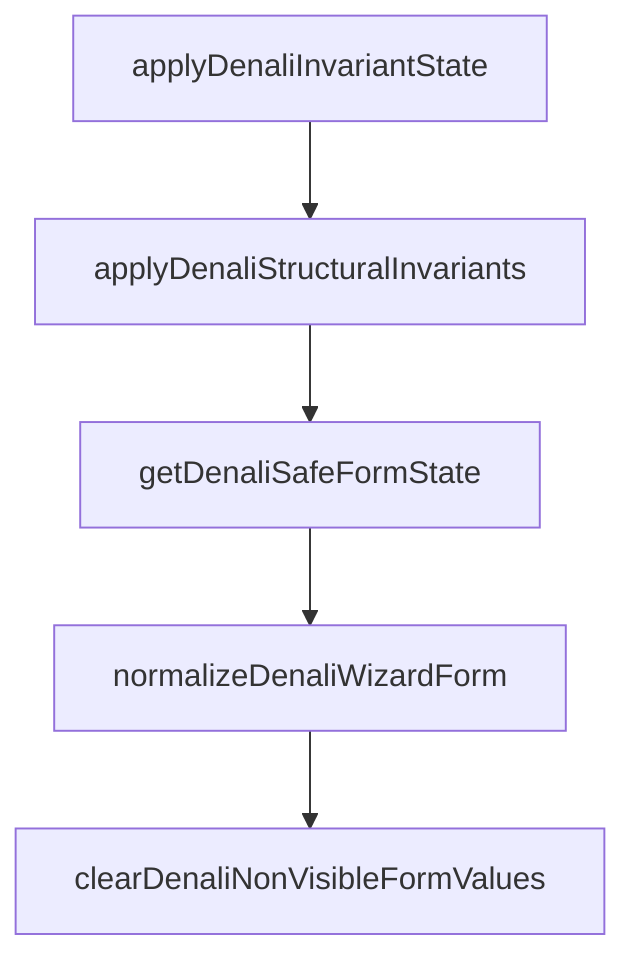

# Invariant Engine Shadow Logic Audit

**Generated:** 2026-05-25  
**Primary file:** [`apps/web/src/features/tours/wizard/denali/validation/denaliInvariantEngine.ts`](apps/web/src/features/tours/wizard/denali/validation/denaliInvariantEngine.ts)  
**Goal:** Map hardcoded structural invariants to registry metadata so the engine executes rules from the registry / RuleSet instead of per-field `if/else` blocks.

---

## Executive summary

| Layer | Count | Mechanism |
|-------|-------|-----------|
| Hardcoded structural rules (pre-refactor) | **10** (`INV-01`–`INV-10`) in `applyDenaliStructuralInvariants` | Hand-written branches |
| Registry-driven ghost clear (pass 2) | All canonical paths in rule model | `clearDenaliNonVisibleFormValues` + `isDenaliFieldVisibleInModel` |
| Movable via `structuralInvariant` on registry row | **6** (INV-01, 03–06, 08, 10) | `clearWhenNotVisible` / `defaultWhenVisible` |
| Movable via `contextualVisibility` only (duplicate of INV-03–06) | **4** transport fields | Already on rows; structural pass uses visibility API |
| Requires new global invariant | **2** (INV-07, INV-09) | `DENALI_GLOBAL_STRUCTURAL_INVARIANTS` |
| Requires `enforceValueWhenCategory` | **1** (INV-02) | Mountain sports insurance forced `true` |

**Implementation status:** Types, global invariants, row metadata, and registry-driven `applyDenaliStructuralInvariants` are in place. Hardcoded duplicate transport/altitude branches removed.

**Out of scope:** API workspace invariants in [`packages/shared-contracts/src/tours/workspaces/denali-invariants.ts`](packages/shared-contracts/src/tours/workspaces/denali-invariants.ts) (create-tour DTO validation, not wizard RHF form).

---

## Pipeline



| Pass | Function | Authority |
|------|----------|-----------|
| 1 | `applyDenaliStructuralInvariants` | Registry `structuralInvariant` + `DENALI_GLOBAL_STRUCTURAL_INVARIANTS` |
| 2 | `normalizeDenaliWizardForm` → `clearDenaliNonVisibleFormValues` | Generated `denaliRuleSet` (`field.hidden`) + `contextualVisibility` via `isDenaliFieldVisibleInModel` |

**Order matters:** structural enforce/default/sync runs **before** matrix/contextual leaf clearing ([`denaliGhostState.spec.ts`](apps/web/src/features/tours/wizard/denali/validation/denaliGhostState.spec.ts) relies on difficulty defaulting to `5` in pass 1, then outdoor fields cleared in pass 2).

---

## Inventory: `applyDenaliStructuralInvariants` (former hardcoded blocks)

Source citations from pre-migration engine (L34–111):

### INV-01 — Altitude clear

```typescript
if (!isDenaliAltitudeVisibleForCategory(basics?.category)) {
  next.programNature.altitudeMeasurement = undefined;
}
```

| Attribute | Value |
|-----------|--------|
| **Depends on** | `readDenaliCanonicalBasics(tourType).category` |
| **Matrix** | `altitude_mountain` / `altitude_hidden` on `program.altitudeMeasurement` |
| **Registry metadata** | `structuralInvariant: { kind: "clearWhenNotVisible" }` |
| **Note** | Redundant with pass 2 when field is `hidden` in model; kept in pass 1 for early purge |

### INV-02 — Sports insurance enforce (mountain)

```typescript
if (basics?.category === "mountain") {
  next.participantRequirements.sportsInsuranceRequired = true;
}
```

| Attribute | Value |
|-----------|--------|
| **Type** | **Enforce value** (not visibility) |
| **Matrix** | `mountain_participants` — field hidden off mountain cells |
| **Registry metadata** | `structuralInvariant: { kind: "enforceValueWhenCategory", category: "mountain", value: true }` |
| **Cannot be matrix tag alone** | Sets `true` even when user unchecked |

### INV-03 — Transport cost clear

```typescript
if (next.transport.transportMode === "none" || next.transport.transportMode === "shared_cars") {
  next.transport.transportCost = undefined;
}
```

| **contextualVisibility** | `transportOrganizedCostVisible` on `transport.transportCost` |
| **Registry metadata** | `clearWhenNotVisible` |

### INV-04 — Dong amount clear

Inverse of `transportDongVisible` (shared_cars OR organized + allowPersonalCar).

| **contextualVisibility** | `transportDongVisible` on `transport.dongAmount` |
| **Registry metadata** | `clearWhenNotVisible` |

### INV-05 — Allow personal car clear

```typescript
if (!isDenaliAllowPersonalCarVisible(next.transport.transportMode)) {
  next.transport.allowPersonalCar = undefined;
}
```

| **contextualVisibility** | `transportPersonalCarOptionVisible` |
| **Registry metadata** | `clearWhenNotVisible` |

### INV-06 — Admin capacity approval clear

Inverse of bus/minibus/train + allowPersonalCar.

| **contextualVisibility** | `transportAdminCapacityVisible` |
| **Registry metadata** | `clearWhenNotVisible` |

### INV-07 — Shared cars clears allowPersonalCar

```typescript
if (next.transport.transportMode === "shared_cars") {
  next.transport.allowPersonalCar = undefined;
}
```

| **Matrix / contextual** | Neither — cross-field mutual exclusion |
| **Global invariant** | `{ kind: "clearFieldWhenTransportMode", targetCanonical: "transport.allowPersonalCar", modes: ["shared_cars"] }` |

### INV-08 — Itinerary clear (single-day)

```typescript
if (!isMulti) {
  next.programNature.itinerary = undefined;
}
```

| **Matrix** | `itinerary_hidden` / `itinerary_visible` on `program.itinerary` |
| **Registry metadata** | `clearWhenNotVisible` |

### INV-09 — Itinerary row sync (multi-day)

```typescript
next.programNature.itinerary = syncDenaliItineraryRows(next.programNature.itinerary, dayCount);
```

| **Matrix** | Partial — visible only in multi-day cells |
| **Global invariant** | `{ kind: "syncProgramItineraryToDayCount" }` |
| **Cannot be tag** | Algorithmic row count from dates + tour kind |

### INV-10 — Difficulty default

```typescript
if (model != null && isDenaliFieldVisibleInModel(model, "program.difficultyLevel", next, ...) && next.programNature.difficultyLevel == null) {
  next.programNature.difficultyLevel = 5;
}
```

| **Matrix** | `outdoor_program` / `event_program_hidden` |
| **Registry metadata** | `structuralInvariant: { kind: "defaultWhenVisible", value: 5 }` |

---

## Map to registry engine

| ID | Matrix tag? | contextualRule? | structuralInvariant / global |
|----|-------------|-----------------|------------------------------|
| INV-01 | Yes | No | `clearWhenNotVisible` |
| INV-02 | Partial | No | `enforceValueWhenCategory` |
| INV-03 | No | Yes | `clearWhenNotVisible` |
| INV-04 | No | Yes | `clearWhenNotVisible` |
| INV-05 | No | Yes | `clearWhenNotVisible` |
| INV-06 | No | Yes | `clearWhenNotVisible` |
| INV-07 | No | No | Global `clearFieldWhenTransportMode` |
| INV-08 | Yes | No | `clearWhenNotVisible` |
| INV-09 | Partial | No | Global `syncProgramItineraryToDayCount` |
| INV-10 | Yes | No | `defaultWhenVisible` |

---

## Registry metadata (implemented)

### `DenaliStructuralInvariant` ([`DenaliFieldRegistry.types.ts`](apps/web/src/features/tours/wizard/denali/registry/DenaliFieldRegistry.types.ts))

```typescript
export type DenaliStructuralInvariant =
  | { readonly kind: "clearWhenNotVisible" }
  | { readonly kind: "defaultWhenVisible"; readonly value: unknown }
  | { readonly kind: "enforceValueWhenCategory"; readonly category: DenaliRuleModelCategory; readonly value: unknown };
```

### `DenaliGlobalStructuralInvariant`

```typescript
export type DenaliGlobalStructuralInvariant =
  | { readonly kind: "syncProgramItineraryToDayCount" }
  | { readonly kind: "clearFieldWhenTransportMode"; readonly targetCanonical: string; readonly modes: readonly string[] };
```

### Rows with `structuralInvariant`

| canonicalPath | structuralInvariant |
|---------------|---------------------|
| `program.altitudeMeasurement` | `clearWhenNotVisible` |
| `program.difficultyLevel` | `defaultWhenVisible: 5` |
| `program.itinerary` | `clearWhenNotVisible` |
| `transport.transportCost` | `clearWhenNotVisible` |
| `transport.allowPersonalCar` | `clearWhenNotVisible` |
| `transport.dongAmount` | `clearWhenNotVisible` |
| `transport.adminCapacityApproval` | `clearWhenNotVisible` |
| `participants.sportsInsuranceRequired` | `enforceValueWhenCategory: mountain, true` |
| `pricing.basePricePerPerson` | `clearWhenNotVisible` (pairs with `whenTruthy` → `pricing.requiresPayment`) |

---

## RuleSet consumer interface ([`denaliRuleModel.types.ts`](apps/web/src/features/tours/wizard/denali/rules/denaliRuleModel.types.ts))

```typescript
export type DenaliInvariantEngineUiOptions = {
  readonly mainThemeFormProfile?: TourFormProfile;
};

export interface DenaliInvariantEngineContext {
  readonly ruleSet: DenaliRuleSet;
  readonly model: DenaliRuleModel | null;
  readonly uiOptions?: DenaliInvariantEngineUiOptions;
}
```

Engine builds context via `resolveDenaliRuleModelFromForm` and loops registry definitions — **consumer of RuleSet + registry**, not ad-hoc field paths.

---

## Pass 2: already registry-driven (shadow logic outside engine file)

[`clearDenaliNonVisibleFormValues`](apps/web/src/features/tours/wizard/denali/validation/denaliRuleAccess.ts) (L190–228):

- Iterates `getHiddenFieldPathsFromModel(model)` (matrix `hidden`)
- Iterates `DENALI_WIZARD_CANONICAL_FIELD_PATHS` where `!isDenaliFieldVisibleInModel` (matrix + contextual)

Covers ghost tests: difficulty/hiking cleared on event switch; `basePricePerPerson` cleared when `requiresPayment` off (via `whenTruthy` contextual on pricing row).

---

## Risks and constraints

1. **INV-02 semantics:** Mountain tours always get `sportsInsuranceRequired = true` after invariant pass — preserve when migrating.
2. **Circular imports:** Engine imports `isDenaliFieldVisibleInModel` from `denaliUIAdapter`; do not duplicate transport predicates in engine.
3. **Async assets:** `clearWhenNotVisible` skips `isDenaliAsyncAssetCanonicalPath` paths (same as pass 2).
4. **INV-09 runs in global pass** after per-field structural rules so day count uses latest dates.

---

## Files touched

| File | Role |
|------|------|
| `denali/registry/DenaliFieldRegistry.types.ts` | `DenaliStructuralInvariant`, `DenaliGlobalStructuralInvariant` |
| `denali/registry/denaliGlobalStructuralInvariants.ts` | `DENALI_GLOBAL_STRUCTURAL_INVARIANTS` constant |
| `denali/registry/denaliFieldRegistryData.ts` | Row `structuralInvariant` metadata |
| `denali/rules/denaliRuleModel.types.ts` | `DenaliInvariantEngineContext` |
| `denali/validation/denaliInvariantEngine.ts` | Registry-driven structural apply |

---

*End of audit.*
