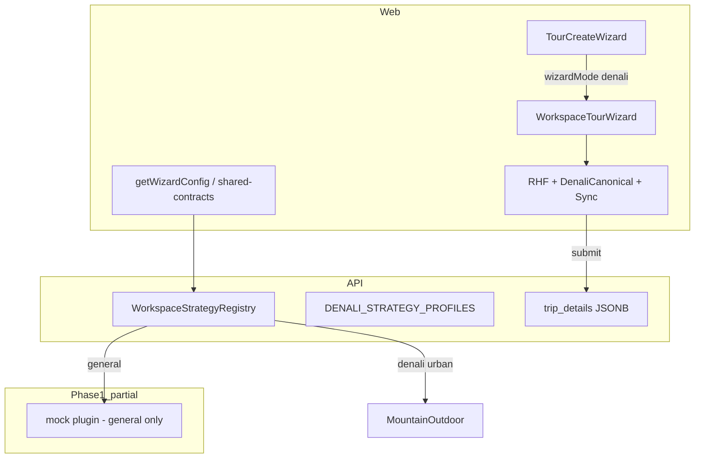
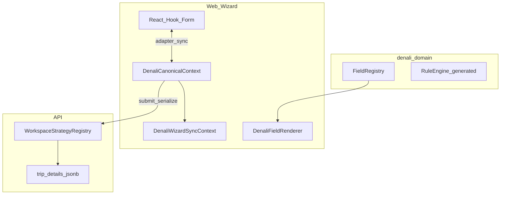

# گزارش‌های ممیزی Migration — Platform & Workspace

**Tour Ops — تجمیع دو گزارش ممیزی (فاز ۱ و فاز ۱+۲)**  
**تاریخ تهیه:** 2026-06-01  
**Branch مورد بررسی:** `main` · `gitSha`: `d4b8f07` (پس از merge فاز ۱)  
**منابع:** [`map.md`](map.md) · [`phase-0-platform-baseline.md`](phase-0-platform-baseline.md) · [`phase-1-platform-contract.md`](phase-1-platform-contract.md) · کد repo

---

# Phase 1 Stabilization Report

**تاریخ اجرا:** 2026-06-01  
**هدف:** merge کامل فاز ۱ روی `main`، اعتبارسنجی محلی، آماده‌سازی Phase 2.1 (بدون شروع Phase 2)

## Recovery

| منبع | نتیجه |
|------|--------|
| `stash@{0}` (`local-audit-baseline`) | فقط `audit-report.md`, `map_2.md`, baseline — **نه** آرتیفکت فاز ۱؛ اعمال نشد (تداخل `map_2.md`) |
| `stash@{1}` (`validation-temp-*`) | قدیمی؛ استفاده نشد |
| شاخه‌های محلی `feat/phase-1-*` | منبع اصلی — همهٔ فایل‌های فاز ۱ بازیابی و merge شدند |
| `/tmp/phase1-split-backup` | پشتیبان قبلی؛ merge از شاخه‌ها انجام شد |

## PR branches و merge

| Sub-phase | Branch | Commit (tip) | Merge به `main` |
|-----------|--------|--------------|-----------------|
| 1.1 | `feat/phase-1-1-workspace-sdk-scaffold` | `2910461` | ✅ (fast-forward زنجیره) |
| 1.2 | `feat/phase-1-2-workspace-sdk-contract` | `8449874` | ✅ |
| 1.3 | `feat/phase-1-3-api-workspace-bridge` | `0a8846e` | ✅ |
| 1.4 | `feat/phase-1-4-workspace-sdk-guards` | `5590e2b` | ✅ |
| 1.3c doc | (روی 1.4) | `d4b8f07` | ✅ tip `main` |

**روش merge:** `git checkout main && git merge feat/phase-1-4-workspace-sdk-guards` → fast-forward `099a806..d4b8f07`  
**Push:** `origin/main` → `d4b8f07` (2026-06-01)

### تأیید ساختار روی `main`

| بررسی | وضعیت |
|--------|--------|
| `git ls-files packages/workspace-sdk` | 14 فایل tracked |
| `apps/api` → `@repo/workspace-sdk` | ✅ `workspace:*` |
| `pnpm run phase-1:guard` در `package.json` | ✅ |
| `scripts/ci-integrity-check.sh` → `phase-1:guard` | ✅ |
| `dependency-cruiser` rule `workspace-sdk-denali-free` | ✅ |
| `verify-workspace-freeze.mjs` | ✅ |

## اعتبارسنجی محلی (`main` @ `d4b8f07`, Node 22)

| دستور | نتیجه | خلاصه |
|--------|--------|--------|
| `pnpm install` | **PASS** | lockfile هم‌تراز |
| `pnpm --filter @repo/workspace-sdk build` | **PASS** | tsc |
| `pnpm run phase-1:guard` | **PASS** | g1–g5 + depcruise؛ [`reports/phase-1-guard-2026-06-01.json`](reports/phase-1-guard-2026-06-01.json) |
| `pnpm run phase-0:verify-freeze` | **PASS** | 7 profiles @ `d4b8f07` |
| `pnpm run baseline:platform-metrics` | **PASS** | `packages/workspace-sdk` → **`missing: false`**, `denali_token_count: 0` |
| `pnpm run ci:integrity` | **PASS** | eslint + depcruise + test + phase-1:guard + query-key (~85s) |
| `pnpm run qa:tour-wizard-smoke` | **PASS** | 7/7 specs (~8s) |

**یادداشت:** اسکریپت رسمی smoke در `package.json` نام `qa:tour-wizard-smoke` است (نه `qa:smoke:tour-wizard`).

## GitHub Actions (`main` push `d4b8f07`)

| Workflow | Trigger on `main` push | وضعیت |
|----------|------------------------|--------|
| **integrity-gate** | ❌ فقط `pull_request` | اجرا نشد روی push؛ برای تأیید باید PR باز شود یا workflow به `push: main` گسترش یابد |
| **backend-e2e-tests** | ✅ | **FAIL** — [run 26758654808](https://github.com/hrokhbakhsh1991/docs/actions/runs/26758654808) |
| architecture-guardrails | ✅ | **FAIL** — [run 26758654516](https://github.com/hrokhbakhsh1991/docs/actions/runs/26758654516) |

سایر checkهای وابسته به commit (tenant-isolation، tour-rbac-parity، finance-boundary، …): چند مورد **FAIL** روی همان SHA (مستقل از gate محلی `ci:integrity`).

## وضعیت نهایی آمادگی

| معیار | وضعیت |
|--------|--------|
| Phase 1 code روی `main` | ✅ |
| Guardهای فاز ۱ در pipeline محلی (`ci:integrity`) | ✅ |
| SDK partial bridge (`general` only؛ 1.3c → Phase 2) | ✅ مستند ([`d4b8f07`](https://github.com/hrokhbakhsh1991/docs/commit/d4b8f07)) |
| Production-stable محلی (gate + smoke) | ✅ |
| GitHub `integrity-gate` + `backend-e2e` سبز | ❌ (e2e fail؛ integrity-gate روی push اجرا نشد) |
| **آماده شروع Phase 2.1** | **بله — کد و guard محلی** · **خیر — تا سبز شدن CI از راه دور (حداقل backend-e2e)** |

**Phase 2 شروع نشد** — فقط merge و تثبیت فاز ۱.

---

## فهرست

0. [Phase 1 Stabilization Report](#phase-1-stabilization-report)
1. [گزارش اول — ممیزی تکمیل فاز ۱ (phase-1-platform-contract)](#گزارش-اول--ممیزی-تکمیل-فاز-۱-phase-1-platform-contract)
2. [گزارش دوم — ممیزی فاز ۱ و ۲ (workspace-agnostic + plugin backend)](#گزارش-دوم--ممیزی-فاز-۱-و-۲-workspace-agnostic--plugin-backend)
3. [فهرست یکپارچه ریسک‌ها (R1–R12 + موارد گزارش اول)](#فهرست-یکپارچه-ریسک‌ها)
4. [اقدامات پیشنهادی قبل از Phase 3+](#اقدامات-پیشنهادی-قبل از-phase-3)

---

# گزارش اول — ممیزی تکمیل فاز ۱ (phase-1-platform-contract)

این بخش [`phase-1-platform-contract.md`](phase-1-platform-contract.md) را در برابر exit criteria سند، گزارش‌های `reports/` و وضعیت واقعی repo بررسی می‌کند.

---

## ۱.۱ جمع‌بندی یک خط (گزارش اول)

| زیرفاز | وضعیت در سند | واقعیت |
|--------|-------------|--------|
| **0.1–0.4** | تکمیل | ✅ انجام شده |
| **ورود Phase 1.1** (§8.1) | تقریباً آماده | **یک تیک باز** + Phase 1 هنوز merge/CI رسمی ندارد |
| **Phase 1.1–1.4** | در سند «تکمیل محلی» | کد هست؛ PR/CI/smoke پس از bridge باز |

**فاز صفر** از نظر exit criteria اصلی (0.1–0.4) **انجام شده**؛ باقی‌مانده‌ها **ناهماهنگی سند**، **پوشش تست ناقص نسبت به متن**، و **کارهای فاز بعدی/فرآیندی** است.

---

## ۱.۲ انجام‌شده (مطابق تیک‌های سند فاز ۱)

### زیرفاز 0.1–0.4 (پیش‌نیاز فاز ۱)

| مورد | وضعیت |
|------|--------|
| `map.md`، `phase-0-platform-baseline.md`، PR template `Phase: N.M` | ✅ |
| `reports/phase-0-baseline-2026-06-01.json` | ✅ |
| `reports/phase-0-ci-gate-2026-06-01.json` — `ci:integrity` + web build + smoke 7/7 | ✅ (JSON؛ MD gate هم‌تراز شده) |
| `reports/phase-0-workspace-freeze.json` + `pnpm run phase-0:verify-freeze` | ✅ |
| `baseline-metrics.mjs`، `phase-0-ci-gate.mjs`، `phase-0:verify-freeze` | ✅ |

### زیرفاز 1.1 — Scaffold

| معیار | وضعیت |
|--------|--------|
| `packages/workspace-sdk` + `package.json` / `tsconfig` | ✅ |
| `pnpm --filter @repo/workspace-sdk build` | ✅ |
| `pnpm --filter @repo/workspace-sdk test` | ✅ |
| `rg -i denali packages/workspace-sdk/src` → 0 | ✅ |
| `rg '@repo/denali-domain'` / `@repo/types/denali` در SDK → 0 | ✅ |
| در `pnpm-workspace.yaml` (`packages/*`) | ✅ |

### زیرفاز 1.2 — Contract types

| Type / خروجی | وضعیت |
|--------------|--------|
| `WorkspacePlugin`, `WorkspacePluginId`, `WorkspaceFieldRegistry`, `WorkspaceFieldRegistryEntry`, `WorkspaceRuleSet`, `WorkspaceRuleCell`, `WorkspaceRuleFieldOverride` | ✅ |
| `WorkspaceWizardSurface`, `WorkspaceWizardMode` (`classic` \| `schema`) | ✅ |
| `WorkspaceValidationHooks`, `WorkspaceViolation`, `noopWorkspaceValidationHooks` | ✅ |
| `WorkspaceLifecycleContract`, `WorkspaceLifecycleTransition` | ✅ |
| `CanonicalDocument`, `createCanonicalDocument`, `assertCanonicalDocumentRoots`, `CanonicalDocumentValidationError` | ✅ |
| `WorkspaceProfileBinding`, `DEFAULT_WORKSPACE_PROFILE_BINDINGS`, `resolveWorkspacePluginIdForProfile` | ✅ |
| `mockWorkspacePlugin` | ✅ |
| تست‌ها | ✅ ۷ case در `mock-workspace.plugin.spec.ts` |
| بدون import `denali-domain` / `types/denali` | ✅ |
| JSDoc روی `WorkspacePlugin` و `CanonicalDocument` | ✅ |

**ساختار فایل‌های SDK:**

```text
packages/workspace-sdk/
  package.json
  tsconfig.json
  src/
    index.ts
    canonical/canonical-document.ts
    plugin/workspace-plugin.ts
    plugin/workspace-plugin-id.ts
    plugin/workspace-wizard-surface.ts
    plugin/workspace-validation.ts
    plugin/workspace-lifecycle.ts
    plugin/workspace-profile-binding.ts
    registry/field-registry.ts
    registry/rule-set.ts
    mock/mock-workspace.plugin.ts
    mock-workspace.plugin.spec.ts
```

**توجه:** سند §4.2 پوشه `__tests__/` پیشنهاد می‌دهد؛ واقعیت: spec در `src/mock-workspace.plugin.spec.ts`.

### زیرفاز 1.3 — Bridge API

| معیار | وضعیت |
|--------|--------|
| `@repo/workspace-sdk` در `apps/api/package.json` | ✅ |
| `SdkWorkspaceStrategyAdapter` | ✅ |
| `resolveWorkspacePluginForProfile` / `workspace-plugin.resolver.ts` | ✅ |
| `buildWorkspacePluginViewFromStrategy` / `legacy-workspace-plugin.view.ts` | ✅ (1.3b) |
| `general` → mock plugin + delegate به `GeneralWorkspaceStrategy` | ✅ (1.3a) |
| `denali_pilot` / `urban_event` → `MountainOutdoorWorkspaceStrategy` | ✅ (بدون تغییر رفتار) |
| `workspace.strategy.registry.spec.ts` | ✅ 11/11 |
| `pnpm --filter @apps/api run lint` (tsc) | ✅ |

**فایل‌های API اضافه/تغییر یافته:**

- `apps/api/src/modules/tours/strategies/sdk.workspace.strategy.adapter.ts`
- `apps/api/src/modules/tours/strategies/workspace-plugin.resolver.ts`
- `apps/api/src/modules/tours/strategies/legacy-workspace-plugin.view.ts`
- `apps/api/src/modules/tours/strategies/workspace.strategy.registry.ts` (تغییر)

### زیرفاز 1.4 — Guardrails

| معیار | وضعیت |
|--------|--------|
| `scripts/platform-transformation/phase-1-guard.mjs` | ✅ |
| `pnpm run phase-1:guard` | ✅ — [`reports/phase-1-guard-2026-06-01.json`](reports/phase-1-guard-2026-06-01.json) `exit14.pass: true` |
| rule `workspace-sdk-denali-free` در `dependency-cruiser.config.js` | ✅ |
| `phase-1:guard` در `scripts/ci-integrity-check.sh` | ✅ |
| `@repo/workspace-sdk` در root `pnpm test` | ✅ |

**چک‌های guard (G1–G5):**

| ID | شرح |
|----|-----|
| g1 | `rg -i denali` در `packages/workspace-sdk/src` → 0 |
| g2 | بدون `@repo/denali-domain` |
| g3 | بدون `@repo/types/denali` |
| g5b | build SDK |
| g5 | test SDK |
| g4 | depcruise `packages/workspace-sdk` |

---

## ۱.۳ انجام‌نشده یا ناقص (گزارش اول)

### A) فرآیند / merge

| مورد | § سند |
|------|--------|
| PR `Phase: 1.1` merge | §4.5 |
| PR `Phase: 1.2` merge | §5.6 |
| PR `Phase: 1.3` merge | §6.5 |
| PR `Phase: 1.4` merge روی `main` | §7.5 |
| چک‌لیست §2.1 (جدول خالی — تأیید دستی merge نقشه، smoke، CI) | §2.1 |
| §8.1: `hotspot list §3.5 بدون تغییر scope در همان PR` | هنوز `[ ]` |

بدون merge روی `main`، پیوست A («در main با guard سبز») رسماً بسته نیست.

### B) تأیید CI / smoke بعد از 1.3

| مورد | وضعیت |
|------|--------|
| `pnpm run ci:integrity` پس از bridge | ❌ ثبت/اجرای تأیید نشده در exit 1.3 |
| `pnpm run qa:smoke:tour-wizard` پس از bridge | ❌ همان |
| `pnpm --filter @apps/api test` (کل suite) | ⚠️ فقط `workspace.strategy.registry.spec.ts` + lint |

### C) مراحل 1.3 عمداً ناتمام (در سند «مرحله‌ای» آمده)

| مرحله | خواسته سند | واقعیت |
|--------|------------|--------|
| **1.3c** | همه پروفایل‌ها از registry یکسان؛ حذف شاخه legacy | ❌ فقط `general` از SDK |
| Bridge برای **همه** profiles | پیوست A | ⚠️ **gap مستند:** فقط `general` binding |

### D) §4.4 و زیرساخت monorepo

| مورد | وضعیت |
|------|--------|
| تیک §4.4 (ثبت monorepo) | ⚠️ در سند هنوز `[ ]` — عملاً workspace پوشش دارد |
| `workspace-sdk` در root `pnpm build` | ❌ نیست (فقط در `test` + guard) |
| `turbo.json` | ❌ وجود ندارد — N/A |

### E) §7.4 — regression baseline

| مورد | وضعیت |
|------|--------|
| automation diff `baseline:platform-metrics` در PR | ❌ پیاده نشده |
| گزارش تازه با `workspace-sdk` واقعی | ❌ [`phase-0-baseline-2026-06-01.json`](reports/phase-0-baseline-2026-06-01.json) هنوز `"packages/workspace-sdk": { "missing": true }` |

اسکریپت `baseline-metrics.mjs` از قبل `workspace-sdk` را در LAYERS دارد؛ فقط **re-run + commit** نشده.

### F) پیوست A — ورود Phase 2.1 (همه `[ ]` در سند)

| # | شرط | واقعیت |
|---|------|--------|
| 1 | SDK در `main` + guard | ⚠️ کد هست؛ merge؟ |
| 2 | mock tests ≥ 5 | ✅ (۷ تست) |
| 3 | bridge همه profiles یا gap | ⚠️ gap (فقط `general`) |
| 4 | baseline metrics تازه | ❌ |
| 5 | `phase-0:verify-freeze` | ✅ (قابل اجرا) |
| 6 | smoke 7/7 | ❌ تأیید نشده پس از 1.3 |

### G) طراحی §8 / پیوست D که در 1.2 ذکر شده ولی پیاده نشده

| مورد | § سند |
|------|--------|
| `stripPolicy` روی plugin | پیوست D — «extension 1.2+» |
| `WorkspacePluginRegistry` در API | فاز 2.3 |
| کلاس `LegacyStrategyWorkspacePluginAdapter` با همان نام سند | نام واقعی: `buildWorkspacePluginViewFromStrategy` |

### H) آنچه در فاز ۱ نباید انجام شود — درست رعایت شده (§10)

- جابجایی `denali-domain` ❌ نشده ✅  
- حذف `DENALI_STRATEGY_PROFILES` ❌ نشده ✅  
- تغییر web wizard / DB / پروفایل هشتم ❌ نشده ✅  

---

## ۱.۴ ناهماهنگی سند ↔ repo (گزارش اول)

| محل | مشکل |
|-----|------|
| §6.3 (قدیمی) | subset smoke با 12,04,10 vs سوئیت رسمی 01,02,04,05,07,08,10 — **اصلاح شده در سند** |
| §6.5 (قدیمی) | «smoke regression / follow-up» — **اصلاح شده** |
| `reports/phase-0-ci-gate-2026-06-01.md` | قبلاً با JSON در تناقض بود — **اصلاح شده** |
| `map.md` ردیف 0.3 | قبلاً «smoke follow-up» — **اصلاح شده** |
| پیوست C (قدیمی) | مسیر `apps/web/tests/smoke/` — **اصلاح به `src/features/tours/__tests__/smoke/`** |
| هدر سند (قدیمی) | `commit 6a37145` — **به گزارش‌های baseline تغییر کرد** |
| §7.2 | «۶ تب» vs ۷ step — **اصلاح به ۷ step rail** |
| §4.4 | تیک `[ ]` در حالی که پکیج وجود دارد |
| پیوست A | همه باز — با هدر «فاز ۱ تکمیل» قاطی می‌شود |
| §4.2 vs واقعیت | `__tests__/` vs `mock-workspace.plugin.spec.ts` |

---

## ۱.۵ ماتریس نهایی زیرفازها (گزارش اول)

| زیرفاز | کد | تست محلی | guard/CI wiring | PR merge | توصیه قبل از 2.1 |
|--------|-----|----------|-----------------|----------|------------------|
| **1.1** | ✅ | ✅ | — | ❌ | — |
| **1.2** | ✅ | ✅ | — | ❌ | — |
| **1.3** | ✅ (a+b) | ✅ registry | ⚠️ smoke/ci | ❌ | `ci:integrity` + smoke |
| **1.4** | ✅ | ✅ guard | ✅ در `ci-integrity` | ❌ | — |
| **1.3c** | ❌ | — | — | — | Phase 2 یا PR جدا |

---

## ۱.۶ دستورات نگهداری (گزارش اول)

```bash
# فاز ۰
pnpm run baseline:platform-metrics
pnpm run phase-0:ci-gate
pnpm run qa:smoke:tour-wizard
pnpm run phase-0:verify-freeze

# فاز ۱
pnpm --filter @repo/workspace-sdk build
pnpm --filter @repo/workspace-sdk test
pnpm run phase-1:guard
```

---

## ۱.۷ پیشنهاد بستن رسمی فاز ۱ (گزارش اول)

```bash
pnpm run phase-1:guard
pnpm run phase-0:verify-freeze
pnpm run baseline:platform-metrics
pnpm run ci:integrity
pnpm run qa:smoke:tour-wizard
```

سپس: PR(های) `Phase: 1.1` … `1.4` یا یک PR تجمیعی + به‌روزرسانی تیک‌های §4.4، §6.5، §7.5 و پیوست A.

**خلاصه گزارش اول:** از نظر **قرارداد SDK + mock + adapter `general` + guard** فاز ۱ در workspace محلی انجام شده؛ **merge، smoke/ci پس از bridge، baseline JSON تازه، 1.3c، و ورود رسمی Phase 2.1 (پیوست A)** هنوز باز است.

---

# گزارش دوم — ممیزی فاز ۱ و ۲ (workspace-agnostic + plugin backend)

این بخش Scope کامل migration، Frontend، Backend، Database، نقاط پرریسک، کم‌کاری‌ها، integration FE↔BE و تأیید نهایی را پوشش می‌دهد — با هدف **عدم surprise در rollout Phase 3+**.

---

## ۲.۱ حکم کلی (گزارش دوم)

| فاز | وضعیت واقعی در کد | قابل اعتماد برای Phase 3+؟ |
|-----|-------------------|---------------------------|
| **فاز ۱** (Contract) | **جزئی — محلی** (`@repo/workspace-sdk` + bridge فقط `general`) | 🟡 فقط به‌عنوان پایه contract |
| **فاز ۲** (Denali isolation) | **شروع نشده** | 🔴 خیر |

### نکته مهم درباره Scope Frontend

در [`map.md`](map.md):

- **فاز ۱** = contract TypeScript — **بدون** جابجایی Denali  
- **فاز ۲** = `packages/workspaces/denali` + API loader — **بدون** حذف Denali از UI  
- **فاز ۲.۵** = `WorkspacePluginProvider` در web — **هنوز legacy render path**  
- **فاز ۳** = `platform-core` + renderer — workspace-agnostic wizard path  

اگر انتظار دارید `WorkspaceTourWizard` / `DenaliFieldRenderer` تا پایان فاز ۲ agnostic شده باشند، با **نقشه رسمی هم‌خوان نیست** — و در **کد** هم چنین نشده است.

---

## ۲.۲ تکمیل Scope — فاز ۱ (طبق نقشه)

| مورد Scope | وضعیت | شواهد |
|------------|--------|--------|
| پکیج `@repo/workspace-sdk` denali-free | ✅ | `packages/workspace-sdk/`، `phase-1-guard` PASS |
| `WorkspacePlugin`, `CanonicalDocument`, mock | ✅ | export + ۷ تست |
| Bridge `IWorkspaceStrategy` | 🟡 **جزئی** | فقط `general` → `SdkWorkspaceStrategyAdapter` |
| Bridge همه profiles | ❌ | `denali_pilot`/`urban_event` → `MountainOutdoorWorkspaceStrategy` |
| `WorkspacePluginRegistry` در API | ❌ (فاز ۲.۳) | وجود ندارد |
| PR merge + ci/smoke پس از bridge | ⚠️ | ثبت نشده |
| baseline با layer `workspace-sdk` | ❌ | گزارش ۰.۲ قدیمی |

**فاز ۱:** contract و guard **هست**؛ **کامل merge‌شده با CI/smoke تأیید نشده**.

---

## ۲.۳ تکمیل Scope — فاز ۲ (طبق نقشه)

| Sub-phase | خواسته | وضعیت |
|-----------|--------|--------|
| **2.1** `packages/workspaces/denali` + `denaliPlugin: WorkspacePlugin` | ❌ | `packages/workspaces/` **وجود ندارد** |
| **2.2** move `denali-domain` → `workspaces/denali/domain`؛ shim | ❌ | هنوز `packages/denali-domain/` |
| **2.3** API `WorkspacePluginRegistry` + shadow validation | ❌ | فقط `WorkspaceStrategyRegistry` |
| **2.4** حذف `DENALI_STRATEGY_PROFILES` از API core | ❌ | هنوز در `workspace.strategy.registry.ts` |
| **2.5** Web `WorkspacePluginProvider` | ❌ | وجود ندارد |

**DoD فاز ۲ (map):** plugin implements contract · API loader · `workspace-sdk` بدون denali  
→ فقط آخرین بند (SDK denali-free) برقرار است؛ **دو بند اول 🔴 نیست**.

---

## ۲.۴ Frontend — بررسی کامل

### `WorkspaceTourWizard.tsx`

| معیار | وضعیت |
|--------|--------|
| workspace-agnostic | 🔴 **خیر — Denali-first** |
| وابستگی‌ها | `useDenaliTourWizardCreate`, `DenaliCanonicalProvider`, `DenaliWizardSyncProvider`, `createDenaliCanonicalWizardResolver`, `buildDenaliTourCreateDefaultValues`, `@repo/denali-domain`, `createDenaliDraftAdapter`, … |
| مسیر فایل | `apps/web/src/components/tours/wizard/WorkspaceTourWizard.tsx` |

**نتیجه:** نام «Workspace» دارد ولی **پیاده‌سازی = ویزارد Denali کامل**؛ فاز ۳+ باید این را جدا یا refactor کند.

### `TourCreateWizard.tsx` (orchestrator)

| معیار | وضعیت |
|--------|--------|
| `getWizardConfig(profile).wizardMode === "denali"` | → `WorkspaceTourWizard` |
| classic profiles | → `data-testid="wizard-classic-shell-unavailable"` (پیام retirement) |
| template validation | `validateWorkspaceTemplateAtWizardLoad`, `DataLegacyError` |

### `DenaliFieldRenderer.tsx`

| معیار | وضعیت |
|--------|--------|
| workspace-agnostic | 🔴 **خیر** |
| وابستگی | `DenaliFieldRegistryEntry` از `@repo/denali-domain` |
| مسیر | `apps/web/src/features/tours/denali/fields/DenaliFieldRenderer.tsx` |

### Composites (bypass renderer — baseline فاز ۰)

لیست ثابت از `phase-0-platform-baseline.md` §3.5:

- `apps/web/src/features/tours/denali/widgets/DenaliProgramContentSection.tsx`
- `apps/web/src/features/tours/denali/widgets/DenaliPricingParticipantSection.tsx`
- `apps/web/src/features/tours/denali/widgets/DenaliDailyItinerarySection.tsx`
- `apps/web/src/features/tours/wizard/denali/steps/DenaliProgramContentSection.tsx` (re-export)
- `apps/web/src/features/tours/wizard/denali/steps/DenaliPricingParticipantSection.tsx`
- `apps/web/src/features/tours/wizard/denali/steps/DenaliDailyItinerarySection.tsx`
- `apps/web/src/features/tours/wizard/DenaliTourCreationPresetBanner.tsx`

**از طریق `denaliZodKindComponents.tsx`:** مثلاً `DenaliProgramContentSection` به‌عنوان component برای kind خاص.

### Web config — hardcoded

`apps/web/src/features/tours/wizard/workspace-wizard.config.ts`:

```typescript
export const DENALI_WIZARD_PROFILES = ["denali_pilot", "urban_event"] as const;
// wizardMode از getTourWorkspaceDefinition → shared-contracts
```

| پروفایل | `wizardMode` (web/API) |
|---------|-------------------------|
| `denali_pilot` | `denali` |
| `urban_event` | `denali` |
| `general`, `mountain_outdoor`, … | `classic` (معمولاً) |
| `nature_trip` | classic + `ARCTIC_WORKSPACE` در shared-contracts |

### وضعیت renderer (baseline — بدون بهبود در ۱–۲)

| بعد | تخمین (فاز ۰) |
|-----|----------------|
| Registry-placed fields | ~85–90% |
| Renderer-unified | ~60% |
| Single canonical SoT | خیر (dual state) |
| Workspace-agnostic core | خیر |

---

## ۲.۵ Backend API — بررسی کامل

### `workspace.strategy.registry.ts` (وضعیت فعلی)

```typescript
export const DENALI_STRATEGY_PROFILES = ["denali_pilot", "urban_event"] as const;

export function usesDenaliCanonicalTemplate(profile: TourFormProfile): boolean {
  return profile === "denali_pilot";
}

export class WorkspaceStrategyRegistry {
  static resolve(profile: TourFormProfile): IWorkspaceStrategy {
    if (isDenaliStrategyProfile(profile)) {
      return new MountainOutdoorWorkspaceStrategy(profile);
    }
    const legacy = new GeneralWorkspaceStrategy(profile);
    const plugin = resolveWorkspacePluginForProfile(profile);
    if (plugin != null) {
      return new SdkWorkspaceStrategyAdapter(profile, plugin, legacy);
    }
    return legacy;
  }
}
```

### نگاشت پروفایل → strategy / workspace

| `TourFormProfile` | Strategy class | SDK plugin | `TourWorkspaceDefinition` |
|-------------------|----------------|------------|---------------------------|
| `general` | `SdkWorkspaceStrategyAdapter` → legacy | `mock` | — |
| `mountain_outdoor` | `GeneralWorkspaceStrategy` | — | — |
| `nature_trip` | `GeneralWorkspaceStrategy` | — | `ARCTIC_WORKSPACE` |
| `cinema_event` | `GeneralWorkspaceStrategy` | — | — |
| `cultural_tour` | `GeneralWorkspaceStrategy` | — | — |
| `urban_event` | `MountainOutdoorWorkspaceStrategy` | — | `DENALI_WORKSPACE` (shared) |
| `denali_pilot` | `MountainOutdoorWorkspaceStrategy` | — | `DENALI_WORKSPACE` |

**تفاوت حیاتی urban vs denali (همان workspace definition):**

- `denali_pilot`: `appliesWorkspaceTripDetailsValidation` true، phase `before_canonical`، geo publish check  
- `urban_event`: trip validation خاموش، `workspaceTripDetailsValidationPhase: never`، بدون geo publish  

### `IWorkspaceStrategy` (قرارداد de facto)

مسیر: `apps/api/src/modules/tours/strategies/workspace.strategy.interface.ts`

- `getValidationRules()`, `getPublishPolicy()`, `getFieldStripRules()`, `getWizardConfig()`, `getRequiredSubmitFields()`

### SDK binding (فقط general)

`packages/workspace-sdk/src/plugin/workspace-profile-binding.ts`:

```typescript
export const DEFAULT_WORKSPACE_PROFILE_BINDINGS = [
  { profile: "general", pluginId: MOCK_WORKSPACE_PLUGIN_ID },
];
```

### Consumers مهم API

- `assert-profile-required-fields-for-submit.ts` → `WorkspaceStrategyRegistry.resolve`
- `workspace.strategy.builders.ts` — هنوز `profile === "denali_pilot"` برای validation phase
- `create-tour-form-profile-strip.ts` — Denali strip helpers
- E2E: `apps/api/test/e2e/tours-create.e2e-spec.ts` — `denali_pilot`

**نتیجه Backend:** mapping **کار می‌کند** ولی **Denali-coupled**؛ bypassهای ثابت هنوز در core هستند.

---

## ۲.۶ Database — فاز ۱–۲ (نه Phase 5)

### انتظار نقشه

- فاز ۵: `workspace_type`, `canonical_data` JSONB روی tours  
- فاز ۱–۲: **نباید** cutover نیمه‌کاره روی `tours`

### `TourEntity` (وضعیت فعلی)

مسیر: `apps/api/src/modules/tours/entities/tour.entity.ts`

| ستون / مفهوم | وجود |
|--------------|------|
| `form_profile_snapshot` | ✅ |
| `trip_details` (jsonb در `TourDetails`) | ✅ |
| `starts_on`, `ends_on`, `currency_code`, … | ✅ projected |
| `workspace_type` | ❌ |
| `canonical_data` (tour-level) | ❌ |

### Template / preset layer

| entity / script | `canonical_data` |
|-----------------|------------------|
| `workspace-tour-creation-preset` | ✅ jsonb |
| migration/audit scripts | `migrate-template-canonical-data.ts`, `audit-template-canonical-ghost-fields.ts`, … |

### ریسک داده (منطقی، نه schema bug فاز ۱–۲)

- **urban** و **denali** هر دو از `DENALI_WORKSPACE` در `packages/shared-contracts/src/tours/workspace-registry.ts` استفاده می‌کنند  
- داده production در `trip_details` شکل **غنی Denali** دارد  
- بدون ستون generic تا فاز ۵ — **طبق نقشه درست**، ولی **Surprise** اگر تیم فکر کند DB در فاز ۲ «آماده generic» است  

---

## ۲.۷ نقاط پرریسک / شک‌آور (گزارش دوم)

### 🔴 بحرانی

| ID | موضوع |
|----|--------|
| **R1** | فاز ۲ اصلاً شروع نشده — `packages/workspaces/denali` missing |
| **R2** | `WorkspaceTourWizard` / `DenaliFieldRenderer` همچنان Denali-locked |
| **R3** | `DENALI_STRATEGY_PROFILES`, `usesDenaliCanonicalTemplate`, hardcoded branches |
| **R4** | Dual state: `DenaliCanonicalContext` + RHF + `DenaliWizardSyncContext` |
| **R5** | `urban_event` + `denali_pilot` share `DENALI_WORKSPACE` با validation متفاوت — assumption زیاد |

### 🟡 مشکوک / پیچیده

| ID | موضوع |
|----|--------|
| **R6** | `SdkWorkspaceStrategyAdapter` فقط `general` — دو مسیر در registry |
| **R7** | `buildWorkspacePluginViewFromStrategy` — فقط تست؛ production استفاده نمی‌کند |
| **R8** | Composites bypass renderer؛ ghost fields در template vs wizard UI |
| **R9** | Classic wizard → `wizard-classic-shell-unavailable` |
| **R10** | مستندات فاز ۱ ✅ vs merge/CI/smoke باز |
| **R11** | baseline JSON قدیمی برای `workspace-sdk` layer |

### 🟢 کم‌خطر (در محدوده فاز ۱ contract)

| ID | موضوع |
|----|--------|
| **R12** | SDK `phase-1-guard` — denali-free بودن پکیج contract |
| — | عدم cutover زودهنگام `tours.canonical_data` (هم‌راستا با نقشه) |
| — | `WorkspaceStrategyRegistry` unit tests 11/11 |

---

## ۲.۸ مچ‌گیری کم‌کاری‌ها (legacy / bypass / نیمه‌کاره)

| محل | باید (طبق نقشه تا فاز ۲) | واقعیت | خطر فاز بعد |
|-----|--------------------------|--------|-------------|
| `packages/workspaces/denali` | وجود | ❌ | 3+ |
| `denali-domain` جابجایی | 2.2 | ❌ | coupling |
| `DENALI_STRATEGY_PROFILES` حذف | 2.4 | ❌ | core Denali-named |
| `shared-contracts/.../denali.ts` | → plugin | ❌ | validation مشترک |
| `types/src/denali` | → plugin + shim | ❌ | wire types |
| `WorkspacePluginProvider` web | 2.5 | ❌ | FE همیشه Denali |
| Renderer agnostic | فاز ۳ | ❌ | composites |
| API bridge همه profiles | 1.3c / ۲ | ❌ | فقط `general` |
| `WorkspacePluginRegistry` | 2.3 | ❌ | loader |
| shadow validation plugins | 2.3 | ❌ | — |
| `packages/platform-core` | ۳ | ❌ | — |
| baseline JSON refresh | پس از ۱ | ❌ | regression |
| PR 1.1–1.4 merge | process | ❌ | reproducibility |
| Draft FSM Phase 0 (سند جدا) | `docs/phase0-safety-net-baseline.md` | spec 12 extend نشده | draft retry |

### Hardcoded values (نمونه در کد)

- `DENALI_WIZARD_PROFILES`, `DENALI_STRATEGY_PROFILES`
- `usesDenaliCanonicalTemplate` → only `denali_pilot`
- `apps/web/src/features/tours/edit/updateTourDtoFromDenaliWizardForm.ts` — default `denali_pilot`
- `MountainOutdoorWorkspaceStrategy` برای urban + denali
- `shared-contracts` → `TOUR_WORKSPACE_DEFINITIONS`: `urban_event: DENALI_WORKSPACE`

---

## ۲.۹ Integration FE ↔ BE

### نمودار جریان



### نقاط اتصال با regression محتمل

| نقطه | ریسک |
|------|------|
| Tenant template `base_profile` → shell | mismatch / `DataLegacyError` |
| `POST .../tour-wizard-template/instantiate` | mock در smoke؛ env production متفاوت |
| Hydration template → canonical + RHF | timing / `finalizeDenaliWizardHydration` |
| Submit: canonical projection → API DTO | `buildDenaliCreateTourPayloadProjection` |
| Publish: geo zones | فقط `denali_pilot` |
| Draft: `createDenaliDraftAdapter` | restore/retry — track جدا Draft FSM |
| `mix-demo` profile flip | smoke 08؛ coupling |
| `PLAYWRIGHT_SMOKE` host bypass | تست ≠ همه deploymentها |
| Port `PW_SMOKE_PORT` / 3010 | CI gate |

### جریان داده dual state (فاز ۰ baseline — هنوز برقرار)



---

## ۲.۱۰ تأیید نهایی (گزارش دوم)

### آیا Phase 1 کامل و قابل اعتماد است؟

| معیار | تأیید؟ |
|--------|---------|
| Contract SDK + mock + guard | 🟡 بله **در workspace محلی** |
| Bridge معنادار برای Denali/urban production | 🔴 **خیر** |
| آماده Phase 3 بدون surprise | 🔴 **خیر** |
| **جمع‌بندی** | **ناقص — اسکلت contract؛ نه migration انجام‌شده** |

### آیا Phase 2 کامل و قابل اعتماد است؟

| معیار | تأیید؟ |
|--------|---------|
| 2.1 – 2.5 | 🔴 **خیر — انجام نشده** |
| **جمع‌بندی** | **شروع نشده** |

### Frontend / DB (درخواست صریح audit)

| معیار | تأیید؟ |
|--------|---------|
| FE workspace-agnostic | 🔴 **خیر** (و طبق نقشه تا 2.5/3 لازم نبوده) |
| BE بدون bypass Denali در core | 🔴 **خیر** |
| DB آماده generic tour SoT | 🔴 **خیر** (فاز ۵) |

### پاسخ مستقیم

**خیر — نمی‌توان تأیید کرد که Phase 1 و 2 کامل و قابل اعتماد هستند** برای rollout Phase 3+ بدون surprise.

- **Phase 1:** contract + guard **جزئی** (محلی).  
- **Phase 2:** **صفر** در کد.  
- **FE/Renderer:** Denali-first.  
- **BE:** constants و strategy map Denali-coupled.  

---

## ۲.۱۱ کار انجام‌شده در جلسات پیاده‌سازی (مرجع تاریخچه)

برای شفافیت «چه چیزی واقعاً ساخته شده» (حتی اگر merge نشده):

| تاریخ تقریبی | کار |
|--------------|-----|
| 2026-06-01 | فاز ۰: docs، baseline، ci-gate، verify-freeze، smoke fixes |
| 2026-06-01 | فاز ۱.1: `packages/workspace-sdk` scaffold |
| 2026-06-01 | فاز ۱.2: types + mock + ۷ tests |
| 2026-06-01 | فاز ۱.3: API adapter, resolver, legacy view, registry spec |
| 2026-06-01 | فاز ۱.4: `phase-1-guard.mjs`, depcruise rule, `ci-integrity` hook |

**فایل‌های کلیدی ایجادشده:**

- `packages/workspace-sdk/**`
- `scripts/platform-transformation/phase-1-guard.mjs`
- `scripts/platform-transformation/verify-workspace-freeze.mjs`
- `apps/api/.../sdk.workspace.strategy.adapter.ts`
- `apps/api/.../workspace-plugin.resolver.ts`
- `apps/api/.../legacy-workspace-plugin.view.ts`
- `reports/phase-1-guard-2026-06-01.json`
- `reports/phase-1-guard-2026-06-01.md`

---

# فهرست یکپارچه ریسک‌ها

| ID | سطح | منبع | موضوع |
|----|------|------|--------|
| R1 | 🔴 | گزارش ۲ | فاز ۲ شروع نشده |
| R2 | 🔴 | گزارش ۲ | WorkspaceTourWizard / DenaliFieldRenderer Denali-locked |
| R3 | 🔴 | گزارش ۲ | DENALI_STRATEGY_PROFILES و hardcoded API |
| R4 | 🔴 | گزارش ۲ | Dual canonical + RHF + sync |
| R5 | 🔴 | گزارش ۲ | urban/denali shared DENALI_WORKSPACE |
| R6 | 🟡 | گزارش ۲ | SDK bridge فقط general |
| R7 | 🟡 | گزارش ۲ | legacy plugin view فقط در تست |
| R8 | 🟡 | گزارش ۲ | Composites + ghost template fields |
| R9 | 🟡 | گزارش ۲ | Classic shell unavailable |
| R10 | 🟡 | گزارش ۱+۲ | Docs ✅ vs merge/CI باز |
| R11 | 🟡 | گزارش ۱+۲ | baseline JSON قدیمی |
| R12 | 🟢 | گزارش ۲ | phase-1-guard (SDK denali-free) |
| P1 | 🟡 | گزارش ۱ | PR 1.1–1.4 merge نشده |
| P2 | 🟡 | گزارش ۱ | 1.3c همه profiles یکسان نشده |
| P3 | 🟡 | گزارش ۱ | §8.1 hotspot tick باز |
| P4 | 🟡 | گزارش ۱ | stripPolicy / WorkspacePluginRegistry آینده |
| P5 | 🟡 | گزارش ۱ | ci:integrity + smoke پس از 1.3 ثبت نشده |
| P6 | 🟡 | گزارش ۲ | Draft FSM track جدا ناقص |

---

# اقدامات پیشنهادی قبل از Phase 3+

## فوری (قبل از ادعای «platform ready»)

1. **اجرای واقعی فاز ۲** — حداقل 2.1 → 2.4: `workspaces/denali`, move/shim, `WorkspacePluginRegistry`.  
2. **Gate روی `main`:**  
   ```bash
   pnpm run phase-1:guard
   pnpm run phase-0:verify-freeze
   pnpm run baseline:platform-metrics   # commit گزارش جدید
   pnpm run ci:integrity
   pnpm run qa:smoke:tour-wizard
   ```  
3. **Merge PRهای فاز ۱** با `Phase: 1.1` … `1.4` (یا یک PR تجمیعی).  
4. **هم‌خوان‌سازی docs:** `map.md` / `phase-1-platform-contract.md` — فاز ۱ «contract محلی»؛ فاز ۲ «شروع نشده»؛ FE agnostic = فاز ۳.

## میان‌مدت (کاهش surprise Phase 3)

5. Parity table §6.4 phase-1 برای **هر ۷** `TourFormProfile` freeze (نه فقط unit test).  
6. برنامه migrate composites (لیست §3.5 فاز ۰) step-by-step در map فاز ۳.  
7. تصمیم صریح **urban** vs **denali** workspace plugin جدا (Phase 4b) — نه فقط shared `DENALI_WORKSPACE`.  
8. تکمیل یا مستند کردن gap **Draft FSM** (`docs/phase0-safety-net-baseline.md`).

## بلندمدت (North Star)

9. Phase 4a: حذف `DenaliWizardSyncContext` / single SoT.  
10. Phase 5: `workspace_type` + `canonical_data` روی tours + backfill.

---

## مراجع سریع

| سند / مسیر | نقش |
|------------|------|
| [`map.md`](map.md) | نقشه فاز ۰–۵ |
| [`phase-0-platform-baseline.md`](phase-0-platform-baseline.md) | فاز ۰ |
| [`phase-1-platform-contract.md`](phase-1-platform-contract.md)    | فاز ۱ |
| [`docs/phase0-safety-net-baseline.md`](docs/phase0-safety-net-baseline.md) | Draft FSM (جدا) |
| `packages/workspace-sdk/` | contract فاز ۱ |
| `packages/denali-domain/` | هنوز Denali core (فاز ۲ هدف جابجایی) |
| `apps/api/.../strategies/` | API strategy |
| `apps/web/.../WorkspaceTourWizard.tsx` | UI Denali shell |

---

**پایان گزارش تجمیعی.**  
این فایل جایگزین رسمی `map.md` نیست؛ مکمل ممیزی و تصمیم‌گیری قبل از Phase 2.1 / 3 است.
