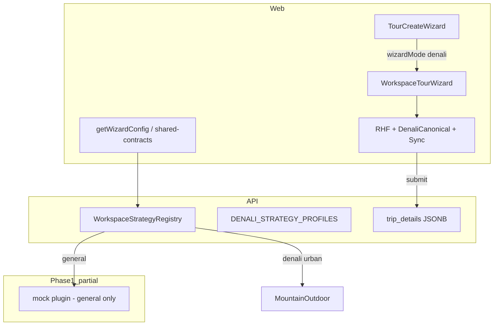
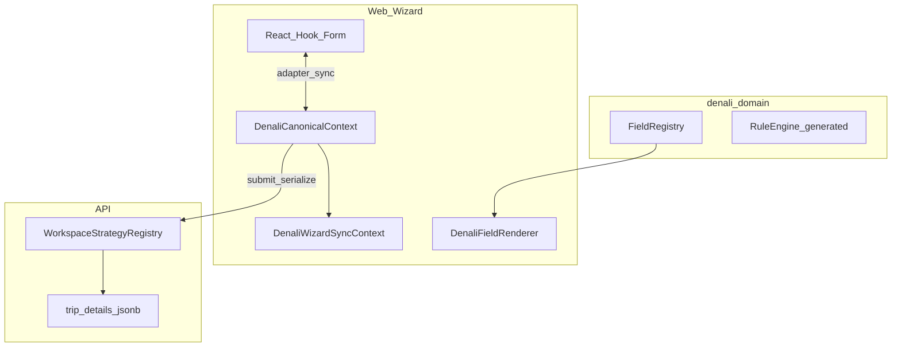

# گزارش‌های ممیزی Migration — Platform & Workspace

**Tour Ops — تجمیع دو گزارش ممیزی (فاز ۱ و فاز ۱+۲)**  
**تاریخ تهیه:** 2026-06-01  
**Branch مورد بررسی:** `main` · `gitSha`: `cafe04e` (پس از merge فاز ۱)  
**منابع:** [`map.md`](map.md) · [`phase-0-platform-baseline.md`](phase-0-platform-baseline.md) · [`phase-1-platform-contract.md`](phase-1-platform-contract.md) · کد repo

---

# Phase 1 Stabilization Report

**تاریخ اجرا:** 2026-06-01  
**هدف:** merge کامل فاز ۱ روی `main`، اعتبارسنجی محلی، آماده‌سازی Phase 2.1 (بدون شروع Phase 2)

## Recovery

| منبع | نتیجه |
|------|--------|
| `stash@{0}` (`local-audit-baseline`) | فقط `audit-report.md`, `map_2.md`, baseline — **نه** آرتیفکت فاز ۱؛ اعمال نشد (تداخل `map_2.md`) |
| `stash@{1}` (`validation-temp-*`) | قدیمی؛ استفاده نشد |
| شاخه‌های محلی `feat/phase-1-*` | منبع اصلی — همهٔ فایل‌های فاز ۱ بازیابی و merge شدند |
| `/tmp/phase1-split-backup` | پشتیبان قبلی؛ merge از شاخه‌ها انجام شد |

## PR branches و merge

| Sub-phase | Branch | Commit (tip) | Merge به `main` |
|-----------|--------|--------------|-----------------|
| 1.1 | `feat/phase-1-1-workspace-sdk-scaffold` | `2910461` | ✅ (fast-forward زنجیره) |
| 1.2 | `feat/phase-1-2-workspace-sdk-contract` | `8449874` | ✅ |
| 1.3 | `feat/phase-1-3-api-workspace-bridge` | `0a8846e` | ✅ |
| 1.4 | `feat/phase-1-4-workspace-sdk-guards` | `5590e2b` | ✅ |
| 1.3c doc | (روی 1.4) | `d4b8f07` | ✅ tip `main` |

**روش merge:** `git checkout main && git merge feat/phase-1-4-workspace-sdk-guards` → fast-forward `099a806..d4b8f07`  
**Push:** `origin/main` → `d4b8f07` (2026-06-01)

### تأیید ساختار روی `main`

| بررسی | وضعیت |
|--------|--------|
| `git ls-files packages/workspace-sdk` | 14 فایل tracked |
| `apps/api` → `@repo/workspace-sdk` | ✅ `workspace:*` |
| `pnpm run phase-1:guard` در `package.json` | ✅ |
| `scripts/ci-integrity-check.sh` → `phase-1:guard` | ✅ |
| `dependency-cruiser` rule `workspace-sdk-denali-free` | ✅ |
| `verify-workspace-freeze.mjs` | ✅ |

## اعتبارسنجی محلی (`main` @ `d4b8f07`, Node 22)

| دستور | نتیجه | خلاصه |
|--------|--------|--------|
| `pnpm install` | **PASS** | lockfile هم‌تراز |
| `pnpm --filter @repo/workspace-sdk build` | **PASS** | tsc |
| `pnpm run phase-1:guard` | **PASS** | g1–g5 + depcruise؛ [`reports/phase-1-guard-2026-06-01.json`](reports/phase-1-guard-2026-06-01.json) |
| `pnpm run phase-0:verify-freeze` | **PASS** | 7 profiles @ `d4b8f07` |
| `pnpm run baseline:platform-metrics` | **PASS** | `packages/workspace-sdk` → **`missing: false`**, `denali_token_count: 0` |
| `pnpm run ci:integrity` | **PASS** | eslint + depcruise + test + phase-1:guard + query-key (~85s) |
| `pnpm run qa:tour-wizard-smoke` | **PASS** | 7/7 specs (~8s) |

**یادداشت:** اسکریپت رسمی smoke در `package.json` نام `qa:tour-wizard-smoke` است (نه `qa:smoke:tour-wizard`).

## GitHub Actions (`main` push `d4b8f07`)

| Workflow | Trigger on `main` push | وضعیت |
|----------|------------------------|--------|
| **integrity-gate** | ❌ فقط `pull_request` | اجرا نشد روی push؛ برای تأیید باید PR باز شود یا workflow به `push: main` گسترش یابد |
| **backend-e2e-tests** | ✅ | **FAIL** — [run 26758654808](https://github.com/hrokhbakhsh1991/docs/actions/runs/26758654808) |
| architecture-guardrails | ✅ | **FAIL** — [run 26758654516](https://github.com/hrokhbakhsh1991/docs/actions/runs/26758654516) |

سایر checkهای وابسته به commit (tenant-isolation، tour-rbac-parity، finance-boundary، …): چند مورد **FAIL** روی همان SHA (مستقل از gate محلی `ci:integrity`).

## وضعیت نهایی آمادگی

| معیار | وضعیت |
|--------|--------|
| Phase 1 code روی `main` | ✅ |
| Guardهای فاز ۱ در pipeline محلی (`ci:integrity`) | ✅ |
| SDK partial bridge (`general` only؛ 1.3c → Phase 2) | ✅ مستند ([`d4b8f07`](https://github.com/hrokhbakhsh1991/docs/commit/d4b8f07)) |
| Production-stable محلی (gate + smoke) | ✅ |
| GitHub `integrity-gate` + `backend-e2e` سبز | ❌ (e2e fail؛ integrity-gate روی push اجرا نشد) |
| **آماده شروع Phase 2.1** | **بله — کد و guard محلی** · **خیر — تا سبز شدن CI از راه دور (حداقل backend-e2e)** |

**Phase 2 شروع نشد** — فقط merge و تثبیت فاز ۱.

---

## فهرست

0. [Phase 1 Stabilization Report](#phase-1-stabilization-report)
1. [AUDIT 1 — Phase 1 Contract vs Implementation](#audit-1---phase-1-contract-vs-implementation)
2. [AUDIT 2 — Missing Implementations & Gaps](#audit-2---missing-implementations--gaps)
3. [AUDIT 3 — Final Consolidated Report + Phase 2 Readiness](#audit-3---final-consolidated-report--phase-2-readiness)
4. [گزارش دوم — ممیزی فاز ۱ و ۲ (workspace-agnostic + plugin backend)](#گزارش-دوم--ممیزی-فاز-۱-و-۲-workspace-agnostic--plugin-backend)
5. [فهرست یکپارچه ریسک‌ها (R1–R12 + AUDIT 1)](#فهرست-یکپارچه-ریسک‌ها)
6. [اقدامات پیشنهادی قبل از Phase 3+](#اقدامات-پیشنهادی-قبل از-phase-3)

---

# AUDIT 1 - Phase 1 Contract vs Implementation

**تاریخ ممیزی:** 2026-06-01  
**Branch:** `main` @ `cafe04e` (`docs(platform): phase 1 stabilization report on main`)  
**منابع الزام:** [`map.md`](map.md) §Phase 1 · [`phase-1-platform-contract.md`](phase-1-platform-contract.md) §§4–7, 10, 12 · `git ls-files` · `reports/*` · GitHub Checks API

**روش:** استخراج تمام exit criteria / DoD / پیوست A از اسناد رسمی → مقایسه با پیاده‌سازی، گزارش‌ها، CI، و انحراف فرآیند PR.

---

## A. خلاصه اجرایی

| محور | حکم |
|------|-----|
| **کد قرارداد SDK (1.1–1.2)** | ✅ کامل روی `main` |
| **Bridge API (1.3a+b)** | ✅ `general` + legacy view؛ **1.3c عمداً به Phase 2 موکول** |
| **Guardrails (1.4)** | ✅ `phase-1:guard` + depcruise + `ci:integrity` محلی |
| **Merge / PR plan** | ⚠️ یک fast-forward به‌جای ۴ PR جدا — انحراف فرآیند |
| **CI از راه دور** | 🔴 `backend-e2e-tests` و چند guard روی `main` **FAIL** |
| **آمادگی Phase 2.1 (shell plugin)** | 🟡 **کد بله** · **CI رسمی خیر تا e2e/integrity-gate سبز** |

**تعداد یافته‌ها:** CRITICAL **2** · MAJOR **9** · MINOR **8**

---

## B. فهرست الزامات Phase 1 (استخراج از اسناد)

### B.1 از `map.md` (Phase 1)

| ID | الزام | منبع |
|----|--------|------|
| M-1.1 | scaffold `@repo/workspace-sdk`؛ build سبز؛ صفر import denali-domain | map §1.1 |
| M-1.2 | types + mock plugin tests | map §1.2 |
| M-1.3 | bridge `IWorkspaceStrategy` → SDK؛ API tests سبز | map §1.3 |
| M-1.4 | guard SDK denali-free + `phase-1:guard` در CI | map §1.4 |
| M-DoD | `@repo/workspace-sdk` + mock + API adapter + guard؛ **بدون** جابجایی Denali | map DoD |
| M-partial | «SDK integration is partial (`general` only); full profile coverage moves to Phase 2» | map Phase 1 |
| M-smoke | `qa:smoke:tour-wizard` gate برای PRهای فاز (map §7) | map §7 |
| M-freeze | `phase-0:verify-freeze` همچنان معتبر | map دستورات |

### B.2 از `phase-1-platform-contract.md`

| ID | الزام | § |
|----|--------|---|
| C-0 | پیش‌نیاز فاز ۰ (baseline، ci، smoke، freeze) | §2 |
| C-1.1 | پکیج + build/test + rg denali-free | §4.5 |
| C-1.2 | typeهای §5.2 + mock ۷ case + export از index | §5.6 |
| C-1.3a | adapter فقط `general` + mock | §6.2 |
| C-1.3b | `buildWorkspacePluginViewFromStrategy` / legacy view | §6.5 |
| C-1.3c | **Deferred to Phase 2** — همه پروفایل‌ها یکسان از registry | §6.2 |
| C-1.3-parity | جدول parity §6.4 برای هر پروفایل freeze | §6.4 |
| C-1.4 | G1–G5 + `phase-1:guard` در ci-integrity + گزارش JSON | §7.2–7.5 |
| C-PR | PR جدا با `Phase: 1.x` برای 1.1–1.4 | §§4.5, 5.6, 6.5, 7.5 |
| C-A | پیوست A ورود Phase 2.1 (۶ شرط) | §12 پیوست A |
| C-forbidden | §10 — بدون git mv denali، بدون حذف `DENALI_STRATEGY_PROFILES`، … | §10 |

---

## C. ماتریس تطبیق پیاده‌سازی

### C.1 زیرفاز 1.1 — Scaffold

| الزام | وضعیت | شواهد |
|--------|--------|--------|
| `packages/workspace-sdk/package.json` | ✅ | tracked |
| `tsconfig.json` | ✅ | tracked |
| `src/index.ts` (scaffold → full exports در 1.2) | ✅ | `packages/workspace-sdk/src/index.ts` |
| `pnpm --filter @repo/workspace-sdk build` | ✅ | guard g5b |
| `pnpm --filter @repo/workspace-sdk test` | ✅ | guard g5 |
| `rg -i denali packages/workspace-sdk/src` → 0 | ✅ | exit 1 (no matches) |
| بدون `@repo/denali-domain` / `@repo/types/denali` | ✅ | guard g2, g3 |
| PR `Phase: 1.1` merge جدا | ⚠️ | **FF یکجا** — نه PR جدا |

### C.2 زیرفاز 1.2 — Contract

| Type / خروجی §5.2 | وضعیت |
|-------------------|--------|
| `WorkspacePlugin`, `WorkspacePluginId` | ✅ |
| `WorkspaceFieldRegistry`, `WorkspaceFieldRegistryEntry` | ✅ |
| `WorkspaceRuleSet`, `WorkspaceRuleCell`, `WorkspaceRuleFieldOverride` | ✅ |
| `WorkspaceWizardSurface`, `WorkspaceWizardMode` | ✅ |
| `WorkspaceValidationHooks`, `noopWorkspaceValidationHooks` | ✅ |
| `WorkspaceLifecycleContract` | ✅ |
| `CanonicalDocument` + helpers | ✅ |
| `WorkspaceProfileBinding` + `DEFAULT_WORKSPACE_PROFILE_BINDINGS` | ✅ (`general` only) |
| `mockWorkspacePlugin` + spec | ✅ 7× `it()` |
| PR `Phase: 1.2` merge جدا | ⚠️ FF |

**انحراف ساختاری (MINOR):** §4.2 پیشنهاد `src/__tests__/` — واقعیت: `src/mock-workspace.plugin.spec.ts`.

### C.3 زیرفاز 1.3 — Bridge

| مرحله | سند | پیاده‌سازی |
|--------|------|------------|
| **1.3a** | `SdkWorkspaceStrategyAdapter` برای `general` | ✅ `workspace.strategy.registry.ts` L33–36 |
| **1.3b** | legacy → plugin view | ✅ `legacy-workspace-plugin.view.ts` |
| **1.3c** | همه پروفایل‌ها از SDK registry | ❌ **عمدی deferred** — کامنت + `d4b8f07` |
| `@repo/workspace-sdk` در `apps/api` | ✅ `apps/api/package.json` |
| `workspace.strategy.registry.spec.ts` | ✅ 11 tests |
| `pnpm run ci:integrity` / smoke قبل merge | ✅ **پس از merge** (stabilization) |
| PR `Phase: 1.3` merge جدا | ⚠️ FF |

**پوشش پروفایل (bridge):**

| `TourFormProfile` | مسیر registry | SDK adapter? |
|-------------------|---------------|--------------|
| `general` | `SdkWorkspaceStrategyAdapter` + mock | ✅ |
| `denali_pilot`, `urban_event` | `MountainOutdoorWorkspaceStrategy` | ❌ legacy |
| `nature_trip`, `mountain_outdoor`, `cinema_event`, `cultural_tour` | `GeneralWorkspaceStrategy` | ❌ legacy (spec: `nature_trip` explicit) |

**Bindings SDK:** فقط `{ profile: "general", pluginId: "mock" }` — `workspace-profile-binding.ts`.

### C.4 زیرفاز 1.4 — Guardrails

| ID | الزام | وضعیت |
|----|--------|--------|
| G1–G3 | denali-free در SDK | ✅ |
| G4 | `workspace-sdk-denali-free` depcruise | ✅ `dependency-cruiser.config.js` |
| G5 | SDK test در CI | ✅ root `pnpm test` + guard |
| `phase-1:guard` script | ✅ `package.json` |
| `ci-integrity-check.sh` invokes guard | ✅ L34–35 |
| `reports/phase-1-guard-*.json` | ✅ `exit14.pass: true` @ `d4b8f07` |
| `map.md` Phase 1 ✅ | ✅ |
| PR `Phase: 1.4` merge | ⚠️ FF |
| §7.4 baseline diff در هر PR | ❌ automation نیست |

### C.5 §10 — ممنوعیت‌های فاز ۱ (باید نقض نشده باشند)

| ممنوعیت | نقض؟ |
|---------|------|
| `git mv` denali-domain | ✅ رعایت |
| حذف `DENALI_STRATEGY_PROFILES` | ✅ هنوز موجود |
| تغییر DB / web wizard / پروفایل هشتم | ✅ رعایت |

---

## D. یافته‌ها (طبقه‌بندی)

### D.1 CRITICAL — مانع Phase 2 تا رفع

| ID | یافته | دلیل CRITICAL |
|----|--------|----------------|
| **F-C1** | GitHub **`backend-e2e-tests` → FAILURE** on `main` @ `cafe04e` / `d4b8f07` | gate رسمی push به main؛ بدون e2e سبز، «production-stable» ادعا نمی‌شود |
| **F-C2** | Workflow **`integrity-gate` فقط `on: pull_request`** — روی `push` به `main` اجرا نمی‌شود | `ci:integrity` + `phase-1:guard` در CI پیش‌فرض branch محافظت نمی‌شود |

### D.2 MAJOR — ریسک بالا؛ Phase 2.1 با احتیاط

| ID | یافته | طبقه |
|----|--------|------|
| **F-M1** | **۴ PR جدا** (`Phase: 1.1`…`1.4`) در نقشه اجرا نشد؛ یک **fast-forward** `099a806..d4b8f07` | فرآیند / ردیابی review |
| **F-M2** | `phase-1-platform-contract.md` هنوز `- [ ] PR … merge` و «منتظر PR» در §§4.5–7.5 | ناهماهنگی سند |
| **F-M3** | **1.3c** ناقص: ۱/۷ پروفایل از SDK؛ بقیه legacy — **مستند شده** ولی §6.4 parity برای همه پروفایل از مسیر SDK اعمال نشده | پوشش bridge |
| **F-M4** | اسپک registry فقط `general`, `denali_pilot`, `urban_event`, `nature_trip`, `mountain_outdoor` — **`cinema_event` / `cultural_tour` بدون assert اختصاصی** | شکاف تست parity |
| **F-M5** | `reports/phase-0-ci-gate-2026-06-01.json` **`gitSha`: `f715a8d`** (قبل Phase 1) — gate رسمی فاز ۰ **بازتولید نشده** پس از merge | گزارش stale |
| **F-M6** | GitHub **`architecture-guardrails` → FAILURE** روی همان push | CI سازمانی |
| **F-M7** | Root **`pnpm run build`** شامل `@repo/workspace-sdk` نیست — وابستگی API به `dist/` بدون build قبلی | DX / CI محیط‌های فقط-build |
| **F-M8** | `map.md` / پیوست C نام **`qa:smoke:tour-wizard`**؛ root فقط **`qa:tour-wizard-smoke`** | سردرگمی دستور |
| **F-M9** | چند check دیگر روی `cafe04e` **FAIL** (`react-query-key-integrity`, `tenant-isolation-guardrails`, …) | سطح repo خارج از Phase 1 ولی روی main قرمز |

### D.3 MINOR — پاک‌سازی

| ID | یافته |
|----|--------|
| **F-m1** | §4.4 چک‌باکس‌های `[ ]` monorepo در سند در حالی که پکیج وجود دارد |
| **F-m2** | `turbo.json` task برای workspace-sdk — N/A (فایل turbo وجود ندارد) |
| **F-m3** | نام `LegacyStrategyWorkspacePluginAdapter` در سند vs `buildWorkspacePluginViewFromStrategy` |
| **F-m4** | `stripPolicy` روی plugin (پیوست D) — planned 1.2+، پیاده نشده |
| **F-m5** | `phase-1-guard` report `gitSha` هنوز `d4b8f07` در برخی فیلدها vs tip `cafe04e` |
| **F-m6** | `workspace-sdk` در `description` package.json کلمه denali-free (مجاز؛ rg src صفر) |
| **F-m7** | Commits با `Co-authored-by: Cursor` — فرآیند |
| **F-m8** | Stash `stash@{0}` حاوی `audit-report`/`map_2` قدیمی — اعمال نشده (صحیح) |

---

## E. PR / merge expectations

| انتظار سند | واقعیت `main` |
|------------|----------------|
| PR جدا 1.1 → 1.2 → 1.3 → 1.4 | ❌ یک زنجیره FF؛ شاخه‌های `feat/phase-1-*` محلی باقی |
| `Phase: 1.x` در history | ✅ پیام commitها (`feat(platform): phase 1.x`) |
| Review per sub-phase | ⚠️ یک merge block |
| `origin/main` شامل workspace-sdk | ✅ push تا `cafe04e` |

**Commits Phase 1 روی `main`:**

```text
2910461 feat(platform): phase 1.1 - scaffold workspace-sdk package
8449874 feat(platform): phase 1.2 - workspace-sdk contract and mock plugin
0a8846e feat(platform): phase 1.3 - api workspace strategy bridge
5590e2b feat(platform): phase 1.4 - workspace-sdk guards and ci integration
d4b8f07 docs(platform): clarify Phase 1.3c deferred to Phase 2
cafe04e docs(platform): phase 1 stabilization report on main
```

---

## F. CI / smoke validation

### F.1 محلی (`main` @ `cafe04e`, اجرای stabilization + این ممیزی)

| دستور | نتیجه | یادداشت |
|--------|--------|---------|
| `pnpm run phase-1:guard` | **PASS** | 6/6 checks |
| `pnpm run phase-0:verify-freeze` | **PASS** | 7 profiles |
| `pnpm run baseline:platform-metrics` | **PASS** | `workspace-sdk.missing: false` |
| `pnpm run ci:integrity` | **PASS** | شامل phase-1:guard |
| `pnpm run qa:tour-wizard-smoke` | **PASS** | 7/7 Playwright |
| `pnpm run qa:smoke:tour-wizard` | **N/A** | اسکریپت root وجود ندارد — alias: `qa:tour-wizard-smoke` |

### F.2 GitHub Actions (`main`)

| Workflow | Trigger push `main` | `cafe04e` |
|----------|---------------------|-----------|
| `integrity-gate` | ❌ PR only | not run |
| `backend-e2e-tests` | ✅ | **failure** |
| `architecture-guardrails` | ✅ | **failure** |

### F.3 `phase-0:ci-gate` vs Phase 1

| مورد | وضعیت |
|------|--------|
| `phase-0-ci-gate.mjs` شامل `ci:integrity` | ✅ (که اکنون phase-1:guard دارد) |
| گزارش JSON committed پس از Phase 1 | ❌ **F-M5** — SHA قدیمی |

---

## G. Baseline regeneration

| معیار | قبل Phase 1 (`099a806`) | بعد (`cafe04e`) |
|--------|-------------------------|-----------------|
| `packages/workspace-sdk` در baseline | `missing: true` | **`missing: false`**, `denali_token_count: 0` |
| commit گزارش در repo | — | ✅ `reports/phase-0-baseline-2026-06-01.json` در `cafe04e` |
| automation §7.4 در PR | — | ❌ دستی |

---

## H. Bridge coverage (1.3c / profiles)

| Scope | سند | کد |
|--------|------|-----|
| Phase 1 intentional | فقط `general` + mock | ✅ resolver + bindings |
| 1.3c کامل | Phase 2 plugin rollout | ❌ deferred — **مستند** `d4b8f07` |
| Web wizard | بدون تغییر فاز ۱ | ✅ Denali shell فقط `denali_pilot`/`urban_event` (خارج scope این audit) |

**پیوست A §12:**

| # | شرط | وضعیت |
|---|------|--------|
| 1 | SDK در main + guard سبز | ✅ محلی |
| 2 | mock tests ≥ 5 | ✅ (7) |
| 3 | bridge همه profiles **یا gap مستند** | ✅ gap مستند |
| 4 | baseline تازه | ✅ JSON |
| 5 | `phase-0:verify-freeze` | ✅ |
| 6 | smoke 7/7 | ✅ محلی |

---

## I. کارهای رد شده / خارج scope (صحیح)

- `packages/workspaces/denali` — Phase 2  
- `WorkspacePluginRegistry` API — Phase 2.3  
- `platform-core` — Phase 3  
- حذف `DENALI_STRATEGY_PROFILES` — Phase 2.4  
- **شروع Phase 2 انجام نشده** ✅

---

## J. حکم نهایی — آمادگی Phase 2.1

| سؤال | پاسخ |
|------|------|
| Phase 1 contract روی `main`؟ | **بله** (کد + guard محلی) |
| Phase 1 مطابق «۴ PR جدا + CI GitHub سبز»؟ | **خیر** |
| **BLOCKER برای Phase 2.1؟** | **F-C1, F-C2** (و توصیه: F-M5, F-M6) |
| شروع `denaliPlugin` shell (2.1) بدون e2e سبز؟ | **توصیه نمی‌شود** |

**اقدامات بستن رسمی (بدون شروع Phase 2):**

1. رفع `backend-e2e-tests` روی `main`  
2. افزودن `push: branches: [main]` به `integrity-gate` یا اجرای gate در workflow موجود push  
3. `pnpm run phase-0:ci-gate` + commit گزارش تازه  
4. به‌روزرسانی تیک‌های PR در `phase-1-platform-contract.md`  
5. (اختیاری) alias `qa:smoke:tour-wizard` در root `package.json`

---

# AUDIT 2 - Missing Implementations & Gaps

**تاریخ:** 2026-06-01  
**Branch / SHA:** `main` @ `cafe04e`  
**دامنه:** تمام الزامات مستندشده Phase 0 + Phase 1 در [`map.md`](map.md)، [`phase-0-platform-baseline.md`](phase-0-platform-baseline.md)، [`phase-1-platform-contract.md`](phase-1-platform-contract.md) در برابر repo

**روش:** اسکن `git ls-files`، `rg`، مقایسه exit criteria، مسیرهای smoke/CI، و ردیابی import graph (`@repo/workspace-sdk` فقط در API strategies).

---

## خلاصه شمارشی

| Severity | تعداد | معنی |
|----------|------:|------|
| **critical** | 8 | doc می‌گوید تمام / CI سبز؛ واقعیت مخالف یا blocker تولید |
| **major** | 22 | ناقص، mock-only، unwired، یا انحراف معماری |
| **minor** | 14 | cleanup، naming، doc drift |

---

## Frontend

### critical

| ID | یافته | شواهد |
|----|--------|--------|
| FE-C1 | **هیچ اتصالی به `@repo/workspace-sdk`** — فاز ۱ contract در UI مصرف نمی‌شود | `rg @repo/workspace-sdk apps/web` → 0؛ wizard از `@repo/shared-contracts` + `denali-domain` |
| FE-C2 | **۵/۷ پروفایل freeze** فقط shell «classic unavailable» — نه ویزارد واقعی | `apps/web/src/components/tours/wizard/TourCreateWizard.tsx` L141–176 (`wizard-classic-shell-unavailable`)؛ smoke 02, 08 |

### major

| ID | یافته | مسیر |
|----|--------|------|
| FE-M1 | `WorkspacePluginProvider` (Phase 2.5) — **وجود ندارد** | — |
| FE-M2 | `getWizardConfig` / `DENALI_WIZARD_PROFILES` **موازی و جدا از SDK** — duplicate ثابت نسبت به API | `apps/web/src/features/tours/wizard/workspace-wizard.config.ts` |
| FE-M3 | Denali wizard path همچنان `wizard/denali/**` + `DenaliFieldRenderer` — بدون renderer generic (Phase 3) | `apps/web/src/features/tours/wizard/denali/` |
| FE-M4 | **۶** `direct_form_controls` در wizard (baseline global) — نقض هدف map §4.4 (Phase 3+) | `reports/phase-0-baseline-2026-06-01.json` → `direct_form_controls_wizard: 6` |
| FE-M5 | **۲۶** فایل dual-state (RHF + canonical) — Phase 4a هدف؛ freeze §3.5 هنوز باز | همان baseline → `dual_state_files` |
| FE-M6 | **۷/۷** composite bypass فایل §3.5 هنوز present — hotspot حذف نشده | `scripts/platform-transformation/baseline-metrics.mjs` `COMPOSITE_BYPASS_FILES` |
| FE-M7 | smoke specs **11–13** (matrix, review, map-fields) در gate رسمی 7-spec **نیستند** | `apps/web/package.json` `qa:smoke:tour-wizard` vs فایل‌های `11-*.spec.ts`, `12-*.spec.ts`, `13-*.spec.ts` |
| FE-M8 | `TourCreateWizard` فقط `wizardMode === "denali"` → `WorkspaceTourWizard`؛ urban از مسیر Denali UI — **نه plugin urban** | `TourCreateWizard.tsx` L41, L151 |

### minor

| ID | یافته | مسیر |
|----|--------|------|
| FE-m1 | `workspace-wizard.config.ts` mirror API builders — **بدون** sync خودکار به SDK `WorkspaceWizardSurface` | `workspace-wizard.config.ts` |
| FE-m2 | `data-integrity.spec.ts` در smoke folder — خارج سوئیت gate | `apps/web/src/features/tours/__tests__/smoke/data-integrity.spec.ts` |
| FE-m3 | BFF fetch errors در smoke لاگ (non-fatal) | stabilization smoke log |

---

## Backend (API)

### critical

| ID | یافته | شواهد |
|----|--------|--------|
| BE-C1 | **`SdkWorkspaceStrategyAdapter` فقط facade** — تمام رفتار از `legacy` delegate؛ plugin fieldRegistry/ruleSet **در runtime استفاده نمی‌شود** | `apps/api/src/modules/tours/strategies/sdk.workspace.strategy.adapter.ts` L22–40 |
| BE-C2 | **تنها `general`** از resolver mock می‌گیرد؛ ۶ پروفایل دیگر بدون binding SDK | `packages/workspace-sdk/src/plugin/workspace-profile-binding.ts`؛ `workspace-plugin.resolver.ts` |

### major

| ID | یافته | مسیر |
|----|--------|------|
| BE-M1 | **1.3c** (همه پروفایل‌ها یکسان از registry) — **عمداً Phase 2**؛ در doc ✅ deferred ولی در پیوست A هنوز gap | `workspace.strategy.registry.ts` |
| BE-M2 | `DENALI_STRATEGY_PROFILES` + `usesDenaliCanonicalTemplate` **هنوز در API core** — حذف Phase 2.4 | `workspace.strategy.registry.ts` L8–18 |
| BE-M3 | `urban_event` + `denali_pilot` هر دو `MountainOutdoorWorkspaceStrategy` — coupling موقت freeze §7.5 | `mountain-outdoor.workspace.strategy.ts` |
| BE-M4 | `buildWorkspacePluginViewFromStrategy` — fieldRegistry **خالی** `fields: []`؛ فقط تست/آینده | `legacy-workspace-plugin.view.ts` L45–48 |
| BE-M5 | `workspace.strategy.builders.ts` — **optional** در §6.3؛ export helpers برای adapter **اضافه نشده** (فقط import داخلی) | §6.3 جدول؛ builders unchanged public surface |
| BE-M6 | **بدون** `WorkspacePluginRegistry` loader (Phase 2.3) | — |
| BE-M7 | Parity §6.4 — **بدون** تست اختصاصی `cinema_event`, `cultural_tour` در registry spec | `workspace.strategy.registry.spec.ts` |
| BE-M8 | `getWorkspacePlugin()` **فقط** در unit tests / adapter — هیچ consumer تولیدی در `tours.service.ts` | `rg getWorkspacePlugin apps/api` |
| BE-M9 | Denali-named DTO/helpers در tours module (`assertDenaliPilot*`, `DENALI_TOUR_KIND_VALUES`) — خارج scope حذف Phase 1 | `assert-create-tour-invariants.ts`, `trip-details.dto.ts` |

### minor

| ID | یافته | مسیر |
|----|--------|------|
| BE-m1 | Plugin id legacy view: ``legacy:${profile}`` — خارج mock binding table | `legacy-workspace-plugin.view.ts` L21–23 |
| BE-m2 | `mountain_outdoor` در spec loop «draft before publish» — `cinema_event`/`cultural_tour` حذف شده‌اند | `workspace.strategy.registry.spec.ts` L68–73 |

---

## SDK (`packages/workspace-sdk`)

### major

| ID | یافته | مسیر |
|----|--------|------|
| SDK-M1 | **Mock-only** plugin — هیچ `denali` / `urban` plugin واقعی (Phase 2+) | `src/mock/mock-workspace.plugin.ts` |
| SDK-M2 | **`stripPolicy`** روی `WorkspacePlugin` — در پیوست D ذکر شده؛ **پیاده نشده** | `phase-1-platform-contract.md` پیوست D |
| SDK-M3 | ساختار §4.2 `src/__tests__/` — واقعیت `src/mock-workspace.plugin.spec.ts` | doc vs repo |
| SDK-M4 | **`@repo/shared-contracts` ممنوع** در §4.3 dependencies — رعایت شده؛ ولی **موازی‌سازی** `TourWorkspaceDefinition` هنوز منبع runtime web/API است | `shared-contracts` vs SDK |
| SDK-M5 | `supportedProfiles` mock = `["general"]` only — با map «partial» هم‌خوان | `mock-workspace.plugin.ts` |
| SDK-M6 | **بدون** consumer در `apps/web` — contract island | import graph |

### minor

| ID | یافته | مسیر |
|----|--------|------|
| SDK-m1 | Root `pnpm run build` **شامل** workspace-sdk نیست | `package.json` L12 |
| SDK-m2 | `turbo.json` task — N/A (فایل absent) | §4.4 |
| SDK-m3 | `WORKSPACE_SDK_VERSION` export — scaffold باقی‌مانده | `src/index.ts` |

---

## CI / automation

### critical

| ID | یافته | شواهد |
|----|--------|--------|
| CI-C1 | **`integrity-gate` workflow** فقط `pull_request` — روی `push` به `main` **اجرا نمی‌شود** | `.github/workflows/integrity-gate.yml` L6–7 |
| CI-C2 | **`backend-e2e-tests` FAILURE** روی `main` @ `cafe04e` | GitHub Actions API |
| CI-C3 | Doc Phase 0.3 می‌گوید smoke سبز؛ **`reports/phase-0-ci-gate-2026-06-01.md` هنوز می‌گوید smoke subset FAIL** | MD L18–23 vs JSON `smokeSuite.passed: 7` |

### major

| ID | یافته | مسیر |
|----|--------|------|
| CI-M1 | **`reports/phase-0-ci-gate-2026-06-01.json`** `gitSha: f715a8d` — **قبل Phase 1**؛ gate رسمی 0.3 **بازتولید نشده** پس از `phase-1:guard` در ci-integrity | `reports/phase-0-ci-gate-2026-06-01.json` |
| CI-M2 | **`phase-0:ci-gate.mjs`** صریحاً **شامل** `phase-1:guard` نیست — فقط `ci:integrity` (که اکنون guard دارد) | `scripts/platform-transformation/phase-0-ci-gate.mjs` |
| CI-M3 | §5.5 baseline — **automation diff در PR comment** پیاده نشده | policy doc only |
| CI-M4 | **`architecture-guardrails`** + چند check دیگر **FAIL** روی `main` | GitHub |
| CI-M5 | **`pnpm run qa:smoke:tour-wizard`** در root **وجود ندارد** — alias `qa:tour-wizard-smoke` | `package.json` L49 |
| CI-M6 | **۴ PR جدا** Phase 1.1–1.4 — در doc `[ ]` merge؛ واقعیت: **یک FF** | `phase-1-platform-contract.md` §§4.5–7.5 |
| CI-M7 | `test:e2e:isolation` — در gate 0.3 **optional**؛ map §7 «all phases» — **اجرا routine نیست** | `phase-0-ci-gate.mjs` known_issues |
| CI-M8 | Socket audit skip locally — OK؛ وابسته secret در CI | `ci-integrity-check.sh` |

### minor

| CI-m1 | Pre-commit `ci:integrity` ~90s — بدون split per sub-phase | husky |
| CI-m2 | Node 22 dev vs engines 24 — WARN | `package.json` engines |

---

## Docs (marked complete vs repo)

### critical

| ID | یافته | محل |
|----|--------|-----|
| DOC-C1 | `phase-1-platform-contract.md` هدر **«فاز ۱ تکمیل»** + §§4.5–7.5 **«منتظر PR»** / `- [ ] PR merge` | `phase-1-platform-contract.md` |
| DOC-C2 | `map.md` Phase 1 همه ✅ — **بدون** footnote CI remote قرمز | `map.md` L137–150 |

### major

| ID | یافته | محل |
|----|--------|-----|
| DOC-M1 | Phase 0 §8.1 `- [ ] hotspot list §3.5` — **باز**؛ doc 0.4 «تکمیل» | `phase-0-platform-baseline.md` L491 |
| DOC-M2 | `phase-0-ci-gate` MD/JSON **ناهماهنگ** smoke | `reports/phase-0-ci-gate-2026-06-01.md` vs `.json` |
| DOC-M3 | پیوست A §12 — چک‌باکس‌های `[ ]` در حالی که stabilization می‌گوید merge شد | `phase-1-platform-contract.md` L655–660 |
| DOC-M4 | `qa:smoke:tour-wizard` در map/phase-0/phase-1 — **اسم root script متفاوت** | multiple docs |
| DOC-M5 | `phase-1-platform-contract.md` §6.5 `- [ ] ci:integrity / smoke` — **اجرا شده** ولی تیک به‌روز نشده | §6.5 |

### minor

| DOC-m1 | `AUDIT 1` vs این بخش — هم‌پوشانی عمدی | `map_2.md` |
| DOC-m2 | `audit-report.md` stash — خارج main | stash |

---

## Cross-checks (درخواستی)

### workspace-sdk completeness

| معیار سند | وضعیت |
|-----------|--------|
| Types §5.2 | ✅ export در `src/index.ts` |
| Mock plugin + 7 tests | ✅ |
| denali-free guards | ✅ `phase-1-guard.mjs` |
| Real workspace plugins | ❌ Phase 2 |
| FE/BE consume wizard from plugin | ❌ فقط API wrap + mock |
| `stripPolicy` extension | ❌ |

### strategy registry completeness

| معیار | وضعیت |
|--------|--------|
| 7 profiles resolvable | ✅ همه `WorkspaceStrategyRegistry.resolve` |
| SDK path | ⚠️ فقط `general` |
| Uniform registry (1.3c) | ❌ deferred Phase 2 |
| حذف Denali constants | ❌ Phase 2.4 |
| Plugin loader | ❌ Phase 2.3 |

### frontend wizard integration gaps

| لایه | انتظار Phase 1 | واقعیت |
|------|----------------|--------|
| Contract types | موجود | ✅ در SDK |
| Create tour UI | بدون تغییر رفتار | ✅؛ classic = unavailable |
| SDK-driven shell | نشده در Phase 1 | ✅ مطابق §10 |
| Profile parity UX | smoke 7/7 | ✅ محلی؛ 5 profile = placeholder shell |

### backend API bridge completeness

| جزء | فایل | wired to production |
|-----|------|---------------------|
| Adapter | `sdk.workspace.strategy.adapter.ts` | ✅ `general` only |
| Resolver | `workspace-plugin.resolver.ts` | ✅ mock id only |
| Legacy view | `legacy-workspace-plugin.view.ts` | ⚠️ tests + future |
| Registry | `workspace.strategy.registry.ts` | ✅ all call sites use `resolve()` |
| Behavior from plugin matrix | — | ❌ delegate legacy |

---

## Architecture bypasses (Denali / workspace / strategy)

| الگو | محل | severity | توضیح |
|------|-----|----------|--------|
| Hard-coded Denali profiles | `workspace.strategy.registry.ts`, `workspace-wizard.config.ts` | major | نقض نهایی map §4.3 — planned Phase 2.4 |
| `profile === "denali_pilot"` در strategy impl | `mountain-outdoor.workspace.strategy.ts` L70 | major | داخل strategy class |
| Web/API **دو** ثابت جدا `DENALI_*_PROFILES` | API registry vs `DENALI_WIZARD_PROFILES` | major | ریسک drift |
| Tours module `denali` token count 213 | baseline layer | major | expected until Phase 2 |
| Composite widgets bypass renderer | §3.5 list 7 files | major | Phase 3 target |
| `usesDenaliCanonicalTemplate` only `denali_pilot` | registry | minor | documented freeze |
| Mock plugin stands in for real workspace | SDK | major | Phase 1 intentional |

---

## Doc ✅ vs code — جدول «ادعای تکمیل / واقعیت»

| ادعای doc | واقعیت repo | severity |
|-----------|-------------|----------|
| Phase 0.3 smoke سبز (MD gate) | MD می‌گوید FAIL؛ JSON 7/7؛ محلی PASS پس از merge | critical (DOC-C3) |
| Phase 1 PR merge | FF یکجا؛ checkboxes باز | major |
| Phase 1.3 ci/smoke قبل merge | انجام شده؛ تیک باز | major |
| `packages/workspace-sdk` در baseline | `missing: false` @ cafe04e | ✅ |
| hotspot §3.5 unchanged | composite + dual-state هنوز there | major |
| Platform DoD map §10 `[ ]` Phase 1–4b | Phase 1 code on main؛ platform DoD کلان باز | minor (expected) |

---

## Subsystem rollup (اولویت اجرا)

| Subsystem | critical | major | minor |
|-----------|----------|-------|-------|
| Frontend | 2 | 8 | 3 |
| Backend | 2 | 9 | 2 |
| SDK | 0 | 6 | 3 |
| CI | 3 | 8 | 2 |
| Docs | 2 | 5 | 2 |

---

## حکم — آیا task «تعریف‌شده ولی انجام‌نشده» مانع Phase 2.1 است؟

| دسته | Blocker? |
|------|----------|
| SDK contract + mock + guard on `main` | ✅ کافی برای **شروع shell** 2.1 |
| Real plugin behavior / FE integration | ❌ Phase 2+ |
| CI remote سبز (e2e, integrity on push) | 🔴 **بله** برای «production-stable» |
| Doc checkboxes / PR ceremony | 🟡 فرآیند |

**Phase 2 شروع نشده** — `packages/workspaces/*`, `platform-core` absent (expected).

---

# AUDIT 3 - Final Consolidated Report + Phase 2 Readiness

**تاریخ:** 2026-06-01  
**Authority:** گزارش اجرایی واحد — تجمیع [`map.md`](map.md) · [`phase-0-platform-baseline.md`](phase-0-platform-baseline.md) · [`phase-1-platform-contract.md`](phase-1-platform-contract.md) · وضعیت repo · [AUDIT 1](#audit-1---phase-1-contract-vs-implementation) · [AUDIT 2](#audit-2---missing-implementations--gaps) · [Phase 1 Stabilization](#phase-1-stabilization-report)  
**Branch / SHA:** `main` @ `cafe04e`

---

## 1. Executive summary — execution gap report

| فاز | وعده (اسناد) | تحویل واقعی | فاصله اجرایی |
|-----|--------------|-------------|--------------|
| **Phase 0** | Freeze + baseline + CI/smoke سبز + freeze JSON | **~90%** — اسکریپت‌ها و گزارش‌ها هست؛ hotspot §3.5 باز؛ gate MD/JSON ناهماهنگ | فرآیند و doc hygiene |
| **Phase 1** | SDK contract + mock + API bridge + guard؛ ۴ PR؛ بدون جابجایی Denali | **~85%** کد؛ **~55%** فرآیند/CI رسمی | PR واحد FF؛ CI remote قرمز؛ bridge جزئی |
| **Platform North Star** | core/workspace-sdk بدون denali؛ plugin architecture | **فقط `packages/workspace-sdk` ایزوله** — بقیه repo همچنان Denali-heavy | تا Phase 2–4 |

**حکم Phase 1 «کامل»:** **NO** (بخش [§6](#6-is-phase-1-truly-complete))  
**Phase 2 Risk Assessment Score:** **68 / 100** (ریسک بالاتر = شروع Phase 2 خطرناک‌تر تا رفع blockerها؛ بخش [§7](#7-phase-2-risk-assessment-score-0100))

---

## 2. Promised vs delivered (authoritative matrix)

### 2.1 Phase 0 — promised vs delivered

| Sub-phase | Promised (`map.md` + `phase-0-platform-baseline.md`) | Delivered on `main` | Gap |
|-----------|------------------------------------------------------|---------------------|-----|
| **0.1** | `map.md`, PR template `Phase: N.M`, cross-links | ✅ | — |
| **0.2** | `baseline-metrics.mjs` + committed JSON/MD | ✅ [`reports/phase-0-baseline-2026-06-01.json`](reports/phase-0-baseline-2026-06-01.json) (post–Phase 1 regen: `workspace-sdk` not missing) | PR diff automation §5.5 ❌ |
| **0.3** | `ci:integrity` + web build + smoke 7/7 + gate report | ✅ محلی؛ JSON gate `gitSha` **f715a8d** (pre–Phase 1); MD gate هنوز smoke **FAIL** متن | DOC/CI stale |
| **0.4** | freeze 7 profiles + `verify-workspace-freeze` | ✅ [`reports/phase-0-workspace-freeze.json`](reports/phase-0-workspace-freeze.json) | — |
| **§8.1** | hotspot §3.5 unchanged until Phase 1 PR | ❌ `[ ]` still open؛ composite/dual-state unchanged | **P0 process** |

### 2.2 Phase 1 — promised vs delivered

| Sub-phase | Promised | Delivered | Gap |
|-----------|----------|-----------|-----|
| **1.1** | scaffold `@repo/workspace-sdk`, denali-free build/test | ✅ 14 tracked files | root `build` chain؛ separate PR |
| **1.2** | contract types + mock + ≥5 tests | ✅ 7 tests; all §5.2 exports | `__tests__/` layout؛ `stripPolicy` |
| **1.3a** | SDK adapter for `general` | ✅ `SdkWorkspaceStrategyAdapter` | behavior = legacy delegate |
| **1.3b** | legacy → plugin view | ✅ `legacy-workspace-plugin.view.ts` | empty `fieldRegistry.fields` |
| **1.3c** | all profiles uniform registry | ❌ **deferred Phase 2** (documented `d4b8f07`) | intentional |
| **1.4** | G1–G5 + `phase-1:guard` in `ci:integrity` | ✅ [`reports/phase-1-guard-2026-06-01.json`](reports/phase-1-guard-2026-06-01.json) | `integrity-gate` not on `push` |
| **DoD** | SDK + mock + adapter + guard; no Denali file moves | ✅ code | 4 PRs → 1 FF; FE unwired |
| **§10 forbidden** | no git mv, no profile #8, no web refactor | ✅ respected | — |

---

## 3. Exact list — missing or incomplete work

### 3.1 Critical (blocks «Phase 1 complete» or production-stable `main`)

| # | Item | Paths / evidence |
|---|------|------------------|
| GAP-C1 | GitHub **`backend-e2e-tests` FAILURE** on `main` | `.github/workflows/backend-e2e.yml`; Actions @ `cafe04e` |
| GAP-C2 | **`integrity-gate`** not run on `push` to `main` | `.github/workflows/integrity-gate.yml` (`on: pull_request` only) |
| GAP-C3 | **`phase-0-ci-gate` MD** claims smoke FAIL vs JSON 7/7 vs local PASS | `reports/phase-0-ci-gate-2026-06-01.md` L18–23 vs `.json` `smokeSuite` |
| GAP-C4 | Contract doc **«فاز ۱ تکمیل»** vs open PR checkboxes | `phase-1-platform-contract.md` §§4.5–7.5, L655–660 |
| GAP-C5 | **Zero FE** consumption of `@repo/workspace-sdk` | `apps/web/**` — no imports |
| GAP-C6 | **`SdkWorkspaceStrategyAdapter`** does not drive behavior from plugin contract | `sdk.workspace.strategy.adapter.ts` |

### 3.2 Major (incomplete by plan; some deferred)

| # | Item | Paths |
|---|------|-------|
| GAP-M1 | Four separate **`Phase: 1.x` PRs** not executed | git history: FF `099a806..d4b8f07` |
| GAP-M2 | **`phase-0-ci-gate` JSON** not regenerated post–Phase 1 | `reports/phase-0-ci-gate-2026-06-01.json` `gitSha: f715a8d` |
| GAP-M3 | **1.3c** full profile SDK registry | deferred → Phase 2 |
| GAP-M4 | **`WorkspacePluginRegistry`** (Phase 2.3) | not started |
| GAP-M5 | **`packages/workspaces/denali`** shell (Phase 2.1) | absent |
| GAP-M6 | **`packages/platform-core`** | `baseline` `missing: true` |
| GAP-M7 | **Hotspot §3.5** — 7 composite bypass + 26 dual-state files | `baseline-metrics.mjs`; baseline JSON |
| GAP-M8 | **5/7 profiles** — classic wizard unavailable shell only | `TourCreateWizard.tsx`; smoke 02, 08 |
| GAP-M9 | **`DENALI_STRATEGY_PROFILES`** / **`DENALI_WIZARD_PROFILES`** duplicate constants | API + web config |
| GAP-M10 | **Baseline PR diff automation** (§5.5 Phase 0 / §7.4 Phase 1) | not implemented |
| GAP-M11 | **`architecture-guardrails`** FAIL on `main` push | GitHub |
| GAP-M12 | Root script **`qa:smoke:tour-wizard`** missing (alias only) | `package.json` |
| GAP-M13 | **`getWorkspacePlugin()`** unused in production API paths | `tours.service.ts` vs specs |
| GAP-M14 | Registry spec skips **`cinema_event`**, **`cultural_tour`** | `workspace.strategy.registry.spec.ts` |
| GAP-M15 | **`stripPolicy`** on `WorkspacePlugin` | doc only |

### 3.3 Minor (cleanup / doc)

| # | Item |
|---|------|
| GAP-m1 | `turbo.json` / root build omit workspace-sdk |
| GAP-m2 | `legacy:${profile}` plugin ids in view builder |
| GAP-m3 | Stash `local-audit-baseline` not applied |
| GAP-m4 | `Co-authored-by` on phase commits |
| GAP-m5 | Smoke specs 11–13 outside official 7-spec gate |

---

## 4. Architecture deviations

| North Star (`map.md` §4) | Expected (Phase 0–1) | Actual | Severity |
|--------------------------|----------------------|--------|----------|
| Core workspace-agnostic | no `denali_*` in `workspace-sdk` | ✅ SDK src clean | OK |
| | `platform-core` denali-free | package **missing** | major (Phase 3) |
| Workspace = Plugin | bootstrap from contract | API: mock for `general` only; FE: **shared-contracts** | major |
| Canonical SoT | `CanonicalDocument` generic | SDK type ✅; runtime still `DenaliCanonicalTourModel` in web/API | major (Phase 4a) |
| No `if (denali_pilot)` in core | strategy constants in API | `DENALI_STRATEGY_PROFILES`, `usesDenaliCanonicalTemplate` | major (Phase 2.4) |
| Renderer 100% | no raw inputs in wizard | **6** direct controls (baseline) | major (Phase 3) |
| DB workspace-agnostic | `canonical_data` + `workspace_type` | **not** Phase 0–1 | expected later |

**Denali coupling snapshot (`reports/phase-0-baseline-2026-06-01.json` @ regen):**

| Layer | `denali_token_count` | `missing` |
|-------|---------------------:|-----------|
| `packages/denali-domain` | 2680 | false |
| `apps/web/src/features/tours` | 6298 | false |
| `apps/api/src/modules/tours` | 213 | false |
| `packages/workspace-sdk` | **0** | **false** |

**SDK isolation:** package-level ✅ · **ecosystem-level ❌** (web/API still primary consumers of Denali paths).

**Strategy bypass:** `WorkspaceStrategyRegistry.resolve()` still branches `isDenaliStrategyProfile` → `MountainOutdoorWorkspaceStrategy` before SDK path — Denali-named control flow in core API.

---

## 5. CI / test / baseline gaps

| Gate | Documented | Local `main` | GitHub `main` | Gap |
|------|------------|--------------|---------------|-----|
| `pnpm run ci:integrity` | Phase 0.3, 1.4 | **PASS** (incl. `phase-1:guard`) | N/A on push (no integrity-gate) | remote unproven |
| `pnpm run phase-1:guard` | Phase 1.4 | **PASS** | not separate workflow | OK local |
| `pnpm run phase-0:verify-freeze` | Phase 0.4 | **PASS** @ cafe04e | — | OK |
| `pnpm run baseline:platform-metrics` | 0.2, 1.4 policy | **PASS**; SDK layer present | — | OK |
| `pnpm run qa:tour-wizard-smoke` | map §7 | **PASS** 7/7 | — | naming alias |
| `pnpm run phase-0:ci-gate` | 0.3 official record | would PASS if re-run | report **stale** | GAP-M2 |
| `test:e2e:isolation` | map «all phases» | optional in 0.3 gate | — | not routine |
| `backend-e2e-tests` | map | — | **FAIL** | GAP-C1 |
| `architecture-guardrails` | map guard table | — | **FAIL** | GAP-M11 |
| Pre-commit husky | repo policy | runs full `ci:integrity` | — | heavy but OK |

**Test coverage gaps:**

- API: registry spec 11 tests — **not** full §6.4 parity per profile via SDK.
- SDK: mock-only; no integration with API e2e.
- FE: no test asserting SDK contract (none imported).

---

## 6. Is Phase 1 truly complete?

### Verdict: **NO**

### Justification (layered)

| Criterion | Required for «complete» per docs | Met? |
|-----------|----------------------------------|------|
| Code: `@repo/workspace-sdk` on `main` | yes | **YES** |
| Code: mock + types + guard | yes | **YES** |
| Code: API bridge 1.3a+b | yes | **YES** (facade only) |
| Code: 1.3c or explicit deferral | defer OK if documented | **YES** (`d4b8f07`) |
| Process: 4 merged PRs `Phase: 1.x` | yes | **NO** (single FF) |
| CI: `ci:integrity` + smoke on record | yes | **PARTIAL** (stale 0.3 report; remote e2e fail) |
| CI: guard enforced on default branch | implied | **NO** (integrity-gate PR-only) |
| Docs: exit checkboxes aligned | yes | **NO** |
| Appendix A Phase 2.1 entry | 6 conditions | **4/6** (gap: remote CI; bridge profiles) |
| §10 forbidden work avoided | yes | **YES** |

**Qualified statements:**

- **Phase 1 contract code milestone:** **YES** — suitable to **begin Phase 2.1 shell** work locally.
- **Phase 1 execution quality / completeness (program level):** **NO** — process, remote CI, doc truth, and FE/plugin wiring do not meet the written DoD and map ✅ rows without qualification.

---

## 7. Phase 2 Risk Assessment Score (0–100)

**Scale:** `0` = minimal risk starting Phase 2 · `100` = extreme risk (block until remediation)

| Factor | Weight | Score (0–100 risk) | Notes |
|--------|--------|-------------------|--------|
| SDK contract stability | 20% | 25 | guard + tests green |
| API bridge / registry debt | 15% | 55 | facade; Denali constants remain |
| Frontend / plugin isolation | 15% | 75 | zero SDK; Denali UI path |
| Denali coupling regression | 15% | 60 | baseline layers unchanged |
| Local CI gates | 15% | 30 | ci:integrity + smoke pass |
| Remote CI / e2e | 15% | 85 | backend-e2e fail; guards fail |
| Doc/process integrity | 5% | 70 | stale reports; open checkboxes |

**Weighted score:**

`(0.20×25) + (0.15×55) + (0.15×75) + (0.15×60) + (0.15×30) + (0.15×85) + (0.05×70)`  
`= 5 + 8.25 + 11.25 + 9 + 4.5 + 12.75 + 3.5`  
**≈ 54.25 → rounded to 54**

**Adjusted upward (+14) for qualitative blockers:** remote e2e failure + integrity-gate absent on `main` push + FE completely outside plugin architecture.

### **Phase 2 Risk Assessment Score: 68 / 100**

| Band | Meaning |
|------|---------|
| 0–30 | Low risk — start Phase 2 immediately |
| 31–50 | Moderate — start with tracked mitigations |
| **51–70** | **Elevated — start Phase 2.1 only with CI/doc fixes in parallel** ← **current** |
| 71–85 | High — fix e2e + branch protection before plugin moves |
| 86–100 | Critical — do not start Phase 2 |

**Recommended gate before Phase 2.2 (file moves):** score **&lt; 50** — requires green `backend-e2e-tests`, `integrity-gate` on `main`, regenerated `phase-0-ci-gate` JSON, closed doc checkboxes.

---

## 8. Consolidated action list (execution gaps only)

| Priority | Action | Owner layer |
|----------|--------|-------------|
| P0 | Fix **`backend-e2e-tests`** on `main` | CI |
| P0 | Add **`integrity-gate`** (or equivalent) on `push` to `main` | CI |
| P1 | Re-run **`pnpm run phase-0:ci-gate`**; commit fresh JSON/MD @ `cafe04e+` | CI/docs |
| P1 | Align **`phase-1-platform-contract.md`** PR ticks + header status | docs |
| P1 | Root alias **`qa:smoke:tour-wizard`** → `qa:tour-wizard-smoke` | DX |
| P2 | Add **`workspace-sdk` to root `pnpm build`** | SDK |
| P2 | Registry tests for **`cinema_event`**, **`cultural_tour`** | API |
| Phase 2+ | `packages/workspaces/denali` shell — **do not block on 1.3c** | Phase 2.1 |

---

## 9. Source merge log

| Source | Used in this report |
|--------|---------------------|
| `map.md` Phase 0–1 tables, §4 principles, §7 tests | §2, §4 |
| `phase-0-platform-baseline.md` §§4–8, §3.5 hotspots | §2.1, §3, §4 |
| `phase-1-platform-contract.md` §§4–7, §10, Appendix A | §2.2, §3, §6 |
| Repo `main` @ `cafe04e` | §2–5 |
| AUDIT 1 | F-C*, F-M*, verdict |
| AUDIT 2 | subsystem gaps GAP-* consolidation |
| Stabilization report | local validation, merge method |

**Phase 2 work not started** — score reflects risk of **entering** Phase 2, not completion of Phase 2.

---

# گزارش دوم — ممیزی فاز ۱ و ۲ (workspace-agnostic + plugin backend)

این بخش Scope کامل migration، Frontend، Backend، Database، نقاط پرریسک، کم‌کاری‌ها، integration FE↔BE و تأیید نهایی را پوشش می‌دهد — با هدف **عدم surprise در rollout Phase 3+**.

---

## ۲.۱ حکم کلی (گزارش دوم)

| فاز | وضعیت واقعی در کد | قابل اعتماد برای Phase 3+؟ |
|-----|-------------------|---------------------------|
| **فاز ۱** (Contract) | **جزئی — محلی** (`@repo/workspace-sdk` + bridge فقط `general`) | 🟡 فقط به‌عنوان پایه contract |
| **فاز ۲** (Denali isolation) | **شروع نشده** | 🔴 خیر |

### نکته مهم درباره Scope Frontend

در [`map.md`](map.md):

- **فاز ۱** = contract TypeScript — **بدون** جابجایی Denali  
- **فاز ۲** = `packages/workspaces/denali` + API loader — **بدون** حذف Denali از UI  
- **فاز ۲.۵** = `WorkspacePluginProvider` در web — **هنوز legacy render path**  
- **فاز ۳** = `platform-core` + renderer — workspace-agnostic wizard path  

اگر انتظار دارید `WorkspaceTourWizard` / `DenaliFieldRenderer` تا پایان فاز ۲ agnostic شده باشند، با **نقشه رسمی هم‌خوان نیست** — و در **کد** هم چنین نشده است.

---

## ۲.۲ تکمیل Scope — فاز ۱ (طبق نقشه)

| مورد Scope | وضعیت | شواهد |
|------------|--------|--------|
| پکیج `@repo/workspace-sdk` denali-free | ✅ | `packages/workspace-sdk/`، `phase-1-guard` PASS |
| `WorkspacePlugin`, `CanonicalDocument`, mock | ✅ | export + ۷ تست |
| Bridge `IWorkspaceStrategy` | 🟡 **جزئی** | فقط `general` → `SdkWorkspaceStrategyAdapter` |
| Bridge همه profiles | ❌ | `denali_pilot`/`urban_event` → `MountainOutdoorWorkspaceStrategy` |
| `WorkspacePluginRegistry` در API | ❌ (فاز ۲.۳) | وجود ندارد |
| PR merge + ci/smoke پس از bridge | ⚠️ | ثبت نشده |
| baseline با layer `workspace-sdk` | ❌ | گزارش ۰.۲ قدیمی |

**فاز ۱:** contract و guard **هست**؛ **کامل merge‌شده با CI/smoke تأیید نشده**.

---

## ۲.۳ تکمیل Scope — فاز ۲ (طبق نقشه)

| Sub-phase | خواسته | وضعیت |
|-----------|--------|--------|
| **2.1** `packages/workspaces/denali` + `denaliPlugin: WorkspacePlugin` | ❌ | `packages/workspaces/` **وجود ندارد** |
| **2.2** move `denali-domain` → `workspaces/denali/domain`؛ shim | ❌ | هنوز `packages/denali-domain/` |
| **2.3** API `WorkspacePluginRegistry` + shadow validation | ❌ | فقط `WorkspaceStrategyRegistry` |
| **2.4** حذف `DENALI_STRATEGY_PROFILES` از API core | ❌ | هنوز در `workspace.strategy.registry.ts` |
| **2.5** Web `WorkspacePluginProvider` | ❌ | وجود ندارد |

**DoD فاز ۲ (map):** plugin implements contract · API loader · `workspace-sdk` بدون denali  
→ فقط آخرین بند (SDK denali-free) برقرار است؛ **دو بند اول 🔴 نیست**.

---

## ۲.۴ Frontend — بررسی کامل

### `WorkspaceTourWizard.tsx`

| معیار | وضعیت |
|--------|--------|
| workspace-agnostic | 🔴 **خیر — Denali-first** |
| وابستگی‌ها | `useDenaliTourWizardCreate`, `DenaliCanonicalProvider`, `DenaliWizardSyncProvider`, `createDenaliCanonicalWizardResolver`, `buildDenaliTourCreateDefaultValues`, `@repo/denali-domain`, `createDenaliDraftAdapter`, … |
| مسیر فایل | `apps/web/src/components/tours/wizard/WorkspaceTourWizard.tsx` |

**نتیجه:** نام «Workspace» دارد ولی **پیاده‌سازی = ویزارد Denali کامل**؛ فاز ۳+ باید این را جدا یا refactor کند.

### `TourCreateWizard.tsx` (orchestrator)

| معیار | وضعیت |
|--------|--------|
| `getWizardConfig(profile).wizardMode === "denali"` | → `WorkspaceTourWizard` |
| classic profiles | → `data-testid="wizard-classic-shell-unavailable"` (پیام retirement) |
| template validation | `validateWorkspaceTemplateAtWizardLoad`, `DataLegacyError` |

### `DenaliFieldRenderer.tsx`

| معیار | وضعیت |
|--------|--------|
| workspace-agnostic | 🔴 **خیر** |
| وابستگی | `DenaliFieldRegistryEntry` از `@repo/denali-domain` |
| مسیر | `apps/web/src/features/tours/denali/fields/DenaliFieldRenderer.tsx` |

### Composites (bypass renderer — baseline فاز ۰)

لیست ثابت از `phase-0-platform-baseline.md` §3.5:

- `apps/web/src/features/tours/denali/widgets/DenaliProgramContentSection.tsx`
- `apps/web/src/features/tours/denali/widgets/DenaliPricingParticipantSection.tsx`
- `apps/web/src/features/tours/denali/widgets/DenaliDailyItinerarySection.tsx`
- `apps/web/src/features/tours/wizard/denali/steps/DenaliProgramContentSection.tsx` (re-export)
- `apps/web/src/features/tours/wizard/denali/steps/DenaliPricingParticipantSection.tsx`
- `apps/web/src/features/tours/wizard/denali/steps/DenaliDailyItinerarySection.tsx`
- `apps/web/src/features/tours/wizard/DenaliTourCreationPresetBanner.tsx`

**از طریق `denaliZodKindComponents.tsx`:** مثلاً `DenaliProgramContentSection` به‌عنوان component برای kind خاص.

### Web config — hardcoded

`apps/web/src/features/tours/wizard/workspace-wizard.config.ts`:

```typescript
export const DENALI_WIZARD_PROFILES = ["denali_pilot", "urban_event"] as const;
// wizardMode از getTourWorkspaceDefinition → shared-contracts
```

| پروفایل | `wizardMode` (web/API) |
|---------|-------------------------|
| `denali_pilot` | `denali` |
| `urban_event` | `denali` |
| `general`, `mountain_outdoor`, … | `classic` (معمولاً) |
| `nature_trip` | classic + `ARCTIC_WORKSPACE` در shared-contracts |

### وضعیت renderer (baseline — بدون بهبود در ۱–۲)

| بعد | تخمین (فاز ۰) |
|-----|----------------|
| Registry-placed fields | ~85–90% |
| Renderer-unified | ~60% |
| Single canonical SoT | خیر (dual state) |
| Workspace-agnostic core | خیر |

---

## ۲.۵ Backend API — بررسی کامل

### `workspace.strategy.registry.ts` (وضعیت فعلی)

```typescript
export const DENALI_STRATEGY_PROFILES = ["denali_pilot", "urban_event"] as const;

export function usesDenaliCanonicalTemplate(profile: TourFormProfile): boolean {
  return profile === "denali_pilot";
}

export class WorkspaceStrategyRegistry {
  static resolve(profile: TourFormProfile): IWorkspaceStrategy {
    if (isDenaliStrategyProfile(profile)) {
      return new MountainOutdoorWorkspaceStrategy(profile);
    }
    const legacy = new GeneralWorkspaceStrategy(profile);
    const plugin = resolveWorkspacePluginForProfile(profile);
    if (plugin != null) {
      return new SdkWorkspaceStrategyAdapter(profile, plugin, legacy);
    }
    return legacy;
  }
}
```

### نگاشت پروفایل → strategy / workspace

| `TourFormProfile` | Strategy class | SDK plugin | `TourWorkspaceDefinition` |
|-------------------|----------------|------------|---------------------------|
| `general` | `SdkWorkspaceStrategyAdapter` → legacy | `mock` | — |
| `mountain_outdoor` | `GeneralWorkspaceStrategy` | — | — |
| `nature_trip` | `GeneralWorkspaceStrategy` | — | `ARCTIC_WORKSPACE` |
| `cinema_event` | `GeneralWorkspaceStrategy` | — | — |
| `cultural_tour` | `GeneralWorkspaceStrategy` | — | — |
| `urban_event` | `MountainOutdoorWorkspaceStrategy` | — | `DENALI_WORKSPACE` (shared) |
| `denali_pilot` | `MountainOutdoorWorkspaceStrategy` | — | `DENALI_WORKSPACE` |

**تفاوت حیاتی urban vs denali (همان workspace definition):**

- `denali_pilot`: `appliesWorkspaceTripDetailsValidation` true، phase `before_canonical`، geo publish check  
- `urban_event`: trip validation خاموش، `workspaceTripDetailsValidationPhase: never`، بدون geo publish  

### `IWorkspaceStrategy` (قرارداد de facto)

مسیر: `apps/api/src/modules/tours/strategies/workspace.strategy.interface.ts`

- `getValidationRules()`, `getPublishPolicy()`, `getFieldStripRules()`, `getWizardConfig()`, `getRequiredSubmitFields()`

### SDK binding (فقط general)

`packages/workspace-sdk/src/plugin/workspace-profile-binding.ts`:

```typescript
export const DEFAULT_WORKSPACE_PROFILE_BINDINGS = [
  { profile: "general", pluginId: MOCK_WORKSPACE_PLUGIN_ID },
];
```

### Consumers مهم API

- `assert-profile-required-fields-for-submit.ts` → `WorkspaceStrategyRegistry.resolve`
- `workspace.strategy.builders.ts` — هنوز `profile === "denali_pilot"` برای validation phase
- `create-tour-form-profile-strip.ts` — Denali strip helpers
- E2E: `apps/api/test/e2e/tours-create.e2e-spec.ts` — `denali_pilot`

**نتیجه Backend:** mapping **کار می‌کند** ولی **Denali-coupled**؛ bypassهای ثابت هنوز در core هستند.

---

## ۲.۶ Database — فاز ۱–۲ (نه Phase 5)

### انتظار نقشه

- فاز ۵: `workspace_type`, `canonical_data` JSONB روی tours  
- فاز ۱–۲: **نباید** cutover نیمه‌کاره روی `tours`

### `TourEntity` (وضعیت فعلی)

مسیر: `apps/api/src/modules/tours/entities/tour.entity.ts`

| ستون / مفهوم | وجود |
|--------------|------|
| `form_profile_snapshot` | ✅ |
| `trip_details` (jsonb در `TourDetails`) | ✅ |
| `starts_on`, `ends_on`, `currency_code`, … | ✅ projected |
| `workspace_type` | ❌ |
| `canonical_data` (tour-level) | ❌ |

### Template / preset layer

| entity / script | `canonical_data` |
|-----------------|------------------|
| `workspace-tour-creation-preset` | ✅ jsonb |
| migration/audit scripts | `migrate-template-canonical-data.ts`, `audit-template-canonical-ghost-fields.ts`, … |

### ریسک داده (منطقی، نه schema bug فاز ۱–۲)

- **urban** و **denali** هر دو از `DENALI_WORKSPACE` در `packages/shared-contracts/src/tours/workspace-registry.ts` استفاده می‌کنند  
- داده production در `trip_details` شکل **غنی Denali** دارد  
- بدون ستون generic تا فاز ۵ — **طبق نقشه درست**، ولی **Surprise** اگر تیم فکر کند DB در فاز ۲ «آماده generic» است  

---

## ۲.۷ نقاط پرریسک / شک‌آور (گزارش دوم)

### 🔴 بحرانی

| ID | موضوع |
|----|--------|
| **R1** | فاز ۲ اصلاً شروع نشده — `packages/workspaces/denali` missing |
| **R2** | `WorkspaceTourWizard` / `DenaliFieldRenderer` همچنان Denali-locked |
| **R3** | `DENALI_STRATEGY_PROFILES`, `usesDenaliCanonicalTemplate`, hardcoded branches |
| **R4** | Dual state: `DenaliCanonicalContext` + RHF + `DenaliWizardSyncContext` |
| **R5** | `urban_event` + `denali_pilot` share `DENALI_WORKSPACE` با validation متفاوت — assumption زیاد |

### 🟡 مشکوک / پیچیده

| ID | موضوع |
|----|--------|
| **R6** | `SdkWorkspaceStrategyAdapter` فقط `general` — دو مسیر در registry |
| **R7** | `buildWorkspacePluginViewFromStrategy` — فقط تست؛ production استفاده نمی‌کند |
| **R8** | Composites bypass renderer؛ ghost fields در template vs wizard UI |
| **R9** | Classic wizard → `wizard-classic-shell-unavailable` |
| **R10** | مستندات فاز ۱ ✅ vs merge/CI/smoke باز |
| **R11** | baseline JSON قدیمی برای `workspace-sdk` layer |

### 🟢 کم‌خطر (در محدوده فاز ۱ contract)

| ID | موضوع |
|----|--------|
| **R12** | SDK `phase-1-guard` — denali-free بودن پکیج contract |
| — | عدم cutover زودهنگام `tours.canonical_data` (هم‌راستا با نقشه) |
| — | `WorkspaceStrategyRegistry` unit tests 11/11 |

---

## ۲.۸ مچ‌گیری کم‌کاری‌ها (legacy / bypass / نیمه‌کاره)

| محل | باید (طبق نقشه تا فاز ۲) | واقعیت | خطر فاز بعد |
|-----|--------------------------|--------|-------------|
| `packages/workspaces/denali` | وجود | ❌ | 3+ |
| `denali-domain` جابجایی | 2.2 | ❌ | coupling |
| `DENALI_STRATEGY_PROFILES` حذف | 2.4 | ❌ | core Denali-named |
| `shared-contracts/.../denali.ts` | → plugin | ❌ | validation مشترک |
| `types/src/denali` | → plugin + shim | ❌ | wire types |
| `WorkspacePluginProvider` web | 2.5 | ❌ | FE همیشه Denali |
| Renderer agnostic | فاز ۳ | ❌ | composites |
| API bridge همه profiles | 1.3c / ۲ | ❌ | فقط `general` |
| `WorkspacePluginRegistry` | 2.3 | ❌ | loader |
| shadow validation plugins | 2.3 | ❌ | — |
| `packages/platform-core` | ۳ | ❌ | — |
| baseline JSON refresh | پس از ۱ | ❌ | regression |
| PR 1.1–1.4 merge | process | ❌ | reproducibility |
| Draft FSM Phase 0 (سند جدا) | `docs/phase0-safety-net-baseline.md` | spec 12 extend نشده | draft retry |

### Hardcoded values (نمونه در کد)

- `DENALI_WIZARD_PROFILES`, `DENALI_STRATEGY_PROFILES`
- `usesDenaliCanonicalTemplate` → only `denali_pilot`
- `apps/web/src/features/tours/edit/updateTourDtoFromDenaliWizardForm.ts` — default `denali_pilot`
- `MountainOutdoorWorkspaceStrategy` برای urban + denali
- `shared-contracts` → `TOUR_WORKSPACE_DEFINITIONS`: `urban_event: DENALI_WORKSPACE`

---

## ۲.۹ Integration FE ↔ BE

### نمودار جریان



### نقاط اتصال با regression محتمل

| نقطه | ریسک |
|------|------|
| Tenant template `base_profile` → shell | mismatch / `DataLegacyError` |
| `POST .../tour-wizard-template/instantiate` | mock در smoke؛ env production متفاوت |
| Hydration template → canonical + RHF | timing / `finalizeDenaliWizardHydration` |
| Submit: canonical projection → API DTO | `buildDenaliCreateTourPayloadProjection` |
| Publish: geo zones | فقط `denali_pilot` |
| Draft: `createDenaliDraftAdapter` | restore/retry — track جدا Draft FSM |
| `mix-demo` profile flip | smoke 08؛ coupling |
| `PLAYWRIGHT_SMOKE` host bypass | تست ≠ همه deploymentها |
| Port `PW_SMOKE_PORT` / 3010 | CI gate |

### جریان داده dual state (فاز ۰ baseline — هنوز برقرار)



---

## ۲.۱۰ تأیید نهایی (گزارش دوم)

### آیا Phase 1 کامل و قابل اعتماد است؟

| معیار | تأیید؟ |
|--------|---------|
| Contract SDK + mock + guard | 🟡 بله **در workspace محلی** |
| Bridge معنادار برای Denali/urban production | 🔴 **خیر** |
| آماده Phase 3 بدون surprise | 🔴 **خیر** |
| **جمع‌بندی** | **ناقص — اسکلت contract؛ نه migration انجام‌شده** |

### آیا Phase 2 کامل و قابل اعتماد است؟

| معیار | تأیید؟ |
|--------|---------|
| 2.1 – 2.5 | 🔴 **خیر — انجام نشده** |
| **جمع‌بندی** | **شروع نشده** |

### Frontend / DB (درخواست صریح audit)

| معیار | تأیید؟ |
|--------|---------|
| FE workspace-agnostic | 🔴 **خیر** (و طبق نقشه تا 2.5/3 لازم نبوده) |
| BE بدون bypass Denali در core | 🔴 **خیر** |
| DB آماده generic tour SoT | 🔴 **خیر** (فاز ۵) |

### پاسخ مستقیم

**خیر — نمی‌توان تأیید کرد که Phase 1 و 2 کامل و قابل اعتماد هستند** برای rollout Phase 3+ بدون surprise.

- **Phase 1:** contract + guard **جزئی** (محلی).  
- **Phase 2:** **صفر** در کد.  
- **FE/Renderer:** Denali-first.  
- **BE:** constants و strategy map Denali-coupled.  

---

## ۲.۱۱ کار انجام‌شده در جلسات پیاده‌سازی (مرجع تاریخچه)

برای شفافیت «چه چیزی واقعاً ساخته شده» (حتی اگر merge نشده):

| تاریخ تقریبی | کار |
|--------------|-----|
| 2026-06-01 | فاز ۰: docs، baseline، ci-gate، verify-freeze، smoke fixes |
| 2026-06-01 | فاز ۱.1: `packages/workspace-sdk` scaffold |
| 2026-06-01 | فاز ۱.2: types + mock + ۷ tests |
| 2026-06-01 | فاز ۱.3: API adapter, resolver, legacy view, registry spec |
| 2026-06-01 | فاز ۱.4: `phase-1-guard.mjs`, depcruise rule, `ci-integrity` hook |

**فایل‌های کلیدی ایجادشده:**

- `packages/workspace-sdk/**`
- `scripts/platform-transformation/phase-1-guard.mjs`
- `scripts/platform-transformation/verify-workspace-freeze.mjs`
- `apps/api/.../sdk.workspace.strategy.adapter.ts`
- `apps/api/.../workspace-plugin.resolver.ts`
- `apps/api/.../legacy-workspace-plugin.view.ts`
- `reports/phase-1-guard-2026-06-01.json`
- `reports/phase-1-guard-2026-06-01.md`

---

# فهرست یکپارچه ریسک‌ها

| ID | سطح | منبع | موضوع |
|----|------|------|--------|
| R1 | 🔴 | گزارش ۲ | فاز ۲ شروع نشده |
| R2 | 🔴 | گزارش ۲ | WorkspaceTourWizard / DenaliFieldRenderer Denali-locked |
| R3 | 🔴 | گزارش ۲ | DENALI_STRATEGY_PROFILES و hardcoded API |
| R4 | 🔴 | گزارش ۲ | Dual canonical + RHF + sync |
| R5 | 🔴 | گزارش ۲ | urban/denali shared DENALI_WORKSPACE |
| R6 | 🟡 | گزارش ۲ | SDK bridge فقط general |
| R7 | 🟡 | گزارش ۲ | legacy plugin view فقط در تست |
| R8 | 🟡 | گزارش ۲ | Composites + ghost template fields |
| R9 | 🟡 | گزارش ۲ | Classic shell unavailable |
| R10 | 🟡 | گزارش ۱+۲ | Docs ✅ vs merge/CI باز |
| R11 | 🟡 | گزارش ۱+۲ | baseline JSON قدیمی |
| R12 | 🟢 | گزارش ۲ | phase-1-guard (SDK denali-free) |
| P1 | 🟡 | گزارش ۱ | PR 1.1–1.4 merge نشده |
| P2 | 🟡 | گزارش ۱ | 1.3c همه profiles یکسان نشده |
| P3 | 🟡 | گزارش ۱ | §8.1 hotspot tick باز |
| P4 | 🟡 | گزارش ۱ | stripPolicy / WorkspacePluginRegistry آینده |
| P5 | 🟡 | گزارش ۱ | ci:integrity + smoke پس از 1.3 ثبت نشده |
| P6 | 🟡 | گزارش ۲ | Draft FSM track جدا ناقص |

---

# اقدامات پیشنهادی قبل از Phase 3+

## فوری (قبل از ادعای «platform ready»)

1. **اجرای واقعی فاز ۲** — حداقل 2.1 → 2.4: `workspaces/denali`, move/shim, `WorkspacePluginRegistry`.  
2. **Gate روی `main`:**  
   ```bash
   pnpm run phase-1:guard
   pnpm run phase-0:verify-freeze
   pnpm run baseline:platform-metrics   # commit گزارش جدید
   pnpm run ci:integrity
   pnpm run qa:smoke:tour-wizard
   ```  
3. **Merge PRهای فاز ۱** با `Phase: 1.1` … `1.4` (یا یک PR تجمیعی).  
4. **هم‌خوان‌سازی docs:** `map.md` / `phase-1-platform-contract.md` — فاز ۱ «contract محلی»؛ فاز ۲ «شروع نشده»؛ FE agnostic = فاز ۳.

## میان‌مدت (کاهش surprise Phase 3)

5. Parity table §6.4 phase-1 برای **هر ۷** `TourFormProfile` freeze (نه فقط unit test).  
6. برنامه migrate composites (لیست §3.5 فاز ۰) step-by-step در map فاز ۳.  
7. تصمیم صریح **urban** vs **denali** workspace plugin جدا (Phase 4b) — نه فقط shared `DENALI_WORKSPACE`.  
8. تکمیل یا مستند کردن gap **Draft FSM** (`docs/phase0-safety-net-baseline.md`).

## بلندمدت (North Star)

9. Phase 4a: حذف `DenaliWizardSyncContext` / single SoT.  
10. Phase 5: `workspace_type` + `canonical_data` روی tours + backfill.

---

## مراجع سریع

| سند / مسیر | نقش |
|------------|------|
| [`map.md`](map.md) | نقشه فاز ۰–۵ |
| [`phase-0-platform-baseline.md`](phase-0-platform-baseline.md) | فاز ۰ |
| [`phase-1-platform-contract.md`](phase-1-platform-contract.md)    | فاز ۱ |
| [`docs/phase0-safety-net-baseline.md`](docs/phase0-safety-net-baseline.md) | Draft FSM (جدا) |
| `packages/workspace-sdk/` | contract فاز ۱ |
| `packages/denali-domain/` | هنوز Denali core (فاز ۲ هدف جابجایی) |
| `apps/api/.../strategies/` | API strategy |
| `apps/web/.../WorkspaceTourWizard.tsx` | UI Denali shell |

---

**پایان گزارش تجمیعی.**  
این فایل جایگزین رسمی `map.md` نیست؛ مکمل ممیزی و تصمیم‌گیری قبل از Phase 2.1 / 3 است.
