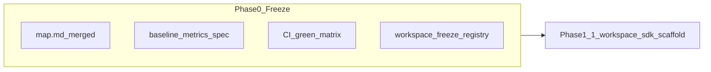
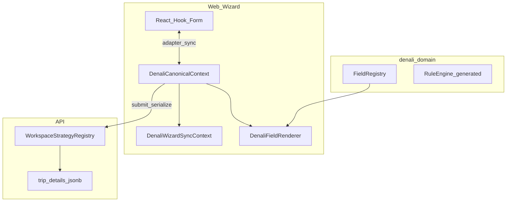
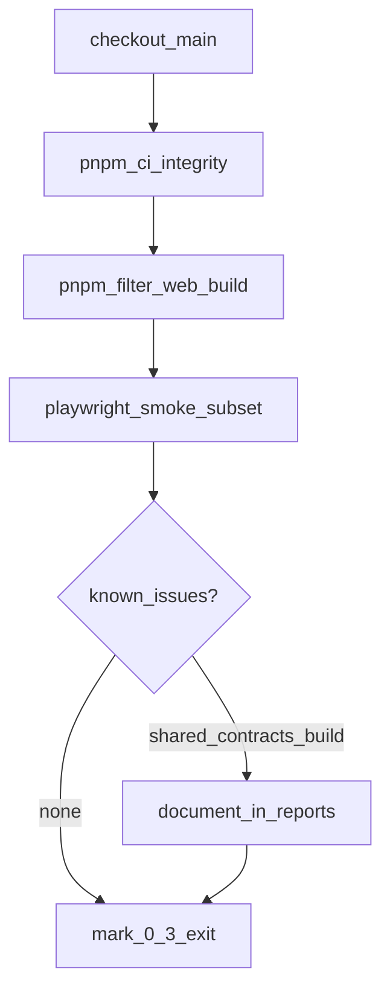
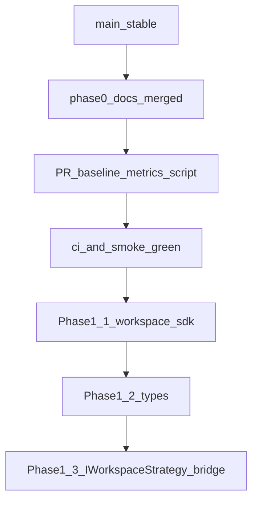

# Phase 0 — Freeze & Platform Baseline

**Tour Ops — راهنمای اجرایی فاز صفر (قبل از `workspace-sdk`)**

> **نقش این سند:** بسط عمیق فاز ۰ در [`map.md`](map.md) — baseline، مسیر، exit criteria، و پل به Phase 1.1  
> **North Star:** Platform logic = generic · Workspace logic = injectable  
> **وضعیت repo:** branch `main` · پس از حذف classic stack و merge نقشهٔ migration  
> **هم‌تراز با:** commit نقشه `6a37145` و بعد

---

## فهرست

1. [جایگاه در نقشه و تعریف فاز صفر](#1-جایگاه-در-نقشه-و-تعریف-فاز-صفر)
2. [تفکیک دو «Phase 0»](#2-تفکیک-دو-phase-0)
3. [تحلیل وضعیت فعلی (baseline عمیق)](#3-تحلیل-وضعیت-فعلی-baseline-عمیق)
4. [زیرفاز 0.1 — ثبت نقشه](#4-زیرفاز-01--ثبت-نقشه)
5. [زیرفاز 0.2 — Baseline metrics (طراحی)](#5-زیرفاز-02--baseline-metrics-طراحی)
6. [زیرفاز 0.3 — CI سبز](#6-زیرفاز-03--ci-سبز)
7. [زیرفاز 0.4 — Freeze لیست workspace](#7-زیرفاز-04--freeze-لیست-workspace)
8. [مسیر پس از Phase 0 → Phase 1.1](#8-مسیر-پس-از-phase-0--phase-11)
9. [آنچه در Phase 0 انجام نمی‌شود](#9-آنچه-در-phase-0-انجام-نمی‌شود)
10. [ریسک‌ها و mitigation](#10-ریسک‌ها-و-mitigation)
11. [پیوست‌ها](#11-پیوست‌ها)

---

## 1. جایگاه در نقشه و تعریف فاز صفر

### 1.1 چرا فاز صفر وجود دارد؟

مهاجرت از معماری **Denali-locked** به **Workspace-Based Platform** (فازهای ۱ تا ۵ در `map.md`) بدون baseline قابل اندازه‌گیری، منجر به:

- PRهایی که هم‌زمان refactor ساختاری و رفتار جدید می‌آورند و regression را غیرقابل تشخیص می‌کنند؛
- بحث‌های بی‌پایان دربارهٔ «چقدر Denali در core مانده» بدون عدد ثابت؛
- شکستن smoke/integration بدون اینکه بدانیم آیا به‌خاطر migration است یا باگ جدید.

**فاز صفر = Freeze:** توقف عمدی هر جابجایی ساختاری بزرگ تا:

1. نقشهٔ North Star ثبت و merge شده باشد (`map.md`);
2. متریک‌های اولیه per-layer ثبت شوند (اسکریپت 0.2 — PR جدا);
3. CI و smoke حداقلی روی `main` سبز و مستند باشند;
4. لیست `TourFormProfile` و tenantهای QA **منجمد** شود تا Phase 1 contract روی زمین لغزان نسازد.

### 1.2 DAG فاز صفر



**Overlap مجاز در فاز صفر:** فقط باگ‌فیکس‌های blocker CI، به‌روزرسانی این سند، و اجرای دستی/اسکریپت baseline.

**Overlap ممنوع:** شروع `packages/workspace-sdk`، جابجایی `denali-domain`، تغییر DB schema، حذف `DenaliWizardSyncContext`.

### 1.3 ارتباط با فازهای بعد

| فاز بعد | وابستگی به خروج Phase 0 |
|---------|-------------------------|
| 1.1 `workspace-sdk` scaffold | CI سبز + freeze profile + baseline JSON |
| 2.x Denali isolation | baseline `denali_token_count` برای regression |
| 3.x Renderer | baseline `direct_form_controls` + composite list |
| 4a Canonical SoT | baseline dual-state file list |
| 5 Data layer | freeze DB columns تا cutover |

---

## 2. تفکیک دو «Phase 0»

در این monorepo دو سند «Phase 0» معنی متفاوت دارند — **اشتباه گرفتن آن‌ها خطرناک است.**

| سند | حوزه | هدف |
|-----|------|-----|
| **این فایل** (`phase-0-platform-baseline.md`) | Platform transformation | Freeze قبل از `workspace-sdk` / plugin architecture |
| [`docs/phase0-safety-net-baseline.md`](docs/phase0-safety-net-baseline.md) | Draft Engine FSM | رفتار draft (restore، retry، navigation) قبل از refactor موتور draft |

**قانون:** PR مربوط به platform migration به فاز ۱–۵ در `map.md` ارجاع دهد؛ PR مربوط به draft FSM به `docs/phase0-safety-net-baseline.md`.

---

## 3. تحلیل وضعیت فعلی (baseline عمیق)

این بخش **وضعیت لحظهٔ ثبت** را توصیف می‌کند (نه هدف نهایی). اعداد `rg` در [پیوست A](#پیوست-a--دستورات-baseline-دستی) قابل تکرار هستند؛ تاریخ اجرا را در گزارش JSON فاز 0.2 ثبت کنید.

### 3.1 جدول لایه‌ای

| لایه | مسیر(های) کلیدی | وضعیت | شواهد عملی |
|------|------------------|--------|------------|
| Domain / registry | `packages/denali-domain/` | Denali-named، نه plugin | پکیج `@repo/denali-domain` در chain `pnpm build` ریشه |
| Types / wire | `packages/types/src/denali/` | coupling شدید | export `./denali` در `packages/types/package.json` |
| Shared contracts | `packages/shared-contracts/src/tours/workspaces/denali*.ts`, `denali-wizard.contract.ts` | coupling | validation و invariantهای Denali در لایهٔ مشترک |
| API tours | `apps/api/src/modules/tours/` | Denali-aware | `DENALI_STRATEGY_PROFILES`, `stripDenali*`, `usesDenaliCanonicalTemplate` |
| Web features | `apps/web/src/features/tours/` | مرکز coupling | `wizard/denali/**`, `denali/fields`, composites |
| Web shell | `apps/web/src/components/tours/wizard/WorkspaceTourWizard.tsx` | binding به Denali | `wizard/bindings/denali.ts` |
| Data | `TourEntity` + `TourDetails.trip_details` jsonb | hybrid | `form_profile_snapshot`؛ هنوز بدون `workspace_type` + `canonical_data` یکپارچه |
| Generic core | `libs/core/`, `packages/draft-engine/` | الگوی هدف | `libs/core`: بدون token `denali`؛ draft-engine تقریباً generic |

### 3.2 شمارش تقریبی token `denali` (خطوط تطبیق `rg -i`)

> **توجه:** این اعداد شامل تست، generated، و کامنت هم می‌شوند — برای regression از همان دستور پیوست A استفاده کنید، نه از عدد مطلق.

| لایه | خطوط تطبیق (نمونهٔ ثبت‌شده) |
|------|---------------------------|
| `packages/denali-domain` | ~2680 |
| `packages/types/src/denali` | ~489 |
| `packages/shared-contracts` | ~175 |
| `apps/api/src/modules/tours` | ~208 |
| `apps/web/src/features/tours` | ~6275 |
| `apps/web/src/components/tours` | ~170 |
| `libs/core` | 0 |
| `packages/draft-engine` | ~1 (غیرمعماری) |

**تفسیر:** بیشترین چگالی coupling در **web features/tours** است — طبیعی است چون UI ویزارد هنوز Denali-first است؛ هدف فاز ۲–۳ جدا کردن plugin است، نه صفر کردن ناگهانی این عدد در فاز ۰.

### 3.3 امتیاز بلوغ کیفی (baseline — با disclaimer)

این اعداد از ممیزی‌های معماری قبلی (قبل از freeze) گرفته شده‌اند؛ **هدف فاز ۰ ثبت آن‌هاست، نه بهبود فوری.**

| بعد | تخمین | معنی |
|-----|--------|------|
| Registry-placed fields | ~85–90% | بیشتر stepها از `DenaliRegistryFields` / registry path |
| Renderer-unified | ~60% | هنوز bypass در compositeها و برخی sectionها |
| Single canonical SoT | خیر | `DenaliCanonicalContext` + RHF + `DenaliWizardSyncContext` |
| Workspace-agnostic core | خیر | `denali` در API، types، contracts، web shell |
| `legacy_archive` در runtime | حذف شده | ارجاع باقی‌مانده فقط در **docs** قدیمی (مثلاً `quarantine-integrity-check.md`) |

**هدف پس از Phase 4a:** Single SoT · پس از Phase 3: renderer ~100% در wizard path · پس از Phase 2: core بدون import مستقیم denali-domain.

### 3.4 جریان دادهٔ فعلی (چرا Single SoT نیست)



**نتیجهٔ تحلیلی:** تا Phase 4a، هر تغییر فیلد باید هم‌راستایی RHF path، canonical path، و (برای template) `canonical_data` در DB را در نظر بگیرد — فاز ۰ این واقعیت را freeze می‌کند تا Phase 1 contract (`CanonicalDocument`) دقیق طراحی شود.

### 3.5 Hotspots حذف (اولویت پس از freeze — برای فاز ۲–۳)

**API**

| فایل / نماد | نقش |
|-------------|------|
| `workspace.strategy.registry.ts` | `DENALI_STRATEGY_PROFILES`, `usesDenaliCanonicalTemplate` |
| `mountain-outdoor.workspace.strategy.ts` | رفتار `denali_pilot` / `urban_event` |
| `create-tour-form-profile-strip.ts` | `stripDenaliSingleDayLogistics` |
| `trip-details.dto` / `tour-details.entity` | persist شکل Denali در jsonb |

**Web**

| مسیر | نقش |
|------|------|
| `wizard/denali/**` | steps، sync، canonical adapter |
| `denali/fields/DenaliFieldRenderer.tsx` | renderer مرکزی |
| `wizard/bindings/denali.ts` | binding shell به Denali |
| `WorkspaceTourWizard.tsx` | shell مشترک با import Denali |
| Composites (لیست ثابت زیر) | bypass renderer |

**لیست ثابت composite / bypass (baseline schema-driven audit):**

- `apps/web/src/features/tours/denali/widgets/DenaliProgramContentSection.tsx`
- `apps/web/src/features/tours/denali/widgets/DenaliPricingParticipantSection.tsx`
- `apps/web/src/features/tours/denali/widgets/DenaliDailyItinerarySection.tsx`
- `apps/web/src/features/tours/wizard/denali/steps/DenaliProgramContentSection.tsx` (re-export / step wrapper)
- `apps/web/src/features/tours/wizard/denali/steps/DenaliPricingParticipantSection.tsx`
- `apps/web/src/features/tours/wizard/denali/steps/DenaliDailyItinerarySection.tsx`
- `apps/web/src/features/tours/wizard/DenaliTourCreationPresetBanner.tsx`

**DB (Phase 5)**

- `TourEntity.form_profile_snapshot`
- `TourDetails.trip_details` به‌عنوان store غنی Denali
- ستون‌های projected (`starts_on`, `ends_on`, …) از logistics استخراج‌شده

### 3.6 لایه‌های «سبز» (الگو برای `platform-core`)

| مسیر | چرا مرجع است |
|------|----------------|
| `libs/core/` | types/config tenant بدون Denali |
| `packages/draft-engine/` | موتور draft generic |
| `apps/web/src/features/tours/wizard/shell/layout.ts` | layout shell بدون import denali (طبق ممیزی قبلی) |

---

## 4. زیرفاز 0.1 — ثبت نقشه

### 4.1 هدف

ثبت **قرارداد اجتماعی** تیم: همهٔ refactorهای ساختاری به فاز مشخص در `map.md` متصل می‌شوند.

### 4.2 وضعیت

| معیار | وضعیت |
|--------|--------|
| `map.md` در روت merge شده | انجام شده |
| فازبندی 0→5 + guardrails + DAG | موجود در `map.md` §5–8 |
| لینک دوطرفه `map.md` ↔ این سند | انجام شده (§5 + «شروع اجرا» در `map.md`) |
| PR template با `Phase: N.M` | انجام شده (`.github/pull_request_template.md`) |
| ارجاع در `AGENTS.md` و Draft Phase 0 doc | انجام شده |

### 4.3 مسیر اجرایی

1. هر PR جدید در description بنویسد: `Phase: N.M` (مثلاً `Phase: 0.3`).
2. اگر کار در نقشه نیست → اول `map.md` را به‌روز کنید (PR جدا)، بعد implementation.
3. تصمیم‌های معماری که North Star را عوض می‌کنند → بخش 4 `map.md` (اصول غیرقابل مذاکره).

### 4.4 Exit criteria

- [x] `map.md` روی `main`
- [x] `phase-0-platform-baseline.md` روی `main`
- [x] تیم از تفکیک Draft FSM Phase 0 آگاه است (§2؛ `docs/phase0-safety-net-baseline.md`, `AGENTS.md`, PR template)

**وضعیت زیرفاز 0.1:** تکمیل.

---

## 5. زیرفاز 0.2 — Baseline metrics

**اسکریپت:** `scripts/platform-transformation/baseline-metrics.mjs` · **اجرا:** `pnpm run baseline:platform-metrics`  
**خط مبنای ثبت‌شده:** [`reports/phase-0-baseline-2026-06-01.json`](reports/phase-0-baseline-2026-06-01.json) (به‌روز با همان دستور و تاریخ جدید)

### 5.1 هدف

تولید گزارش reproducible برای regression در فازهای ۱+؛ پاسخ به: «آیا این PR coupling را بدتر کرد؟»

### 5.2 ورودی / خروجی

| | مشخصات |
|---|--------|
| **ورودی** | globهای ثابت per layer (جدول §3.1) |
| **خروجی JSON** | `reports/phase-0-baseline-YYYY-MM-DD.json` |
| **خروجی MD** | `reports/phase-0-baseline-YYYY-MM-DD.md` (خلاصه انسانی) |
| **اجرای محلی** | `pnpm run baseline:platform-metrics` |

### 5.3 متریک‌ها (schema پیشنهادی JSON)

```json
{
  "generatedAt": "ISO-8601",
  "gitSha": "short-sha",
  "layers": {
    "packages/denali-domain": { "denali_token_count": 0 }
  },
  "global": {
    "denali_import_edges": {
      "@repo/denali-domain": 0,
      "@repo/types/denali": 0
    },
    "direct_form_controls_wizard": 0,
    "strategy_profile_constants": 0,
    "dual_state_files": [],
    "composite_bypass_files": []
  }
}
```

| کلید | تعریف | دستور مرجع |
|------|--------|------------|
| `denali_token_count` | تعداد خطوط `rg -i denali` در glob لایه | پیوست A |
| `denali_import_edges` | تعداد فایل‌های `.ts/.tsx` با import از `@repo/denali-domain` یا `@repo/types/denali` | پیوست A |
| `direct_form_controls_wizard` | `<input\|<select\|<textarea` در `apps/web/**/wizard/**` غیر spec/test | پیوست A |
| `strategy_profile_constants` | تطبیق `DENALI_STRATEGY_PROFILES`, `stripDenali`, `usesDenaliCanonicalTemplate` | پیوست A |
| `dual_state_files` | فایل‌هایی که هم `useFormContext`/`register` و هم `updateCanonical`/`DenaliCanonicalContext` دارند | لیست seed در §5.4 |
| `composite_bypass_files` | لیست ثابت §3.5 | hash per file |

### 5.4 Seed list — dual state (برای اسکریپت آینده)

فایل‌های شناخته‌شده (حداقل):

- `apps/web/src/features/tours/wizard/denali/DenaliCanonicalContext.tsx`
- `apps/web/src/features/tours/wizard/denali/DenaliWizardSyncContext.tsx`
- `apps/web/src/components/tours/wizard/WorkspaceTourWizard.tsx`
- `apps/web/src/features/tours/wizard/denali/hooks/useDenaliCanonicalModel.ts`
- `apps/web/src/features/tours/wizard/denali/denaliCanonicalFormAdapter.ts`

### 5.5 سیاست regression

| از فاز | رفتار |
|--------|--------|
| 0.2 merge | اولین JSON baseline = «خط مبنا» |
| 1+ | CI non-blocking: گزارش diff در PR comment |
| 2+ | افزایش `denali_import_edges` در `platform-core` / `workspace-sdk` = **fail** |
| 3+ | افزایش `direct_form_controls_wizard` = **fail** |

### 5.6 Exit criteria

- [x] اسکریپت `baseline-metrics.mjs` merge
- [x] حداقل یک JSON در `reports/` با تاریخ و sha ([`reports/phase-0-baseline-2026-06-01.json`](reports/phase-0-baseline-2026-06-01.json))
- [x] این سند به مسیر JSON لینک دهد

**وضعیت زیرفاز 0.2:** تکمیل — گام بعدی [0.3 CI سبز](#6-زیرفاز-03--ci-سبز).

---

## 6. زیرفاز 0.3 — CI سبز

### 6.1 هدف

ثبت اینکه **`main` قابل اعتماد است** قبل از اولین PR ساختاری (`workspace-sdk`).

### 6.2 ماتریس Gate

| Gate | دستور | Blocking برای merge؟ | یادداشت |
|------|--------|----------------------|---------|
| Full integrity | `pnpm run ci:integrity` | بله (pre-commit) | eslint + depcruise + unit + query-key |
| Web production build | `pnpm --filter @apps/web build` | بله | شامل `verify:denali-architecture` |
| Denali registry audit | `pnpm --filter @apps/web audit:denali-registry` | بله (در build) | drift registry ↔ generated |
| Structural guards | `pnpm --filter @apps/web test:structural-guards` | توصیه قوی | `wizard/denali/__tests__/guards` |
| API template integrity | `cd apps/api && pnpm exec tsx src/scripts/audit-structural-integrity.ts` | گزارش | آخرین گزارش: 0 discrepancy در `final-integrity-report.md` |
| Tenant E2E isolation | `pnpm test:e2e:isolation` | قبل از merge بزرگ | types + shared build + migrate + api e2e |
| Draft engine unit | `pnpm --filter @repo/draft-engine run test` | برای PRهای draft | مرجع `docs/phase0-safety-net-baseline.md` |

### 6.3 Smoke حداقلی (Playwright)

اجرا از `apps/web` (مسیر صحیح specs):

```bash
pnpm run build:smoke
CI=1 PW_NO_REUSE_SERVER=1 pnpm exec playwright test -c playwright.smoke.config.ts \
  src/features/tours/__tests__/smoke/12-denali-verification-matrix.spec.ts \
  src/features/tours/__tests__/smoke/04-tour-wizard-urban-profile.spec.ts \
  src/features/tours/__tests__/smoke/10-denali-wizard-shell.spec.ts
```

یا کل سوئیت رسمی: `pnpm run qa:smoke:tour-wizard`  
**ثبت نتیجه:** [`reports/phase-0-ci-gate-2026-06-01.json`](reports/phase-0-ci-gate-2026-06-01.json) · **اجرای gate:** `pnpm run phase-0:ci-gate`

**پوشش:**

- Denali: matrix، shell، draft/navigation (بخشی)
- Urban: `urban_event` profile
- Cross-profile: از طریق mix specs در integration (اختیاری در gate کامل)

لیست کامل smoke/integration: [پیوست C](#پیوست-c--playwright-baseline).

### 6.4 مسیر اجرایی پیشنهادی (maintainer)



1. `pnpm run ci:integrity` — ثبت زمان اجرا (~۱–۲ دقیقه بسته به سخت‌افزار).
2. `pnpm --filter @apps/web build` — اگر شکست خورد، لاگ `verify:denali-architecture` را جدا بررسی کنید.
3. smoke subset بالا.
4. **Known issues** را جدا از blocker ثبت کنید (§6.5).

### 6.5 Known issues (ثبت baseline — بدون رفع اجباری در فاز ۰)

| موضوع | علامت | سیاست فاز ۰ |
|--------|--------|-------------|
| Node engine | `package.json` می‌خواهد Node 24؛ محیط dev ممکن است 22 باشد | WARN در گزارش؛ CI باید نسخهٔ درست داشته باشد |
| Root `pnpm build` | ممکن است `@repo/shared-contracts` → `@repo/types/denali` بشکند | ثبت؛ رفع در Phase 1 اگر SDK به shared-contracts وابسته شود |
| `legacy_archive` در docs | `quarantine-integrity-check.md`, `final-trace-audit.md` | به‌روز docs اختیاری؛ runtime صفر |
| Playwright smoke regression | `qa:smoke:tour-wizard` — `workspace-tour-wizard` گاهی mount نمی‌شود | ثبت 2026-06-01 در CI gate report؛ follow-up قبل از 1.1 |

### 6.6 اصل freeze در 0.3

- **مجاز:** fix تست شکسته، lint، typo در guard، به‌روزرسانی snapshot با رفتار یکسان.
- **ممنوع:** جابجایی پکیج، rename گسترده `Denali*`, تغییر schema DB, حذف sync layer.

### 6.7 Exit criteria

- [x] آخرین اجرای موفق `ci:integrity` روی `main` ([`reports/phase-0-ci-gate-2026-06-01.json`](reports/phase-0-ci-gate-2026-06-01.json))
- [x] `@apps/web build` سبز (همان گزارش)
- [x] smoke subset §6.3 سبز — `pnpm run qa:smoke:tour-wizard` → 7 passed (2026-06-01)
- [x] known issues §6.5 در `reports/` ثبت شده

**وضعیت زیرفاز 0.3:** تکمیل.

---

## 7. زیرفاز 0.4 — Freeze لیست workspace

### 7.1 هدف

منجمد کردن **معنی** `TourFormProfile` و tenantهای QA تا contract Phase 1 روی مجموعهٔ بستهٔ شناخته‌شده ساخته شود.

**منبع truth نوع:** `packages/types/src/tour-form-profile.ts` — `TOUR_FORM_PROFILE_VALUES`.

### 7.2 جدول پروفایل‌ها

| Profile | نقش در migration | API strategy | `canonical_data` template |
|---------|------------------|--------------|---------------------------|
| `general` | default کلاسیک | `GeneralWorkspaceStrategy` | خیر |
| `mountain_outdoor` | vertical legacy | `GeneralWorkspaceStrategy` (یا mixed) | خیر |
| `nature_trip` | vertical legacy | General | خیر |
| `urban_event` | **workspace دوم** (هدف Phase 4b) | `MountainOutdoorWorkspaceStrategy` | خیر (فعلاً) |
| `cinema_event` | **frozen** — بدون توسعه در migration | General | خیر |
| `cultural_tour` | **frozen** | General | خیر |
| `denali_pilot` | ویزارد ۶ تب Denali | `MountainOutdoorWorkspaceStrategy` | **بله** (`usesDenaliCanonicalTemplate`) |

**ثابت‌های API مرتبط** (`workspace.strategy.registry.ts`):

```typescript
export const DENALI_STRATEGY_PROFILES = ["denali_pilot", "urban_event"] as const;

export function usesDenaliCanonicalTemplate(profile: TourFormProfile): boolean {
  return profile === "denali_pilot";
}
```

### 7.3 قوانین freeze (تا پایان Phase 1)

| قانون | جزئیات |
|--------|--------|
| پروفایل جدید | **ممنوع** اضافه به `TOUR_FORM_PROFILE_VALUES` |
| rename `denali_*` در API/core | **ممنوع** تا Phase 2 |
| `TOUR_FORM_PROFILE_VERSION` | فقط با bump + تست snapshot |
| تغییر strip/invariant | مجاز فقط bugfix با تست موجود؛ بدون گسترش scope |
| tenant QA جدید | ترجیحاً ممنوع؛ از slugهای موجود استفاده کنید |

### 7.4 Tenant / slug مرجع QA

از `apps/api/package.json` (scripts):

| Slug | نقش |
|------|------|
| `denali` | Denali pilot کامل |
| `urban-demo` | urban_event |
| `mix-demo` | flip / mix profile |

دستور نمونه probe:

```bash
pnpm --filter @apps/api run qa:probe-wizard-tenants
```

### 7.5 تحلیل مسیر: چرا urban و denali هر دو `MountainOutdoorWorkspaceStrategy`؟

این **وضعیت موقت** است: API هنوز workspace را به‌صورت plugin load نمی‌کند، بلکه از `TourFormProfile` به strategy class map می‌کند. در Phase 2:

- `denali_pilot` → plugin `workspaces/denali`
- `urban_event` → plugin `workspaces/urban` (Phase 4b)

فاز ۰ این coupling را **ثبت** می‌کند تا Phase 1 `WorkspacePlugin` contract دقیقاً این دو رفتار را پوشش دهد.

### 7.6 Exit criteria

- [x] لیست پروفایل در این سند و `tour-form-profile.ts` هم‌خوان
- [x] ثبت machine-readable: [`reports/phase-0-workspace-freeze.json`](reports/phase-0-workspace-freeze.json)
- [x] تیم freeze را در PR template ذکر می‌کند (`Phase: N.M` + عدم افزودن پروفایل)
- [x] هیچ PR باز برای پروفایل هشتم در flight نیست

**وضعیت زیرفاز 0.4:** تکمیل — ورود به Phase 1.1 پس از review گزارش‌های `reports/`.

---

## 8. مسیر پس از Phase 0 → Phase 1.1

### 8.1 چک‌لیست ورود به Phase 1.1

همه باید tick شوند:

- [x] `map.md` merge
- [x] `phase-0-platform-baseline.md` merge
- [x] `reports/phase-0-baseline-*.json` اولیه ([`reports/phase-0-baseline-2026-06-01.json`](reports/phase-0-baseline-2026-06-01.json))
- [x] `pnpm run ci:integrity` سبز ([CI gate report](reports/phase-0-ci-gate-2026-06-01.json))
- [x] smoke §6.3 سبز (`qa:smoke:tour-wizard`)
- [ ] hotspot list §3.5 بدون تغییر scope در همان PR

### 8.2 اولین PR ساختاری

**Phase 1.1:** scaffold `packages/workspace-sdk`

| معیار | شرط |
|--------|------|
| Package name | `@repo/workspace-sdk` |
| Imports | **صفر** از `@repo/denali-domain` |
| Types اولیه | `WorkspacePlugin`, `WorkspaceFieldRegistry`, `WorkspaceRuleSet`, `CanonicalDocument` (طبق `map.md` §5 Phase 1) |
| Tests | mock plugin unit test |



### 8.3 چه چیزی عمداً بعد از 1.1 می‌آید

| کار | فاز |
|-----|-----|
| Move `denali-domain` | 2.2 |
| `WorkspacePluginRegistry` در API | 2.3 |
| `GenericFieldRenderer` | 3.1 |
| حذف dual sync | 4a |
| `workspaces/urban` E2E | 4b |
| DB `canonical_data` | 5 |

---

## 9. آنچه در Phase 0 انجام نمی‌شود

| کار | فاز صحیح | دلیل تأخیر |
|-----|----------|------------|
| جابجایی `packages/denali-domain` → `packages/workspaces/denali` | 2.2 | بدون SDK contract خطر breaking است |
| حذف `DenaliWizardSyncContext` | 4a | نیاز به `CanonicalStore` |
| ESLint ممنوعیت `<input>` در wizard | 3.5 | قبل از renderer کامل false positive زیاد |
| migration `canonical_data` JSONB | 5 | وابسته به plugin + SoT |
| حذف `legacy_archive/` | انجام شده | فقط تأیید: runtime بدون import |
| افزودن workspace سوم | بعد از 4b | DoD platform = denali + urban |
| رفع کامل `@repo/shared-contracts` build | 1 یا 2 | ثبت در known issues |

---

## 10. ریسک‌ها و mitigation

| ریسک | احتمال | اثر | Mitigation |
|------|--------|-----|------------|
| اشتباه گرفتن دو Phase 0 | متوسط | تست اشتباه / scope اشتباه | §2 + لینک در PR template |
| baseline بدون عدد | بالا تا 0.2 | regression نامشخص | پیوست A فوری؛ اسکریپت PR بعد |
| CI طولانی | بالا | کند شدن merge | smoke subset §6.3 روزانه؛ full gate قبل merge |
| افزایش coupling در «فقط doc» PR | پایین | خط مبنا کثیف | freeze §9 |
| `shared-contracts` build شکسته | متوسط | block Phase 1 | tracked known issue؛ تست در 1.1 |
| فشار برای پروفایل هشتم | متوسط | contract explosion | freeze §7.3 |
| composite bypass پنهان | متوسط | Phase 3 طولانی | لیست ثابت §3.5 در metrics |

---

## 11. پیوست‌ها

### پیوست A — دستورات baseline دستی

اجرا از **ریشه repo**. خروجی را در `reports/phase-0-baseline-manual-YYYY-MM-DD.txt` ذخیره کنید.

```bash
# تاریخ و sha
date -Iseconds
git rev-parse --short HEAD

# 1) denali_token_count per layer
for d in \
  packages/denali-domain \
  packages/types/src/denali \
  packages/shared-contracts \
  apps/api/src/modules/tours \
  apps/web/src/features/tours \
  apps/web/src/components/tours \
  libs/core \
  packages/draft-engine
do
  if [ -d "$d" ]; then
    printf "%s: " "$d"
    rg -i denali "$d" 2>/dev/null | wc -l
  fi
done

# 2) denali_import_edges — تعداد فایل importer
echo "@repo/denali-domain importers:"
rg -l '@repo/denali-domain' --glob '*.{ts,tsx}' | wc -l
echo "@repo/types/denali importers:"
rg -l '@repo/types/denali' --glob '*.{ts,tsx}' | wc -l

# 3) direct_form_controls در wizard (غیر تست)
rg '<input|<select|<textarea' apps/web/src/features/tours/wizard \
  --glob '*.{tsx,ts}' \
  --glob '!*.spec.*' \
  --glob '!*.test.*' \
  --glob '!**/__tests__/**' \
  --glob '!**/__benchmarks__/**' \
  -c | awk -F: '{s+=$2} END {print "matches:", s+0}'

# 4) strategy / strip constants
rg -n 'DENALI_STRATEGY_PROFILES|stripDenali|usesDenaliCanonicalTemplate' \
  apps/api --glob '*.{ts,tsx}'

# 5) dual state filenames
rg -l 'DenaliWizardSyncContext|DenaliCanonicalContext' apps/web --glob '*.{ts,tsx}'

# 6) هدف نهایی (بعد از migration — الان باید >0 باشد)
rg -i denali packages/platform-core packages/workspace-sdk 2>/dev/null || true

# 7) legacy_archive (باید فقط docs باشد)
rg -l legacy_archive . --glob '!node_modules' --glob '!.next' --glob '!dist'
```

### پیوست B — فهرست فایل‌های hotspot

**Registry / codegen**

- `packages/denali-domain/src/registry/denaliFieldRegistryData.ts`
- `apps/web/scripts/generate-denali-wizard-config.ts`
- `packages/denali-domain/src/rules/generated/denaliRuleSet.generated.ts`

**Adapter / sync**

- `apps/web/src/features/tours/wizard/denali/denaliCanonicalFormAdapter.ts`
- `apps/web/src/features/tours/wizard/denali/DenaliWizardSyncContext.tsx`
- `apps/web/src/features/tours/wizard/denali/DenaliCanonicalContext.tsx`
- `apps/web/src/features/tours/drafts/denali-adapter.ts` (در صورت وجود)

**Shell / bindings**

- `apps/web/src/components/tours/wizard/WorkspaceTourWizard.tsx`
- `apps/web/src/features/tours/wizard/bindings/denali.ts`
- `apps/web/src/features/tours/wizard/shell/layout.ts`

**API**

- `apps/api/src/modules/tours/strategies/workspace.strategy.registry.ts`
- `apps/api/src/modules/tours/strategies/mountain-outdoor.workspace.strategy.ts`
- `apps/api/src/modules/tours/utils/create-tour-form-profile-strip.ts`

**Contracts**

- `packages/shared-contracts/src/tours/workspaces/denali.ts`
- `packages/shared-contracts/src/tours/denali-wizard.contract.ts`

**Integrity tooling**

- `apps/web/scripts/verify-denali-architecture.ts`
- `apps/web/scripts/final-integrity-audit.mjs`
- `apps/api/src/scripts/audit-structural-integrity.ts`

### پیوست C — Playwright baseline

**Smoke** (`apps/web/tests/smoke/`):

- `01-tour-wizard-new.spec.ts`
- `02-tour-wizard-cinema-theme-profile.spec.ts`
- `04-tour-wizard-urban-profile.spec.ts`
- `05-tour-wizard-preset-form-profile-filter.spec.ts`
- `08-tour-wizard-mix-profile-flip.spec.ts`
- `10-denali-wizard-shell.spec.ts`
- `11-denali-review-participants.spec.ts`
- `12-denali-verification-matrix.spec.ts`
- `13-denali-wizard-map-fields-dom.spec.ts`

**Integration** (`apps/web/tests/integration/`):

- `wizard-real-stack.shell.spec.ts`
- `wizard-real-stack.submit-urban.spec.ts`
- `wizard-real-stack.submit-mix-urban.spec.ts`
- `wizard-real-stack.submit-denali-mountain.spec.ts`
- `wizard-real-stack.submit-denali-matrix.spec.ts`
- `wizard-real-stack.submit-denali-from-preset.spec.ts`
- `wizard-real-stack.submit-denali-from-preset-in-wizard.spec.ts`
- `wizard-real-stack.submit-denali-from-clone.spec.ts`
- `wizard-real-stack.denali-map-fields.spec.ts`

**Draft engine (سند جدا):** `docs/phase0-safety-net-baseline.md`

---

## مرجع سریع

| سند | نقش |
|-----|------|
| [`map.md`](map.md) | نقشهٔ کامل فاز ۱–۵ |
| این فایل | اجرای فاز ۰ |
| [`docs/phase0-safety-net-baseline.md`](docs/phase0-safety-net-baseline.md) | Phase 0 Draft FSM |
| [`final-integrity-report.md`](final-integrity-report.md) | آخرین structural template audit |

**بعد از تکمیل چک‌لیست §8.1 → شروع Phase 1.1 در `map.md`.**
