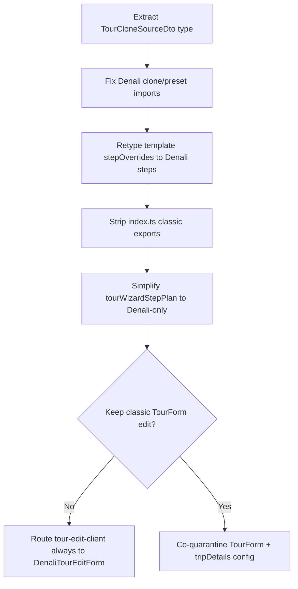

# Quarantine Integrity Check — Import Chain Map

> **فاز ۲ (The Bridge)** — نقشهٔ وابستگی‌ها پس از انتقال فایل‌های classic به `legacy_archive/`.  
> هر ردیف: فایلِ فعال (خارج از آرشیو) که هنوز به مسیر quarantine شده import می‌زند.

**آخرین به‌روزرسانی:** 2026-06-01  
**مسیر آرشیو:** `apps/web/src/features/tours/legacy_archive/`

---

## وضعیت workspace

- **`legacy_archive/` EXISTS** — Phase 1 quarantine + Denali bridge completed 2026-06-01.
- اسکریپت تکرارپذیر: `apps/web/scripts/quarantine-classic-to-legacy-archive.sh`
- `apps/web/tsconfig.json` excludes `**/legacy_archive/**` from default `tsc`; audit script may still pull archive modules.

### Phase 1 checklist

| Item | Status |
|------|--------|
| Batch A/B/C `git mv` under `legacy_archive/` | Done |
| `TourCloneSourceDto` → `clone/tourCloneSource.types.ts` | Done |
| `applyTripDetailsRequirednessToSchema` → `legacy_archive/models/tripDetailsSchemaClassic.ts` | Done |
| Denali template step parser (`parse-denali-wizard-steps.ts`) | Done |
| Preset/clone facades Denali-only (`mapWizardPrefill*`, `tourCreationPresetApply`) | Done |
| `index.ts` + `tourWizardStepPlan` Denali-only | Done |
| Edit route Denali-only (`tour-edit-client.tsx`) | Done |
| Active tree: no imports to `stepConfig` / `schemas/classic` / `legacy_archive` | Done (verify below) |
| `tsc`: no `Cannot find module` outside `legacy_archive/` | Done |

### Verification commands

```bash
# Active tree must not import quarantined paths
rg '@/features/tours/(wizard/stepConfig|schemas/classic|legacy_archive)' apps/web/src --glob '!**/legacy_archive/**' apps/web/app

# Modern path module resolution
cd apps/web && pnpm exec tsc --noEmit 2>&1 | rg "Cannot find module" | rg -v "legacy_archive"

# Denali structural guard (may fail if vitest CJS loads via structural-guard — pre-existing harness)
pnpm --filter web exec node --import tsx --test src/features/tours/wizard/denali/__tests__/guards/denali-section-suppress.guard.test.ts
```

**Remaining (out of Phase 1 scope):** pre-existing Denali type drift in `@repo/denali-domain` / wizard; `legacy_archive/**` internal `tsc` when pulled by `scripts/audit-manual-to-preset-transition.ts`; classic-only smoke specs.

---

## اولویت اصلاح

1. **Denali hot path** — wizard shell، template parsing، clone/preset، public barrel
2. **Classic edit path** — `TourForm` / `tour-edit-client.tsx` (workspaceهای non-Denali)
3. **Ghost references** — حذف import / export مرده
4. **Tests** — به‌روزرسانی یا co-quarantine با classic stack

---

## جدول اصلی — Production (خارج از `legacy_archive`)

| Faulty file | Target in `legacy_archive` | Category | Action required |
|---|---|---|---|
| `apps/web/src/features/tours/index.ts` | `wizard/stepConfig` | **HARD_DEPENDENCY** | **Migrate** — حذف L43–44 (`TourCreateWizardStepId`, `wizardSteps`); مصرف‌کنندگان از `DenaliCreateWizardStepId` در `wizard/denaliStepConfig.ts` |
| `apps/web/src/features/tours/index.ts` | `wizard/profileRules/validation` | **GHOST_REFERENCE** | **Delete import** — حذف L46–50 (`ValidationIssue`, `ValidationIssueCode`, `ValidationResult`); از Denali validation در `@repo/denali-domain` / `wizard/denali/validation/` |
| `apps/web/src/features/tours/wizard/tourWizardStepPlan.ts` | `wizard/stepConfig` | **HARD_DEPENDENCY** | **Migrate** — حذف L4؛ حذف classic branch در `getWizardStepsForContext` (L37); همیشه `getDenaliWizardSteps()` |
| `apps/web/src/features/tours/wizard/tourWizardStepPlan.ts` | `wizard/fieldGroups` | **GHOST_REFERENCE** | **Delete import** — حذف L12 re-export `getVisibleWizardStepsForProfile` |
| `apps/web/src/features/tours/wizard/denaliWizardFieldGroups.ts` | `wizard/fieldGroups` (`FieldGroupId`) | **GHOST_REFERENCE** | **Delete file** — `DENALI_STEP_TO_FIELD_GROUPS` export شده ولی import نمی‌شود |
| `apps/web/src/features/tours/wizard/template/tenant-wizard-template.types.ts` | `wizard/stepConfig` | **HARD_DEPENDENCY** | **Migrate** — L3: `DenaliCreateWizardStepId` از `wizard/denaliStepConfig.ts`؛ به‌روز L5–8 |
| `apps/web/src/features/tours/wizard/template/parse-tenant-wizard-template.ts` | `wizard/template/compose-wizard-steps` | **HARD_DEPENDENCY** | **Migrate** — parser جدید step override بر پایه `denaliWizardSteps` |
| `apps/web/src/features/tours/wizard/template/merge-field-rules-overlay.ts` | `wizard/profileRules/getProfileRules` | **GHOST_REFERENCE** | **Delete file** — فقط در spec خودش؛ settings از `wizard/domain/ruleModelConverter.ts` |
| `apps/web/src/features/tours/observability/tourProfileObservability.ts` | `@/features/tours` → stepConfig + validation | **GHOST_REFERENCE** | **Migrate** — L20–21: `DenaliCreateWizardStepId` + نوع telemetry ساده |
| `apps/web/src/features/tours/clone/transformTourToDenaliWizardValues.ts` | `clone/transformTourToWizardValues` (`TourCloneSourceDto`) | **GHOST_REFERENCE** | **Migrate** — استخراج type به `clone/tourCloneSource.types.ts`؛ L29 |
| `apps/web/src/components/tours/DenaliTourEditForm.tsx` | `clone/transformTourToWizardValues` | **GHOST_REFERENCE** | **Migrate** — L11 → `clone/tourCloneSource.types.ts` |
| `apps/web/src/features/tours/wizard/profiles/denali/mapToDenaliWizardPatch.ts` | `clone/transformTourToWizardValues` | **GHOST_REFERENCE** | **Migrate** — L1 → `clone/tourCloneSource.types.ts` |
| `apps/web/src/features/tours/wizard/profiles/mapWizardPrefillToFormPatch.ts` | `clone/transformTourToWizardValues` | **HARD_DEPENDENCY** (classic branch) | **Migrate** — حذف L3–5 و classic branch L55–58؛ همه از `mapToDenaliWizardPatch` |
| `apps/web/src/features/tours/wizard/profiles/mapPresetToFormPatch.ts` | `wizard/schemas/classic/tourCreateSchema` | **HARD_DEPENDENCY** (classic branch) | **Migrate** — حذف L3 و branch L36؛ فقط `Partial<DenaliCreateTourWizardForm>` |
| `apps/web/src/features/tours/wizard/tourCreationPresetApply.ts` | `classic/tourCreateSchema` + `tenant-tour-form-contract` | **HARD_DEPENDENCY** | **Migrate** — حذف classic preset fns؛ Denali از `orchestrateDenaliWizardFromTemplate` |
| `apps/web/src/features/tours/wizard/tourCreationPresetMatch.ts` | `wizard/schemas/classic/tourCreateSchema` | **GHOST_REFERENCE** (برای Denali) | **Migrate** — split: `listAllTourWizardPresetsSorted` بماند؛ `presetDefaultsToFormPatch` به archive |
| `apps/web/src/features/tours/wizard/TourWizardProfileContext.tsx` | `profileRules` + `tenant-tour-form-contract` | **GHOST_REFERENCE** | **Delete file** — provider هیچ‌جا mount نمی‌شود |
| `apps/web/src/components/tours/TourForm.tsx` | `components/tour-create-trip-details-fields` | **HARD_DEPENDENCY** | **Migrate** — archive با deps یا rebuild روی `DenaliTourEditForm` |
| `apps/web/src/components/tours/TourForm.tsx` | `config/tripDetailsFieldConfigAdapter` | **HARD_DEPENDENCY** | **Migrate** — L28–31: Denali RBAC از registry |
| `apps/web/src/components/tours/TourForm.tsx` | `config/tripDetailsFieldConfig` | **HARD_DEPENDENCY** | **Migrate** — L32 |
| `apps/web/src/components/tours/TourForm.tsx` | `wizard/schemas/classic/tourCreateValidationPolicy` | **HARD_DEPENDENCY** | **Migrate** — L35–38: `denaliWizardFormZod` |
| `apps/web/src/components/tours/tour-schema.ts` | `config/tripDetailsFieldConfigAdapter` | **HARD_DEPENDENCY** | **Migrate** — L33: schema از Denali canonical + registry |
| `apps/web/app/(app)/tours/[id]/edit/tour-edit-client.tsx` | (transitive via `TourForm`) | **HARD_DEPENDENCY** | **Migrate** — L18: Denali-only یا co-archive classic edit |

---

## Classic-only stack (co-quarantine یا refactor)

اگر classic wizard/edit کاملاً retire شود، این‌ها blocker Denali نیستند؛ ولی تا در active tree باشند build می‌شکنند:

| Faulty file | Target in `legacy_archive` | Category | Action |
|---|---|---|---|
| `wizard/wizardStepEngine.ts` | stepConfig, fieldGroups, compose-wizard-steps, validationPolicy, tenant contract, classic schema | **HARD_DEPENDENCY** | Co-archive |
| `wizard/applyTourWizardPatch.ts` | classic schema, tenant contract | **HARD_DEPENDENCY** | Co-archive |
| `wizard/hooks/useTourWizardCreate.ts` | + createTourFromWizard chain | **HARD_DEPENDENCY** | Co-archive |
| `wizard/domain/createTourFromWizard.ts` | fieldGroups, tenant contract, classic schema | **HARD_DEPENDENCY** | Co-archive |
| `wizard/contract/tour-wizard-contract.ts` | classic schema | **HARD_DEPENDENCY** | Co-archive |
| `wizard/domain/mapWizardFormToCreateTourPayload.ts` | classic schema | **HARD_DEPENDENCY** | Co-archive |
| `wizard/tourCreateWizardMerge.ts` | classic schema | **HARD_DEPENDENCY** | Co-archive |
| `wizard/tourCreateFormDefaults.ts` | classic schema | **HARD_DEPENDENCY** | Co-archive |
| `config/tripDetailsFieldConfigAdapter.ts` | profileRules/* | **HARD_DEPENDENCY** | Co-archive با `config/tripDetails*` |

---

## خطوط دقیق برای حذف import (`Delete import`)

| File | Line(s) |
|---|---|
| `features/tours/index.ts` | **43–44**, **46–50** |
| `wizard/tourWizardStepPlan.ts` | **4**, **12** (+ ساده‌سازی L34–37) |
| `wizard/denaliWizardFieldGroups.ts` | **کل فایل** |
| `wizard/TourWizardProfileContext.tsx` | **7–10** (یا کل فایل) |
| `wizard/profiles/mapWizardPrefillToFormPatch.ts` | **3–5**, **55–58** |
| `wizard/profiles/mapPresetToFormPatch.ts` | **3**, **36** |
| `wizard/tourCreationPresetApply.ts` | **3–4**, **11**, classic preset functions |
| `observability/tourProfileObservability.ts` | **20–21** (جایگزینی، نه حذف خام) |

---

## Migration targets — جایگزین Denali

| Legacy import | Modern replacement |
|---|---|
| `wizard/stepConfig` → `TourCreateWizardStepId` / `wizardSteps` | `wizard/denaliStepConfig.ts` → `DenaliCreateWizardStepId`, `denaliWizardSteps`, `getDenaliWizardSteps()` |
| `wizard/fieldGroups` | `@repo/denali-domain` registry + `denaliStepConfig` |
| `wizard/profileRules/*` | `wizard/denali/rules/denaliRuleModel.ts`, `denaliFieldGate.ts`, `denaliRuleAccess.ts` |
| `wizard/profileRules/validation` | `wizard/denali/validation/denaliWizardFormZod.ts`, `applyDenaliWizardStepValidation` |
| `wizard/template/compose-wizard-steps` | `parseDenaliStepOverrides()` روی `denaliWizardSteps` |
| `clone/transformTourToWizardValues` (type) | `clone/tourCloneSource.types.ts` |
| `clone/transformTourToWizardValues` (fn) | `transformTourToDenaliWizardValues.ts` + `mapToDenaliWizardPatch.ts` |
| `contracts/tenant-tour-form-contract` | workspace capabilities + `ruleModelConverter` |
| `config/tripDetailsFieldConfig*` | `denaliRuleAccess`, `DenaliFieldRenderer` |
| `components/tour-create-trip-details-fields` | `denali/fields/DenaliRegistryFields` + widgets |
| `wizard/schemas/classic/*` | `wizard/schemas/denaliCore.schema.ts`, `denaliCanonicalTourSchema.unified.ts` |

---

## Tests / smoke

| File | Legacy target | Action |
|---|---|---|
| `testing/public-test-api.ts` | L1–2, L18 | Delete یا Denali test helpers |
| `__tests__/smoke/tour-wizard-smoke-helpers.ts` | `public-test-api` | → `testing/denaliSubmitTestHelpers` |
| `*.spec.ts` under profileRules, fieldGroups, wizardStepEngine | various | Co-archive یا rewrite Denali |

---

## ترتیب پیشنهادی اصلاح



1. استخراج `TourCloneSourceDto` → `clone/tourCloneSource.types.ts`
2. Retype `tenant-wizard-template.types.ts` + `parse-tenant-wizard-template.ts`
3. پاکسازی `index.ts` + `tourWizardStepPlan.ts`
4. تصمیم classic edit: archive `TourForm` یا Denali-only در `tour-edit-client.tsx`

---

## پرامپت match-making (فاز ۲)

```
من فایل‌های classic را به legacy_archive منتقل کردم. build errors را اسکن کن.
برای هر خطا: [Faulty File] | [Target in legacy_archive] | HARD_DEPENDENCY یا GHOST_REFERENCE | Migrate یا Delete Import (+ شماره خط).
```

---

## فایل‌های quarantine (مرجع Phase 1)

مسیرهایی که باید زیر `legacy_archive/` باشند (ساختار حفظ شود):

```
legacy_archive/wizard/schemas/classic/
legacy_archive/wizard/stepConfig.ts
legacy_archive/wizard/fieldGroups.ts
legacy_archive/wizard/profileRules/
legacy_archive/wizard/profileRulesReact/
legacy_archive/wizard/groups/
legacy_archive/components/tour-create-trip-details-fields.tsx
legacy_archive/config/tripDetails*
legacy_archive/contracts/tenant-tour-form-contract.ts
legacy_archive/clone/transformTourToWizardValues.ts
legacy_archive/wizard/template/compose-wizard-steps.ts
```

**نباید quarantine شوند:** `denali/fields/**`, `DenaliFieldRenderer`, wizard steps با `DenaliRegistryFields`, `denaliStepConfig.ts`.

---

## ارتباط با roadmap کلی

| فاز | سند مرتبط |
|---|---|
| ۱ Quarantine | این فایل + `final-trace-audit.md` |
| ۲ The Bridge | این فایل (جدول اصلاح import) |
| ۳ Automation | `final-integrity-report.md` |
| ۴ Deletion | پس از صفر شدن ردیف‌های HARD در جدول بالا |
