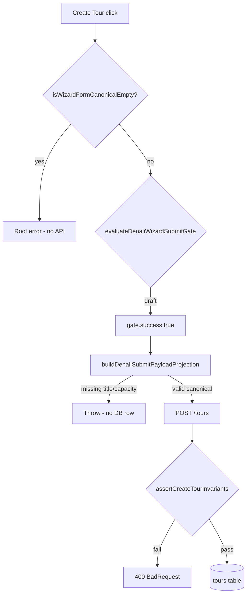

# Hybrid Wizard — Data Integrity Stress Test Audit

**Role:** QA Security Engineer  
**Scope:** Manual Mode tour create, Settings builder preview drift, classification persistence  
**Date:** 2026-06-01

---

## Executive summary

| Scenario | Client | API / DB | Verdict |
|----------|--------|----------|---------|
| **1. Ghost submission** (zero fields, Create Tour) | Blocked (`isWizardFormCanonicalEmpty`) | No request | **PASS** |
| **1b. Partial ghost** (tour type only, no title) | **Not** blocked by empty guard | Projection throws; no corrupt row if UI reaches mutation | **PARTIAL** — gap in draft validation |
| **2. Preview drift** (edit itinerary, no Save) | No warning; preview resets from left panel | N/A (template not updated) | **FAIL (UX)** — silent data loss |
| **3. Classification leak** (no category/duration) | Tour create: blocked without `tourType` | Template save: **partial canonical allowed** (`category` without `duration`) | **PARTIAL** — template DB can hold incomplete classification |

Automated probes: `apps/web/tests/audit/hybrid-wizard-data-integrity.spec.ts`

---

## Test plan

### 1. The “Ghost” submission

**Hypothesis:** Manual Mode with empty form submits and creates a corrupt tour row.

**Preconditions**

- Workspace with Denali profile; navigate to `/tours/new`.
- Template empty or manual path (`manualWizardMode` when pinned template `canonicalData` is `{}`).

**Steps**

| Step | Action | Expected (secure) |
|------|--------|-------------------|
| G1 | Load wizard in Manual Mode, do not touch fields | Form defaults: `title: ""`, `tourType: undefined` |
| G2 | Click **Create Tour** | Root error: `wizard.templateCanonicalEmptyOnSubmit` (FA/EN); **no** `POST /tours` |
| G3 | DevTools: only set `basicInfo.tourType` (e.g. mountain single day), leave title empty | Submit allowed past empty guard |
| G4 | Click **Create Tour** again | Mutation should **fail** in projection (`buildDenaliSubmitPayloadProjection` / `denaliFormToCanonical`); user sees error, not 201 |
| G5 | Direct API fuzz: `POST /api/v2/tours` with `minimalDto` (valid title length, no `tourType`, draft) | **400** or invariant rejection; no undefined `tourType` in DB |

**Code anchors**

```827:833:apps/web/src/components/tours/wizard/WorkspaceTourWizard.tsx
      if (isWizardFormCanonicalEmpty(values)) {
        setError("root", {
          type: "manual",
          message: t("wizard.templateCanonicalEmptyOnSubmit"),
        });
        return;
      }
```

```67:88:apps/web/src/features/tours/wizard/denali/validation/denaliSubmitValidation.ts
 * Client submit gate: full form validation applies only for `publishStatus === "active"`.
 * Draft saves skip structural/rule/canonical blocking on the client.
 */
  if (tourStatus !== "active") {
    return {
      tourStatus,
      submitIssues: [],
      publishIssues: [],
      success: true,
    };
  }
```

**Findings**

- **G1–G2:** `isWizardFormCanonicalEmpty` catches unclassified forms (`denaliCanonicalFromForm` throws → treated as empty). **No API call.**
- **G3–G4:** Selecting only `tourType` makes canonical **non-empty** (keys present, `title: ""`). Empty guard **does not** fire; draft gate **always succeeds**. Submit dies in projection layer — **not** a silent corrupt insert, but **weak UX** (no field-level errors before click).
- **G5:** `CreateTourDto.tourType` is `@IsOptional()`. Draft create relies on `assertCreateTourInvariants` + projection on client; API alone can accept title-only drafts for non-Denali profiles.

**Risk:** Bypass client (custom client / old bundle without guard) → API may persist draft without Denali classification unless invariants catch it.

---

### 2. Drift test (Preview vs Save)

**Hypothesis:** Itinerary edited in Preview without clicking Settings **Save** is either warned or persisted.

**Preconditions**

- Settings → Tour Wizard Template, builder with preview panel.

**Steps**

| Step | Action | Expected (secure) |
|------|--------|-------------------|
| D1 | Change itinerary in **Preview** only | Local preview form state updates |
| D2 | Do **not** click Save; reload page or navigate away | Warning **or** prompt to save |
| D3 | Click Save without preview edits | `packedCanonicalData` from left panel only |
| D4 | Edit preview itinerary, click Save | `packTemplateCanonicalForPersist(preview, left)` merges preview itinerary |

**Findings**

- **No** `beforeunload`, `unsaved`, or dirty-state warning in `apps/web/app/(app)/settings/tour-wizard-template/`.
- Preview re-hydrates from left-panel `packedCanonicalData`; unsaved preview edits are **discarded silently** on navigation/reload.
- Persist path is explicit Save only:

```170:171:apps/web/app/(app)/settings/tour-wizard-template/tour-wizard-template-builder-form.tsx
      const canonicalData = packTemplateCanonicalForPersist(
        previewFormRef.current?.getValues(),
```

**Verdict:** **FAIL (product)** — silent loss of preview edits; not a DB corruption path, but operators can believe itinerary was saved.

**Mitigation (recommended):** Dirty flag comparing `previewFormRef` vs last saved canonical; block navigation or show banner.

---

### 3. Classification leak

**Hypothesis:** Manual flow leaves tours/templates without category/duration.

**Steps**

| Step | Action | Expected |
|------|--------|----------|
| C1 | Manual wizard, never select tour type → Create Tour | Blocked (empty canonical) |
| C2 | Settings save with left panel `category` only (no `duration`, no preview `tourType`) | Reject or default `duration` |
| C3 | Instantiate template with `{ category: "mountain" }` only | Hydration defaults or 400 |

**Findings**

- **Tour create:** Unclassified form → empty guard. Classified partial (tour type only) → see §1b.
- **Template JSONB:** `validateDenaliCanonicalTemplateData` is **deep-partial** — `{ category, title }` without `duration` is **valid** (see existing types spec + stress spec).
- `packTemplateCanonicalForPersist(null, leftFlat)` uses left seeds only when preview lacks `tourType` — can persist **category without duration**.
- `isDenaliCanonicalTemplateDataEmpty` is **any top-level key ≠ undefined**, not semantic completeness — partial seeds are “non-empty” for instantiate gate.

**Verdict:** **PARTIAL** — templates can sit in **semantically incomplete** classification; tour row not created from fully empty manual submit, but **tourType-only** slips past empty guard.

---

## Manual Mode → DB: bad-data paths



| Path | Reaches DB? | Notes |
|------|-------------|-------|
| Zero fields | No | Empty guard |
| tourType only, empty title | No (client projection) | Empty guard **false**; draft gate **open** |
| Valid title + tourType, draft, missing capacity | Unlikely | Projection/invariants |
| Settings: preview itinerary, no Save | No (old template) | Silent UX loss |
| Settings: category only in left panel + Save | **Yes** (template JSONB) | Partial canonical allowed |
| API direct POST minimal draft | Profile-dependent | `tourType` optional on DTO |

---

## Executed automation

```bash
pnpm --filter @apps/web exec node --import tsx --test tests/audit/hybrid-wizard-data-integrity.spec.ts
```

| Test | Result |
|------|--------|
| ghost: zero fields | PASS |
| ghost: tourType-only empty guard | Documents gap (assert false) |
| ghost: tourType-only projection | PASS (throws) |
| classification: category without duration | Documents API/template gap |
| tourType-only canonical non-empty | Documents key-presence empty semantics |

---

## Recommendations (priority)

1. **Draft submit gate:** Run minimal canonical/title/capacity checks for `publishStatus === "draft"` (not only `active`), or tighten `isWizardFormCanonicalEmpty` to semantic completeness (title + classification).
2. **Settings unsaved preview:** Dirty-state banner + `beforeunload` when `previewFormRef` diverges from last saved canonical.
3. **Template classification:** Require `category` + `duration` pair on template PATCH (Zod refine), or default `duration` when `category` set.
4. **Empty semantics:** Consider `isDenaliCanonicalTemplateDataEmpty` → “hydration-ready” helper (title + category + duration) for instantiate + wizard submit alignment.

---

## References

- `reports/hydration-failure-analysis.md`
- `apps/web/lib/validation/tour-wizard-template-builder-form.persist.spec.ts`
- `packages/types/src/denali/isDenaliCanonicalTemplateDataEmpty.ts`
