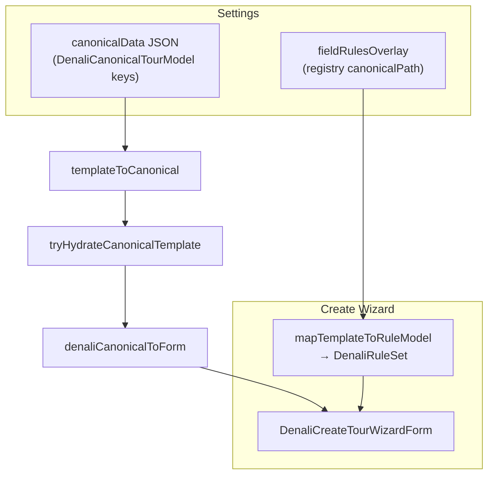
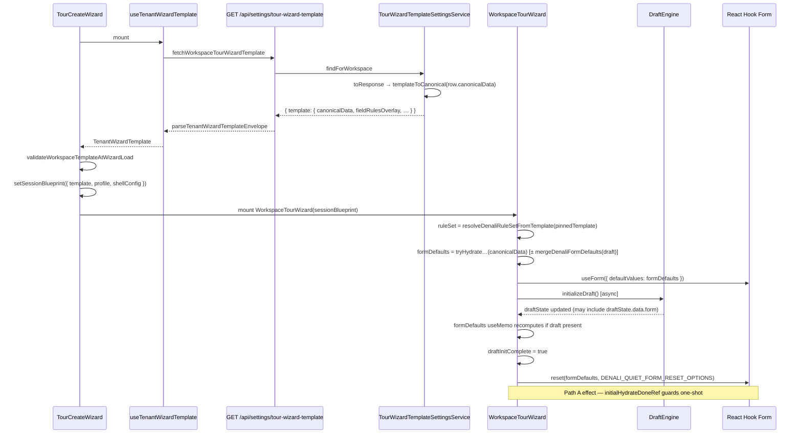
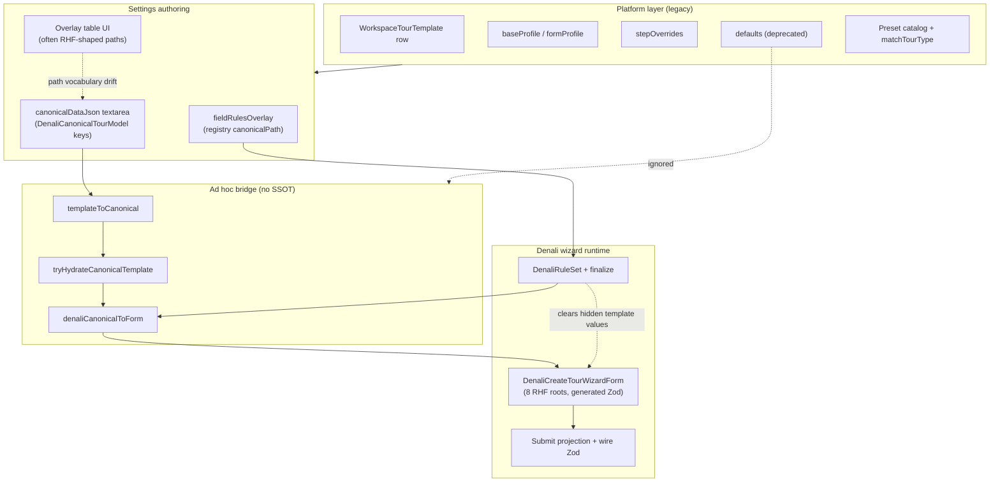

# Architecture Map

Living document for enterprise architectural reviews and audit findings.

---

## [Audit 6] Contract Schema Integrity & Currency Semantics

**Review date:** 2026-05-31  
**Severity:** High — three validation layers disagree; dev-only warnings mask paths that can **throw** or send semantically wrong pricing  
**Scope:** Denali create pipeline → `@repo/shared-contracts` → Nest DTOs  
**Code changes in this audit:** None (analysis only)

### Executive summary

Three parallel contracts govern the same `POST /api/tours` body:

1. **Nest `CreateTourDto` / `TripDetails*Dto`** — Denali-extended, permissive.
2. **`tourCreatePostContractSchema` / `tourTripDetailsWireSchema`** — strict `.strict()` Zod in `@repo/shared-contracts`.
3. **Client projection** (`buildDenaliCreateTourPayloadProjection`) — emits Nest-shaped payloads the strict schema never declared.

Failure modes are **layer-dependent**:

| Layer | On drift |
|-------|----------|
| `compactTripDetailsForApi` | **Throws** (`compact-trip-details-for-api.ts:178-182`) |
| `buildCreateTourPostBody` (dev) | **`console.warn` only** (`tours.service.ts:274-282`) — silent in production |
| Nest class-validator | Accepts Denali DTO fields |
| `assertCreateTourInvariants` | Skips trip-details for staging shells (`assert-create-tour-invariants.ts:507-515`) |

**Staging contradiction:** Server waives invariants for `isStagingShell`, but client runs **full submit projection** and **throws** when `capacityMax` is missing (`buildDenaliCreateTourPayloadProjection.ts:561-565`) before POST.

**Currency:** UI Toman integers (e.g. `850_000`) → `cost_context: { currency: "USD", totalCost: <number> }` (`tours.service.ts:193-195`) — wrong semantics; wire Zod expects `totalCost` as **string** (`cost-context-wire.schema.ts:9`).

---

### 1. Pipeline and validation gates

```text
Form → buildDenaliCreateTourPayloadProjection (throws if capacityMax invalid)
     → mapDenaliWizardToCreateTourPayload
     → stripCreateTourDtoForFormProfile (denali_pilot: clearsTripDetailsRoots: [])
     → mapCreateTourDto → compactTripDetailsForApi (strict Zod → THROW)
     → buildCreateTourPostBody (dev: tourCreatePostContractSchema → WARN)
     → Nest DTO + assertCreateTourInvariants
```

---

### 2. Schema drift map — `tripDetails`

Strict schemas: `packages/shared-contracts/src/tours/tour-trip-details-wire.schema.ts` (all `.strict()`).

#### 2.1 `overview` — projection emits, strict Zod **missing**

| Key | Projection | Nest (`trip-details.dto.ts`) | Strict wire |
|-----|------------|------------------------------|-------------|
| `summitPoint` | `buildDenaliCreateTourPayloadProjection.ts:441-443` | Yes (341) | **Missing** |
| `campPoint` | 444-446 | Yes (347) | **Missing** |
| `endPoint` | 447-449 | Yes (353) | **Missing** |
| `denaliTourKind` | 429 | Yes (361) | Listed ✓ |
| `settingsMainDestinationId` | 430 | Yes | Listed ✓ |
| `difficultyLevel` (number 0.5–10) | 450 | Yes | Listed ✓ |

`DENALI_LOCATION_ZONE_KEYS` (`denali-wizard.contract.ts:2-7`) documents zones but wire overview schema was never extended.

#### 2.2 `participation` — drift

| Key | Projection | Nest | Strict wire |
|-----|------------|------|-------------|
| `fitnessPrerequisiteText` | 480-485 | Yes (662) | **Missing** |
| `fitnessLevel` | `low/medium/high` → `easy/moderate/hard` (69-82) | Yes | Enum ✓ |

#### 2.3 `logistics` — drift

| Key | Projection | Nest | Strict wire |
|-----|------------|------|-------------|
| `privateCarMode` | 530 | Yes (921) | **Missing** |
| `startPointVillage` | 514-518 | Yes (736) | **Missing** |
| `fuelShareToman` | 529 | Yes | Listed ✓ |
| `groupSizeMin` / `groupSizeMax` | 527-528 | Yes | Listed ✓ |

#### 2.4 `tripDetails` root — drift

| Key | Projection | Nest | Strict wire |
|-----|------------|------|-------------|
| **`transport`** (`transportCost`, `allowPersonalCar`, `dongAmount`) | 556-557, `buildDenaliTransportJson` 157-180 | `TripDetailsDenaliTransportDto` (1007-1071) | **Root key absent** from `tourTripDetailsWireSchema` (210-220) |

Allowed strict roots: `schemaVersion`, `overview`, `itinerary`, `participation`, `logistics`, `requirements`, `policies`, `photos` only.

#### 2.5 Top-level POST (non–tripDetails)

| Field | Client | Strict Zod | Issue |
|-------|--------|------------|-------|
| `cost_context.totalCost` | **number** | **string** regex | Type drift → dev warn |
| `cost_context.currency` | `"USD"` | 3-char string ✓ | Semantic drift (Toman labeled USD) |
| `metadata` staging | `{ vertical: "staging_shell", isStagingShell: true }` | `tourMetadataWireSchema` ✓ | OK |
| `stagingTourId` | Final submit | UUID optional ✓ | OK |

#### 2.6 When users hit failures

| Scenario | Result |
|----------|--------|
| Mountain form with summit/camp/end zones | `compactTripDetailsForApi` **throw** on submit |
| `organizer_vehicle` / `shared_cars` → `tripDetails.transport` | **Throw** on submit |
| Submit-valid test form (no zones, transport may omit slice) | Compact may pass; **warn** on `totalCost` type |
| Photo upload before `capacityMax` set | Client **throw** at 561-565; never reaches server bypass |

`denali_pilot` keeps all tripDetails roots (`tour-form-profile-descriptors.ts:351-354`, `allowsMountainOnlyOverviewKeys: true`) — full Denali forms are high risk for compact throws.

---

### 3. Silent warnings vs hard failures

```text
mapCreateTourDto → compactTripDetailsForApi
  FAIL → throw Error("wire contract violation …") → no POST

buildCreateTourPostBody (NODE_ENV !== "production")
  tourCreateContractSchema.safeParse(body)
  FAIL → console.warn("[buildCreateTourPostBody] shared wire contract violation: …")
  POST still proceeds
```

Typical dev warning path: **`cost_context.totalCost`** expected string, received number — after tripDetails already passed compact.

---

### 4. Currency semantics (Toman → USD mislabel)

| Stage | Example | File |
|-------|---------|------|
| Wizard | `basePricePerPerson: 850_000` | `denaliUiTestTourFixtures.ts` |
| Projection | `price: 850_000` | `buildDenaliCreateTourPayloadProjection.ts:567-571` |
| Wire | `{ currency: "USD", totalCost: 850000 }` (number) | `buildCostContextForCreate` 193-195 |

No conversion. Nest `CostContextDto.totalCost` is `@IsNumberString()` (`cost-context.dto.ts:21`).

**Recommended alignment:**

- Emit `totalCost` as **string** (minimum wire fix).
- Set `currency: "IRR"` (or product-defined Toman code) for Denali IR market.
- Document semantics in OpenAPI / shared-contracts.

---

### 5. Staging bypass — cleanup proposal

#### 5.1 Current contradiction

| Component | Behavior |
|-----------|----------|
| `createDenaliWizardUploadTour.ts:27-28` | Full `mapDenaliWizardToCreateTourPayload` — no submit gate |
| Projection 561-565 | **Throws** without positive `capacityMax` |
| Lines 34-36 | Title fallback only (`STAGING_TITLE_FALLBACK`) |
| Server 507-515 | Skips trip-details invariants for `isStagingShell` |
| Server DTO | `total_capacity` min **0** accepted |

#### 5.2 Proposed dual projection

```text
mapDenaliWizardToCreateTourPayload(form)       → submit (existing + gate)
mapDenaliWizardToStagingShellPayload(form)    → gallery shell (new)
```

**Staging shell rules (never throw on incomplete wizard):**

| Field | Value |
|-------|-------|
| `title` | User title if ≥10 chars, else `STAGING_TITLE_FALLBACK` |
| `capacity` | Placeholder **`1`** (finalize overwrites on submit) |
| `price` | `0` — omit or minimal `cost_context` |
| `tripDetails` | **Omit** — photos via `POST /api/tours/:id/photos` |
| `lifecycle_status` | `"Draft"` |
| `metadata` | `{ vertical: "staging_shell", isStagingShell: true }` |

**Implementation order:**

1. `buildDenaliStagingShellProjection` with `mode: "staging" | "submit"` — no capacity throw in staging mode.
2. `buildDenaliWizardUploadTourPayload` calls staging projection only (`createDenaliWizardUploadTour.ts:28`).
3. Unit test: default form without `capacityMax` → payload builds without throw.
4. E2E: `apps/api/test/e2e/tours-staging-photos.e2e-spec.ts`.

**Long-term:** draft-engine attachments / deferred tour row (Audit 4 Tier E) removes shell split entirely.

#### 5.3 Wire schema catch-up (parallel)

Extend `tour-trip-details-wire.schema.ts`:

- Overview: `summitPoint`, `campPoint`, `endPoint` (reuse `tripDetailsLocationWireSchema`)
- Participation: `fitnessPrerequisiteText`
- Logistics: `privateCarMode`, `startPointVillage`
- Root: `transport` + `tripDetailsTransportWireSchema`

Validate with `buildWorstCaseDenaliWizardForm.ts` (includes `summitPoint`).

**SSOT rule:** update shared-contracts **with** Nest DTO parity; projection already targets Nest.

---

### 6. Remediation sequence

| Phase | Work |
|-------|------|
| **C0** | `totalCost` as string; `currency: "IRR"` (product sign-off) |
| **C1** | Staging shell projection — no capacity throw |
| **C2** | Extend `tour-trip-details-wire.schema.ts` |
| **C3** | CI fail on `tourCreatePostContractSchema` drift |
| **C4** | Document `cost_context` in OpenAPI |

---

### 7. Verification checklist

1. All location zones → submit without compact throw.
2. `tripDetails.transport` → strict parse passes.
3. No dev `[buildCreateTourPostBody] shared wire contract violation` on valid Denali submit.
4. Photo upload without capacity → staging POST succeeds.
5. Submit with `stagingTourId` → `finalizeStagingTourShell` overwrites placeholder capacity.
6. Persisted `cost_context` uses correct currency semantics, not USD-labeled Toman.

---

### 8. File reference index

| Topic | Path | Lines |
|-------|------|-------|
| Strict tripDetails schemas | `packages/shared-contracts/src/tours/tour-trip-details-wire.schema.ts` | 97-221 |
| Denali projection | `apps/web/src/features/tours/wizard/domain/buildDenaliCreateTourPayloadProjection.ts` | 427-565 |
| Staging upload | `apps/web/src/features/tours/wizard/denali/createDenaliWizardUploadTour.ts` | 22-37 |
| compact + throw | `packages/shared-contracts/src/tours/compact-trip-details-for-api.ts` | 178-182 |
| Dev warn | `apps/web/lib/services/tours.service.ts` | 187-204, 274-282 |
| Cost wire | `packages/shared-contracts/src/tours/cost-context-wire.schema.ts` | 6-14 |
| Server staging bypass | `apps/api/src/modules/tours/utils/assert-create-tour-invariants.ts` | 507-515 |
| Nest overview/transport | `apps/api/src/modules/tours/dto/trip-details.dto.ts` | 341-353, 1007-1071 |
| denali_pilot profile | `packages/types/src/tour-form-profile-descriptors.ts` | 345-363 |
| Location zone keys | `packages/shared-contracts/src/tours/denali-wizard.contract.ts` | 2-7 |

---

### 9. Conclusion

Strict wire schema **lags** Denali/Nest; projection **targets Nest**; `compactTripDetailsForApi` **hard-fails** complete forms while `buildCreateTourPostBody` **only warns** on currency type errors. Staging **inverts trust** — server permissive, client strict. Fix requires wire catch-up, currency alignment, and a **minimal staging projection** as one coordinated contract story.

---

## [Audit 7] Template Schema Alignment & Wizard Form Contract

**Review date:** 2026-05-31  
**Severity:** High — three parallel path vocabularies; Settings UI can author JSON that validation strips or never hydrates  
**Scope:** Workspace Settings templates/presets ↔ `DenaliCanonicalTemplateData` ↔ `DenaliCreateTourWizardForm`  
**Code changes in this audit:** None (analysis only)

### Executive summary

Workspace template configuration is **not one schema** — it is four coupled layers:

| Layer | Shape | Primary location |
|-------|--------|------------------|
| **A. RHF wizard form** | 8 roots (`basicInfo`, `programNature`, …) | `denaliTourCreateBaseSchema.generated.ts` |
| **B. Canonical template JSONB** | Partial `DenaliCanonicalTourModel` (33 top-level keys) | `denali-canonical-template-keys.ts`, `validateCanonicalTemplateData.ts` |
| **C. Field-rules overlay** | Registry `canonicalPath` → visibility/required | `denaliFieldRegistryData.ts`, Settings overlay table |
| **D. Legacy / deprecated** | `defaults`, classic roots, RHF paths in old rows | Preset form placeholder, DB columns marked deprecated |

Hydration bridge: `templateToCanonical` → `tryHydrateCanonicalTemplate` → `denaliCanonicalToForm` → `finalizeDenaliWizardHydration` (`canonicalTemplateHydration.ts`, `tourCreationPresetApply.ts`).

**Core misalignment:** Settings overlay table displays paths like `tripDetails.overview.peakHeight`, but **`canonicalData` JSON must use `overview.peakHeight`** — keys under a `tripDetails` root are **stripped** (`templateCanonicalMapping.spec.ts`: `collectDiscardedTemplateKeys({ tripDetails: {} }) → ["tripDetails"]`).

---

### 1. Contract locations (SSOT index)

| Concern | Path | Role |
|---------|------|------|
| Template top-level allow-list | `packages/types/src/denali/denali-canonical-template-keys.ts` | 33 keys mirroring `DenaliCanonicalTourModel` |
| Template partial type | `packages/types/src/denali/denaliTemplateSchema.ts` | `DenaliCanonicalTemplateData`, schema version `1.1.0` |
| Template validation (server + client) | `packages/types/src/denali/validateCanonicalTemplateData.ts` | Top-level allow-list only; nested permissive |
| Sanitize / hydrate extract | `packages/types/src/denali/templateCanonicalMapping.ts` | `templateToCanonical`, `sanitizeDenaliCanonicalTemplateData` |
| Field registry (paths + RHF + Zod) | `packages/denali-domain/src/registry/denaliFieldRegistryData.ts` | `canonicalPath`, `rhfPath`, `zodPath` per field |
| Generated path map | `apps/web/.../denaliCanonicalPathMap.generated.ts` | `DENALI_CANONICAL_TO_FORM_PATH_MAP` |
| RHF form model | `packages/denali-domain/src/schemas/denaliTourCreateBaseSchema.generated.ts` | `DenaliCreateTourWizardForm` |
| Wizard template row (API) | `apps/api/.../workspace-tour-wizard-template.entity.ts` | `canonical_data`, `field_rules_overlay`, deprecated `step_overrides` |
| Preset row (API) | `apps/api/.../workspace-tour-creation-preset.entity.ts` | `canonical_data`; deprecated empty `defaults` |
| Settings wizard template UI | `apps/web/app/(app)/settings/tour-wizard-template/tour-wizard-template-builder-form.tsx` | Overlay grid + `canonicalDataJson` textarea |
| Settings preset UI | `apps/web/app/(app)/settings/tour-presets/tour-preset-form.tsx` | Still edits **`defaultsJson`** (classic shape) |
| Client template parse | `apps/web/.../template/parse-tenant-wizard-template.ts` | `TenantWizardTemplate` envelope |
| Publish validation | `apps/web/lib/validation/universal-validator.ts` | Overlay paths + canonical allow-list + optional submit gate |
| API validation | `apps/api/.../validate-workspace-wizard-template.ts` | Same canonical rules as client |
| In-wizard hydrate | `apps/web/.../denali/canonicalTemplateHydration.ts` | Path A baseline + preset banner |
| Registry ↔ template guard | `apps/web/.../guards/denali-template-canonical-registry.guard.test.ts` | CI alignment checks |

---

### 2. Three path vocabularies

```text
canonicalData JSON          fieldRulesOverlay keys       RHF (DenaliCreateTourWizardForm)
──────────────────          ──────────────────────       ──────────────────────────────
title                       title                        basicInfo.title
category + duration         category, duration,          basicInfo.tourType (derived
(+ eventVariant overlay)    eventVariant                 8 slug enum — no separate fields)
program.themeIds            program.themeIds             programNature.themeIds
overview.peakHeight         tripDetails.overview.        tripDetails.overview.peakHeight
                            peakHeight
customServiceLabels         tripDetails.overview.        tripDetails.overview.
(top-level on model)        customServiceLabels          customServiceLabels
gatheringPoints             gatheringPoints              tripDetails.logistics.
(top-level on model)                                     gatheringPoints
transport.mode              transport.mode               transport.transportMode
photos                      photos                         photosData.photos
pricing.*                   pricing.*                    pricingPayment.*
participants.*              participants.*               participantRequirements.*
```

**Authoritative mapping:** `DENALI_CANONICAL_TO_FORM_PATH_MAP` in `denaliCanonicalPathMap.generated.ts` (generated from registry).

---

### 3. RHF root ↔ canonical root mapping

| RHF root (`DenaliCreateTourWizardForm`) | Canonical / template storage | Notes |
|----------------------------------------|------------------------------|-------|
| `basicInfo` | Flat keys: `title`, `destinationId`, `startDateTime`, `capacityMax`, location zones, crew, `publishStatus`, … | **`basicInfo.tourType`** has no canonical scalar — encoded as `category` + `duration` + optional `eventVariant` |
| `programNature` | `program.*` | Name mismatch (`Nature` suffix vs canonical `program`) |
| `transport` | `transport.*` | `transport.mode` ↔ `transport.transportMode` |
| `pricingPayment` | `pricing.*` | Name mismatch |
| `participantRequirements` | `participants.*` | Name mismatch |
| `policies` | `policies.*` | Aligned |
| `photosData.photos` | `photos[]` | Container rename |
| `tripDetails.overview` | `overview.*` **and** top-level `customServiceLabels` | **Split storage** — adapter merges both directions |
| `tripDetails.metrics` | `metrics.*` | Overlay uses `tripDetails.metrics.*`; JSON uses `metrics.*` |
| `tripDetails.logistics` | Top-level `gatheringPoints` | RHF nested; canonical top-level array |

---

### 4. Structural drift — high impact

#### 4.1 Overlay paths ≠ `canonicalData` paths (silent data loss)

These appear in the **Settings overlay table** (`listDenaliRuleFieldPaths`) but are **invalid or wrong** if pasted into `canonicalData` JSON:

| Overlay / registry `canonicalPath` | Correct `canonicalData` key | Failure mode |
|-----------------------------------|----------------------------|--------------|
| `tripDetails.overview.peakHeight` | `overview.peakHeight` | `tripDetails` root **discarded** — peak height never hydrates |
| `tripDetails.overview.nonAttendanceDetails` | `overview.nonAttendanceDetails` | Same |
| `tripDetails.overview.customServiceLabels` | `customServiceLabels` (top-level) | Same — labels stored on model root, not under `tripDetails` |
| `tripDetails.metrics.elevationGain` | `metrics.elevationGain` | Same |
| Any `tripDetails.{...}` root | Use canonical top-level slices | `collectDiscardedTemplateKeys` drops unknown roots |

#### 4.2 Overlay-only basics (not in template allow-list)

| Registry path | In `DENALI_CANONICAL_TEMPLATE_TOP_LEVEL_KEYS`? | Hydration behavior |
|---------------|--------------------------------------------------|--------------------|
| `category` | Yes | Merged into canonical; maps to `basicInfo.tourType` via `denaliCanonicalToForm` |
| `duration` | Yes | Same |
| `eventVariant` | **No** | Valid in overlay table; **cannot** be persisted in `canonicalData` JSON — event subtype only via full `category`+`duration` patch or implied from existing form |

#### 4.3 Preset Settings UI vs Denali pipeline

| Surface | Edits | Runtime consume |
|---------|-------|-----------------|
| `tour-preset-form.tsx` | `defaultsJson` with classic placeholder (`overview.tourType`, …) | API rejects non-empty `defaults` for Denali (`tour-creation-presets-settings.service.ts`) |
| `DenaliTourCreationPresetBanner` | N/A (in-wizard) | **`canonicalData` only** via `applyDenaliWizardPreset` |
| Preset DTO | Exposes both `canonicalData` and `defaults` | `defaults` legacy; often empty post-migration |

**Risk:** Admins author presets in the wrong JSON shape; wizard preset apply ignores `defaults`.

#### 4.4 Deprecated template columns still live

| Column | Entity status | Denali runtime |
|--------|---------------|----------------|
| `step_overrides` | Deprecated on entity | `mapTemplateToRuleModel` still reads; migration `1777600900000` resets to empty |
| `field_rules_overlay` | Active | Merged into tenant `DenaliRuleSet` via `applyOverlayToRuleSet` |
| `defaults` (presets) | Deprecated | Ignored by `templateToCanonical` |

#### 4.5 Registry fields excluded from overlay table (`inRuleModel: false`)

Not shown in Settings overlay grid but exist in registry / RHF / wire:

- `tripDetails.overview.customServiceLabels`
- `tripDetails.overview.nonAttendanceDetails`
- `gatheringPoint` (deprecated vs `gatheringPoints`)
- `transport.seatPreference`
- `participants.minRequiredPeaks`

Admins cannot set visibility/required overrides for these via the template builder UI.

#### 4.6 Synthetic / multi-target mappings

| Canonical concept | Registry paths | RHF target |
|-------------------|----------------|------------|
| Tour kind (8 slugs) | `category`, `duration`, `eventVariant` (3 rows) | Single `basicInfo.tourType` |
| Duration enum | `duration` uses `single`/`multi` in template JSON | Form uses `single_day`/`multi_day` only **after** adapter conversion |

---

### 5. Fields in wizard with no direct template key (via adapter only)

These RHF fields hydrate from canonical slices, not 1:1 JSON keys in admin textarea:

- `basicInfo.tourType` — derived from `category` + `duration` (+ event variant logic in `denaliCanonicalBasicsFromTourKind`)
- `tripDetails.overview.customServiceLabels` — from top-level `customServiceLabels` on canonical model
- `tripDetails.logistics.gatheringPoints` — from top-level `gatheringPoints`
- All `tripDetails.overview.*` / `tripDetails.metrics.*` — from `overview.*` / `metrics.*` on canonical model when authoring JSON correctly

---

### 6. Validation asymmetry

| Check | Overlay (`fieldRulesOverlay`) | `canonicalData` JSON |
|-------|------------------------------|----------------------|
| Unknown keys | Rejected if path ∉ `listDenaliRuleFieldPaths` | Rejected if top-level ∉ `DENALI_CANONICAL_TEMPLATE_TOP_LEVEL_KEYS` |
| Nested shape | Not validated | **Permissive** (comment in `validateCanonicalTemplateData.ts`) |
| Publish mode | — | Hydrates + runs `getDenaliWizardSubmitIssues` on merged form |
| Legacy RHF paths (e.g. `basicInfo.title`) | **Rejected** in overlay validator | N/A |

---

### 7. End-to-end hydrate flows



**Path A (session baseline):** `WorkspaceTourWizard` merges `pinnedTemplate.canonicalData` via `tryHydrateCanonicalTemplate` into `formDefaults`.

**Preset apply:** `applyDenaliWizardPreset` → same hydrate path; **does not** read preset `defaults`.

---

### 8. Remediation sequence (documentation-only recommendations)

| Phase | Action |
|-------|--------|
| **T0** | Settings docs / JSON helper: map overlay paths → canonicalData keys (table in §4.1) |
| **T1** | Preset form: replace `defaultsJson` with `canonicalDataJson` + shared validator |
| **T2** | Template builder: validate `canonicalData` with nested schema or lint against registry `wire` projections |
| **T3** | Add `eventVariant` to template allow-list **or** remove from overlay table |
| **T4** | Single exported “template authoring schema” JSON Schema generated from registry |

---

### 9. Verification checklist

1. Paste `tripDetails.overview.peakHeight` into template JSON → confirm strip/hydrate failure (peak not applied).
2. Paste `{ "overview": { "peakHeight": 5610 } }` → confirm `tripDetails.overview.peakHeight` on form after load.
3. Overlay row `title` vs JSON `"title"` → both align.
4. Preset saved via Settings form with only `defaults` → confirm wizard preset banner does not apply fields.
5. Publish template with invalid canonical key → client + API reject with `canonicalData.{key}` issue.
6. `pnpm test:structural-guards` — `denali-template-canonical-registry` guard passes (registry ↔ template keys).

---

### 10. Conclusion

Template configuration uses **registry canonical paths** for overlays, **`DenaliCanonicalTemplateData` top-level keys** for JSONB, and **RHF nested paths** for the live wizard — linked only by generated maps and adapters. The highest-risk drift is **`tripDetails.*` paths in the overlay UI that are invalid in `canonicalData`**, causing silent strip on save and failed prefill. Preset Settings still surfaces **legacy `defaults` JSON**, while the Denali wizard consumes **`canonicalData` only**. Alignment work should unify authoring UX, allow-list, and registry paths under one generated contract.

---

## [Audit 8] Template Hydration Pipeline & Injection Evaluation

**Review date:** 2026-05-31  
**Severity:** High — multi-stage pipeline with silent strip, implicit classification defaults, and post-hydrate rule-engine clearing  
**Scope:** Pinned workspace template → `tryHydrateCanonicalTemplate` → `mergeDenaliFormDefaults` → RHF `reset(formDefaults)`  
**Code changes in this audit:** None (analysis only)

### Executive summary

Template injection is **not a single assignment**. It crosses API sanitization, a canonical merge adapter, rule-engine finalize (which **clears hidden fields**), optional draft overlay merge (which **skips re-finalize**), and a deferred RHF `reset` that runs only after draft-engine initialization completes.

| Stage | Function / location | Effect on template fields |
|-------|---------------------|---------------------------|
| **API read** | `tour-wizard-template-settings.service.ts` → `templateToCanonical` | Unknown top-level keys (e.g. `tripDetails`) **stripped before client receives JSON** |
| **Client parse** | `parse-tenant-wizard-template.ts` | Passes `canonicalData` through **without re-sanitizing** |
| **Template hydrate** | `tryHydrateCanonicalTemplate` | Canonical patch → RHF via `denaliCanonicalToForm` |
| **Finalize** | `finalizeDenaliWizardHydration` → `prepareDenaliWizardFormForSubmit` | **Clears values for fields hidden in overlay-aware rule model** |
| **Draft merge** | `mergeDenaliFormDefaults` | Shallow section merge; draft wins over template baseline |
| **RHF apply** | Path A effect → `reset(formDefaults, DENALI_QUIET_FORM_RESET_OPTIONS)` | Authoritative store write after `initializeDraft()` |

**Highest-risk failures:** (1) admin-authored `tripDetails.*` keys never reach the client; (2) templates without `category`/`duration` inherit **mountain/single placeholders** from `createInitialDenaliCanonicalModel`; (3) event templates cannot express `eventVariant` in JSON — cinema defaults to reading; (4) draft merge can **drop nested template fields** or **reintroduce stale hidden values** without a second finalize pass.

---

### 1. End-to-end injection lifecycle trace



#### Step-by-step (file anchors)

| # | Step | Location | Notes |
|---|------|----------|-------|
| 1 | React Query fetch | `use-tenant-wizard-template.ts` → `fetchWorkspaceTourWizardTemplate` | `select: envelope => envelope.template` |
| 2 | BFF GET | `settings-tour-wizard-template.client.ts` | Returns parsed envelope |
| 3 | API sanitize on read | `tour-wizard-template-settings.service.ts:57-61` | `canonicalData: templateToCanonical({ canonicalData: row.canonicalData, … })` |
| 4 | Allow-list strip | `templateCanonicalMapping.ts` → `sanitizeDenaliCanonicalTemplateData` | Only `DENALI_CANONICAL_TEMPLATE_TOP_LEVEL_KEYS` (33 keys) survive |
| 5 | Profile resolve + validate | `TourCreateWizard.tsx:27-52` | `resolveWorkspaceTourFormProfileFromTemplate` + `validateWorkspaceTemplateAtWizardLoad` |
| 6 | Session blueprint freeze | `TourCreateWizard.tsx:56-65` | One-shot `setSessionBlueprint` when template + profile ready |
| 7 | Shell mount | `TourCreateWizard.tsx:149` | `<WorkspaceTourWizard sessionBlueprint={…} />` |
| 8 | Overlay → rule set | `WorkspaceTourWizard.tsx:237-239` | `resolveDenaliRuleSetFromTemplate(pinnedTemplate)` — **field values unaffected** |
| 9 | Template baseline | `WorkspaceTourWizard.tsx:269-276` | `tryHydrateCanonicalTemplate(pinnedTemplate.canonicalData, defaultValues, undefined, ruleSet)` |
| 10 | Draft overlay | `WorkspaceTourWizard.tsx:277-279` | If `draftState.data?.form` → `mergeDenaliFormDefaults(templateBaseline, draft.form)` |
| 11 | RHF init (transient) | `WorkspaceTourWizard.tsx:293-297` | `useForm({ defaultValues: formDefaults })` — **first paint only**; may predate draft load |
| 12 | Draft init | `WorkspaceTourWizard.tsx:344-374` | `await initializeDraft()`; failure → `resetToEmptyForm()` |
| 13 | **Authoritative inject** | `WorkspaceTourWizard.tsx:376-395` | Path A: `reset(formDefaults, DENALI_QUIET_FORM_RESET_OPTIONS)` when `draftInitComplete` |
| 14 | Conflict re-hydrate | `WorkspaceTourWizard.tsx:397-418` | 409 merge path reuses same `formDefaults` + `reset` |

**Preset banner (parallel path):** `applyDenaliWizardPreset` in `tourCreationPresetApply.ts` runs the same `templateToCanonical` → `tryHydrateCanonicalTemplate` chain but applies via `applyCanonicalMvpToForm` / user gesture — not part of Path A session baseline.

---

### 2. `tryHydrateCanonicalTemplate` — internal pipeline

**File:** `apps/web/src/features/tours/wizard/denali/canonicalTemplateHydration.ts`

```text
canonicalPatch (from pinnedTemplate.canonicalData)
  │
  ├─ null / non-object ─────────────────────────────► return null → caller uses defaultValues
  ├─ hasCanonicalTemplateContent(patch) === false ───► return null (empty `{}` or all undefined keys)
  │
  ▼
baseCanonical = safeDenaliFormToCanonical(defaultValues)
  │               └─ no tourType selected → createInitialDenaliCanonicalModel (category: mountain, duration: single)
  ▼
mergedCanonical = mergeDenaliCanonicalPartial(baseCanonical, patch)
  │               └─ deep-merge program/transport/pricing/participants/policies/overview/metrics
  │               └─ sanitizeDenaliCanonicalModel (trim strings, coerce itinerary/gatheringPoints)
  ▼
priorBasics = readDenaliCanonicalBasics(defaultValues.basicInfo.tourType)  // null on fresh wizard
basics = { category, duration from merged, eventVariant from priorBasics ONLY if prior was event }
  ▼
formFromCanonical = denaliCanonicalToForm(mergedCanonical, defaultValues, { basics })
  │               └─ maps flat canonical → 8 RHF roots (see denaliCanonicalFormAdapter.ts:423-521)
  ▼
formValues = finalizeDenaliWizardHydration(formFromCanonical, ruleSet)
  │               └─ prepareDenaliWizardFormForSubmit → clearDenaliNonVisibleFormValues
  ▼
return { formValues, wizardMeta }
```

#### 2.1 Early-exit / null hydrate (silent fallback to empty defaults)

| Condition | Behavior |
|-----------|----------|
| `canonicalData` is `null` / not an object | Returns `null`; `WorkspaceTourWizard` uses `buildDenaliTourCreateDefaultValues()` |
| `canonicalData` is `{}` | `hasCanonicalTemplateContent` false → `null` |
| `tryHydrate…` returns `null` | No template fields in RHF; user sees blank wizard |

There is **no user-visible signal** when hydration is skipped due to empty canonical payload.

#### 2.2 Implicit classification when patch omits `category` / `duration`

When the wizard has no selected `tourType`, `safeDenaliFormToCanonical` builds a base via `createInitialDenaliCanonicalModel`, which hardcodes **`category: "mountain"`, `duration: "single"`** (`denaliCanonicalFormAdapter.ts:158-160`). A patch containing only scalars (e.g. `{ "title": "Workspace default" }`) merges into that base, producing **`mountain_day`** as `basicInfo.tourType` after `denaliCanonicalToForm`.

Fields authored for other tour kinds in the same template JSON (without explicit `category`/`duration`) may then be **cleared by finalize** because the resolved rule model is mountain/single.

#### 2.3 `eventVariant` gap

`tryHydrateCanonicalTemplate` lines 51-55:

```typescript
eventVariant: priorBasics?.category === "event" ? priorBasics.eventVariant : undefined,
```

On a fresh wizard, `priorBasics` is `null`, so **`eventVariant` is never taken from the template patch** (and `eventVariant` is not in `DENALI_CANONICAL_TEMPLATE_TOP_LEVEL_KEYS`). `denaliTourKindFromCanonical` defaults missing variant to **`"reading"`** (`denaliCanonicalTourModel.ts:282`). Event-cinema templates cannot be expressed via `canonicalData` JSON alone.

#### 2.4 Post-hydrate rule-engine stripping (`finalizeDenaliWizardHydration`)

`finalizeDenaliWizardHydration` delegates to `prepareDenaliWizardFormForSubmit` → `getDenaliSafeFormState` → `clearDenaliNonVisibleFormValues` (`clearHiddenFormValues.ts`).

After classification is derived from the merged canonical patch, the overlay-aware rule model resolves and **clears canonical paths marked hidden or contextually non-visible**. Template values for those paths are **intentionally removed** from RHF — they do not persist as dirty hidden state.

**Ordering implication:** Template field values are applied in `denaliCanonicalToForm`, then **removed** if the resolved rule set hides them. Admins may believe overlay only affects UI affordance; hydrate treats overlay as **submit authority**.

#### 2.5 `mergeDenaliCanonicalPartial` nested limits

| Nested slice | Merge depth | Data-loss scenario |
|--------------|-------------|-------------------|
| `program`, `transport`, `pricing`, `participants`, `policies` | One-level shallow object merge | Deeply nested partial patch replaces sibling keys within slice correctly, but **array fields** (e.g. `program.itinerary`) replace wholesale |
| `overview`, `metrics` | Shallow merge | Partial `overview: { peakHeight: 5610 }` preserves other overview keys from base |
| Top-level unknown keys | N/A on client if API sanitized | If client ever receives unsanitized JSON, unknown keys sit in spread but **`sanitizeDenaliCanonicalModel` does not strip them** — they are ignored by `denaliCanonicalToForm` field mapping |

#### 2.6 `denaliCanonicalToForm` mapping highlights

Canonical storage uses **flat / differently named** keys vs RHF:

| Canonical (template JSON) | RHF target |
|---------------------------|------------|
| `title`, `destinationId`, dates, capacity, locations | `basicInfo.*` |
| `category` + `duration` (+ implicit eventVariant) | `basicInfo.tourType` (single slug) |
| `program.*` | `programNature.*` |
| `transport.mode` | `transport.transportMode` |
| `pricing.*` | `pricingPayment.*` |
| `participants.*` | `participantRequirements.*` |
| `overview.*`, `metrics.*` | `tripDetails.overview.*`, `tripDetails.metrics.*` |
| `gatheringPoints` (top-level) | `tripDetails.logistics.gatheringPoints` |
| `customServiceLabels` (top-level) | `tripDetails.overview.customServiceLabels` |
| `photos` | `photosData.photos` |

Fields present in RHF but **not** mapped from canonical template keys (e.g. `transport.seatPreference` when only in registry overlay) **cannot** be hydrated from `canonicalData`.

---

### 3. `mergeDenaliFormDefaults` — draft overlay merge

**File:** `apps/web/src/features/tours/wizard/schemas/denaliTourCreateFormModel.ts:19-44`

Called only when `draftState.data?.form` exists after draft-engine initialization:

```typescript
mergeDenaliFormDefaults(templateBaseline, draftState.data.form)
```

#### 3.1 Merge semantics

| RHF root | Merge style |
|----------|-------------|
| All 8 roots | `{ ...defaultsSection, ...patchSection }` — **patch wins** on key collision |
| `tripDetails.logistics` | Explicit nested merge |
| `tripDetails.overview` | **No explicit nested merge** — governed by `…patch.tripDetails` spread |
| `tripDetails.metrics` | Same as overview — **no dedicated deep merge** |

#### 3.2 Data-loss modes (draft over template)

| Scenario | Outcome |
|----------|---------|
| Template hydrates full `tripDetails.overview`; draft snapshot has partial `overview: { peakHeight: X }` | **Entire overview object replaced** — other template overview fields dropped |
| Template sets `programNature.themeIds: ["a","b"]`; draft has `themeIds: ["a"]` | Draft array wins (expected) |
| Draft contains values for fields hidden under current rule set | Values **reintroduced** into RHF — **no second `finalizeDenaliWizardHydration`** on merged result |
| No draft | `formDefaults === templateBaseline` (fully finalized template hydrate) |

#### 3.3 Duplication with domain merge

`packages/denali-domain/src/normalize/clearHiddenFormValues.ts` defines an identical `mergeDenaliFormSections` used by `normalizeDenaliFormPatch`. The wizard-local `mergeDenaliFormDefaults` is a **duplicate** with the same shallow semantics — neither path deep-merges `tripDetails.overview` / `metrics`.

---

### 4. Pre-client data loss (API / storage layer)

Before `tryHydrateCanonicalTemplate` runs, the client receives **`canonicalData` already filtered**:

```typescript
// tour-wizard-template-settings.service.ts:57-61
canonicalData: templateToCanonical({ canonicalData: row.canonicalData, … })
```

| Authoring mistake | When stripped | Client sees |
|-------------------|---------------|-------------|
| `"tripDetails": { "overview": { "peakHeight": 5610 } }` | API `sanitizeDenaliCanonicalTemplateData` | `{}` for that key — **peak never hydrates** |
| Legacy `defaults` column / nested in JSONB | `templateToCanonical` ignores `defaults` | No effect on wizard |
| `eventVariant` in JSON | Not in allow-list | Discarded |
| RHF-shaped keys (`basicInfo.title`) | Not in allow-list | Discarded |
| Valid `{ "overview": { "peakHeight": 5610 } }` | Kept | Hydrates to `tripDetails.overview.peakHeight` |

**Client parse gap:** `parse-tenant-wizard-template.ts` does **not** call `sanitizeDenaliCanonicalTemplateData`. Today the API is the sanitizer; any future BFF bypass would expose raw DB JSON to hydrate.

---

### 5. `fieldRulesOverlay` vs field values

| Concern | Applied during hydrate? |
|---------|-------------------------|
| Step visibility / required / hidden flags | **Yes** — via `ruleSet` passed into `finalizeDenaliWizardHydration` |
| Default **values** for fields | **No** — overlay has no value payload |
| `stepOverrides` | **No** — consumed by `getWizardLayout` for rail composition only |

Overlay can **hide** a template-provided value during finalize; it cannot **prefill** a value not present in `canonicalData`.

---

### 6. Hydration failure matrix

| # | Symptom | Root cause | Stage |
|---|---------|------------|-------|
| H1 | Template JSON uses `tripDetails.overview.*` | Key stripped by allow-list | API read |
| H2 | Empty `canonicalData` / publish with no keys | `tryHydrateCanonicalTemplate` → `null` | Client hydrate |
| H3 | Title-only template forces mountain day tour type | `createInitialDenaliCanonicalModel` placeholders | Client hydrate |
| H4 | Event cinema template becomes event reading | `eventVariant` not in template JSON; defaults to `"reading"` | Client hydrate |
| H5 | Template value for field X missing in form | Field hidden in overlay rule model; cleared in finalize | Client finalize |
| H6 | Template value present briefly then gone on step change | Rule model re-evaluates visibility on navigation (separate from hydrate, same engine) | Runtime |
| H7 | Template baseline lost after reload with draft | `mergeDenaliFormDefaults` draft wins; partial nested merge drops template nested fields | Draft merge |
| H8 | Hidden field values reappear after reload | Draft merge skips finalize; stale snapshot reintroduces cleared paths | Draft merge |
| H9 | `useForm` defaultValues ≠ visible form on first paint | Path A `reset` deferred until `draftInitComplete` | Timing |
| H10 | Draft init throws | `resetToEmptyForm()` — template hydrate discarded | Error path |
| H11 | `photos` / blob URLs in template | Canonical photos map to `photosData.photos`; blob lifecycle separate from hydrate | Media |
| H12 | Nested canonical arrays malformed | `sanitizeDenaliCanonicalModel` coerces itinerary / gatheringPoints strings | Merge sanitize |

---

### 7. RHF store write authority

```text
useForm({ defaultValues: formDefaults })     ← initial mount snapshot (may be pre-draft)
        │
        ▼ (async gap: initializeDraft)
reset(formDefaults, DENALI_QUIET_FORM_RESET_OPTIONS)   ← authoritative Path A inject
        │
        ├─ keepDefaultValues: true
        ├─ keepDirty: false
        └─ should not trigger draft PATCH (withDraftHydration guard)
```

**Single-shot guard:** `initialHydrateDoneRef` prevents repeat Path A reset on subsequent `formDefaults` identity changes unless 409 conflict path fires.

**`emptyFormBaseline`:** Used by `resetToEmptyForm` — template hydrate **without** draft merge; used on draft init failure, not on successful Path A.

---

### 8. Verification checklist

1. Save template with only `{ "title": "T" }` → confirm wizard loads with `tourType === mountain_day` (H3).
2. Save `{ "category": "event", "duration": "single", "title": "E" }` → confirm `tourType === event_reading` not cinema (H4).
3. Save `{ "tripDetails": { "overview": { "peakHeight": 5610 } } }` → network response lacks `tripDetails`; form peak empty (H1).
4. Save `{ "overview": { "peakHeight": 5610 } }` → form shows peak after Path A reset (happy path).
5. Hide `title` in overlay, set `"title": "Hidden"` in JSON → confirm title cleared post-hydrate (H5).
6. Hydrate template, enter draft data for subset of overview, reload → confirm non-draft overview fields from template lost if draft overview partial (H7).
7. Clear draft, reload → confirm full template baseline (no merge).
8. Break draft fetch (offline) → confirm `resetToEmptyForm` drops template (H10).

---

### 9. Remediation sequence (documentation-only recommendations)

| Phase | Action |
|-------|--------|
| **H0** | Client-side defensive `sanitizeDenaliCanonicalTemplateData` in `parseTenantWizardTemplate` (parity with API) |
| **H1** | When patch omits `category`/`duration`, do **not** seed mountain/single — leave tour type unselected until explicit template classification |
| **H2** | Add `eventVariant` to template allow-list **or** derive variant from a documented canonical key |
| **H3** | Run `finalizeDenaliWizardHydration(mergeDenaliFormDefaults(…), ruleSet)` after draft merge |
| **H4** | Deep-merge `tripDetails.overview` and `tripDetails.metrics` in `mergeDenaliFormDefaults` (mirror `logistics`) |
| **H5** | Surface hydrate telemetry when `tryHydrateCanonicalTemplate` returns `null` or when `collectDiscardedTemplateKeys` would be non-empty |
| **H6** | Settings JSON helper: reject `tripDetails.*` keys at edit time with actionable error (extends Audit 7 T0) |

---

### 10. Conclusion

The pinned template injection path is **`API sanitize → tryHydrateCanonicalTemplate → [optional mergeDenaliFormDefaults] → deferred reset(formDefaults)`**. Data loss is rarely a thrown error — it manifests as **allow-list stripping**, **implicit mountain/single classification**, **event variant defaulting**, **finalize clearing hidden fields**, and **shallow draft merge** clobbering nested template slices. `fieldRulesOverlay` controls **which template values survive finalize**, not which values are prefilled. Hardening requires aligning sanitize boundaries, classification semantics, finalize after draft merge, and nested merge depth — not merely documenting JSON examples in Settings.

---

## [Audit 9] Strategic Review: Template Structural Integrity

**Review date:** 2026-05-31  
**Severity:** Strategic — symptoms look like validation bugs; root cause is **split contract authority without versioned coupling**  
**Scope:** Verdict on template-wizard disconnect (surface bug vs structural flaw) + remediation blueprint  
**Code changes in this audit:** None (analysis only)

### Executive verdict

**The template-wizard disconnect is a deep structural flaw, not a surface-level validation bug.**

Individual failures (wrong JSON keys, silent strip, missing `eventVariant`, implicit `mountain_day` classification) are **symptoms**. The underlying condition is an **un-versioned architectural split**: Settings was designed as a **generic workspace catalog / platform template** layer, while the Denali wizard evolved as a **separate rule-engine + canonical tour model + RHF form** stack. The two were **bridged by ad hoc mappers** (`templateToCanonical`, `tryHydrateCanonicalTemplate`, `denaliCanonicalToForm`) rather than **inheriting from one generated contract**.

Mapper patches can reduce incident rate but **cannot** guarantee long-term alignment because:

1. **Three path vocabularies** remain authoritative in different subsystems (Audits 7–8).
2. **Validation is deliberately asymmetric** — template JSON validates top-level keys only; nested shape is deferred to hydrate-time rule engine (`validateCanonicalTemplateData.ts:24-25`).
3. **Version metadata exists but is not enforced** at the template ↔ wizard boundary.
4. **Settings authoring UX** (overlay grid paths, preset `defaultsJson`, freeform `canonicalDataJson` textarea) was not generated from the same artifact that defines wizard fields.

**Recommendation:** Pursue a **dual-track remediation** — tactical mapper/UX fixes immediately (stop silent data loss), then a **generated SSOT contract** where the settings template schema is a **strict partial subset** of the wizard's canonical validation schema, not a parallel hand-maintained allow-list.

---

### 1. Contract invariant analysis

#### 1.1 Evidence of platform-generic template origin

| Artifact | Generic / platform signal | Denali-specific signal |
|----------|---------------------------|------------------------|
| `WorkspaceTourTemplateRecord` | `matchTourType`, `matchMainTourThemeId`, `formProfile`, preset catalog semantics | `canonicalData: DenaliCanonicalTemplateData` |
| DB entity | `base_profile`, `step_overrides`, legacy columns retained | `canonical_data`, `field_rules_overlay` |
| Profile resolution | Deprecated theme/catalog resolver (`resolveTourFormProfile`) | `resolveWorkspaceTourFormProfileFromTemplate` + `baseProfile: denali` |
| Preset Settings UI | Still edits **`defaultsJson`** (classic RHF roots) | API stores `canonical_data`; wizard ignores `defaults` |
| Migration `1777600900000` | Wiped presets, reset templates to `{}` shells | Acknowledged legacy debt; did not introduce unified schema |

The storage row is a **hybrid**: Denali canonical JSONB bolted onto a **multi-profile wizard platform** abstraction (`TourFormProfile`, `general` vs `denali`, step overrides, theme matching).

#### 1.2 Evidence of independent Denali wizard evolution

| Concern | Location | Coupling to Settings |
|---------|----------|----------------------|
| RHF form (8 roots) | `denaliTourCreateBaseSchema.generated.ts` | **None** — generated from registry, not template schema |
| Rule engine | `denaliRuleSet`, `deriveDenaliTemplateSchema` | Overlay **reads** rule set; template JSON does not |
| Canonical tour model | `DenaliCanonicalTourModel` in `@repo/types` | Template allow-list **mirrors** top-level keys manually |
| Hydrate pipeline | `tryHydrateCanonicalTemplate` + finalize | **Runtime adapter**, not compile-time contract |
| Submit / wire contracts | Audit 6 strict Zod vs Nest DTO | **Third** validation surface unrelated to template save |

Denali is a **domain package** (`@repo/denali-domain`) with its own normalize/submit path. Settings validates template saves through **`validateDenaliCanonicalTemplateData`** (top-level only) — a **different validation philosophy** than wizard submit (`prepareDenaliWizardFormForSubmit`, strict wire Zod).

#### 1.3 Version fields — present but un-coupled

| Version token | Declared | Enforced on hydrate / Settings save? |
|---------------|----------|--------------------------------------|
| `DENALI_TEMPLATE_SCHEMA_VERSION` (`"1.1.0"`) | `denaliTemplateSchema.ts`, `deriveDenaliTemplateSchema` | **No** — comment says keep in sync; CI guard on key list only |
| `wizardContractVersion` (DB `number`, default `1`) | Entity + API response | **No** — used in layout cache key (`shell/layout.ts:99`), not compatibility gate |
| `formProfileVersion` | Entity + parse | **No** — parsed, never compared to wizard registry version |
| `DENALI_RULE_MODEL_VERSION` | `denaliRuleModel.ts` | **No** — not persisted on template row |
| Draft `schemaVersion` | Draft engine | **Yes** — migrated on load (contrast: templates have no equivalent) |

**Conclusion:** The system has **version-shaped hooks** but **no versioned contract evolution** for template ↔ wizard. This is the hallmark of an **un-versioned architectural split** — two subsystems converged by convention and manual guards, not by schema inheritance.

#### 1.4 Why this is not "just mismatched keys"

| If it were surface-only… | Observed structural behavior |
|--------------------------|------------------------------|
| Fix allow-list → done | Allow-list is **manually synced** to `DenaliCanonicalTourModel` via `AssertTemplateKeysMatchCanonicalModel` — already aligned at compile time for top-level keys, yet **`tripDetails.*` authoring still fails** because overlay UI uses RHF paths |
| Fix one mapper → done | **Four layers** (RHF, canonical JSON, overlay, legacy) each claim authority for different concerns |
| Add defaults → done | **`fieldRulesOverlay` controls visibility, not values**; finalize **strips** template values post-map (Audit 8 H5) |
| Client/server validation parity → done | Both use same top-level validator; **nested permissive by design** — validation cannot catch most hydrate failures |

Mismatched keys (`tripDetails` vs `overview`) are the **most visible** bug class. Fixing them without unifying path authority **relocates** drift to the next manual sync point (e.g. `eventVariant`, `transport.seatPreference`, new registry fields).

---

### 2. Architectural split diagram



**Missing edge:** There is no single generated node where **Settings template schema ⊆ Wizard canonical schema ⊆ RHF registry**.

---

### 3. Remediation options evaluated

#### Option A — Mapper / transformation quick wins only

**What it fixes:** Silent strip (client sanitize), `tripDetails.*` author errors, `eventVariant` gap, draft merge finalize, deep-merge overview/metrics, Settings docs.

**What it cannot fix:**

- New registry fields requiring manual updates to allow-list, overlay table, path map, and adapter
- Overlay vs canonical path vocabulary drift in Settings UI
- Nested template validation blind spot
- Version skew between stored templates and current rule model
- Preset form still on legacy `defaults`

**Verdict:** **Necessary Phase 0** (1–2 sprints) — not sufficient as end state. Treat as **triage bandage**, not architecture.

#### Option B — Strict schema inheritance (SSOT contract)

**Definition:** Settings template `canonicalData` is **`DenaliCanonicalTemplateData` validated by a generated `denaliCanonicalTemplateSchema`** (`.partial()` / `.deepPartial()` on the same Zod tree that backs `DenaliCanonicalTourModel` or registry wire projections). `fieldRulesOverlay` keys are **`listDenaliTemplateCanonicalFieldPaths()`** from `deriveDenaliTemplateSchema()` — identical to canonical JSON paths. Settings UI is **schema-driven**, not freeform JSON + mismatched grid.

**What it fixes:** Structural drift at the source — one generator, one path vocabulary, nested validation at save time, publish-time simulate-hydrate gate.

**Cost:** Upfront codegen + Settings UI rework; migration for rows that fail nested validation.

**Verdict:** **Required Phase 1–2** for durable fix. This is the only option that satisfies "settings template directly implements a partial/subset of the wizard's canonical validation schema."

#### Option C — Collapse to RHF-shaped template storage

Store template as partial `DenaliCreateTourWizardForm` JSONB (Settings authors in RHF paths).

**Verdict:** **Rejected.** Duplicates canonical submit model; fights API/tour persistence which uses canonical flat model; reinvents deprecated `defaults` path. Would add a **fourth** vocabulary instead of eliminating one.

---

### 4. Recommended remediation blueprint

#### Phase 0 — Tactical stabilization (mapper + UX, no SSOT yet)

*Goal: stop silent data loss while SSOT is built. Maps to Audits 7–8 H/T items.*

| ID | Action | Type |
|----|--------|------|
| P0-1 | Settings save: reject keys that `collectDiscardedTemplateKeys` would strip; show canonical path hint | Validation UX |
| P0-2 | Client parse: `sanitizeDenaliCanonicalTemplateData` parity with API | Mapper |
| P0-3 | Fix hydrate classification: no implicit `mountain/single` when patch omits category/duration | Mapper semantics |
| P0-4 | Add `eventVariant` to allow-list **or** document cinema via category+duration invariant | Contract gap |
| P0-5 | `finalizeDenaliWizardHydration` after `mergeDenaliFormDefaults` | Pipeline fix |
| P0-6 | Deep-merge `tripDetails.overview` / `metrics` in merge helpers | Mapper |
| P0-7 | Preset form: migrate `defaultsJson` → `canonicalDataJson` | UX alignment |

**Exit criteria:** Verification checklist Audits 7 §9 + 8 §8 pass; zero silent strip on known-bad authoring patterns.

#### Phase 1 — Generated contract (SSOT foundation)

*Goal: template schema **inherits** from wizard canonical model.*

| ID | Action | Deliverable |
|----|--------|-------------|
| P1-1 | Generate `denaliCanonicalTemplateZodSchema` from same source as `DenaliCanonicalTourModel` / registry | `packages/types` or `@repo/denali-domain` export |
| P1-2 | Replace hand-maintained top-level-only check with **nested partial Zod** on save (Settings + API) | Single validator import |
| P1-3 | Bind `DENALI_CANONICAL_TEMPLATE_TOP_LEVEL_KEYS` to generated schema keys (delete manual list) | CI guard becomes schema diff |
| P1-4 | Overlay validator: keys ⊆ `listDenaliTemplateCanonicalFieldPaths()` **using registry `canonicalPath` only** | Eliminate RHF paths in overlay |
| P1-5 | Publish gate: `tryHydrateCanonicalTemplate` + `getDenaliWizardSubmitIssues` on merged form (already optional in universal-validator — make default on publish) | Simulate end-to-end |

**Contract invariant (target state):**

```text
deriveDenaliTemplateSchema().models[*].fields[*].path
  ≡ overlay allowed keys
  ≡ canonicalData JSON dot-paths (under top-level grouping)
  ⊆ keys validated by denaliCanonicalTemplateZodSchema
  → mapped 1:1 via DENALI_CANONICAL_TO_FORM_PATH_MAP → RHF
```

#### Phase 2 — Schema-driven Settings authoring

| ID | Action | Deliverable |
|----|--------|-------------|
| P2-1 | Replace `canonicalDataJson` textarea with classification-aware field panel generated from `deriveDenaliTemplateSchema` | No admin JSON for routine edits |
| P2-2 | Overlay grid rows sourced from same schema field list (path, step, default visibility) | Single path column |
| P2-3 | JSON import/export for power users through **canonical schema only** (round-trip safe) | Advanced mode |
| P2-4 | Preset + template share one `WorkspaceTourTemplateRecord` editor component | Remove dual forms |

#### Phase 3 — Versioned evolution

| ID | Action | Deliverable |
|----|--------|-------------|
| P3-1 | Persist `schemaVersion: DENALI_TEMPLATE_SCHEMA_VERSION` on template row; reject hydrate when major mismatch | Fail loud, not silent |
| P3-2 | Wire `wizardContractVersion` to registry layout version with migration script | Same pattern as draft-engine |
| P3-3 | Template migration job: load row → validate against current Zod → auto-fix or flag workspace | Ops playbook |
| P3-4 | Extend structural CI: schema version bump requires migration + guard updates in one PR | Governance |

---

### 5. Decision matrix

| Criterion | Option A (mappers only) | Option B (SSOT inheritance) |
|-----------|-------------------------|----------------------------|
| Time to first relief | Days–2 weeks | Phase 0 same; full fix 4–8 weeks |
| Stops `tripDetails.*` class bugs | Partial (UX + validation messages) | **Yes** (single path vocabulary) |
| Survives new registry fields | **No** (manual sync) | **Yes** (codegen) |
| Nested template validation | Still permissive | **Strict at save** |
| Version skew detection | **No** | **Yes** |
| Risk of new drift | High | Low (if Phase 2 UI ships) |
| Aligns with Audit 6 submit contract work | Weak | Strong (one canonical tree → wire projection) |

---

### 6. What not to do

1. **Do not** treat overlay path fixes as complete remediation — they address one vocabulary, not the split.
2. **Do not** add more hand-maintained key lists — extend codegen instead.
3. **Do not** store templates in RHF shape — preserves the deprecated `defaults` architecture.
4. **Do not** rely on hydrate-time rule engine as template validation — finalize **clears** values; validation must run **before** persist.
5. **Do not** ignore `wizardContractVersion` / `DENALI_TEMPLATE_SCHEMA_VERSION` — either enforce or delete dead metadata.

---

### 7. Success criteria (definition of "fixed")

| # | Invariant |
|---|-----------|
| S1 | Admin cannot save template JSON with paths absent from generated canonical template schema |
| S2 | Overlay path shown in Settings **equals** canonical JSON path for every field |
| S3 | Saved template hydrates to RHF with **no silent strip** (discarded keys = 0 at save, not at read) |
| S4 | Publish simulates full hydrate + submit issues against overlay rule set |
| S5 | Template `schemaVersion` mismatch surfaces user-visible error, not blank wizard |
| S6 | New registry field added in one PR updates schema, Settings UI, and guards together |

---

### 8. Conclusion

The template-wizard disconnect is a **structural flaw born from converging two product lines** — a generic workspace template catalog and a Denali-specific rule-engine wizard — through **runtime mappers without schema inheritance or enforced versioning**. Surface bugs (wrong keys, missing defaults, silent strip) are predictable consequences.

**Engineering directive:** Execute **Phase 0 immediately** for user-visible relief, but **fund Phase 1–2** as the real fix: **settings template = generated partial of wizard canonical schema**, with overlay and authoring UI driven by `deriveDenaliTemplateSchema()`. Mapper-only work is a **quick win**, not a **strategic solution**.
