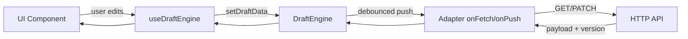

# @repo/draft-engine

Headless draft sync for React apps: debounced saves, optimistic concurrency (OCC), and conflict handling. Persistence is **never** built into the engine — you supply an **adapter** (`onFetch` / `onPush`) that talks to your API.

**Onboard in ~5 minutes:** read [Architecture](#architecture-overview) → [React example](#react-integration) → [Writing an adapter](#adapter-pattern).

---

## Architecture overview

The package splits responsibilities into three layers:

| Layer | Role |
|-------|------|
| **DraftEngine** | State machine: `IDLE` → `DIRTY` → `SYNCING` → `IDLE` or `ERROR`. Debounce, single-flight push, OCC conflicts. |
| **Adapter** | `DraftEngineConfig<T>` — your `onFetch` / `onPush` (HTTP, IndexedDB, etc.). |
| **UI** | `useDraftEngine` — subscribes to engine state; calls `setDraftData` on user edits (no sync useEffect). |

The engine does not know about tours, workspaces, or Nest. It only sees `DraftSyncPayload<T>`:

```typescript
type DraftSyncPayload<T> = {
  data: T;
  version: number;      // OCC token from server
  lastModified: number; // client epoch ms
};
```



---

## Installation

This package lives in the monorepo at `packages/draft-engine`. Apps depend on it via:

```json
"@repo/draft-engine": "workspace:*"
```

Build before consuming from TypeScript:

```bash
pnpm --filter @repo/draft-engine run build
```

**Peer dependency:** `react@^18.3.1` (only required if you use `useDraftEngine`).

---

## Core API: `DraftEngine<T>`

### Constructor

```typescript
const engine = new DraftEngine<MySnapshot>({
  id: "my-feature:workspace-123",
  autoApply: true, // optional, default true
  conflictStrategy: "SERVER_WINS",
  debounceMs: 500, // optional, default 500
  onFetch: async () => { /* DraftSyncPayload | null */ },
  onPush: async (payload) => { /* return updated DraftSyncPayload */ },
  onDelete: async () => { /* optional, required for clearDraft() */ },
  merge: (local, server) => ({ ...local, ...server }), // required for MERGE
});
```

### Methods

| Method | Description |
|--------|-------------|
| `initialize()` | Sets `SYNCING`, calls `onFetch`. Applies payload or leaves empty. Ends in `IDLE` or `ERROR`. **Does not** mark dirty or push. |
| `update(data)` | Stores local data, sets `DIRTY`, schedules debounced `onPush`. |
| `retry()` | If `ERROR` and no data → `initialize()` again. If `ERROR` with data → re-push. |
| `subscribe(listener)` | Calls `listener` immediately and on every state change. Returns unsubscribe. |
| `getState()` | Readonly snapshot: `{ data, status, version, lastModified, error? }`. |

### Status values

| Status | Meaning |
|--------|---------|
| `IDLE` | In sync with server (or never edited). |
| `DIRTY` | Local changes pending debounced push. |
| `SYNCING` | `onFetch` or `onPush` in flight. |
| `ERROR` | Last fetch or push failed; use `retry()`. |

---

## React integration

```tsx
"use client";

import { useDraftEngine } from "@repo/draft-engine";
import { useForm } from "react-hook-form";
import { useEffect, useMemo, useRef } from "react";
import { createMyDraftAdapter } from "./my-draft-adapter";

export function MyEditor({ workspaceId }: { workspaceId: string }) {
  const suppressPush = useRef(false);

  const config = useMemo(
    () => createMyDraftAdapter({ workspaceId }),
    [workspaceId],
  );

  const { state, setDraftData, retry, initialize } = useDraftEngine(config);

  const form = useForm({ defaultValues: { title: "" } });

  useEffect(() => {
    void initialize();
  }, [initialize]);

  useEffect(() => {
    if (state.data && state.status !== "SYNCING") {
      suppressPush.current = true;
      form.reset(state.data);
      queueMicrotask(() => {
        suppressPush.current = false;
      });
    }
  }, [state.data, state.status]); // narrow deps in production

  const watched = form.watch();
  useEffect(() => {
    if (!form.formState.isDirty || suppressPush.current) return;
    update(form.getValues());
  }, [watched, form.formState.isDirty, update]);

  return (
    <>
      {state.status === "SYNCING" && <span>Saving…</span>}
      {state.status === "ERROR" && (
        <button type="button" onClick={() => void retry()}>
          Retry save
        </button>
      )}
      {/* form fields */}
    </>
  );
}
```

**Guardrails:**

- Call `setDraftData` when the user edits (e.g. via `react-hook-form` `watch` subscription), not from a `useEffect` that depends on engine `state.status`.
- Do not call `setDraftData` after programmatic `reset()` from hydrate (`suppressDraftPushRef` pattern).
- Use a ref to suppress pushes during programmatic hydration.
- For manual restore UX, set `autoApply: false` and watch for `state.status === "DRAFT_AVAILABLE"`.

### Manual restore mode (`autoApply: false`)

When `autoApply` is `false`, `initialize()` does not hydrate fetched data immediately:

- fetched draft is exposed as `state.pendingDraft`
- engine status becomes `DRAFT_AVAILABLE`
- UI chooses between:
  - `applyDraft()` to hydrate and continue in `IDLE`
  - `clearDraft()` to delete remote draft via `onDelete` and clear local state

---

## Conflict strategies and OCC

The server should reject stale writes with **409** and a body that includes the current server payload. The adapter throws `DraftConflictError(serverPayload)`; the engine applies the chosen strategy.

| Strategy | Behavior |
|----------|----------|
| `SERVER_WINS` | Apply server payload locally; status → `IDLE`. |
| `REFETCH_REAPPLY` | On 409: re-fetch via `onFetch`, `merge(local, server)`, quiet hydrate (`setDraftData` remote + server `version`) — **no auto-retry push**. |
| `CLIENT_WINS` | Retry `onPush` with current local data (may conflict again). |
| `MERGE` | Call `config.merge(local, server.data)`, set `DIRTY`, schedule another push. Requires `merge` fn. |

**Versioning flow:**

1. `initialize()` → GET returns `{ data, version: 3, lastModified }`.
2. User edits → `update()` keeps `version: 3` until push runs.
3. `onPush({ data, version: 3, ... })` → server returns `{ ..., version: 4 }` or **409** with `server: { version: 5, ... }`.
4. On 409, engine runs conflict strategy; adapter must surface `DraftConflictError`.

---

## Adapter pattern

An adapter is a factory that returns `DraftEngineConfig<T>`:

```typescript
import type { DraftEngineConfig, DraftSyncPayload } from "@repo/draft-engine";
import { DraftConflictError } from "@repo/draft-engine";
import { fetchDraftSnapshot, patchDraftSnapshot } from "@/lib/draft-engine.client";

export type InvoiceDraftSnapshot = {
  lines: InvoiceLine[];
  stepIndex: number;
};

export function createInvoiceDraftAdapter(workspaceId: string): DraftEngineConfig<InvoiceDraftSnapshot> {
  const draftKey = "invoice-editor";

  return {
    id: `${draftKey}:${workspaceId}`,
    conflictStrategy: "SERVER_WINS",
    debounceMs: 500,
    onFetch: async () => {
      const remote = await fetchDraftSnapshot<InvoiceDraftSnapshot>(workspaceId, draftKey);
      return remote;
    },
    onPush: async (payload: DraftSyncPayload<InvoiceDraftSnapshot>) => {
      return patchDraftSnapshot(workspaceId, draftKey, payload);
    },
  };
}
```

**Reference implementation:** `apps/web/src/features/tours/drafts/denali-adapter.ts` (Denali create tour wizard).

**Transport API in this repo:** `GET/PATCH/DELETE /api/workspaces/:tenantId/draft-engine/:draftKey` → Nest `draft_snapshots` table.

---

## Public exports

From `@repo/draft-engine`:

- `DraftEngine`
- `useDraftEngine`
- `DraftConflictError`
- Types: `DraftEngineConfig`, `DraftEngineState`, `DraftSyncPayload`, `DraftStatus`, `ConflictStrategy`

---

## Scripts

```bash
pnpm --filter @repo/draft-engine run build
pnpm --filter @repo/draft-engine run lint
pnpm --filter @repo/draft-engine run test
```

---

## Testing

Unit tests live in `src/engine.spec.ts` (initialize, debounce, mutex, errors, conflicts, subscribe, retry). Run:

```bash
pnpm --filter @repo/draft-engine run test
```
