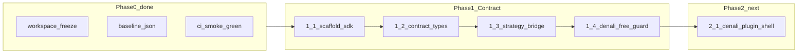
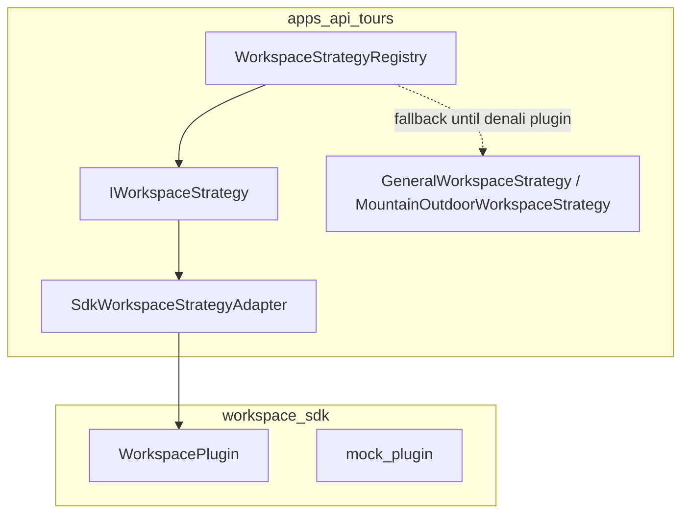

# Phase 1 — Platform Contract (`workspace-sdk`)

**Tour Ops — راهنمای اجرایی فاز یک (قرارداد TypeScript قبل از جابجایی Denali)**

> **نقش این سند:** بسط عمیق فاز ۱ در [`map.md`](map.md) — طراحی `@repo/workspace-sdk`، bridge به API فعلی، exit criteria، و پل به Phase 2.1  
> **North Star:** Platform logic = generic · Workspace logic = injectable  
> **پیش‌نیاز:** فاز ۰ تکمیل — [`phase-0-platform-baseline.md`](phase-0-platform-baseline.md)  
> **وضعیت:** **فاز ۱ تکمیل (محلی)** — آماده **Phase 2.1**  
> **گزارش guard:** [`reports/phase-1-guard-2026-06-01.json`](reports/phase-1-guard-2026-06-01.json) (پس از اجرای `pnpm run phase-1:guard`)  
> **Branch:** `main`  
> **گزارش‌های مرجع فاز ۰:** [`phase-0-baseline-2026-06-01.json`](reports/phase-0-baseline-2026-06-01.json) · [`phase-0-workspace-freeze.json`](reports/phase-0-workspace-freeze.json)

---

## فهرست

1. [جایگاه در نقشه و تعریف فاز یک](#1-جایگاه-در-نقشه-و-تعریف-فاز-یک)
2. [پیش‌نیازها — ورود از Phase 0](#2-پیش‌نیازها--ورود-از-phase-0)
3. [تحلیل وضعیت فعلی (قبل از SDK)](#3-تحلیل-وضعیت-فعلی-قبل-از-sdk)
4. [زیرفاز 1.1 — Scaffold پکیج](#4-زیرفاز-11--scaffold-پکیج)
5. [زیرفاز 1.2 — انواع قرارداد](#5-زیرفاز-12--انواع-قرارداد)
6. [زیرفاز 1.3 — Bridge `IWorkspaceStrategy`](#6-زیرفاز-13--bridge-iworkspacestrategy)
7. [زیرفاز 1.4 — Guardrails و CI](#7-زیرفاز-14--guardrails-و-ci)
8. [طراحی عمیق قرارداد (مرجع پیاده‌سازی)](#8-طراحی-عمیق-قرارداد-مرجع-پیاده‌سازی)
9. [نقشه adapter و مسیر Phase 2](#9-نقشه-adapter-و-مسیر-phase-2)
10. [آنچه در Phase 1 انجام نمی‌شود](#10-آنچه-در-phase-1-انجام-نمی‌شود)
11. [ریسک‌ها و mitigation](#11-ریسک‌ها-و-mitigation)
12. [پیوست‌ها](#12-پیوست‌ها)

---

## 1. جایگاه در نقشه و تعریف فاز یک

### 1.1 چرا فاز یک وجود دارد؟

پس از **freeze** فاز ۰، repo هنوز معماری **Denali-locked** دارد: registry، types، API strategy و web wizard همگی نام و مسیر Denali را در لایهٔ «core» حمل می‌کنند. پرش مستقیم به `packages/workspaces/denali` (فاز ۲) بدون قرارداد مشترک منجر می‌شود به:

- دوباره‌کاری بین `IWorkspaceStrategy` (API)، `TourWorkspaceDefinition` (`shared-contracts`)، و `denali-domain` (web/registry);
- شکستن API tests هنگام اولین `git mv`;
- عدم امکان mock workspace برای تست platform بدون bootstrap کامل Denali.

**فاز ۱ = Contract only:** تعریف **`@repo/workspace-sdk`** به‌عنوان زبان مشترک pluginها — **بدون** جابجایی فایل Denali و **بدون** تغییر رفتار production ویزارد.

| خروجی فاز ۱ | معنی عملی |
|-------------|-----------|
| `@repo/workspace-sdk` | پکیج build‌شونده، denali-free |
| `WorkspacePlugin` | شکل رسمی یک workspace (فیلد، rule، wizard، validation، lifecycle) |
| `CanonicalDocument` | SoT generic برای persist/validate (جایگزین مفهومی `DenaliCanonicalTourModel` در لایه contract) |
| Mock plugin + unit tests | اثبات contract بدون Denali |
| Adapter API | `IWorkspaceStrategy` از روی plugin یا legacy strategy — رفتار یکسان، تست‌های موجود سبز |
| Guardrail CI | import `denali` در SDK = fail |

### 1.2 DAG فاز یک



**Overlap مجاز در فاز ۱:**

- اضافه کردن type/interface در SDK؛ mock plugin؛ adapter در API که **delegate** به کد موجود می‌کند؛ تست و guardrail؛ به‌روزرسانی این سند و `map.md`.

**Overlap ممنوع در فاز ۱:**

- `git mv` از `packages/denali-domain`؛ حذف `DENALI_STRATEGY_PROFILES` از API؛ تغییر DB؛ refactor web `wizard/denali/**`؛ حذف `DenaliWizardSyncContext`؛ افزودن `TourFormProfile` هشتم؛ تغییر hotspotهای §3.5 فاز ۰ در همان PR با contract.

### 1.3 ارتباط با فازهای مجاور

| فاز | وابستگی به خروج Phase 1 |
|-----|-------------------------|
| **2.1** shell `packages/workspaces/denali` | `WorkspacePlugin` + mock tests سبز |
| **2.2** move `denali-domain` | SDK types برای field registry / rule set |
| **2.3** `WorkspacePluginRegistry` در API | bridge 1.3 الگوی loader |
| **3.x** `platform-core` | `WorkspaceFieldRegistry` + `WorkspaceRuleSet` به‌عنوان input renderer |
| **4a** Canonical SoT | `CanonicalDocument` + `updateCanonical` semantics |
| **5** DB | `workspace_type` + `canonical_data` از همان document model |

### 1.4 تفکیک از «Contract»های دیگر

| مفهوم | محل امروز | بعد از فاز ۱ | بعد از فاز ۲+ |
|--------|-----------|--------------|----------------|
| Tour form profile (بستهٔ بسته) | `@repo/types` `TourFormProfile` | بدون تغییر membership تا پایان فاز ۱ | urban plugin جدا |
| Workspace UI/validation slice | `@repo/shared-contracts` `TourWorkspaceDefinition` | موازی تا bridge؛ سپس migrate به plugin | داخل `workspaces/*` |
| API runtime strategy | `IWorkspaceStrategy` + `WorkspaceStrategyRegistry` | adapter به SDK | registry از plugin |
| Denali field matrix | `@repo/denali-domain` | **بدون جابجایی** | `workspaces/denali/domain` |
| Web wizard shell | `WorkspaceTourWizard` + `bindings/denali.ts` | بدون تغییر رفتار | `WorkspacePluginProvider` (2.5) |

---

## 2. پیش‌نیازها — ورود از Phase 0

### 2.1 چک‌لیست ورود (همه باید برقرار باشند)

| # | شرط | تأیید |
|---|------|--------|
| 1 | [`map.md`](map.md) و این سند merge/on `main` | |
| 2 | [`reports/phase-0-baseline-2026-06-01.json`](reports/phase-0-baseline-2026-06-01.json) موجود | |
| 3 | `pnpm run ci:integrity` سبز (آخرین gate) | |
| 4 | `pnpm run qa:smoke:tour-wizard` سبز | |
| 5 | `pnpm run phase-0:verify-freeze` → OK | |
| 6 | بدون PR باز برای پروفایل هشتم | |
| 7 | PRهای فاز ۱ با `Phase: 1.x` در template | |

### 2.2 قوانین freeze (همچنان معتبر تا پایان فاز ۱)

از [`reports/phase-0-workspace-freeze.json`](reports/phase-0-workspace-freeze.json):

- **ممنوع:** افزودن مقدار به `TOUR_FORM_PROFILE_VALUES`
- **ممنوع:** rename گسترده `denali_*` در API core (جز doc/type alias در SDK با نام generic)
- **مجاز:** bump `TOUR_FORM_PROFILE_VERSION` فقط با تست snapshot + تأیید صریح (غیرمنتظره در فاز ۱)

### 2.3 Known issues پذیرفته‌شده در فاز ۱

| موضوع | سیاست |
|--------|--------|
| Root `pnpm build` / `shared-contracts` → `@repo/types/denali` | SDK نباید به `shared-contracts` وابسته شود تا حل شود؛ API bridge می‌تواند |
| Node 22 vs 24 | WARN؛ CI هدف Node 24 |
| `legacy_archive` در docs | غیر blocker |

---

## 3. تحلیل وضعیت فعلی (قبل از SDK)

این بخش **کد امروز** را توصیف می‌کند — مادهٔ اولیهٔ bridge فاز ۱.۳ است.

### 3.1 لایه‌های مرتبط

| لایه | مسیر | نقش در contract آینده |
|------|------|------------------------|
| API strategy | `apps/api/src/modules/tours/strategies/` | **منبع رفتار** bridge 1.3 |
| Shared workspace slice | `packages/shared-contracts/src/tours/workspace-*.ts`, `workspaces/denali.ts` | migrate به `WorkspacePlugin.validation` / `lifecycle` |
| Types profile | `packages/types/src/tour-form-profile.ts` | `supportedProfiles` / freeze |
| Types Denali wire | `packages/types/src/denali/` | **خارج از SDK** تا فاز ۲ |
| Denali domain | `packages/denali-domain/` | پیاده‌سازی آیندهٔ `denaliPlugin` — فاز ۲ |
| Web config | `apps/web/.../workspace-wizard.config.ts` | mirror `getWizardConfig` — فاز ۲.5 |

### 3.2 `IWorkspaceStrategy` — قرارداد de facto امروز

فایل: `apps/api/src/modules/tours/strategies/workspace.strategy.interface.ts`

```typescript
export interface IWorkspaceStrategy {
  readonly profile: TourFormProfile;
  getValidationRules(): WorkspaceValidationRules;
  getPublishPolicy(): WorkspacePublishPolicy;
  getFieldStripRules(): WorkspaceFieldStripRules;
  getWizardConfig(): WorkspaceWizardConfig;
  getRequiredSubmitFields(): WorkspaceRequiredSubmitFields;
}
```

**پیاده‌سازی‌ها:**

| کلاس | پروفایل‌ها |
|------|-----------|
| `GeneralWorkspaceStrategy` | همهٔ classic (`general`, `mountain_outdoor`, …) |
| `MountainOutdoorWorkspaceStrategy` | `denali_pilot`, `urban_event` |

**Registry:** `WorkspaceStrategyRegistry.resolve(profile)` — `DENALI_STRATEGY_PROFILES` هنوز در `workspace.strategy.registry.ts`.

### 3.3 `TourWorkspaceDefinition` — slice مشترک

فایل: `packages/shared-contracts/src/tours/workspace-definition.ts`

```typescript
export interface TourWorkspaceDefinition {
  readonly profile: TourFormProfile;
  readonly version: number;
  readonly roots: readonly string[];
  readonly ui: { readonly wizardMode: "classic" | "denali" };
  readonly validation: { checkCapacity; checkTripDetails };
  readonly lifecycle: { initialStatus; publishStatus; allowedTransitions };
}
```

**Registry:** `TOUR_WORKSPACE_DEFINITIONS` — فقط `denali_pilot`, `nature_trip` (arctic/classic), `urban_event` (اشتراک `DENALI_WORKSPACE`).

### 3.4 نگاشت پروفایل → workspace (freeze)

| `TourFormProfile` | `wizardMode` | Strategy class | `TourWorkspaceDefinition` |
|-------------------|--------------|----------------|---------------------------|
| `general` | classic | General | — |
| `mountain_outdoor` | classic | General | — |
| `nature_trip` | classic | General | `ARCTIC_WORKSPACE` |
| `cinema_event` | classic | General | — |
| `cultural_tour` | classic | General | — |
| `urban_event` | denali | MountainOutdoor | `DENALI_WORKSPACE` (shared) |
| `denali_pilot` | denali | MountainOutdoor | `DENALI_WORKSPACE` |

**نکتهٔ طراحی:** `urban_event` و `denali_pilot` هر دو `DENALI_WORKSPACE` دارند ولی invariantهای trip-details و template canonical فقط برای `denali_pilot` کامل است (`usesDenaliCanonicalTemplate`).

### 3.5 Denali roots (مرجع برای `CanonicalDocument.roots`)

`packages/shared-contracts/src/tours/denali-wizard.contract.ts`:

`basicInfo`, `programNature`, `transport`, `pricingPayment`, `participantRequirements`, `policies`, `photosData`, `tripDetails`

در SDK این‌ها **نمونه** برای plugin Denali هستند — SDK خودش نباید ثابت `DENALI_ROOTS` export کند.

### 3.6 شکاف‌های عمدی که فاز ۱ پر می‌کند

| شکاف | امروز | هدف فاز ۱ |
|------|--------|-----------|
| نام‌گذاری Denali در «core contract» | `TourWorkspaceDefinition` در shared-contracts با invariantهای `checkDenaliPilot*` | `WorkspacePlugin` generic |
| یکپارچگی registry + rules | فقط در `denali-domain` | interface `WorkspaceFieldRegistry` + `WorkspaceRuleSet` در SDK |
| تست platform بدون Denali | ندارد | `mock-workspace` plugin |
| Loader رسمی | `WorkspaceStrategyRegistry` hard-coded | آماده‌سازی `WorkspacePluginRegistry` (پیاده در 2.3) |

---

## 4. زیرفاز 1.1 — Scaffold پکیج

### 4.1 هدف

ایجاد `packages/workspace-sdk` در monorepo با build سبز، **صفر** وابستگی به `@repo/denali-domain` و `@repo/types/denali`.

### 4.2 ساختار پوشه (هدف)

```text
packages/workspace-sdk/
  package.json          # name: @repo/workspace-sdk
  tsconfig.json         # extends @repo/config
  src/
    index.ts            # public exports only
    plugin/
      workspace-plugin.ts
    canonical/
      canonical-document.ts
    registry/
      field-registry.ts
      rule-set.ts
    mock/
      mock-workspace.plugin.ts
    __tests__/
      mock-workspace.plugin.spec.ts
```

### 4.3 `package.json` (چک‌لیست)

| فیلد | مقدار |
|------|--------|
| `name` | `@repo/workspace-sdk` |
| `private` | `true` |
| `main` / `types` | `./dist/index.js` / `./dist/index.d.ts` |
| `exports` | `"."` only (زیرمسیرها بعداً) |
| `scripts.build` | `tsc -p tsconfig.json` |
| `scripts.test` | `node --import tsx --test "src/**/*.spec.ts"` |
| `dependencies` | حداقل: `@repo/types` (برای `TourFormProfile` اختیاری در 1.2) |
| **ممنوع در dependencies** | `@repo/denali-domain`, `@repo/types/denali`, `@repo/shared-contracts` (تا 1.2/1.3 طراحی شود) |

### 4.4 ثبت در monorepo

- [ ] `packages/workspace-sdk` تحت `packages/*` در `pnpm-workspace.yaml` (از قبل پوشش دارد)
- [ ] ریشه: `pnpm --filter @repo/workspace-sdk build` در chain مناسب (در صورت نیاز `package.json` root scripts)
- [ ] `turbo.json` / pipeline CI در صورت وجود task برای packages جدید

### 4.5 Exit criteria 1.1

- [x] پکیج وجود دارد و `pnpm --filter @repo/workspace-sdk build` سبز
- [x] `pnpm --filter @repo/workspace-sdk test` سبز (تست scaffold)
- [x] `rg -i denali packages/workspace-sdk/src` → **0** (توضیح denali-free فقط در `package.json` description)
- [x] `rg '@repo/denali-domain' packages/workspace-sdk` → **0**
- [ ] PR با `Phase: 1.1` merge

**وضعیت:** ✅ پیاده‌سازی محلی — منتظر PR

---

## 5. زیرفاز 1.2 — انواع قرارداد

### 5.1 هدف

تعریف typeهای پایدار که Phase 2 plugin و Phase 3 renderer مصرف می‌کنند — با **mock plugin** که همه interfaceها را implement می‌کند.

### 5.2 فهرست typeهای اجباری (حداقل)

| Type | مسئولیت |
|------|----------|
| `WorkspacePluginId` | شناسه plugin (`"mock"`, بعداً `"denali"`, `"urban"`) — **≠** `TourFormProfile` |
| `WorkspacePlugin` | تجمیع registry + rules + wizard + validation + lifecycle |
| `WorkspaceFieldRegistry` | فیلدهای schema-driven (path, step, visibility metadata) |
| `WorkspaceFieldRegistryEntry` | یک ردیف فیلد |
| `WorkspaceRuleSet` | قوانین visibility/required/hidden per matrix cell |
| `WorkspaceWizardSurface` | `wizardMode`, `roots`, `inactiveFieldGroups`, `railId` |
| `WorkspaceValidationHooks` | ظرفیت / trip-details بدون نام Denali |
| `WorkspaceLifecycleContract` | initial/publish status + transitions |
| `CanonicalDocument` | `{ schemaVersion, roots, data }` — generic JSON |
| `WorkspaceProfileBinding` | نگاشت `TourFormProfile` → `WorkspacePluginId` (برای loader) |

### 5.3 `CanonicalDocument` — طراحی

```typescript
/** Generic persisted wizard document (Phase 4a SoT target). */
export interface CanonicalDocument {
  readonly schemaVersion: number;
  /** Top-level keys allowed for this plugin (e.g. basicInfo, tripDetails). */
  readonly roots: readonly string[];
  /** Plugin-owned payload; validated by plugin schema in Phase 2+. */
  readonly data: Readonly<Record<string, unknown>>;
}
```

**قوانین:**

- SDK **نوع** `DenaliCanonicalTourModel` را import نمی‌کند.
- Adapter فاز ۱.۳ می‌تواند در API از/to `@repo/types/denali` تبدیل کند (خارج از SDK).
- `schemaVersion` monotonic per plugin — جدا از `TOUR_FORM_PROFILE_VERSION`.

### 5.4 `WorkspacePlugin` — شکل پیشنهادی

```typescript
export interface WorkspacePlugin {
  readonly id: WorkspacePluginId;
  readonly version: number;
  /** Profiles this plugin serves (subset of frozen TOUR_FORM_PROFILE_VALUES). */
  readonly supportedProfiles: readonly string[];
  readonly fieldRegistry: WorkspaceFieldRegistry;
  readonly ruleSet: WorkspaceRuleSet;
  readonly wizard: WorkspaceWizardSurface;
  readonly validation: WorkspaceValidationHooks;
  readonly lifecycle: WorkspaceLifecycleContract;
}
```

### 5.5 Mock plugin (`mock-workspace`)

| ویژگی | مقدار نمونه |
|--------|-------------|
| `id` | `"mock"` |
| `supportedProfiles` | `["general"]` |
| `wizardMode` | `"classic"` |
| `roots` | `["basics", "details"]` |
| `fieldRegistry` | ۲–۳ فیلد synthetic |
| `ruleSet` | یک cell ساده always-visible |
| `validation` | no-op checks returning `null` |
| `lifecycle` | `DRAFT` → `OPEN` |

**تست‌های unit اجباری:**

- mock plugin satisfies `WorkspacePlugin` (structural)
- `CanonicalDocument` با roots نامعتبر reject (helper validation در SDK)
- `WorkspaceProfileBinding` resolve برای `general` → `mock`

### 5.6 Exit criteria 1.2

- [x] همه typeهای §5.2 export از `src/index.ts`
- [x] `mock-workspace.plugin.ts` + spec ۷ case
- [x] بدون import از `denali-domain` / `types/denali`
- [x] JSDoc روی `WorkspacePlugin` و `CanonicalDocument` (`map.md` Phase 1)
- [x] `WorkspaceWizardMode`: `classic` \| `schema` (نگاشت به API `denali` در bridge 1.3)
- [ ] PR `Phase: 1.2` merge

**وضعیت:** ✅ پیاده‌سازی محلی — منتظر PR

---

## 6. زیرفاز 1.3 — Bridge `IWorkspaceStrategy`

### 6.1 هدف

API همچنان `WorkspaceStrategyRegistry` و `IWorkspaceStrategy` را صدا می‌زند؛ پیاده‌سازی داخلی از **SDK** (یا adapter به legacy) تغذیه می‌شود — **رفتار یکسان**، تست‌های tours سبز.

### 6.2 استراتژی bridge (پیشنهاد دو لایه)



**فاز 1.3 مرحله‌ای:**

1. **1.3a** — `SdkWorkspaceStrategyAdapter` فقط برای پروفایل `general` از mock plugin (feature flag یا registry branch).
2. **1.3b** — `LegacyStrategyWorkspacePluginAdapter`: ساخت `WorkspacePlugin` view از `MountainOutdoorWorkspaceStrategy` / builders بدون move فایل.
3. **1.3c** — همهٔ پروفایل‌ها از registry یکسان؛ حذف شاخه‌های تکراری فقط وقتی تست‌ها ثابت ماندند.

### 6.3 فایل‌های API تحت تأثیر (حداقل)

| فایل | تغییر |
|------|--------|
| `workspace.strategy.registry.ts` | inject adapter / plugin resolver |
| `workspace.strategy.builders.ts` | optional: export helpers برای adapter |
| `*.workspace.strategy.spec.ts` | snapshot parity |
| `apps/api` tests مرتبط با create/publish tour | سبز |

**ممنوع در 1.3:** حذف `DENALI_STRATEGY_PROFILES`؛ تغییر DTO shape؛ تغییر strip semantics.

### 6.4 معیار parity

برای هر `TourFormProfile` در freeze:

| متد | Parity check |
|-----|----------------|
| `getValidationRules()` | `inactiveFieldGroups`, `appliesWorkspaceTripDetailsValidation` |
| `getWizardConfig()` | `wizardMode`, `roots`, `railId` |
| `getFieldStripRules()` | `strip` deltas |
| `getPublishPolicy()` | `publishGeolocationCheck` فقط `denali_pilot` |
| `getRequiredSubmitFields()` | paths + `readSubmitFieldValue` برای transport |

### 6.5 Exit criteria 1.3

- [x] `@repo/workspace-sdk` در `apps/api` dependency
- [x] `workspace.strategy.registry.spec.ts` — 11/11 (شامل SDK adapter + legacy plugin view)
- [x] `pnpm --filter @apps/api run lint` (tsc) سبز
- [ ] `pnpm run ci:integrity` / smoke — قبل از merge توصیه
- [ ] PR `Phase: 1.3` merge

**پیاده‌سازی:** `SdkWorkspaceStrategyAdapter` برای `general` + `resolveWorkspacePluginForProfile` + `buildWorkspacePluginViewFromStrategy` (1.3b).

**وضعیت:** ✅ محلی — منتظر PR

---

## 7. زیرفاز 1.4 — Guardrails و CI

### 7.1 هدف

تضمین اینکه `packages/workspace-sdk` برای همیشه **denali-free** بماند و regression contract در CI دیده شود.

### 7.2 Guardrailهای اجباری

| ID | قانون | ابزار | blocking |
|----|--------|--------|----------|
| G1 | `rg -i denali packages/workspace-sdk` → 0 | script در `ci-integrity` یا `phase-1:guard` | ✅ |
| G2 | `rg '@repo/denali-domain' packages/workspace-sdk` → 0 | همان | ✅ |
| G3 | `rg '@repo/types/denali' packages/workspace-sdk` → 0 | همان | ✅ |
| G4 | dependency-cruiser: `workspace-sdk` ↛ `denali-domain` | rule جدید | ✅ |
| G5 | `pnpm --filter @repo/workspace-sdk test` | CI | ✅ |

### 7.3 اسکریپت پیشنهادی

`scripts/platform-transformation/phase-1-guard.mjs` + root:

```json
"phase-1:guard": "node scripts/platform-transformation/phase-1-guard.mjs"
```

خروجی: `reports/phase-1-guard-YYYY-MM-DD.json` (اختیاری ولی توصیه‌شده).

### 7.4 Regression metrics (ارتباط با فاز ۰)

پس از 1.4، هر PR فاز ۲+ باید:

```bash
pnpm run baseline:platform-metrics
```

و diff `denali_token_count` / `denali_import_edges` را در PR comment ثبت کند (سیاست §5.5 فاز ۰ — فعال‌سازی از فاز ۱ به بعد).

### 7.5 Exit criteria 1.4 — DoD کل Phase 1

- [x] G1–G5 در `phase-1-guard.mjs` + rule `workspace-sdk-denali-free` در depcruise
- [x] `pnpm run phase-1:guard` در `ci-integrity-check.sh`
- [x] `workspace-sdk` test در root `pnpm test`
- [x] [`map.md`](map.md) Phase 1 علامت ✅
- [ ] PR `Phase: 1.4` merge روی `main`

**دستور:** `pnpm run phase-1:guard`

**وضعیت:** ✅ محلی — منتظر PR

---

## 8. طراحی عمیق قرارداد (مرجع پیاده‌سازی)

### 8.1 `WorkspaceFieldRegistryEntry`

حداقل فیلدهایی که renderer (فاز ۳) نیاز دارد:

| فیلد | نوع | توضیح |
|------|-----|--------|
| `id` | `string` | stable id (`basics.title`) |
| `canonicalPath` | `string` | dot-path در `CanonicalDocument.data` |
| `stepId` | `string` | rail step |
| `groupSlug` | optional | `WizardFieldGroupSlug` از types |
| `kind` | enum | text, number, date, enum, composite-ref, … |
| `required` | boolean \| rule-ref | |
| `tags` | readonly string[] | matrix dimensions |

**منبع الهام:** `denaliFieldRegistryData.ts` — بدون کپی ۵۹ ردیف در SDK.

### 8.2 `WorkspaceRuleSet`

| مفهوم | توضیح |
|--------|--------|
| `matrixDimensions` | مثلاً `tourKind`, `duration` — generic string keys |
| `cells` | ترکیب dimension → overrides per field |
| `defaultCell` | fallback |

خروجی codegen فعلی (`denaliRuleSet.generated.ts`) در فاز ۲ به `WorkspaceRuleSet` map می‌شود.

### 8.3 `WorkspaceValidationHooks`

```typescript
export interface WorkspaceValidationHooks {
  checkCapacity(capacity: number): WorkspaceViolation | null;
  checkTripDetails(
    tripDetails: unknown,
    transportModes?: readonly string[] | null,
  ): WorkspaceViolation | null;
}

export interface WorkspaceViolation {
  readonly code: string;
  readonly message: string;
}
```

معادل generic `WorkspaceInvariantViolation` در shared-contracts.

### 8.4 `WorkspaceLifecycleContract`

```typescript
export interface WorkspaceLifecycleContract {
  readonly initialStatus: string;
  readonly publishStatus: string;
  readonly allowedTransitions: readonly { from: string; to: string }[];
}
```

برای classic از `TOUR_LIFECYCLE_TRANSITION_MATRIX`؛ برای Denali از `DENALI_WORKSPACE.lifecycle`.

### 8.5 `WorkspaceProfileBinding`

Loader آینده (2.3):

```typescript
export interface WorkspaceProfileBinding {
  readonly profile: string; // TourFormProfile
  readonly pluginId: WorkspacePluginId;
}
```

**Freeze امروز:** ۷ profile — binding table در plugin package Denali (دو profile → یک plugin) و Urban (فاز 4b).

### 8.6 وابستگی پکیج (هدف نهایی فاز ۱)

```text
@repo/types          ← workspace-sdk (profiles, slugs)
workspace-sdk        ← apps/api (adapter only in 1.3)
workspace-sdk        ← packages/workspaces/* (Phase 2+)
workspace-sdk        ← packages/platform-core (Phase 3+)

workspace-sdk        →  denali-domain     ❌
workspace-sdk        →  types/denali      ❌
platform-core        →  workspaces/*      ❌ (Phase 3)
```

---

## 9. نقشه adapter و مسیر Phase 2

### 9.1 از SDK به `denaliPlugin`

| مؤلفه فعلی | مقصد فاز ۲ |
|------------|------------|
| `packages/denali-domain/registry/*` | `workspaces/denali/domain/registry` |
| `denaliRuleSet.generated.ts` | `workspaces/denali/domain/rules` |
| `TourWorkspaceDefinition` denali | `denaliPlugin.lifecycle` + `validation` |
| `MountainOutdoorWorkspaceStrategy` | `denaliPlugin` + API loader |
| `@repo/types/denali/*` | `workspaces/denali/types` + shim export |

### 9.2 Shim strategy (فاز ۲.۲)

```text
@repo/denali-domain  →  re-export from @repo/workspaces/denali/domain
@repo/types/denali   →  re-export from workspaces/denali/types (موقت)
```

فاز ۱ shim نمی‌سازد — فقط interfaceها را ثابت می‌کند.

### 9.3 `WorkspacePluginRegistry` (API — فاز ۲.3)

```typescript
// شکل هدف — پیاده‌سازی در 2.3
export class WorkspacePluginRegistry {
  static resolvePlugin(profile: TourFormProfile): WorkspacePlugin;
  static resolveStrategy(profile: TourFormProfile): IWorkspaceStrategy;
}
```

فاز ۱.۳ `WorkspaceStrategyRegistry` را به این شکل **نزدیک** می‌کند بدون rename نهایی.

---

## 10. آنچه در Phase 1 انجام نمی‌شود

| کار | فاز صحیح | دلیل |
|-----|----------|------|
| `git mv` denali-domain | 2.2 | بدون SDK = breaking |
| `packages/workspaces/denali` | 2.1 | نیاز به contract |
| حذف `DENALI_STRATEGY_PROFILES` | 2.4 | API هنوز به constants وابسته |
| `WorkspacePluginProvider` در web | 2.5 | renderer هنوز Denali path |
| `platform-core` | 3.1 | بدون rule engine generic |
| `CanonicalStore` / حذف sync | 4a | بعد از renderer |
| `packages/workspaces/urban` | 4b | DoD دوم workspace |
| DB `canonical_data` | 5 | بعد از SoT |
| افزودن پروفایل هشتم | بعد از 1 | نقض freeze |
| رفع کامل `shared-contracts` build | 1–2 | SDK مستقل نگه دارید |
| تغییر رفتار smoke | — | فقط parity؛ smoke باید سبز بماند |

---

## 11. ریسک‌ها و mitigation

| ریسک | احتمال | اثر | Mitigation |
|------|--------|-----|------------|
| SDK پر از typeهای Denali-shaped | متوسط | فاز ۲ دوباره‌کاری | نام generic؛ مثال‌ها فقط در doc/2.x |
| Bridge رفتار متفاوت برای urban vs denali | بالا | publish bug | جدول parity §6.4؛ spec per profile |
| وابستگی SDK به shared-contracts | متوسط | build block | فقط types + own interfaces در 1.1–1.2 |
| `'@repo/types/denali'` در API adapter | پایین | coupling | adapter در API نه SDK |
| PR بزرگ 1.2+1.3+1.4 یکجا | بالا | review سخت | یک sub-phase = یک PR |
| فشار برای move زودهنگام | متوسط | smoke قرمز | §10 + CI smoke |
| Mock plugin بی‌ارزش | پایین | false confidence | تست‌های violation + binding |

---

## 12. پیوست‌ها

### پیوست A — چک‌لیست ورود Phase 2.1

پس از تکمیل §7.5:

- [ ] `@repo/workspace-sdk` در main با guard سبز
- [ ] Mock plugin tests ≥ 5 case
- [ ] API bridge برای همه profiles یا documented gap
- [ ] `baseline:platform-metrics` اجرا و commit گزارش جدید در صورت تغییر معنادار
- [ ] `phase-0:verify-freeze` هنوز OK
- [ ] smoke 7/7

### پیوست B — Template `package.json` (1.1)

```json
{
  "name": "@repo/workspace-sdk",
  "version": "0.1.0",
  "private": true,
  "main": "./dist/index.js",
  "types": "./dist/index.d.ts",
  "exports": {
    ".": {
      "types": "./dist/index.d.ts",
      "default": "./dist/index.js"
    }
  },
  "scripts": {
    "build": "tsc -p tsconfig.json",
    "lint": "tsc --noEmit",
    "test": "node --import tsx --test \"src/**/*.spec.ts\""
  },
  "dependencies": {
    "@repo/types": "workspace:*"
  },
  "devDependencies": {
    "@repo/config": "workspace:*",
    "tsx": "^4.20.6",
    "typescript": "5.9.3"
  }
}
```

### پیوست C — دستورات روزمره

```bash
# فاز 1.1+
pnpm --filter @repo/workspace-sdk build
pnpm --filter @repo/workspace-sdk test

# guard (پس از 1.4)
pnpm run phase-1:guard

# regression platform (از فاز 1 به بعد در PRهای ساختاری)
pnpm run baseline:platform-metrics

# smoke (نباید قرمز شود)
pnpm run qa:smoke:tour-wizard
pnpm run phase-0:verify-freeze
```

### پیوست D — نگاشت فایل legacy → SDK concept

| Legacy | SDK concept |
|--------|-------------|
| `IWorkspaceStrategy.getWizardConfig()` | `WorkspacePlugin.wizard` |
| `getValidationRules()` | `validation` + descriptor hints (adapter) |
| `getFieldStripRules()` | plugin `stripPolicy` (extension 1.2+) یا adapter |
| `getPublishPolicy()` | `lifecycle` + publish hooks |
| `TourWorkspaceDefinition` | subset of `WorkspacePlugin` |
| `denaliFieldRegistryData` | `WorkspaceFieldRegistry` |
| `denaliRuleSet.generated` | `WorkspaceRuleSet` |
| `DenaliCanonicalTourModel` | `CanonicalDocument` (+ adapter types/denali) |

### پیوست E — PR template (فاز ۱)

در description:

```text
Phase: 1.2
Scope: workspace-sdk types only — no Denali file moves
Checklist:
- [ ] rg -i denali packages/workspace-sdk → 0
- [ ] workspace-sdk build + test green
- [ ] qa:smoke:tour-wizard green (if API touched)
- [ ] phase-0:verify-freeze (if profiles touched)
```

### پیوست F — سوئیت تست پیشنهادی mock plugin

| # | case |
|---|------|
| 1 | `mock` plugin exposes `id` + `version` |
| 2 | `supportedProfiles` includes `general` |
| 3 | `CanonicalDocument` rejects path outside `roots` |
| 4 | `WorkspaceRuleSet` default cell applies |
| 5 | `WorkspaceViolation` null on valid capacity |
| 6 | `WorkspaceProfileBinding` resolves |

---

## مرجع سریع

| سند | نقش |
|-----|------|
| [`map.md`](map.md) | نقشهٔ فاز ۱–۵ |
| [`phase-0-platform-baseline.md`](phase-0-platform-baseline.md) | فاز ۰ (تکمیل) |
| این فایل | فاز ۱ — contract |
| [`docs/phase0-safety-net-baseline.md`](docs/phase0-safety-net-baseline.md) | Draft FSM (جدا) |
| `apps/api/.../workspace.strategy.interface.ts` | قرارداد API امروز |
| `packages/shared-contracts/.../workspace-definition.ts` | slice مشترک امروز |

**بعد از تکمیل §7.5 → شروع Phase 2.1 در `map.md` (`packages/workspaces/denali`).**
