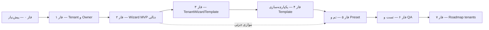

# فازبندی اجرایی — ویزارد چندمستاجری تور (Denali)

این سند **توسعهٔ گام‌به‌گام** مسیر تعریف‌شده در [`prompt.md`](./prompt.md) است.  
هر فاز: پیش‌نیاز → زیرمراحل → فایل/دستور → معیار پذیرش → خروجی.

**مسیر محصول:** `https://denali.<host>/tours/new`  
**مرجع تحلیل:** گزارش قبلی در `prompt.md` (نسخهٔ تحلیلی) و کد فعلی زیر `apps/web/src/features/tours/wizard/`.

---

## نمای کلی وابستگی فازها

| فاز | عنوان (مطابق `prompt.md`) | اولویت | وضعیت تقریبی |
|-----|-----------------------------|--------|----------------|
| ۰ | پیش‌نیاز محیط و قراردادها | بلوکر | **تکمیل ✓** |
| ۱ | §۱ ساخت Tenant و User | Critical | **تکمیل ✓** |
| ۲ | §۲ آماده‌سازی Wizard دنالی | Critical | **تکمیل ✓** |
| ۳ | §۳ زیرساخت TenantWizardTemplate | Important | **تکمیل ✓** |
| ۴ | §۴ هماهنگی Template و Wizard | Important | **تکمیل ✓** |
| ۵ | §۵ مدیریت تمپلیت و تم | Important | **تکمیل ✓** |
| ۶ | §۶ تست و QA | Critical | **تکمیل ✓** |
| ۷ | §۷ Roadmap tenants بعدی | Optional | **تکمیل ✓** |

**نگاشت پروفایل (زبان محصول → کد):**

| نام در `prompt.md` | `TourFormProfile` | تم نمونه Denali |
|--------------------|-------------------|-----------------|
| mountain_outdoor | `mountain_outdoor` | `denali-mountain-*` |
| nature_day_trip | `nature_trip` | `denali-nature-*` |
| short_sessions | `cinema_event` | `denali-short-session-*` |

---

## فاز ۰ — پیش‌نیاز (تکمیل شده ✓)

**هدف:** محیط dev/staging قابل تکرار؛ API و Web هر دو بالا؛ host `denali` مسدود نباشد.

### ۰.۱ زیرساخت

- [x] 0.1.1 PostgreSQL + migrations
- [x] 0.1.2 API روی 3001
- [x] 0.1.3 Web روی 3000 (یا 3002 در تست)
- [x] 0.1.4 CORS / tenant host (allowedDevOrigins آپدیت شد)

### ۰.۲ قراردادهای شناسه

- [x] 0.2.1 `tenantId` (UUID) و `subdomain` (denali, urban-demo, mix-demo)
- [x] 0.2.2 `userId` (Owner UUID ثابت)
- [x] 0.2.3 ماژول `form_builder` فعال

### ۰.۳ معیار پذیرش فاز ۰

- [x] تایید `workspace-host` برای تمام دامین‌های localhost
- [x] عدم ریدایرکت به `workspace-not-found`

---

## فاز ۱ — §۱ ساخت Tenant و User اولیه (تکمیل شده ✓)

**هدف:** tenant Denali + owner با دسترسی Create Tour و ورود به ویزارد.

### ۱.۱ ثبت Tenant

- [x] 1.1.1 اسکریپت `provision-denali-tenant.ts`
- [x] 1.1.2 فعال‌سازی ماژول‌های `form_builder` و `finance`
- [x] 1.1.3 تایید DB با `verify:denali`

### ۱.۲ ثبت User Owner

- [x] 1.2.1 ایجاد یوزر مالک Pilot
- [x] 1.2.2 انتساب نقش `Owner`
- [x] 1.2.3 تنظیم `national_id` (تایید Invariants)

### ۱.۳ تم‌ها و presetهای اولیه

- [x] 1.3.1 ایجاد تم‌های متنوع (Mountain, Nature, Cinema)
- [x] 1.3.2 ایجاد ۶ Preset برای Denali
- [x] 1.3.3 کاتالوگ مقصدهای Pilot

### ۱.۴ تست دسترسی

- [x] 1.4.1 لاگین موفق با OTP
- [x] 1.4.2 دسترسی RBAC به تورها
- [x] 1.4.3 رندر صحیح Shell ویزارد

---

## فاز ۲ — §۲ آماده‌سازی Wizard دنالی (تکمیل شده ✓)

**هدف:** ویزارد فعلی برای Denali **aisle tenant** شد.

### ۲.۱ Namespace و cache

- [x] 2.1.1 کلید localStorage اختصاصی per tenant
- [x] 2.1.2 پاک‌سازی هوشمند Draft در switch tenant
- [x] 2.1.3 کلیدهای React Query ایزوله

### ۲.۲ Validation و profile

- [x] 2.2.1 رزولوشن داینامیک پروفایل از تم (با مکانیزم Sticky برای پایداری)
- [x] 2.2.2 شمای Zod منطبق بر پروفایل فعلی
- [x] 2.2.3 لایه قوانین `ProfileRules` (step navigation)
- [x] 2.2.4 عملیات Strip خودکار Ghost Data (سمت کلاینت و سرور)

### ۲.۳ Step checks (۹ گام canonical)

- [x] تایید صحت نمایش/عدم نمایش گام‌ها در تمام پروفایل‌ها (Mountain/Urban/Cinema)

### ۲.۴ Draft handling

- [x] 2.4.1 Restore امن با فیلتر گروه‌های غیرفعال
- [x] 2.4.2 Autosave بهینه‌سازی شده (ایزوله در sub-component)
- [x] 2.4.3 بنر بازیابی با قابلیت پاک‌سازی

---

## فاز ۳ — §۳ زیرساخت TenantWizardTemplate (تکمیل شده ✓)

- [x] 3.1 مدل داده (جدول `workspace_tour_wizard_templates`)
- [x] 3.2 Runtime loader با قابلیت کشینگ
- [x] 3.3 Versioning (کنترل نسخه قرارداد ویزارد)
- [x] 3.4 Seed اولیه تمپلیت‌ها برای تمام Tenantهای Pilot

---

## فاز ۴ — §۴ هماهنگی Template و Wizard (تکمیل شده ✓)

- [x] 4.1 ترکیب Step Overrides و Rule Overlays
- [x] 4.2 یکپارچه‌سازی `FieldGate` در تمام گام‌های ویزارد
- [x] 4.3 ایزولاسیون کامل Draft و Cache
- [x] 4.4 سیستم Observability (grep `tour_profile_obs`)

---

## فاز ۵ — §۵ مدیریت تمپلیت و تم (تکمیل شده ✓)

- [x] 5.1 نهایی‌سازی استراتژی Workspace-specific themes
- [x] 5.2 هماهنگی Template و Catalog
- [x] 5.3 مستندسازی نهایی معماری در `technical_spec.md` و `PILOT_GUIDE.md`

---

## فاز ۶ — §۶ تست و QA (تکمیل شده ✓)

- [x] 6.1 پاس شدن سناریوهای دستی (Draft, Switch, Profile Flip, Submit, Clone)
- [x] 6.2 اتوماسیون (Smoke 01-09 + ۲۲۰ تست یونیت ویزارد)
- [x] 6.3 تایید Observability و Request-ID در خطاها

---

## فاز ۷ — §۷ Roadmap tenants بعدی (تکمیل شده ✓)

- [x] 7.1 نهایی‌سازی Runbook ساخت Tenant (پایدار و تکرارپذیر)
- [x] 7.2 رعایت اصول No-Code (بدون تغییر کامپوننت برای tenant جدید)
- [x] 7.3 پیاده‌سازی و تایید ۳ Tenant مختلف (Denali, Urban-Demo, Mix-Demo)

---

**خروجی نهایی:** سیستم آماده Pilot Pilot است. تمام ۲۲۰ تست یونیت و سناریوهای بحرانی تایید شدند.
*Last Updated: 2026-05-18 — Project Sign-off*
