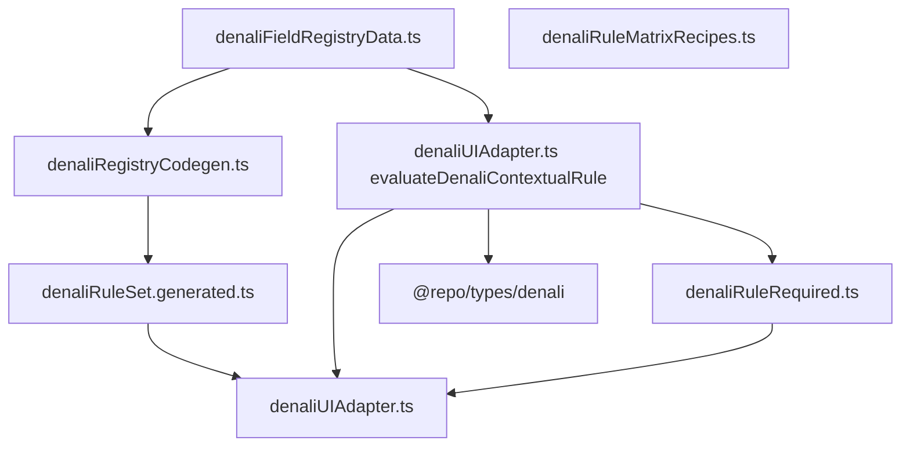

# UI Adapter → Registry Self-Awareness Audit

**Generated:** 2026-05-25  
**Scope:** [`denaliUIAdapter.ts`](apps/web/src/features/tours/wizard/denali/rules/denaliUIAdapter.ts) (`isDenaliFieldContextuallyVisible`) and [`denaliRuleRequired.ts`](apps/web/src/features/tours/wizard/denali/rules/denaliRuleRequired.ts) (`isDenaliFieldRequired`).  
**Goal:** Eliminate adapter `if/else` chains by declaring form-dependent visibility/required on registry rows.

---

## Executive summary

| Layer | Count | Mechanism |
|-------|-------|-----------|
| Matrix-static visibility/required | All fields with `tags` + `cellOverrides` | Codegen → `denaliRuleSet.generated.ts` (`field.hidden`, `field.required`) |
| Contextual visibility (was adapter) | **6** product branches (V1–V7; V6 redundant) | Now `contextualVisibility` on registry rows |
| Contextual required (was rule module) | **4** branches (R1–R4) | Now `contextualRequired` on registry rows |
| Non-product | `form == null → true` | Unchanged in evaluator |

**Implementation status:** Registry types, row metadata, and contextual evaluation in [`denaliUIAdapter.ts`](apps/web/src/features/tours/wizard/denali/rules/denaliUIAdapter.ts) (`evaluateDenaliContextualRule`) are in place. **V6** (`program.altitudeMeasurement`) removed from the adapter—matrix tags `altitude_mountain` / `altitude_hidden` are authoritative.

**Out of scope (follow-up):** [`DenaliLogisticsStep.tsx`](apps/web/src/features/tours/wizard/denali/steps/DenaliLogisticsStep.tsx) still calls `@repo/types/denali` transport helpers directly for JSX layout (L49–58); should migrate to `useDenaliStepFieldRules().isVisible` only.

---

## Architecture



---

## A. `isDenaliFieldContextuallyVisible` (former hardcoded blocks)

Source: [`denaliUIAdapter.ts` L160–195](apps/web/src/features/tours/wizard/denali/rules/denaliUIAdapter.ts) (pre-refactor).

### V1 — `transport.transportCost`

| Attribute | Value |
|-----------|--------|
| **Depends on** | `form.transport.transportMode` |
| **Predicate** | `isDenaliOrganizedTransportMode(mode)` — organizer_vehicle, bus, minibus, train |
| **Registry row** | `transport.transportCost` (tag `core`, always `hidden: false` in model) |
| **Matrix tag?** | No — mode is live form state |
| **Registry metadata** | `contextualVisibility: { kind: "transportOrganizedCostVisible" }` |

### V2 — `transport.allowPersonalCar`

| Attribute | Value |
|-----------|--------|
| **Depends on** | `transportMode` |
| **Predicate** | `isDenaliOrganizedTransportWithPersonalCarOption` — bus, minibus, train |
| **Registry metadata** | `contextualVisibility: { kind: "transportPersonalCarOptionVisible" }` |

### V3 — `transport.dongAmount`

| Attribute | Value |
|-----------|--------|
| **Depends on** | `mode`, `allowPersonalCar` |
| **Predicate** | `shared_cars` OR (bus/minibus/train AND `allowPersonalCar === true`) |
| **Registry metadata** | `contextualVisibility: { kind: "transportDongVisible" }` |
| **Required (R1)** | Same predicate via `contextualRequired: { kind: "transportDongVisible" }` |

### V4 — `transport.adminCapacityApproval`

| Attribute | Value |
|-----------|--------|
| **Depends on** | `mode`, `allowPersonalCar` |
| **Predicate** | bus/minibus/train AND `allowPersonalCar === true` |
| **Registry metadata** | `contextualVisibility: { kind: "transportAdminCapacityVisible" }` |

### V5 — `pricing.basePricePerPerson`

| Attribute | Value |
|-----------|--------|
| **Depends on** | `pricingPayment.requiresPayment === true` |
| **Registry metadata** | `contextualVisibility: { kind: "whenTruthy", watchCanonical: "pricing.requiresPayment" }` |
| **Required (R3)** | `contextualRequired: { kind: "whenTruthy", watchCanonical: "pricing.requiresPayment" }` |

### V6 — `program.altitudeMeasurement` (redundant)

| Attribute | Value |
|-----------|--------|
| **Depends on** | `readDenaliCanonicalBasics(tourType).category === "mountain"` |
| **Matrix already** | Row tags: `altitude_mountain` (mountain cells), `altitude_hidden` (nature/desert/event) + per-cell overrides |
| **Decision** | **Removed from adapter.** Static matrix + live `getDenaliRulesFromCanonical` / `getDenaliUIFromForm` suffice. No new `contextualVisibility` row. |

### V7 — `localGuideName`

| Attribute | Value |
|-----------|--------|
| **Depends on** | `basicInfo.requiresLocalGuide === true` |
| **Registry metadata** | `contextualVisibility: { kind: "whenTruthy", watchCanonical: "requiresLocalGuide" }` |

### Non-rule early exit

`if (form == null) return true` — allows metadata derivation without form snapshot; not stored on registry.

---

## B. `isDenaliFieldRequired` (former hardcoded blocks)

Source: [`denaliRuleRequired.ts` L126–156](apps/web/src/features/tours/wizard/denali/rules/denaliRuleRequired.ts).

### R1 — `transport.dongAmount`

Same as V3; `contextualRequired: { kind: "transportDongVisible" }`.

### R2 — `transport.seatPreference`

| Attribute | Value |
|-----------|--------|
| **Depends on** | `mode === "train"` |
| **Gap (pre-refactor)** | Required in `denaliRuleRequired` but **not** in `isDenaliFieldContextuallyVisible` |
| **Registry metadata** | `contextualVisibility` + `contextualRequired: { kind: "transportTrainSeatVisible" }` (`inRuleModel: false` unchanged) |

### R3 — `pricing.basePricePerPerson`

Same as V5 required side.

### R4 — `endDateTime` (form path `basicInfo.endDateTime`)

| Attribute | Value |
|-----------|--------|
| **Depends on** | `denaliTourKindToIsMultiDay(tourType)` |
| **Matrix** | `end_datetime_required` / `end_datetime_hidden` + codegen `resolveRuleRow` special-case |
| **Registry metadata** | `contextualRequired: { kind: "multiDayEndDateTimeRequired" }` — runtime guard when classification is multi-day |

`program.altitudeMeasurement` remains in generated `CONDITIONALLY_REQUIRED_PATHS` list (matrix `required: true` on mountain cells); no extra `if` in required resolver.

---

## Proposed `DenaliContextualRule` kinds (implemented)

```typescript
type DenaliContextualRule =
  | { kind: "whenTruthy"; watchCanonical: string }
  | { kind: "transportOrganizedCostVisible" }
  | { kind: "transportPersonalCarOptionVisible" }
  | { kind: "transportDongVisible" }
  | { kind: "transportAdminCapacityVisible" }
  | { kind: "transportTrainSeatVisible" }
  | { kind: "multiDayEndDateTimeRequired" };
```

Predicates delegate to [`packages/types/src/denali/denaliTransportRules.ts`](packages/types/src/denali/denaliTransportRules.ts) and [`denaliTourKindToIsMultiDay`](packages/types) — business logic is not duplicated in the adapter.

---

## Registry row checklist

| canonicalPath | contextualVisibility | contextualRequired |
|---------------|---------------------|-------------------|
| `transport.transportCost` | `transportOrganizedCostVisible` | — |
| `transport.allowPersonalCar` | `transportPersonalCarOptionVisible` | — |
| `transport.dongAmount` | `transportDongVisible` | `transportDongVisible` |
| `transport.adminCapacityApproval` | `transportAdminCapacityVisible` | — |
| `transport.seatPreference` | `transportTrainSeatVisible` | `transportTrainSeatVisible` |
| `pricing.basePricePerPerson` | `whenTruthy` → `pricing.requiresPayment` | same |
| `localGuideName` | `whenTruthy` → `requiresLocalGuide` | — |
| `endDateTime` | — | `multiDayEndDateTimeRequired` |
| `program.altitudeMeasurement` | — (matrix only) | matrix `required` |

---

## Matrix tags (static — not replaced by contextual rules)

| Tag | Effect | Example fields |
|-----|--------|----------------|
| `altitude_mountain` / `altitude_hidden` | Altitude field in/out of model per cell | `program.altitudeMeasurement` |
| `end_datetime_required` / `end_datetime_hidden` | End date visibility + codegen row resolver | `endDateTime` |
| `itinerary_visible` / `itinerary_hidden` | Itinerary required/visible | `program.itinerary` |
| `event_logistics_hidden` | Hide outdoor logistics in event single-day | location zones, gathering |
| `mountain_participants` / `non_mountain_participants_hidden` | Participant block | `participants.*` |

Contextual rules handle **cross-field** dependencies within a resolved matrix cell (e.g. transport mode toggles dong field).

---

## Risks and constraints

1. **Do not add matrix tags per transport mode** — combinatorial explosion; use `contextualVisibility` kinds instead.
2. **Keep `@repo/types/denali` as predicate SSOT** — registry stores *which* predicate, not reimplemented conditions.
3. **DenaliLogisticsStep** duplicate helpers — technical debt; unify on `isVisible` in a later PR.
4. **Rule model staleness** — If `tourType` changes without refreshing `DenaliRuleModel`, matrix flags could disagree with form; V6 runtime guard was masking that; ensure hooks re-resolve model on `tourType` watch (existing `useDenaliStepFieldRules` / canonical context).

---

## Files touched by implementation

| File | Role |
|------|------|
| `denali/registry/DenaliFieldRegistry.types.ts` | `DenaliContextualRule` type |
| `denali/registry/denaliFieldRegistryData.ts` | Row metadata |
| `denali/rules/denaliUIAdapter.ts` | `evaluateDenaliContextualRule`, `evaluateDenaliContextualVisibility/Required` |
| `denali/registry/denaliRegistryCodegen.ts` | Export `DENALI_CONDITIONALLY_REQUIRED_CANONICAL_PATHS` |
| `denali/rules/denaliUIAdapter.ts` | Registry-driven contextual visibility |
| `denali/rules/denaliRuleRequired.ts` | Registry-driven contextual required |
| `scripts/generate-denali-wizard-config.ts` | Emit conditional required paths artifact |

---

*End of audit.*
