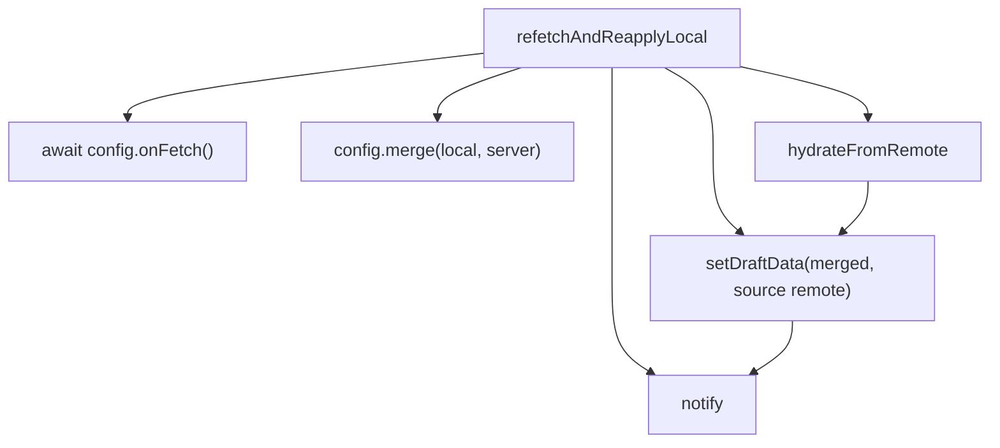

# Denali Create Tour Wizard — UX Field Audit & Dependency Map

**Audit date:** 2026-05-27  
**Scope:** `DenaliCreateTourWizard.tsx` and imported Denali step components  
**Sources of truth:** `denaliFieldRegistryData.ts`, `denaliRuleSet.generated.ts`, `denaliTourCreateBaseSchema.generated.ts`, `denaliWizardFormZod.ts`, `denaliUIAdapter.ts`, `buildDenaliCreateTourPayloadProjection.ts`, `denaliCanonicalFormAdapter.ts`

---

## 1. Wizard shell & step routing

| Step ID (FA title) | Step component | Primary file |
|--------------------|----------------|--------------|
| `denali_basic` — اطلاعات پایه | `DenaliBasicInfoStep` | `apps/web/src/features/tours/wizard/denali/steps/DenaliBasicInfoStep.tsx` |
| `denali_program` — برنامه | `DenaliProgramNatureStep` | `.../denali/steps/DenaliProgramNatureStep.tsx` |
| `denali_logistics` — لجستیک و خدمات | `DenaliLogisticsStep` | `.../denali/steps/DenaliLogisticsStep.tsx` |
| `denali_photos` — عکس‌ها | `DenaliPhotosStep` | `.../denali/steps/DenaliPhotosStep.tsx` |
| `denali_pricing` — هزینه | `DenaliPricingStep` + `DenaliPricingParticipantSection` | `.../denali/steps/DenaliPricingStep.tsx`, `DenaliPricingParticipantSection.tsx` |
| `review` — بازبینی و ثبت | `DenaliReviewStep` (read-only + publish) | `.../denali/steps/DenaliReviewStep.tsx` |

**Shell:** `apps/web/src/components/tours/wizard/DenaliCreateTourWizard.tsx` — `FormProvider`, `useDraftEngine`, `DenaliCanonicalProvider`, stepper via `getDenaliWizardVisibleSteps()`.

**Removed from rail (not in UI):** `denali_participants`, `denali_policies` (standalone), `denali_transport` (merged into logistics). See `denaliStepConfig.ts` → `DENALI_MVP_REMOVED_STEPS`.

---

## 2. Validation layers (how Required is decided)

| Layer | Role |
|-------|------|
| **Structural Zod** | `denaliTourCreateBaseSchema` — shape, types, max lengths, ISO dates, superRefine (no zero capacity/transport/price when applicable). Does **not** encode product requiredness alone. |
| **Rule matrix** | `denaliRuleSet.generated.ts` — per `category × duration` cell: `required`, `hidden` per canonical path. |
| **Contextual rules** | `denaliFieldRegistryData.contextualVisibility` / `contextualRequired` — evaluated in `denaliUIAdapter.ts` (transport mode, payment toggle, local guide, capabilities, multi-day end). |
| **Submit** | `getDenaliWizardSubmitIssues()` — structural + `collectDenaliRuleRequiredIssues` + canonical schema (`denaliCanonicalTourSchema.unified`). |

**Column “Required” below:** Rule-matrix default for **mountain / single_day** unless noted; actual requiredness changes per `category×duration` (see §6). “R*” = required when visible per matrix; “O” = optional.

**Column “Zod”:** `zodKind` → generated field in `denaliTourCreateBaseSchema.generated.ts`.

---

## 3. Field inventory (registry-backed)

### Step 1 — `denali_basic` (اطلاعات پایه)

| Field path (RHF) | UI label (concept) | UI component | Required (mountain:single_day) | Zod rule | Dependency / visibility |
|------------------|-------------------|--------------|-------------------------------|----------|-------------------------|
| `basicInfo.title` | عنوان تور | `DenaliBasicInfoStep` | R* | `title`: trim, min/max length | Always visible |
| `basicInfo.publishStatus` | وضعیت انتشار | `DenaliReviewStep` + `TourPublishStatusField` | R* | `publishStatus`: enum draft/active | Edited on **review**; defaults `draft` |
| `basicInfo.tourType` | دسته + مدت (+ زیرنوع رویداد) | `DenaliBasicInfoStep` (3 selects → one kind) | R* | `tourType`: `denaliTourKindSchema` enum | `eventVariant` UI when category=event; duration options disabled via `isDurationAllowed` |
| `basicInfo.destinationId` | مقصد | `DestinationCombobox` | R* | `destinationId`: optional string (requiredness from rules) | Hidden if rule cell hides destination |
| `tripDetails.overview.peakHeight` | ارتفاع قله | `DenaliBasicInfoStep` | R* | `optionalInt` ≥0 | **Hidden:** nature/desert/event cells; `clearWhenNotVisible`; auto-fill from destination altitude |
| `basicInfo.startDateTime` | تاریخ/ساعت شروع | `DenaliDatetimeField` | R* | ISO datetime string, must parse | Always |
| `basicInfo.endDateTime` | تاریخ/ساعت پایان | `DenaliDatetimeField` | O (R on multi-day) | ISO optional datetime | **Hidden** single-day; **required** when `multiDayEndDateTimeRequired` (multi-day kind) |
| `basicInfo.capacityMax` | ظرفیت حداکثر | `DenaliBasicInfoStep` | R* | int optional + superRefine ≠0 | Visible when rule cell allows |
| `basicInfo.capacityMin` | ظرفیت حداقل | `DenaliBasicInfoStep` | O | `optionalInt` ≥0 | Optional |
| `basicInfo.approximateReturnTime` | ساعت تقریبی بازگشت | `DenaliApproximateReturnTimeField` | O | HH:mm regex | Optional |
| `basicInfo.leaderUserIds` | سرپرست‌های workspace | `DestinationCombobox` (multi) | O | `string[]` default [] | Optional |
| `basicInfo.requiresLocalGuide` | نیاز به راهنمای محلی | checkbox | O | boolean optional | — |
| `basicInfo.localGuideName` | نام راهنما | text | O | string optional | **Visible when** `requiresLocalGuide` truthy |
| `basicInfo.requiresManualAdminApproval` | تأیید دستی ادمین | checkbox | O | boolean optional | Inverts `autoAcceptRegistrations` on API |
| `basicInfo.socialMediaLink` | لینک شبکه اجتماعی | text | O | string max 2048 | Optional |
| `basicInfo.startPointLocationText` | متن نقطه شروع | — (review only) | O | string optional | **Not rendered** on create steps; review mirror only |
| `basicInfo.meetingPoint` | نقطه ملاقات (legacy string) | — | O | string optional | Registry only; not in current step UI |

**Sub-controls:** Quick-add destination button (`useDenaliDestinationQuickAdd`).

---

### Step 2 — `denali_program` (برنامه)

| Field path (RHF) | UI label | UI component | Required | Zod | Dependency |
|------------------|----------|--------------|----------|-----|------------|
| `programNature.themeIds` | تم‌ها | checkbox list | O | `string[]` default [] | Catalog-driven active themes |
| `programNature.shortDescription` | توضیح کوتاه | textarea | R* | string optional (rules enforce) | Always |
| `programNature.longDescription` | توضیح بلند | textarea | O | string optional | Optional |
| `programNature.difficultyLevel` | سطح سختی | range 1–10 | R* | number 1–10 optional | **Outdoor block:** visible when `program.difficultyLevel` + `program.hikingHoursApprox` paths visible; **hidden** event:single_day |
| `programNature.hikingHoursApprox` | ساعات پیاده‌روی | number | R* | `optionalPositiveInt` | Same outdoor block |
| `programNature.hikingGoHours` | ساعات رفت | number | O | `optionalPositiveInt` | Outdoor block |
| `programNature.hikingReturnHours` | ساعات برگشت | number | O | `optionalPositiveInt` | Outdoor block |
| `tripDetails.metrics.elevationGain` | ارتفاع صعود مسیر | `DenaliItineraryStep` | O | `optionalInt` | **Hidden** nature/desert/event; `clearWhenNotVisible` |
| `programNature.itinerary[]` | برنامه روزانه | `DenaliDailyItinerarySection` | O (R multi-day mountain) | `denaliItineraryDayRowSchema[]` | **Hidden** single-day; **shown** multi-day mountain/nature/desert; row count = `computeDenaliTourDayCountFromKind` |

**Per itinerary day** (`programNature.itinerary[i]`):

| Sub-field | UI | Zod | Dependency |
|-----------|-----|-----|------------|
| `day` | implicit | int ≥1 | Synced from tour dates |
| `activities` | textarea | string trim | Required per day when itinerary required |
| `location` / `locationText` | `DenaliItineraryDayLocationField` | `denaliLocationDataSchema` optional | Optional per day |
| `photos[]` | `DenaliItineraryDayPhotos` | photo refs (id, url) | Optional |

---

### Step 3 — `denali_logistics` (لجستیک و خدمات)

| Field path (RHF) | UI label | UI component | Required | Zod | Dependency |
|------------------|----------|--------------|----------|-----|------------|
| `tripDetails.logistics.gatheringPoints[]` | ایستگاه‌های تجمع | `DenaliGatheringPointsWidget` | O | `denaliGatheringPickupStationFormSchema[]` | **Hidden** event:single_day (gathering); publish may require ≥1 station (UI hint) |
| `…gatheringPoints[i].time` | ساعت حضور | `JalaliTimePicker` | O | HH:mm per station | — |
| `…gatheringPoints[i].location` | مکان ایستگاه | `DenaliLocationPickerEditor` | O | `denaliLocationDataSchema` | Syncs `title` from address |
| `basicInfo.startPoint` | نقطه شروع | `DenaliLocationZoneField` | O | location object | Zones section; hidden event:single_day |
| `basicInfo.summitPoint` | نقطه اوج |同上| O | location | — |
| `basicInfo.campPoint` | نقطه کمپ |同上| O | location | — |
| `basicInfo.endPoint` | نقطه پایان |同上| O | location | — |
| `participantRequirements.gearItems[]` | تجهیزات | `DenaliGearSection` | O | `denaliGearItemSchema[]` | Multi-select pills; splits required/optional on submit |
| `transport.transportMode` | نوع حمل‌ونقل | select | R* | enum transport modes | Changing mode clears incompatible fields (`patchDenaliTransportForMode`) |
| `transport.transportCost` | هزینه حمل | number | O | optionalInt + superRefine ≠0 | **Visible when** `transportOrganizedCostVisible` (organized modes) |
| `transport.allowPersonalCar` | خودرو شخصی | checkbox | O | boolean | **Visible when** `transportPersonalCarOptionVisible` |
| `transport.dongAmount` | مبلغ دنگ | number | O (R when visible) | optionalInt + superRefine ≠0 | **Visible/required when** `transportDongVisible` (personal car allowed on shared_cars, etc.) |
| `transport.adminCapacityApproval` | ظرفیت جدا ادمین | checkbox | O | boolean | **Visible when** `transportAdminCapacityVisible` |
| `transport.transportNotes` | یادداشت حمل | — (not in step UI) | O | string optional | Registry/API wire only |
| `transport.seatPreference` | ترجیح صندلی قطار | — (not in step UI) | O | string optional | **Visible/required when** `transportTrainSeatVisible` (train mode) |
| `tripDetails.overview.customServiceLabels` | سرویس‌های سفارشی | `DenaliCustomServicesField` | O | `string[]` default [] | **Visible when** workspace `canDefineCustomServices` capability |

---

### Step 4 — `denali_pricing` (هزینه)

| Field path (RHF) | UI label | UI component | Required | Zod | Dependency |
|------------------|----------|--------------|----------|-----|------------|
| `pricingPayment.requiresPayment` | نیاز به پرداخت | checkbox | O | boolean | — |
| `pricingPayment.basePricePerPerson` | قیمت پایه | number | O (R when paid) | optionalInt + superRefine if paid | **Visible/required when** `pricing.requiresPayment` truthy |
| `pricingPayment.paymentMode` | حالت پرداخت | — (implicit offline) | R* | `literal("offline_receipt")` | Not shown in UI; forced on API when paid |
| `pricingPayment.includesTourInsurance` | بیمه تور | checkbox | O | boolean | Not in rule matrix (`inRuleModel: false`) |
| `tripDetails.overview.nonAttendanceDetails` | جزئیات عدم حضور | textarea | O | string optional | **Visible when** `basicInfo.tourType` truthy |
| `participantRequirements.minRequiredPeaks` | حداقل قله‌ها (تایید خودکار) | `DenaliPeakExperienceField` | O | int 1–4 optional | Always on pricing step |
| `participantRequirements.minimumAge` | حداقل سن | number | R* | optionalInt | **Hidden** nature/event/desert cells (`non_mountain_participants_hidden`) |
| `participantRequirements.maximumAge` | حداکثر سن | number | O | optionalInt | Same mountain-only visibility |
| `participantRequirements.fitnessLevel` | سطح آمادگی | select low/med/high | R* | enum optional | Mountain-only block |
| `participantRequirements.nationalIdRequired` | کد ملی الزامی | checkbox | O | boolean | Shown in participant block when visible |
| `participantRequirements.sportsInsuranceRequired` | بیمه ورزشی | checkbox | O | boolean | Mountain-only |
| `participantRequirements.fitnessPrerequisiteText` | پیش‌نیاز آمادگی | textarea | O | string | Shown when participant block visible |
| `policies.policiesText` | یادداشت سیاست‌ها | textarea | O | string | Policies section on pricing |
| `policies.cancellationDeadlineHours` | مهلت لغو (ساعت) | number | O | optionalPositiveInt | — |
| `policies.cancellationPenaltyPercentage` | جریمه لغو (%) | number | O | optionalInt | — |

---

### Step 5 — `denali_photos` (عکس‌ها)

| Field path (RHF) | UI label | UI component | Required | Zod | Dependency |
|------------------|----------|--------------|----------|-----|------------|
| `photosData.photos[]` | گالری تور | file upload + previews | O | `denaliImageFileAssetSchema[]` max 10 | May be required on publish via readiness rules; uploads need draft `tourId` (`ensureUploadTourId`) |

---

### Step 6 — `review` (بازبینی و ثبت)

| Field path | UI | Required | Zod | Dependency |
|------------|-----|----------|-----|------------|
| `basicInfo.publishStatus` | `TourPublishStatusField` | R* | enum | **Active** disabled until `getDenaliWizardPublishReadinessIssues` empty |
| (all other fields) | read-only `ReviewRow` mirrors | — | — | No inputs; reflects canonical state |

---

## 4. Data owners — API payload mapping

**Pipeline:** `DenaliCreateTourWizard` form → `denaliFormToCanonical()` → `buildDenaliCreateTourPayloadProjection()` → `mapDenaliWizardToCreateTourPayload` → `POST /api/v2/tours`.

### 4.1 Top-level create DTO (`buildDenaliCreateTourPayloadProjection`)

| Wizard / canonical source | API field | Notes |
|---------------------------|-----------|--------|
| `title` | `title` | Trimmed |
| `program.longDescription` / short | `description` | Fallback to short intro |
| `category` + `duration` (+ variant) | `tourType` | Mapped via tour kind |
| `startDateTime` / `endDateTime` | `durationDays` | Computed ISO span |
| `destinationId` | `destinationId` | UUID |
| `capacityMax` | `capacity` | Must be positive int at submit |
| `pricing.requiresPayment` + `basePricePerPerson` | `price`, `requiresPayment`, `paymentMode` | Offline receipt when paid |
| `socialMediaLink` / channels | `communicationLink` | `resolveDenaliCommunicationLink` |
| `requiresManualAdminApproval` | `autoAcceptRegistrations` | Inverted boolean |
| `meetingPoint` | `meetingPoint` | Optional string |
| `transport.mode` | `transportModes[]` | Array on DTO |
| `publishStatus` (on submit) | `lifecycle_status` | Draft vs Open |
| Full canonical | `tripDetails` | Nested JSON (see below) |

### 4.2 `tripDetails` slice (primary wire targets)

| Registry `wire` | Canonical / form | `tripDetails` / DTO target |
|-----------------|------------------|---------------------------|
| `tripDetails.overview.peakHeight` | overview.peakHeight | `overview.maxAltitudeMeters` |
| `tripDetails.metrics.elevationGain` | metrics.elevationGain | `overview.elevationGainMeters` |
| `tripDetails.overview.nonAttendanceDetails` | overview | `overview.nonAttendanceDetails` |
| `tripDetails.overview.customServiceLabels` | customServiceLabels | `overview.customServiceLabels` + `createTourDto.customServiceLabels` |
| `gatheringPoints` | gatheringPoints[] | `logistics.gatheringPoints` (+ derived meeting point) |
| `startPoint` / `endPoint` / zones | location zones | `overview.*Point`, `logistics.*` |
| `transport.*` | transport | `transport` JSON + `logistics` fields (`fuelShareToman`, notes, privateCarMode) |
| `photos` | photos[] | `photos[]` (non-blob URLs only) |
| `participants.gearItems` | gear | `participation.gearRequiredIds` / `gearOptionalIds` (derived) |
| `program.itinerary` | itinerary days | Itinerary segment activities (submit builder) |
| `policies.*` | policies | `policies.cancellationPolicy` (text builder) |
| `participants.minRequiredPeaks` | participants | `requirements.minRequiredPeaks` |

**Canonical-only (no separate RHF path):** Many fields sync through `DenaliCanonicalContext` (`updateCanonical`) while RHF paths listed above remain source for validation.

**Draft engine:** Wizard snapshot stores full `DenaliCreateTourWizardForm` JSON via `denali-adapter` → `draft_snapshots.data` (not the live tour entity until submit).

---

## 5. Inter-dependency graph (summary)

```mermaid
flowchart TD
  tourType[basicInfo.tourType category+duration+variant]
  tourType --> endDT[endDateTime visibility]
  tourType --> peak[peakHeight visibility]
  tourType --> itinerary[program.itinerary section]
  tourType --> outdoor[difficulty + hiking block]
  tourType --> participants[mountain participant block]
  tourType --> nonAttend[nonAttendanceDetails]
  tourType --> gathering[gatheringPoints widget]

  transportMode[transport.transportMode]
  transportMode --> cost[transportCost]
  transportMode --> personalCar[allowPersonalCar]
  personalCar --> dong[dongAmount]
  personalCar --> adminCap[adminCapacityApproval]

  requiresPayment[pricing.requiresPayment]
  requiresPayment --> basePrice[basePricePerPerson]

  requiresLocalGuide[basicInfo.requiresLocalGuide]
  requiresLocalGuide --> localGuideName[localGuideName]

  capability[workspace canDefineCustomServices]
  capability --> customServices[customServiceLabels]

  publishStatus[basicInfo.publishStatus active]
  publishStatus --> readiness[publish readiness gate]
```



| Trigger | Dependent fields |
|---------|------------------|
| `tourType` → multi-day kinds | `endDateTime` required; `program.itinerary` visible + required (mountain/nature/desert multi-day) |
| `tourType` → single-day | `endDateTime` hidden; itinerary hidden |
| `tourType` → mountain vs nature/event | `peakHeight`, outdoor program, participant block |
| `tourType` → event | `eventVariant` select; outdoor hidden (event single-day); gathering hidden |
| `transport.transportMode` | cost, personal car, dong, admin capacity, seat preference (registry) |
| `transport.allowPersonalCar` | `dongAmount`, `adminCapacityApproval` |
| `pricing.requiresPayment` | `basePricePerPerson` |
| `requiresLocalGuide` | `localGuideName` |
| Workspace capability | `customServiceLabels` |
| Destination pick | May set `peakHeight` from catalog altitude |
| `publishStatus === active` | Blocked until publish readiness issues resolved |

---

## 6. Rule matrix overrides (category × duration)

Cells in `denaliRuleSet.generated.ts`: `mountain`, `nature`, `desert`, `event` × `single_day`, `multi_day`.

| Canonical path | Notable override |
|----------------|------------------|
| `endDateTime` | Hidden single-day; **required** multi-day (mountain, nature, desert) |
| `program.itinerary` | Hidden single-day; **required** multi-day (mountain, nature, desert) |
| `tripDetails.overview.peakHeight` | Required mountain; **hidden** nature single/multi |
| `tripDetails.metrics.elevationGain` | Hidden nature/desert/event |
| `program.difficultyLevel` / hiking | Hidden **event:single_day** |
| `participants.minimumAge` / `fitnessLevel` | Hidden **nature*** and **event*** cells |
| `gatheringPoints` / location zones | Hidden **event:single_day** |
| `eventVariant` | Event category only |

---

## 7. Field counts

| Step | Registry fields | UI-rendered (approx.) | Dynamic expansion |
|------|----------------:|----------------------:|-------------------|
| `denali_basic` | 18 | 14 inputs (+ 3 tourType selects) | — |
| `denali_program` | 9 + itinerary | 8 + 3×D per day | D = day count from dates/kind |
| `denali_logistics` | 16 | 11–15 | 2×S gathering stations; 4 zone pickers |
| `denali_pricing` | 14 | 12–14 | Participant block hidden non-mountain |
| `denali_photos` | 1 | 1 | N photo items |
| `review` | 1 editable | 1 | — |
| **Total (static registry paths)** | **~58** | **~51–56** | **+3D + 2S + N photos** |

**Typical Denali mountain single-day:** ~53 interactive controls.  
**Typical mountain multi-day (3 days):** ~62 controls.

---

## 8. Refactor notes (for UI work)

1. **Dual paths:** Many fields use `DenaliCanonicalContext` + RHF (`basicInfo`, `programNature`, `transport`, etc.) — refactor should preserve both or consolidate to one write path.
2. **Hidden registry fields:** `transportNotes`, `seatPreference`, `meetingPoint`, `startPointLocationText` (create UI) — confirm keep/remove before redesign.
3. **Publish status** is registry step `denali_basic` but UI on **review** — consider moving stepId or duplicating visibility rules.
4. **`paymentMode`** required in rules but not rendered — always `offline_receipt` in projection when paid.
5. **Validation** is three-layer; UI “required” asterisks should use `useDenaliStepFieldRules().isRequired`, not Zod alone.

---

*Generated for pre-refactor UX/architecture planning. Re-run `pnpm --filter web generate:denali-wizard` after registry edits.*

---

## 9. Component import tree (from `DenaliCreateTourWizard.tsx`)

```
DenaliCreateTourWizard
├── FormProvider (react-hook-form)
├── DenaliCanonicalProvider
│   └── DenaliWizardSyncProvider / DenaliWizardNavigationProvider
├── DenaliWizardStepper
└── DenaliStepBody (per visible step)
    ├── denali_basic → DenaliBasicInfoStep
    │   ├── DenaliDatetimeField (startDateTime, endDateTime)
    │   ├── DenaliApproximateReturnTimeField
    │   └── DestinationCombobox (destination, leaders)
    ├── denali_program → DenaliProgramNatureStep
    │   ├── DenaliItineraryStep (elevationGain)
    │   └── DenaliDailyItinerarySection
    │       ├── DenaliItineraryDayLocationField
    │       └── DenaliItineraryDayPhotos
    ├── denali_logistics → DenaliLogisticsStep
    │   ├── DenaliGatheringPointsWidget
    │   ├── DenaliLocationZonesSection → DenaliLocationZoneField ×4
    │   ├── DenaliGearSection
    │   ├── transport selects/checkboxes
    │   └── DenaliCustomServicesField → DenaliCustomServicesEditor
    ├── denali_pricing → DenaliPricingStep
    │   ├── DenaliPeakExperienceField
    │   └── DenaliPricingParticipantSection
    ├── denali_photos → DenaliPhotosStep
    └── review → DenaliReviewStep
        ├── DenaliReviewValidationSummary
        ├── TourPublishStatusField
        └── DenaliReviewParticipantsDisplay (read-only)
```

**Shared primitives:** `DenaliLocationPickerEditor`, `DenaliLocationModalPicker`, `PersianNumberInput`, `@tour/ui` FormField/Input/Select/Checkbox.

---

## 10. `zodKind` → structural validation reference

| zodKind | Generated / schema behavior | Product requiredness |
|---------|----------------------------|----------------------|
| `title` | string trim, min/max title length | From rule matrix |
| `tourType` | `DENALI_TOUR_KIND_VALUES` enum | From rule matrix |
| `publishStatus` | `draft` \| `active` optional | From rule matrix |
| `destinationId` | string trim optional | From rule matrix |
| `isoDateTime` | non-empty ISO parse required | From rule matrix |
| `isoDateTimeOptional` | optional ISO parse | + `multiDayEndDateTimeRequired` |
| `capacityMax` | int optional + superRefine ≠ 0 | From rule matrix |
| `optionalInt` | int ≥ 0 or empty → undefined | From rule matrix |
| `optionalPositiveInt` | int ≥ 1 or empty | From rule matrix |
| `stringOptional` | trim optional | From rule matrix |
| `stringArrayDefault` | `string[]` default `[]` | From rule matrix |
| `booleanOptional` | boolean optional | From rule matrix |
| `socialMediaLink` | string max 2048 | From rule matrix |
| `approximateReturnTime` | HH:mm regex | From rule matrix |
| `difficultyLevel` | number 1–10 optional | From rule matrix |
| `itinerary` | `denaliItineraryDayRowSchema[]` | From rule matrix |
| `locationData` | address + lat/lng object | From rule matrix |
| `gatheringPoints` | station array schema | From rule matrix |
| `gearItems` | `denaliGearItemSchema[]` | From rule matrix |
| `transportMode` | transport enum | From rule matrix |
| `adminCapacityApproval` | boolean optional | From rule matrix |
| `photos` | image assets, max 10 | From rule matrix |
| `paymentMode` | `offline_receipt` literal | From rule matrix (UI implicit) |
| `fitnessLevel` | low \| medium \| high | From rule matrix |
| `minRequiredPeaks` | int 1–4 optional | Registry only (`inRuleModel: false`) |

**Global superRefine** (`denaliTourCreateBaseSchema`): rejects `capacityMax === 0`, `transportCost === 0`, `dongAmount === 0`, and `basePricePerPerson === 0` when `requiresPayment === true`.

---

## 11. Submit & state sync pipeline

```
User edit (watch / setDraftData)
  → react-hook-form state (DenaliCreateTourWizardForm)
  → DenaliCanonicalContext.updateCanonical (debounced draft PATCH)
  → draft_snapshots.data (API)

User Submit
  → prepareDenaliWizardFormForSubmit
  → getDenaliWizardSubmitIssues (Zod + rules + canonical)
  → buildDenaliCreateTourPayloadProjection
       └ denaliFormToCanonical(form)
       └ buildProjectionFromCanonical(canonical)
  → mapDenaliWizardToCreateTourPayload(projection)
  → POST /api/v2/tours (+ idempotency header)
```

**Step validation (Next):** `applyDenaliWizardStepValidation` + `wizardStepEngine.getTriggerFieldsForStep` — triggers subset of RHF paths before leaving a step.

**Invariant pass:** `applyDenaliInvariantState` clears hidden fields (`clearWhenNotVisible`) before submit normalization.

---

## 12. Canonical ↔ RHF path map (high-traffic)

| Canonical path | Primary RHF path |
|----------------|------------------|
| `title` | `basicInfo.title` |
| `category` / `duration` / `eventVariant` | `basicInfo.tourType` (composed kind) |
| `program.*` | `programNature.*` |
| `transport.mode` | `transport.transportMode` |
| `pricing.*` | `pricingPayment.*` |
| `participants.*` | `participantRequirements.*` |
| `photos` | `photosData.photos` |
| `gatheringPoints` | `tripDetails.logistics.gatheringPoints` |
| `startPoint` … `endPoint` | `basicInfo.startPoint` … `basicInfo.endPoint` |

Full map: `apps/web/src/features/tours/wizard/denali/rules/generated/denaliCanonicalPathMap.generated.ts`.

---

## 13. Related files index (refactor touch list)

| Concern | Path |
|---------|------|
| Wizard shell | `apps/web/src/components/tours/wizard/DenaliCreateTourWizard.tsx` |
| Step config | `apps/web/src/features/tours/wizard/denaliStepConfig.ts` |
| Field registry (edit here) | `apps/web/src/features/tours/wizard/denali/registry/denaliFieldRegistryData.ts` |
| Generated rules | `.../denali/rules/generated/denaliRuleSet.generated.ts` |
| Generated Zod | `.../schemas/denaliTourCreateBaseSchema.generated.ts` |
| UI visibility | `.../denali/rules/denaliUIAdapter.ts` |
| Step field rules hook | `.../denali/hooks/useDenaliStepFieldRules.ts` |
| Canonical adapter | `.../denali/denaliCanonicalFormAdapter.ts` |
| API projection | `.../domain/buildDenaliCreateTourPayloadProjection.ts` |
| DTO mapper | `.../domain/mapDenaliWizardToCreateTourPayload.ts` |
| Draft adapter | `apps/web/src/features/tours/drafts/denali-adapter.ts` |

---

## 14. Field migration impact report (critical dependencies)

**Purpose:** Identify what breaks when a field’s **wizard step** (`stepId` in `denaliFieldRegistryData.ts`) or **UI mount step** changes. This supplements §5 (dependency graph) with migration mechanics and safe/risky classifications.

**Regenerate after registry edits:** `pnpm --filter web generate:denali-wizard` (updates `denaliRuleSet.generated.ts`, canonical maps, conditional-required paths).

### 14.1 Systems that bind fields to steps (breaking surface)

| System | File(s) | What breaks if `stepId` ≠ UI step |
|--------|---------|-----------------------------------|
| **Rule matrix `field.step`** | `denaliRuleSet.generated.ts` (from registry) | `getDenaliStepPickShape`, step-scoped required collection, `issueBelongsToWizardStep` |
| **Step “Next” validation** | `applyDenaliWizardStepValidation` → `getDenaliWizardStepIssues` | Errors no longer block on the step where the user edits; may block on wrong step or pass too early |
| **Itinerary required scope** | `denaliRuleRequired.ts` `collectDenaliItineraryRequiredIssues` | Itinerary issues only emitted when `scope.stepId === "denali_program"` |
| **UI visibility/required** | `useDenaliStepFieldRules` → `isDenaliFieldVisibleOnStep` | Field hidden on new step until registry + JSX moved; **stays visible on old step if JSX not moved** |
| **Step components** | `denali/steps/*.tsx` | Field not rendered if only registry changes |
| **Review / error navigation** | `denaliWizardSubmitIssuePresentation.ts`, `DenaliReviewValidationSummary` | Issue grouped under `resolveDenaliRegistryStepId` / rule `field.step` |
| **Rail visibility** | `isDenaliStepVisible` / `getDenaliWizardVisibleSteps` | Step pill hidden when all fields on that step are matrix-hidden |
| **Draft field groups** | `denaliWizardFieldGroups.ts` `DENALI_STEP_TO_FIELD_GROUPS` | Enterprise group mapping for autosave/filtering (Denali create uses full-form draft today) |
| **Invariant engine** | `denaliInvariantEngine.ts` | Cross-step sync (itinerary rows, clear-when-hidden) — **not** step-indexed; still runs globally |
| **Smoke / integration tests** | `apps/web/tests/smoke/13-*.spec.ts`, `wizard-real-stack.denali-map-fields.spec.ts` | `data-testid="denali-step-*"` and per-step DOM expectations |

**Not step-scoped (API safe for step moves):**

| Layer | File(s) | Note |
|-------|---------|------|
| **Create tour HTTP** | `POST /api/v2/tours` | Single `CreateTourDto` — no per-step endpoints |
| **Nested trip JSON** | `apps/api/src/modules/tours/dto/create-tour.dto.ts`, `trip-details.dto.ts` | Flat/nested DTO by domain path (`tripDetails.*`), not wizard step |
| **Publish gates** | `assert-tour-publish-transition.ts`, `assert-profile-required-fields-for-submit.ts`, `assert-edit-required-trip-details-for-publish.ts` | Field paths on DTO/entity, not step ids |
| **Client publish parity** | `denaliWizardPublishReadiness.ts` | Builds full `CreateTourDto` then geo + rule-required checks |

**Flag:** There is **no** step-specific API DTO. Moving a field between wizard steps does **not** require API route changes unless product adds step-scoped PATCH (draft engine today stores the full form blob).

### 14.2 Cross-step logic dependencies (move either side → update both)

These dependencies are **canonical-path / form-state** based. They work across steps today as long as the controlling value exists before the dependent is shown/validated.

| Controller (typical step) | Dependent field(s) (typical step) | Mechanism | Breaking impact if moved |
|---------------------------|-----------------------------------|-----------|---------------------------|
| `basicInfo.tourType` (basic) | `endDateTime`, `peakHeight`, outdoor program block, `program.itinerary`, participant block, gathering/zones, `nonAttendanceDetails` | Rule matrix cell + tags; `denaliTourKindToIsMultiDay` | User may reach dependent **before** controller if dependent moves earlier without `tourType`; matrix visibility wrong until classification |
| `basicInfo.startDateTime` + `endDateTime` (basic) | `programNature.itinerary[]` (program) | `computeDenaliTourDayCountFromKind`, `syncProgramItineraryToDayCount` invariant | **High:** itinerary row count wrong if dates filled **after** program step; moving itinerary without keeping dates on same or earlier step breaks UX |
| `basicInfo.destinationId` (basic) | `tripDetails.overview.peakHeight` (basic UI) | `DenaliBasicInfoStep.applyDestinationSelection` | Auto-fill only runs on destination step; moving peak without destination loses prefilled altitude |
| `pricing.requiresPayment` (pricing) | `pricing.basePricePerPerson` (pricing) | `whenTruthy` contextual visibility/required + Zod superRefine | Moving price without toggle (or vice versa) breaks same-step UX; cross-step still works if both eventually filled |
| `basicInfo.requiresLocalGuide` (basic) | `localGuideName` (basic) | `whenTruthy` watch `requiresLocalGuide` | Safe cross-step if watcher filled first |
| `transport.transportMode` (logistics) | `transportCost`, `allowPersonalCar`, `dongAmount`, `adminCapacityApproval`, `seatPreference` | `@repo/types/denali` transport predicates + `patchDenaliTransportForMode` | **Move as a block** — mode change clears incompatible leaves |
| `transport.allowPersonalCar` (logistics) | `dongAmount`, `adminCapacityApproval` | `transportDongVisible`, `transportAdminCapacityVisible` | Same-step chain today |
| Workspace `canDefineCustomServices` | `customServiceLabels` (logistics) | `capability` contextual rule | Hidden without profile capability regardless of step |
| `basicInfo.publishStatus === active` (review UI) | All publish-required + geo zones | `getDenaliWizardPublishReadinessIssues` | Registry `stepId: denali_basic` vs UI on **review** — already a step split |

### 14.3 Same-step / UI coupling (must move JSX + registry together)

| Field / group | Current `stepId` | Rendered in | Risk if only `stepId` changes |
|---------------|------------------|-------------|-------------------------------|
| `publishStatus` | `denali_basic` | `DenaliReviewStep` | Step validation attributes publish to basic; review UI uses `useDenaliStepFieldRules("review")` which shows all paths on review |
| `tripDetails.overview.peakHeight` | `denali_basic` | `DenaliBasicInfoStep` | `tripDetails.*` fallback in `resolveStepForIssue` would map to logistics without registry lookup |
| `tripDetails.metrics.elevationGain` | `denali_program` | `DenaliItineraryStep` (inside program) | RHF under `tripDetails` but program step rules |
| `tripDetails.overview.nonAttendanceDetails` | `denali_pricing` | `DenaliPricingStep` | `inRuleModel: false`; visibility via `whenTruthy` on `basicInfo.tourType` |
| Location zones (`startPoint`, `summitPoint`, `campPoint`, `endPoint`) | `denali_logistics` | `DenaliLogisticsStep` | RHF `basicInfo.*`; publish geo checks `tripDetails` built from canonical |
| `participants.gearItems` | `denali_logistics` | `DenaliGearSection` on logistics | RHF `participantRequirements.*` — step pick includes `participantRequirements` on logistics **and** pricing |
| Outdoor block (`difficultyLevel`, `hiking*`) | `denali_program` | `DenaliProgramNatureStep` `arePathsVisible` | Block visibility tied to program step hook |
| `pricing.paymentMode` | `denali_pricing` | Not rendered (forced offline) | Required in matrix but no input — step move irrelevant for UI |
| `category` / `duration` / `eventVariant` | `denali_basic` | Composed `tourType` control | Three registry rows, one control — move all or none |

### 14.4 Per-field breaking impact (fields with dependencies)

For each field below, **moving out of current step** requires: (1) `stepId` + codegen, (2) relocate JSX, (3) verify controller fields remain reachable earlier in the rail, (4) re-run step validation tests.

#### Controllers on `denali_basic`

| Field | Depends on | Impact |
|-------|------------|--------|
| `endDateTime` | `tourType` multi-day | Hidden/required via `multiDayEndDateTimeRequired`; wrong step order blocks multi-day submit |
| `tripDetails.overview.peakHeight` | `tourType` matrix + `destinationId` | Matrix hide on non-mountain; altitude prefill in basic step handler |
| `localGuideName` | `requiresLocalGuide` | Hidden unless guide checkbox set |
| `category` / `duration` / `eventVariant` / `tourType` | Each other | Classification drives entire rule model — **must stay first content step** |

#### Program step

| Field | Depends on | Impact |
|-------|------------|--------|
| `program.itinerary` | `tourType` multi-day + `startDateTime`/`endDateTime` | Invariant sync day count; step validation only on `denali_program`; required activities per day |
| `program.difficultyLevel`, `hikingHoursApprox`, `hikingGoHours`, `hikingReturnHours` | `tourType` (outdoor vs event) | `arePathsVisible` outdoor block; defaults via `defaultWhenVisible` |
| `tripDetails.metrics.elevationGain` | `tourType` matrix | `clearWhenNotVisible`; rendered with itinerary UI |

#### Logistics step

| Field | Depends on | Impact |
|-------|------------|--------|
| `gatheringPoints`, zone fields | `tourType` (event hidden) | Publish geo may require start + gathering when `requiresGeoPublish` |
| `transport.transportMode` | — | Clears dependent transport fields on change |
| `transport.transportCost` | mode organized | `transportOrganizedCostVisible` |
| `transport.allowPersonalCar` | mode | `transportPersonalCarOptionVisible` |
| `transport.dongAmount` | mode + `allowPersonalCar` | `transportDongVisible` required/visible |
| `transport.adminCapacityApproval` | personal car path | `transportAdminCapacityVisible` |
| `transport.seatPreference` | train mode | Registry-only UI; `transportTrainSeatVisible` |
| `tripDetails.overview.customServiceLabels` | workspace capability | `clearWhenNotVisible` |

#### Pricing step

| Field | Depends on | Impact |
|-------|------------|--------|
| `pricing.basePricePerPerson` | `pricing.requiresPayment` | Contextual required + non-zero superRefine |
| `tripDetails.overview.nonAttendanceDetails` | `tourType` selected | Shown when kind truthy (`inRuleModel: false`) |
| `participants.minimumAge`, `maximumAge`, `fitnessLevel`, `sportsInsuranceRequired`, `fitnessPrerequisiteText` | `tourType` mountain matrix | Hidden on nature/desert/event cells — participant section visibility |
| `participants.nationalIdRequired` | mountain block UI | Rendered in `DenaliPricingParticipantSection` |

#### Photos / review

| Field | Depends on | Impact |
|-------|------------|--------|
| `photos` | draft `tourId` for upload | `ensureUploadTourId` — step order vs submit, not field coupling |
| `publishStatus` | full form + publish readiness | Active blocked until `getDenaliWizardPublishReadinessIssues` empty |

### 14.5 Multi-section steps (validation nuance)

`getDenaliStepPickShape` marks **every top-level RHF section** that owns a canonical path on that step:

| Step | RHF sections in pick shape (typical mountain) |
|------|-----------------------------------------------|
| `denali_basic` | `basicInfo`, sometimes `tripDetails` (peakHeight) |
| `denali_program` | `programNature`, sometimes `tripDetails` (elevationGain) |
| `denali_logistics` | `transport`, `basicInfo` (zones), `tripDetails` (gathering), `participantRequirements` (gear) |
| `denali_pricing` | `pricingPayment`, `participantRequirements`, `policies`, `tripDetails` (nonAttendance) |

Moving one leaf between steps changes which **section** is cleared/revalidated on “Next” (`applyDenaliWizardStepValidation` clears all pick sections). Splitting a section across steps without updating pick logic can leave stale errors or miss validation.

### 14.6 Safe-to-move vs risky-to-move

**Criteria**

- **Safe:** Optional in all rule cells; no `contextualVisibility` / `contextualRequired`; no component-side `useWatch` coupling to same-step fields; no invariant cross-sync; moving registry + JSX together does not change submit/publish semantics.
- **Risky:** Required in any cell, contextual rules, cross-step controllers, invariant sync, special validation scope, or known registry/UI step mismatch.

#### Safe-to-move (registry + JSX only; re-run codegen + tests)

| Canonical path | Current step | Notes |
|----------------|--------------|-------|
| `title` | basic | Always required but no conditional deps |
| `socialMediaLink` | basic | Optional |
| `requiresManualAdminApproval` | basic | Optional |
| `leaderUserIds` | basic | Optional |
| `capacityMin` | basic | Optional |
| `approximateReturnTime` | basic | Optional |
| `program.longDescription` | program | Optional |
| `program.themeIds` | program | Optional; catalog empty is UX-only |
| `program.hikingGoHours` | program | Optional; move with outdoor block if block kept together |
| `program.hikingReturnHours` | program | Optional; same |
| `policies.policiesText` | pricing | Optional |
| `policies.cancellationDeadlineHours` | pricing | Optional |
| `policies.cancellationPenaltyPercentage` | pricing | Optional |
| `participants.nationalIdRequired` | pricing | Optional boolean |
| `participants.minRequiredPeaks` | pricing | `inRuleModel: false` |
| `pricing.includesTourInsurance` | pricing | `inRuleModel: false` |
| `transport.transportNotes` | logistics | Not in create step UI |
| `photos` | photos | Optional at submit; upload infra is operational not logical |

#### Risky-to-move (do not move without dependency plan)

| Canonical path | Current step | Primary risk |
|----------------|--------------|--------------|
| `category` / `duration` / `eventVariant` / `tourType` | basic | Rule model root; rail order |
| `destinationId` | basic | Required + peakHeight prefill |
| `tripDetails.overview.peakHeight` | basic | Matrix + destination coupling |
| `startDateTime` | basic | Itinerary day-count driver |
| `endDateTime` | basic | Multi-day required + itinerary sync |
| `capacityMax` | basic | Required; superRefine ≠ 0 |
| `publishStatus` | basic (UI review) | Publish gate + step mismatch |
| `requiresLocalGuide` / `localGuideName` | basic | Pair |
| `program.shortDescription` | program | Required core |
| `program.difficultyLevel` / `hikingHoursApprox` | program | Outdoor block + matrix |
| `program.itinerary` | program | **Cross-step dates** + program-only step validation |
| `tripDetails.metrics.elevationGain` | program | Matrix + itinerary UI mount |
| `gatheringPoints` / zone points | logistics | Geo publish + event hide |
| `participants.gearItems` | logistics | Split RHF section with pricing participants |
| `transport.mode` + transport dependents | logistics | Mode patch + contextual chain |
| `tripDetails.overview.customServiceLabels` | logistics | Capability gate |
| `pricing.requiresPayment` / `pricing.basePricePerPerson` | pricing | Pair + superRefine |
| `pricing.paymentMode` | pricing | Required hidden literal |
| `participants.minimumAge` / `fitnessLevel` / etc. | pricing | Mountain matrix block |
| `tripDetails.overview.nonAttendanceDetails` | pricing | `tourType` visibility; `inRuleModel: false` |

#### Move-only-with-block (relocate as a set)

| Block | Fields | Reason |
|-------|--------|--------|
| **Tour classification** | `category`, `duration`, `eventVariant`, `tourType` control | Single composed input |
| **Schedule + itinerary** | `startDateTime`, `endDateTime`, `program.itinerary` | Shared invariant `syncProgramItineraryToDayCount` |
| **Outdoor program** | `difficultyLevel`, `hikingHoursApprox`, `hikingGoHours`, `hikingReturnHours` | Shared `arePathsVisible` |
| **Transport** | `mode`, `transportCost`, `allowPersonalCar`, `dongAmount`, `adminCapacityApproval`, `seatPreference` | `patchDenaliTransportForMode` |
| **Paid pricing** | `requiresPayment`, `basePricePerPerson`, `paymentMode` | Submit projection + rules |
| **Mountain participants** | `minimumAge`, `maximumAge`, `fitnessLevel`, `sportsInsuranceRequired`, `fitnessPrerequisiteText` | Shared matrix visibility |
| **Geo publish** | `startPoint`, `gatheringPoints` (min 1) | `checkDenaliPilotPublishGeolocationZones` |

### 14.7 Recommended migration checklist

1. Edit `denaliFieldRegistryData.ts` `stepId` (+ contextual rules if controller order changes).
2. `pnpm --filter web generate:denali-wizard`.
3. Move field JSX to target `Denali*Step.tsx`; update `useDenaliStepFieldRules(STEP)` constant.
4. Confirm `isDenaliFieldVisibleOnStep` on new step (smoke DOM spec).
5. Walk multi-day mountain path: dates → program itinerary row count.
6. Walk publish-active path: geo + rule-required still pass.
7. Update `denaliWizardSubmitIssuePresentation` fallbacks if RHF prefix ↔ step mapping changes.
8. API: no DTO change expected; run `assert-profile-required-fields-for-submit` / publish specs if submit shape changes.

---

*§14 appended for field-level step migration planning (2026-05-27).*

---

## 15. Draft engine conflict handling audit (409 / `REFETCH_REAPPLY`)

**Audit date:** 2026-05-27  
**Source file:** `packages/draft-engine/src/engine.ts`  
**Denali adapter:** `apps/web/src/features/tours/drafts/denali-adapter.ts` (`conflictStrategy: "REFETCH_REAPPLY"`)  
**Web client:** `apps/web/lib/draft-engine.client.ts` (`patchDraftSnapshot` on PATCH only)

### 15.1 Full source: `handleConflict()` and `refetchAndReapplyLocal()`

Extracted from `packages/draft-engine/src/engine.ts` (current tree).

```typescript
private async handleConflict(conflict: DraftConflictError<T>): Promise<void> {
  const { conflictStrategy } = this.config;
  const serverPayload = conflict.serverPayload;

  if (conflictStrategy === "REFETCH_REAPPLY") {
    await this.refetchAndReapplyLocal(conflict);
    return;
  }

  if (conflictStrategy === "SERVER_WINS") {
    this.hydrateFromRemote(serverPayload);
    this.status = "IDLE";
    this.notify();
    return;
  }

  if (conflictStrategy === "CLIENT_WINS") {
    try {
      const result = await this.config.onPush(this.buildPayload());
      this.hydrateFromRemote(result);
      this.status = "IDLE";
      this.notify();
    } catch (retryErr) {
      if (retryErr instanceof DraftConflictError) {
        await this.handleConflict(retryErr);
        return;
      }
      this.status = "ERROR";
      this.error = retryErr instanceof Error ? retryErr : new Error(String(retryErr));
      this.notify();
    }
    return;
  }

  if (conflictStrategy === "MERGE") {
    if (this.config.merge == null) {
      this.status = "ERROR";
      this.error = new Error("MERGE conflict strategy requires config.merge");
      this.notify();
      return;
    }
    if (this.data == null) {
      this.status = "ERROR";
      this.error = new Error("Cannot merge draft: local data is null");
      this.notify();
      return;
    }
    this.data = this.config.merge(this.data, serverPayload.data);
    this.lastModified = Date.now();
    this.status = "DIRTY";
    this.notify();
    this.scheduleSync();
  }
}

/**
 * On 409: re-fetch server state, merge with local edits, hydrate quietly (no auto-push).
 */
private async refetchAndReapplyLocal(conflict: DraftConflictError<T>): Promise<void> {
  const localPending = this.data;
  if (localPending == null) {
    this.hydrateFromRemote(conflict.serverPayload);
    this.status = "IDLE";
    this.error = undefined;
    this.notify();
    return;
  }

  console.warn("Conflict detected, re-fetching latest...");
  this.status = "CONFLICT_RESOLVING";
  this.error = undefined;
  this.notify();
  try {
    const serverPayload = await this.config.onFetch();
    const fallback = conflict.serverPayload;
    const occSource = serverPayload ?? fallback;
    const merged =
      serverPayload != null
        ? this.config.merge != null
          ? this.config.merge(localPending, serverPayload.data)
          : serverPayload.data
        : this.config.merge != null
          ? this.config.merge(localPending, fallback.data)
          : localPending;

    this.setDraftData(merged, {
      source: "remote",
      version: occSource.version,
      lastModified: occSource.lastModified,
    });
    this.status = "IDLE";
    this.error = undefined;
    this.notify();
  } catch {
    this.hydrateFromRemote(conflict.serverPayload);
    this.status = "IDLE";
    this.error = undefined;
    this.notify();
  } finally {
    if (this.status === "CONFLICT_RESOLVING") {
      this.status = "IDLE";
      this.notify();
    }
  }
}
```

### 15.2 Direct calls inside `handleConflict` / `refetchAndReapplyLocal`

| Symbol | In `handleConflict` | In `refetchAndReapplyLocal` |
|--------|---------------------|-----------------------------|
| `doPush()` | **None** | **None** |
| `scheduleSync()` | **Yes** — only `MERGE` branch (line ~325); **not** used for `REFETCH_REAPPLY` | **None** (removed in merge-on-conflict fix) |
| `scheduleDebouncedSync()` | Via `scheduleSync()` on `MERGE` only | **None** |
| `patchDraftSnapshot()` | **None** (engine has no import) | **None** |
| `config.onPush()` | **Yes** — `CLIENT_WINS` retry only | **None** |
| `config.onFetch()` | **None** | **Yes** — `await this.config.onFetch()` (GET in Denali adapter) |

### 15.3 Callee chain from `refetchAndReapplyLocal` (transitive)



| Callee | Calls `doPush` / `scheduleSync`? | Notes |
|--------|----------------------------------|-------|
| `config.onFetch()` | No | Denali: `fetchDraftSnapshot` → HTTP **GET** |
| `config.merge()` | No | Pure function in adapter |
| `setDraftData(..., { source: 'remote' })` | **No** | Sets `data` + optional `version` / `lastModified`; **no** `DIRTY`; **no** `scheduleDebouncedSync()` |
| `hydrateFromRemote()` | **No** | Delegates to `setDraftData` remote |
| `notify()` | **No** | Fan-out to React subscribers only |

**Conclusion (engine):** As of the merge-on-conflict change, `refetchAndReapplyLocal()` does **not** directly or indirectly invoke `doPush()`, `scheduleSync()`, or `patchDraftSnapshot()` after the refetch `await`.

### 15.4 `await` operations that could trigger `doPush`

| Await site | Operation | Triggers `doPush`? |
|------------|-----------|-------------------|
| `handleConflict` → `REFETCH_REAPPLY` | `await refetchAndReapplyLocal(conflict)` | **No** — refetch path ends in `IDLE`, not `DIRTY` |
| `refetchAndReapplyLocal` try | `await this.config.onFetch()` | **No** — read-only fetch |
| `doPush` catch (caller of `handleConflict`) | `await this.handleConflict(err)` | **No** from refetch body; see §15.5 for outer flow |

**Historical bug (pre fix):** Earlier `refetchAndReapplyLocal` called `fetchAndHydrate({ forceApply: true })`, then set `status = "DIRTY"` and **`scheduleSync()`**, which scheduled `flushSync()` → `doPush()` — immediate second PATCH and 409 loop risk.

### 15.5 Entry path: how `handleConflict` is reached

`handleConflict` is only called from `doPush()` catch when `onPush` throws `DraftConflictError`:

```typescript
// doPush() excerpt
} catch (err) {
  if (err instanceof DraftConflictError) {
    await this.handleConflict(err);
    this.notify();
    return;
  }
  ...
}
this.notify();
```

Sequence for Denali `REFETCH_REAPPLY`:

1. User edit → `setDraftData` **user** → `DIRTY` → `scheduleDebouncedSync()` → `flushSync()` → **`doPush()`** → `onPush` → **`patchDraftSnapshot`** (PATCH) → 409.
2. `doPush` awaits `handleConflict` → `refetchAndReapplyLocal` → GET + merge + quiet hydrate → **`IDLE`**.
3. `doPush` returns; **`flushSync` does not call `doPush` again** unless `status === "DIRTY"` (it is not after refetch).

`doPush` guard while resolving:

```typescript
if (this.status === "CONFLICT_RESOLVING") {
  console.warn("doPush ignored: Conflict resolution in progress");
  return;
}
```

### 15.6 Indirect PATCH sources after refetch (outside these two functions)

If a **second PATCH** still appears in the network log after 409, likely causes are **not** inside `refetchAndReapplyLocal`:

| Source | Location | Mechanism |
|--------|----------|-----------|
| **React `watch` → `setDraftData` user** | `DenaliCreateTourWizard.tsx` | `formState.isDirty` → `setDraftData(..., { source: 'user' })` → `DIRTY` → debounced `doPush`. Mitigation: `suppressDraftPushRef` on conflict reset effect (`CONFLICT_RESOLVING` → `IDLE`). |
| **Step change effect** | Same file | `currentStep` effect calls `setDraftData` user when dirty. |
| **Stale debounce timer** | `scheduleDebouncedSync` | Timer armed **before** 409; if it fires **after** refetch sets `IDLE`, `flushSync` no-ops (`status !== "DIRTY"`). Risk if something sets `DIRTY` again before timer fires. |
| **`MERGE` strategy** | `handleConflict` | Not used by Denali create adapter. |
| **`CLIENT_WINS` strategy** | `handleConflict` | Direct `await config.onPush()` retry — not Denali. |
| **`localChangedDuringPush`** | `doPush` success path | After successful push, if data changed during flight → `scheduleSync()`. Not on 409 path. |

Denali `onPush` mapping:

```typescript
// denali-adapter.ts → patchDraftSnapshot (PATCH)
onPush: async (payload) => { ... await patchDraftSnapshot(...) }
```

### 15.7 Verification checklist (network / console)

1. On 409, expect **one** PATCH (the failed push), then **one** GET (`onFetch`), **no** second PATCH until the user edits again.
2. Engine `getState().status` after refetch: `IDLE` (not `DIRTY` / `SYNCING`).
3. `getState().version` equals GET response version before next user keystroke.
4. If a second PATCH appears immediately, inspect React `watch` and `suppressDraftPushRef` around conflict form reset — not `refetchAndReapplyLocal` engine body.

---

*§15 appended for draft-engine 409 / auto-push audit (2026-05-27).*

